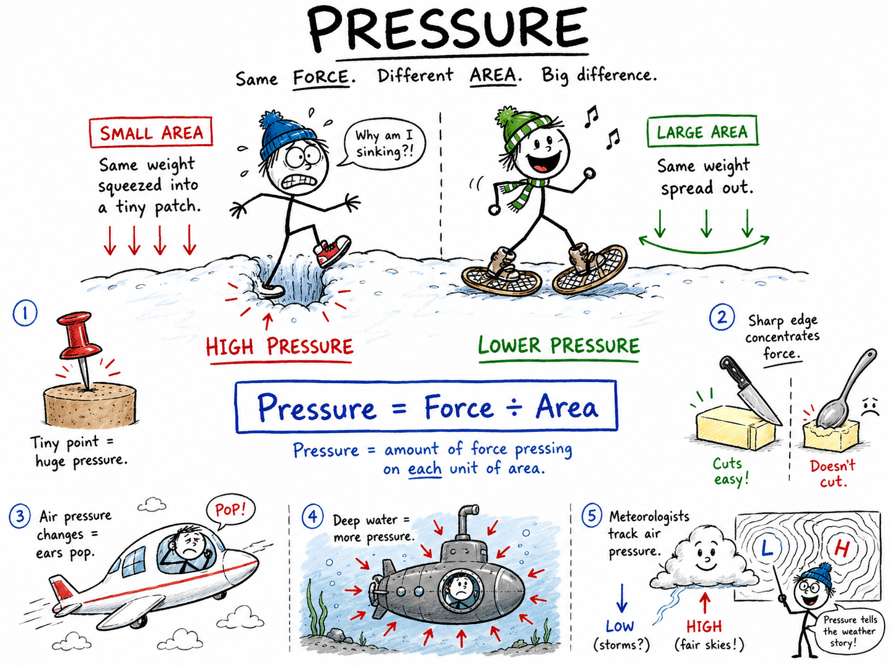

# Pressure

Imagine that you and a friend are walking across a field after a fresh snowfall.

You step forward in ordinary sneakers and sink nearly to your ankles. Your friend straps on snowshoes and walks across the same snow with much less trouble. He is not lighter than you. He may even be heavier. So why does he stay higher on the snow?

The answer is pressure.

Your sneakers press your weight onto a small area of snow. Snowshoes spread the same force over a much larger area. The force is more spread out, so each little patch of snow feels less pressure.

**Pressure is the amount of force pressing on each unit of area.**

Pressure explains why a thumbtack can pierce cork, why a knife cuts better than a spoon, why bicycle tires must be pumped up, why submarines need strong walls, why your ears may pop on an airplane, and why weather reports talk about rising and falling air pressure.

It is one of those science ideas that is simple enough to see in daily life but powerful enough to guide engineers, doctors, pilots, athletes, and meteorologists.

## Force and Area

To understand pressure, you need two ideas: **force** and **area**.

A **force** is a push or pull. Your weight is a force because gravity pulls your body downward. When you stand on the floor, your feet push down on the floor, and the floor pushes up on you.

**Area** is the size of a surface. The bottom of one sneaker has a certain area. A snowshoe has a much larger area. The point of a nail has a tiny area. The flat end of a hammer has a larger area.

Pressure depends on both force and area.

If the force gets larger while the area stays the same, pressure increases.

If the same force is spread over a larger area, pressure decreases.

This is why pressure is not exactly the same thing as force. Two situations can have the same force but different pressure.

## The Formula for Pressure

The basic formula for pressure is:

**Pressure = Force ÷ Area**

Scientists often write this as:

**P = F ÷ A**

In this formula:

- **P** means pressure.
- **F** means force.
- **A** means area.

The formula says that pressure is the force on each unit of area. If you divide the total push by the amount of surface it is spread across, you find the pressure.

For example, suppose a force of **100 newtons** is spread over **2 square meters**.

Use the formula:

**Pressure = Force ÷ Area**

**Pressure = 100 N ÷ 2 m²**

**Pressure = 50 N/m²**

That means each square meter feels 50 newtons of force.

## The Unit of Pressure: The Pascal

The standard scientific unit of pressure is the **pascal**, written as **Pa**.

One pascal means one newton of force spread over one square meter of area.

**1 Pa = 1 N/m²**

A pascal is a small amount of pressure, so you will often see larger units too.

**1 kilopascal = 1,000 pascals**

Car and bicycle tires are often measured in kilopascals or in pounds per square inch, written as **psi**. Weather maps often use millibars or hectopascals. Different fields use different pressure units, but the central idea is always the same: pressure compares force with area.

## Why Sharp Things Work

A sharp object works by concentrating force into a tiny area.

When you push a thumbtack into a bulletin board, your thumb presses on the broad, flat head. The head has enough area that it does not stab your thumb. The point, however, has a very small area. The force from your thumb is concentrated at the point, creating high pressure against the cork.

That high pressure lets the point enter the board.

The same idea explains many tools:

- A needle pierces cloth or skin because its point has a tiny area.
- A sharp knife cuts food because its edge concentrates force.
- A nail enters wood because the point creates high pressure.
- Ice skates glide and carve because thin blades concentrate a skater's weight.

If a knife becomes dull, its edge is wider. The same force is spread over more area, so the pressure is lower. That is why a dull knife does not cut as well.

## Why Wide Things Help

Sometimes engineers want less pressure, not more pressure.

Snowshoes reduce pressure by spreading a person's weight over a larger area. Skis do something similar. So do the wide tires on some tractors and off-road vehicles. A camel's broad feet help it walk across sand because its weight is spread out.

Backpack straps give another example. A heavy backpack with thin straps digs into your shoulders because the force is concentrated in a small area. Wider padded straps spread the same force across more of your shoulders, reducing pressure and making the pack more comfortable.

This is also why it is safer to lie flat on thin ice than to stand on it. Standing concentrates your weight through your feet. Lying down spreads your weight over a larger area. The force of your weight has not disappeared, but the pressure on each part of the ice is smaller.

## Pressure in Solids

When a solid object rests on another object, it can exert pressure.

A book sitting on a desk presses downward because gravity pulls the book toward Earth. The desk pushes upward on the book. The pressure depends on the weight of the book and the area touching the desk.

Turn the book so it rests on its broad cover. The same book weight is spread over a larger area, so the pressure on the desk is smaller.

Stand the book on one narrow edge. The same force is spread over a smaller area, so the pressure is greater.

The book did not gain weight. The area changed.

This habit of thinking is important: when pressure changes, ask which part changed. Did the force change? Did the area change? Did both change?

## Pressure in Liquids

Liquids exert pressure too.

If you dive into a swimming pool, you can feel water pushing on your body. The deeper you go, the more pressure you feel. Your ears may feel squeezed because water pressure is greater below the surface.

Water pressure increases with depth because deeper water has more water above it. That water has weight, and its weight presses downward. The deeper a point is, the more water is stacked above it.

This is why dams are built thicker at the bottom than at the top. The water pressure near the bottom of a dam is greater, so the lower part must be stronger.

Submarines must also be built to withstand huge water pressure. Deep in the ocean, water presses from all directions. A submarine hull must resist that pressure without collapsing.

## Fluids Push in Many Directions

A **fluid** is a substance that can flow. Liquids and gases are both fluids.

Fluids do not only push downward. They press in many directions.

If you squeeze a sealed plastic bottle filled with water, the pressure increases throughout the water. The water pushes outward on the sides of the bottle. If there is a weak spot, water may spray out.

This all-direction pressure is useful. Hydraulic machines use liquid pressure to lift heavy objects, move brakes, and operate construction equipment. When pressure is applied to a liquid in a closed system, the pressure can be transmitted through the liquid to do work somewhere else.

That is how a small push on a brake pedal can help stop a large car. The system uses fluid pressure to transfer force from the pedal to the brakes at the wheels.

## Air Pressure

Air may seem weightless, but it is made of gas particles, and those particles are moving all the time.

When gas particles collide with a surface, they exert tiny forces. Billions and billions of collisions together create air pressure.

Air pressure is the pressure caused by air pressing on surfaces.

At sea level, there is a tall column of air above you. That air has weight, so it presses downward and sideways. Your body is used to this pressure because fluids inside your body push outward too. The pressures are usually balanced, so you do not feel crushed.

Air pressure is lower high on a mountain because there is less air above you. With fewer air particles pressing and colliding, the pressure is lower. This is one reason breathing can feel harder at high altitude: the air is thinner, and each breath brings in fewer oxygen molecules.

## Airplanes, Ears, and Balloons

Changes in air pressure can be felt in your body.

When an airplane climbs, the air pressure outside the plane decreases. Air inside your middle ear may be at a different pressure from the cabin air. Your ears may pop as pressure equalizes through small tubes connected to your throat.

This can also happen when driving up or down a mountain.

Balloons show pressure in a visible way. When you blow air into a balloon, gas particles inside collide with the rubber and push outward. The stretched rubber pushes inward. The balloon keeps its shape when the outward pressure from the air and the inward pull of the rubber balance.

If you keep adding air, the pressure inside rises. Eventually the rubber may stretch too far and burst.

## Pressure and Weather

Weather depends partly on air pressure.

Meteorologists study areas of **high pressure** and **low pressure** in the atmosphere. Air moves from areas of higher pressure toward areas of lower pressure. That moving air is wind.

High-pressure systems often bring clearer, calmer weather because air tends to sink and spread out. Low-pressure systems often bring clouds, rain, snow, or storms because air tends to rise. As air rises, it cools, and water vapor may condense into clouds.

Weather is complicated, and pressure is only one part of the story. Temperature, humidity, wind, geography, and sunlight also matter. Still, air pressure gives meteorologists a powerful clue about what the atmosphere is doing.

## Pressure in Tires

A bicycle tire, basketball, football, or car tire works because air inside it is under pressure.

When you pump up a bicycle tire, you force more air particles into the tire. Those particles collide with the inside walls of the tire more often, increasing pressure. Higher pressure makes the tire firmer.

If a tire has too little pressure, it squashes too much against the ground. Pedaling becomes harder, the tire may wear out faster, and the rim may be damaged.

If a tire has too much pressure, the ride may become harsh, traction may decrease, and the tire may burst if it is pushed beyond its design limit.

Good pressure is not simply the highest pressure. It is the right pressure for the job.

## Pressure in the Human Body

Your body uses pressure every moment.

Blood pressure is the pressure of blood pushing against the walls of blood vessels. Your heart creates this pressure when it pumps. Blood pressure must be high enough to move blood around the body, but not so high that it damages blood vessels over time.

Breathing also depends on pressure differences. When you inhale, muscles in your chest help expand your lungs. This lowers the pressure inside your lungs compared with the outside air, so air flows in. When you exhale, pressure inside the lungs becomes higher than outside air, so air flows out.

Even drinking through a straw involves pressure. You lower the pressure inside the straw by sucking. The higher air pressure outside pushes down on the drink's surface and helps move the liquid up the straw.

## Pressure in Engineering

Engineers must understand pressure because pressure can be useful or dangerous.

Pressure is useful in:

- Hydraulic lifts that raise cars in repair shops.
- Syringes that move medicine through a small opening.
- Water towers that send water through pipes.
- Air brakes on trucks and trains.
- Spray bottles that force liquid out as a mist.
- Rocket engines that control hot gases under extreme conditions.

Pressure can also damage systems if it is not controlled. Pipes can burst, containers can explode, tires can fail, and deep-sea vehicles can collapse. Engineers use valves, gauges, strong materials, testing, and safety limits to manage pressure.

This is why pressure gauges are so common. They let people measure pressure instead of guessing.

## A Simple Pressure Calculation

Suppose a boy stands on one foot while wearing a shoe. His weight pushes down with a force of **500 newtons**. The area of the shoe touching the ground is **0.025 square meters**.

Use the formula:

**P = F ÷ A**

**P = 500 N ÷ 0.025 m²**

**P = 20,000 Pa**

Now suppose he puts on a snowshoe so the contact area becomes **0.25 square meters**.

**P = 500 N ÷ 0.25 m²**

**P = 2,000 Pa**

The force is the same, but the pressure is ten times smaller because the area is ten times larger.

This is the heart of pressure: force and area work together.

## Common Misconceptions

One common mistake is thinking pressure and force are the same thing. They are related, but they are not identical. Pressure depends on how much force is spread over how much area.

Another mistake is thinking pressure only pushes downward. Solids often press downward because of gravity, but fluids press in many directions. Water presses on the sides of a pool. Air presses on the walls of a balloon. Blood presses on the walls of blood vessels.

A third mistake is thinking high pressure is always bad. High pressure can be dangerous, but it can also be useful. The key is control. A hydraulic lift, a bicycle tire, and a water system all need pressure to work.

## The Big Idea

Pressure is force spread over area.

The most important formula is:

**P = F ÷ A**

Pressure increases when force increases. Pressure decreases when the same force is spread over a larger area. Solids, liquids, and gases can all exert pressure, and fluid pressure acts in many directions.

If you remember only one sentence, remember this:

**Pressure tells how concentrated a push is.**

## Study Questions

1. What is pressure in science?
2. What are force and area, and why do both matter when discussing pressure?
3. What is the formula for pressure, and what do the letters in the formula mean?
4. What is a pascal?
5. Why can a sharp thumbtack enter cork more easily than a flat coin?
6. Why do snowshoes help a person walk across soft snow?
7. How can the same book create different pressure on a desk without changing its weight?
8. Why does water pressure increase with depth?
9. Why are dams often built thicker at the bottom than at the top?
10. What is a fluid, and how do fluids exert pressure differently from many solid objects?
11. What causes air pressure?
12. Why is air pressure usually lower on a mountain than at sea level?
13. Why might your ears pop in an airplane or while driving in the mountains?
14. How does air pressure help meteorologists understand weather?
15. Why is the correct tire pressure important for a bicycle or car?
16. Give two examples of pressure in the human body.
17. Give two examples of pressure being used in technology or engineering.
18. Why can pressure be dangerous if it is not controlled?
19. A force of 100 newtons is spread over 2 square meters. What is the pressure?
20. A force of 300 newtons is spread over 0.5 square meters. What is the pressure?
21. In your own words, explain why pressure is best understood as force spread over area.
