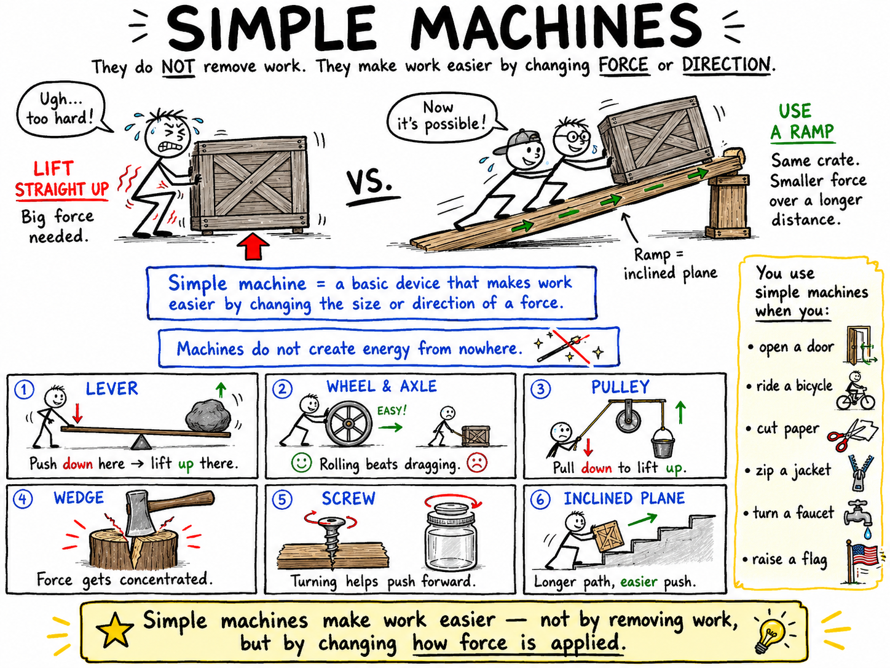
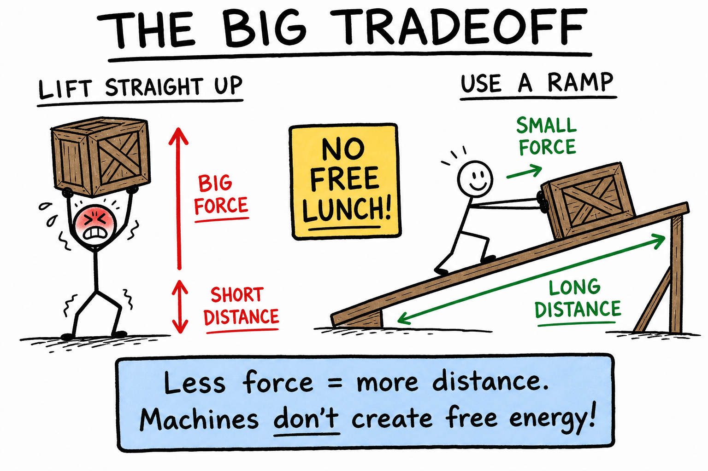
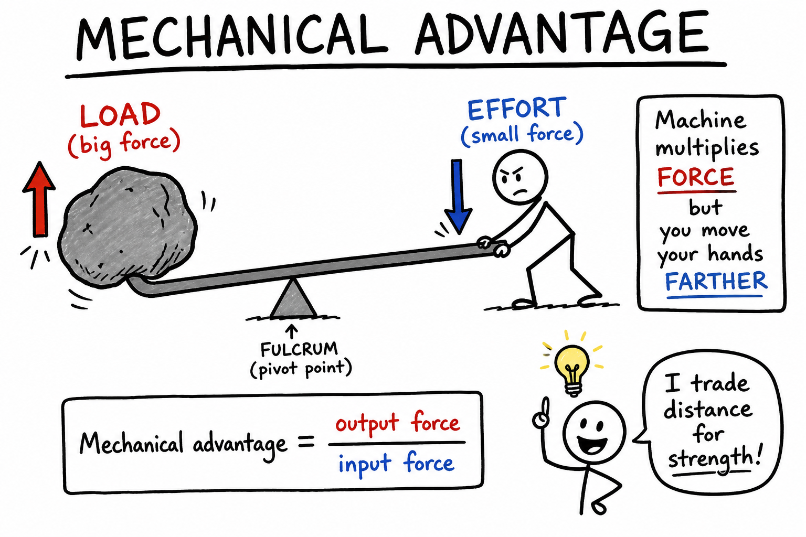
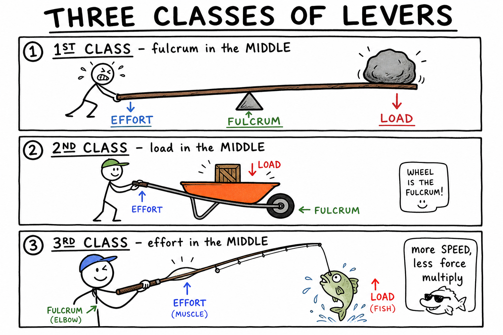
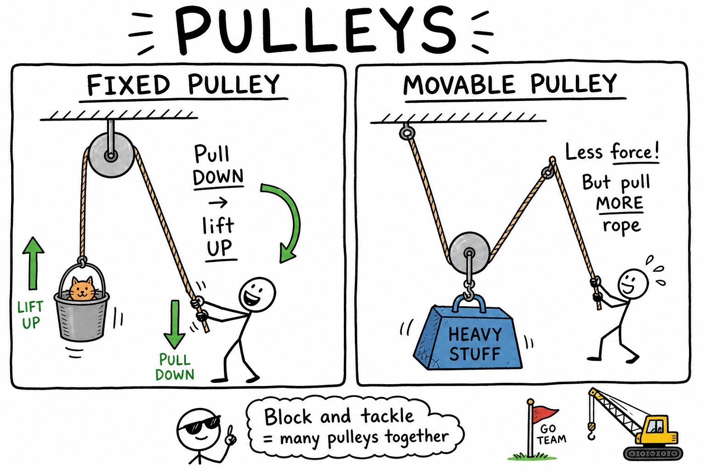
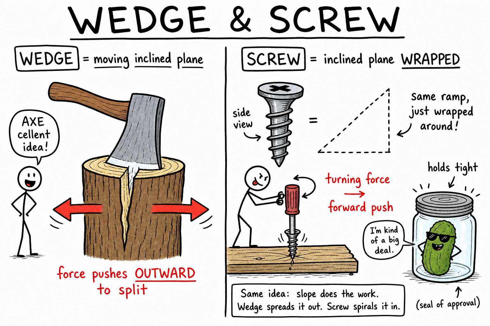
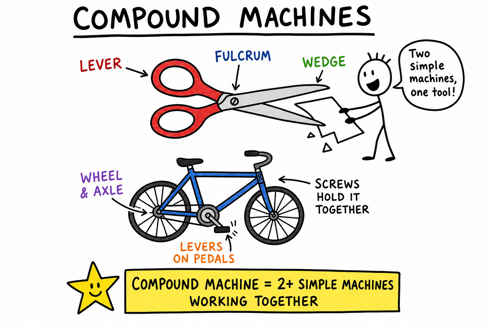

# Simple Machines

Imagine that a heavy wooden crate is sitting on the floor of a workshop. You try to lift it straight up, but it barely moves. Then an older student slides a long board onto a low platform, turning the board into a ramp. Together you push the crate up the ramp. It still takes effort, but now the job feels possible.

The ramp did not make the crate lighter. It did not create energy from nowhere. It changed how the work was done.

That is the power of a simple machine.

**A simple machine is a basic device that makes work easier by changing the size or direction of a force.**

Simple machines are among the oldest and most useful inventions in human history. Long before engines, electricity, computers, or robots, people used levers, ramps, wedges, wheels, pulleys, and screws to move stones, build houses, cut wood, carry water, raise sails, and shape tools.

Simple machines are still everywhere. You use them when you ride a bicycle, open a door, sharpen a pencil, climb stairs, zip a jacket, cut paper, turn a faucet, or raise a flag.

## Work Comes First

In science, **work** is done when a force moves an object through a distance in the direction of the force.

If you lift a backpack from the floor to a desk, you do work on the backpack. If you push a box across the floor, you do work on the box. If you push hard on a wall and the wall does not move, you may become tired, but in the scientific sense you have not done work on the wall because it did not move.

Simple machines help with work. They do not remove work completely. Instead, they change the way force and distance are arranged.

A simple machine may let you use a smaller force over a longer distance, or it may change the direction of your force so the job is easier to manage.

## The Big Tradeoff

There is an important rule:

**Simple machines do not give you something for nothing.**

If a machine lets you use less force, you usually have to apply that force over a greater distance.

Think about a ramp. Lifting a heavy box straight up to a truck bed may require a large upward force over a short distance. Pushing the box up a ramp requires less force, but you push it over a longer distance.

The total work can be similar, though real machines also lose some energy to friction.

This tradeoff is one of the great lessons of mechanics: machines can make a task more practical, but they cannot create free energy.

## Mechanical Advantage

The amount a machine multiplies force is called **mechanical advantage**.

If a machine lets you lift a heavy object with half the force you would normally need, it gives you a mechanical advantage. You gain force, but you usually pay for it by moving your hands, rope, or tool through a longer distance.

A long lever, a gentle ramp, and a many-rope pulley system can all provide mechanical advantage.

Engineers care about mechanical advantage because different jobs require different designs. Sometimes you want more force. Sometimes you want more speed. Sometimes you want a change in direction. A good machine fits the job.

## The Six Classical Simple Machines

Scientists and engineers often describe six classical simple machines:

- **Lever**
- **Wheel and axle**
- **Pulley**
- **Inclined plane**
- **Wedge**
- **Screw**

Many complicated machines are combinations of these simple machines. A bicycle, can opener, crane, wheelbarrow, fishing rod, scissors, and car engine all contain simple-machine ideas.

## Lever

A **lever** is a rigid bar that turns around a fixed point called a **fulcrum**.

Picture a seesaw. The board is the lever, and the support in the middle is the fulcrum. Push down on one end, and the other end rises.

Levers can multiply force, multiply speed, or change the direction of a force depending on where the fulcrum, effort, and load are placed.

The **effort** is the force you apply. The **load** is the object or resistance you are trying to move.

Examples of levers include:

- Seesaws
- Crowbars
- Bottle openers
- Wheelbarrows
- Fishing rods
- Tweezers
- Scissors

A crowbar gives mechanical advantage because a long handle lets you apply force far from the fulcrum. A small force at the long end can create a larger force near the short end, helping pry up a board or rock.

## Three Classes of Levers

Levers are often grouped into three classes.

In a **first-class lever**, the fulcrum is between the effort and the load. A seesaw and crowbar are common examples.

In a **second-class lever**, the load is between the fulcrum and the effort. A wheelbarrow is a good example. The wheel acts as the fulcrum, the load sits in the tray, and you lift at the handles.

In a **third-class lever**, the effort is between the fulcrum and the load. A fishing rod, baseball bat, broom, and many parts of the human body work this way. Third-class levers often do not multiply force, but they can multiply speed and range of motion.

Your arm is a useful example. When your biceps muscle pulls on your forearm, your elbow acts as the fulcrum. Your hand moves faster and farther than the small movement of the muscle.

## Wheel and Axle

A **wheel and axle** is a simple machine made of a larger wheel attached to a smaller axle so they turn together.

The wheel and axle can reduce friction, multiply force, or increase speed.

When you turn a doorknob, you are using a wheel and axle. The knob is the wheel, and the rod through the door is the axle. Your hand moves around a larger circle on the knob, making it easier to turn the smaller axle inside.

Examples include:

- Doorknobs
- Steering wheels
- Screwdrivers
- Bicycle wheels
- Rolling pins
- Wagon wheels
- Pencil sharpeners

Wheels also help by reducing sliding friction. Dragging a heavy suitcase across a floor is hard because it scrapes along the ground. Rolling it on wheels is easier because rolling friction is usually much smaller than sliding friction.

## Pulley

A **pulley** is a wheel with a groove that holds a rope, belt, or cable.

A fixed pulley changes the direction of a force. For example, a flagpole pulley lets you pull down on a rope to raise the flag upward. Pulling down is often easier than pulling up because you can use your body weight.

A movable pulley can provide mechanical advantage. If the pulley moves with the load, more than one section of rope helps support the weight. This means you can lift the load with less force, though you must pull more rope.

Several pulleys used together form a **block and tackle**. Sailors, builders, stage crews, and rescue workers use pulley systems to lift or control heavy objects.

Pulleys are common in cranes, elevators, theater curtains, gym equipment, sailboats, wells, and flagpoles.

## Inclined Plane

An **inclined plane** is a flat surface set at an angle. A ramp is an inclined plane.

Inclined planes make it easier to raise an object by spreading the work over a longer distance. Instead of lifting a load straight up, you push or pull it along a slope.

A gentle ramp requires less force than a steep ramp, but the gentle ramp is longer. Again, simple machines involve tradeoffs.

Examples include:

- Ramps
- Stairs
- Loading docks
- Playground slides
- Sloped roads
- Wheelchair ramps

The ramp is one of the most important simple machines because it makes lifting heavy loads practical. Ancient builders may have used ramps to move large stones. Modern workers use ramps to move furniture, equipment, and vehicles.

## Wedge

A **wedge** is like a moving inclined plane. It has one or two sloping sides and is used to split, cut, or hold objects.

When you push a wedge forward, it redirects force outward to the sides.

An axe blade is a wedge. When the blade enters wood, its sloping sides push the wood apart. A knife is a wedge that separates food. A nail is a wedge that pushes material aside as it enters.

Examples include:

- Axes
- Knives
- Chisels
- Nails
- Doorstops
- Zippers
- Shovel blades

A sharper wedge has a smaller edge, which can create higher pressure and cut more easily. A wider wedge may be stronger but may require more force to push into a material.

## Screw

A **screw** is an inclined plane wrapped around a cylinder.

The spiral ridge on a screw is called a **thread**. When you turn the screw, the thread moves forward into wood, metal, plastic, or another material.

A screw changes a turning force into a forward force. It can also hold objects tightly together because the thread creates friction and grips the material.

Examples include:

- Wood screws
- Jar lids
- Bolts
- Vises
- Clamps
- Light bulb bases
- Some jacks used to lift cars

The closer the threads are together, the more turns it takes to move the screw forward a certain distance. This may feel slower, but it can provide greater mechanical advantage and tighter control.

## Compound Machines

A **compound machine** is a machine made of two or more simple machines working together.

Scissors are a compound machine. The handles and blades act as levers, and the sharpened blades are wedges.

A wheelbarrow combines a lever with a wheel and axle.

A bicycle is full of simple machines. The pedals and crank act like levers and a wheel and axle. The wheels reduce friction. The chain and gears transfer motion. The brakes use levers. The screws and bolts hold the parts together.

Most machines around you are compound machines. Simple machines are the building blocks.

## Efficiency and Friction

In an ideal machine, the work you put in would equal the useful work you get out.

Real machines are not ideal. Some energy is always transformed into heat, sound, or unwanted motion, especially because of friction.

**Efficiency** describes how much input work becomes useful output work.

A rusty pulley wastes more energy than a smooth pulley. A rough ramp requires more force than a smooth ramp. A poorly oiled wheel and axle is harder to turn than a well-maintained one.

Lubricants, ball bearings, smooth surfaces, and careful design can reduce friction and improve efficiency.

Even a very efficient simple machine still follows the main tradeoff: less force usually means more distance.

## Simple Machines in the Human Body

Your body uses simple-machine principles.

Bones can act like levers. Joints can act like fulcrums. Muscles provide effort. Loads may be weights you lift, balls you throw, or your own body parts.

When you stand on tiptoe, the foot works like a lever. When you bite food, your jaw acts like a lever. When you swing a bat or throw a ball, your arms use lever action to move your hands quickly.

The body is not a machine made of metal, but the same physics ideas help explain how it moves.

## Choosing the Right Machine

A simple machine is useful only if it suits the job.

If you need to lift a heavy piano into a truck, a ramp may be better than trying to lift it straight up. If you need to open a paint can, a screwdriver used as a lever may help. If you need to raise a flag, a pulley is useful. If you need to hold wood together, screws may be better than smooth nails.

Good design asks:

- What force is needed?
- What direction should the force act?
- How far must the object move?
- How much friction will there be?
- How safe and controllable is the motion?

Engineers do not merely ask whether a machine works. They ask whether it works well for the exact task.

## Common Misconceptions

One common mistake is thinking simple machines reduce the total work to zero. They do not. They make work easier by changing force, distance, direction, or control.

Another mistake is thinking a machine that uses less force must always be better. Sometimes a design that gives more speed, precision, or compactness is better than one that gives maximum force.

A third mistake is forgetting friction. Real machines waste some energy, so the output work is always less than the input work.

Finally, do not think "simple" means unimportant. Simple machines are simple in design, but they are some of the most important ideas in all of engineering.

## The Big Idea

Simple machines make work easier by changing how force is applied.

They may multiply force, change direction, increase speed, improve control, or reduce friction. They do not create energy from nothing. When a machine lets you use less force, you usually apply that force over a longer distance.

The six classical simple machines are:

**Lever, wheel and axle, pulley, inclined plane, wedge, and screw.**

If you remember only one sentence, remember this:

**Simple machines help us trade force, distance, direction, and control to make work more practical.**

## Study Questions

1. What is a simple machine?
2. What does work mean in science?
3. Why do simple machines not give you "something for nothing"?
4. What is mechanical advantage?
5. Name the six classical simple machines.
6. What is a lever, and what is a fulcrum?
7. What are effort and load?
8. Give one example of each class of lever.
9. What is a wheel and axle, and how can it help with work?
10. How does a pulley change the direction of a force?
11. How can a movable pulley give mechanical advantage?
12. What is an inclined plane?
13. Why does a longer, gentler ramp usually require less force than a shorter, steeper ramp?
14. What is a wedge, and how does it work?
15. Why is a screw described as an inclined plane wrapped around a cylinder?
16. What is a compound machine?
17. Give two examples of compound machines and name the simple machines inside them.
18. How does friction affect real machines?
19. What does efficiency mean when discussing machines?
20. Give two examples of simple-machine ideas in the human body.
21. Why is the "best" simple machine for a job not always the one with the greatest mechanical advantage?
22. In your own words, explain the main tradeoff that simple machines use to make work easier.
