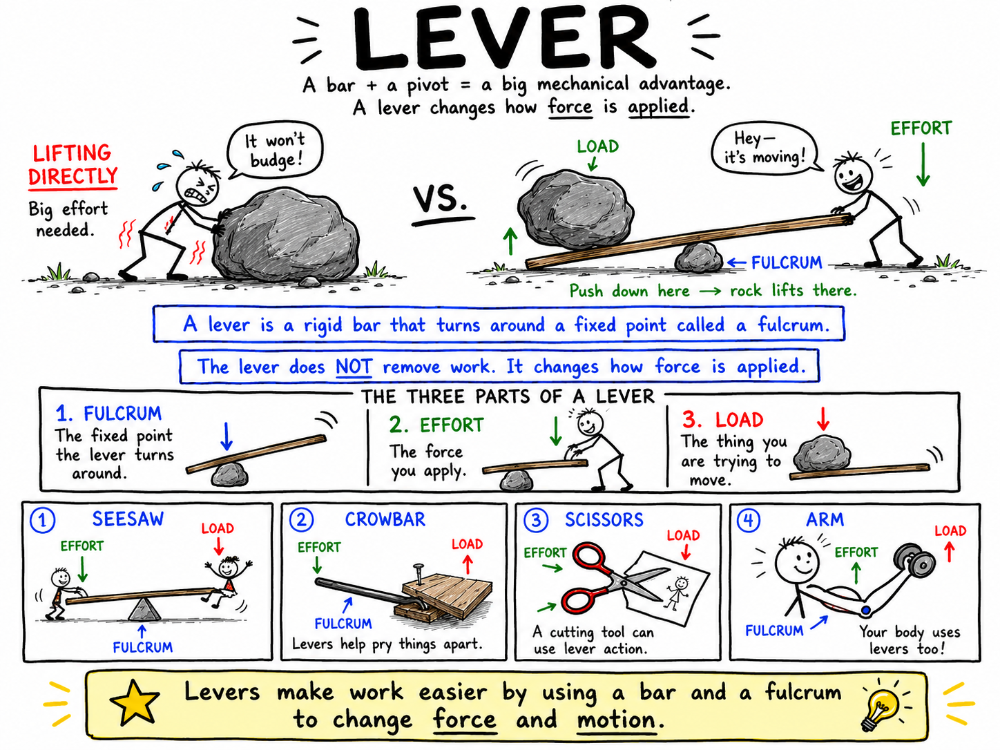

# Lever

Imagine that a large rock is sitting beside a trail. You try to lift it with your hands, but it will not budge. Then someone slides a strong stick under one edge of the rock and places a smaller stone under the stick as a support. He pushes down on the far end of the stick. Slowly, the heavy rock rises.

The stick did not make the rock lighter. It changed how the force was applied.

That stick is being used as a lever.

**A lever is a rigid bar that turns around a fixed point called a fulcrum.**

Levers are one of the six classical simple machines. They can help lift heavy objects, pry things apart, open lids, cut paper, swing bats, move parts of the body, and control machines. A lever may multiply force, change the direction of a force, or make an object move faster and farther.

Levers are simple, but they are not childish. They are among the deepest ideas in mechanics.

## The Three Parts of a Lever

Every lever has three important parts:

- **Fulcrum**
- **Effort**
- **Load**

The **fulcrum** is the fixed point or support around which the lever turns.

The **effort** is the force you apply to the lever.

The **load** is the object or resistance the lever is trying to move.

Picture a seesaw. The support in the middle is the fulcrum. A boy pushing down on one end provides the effort. The other boy being lifted is the load.

Once you know these three parts, you can understand almost any lever.

## Levers and Work

In science, **work** is done when a force moves an object through a distance in the direction of the force.

A lever can make work easier, but it does not make work disappear. Like all simple machines, it uses a tradeoff.

If a lever lets you use less force, you usually have to move your end of the lever a greater distance. If it makes something move faster or farther, you may have to use more force.

Levers help by rearranging force and distance.

That is why a long crowbar can lift a heavy board. Your hands move the long end of the crowbar down through a larger distance. The short end moves the board up through a smaller distance, but with a larger force.

## The Lever Arm

The distance from the fulcrum to the point where a force is applied is called the **lever arm**.

A longer lever arm gives a force more turning effect.

Try opening a door by pushing near the hinges. It is difficult. Now push near the handle. It is much easier. The door is like a lever turning around its hinges. The handle is far from the fulcrum, so your push has a greater turning effect.

This turning effect is often called **torque**.

You do not need advanced mathematics to understand the main idea:

**A force applied farther from the fulcrum has a greater turning effect.**

This is why wrenches have handles, why crowbars are long, why door handles are far from hinges, and why a baseball bat is swung from one end.

## Mechanical Advantage

**Mechanical advantage** describes how much a machine multiplies force.

A lever can give mechanical advantage when the effort is applied farther from the fulcrum than the load is.

Suppose a heavy rock is close to the fulcrum, and your hands push down far from the fulcrum. Your end of the lever moves a long distance, while the rock moves a short distance. The lever trades distance for force. You use less force than you would need to lift the rock directly.

This is the secret of many strong levers:

**Long effort arm, short load arm, greater force at the load.**

But the opposite can also happen. If the effort is close to the fulcrum and the load is far away, the lever may not multiply force. Instead, it can multiply speed and distance.

That is useful too.

## Balanced Levers

A seesaw can balance even when two riders have different weights.

If a heavier rider sits closer to the fulcrum and a lighter rider sits farther away, the seesaw may balance. The lighter rider's force is smaller, but the longer lever arm gives that force a greater turning effect.

This is why balance depends on both force and distance from the fulcrum.

A simple way to say it is:

**Turning effect depends on force and lever arm.**

This idea is useful in playgrounds, tools, cranes, bridges, and the human body.

## First-Class Levers

In a **first-class lever**, the fulcrum is between the effort and the load.

The pattern is:

**Effort - Fulcrum - Load**

or

**Load - Fulcrum - Effort**

A seesaw is a first-class lever. So is a crowbar used to pry up a board. Scissors are also built from first-class levers: the screw in the middle acts as the fulcrum, your fingers apply effort at the handles, and the blades move the load.

First-class levers can change the direction of a force. Push down on one side of a seesaw, and the other side goes up.

They can also multiply force or multiply speed, depending on where the fulcrum is placed.

Examples of first-class levers include:

- Seesaws
- Crowbars
- Scissors
- Pliers
- Balance scales
- Some pump handles

If the fulcrum is closer to the load, the lever can multiply force. If the fulcrum is closer to the effort, the lever can make the load move farther and faster.

## Second-Class Levers

In a **second-class lever**, the load is between the fulcrum and the effort.

The pattern is:

**Fulcrum - Load - Effort**

A wheelbarrow is a second-class lever. The wheel acts as the fulcrum. The dirt or bricks in the tray are the load. Your hands lifting the handles provide the effort.

A nutcracker is another example. The hinge is the fulcrum, the nut is the load, and your hands apply effort at the handles.

Second-class levers usually multiply force. They are good for lifting or squeezing heavy loads with less effort.

Examples of second-class levers include:

- Wheelbarrows
- Nutcrackers
- Bottle openers
- Some door handles
- Standing on tiptoe

When you stand on tiptoe, the ball of your foot acts like the fulcrum. Your body weight is the load. Your calf muscle provides the effort by pulling up on your heel. This lever helps lift your body.

## Third-Class Levers

In a **third-class lever**, the effort is between the fulcrum and the load.

The pattern is:

**Fulcrum - Effort - Load**

Third-class levers usually do not multiply force. In fact, they often require more effort than the load itself. So why are they useful?

They multiply speed and distance.

Your forearm is a third-class lever. Your elbow is the fulcrum. Your biceps muscle applies effort near the elbow. The load may be a book in your hand. Because your hand is far from the elbow, a small movement of the muscle can move your hand through a much greater distance.

This is excellent for throwing, swinging, reaching, and quick movement.

Examples of third-class levers include:

- Human forearms
- Fishing rods
- Baseball bats
- Brooms
- Hockey sticks
- Tweezers
- Shovels used to toss dirt

Third-class levers are common in the body because animals often need speed and range of motion more than raw force.

## Comparing the Three Classes

The three classes of levers are different because the fulcrum, effort, and load are arranged differently.

First-class lever: fulcrum in the middle.

Second-class lever: load in the middle.

Third-class lever: effort in the middle.

A good memory trick is:

**First has Fulcrum in the middle.**

**Second has Load in the middle.**

**Third has Effort in the middle.**

The arrangement changes what the lever is good at. Some levers are best for force. Others are best for speed, distance, direction change, or control.

## Levers in Tools

Many ordinary tools use levers.

A hammer pulling a nail acts as a lever. The curved head rests on the wood as a fulcrum. Your hand applies effort on the handle. The nail is the load.

Pliers use two first-class levers joined at a pivot. Your hands squeeze the handles, and the jaws grip, bend, or cut. Long handles and short jaws can create large force at the jaws.

A bottle opener is a second-class lever. The edge of the cap is the load, the lip of the opener touching the bottle is the fulcrum, and your hand applies effort at the handle.

Tweezers are third-class levers. The joined end acts as the fulcrum, your fingers apply effort in the middle, and the tips move to grip small objects.

Each tool is shaped to put the fulcrum, effort, and load in useful positions.

## Levers in Sports

Sports are full of levers.

A baseball bat is a lever that helps the end of the bat move very fast. A hockey stick, lacrosse stick, tennis racket, golf club, and fishing rod all use lever action to increase speed and reach.

When a boy throws a ball, his body uses a chain of levers. Legs, hips, torso, shoulder, arm, wrist, and fingers all contribute. Each part helps transfer motion to the next. By the time the ball leaves the hand, it can be moving very quickly.

Levers explain why technique matters. A well-timed swing or throw uses body levers in the right order. Poor timing wastes motion and reduces power.

## Levers in the Human Body

Your skeleton is a lever system.

Bones are rigid bars. Joints are fulcrums. Muscles provide effort by pulling on bones. Loads include body parts, objects you carry, or resistance from the ground.

The body contains all three classes of levers, but third-class levers are especially common.

Your neck can act as a first-class lever when muscles hold your head balanced on the spine.

Your foot acts as a second-class lever when you stand on tiptoe.

Your forearm acts as a third-class lever when your biceps lift your hand.

The body often sacrifices force advantage for speed, flexibility, and range of motion. That is why you can move your hands and feet quickly, even though your muscles must work hard.

## Levers and Safety

Levers can multiply force, which means they can also cause damage if used carelessly.

A crowbar can pry apart boards, but it can also snap wood, slip, or pinch fingers. A long wrench can loosen a stubborn bolt, but too much force can strip the bolt or break the tool. Scissors and pliers concentrate force at their jaws or blades, so they must be handled with care.

A lever gives you power through design. That power should be controlled.

Good safety habits include:

- Keep fingers away from pinch points.
- Use the right-sized tool.
- Make sure the fulcrum is stable.
- Push or pull steadily rather than jerking.
- Wear eye protection when prying, cutting, or working with stiff materials.

Understanding levers helps you use tools more intelligently and safely.

## A Simple Lever Calculation

For a balanced lever, the turning effect on one side equals the turning effect on the other side.

A simple version is:

**Force × distance from fulcrum = Force × distance from fulcrum**

Suppose a 400-newton load is 0.5 meters from the fulcrum. A boy pushes down 2 meters from the fulcrum on the other side.

The load's turning effect is:

**400 N × 0.5 m = 200 N·m**

To balance it, the boy needs the same turning effect:

**Effort × 2 m = 200 N·m**

**Effort = 100 N**

The lever lets him balance a 400-newton load with only 100 newtons of effort because his effort is applied farther from the fulcrum.

This calculation is a simplified model, but it shows the main idea clearly: distance from the fulcrum matters.

## Common Misconceptions

One common mistake is thinking all levers multiply force. They do not. Some levers multiply force, but others multiply speed or distance.

Another mistake is thinking the fulcrum must always be in the middle. The fulcrum can be in the middle, at one end, or arranged with the effort and load in different places.

A third mistake is thinking a longer lever is always better. A longer lever may give more mechanical advantage, but it may also be harder to control, too large for the job, or likely to break.

Finally, remember that levers do not create energy. They trade force and distance, or change direction and control.

## The Big Idea

A lever is a rigid bar that turns around a fulcrum.

Every lever has a fulcrum, effort, and load. The arrangement of those parts determines whether the lever multiplies force, changes direction, or increases speed and distance.

The three lever classes are:

**First-class: fulcrum in the middle.**

**Second-class: load in the middle.**

**Third-class: effort in the middle.**

If you remember only one sentence, remember this:

**A lever makes work more practical by using distance from a fulcrum to change force, motion, or direction.**

## Study Questions

1. What is a lever?
2. What is a fulcrum?
3. What are effort and load?
4. How can a lever make work easier without making work disappear?
5. What is a lever arm?
6. Why is it easier to open a door by pushing near the handle than near the hinges?
7. What does mechanical advantage mean?
8. How can a lever multiply force?
9. Why can two riders of different weights balance on a seesaw?
10. What is a first-class lever?
11. Give three examples of first-class levers.
12. What is a second-class lever?
13. Give three examples of second-class levers.
14. What is a third-class lever?
15. Give three examples of third-class levers.
16. Why are third-class levers useful even though they often do not multiply force?
17. How does a hammer pulling a nail act as a lever?
18. Give two examples of levers in sports.
19. How do bones, joints, and muscles work like levers in the human body?
20. Why can levers be dangerous if used carelessly?
21. A 400 N load is 0.5 m from the fulcrum. How much effort is needed 2 m from the fulcrum to balance it?
22. In your own words, explain why distance from the fulcrum matters.
