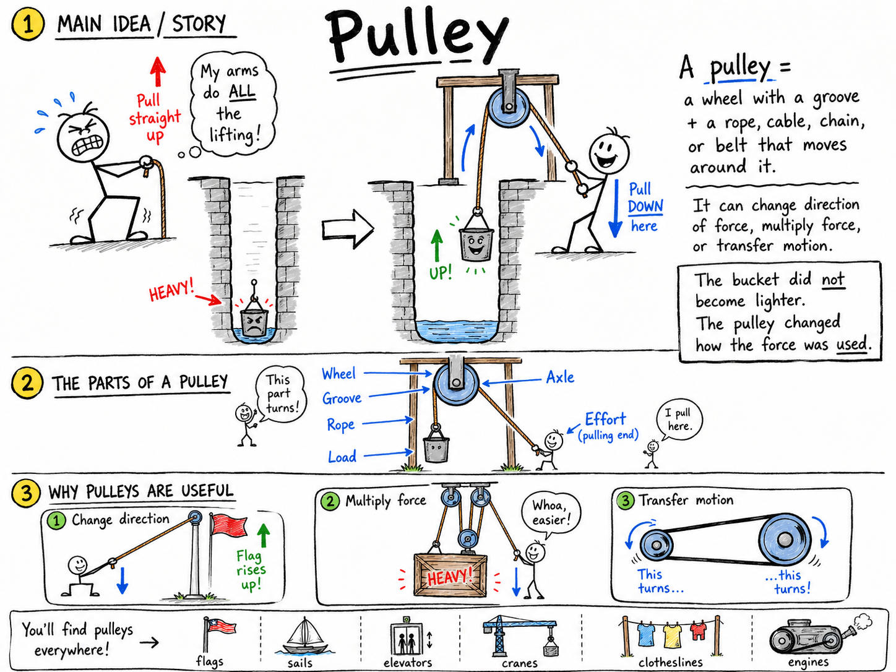

# Pulley

Imagine that you and a friend are trying to lift a heavy bucket from the bottom of a deep well. If you simply grab the rope and pull straight up, your arms must do all the lifting. But if the rope runs over a wheel at the top of the well, the job suddenly feels more natural. You can pull down on the rope while the bucket rises up.

The bucket did not become lighter. The pulley changed how the force was used.

That wheel and rope form a pulley.

**A pulley is a simple machine made from a wheel with a groove and a rope, cable, chain, or belt that moves around it.**

Pulleys are one of the six classical simple machines. They are used to lift flags, raise sails, move elevators, operate cranes, tighten clotheslines, run engines, and help workers lift heavy loads. A pulley can change the direction of a force, multiply force, or transfer motion from one place to another.

Pulleys may look humble, but they are among the most useful machines ever invented.

## The Parts of a Pulley

A simple pulley system has a few important parts:

- **Wheel**
- **Groove**
- **Rope**
- **Axle**
- **Load**
- **Effort**

The **wheel** is the round part that turns.

The **groove** is the channel around the edge of the wheel. It helps keep the rope from slipping off.

The **rope** may also be a cable, chain, or belt. It carries the pull from one place to another.

The **axle** is the rod or pin through the center of the wheel. The wheel turns around the axle.

The **load** is the object being moved or lifted.

The **effort** is the force applied by a person, animal, motor, or other source.

Once you can identify these parts, you can understand almost any pulley system.

## Pulleys and Work

In science, **work** is done when a force moves an object through a distance in the direction of the force.

A pulley can make work easier, but it does not make work disappear. Like all simple machines, it uses a tradeoff.

If a pulley system lets you lift a heavy load with less force, you usually have to pull more rope. If it changes the direction of your pull, it may make the task more convenient without reducing the force much.

Pulleys help by rearranging force, distance, and direction.

This is why a sailor can raise a sail by pulling down on a rope, why a crane can lift steel beams, and why a flag can rise while the person at the flagpole pulls downward.

## The Fixed Pulley

A **fixed pulley** is attached to a support and stays in one place while the rope moves over it.

The pulley at the top of a flagpole is a fixed pulley. The wheel stays near the top. When you pull down on one side of the rope, the flag moves up on the other side.

The most important job of a fixed pulley is to change the direction of a force.

Without the pulley, you would have to lift the flag upward. With the pulley, you pull downward. Pulling downward can be easier because you can use your body weight and a comfortable motion.

A single fixed pulley usually does not multiply force. If the flag and rope require a 20-newton upward force, you must pull with about 20 newtons of effort, not counting friction.

The advantage is direction and control.

## The Movable Pulley

A **movable pulley** is attached to the load and moves with it.

Picture a heavy crate hanging from a pulley. One end of the rope is tied to a beam above. The rope runs down around the pulley attached to the crate, then back up to your hands or another support. When you pull the rope, the pulley and crate rise together.

A movable pulley can multiply force because the load is supported by more than one section of rope.

If two rope sections support the load, each section carries part of the weight. In an ideal system with no friction, you may need only half as much force to lift the load.

But there is a tradeoff.

If the load rises 1 meter, you must pull about 2 meters of rope. You use less force, but you pull over a greater distance.

That is the pulley bargain:

**Less force usually means more rope must be pulled.**

## Mechanical Advantage

**Mechanical advantage** describes how much a machine multiplies force.

For an ideal pulley system, the mechanical advantage is often equal to the number of rope sections supporting the load.

If one rope section supports the load, the mechanical advantage is about 1. The pulley may change direction, but it does not reduce the force much.

If two rope sections support the load, the mechanical advantage is about 2. You use about half the force, but pull twice as much rope.

If four rope sections support the load, the mechanical advantage is about 4. You use about one-fourth the force, but pull four times as much rope.

This rule is a helpful model:

**Count the rope sections that actually support the moving load.**

Do not count the loose end of the rope unless it is also supporting the load. In many classroom examples, the loose pulling end changes direction or gives you a place to apply effort, but it may not hold up the load.

## Compound Pulleys

A **compound pulley** uses fixed and movable pulleys together.

The fixed pulley changes the direction of the pull. The movable pulley multiplies force. Working together, they can make heavy lifting much easier.

Suppose a system has one fixed pulley at the top and one movable pulley attached to a crate. You pull down on the free end of the rope. The fixed pulley lets you pull downward. The movable pulley means two rope sections support the crate.

In an ideal system, the effort needed is about half the load's weight.

Real systems are not perfect. Friction in the pulley wheels, stiffness in the rope, and the weight of the pulleys themselves all reduce the benefit. Still, compound pulleys can provide powerful mechanical advantage.

## Block and Tackle

A **block and tackle** is a special compound pulley system used for lifting heavy loads.

A **block** is a frame that holds one or more pulley wheels. The **tackle** is the rope or system of ropes threaded through the blocks.

Block and tackle systems have been used on sailing ships, in barns, in workshops, in theaters, and on construction sites. A few pulleys arranged correctly can allow one person to lift a load that would otherwise require several people.

The more rope sections supporting the load, the greater the mechanical advantage. But the more sections there are, the more rope must be pulled.

This is why lifting a heavy object with a block and tackle may involve pulling a long length of rope while the object rises only a short distance.

The machine is not cheating nature. It is trading distance for force.

## Direction Matters

One of the simplest but most useful things a pulley can do is change direction.

Pulling down is often easier than pulling up. Your body can lean into the motion. Gravity helps your weight press downward. Your feet can push against the ground.

This matters in real life.

On a flagpole, a fixed pulley lets someone standing on the ground raise a flag far above his head.

On a sailboat, pulleys let sailors pull ropes from useful positions rather than climbing up a mast.

In a theater, pulleys let stagehands raise curtains, lights, and scenery from safe places.

Changing direction may not sound as impressive as lifting a huge load, but it often makes a job possible, safe, and controlled.

## Pulleys in Elevators and Cranes

Elevators and cranes use pulley ideas, though the real machines are more complex than classroom examples.

Many elevators use strong cables running over sheaves, which are pulley wheels designed for cables. An electric motor turns the system. A counterweight may move in the opposite direction of the elevator car, helping balance the load and reducing the motor's work.

Cranes use cables and pulley systems to lift heavy materials at construction sites and docks. The pulleys help guide the cable, multiply force, and control the load.

In both cases, engineers must think about force, distance, friction, balance, safety, and the strength of every part.

The same simple-machine idea that raises a classroom flag can also help raise steel beams into the sky.

## Pulleys in Everyday Life

Pulleys are common once you know how to look for them.

You may find pulleys in:

- Flagpoles
- Window blinds
- Clotheslines
- Wells
- Sailboats
- Cranes
- Elevators
- Theater curtains
- Garage doors
- Exercise machines
- Some engines and machines with belts

In a belt-driven machine, a belt runs around pulleys to transfer motion from one rotating shaft to another. This kind of pulley may not be lifting a load, but it still uses a wheel and belt to move force and motion.

For example, a belt in a machine can connect a motor to another part that needs to spin. By changing pulley sizes, engineers can change speed and turning force.

## Pulley Size and Speed

When pulleys are connected by a belt, the sizes of the pulleys matter.

If a small pulley drives a larger pulley, the larger pulley turns more slowly but with more turning force.

If a large pulley drives a smaller pulley, the smaller pulley turns faster but with less turning force.

This idea appears in machines, engines, workshop tools, and some exercise equipment. It is closely related to the idea of mechanical advantage: machines often trade force for speed, or speed for force.

You do not need to memorize advanced formulas yet. The main point is simple:

**Pulley systems can change force, direction, distance, and speed.**

## Friction and Efficiency

An ideal pulley would have no friction, no rope stiffness, and no extra weight. Real pulleys are not ideal.

Friction occurs where the wheel turns around the axle and where the rope bends around the wheel. Some of your input energy becomes heat or sound instead of useful lifting work.

This means real pulley systems are less efficient than perfect models.

If a textbook says a two-rope movable pulley cuts the needed force in half, that is an ideal answer. In real life, you may need a little more force because friction must also be overcome.

Good pulleys reduce friction by using smooth wheels, proper grooves, strong bearings, and ropes or cables suited to the job.

## A Simple Pulley Calculation

Suppose a 200-newton load is lifted by an ideal pulley system with two rope sections supporting the load.

The mechanical advantage is 2.

So the effort needed is:

**200 N ÷ 2 = 100 N**

The load requires only 100 newtons of effort in the ideal system.

But if the load rises 1 meter, about 2 meters of rope must be pulled.

Now suppose a 400-newton load is supported by four rope sections.

The mechanical advantage is 4.

**400 N ÷ 4 = 100 N**

Again, the ideal effort is 100 newtons. But the worker must pull about 4 meters of rope for every 1 meter the load rises.

The calculation shows the main idea clearly:

**Pulleys trade force for distance.**

## Safety with Pulleys

Pulleys can lift heavy objects, so they must be used carefully.

A rope under tension can snap back dangerously if it breaks. A load can fall if the rope slips, the knot fails, the support breaks, or the pulley is overloaded. Fingers can be pinched between a rope and pulley wheel.

Good safety habits include:

- Keep hands away from moving ropes, wheels, and pinch points.
- Never stand under a suspended load.
- Use rope, cable, hooks, and supports strong enough for the load.
- Pull smoothly instead of jerking.
- Check knots, attachments, and pulleys before lifting.
- Wear eye protection and gloves when appropriate.

A pulley gives control over force. That control must be treated with respect.

## Common Misconceptions

One common mistake is thinking every pulley reduces the force needed. A single fixed pulley usually changes direction, not force.

Another mistake is thinking a movable pulley gets something for nothing. It can reduce effort, but only because more rope must be pulled.

A third mistake is forgetting friction. Real pulleys are less efficient than ideal pulleys.

Finally, some students count every rope they see when finding mechanical advantage. The better rule is to count only the rope sections supporting the moving load.

## The Big Idea

A pulley is a wheel with a grooved edge that guides a rope, cable, chain, or belt.

Pulleys make work more practical by changing the direction of a force, multiplying force, transferring motion, or changing speed. Fixed pulleys are especially useful for changing direction. Movable pulleys and compound pulleys can provide mechanical advantage.

If you remember only one sentence, remember this:

**A pulley makes work easier by using rope and wheels to trade force, distance, direction, and control.**

## Study Questions

1. What is a pulley?
2. What are the main parts of a pulley system?
3. What are the effort and the load in a pulley system?
4. How can a pulley make work easier without making work disappear?
5. What is a fixed pulley?
6. What is the main advantage of a fixed pulley?
7. What is a movable pulley?
8. How can a movable pulley multiply force?
9. Why must you pull more rope when a pulley system reduces the force needed?
10. What does mechanical advantage mean?
11. In an ideal pulley system, how can you estimate mechanical advantage?
12. What is a compound pulley?
13. What is a block and tackle?
14. Why is changing the direction of a force useful?
15. Give three everyday examples of pulleys.
16. How do pulleys help in cranes or elevators?
17. How can pulley size affect speed in a belt-driven machine?
18. How does friction affect real pulley systems?
19. A 200 N load is supported by two rope sections in an ideal pulley system. How much effort is needed to lift it?
20. A 400 N load is supported by four rope sections in an ideal pulley system. How much effort is needed to lift it?
21. Why should you never stand under a suspended load?
22. In your own words, explain the main tradeoff that makes pulleys useful.
