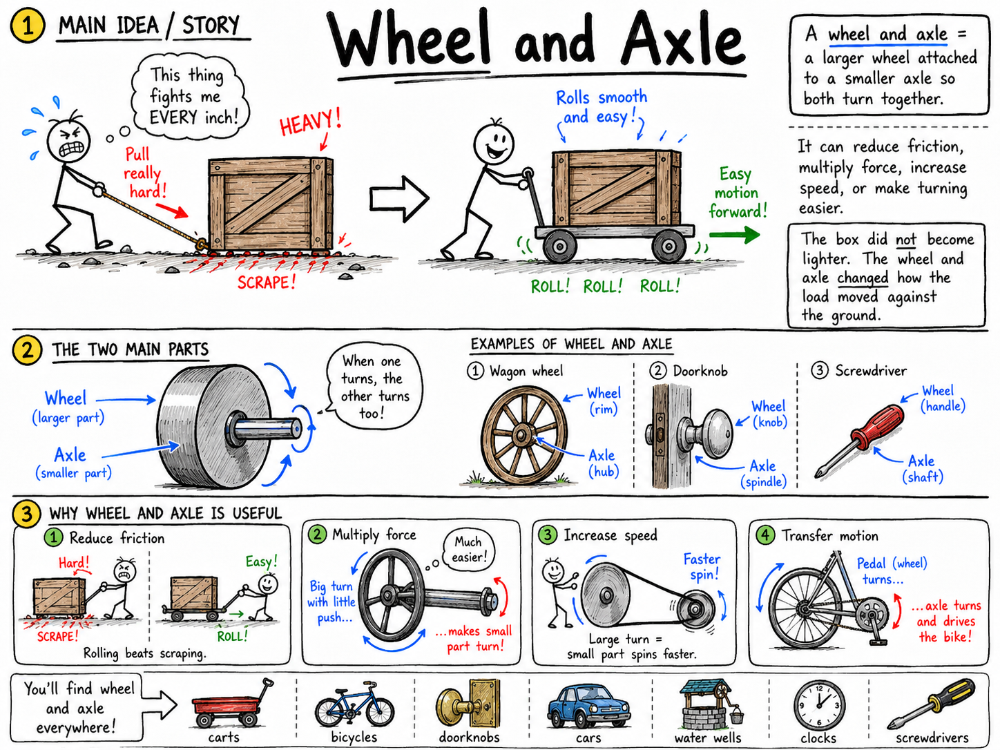

# Wheel And Axle

Imagine trying to drag a heavy wooden box across a rough floor. It scrapes, catches, and fights you every inch of the way. Now imagine placing that box on a cart with wheels. Suddenly the same load rolls forward with far less effort.

The box did not become lighter. The wheels changed the way the load moved against the ground.

That is the power of the wheel and axle.

**A wheel and axle is a simple machine made of a larger wheel attached to a smaller axle so that both turn together.**

The wheel and axle is one of the six classical simple machines. It helps carts roll, doors open, clocks turn, cars move, water wells work, bicycles travel, and machines transfer motion. It can reduce friction, multiply force, increase speed, or make turning easier.

The wheel may seem ordinary because you see it everywhere. But that is exactly why it matters. Few inventions have changed human life more.

## The Two Main Parts

A wheel and axle has two main parts:

- **Wheel**
- **Axle**

The **wheel** is the larger round part.

The **axle** is the smaller rod or shaft attached to the wheel.

When the wheel turns, the axle turns with it. When the axle turns, the wheel turns with it. The two parts act as one machine.

On a wagon, the wheels are the large round parts, and the axle is the rod passing through or between them. On a doorknob, the knob is the wheel, and the metal shaft inside the door is the axle. On a screwdriver, the handle acts like the wheel, and the metal shaft acts like the axle.

Once you understand that wheel and axle turn together, you can recognize this machine in many places.

## Wheel And Axle and Work

In science, **work** is done when a force moves an object through a distance in the direction of the force.

A wheel and axle can make work easier, but it does not make work disappear. Like all simple machines, it uses a tradeoff.

Sometimes the wheel and axle lets you use less force by applying that force over a greater distance. Sometimes it makes something move faster by requiring more force. Sometimes it reduces friction so less energy is wasted dragging or sliding.

The main idea is simple:

**A wheel and axle helps by changing force, distance, speed, or friction.**

## Rolling Instead of Sliding

One of the greatest uses of the wheel is that it lets objects roll instead of slide.

Sliding a heavy object across the ground creates a lot of friction. The object rubs against the surface the whole way.

Rolling usually creates much less friction. A wheel touches the ground at a small contact area, turns around its axle, and carries the load forward more smoothly.

This is why wagons, bicycles, carts, wheelchairs, suitcases, skateboards, and cars use wheels. The wheels do not remove the weight of the load, but they make the load easier to move.

If you have ever dragged a heavy backpack and then rolled a suitcase, you have felt the difference between sliding friction and rolling motion.

## The Axle

The axle is easy to overlook because it is often hidden, but it is essential.

The axle gives the wheel something to turn around or turn with. In many machines, the axle also carries force from the wheel to another part.

On a cart, an axle may support the wheels and help them stay aligned. In a car, axles help transfer turning force to the wheels. In a simple hand crank, turning the crank turns the axle, and the axle may wind up a rope or move another machine part.

The axle must be strong enough to carry the load and smooth enough to turn without too much friction.

## Mechanical Advantage

**Mechanical advantage** describes how much a machine multiplies force.

A wheel and axle can multiply force when effort is applied to the larger wheel and the load is moved by the smaller axle.

Think about a doorknob. Your hand turns the large knob. The knob turns a smaller shaft inside the door. Because your hand pushes far from the center, it creates a greater turning effect on the axle.

The same idea appears in a steering wheel, a ship's wheel, a faucet handle, and a screwdriver with a thick handle.

The larger the wheel is compared with the axle, the more force multiplication the machine can provide when effort is applied at the wheel.

A simple way to say it is:

**Large wheel, small axle, greater turning force at the axle.**

## Turning Effect and Radius

The distance from the center of a circle to its edge is called the **radius**.

When you push on the outside of a wheel, you are applying force at a distance from the center. That distance gives your push a turning effect, or **torque**.

A larger wheel gives your hand a longer radius. A longer radius gives the same force a greater turning effect.

This is why a wide doorknob is easier to turn than a very tiny knob. It is also why a long wrench is easier to use than a short wrench, though a wrench is usually discussed as a lever. In both cases, applying force farther from the turning point increases turning effect.

For wheel and axle machines, the important comparison is usually the radius of the wheel and the radius of the axle.

## A Simple Wheel And Axle Calculation

In an ideal wheel and axle, the mechanical advantage can be estimated by comparing the radius of the wheel to the radius of the axle.

The simple formula is:

**Mechanical advantage = radius of wheel ÷ radius of axle**

Suppose a wheel has a radius of 20 centimeters, and its axle has a radius of 5 centimeters.

The mechanical advantage is:

**20 cm ÷ 5 cm = 4**

In an ideal machine, this means the wheel and axle can multiply force by 4 when effort is applied to the wheel.

If a load requires 80 newtons of force at the axle, the ideal effort at the wheel would be:

**80 N ÷ 4 = 20 N**

This is a simplified model because real machines have friction, but it shows the main idea clearly:

**A larger wheel compared with the axle can multiply force.**

## Speed Advantage

A wheel and axle can also work the other way.

If effort is applied to the axle, the larger wheel may move faster and farther around its outside edge.

Picture a small axle turning a large wheel. One complete turn of the axle makes the wheel complete one turn too. But the edge of the large wheel travels a much greater distance than the edge of the small axle.

This can be useful when a machine needs speed or distance rather than force multiplication.

For example, in many vehicles, turning parts inside the machine eventually make the wheels spin. The outer edge of each wheel covers a large distance with every turn, carrying the vehicle forward.

The tradeoff is familiar:

**More speed or distance usually means less force advantage.**

## Wheels on Vehicles

Vehicles are the most famous use of the wheel and axle.

A wheel allows a vehicle to roll over the ground. The axle keeps the wheel in place and helps it turn. Together, they reduce the friction that would occur if the vehicle had to slide.

In a wagon, cart, bicycle, or car, the wheel and axle must also support weight. The wheels must be round, strong, and properly aligned. The axle must handle forces from bumps, turns, starts, and stops.

Wheels also allow steering and control. A bicycle rider can balance, turn, and coast because the wheels roll smoothly beneath him. A skateboarder can glide because small wheels turn around axles instead of scraping across the pavement.

The wheel and axle does not merely make movement easier. It makes many kinds of movement practical.

## Wheels for Turning Things

Many wheel and axle machines are not used for rolling across the ground. They are used for turning.

Examples include:

- Doorknobs
- Steering wheels
- Faucet handles
- Screwdrivers
- Hand drills
- Winches
- Fishing reels
- Pencil sharpeners
- Windlasses on wells

In these machines, the wheel or handle lets a person apply force at a larger radius. That force turns the axle, which does useful work.

A windlass is a good example. It is a cylinder or axle turned by a crank. A rope winds around the axle and raises a bucket from a well. The crank handle acts like a wheel, letting a smaller effort lift a heavier load.

## Wheels, Axles, and Belts

Wheel and axle ideas also appear in machines that use belts.

A belt can run around wheels called pulleys. When one wheel turns, the belt makes another wheel turn. This transfers motion from one place to another.

If the driving wheel and driven wheel are different sizes, the system can change speed and turning force.

A large wheel turning a smaller wheel can make the smaller wheel spin faster. A small wheel turning a larger wheel can make the larger wheel spin more slowly but with greater turning force.

This is why wheel and axle ideas connect closely with pulleys, gears, bicycles, engines, workshop tools, and many machines.

## Gears as Related Machines

Gears are not usually listed as one of the six classical simple machines, but they are closely related to wheels and axles.

A **gear** is a wheel with teeth around its edge. The teeth fit with the teeth of another gear. When one gear turns, it pushes the other gear around.

Gears can change speed, direction, and turning force. A small gear driving a large gear can increase turning force. A large gear driving a small gear can increase speed.

Bicycles use gears so the rider can choose between easier pedaling up a hill and faster travel on flat ground.

Gears show that the wheel and axle idea can become part of more complex machines.

## The Wheel And Axle in the Human World

The wheel and axle changed transportation, farming, war, building, trade, and daily life.

Before wheeled vehicles, people moved heavy loads by carrying, dragging, or using sledges and rollers. Wheels made it easier to move goods over roads and paths. Carts and wagons allowed farmers to carry crops, builders to move materials, and merchants to trade over longer distances.

Later, wheels appeared in mills, clocks, spinning machines, factories, bicycles, trains, cars, and airplanes.

A simple round shape turning around an axle helped build the modern world.

## Friction and Bearings

Even rolling machines have friction.

Friction occurs where the axle rubs against its support, where the wheel touches the ground, and where parts bend or press against each other. Too much friction wastes energy as heat and makes the machine harder to use.

Engineers reduce friction with smooth surfaces, oil or grease, and **bearings**.

A **bearing** is a part that helps another part turn smoothly. Ball bearings use small metal balls that roll between surfaces. Instead of two surfaces grinding directly against each other, the balls roll, reducing friction.

This is why bicycle wheels, skateboard wheels, car wheels, and many motors use bearings.

## Tires and Traction

Wheels need low friction to roll easily, but they also need enough grip to avoid slipping.

This useful grip is called **traction**.

A car tire must grip the road so the car can start, stop, and turn. A bicycle tire must grip pavement or dirt. A train wheel must grip the rail enough to pull heavy cars.

Too little traction causes slipping. Too much unwanted friction wastes energy. Good wheel design balances easy rolling with useful grip.

This is why tires have rubber, tread patterns, and proper air pressure.

## Common Misconceptions

One common mistake is thinking a wheel and axle always multiplies force. It does not. Sometimes it multiplies force, and sometimes it increases speed or distance.

Another mistake is thinking wheels remove weight. They do not. Wheels reduce the friction involved in moving a load, but the load still has weight.

A third mistake is forgetting the axle. Without the axle, the wheel cannot do its job properly.

Finally, remember that real wheel and axle systems are not perfect. Friction, bending, slipping, and the weight of parts all reduce efficiency.

## Safety with Wheels and Axles

Wheels and axles are useful because they move things, but moving parts can be dangerous.

Fingers can be pinched near wheels, gears, belts, and axles. Vehicles can roll unexpectedly. A loose wheel can wobble or come off. A spinning wheel can catch clothing, hair, string, or loose straps.

Good safety habits include:

- Keep fingers away from moving wheels, belts, gears, and axles.
- Do not touch spinning parts.
- Check that wheels are attached securely before using carts, bicycles, or skateboards.
- Use brakes or blocks to keep wheeled objects from rolling away.
- Wear helmets and other protective gear when riding bicycles, scooters, or skateboards.
- Keep loose clothing, hair, and cords away from rotating machines.

Understanding the wheel and axle helps you use machines with more skill and caution.

## The Big Idea

A wheel and axle is a larger wheel attached to a smaller axle so that both turn together.

It can help machines roll instead of slide, reduce friction, multiply force, increase speed, transfer motion, and improve control. Whether you are opening a door, riding a bicycle, steering a car, turning a screwdriver, or watching gears spin, you are seeing the same basic idea at work.

If you remember only one sentence, remember this:

**A wheel and axle makes work more practical by using rotation to trade force, distance, speed, and friction.**

## Study Questions

1. What is a wheel and axle?
2. What are the two main parts of a wheel and axle?
3. Why do the wheel and axle act as one machine?
4. How can a wheel and axle make work easier without making work disappear?
5. Why is rolling usually easier than sliding?
6. What does the axle do?
7. What does mechanical advantage mean?
8. How can a wheel and axle multiply force?
9. Why is a wide doorknob easier to turn than a tiny knob?
10. What is radius?
11. How can you estimate the ideal mechanical advantage of a wheel and axle?
12. A wheel has a radius of 20 cm and an axle has a radius of 5 cm. What is the ideal mechanical advantage?
13. If a load requires 80 N at the axle and the ideal mechanical advantage is 4, how much effort is needed at the wheel?
14. How can a wheel and axle increase speed or distance?
15. Give three examples of wheel and axle machines used for transportation.
16. Give three examples of wheel and axle machines used for turning things.
17. What is a windlass?
18. How are gears related to wheels and axles?
19. How do bearings help wheel and axle machines?
20. What is traction, and why is it important?
21. Why is it incorrect to say that wheels remove the weight of a load?
22. What are two safety rules for using machines with wheels and axles?
23. In your own words, explain the main tradeoff that makes the wheel and axle useful.
