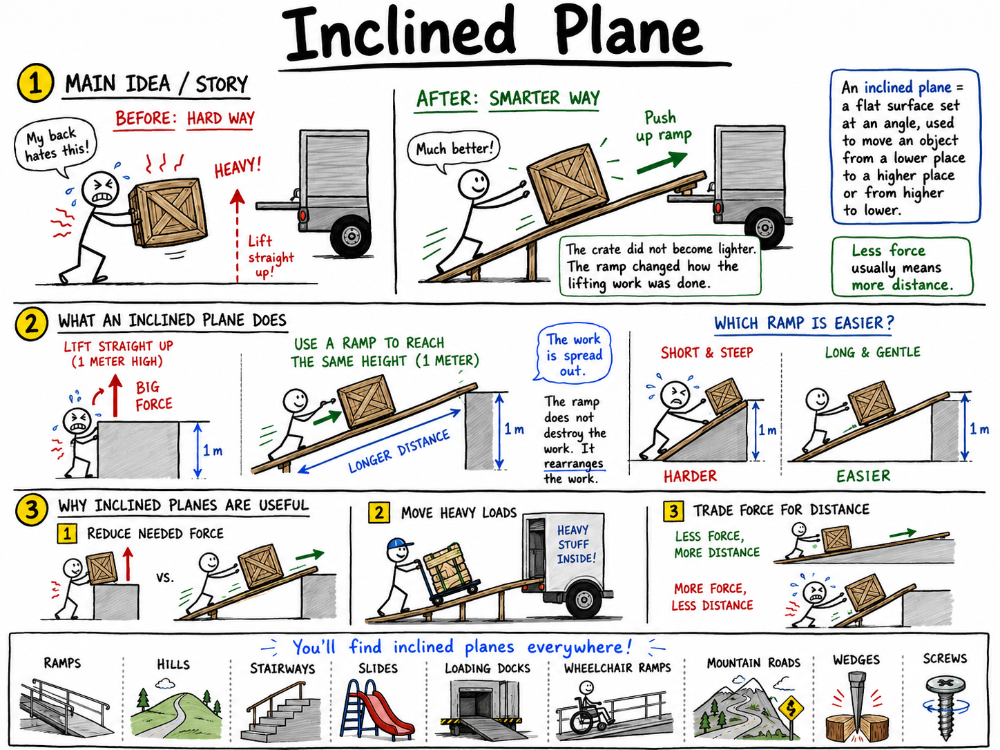

# Inclined Plane

Imagine that a heavy crate must be loaded into the back of a truck. If you try to lift it straight up, you may not even get it off the ground. But if someone places a strong board from the ground to the truck bed, the crate can be pushed up the board instead.

The crate did not become lighter. The board changed how the lifting work was done.

That board is being used as an inclined plane.

**An inclined plane is a flat surface set at an angle, used to move an object from a lower place to a higher place or from a higher place to a lower place.**

Inclined planes are one of the six classical simple machines. Ramps, hills, stairways, slides, loading docks, wheelchair ramps, roads over mountains, and even the sloping surfaces inside wedges and screws all use the same basic idea.

The inclined plane is simple, but it teaches one of the deepest rules in mechanics:

**Less force usually means more distance.**

## What an Inclined Plane Does

An inclined plane spreads lifting work over a longer distance.

Suppose a box must be raised 1 meter from the ground to a platform. Lifting it straight up means applying a large force over a short distance. Pushing it up a ramp means applying a smaller force, but over the longer length of the ramp.

The ramp does not destroy the work. It rearranges the work.

This is why a long, gentle ramp feels easier than a short, steep ramp. The longer ramp gives you more distance over which to apply your force, so the force needed at any moment is smaller.

## Inclined Planes and Work

In science, **work** is done when a force moves an object through a distance in the direction of the force.

An inclined plane can make work easier, but it does not make work disappear. Like all simple machines, it uses a tradeoff.

If the ramp lets you use less force, you must move the object farther. If the ramp is shorter and steeper, you move the object a shorter distance, but you need more force.

This is the main bargain:

**A gentle ramp reduces force by increasing distance.**

That idea explains ramps, mountain roads, loading planks, staircases, slides, and many tools.

## The Parts of an Inclined Plane

An inclined plane has a few important features:

- **Height**
- **Length**
- **Slope**
- **Load**
- **Effort**

The **height** is how far upward the object must be raised.

The **length** is the distance along the ramp.

The **slope** tells how steep the ramp is.

The **load** is the object being moved.

The **effort** is the force used to push, pull, roll, or carry the load along the ramp.

A ramp with the same height but a greater length has a gentler slope. A ramp with the same height but a shorter length has a steeper slope.

## Gentle Ramps and Steep Ramps

Imagine two ramps leading to the same porch.

One ramp is short and steep. The other is long and gentle.

The short ramp gets you to the same height quickly, but it requires more force. The long ramp requires less force, but you must travel farther.

This is why wheelchair ramps are not extremely steep. A gentle ramp lets a person roll up with less force and more control. It takes more distance, but it is safer and more practical.

Mountain roads work the same way. A road that went straight up a steep mountain would be too difficult and dangerous. Instead, roads wind back and forth in long paths. The road becomes a long inclined plane that reduces the steepness.

## Mechanical Advantage

**Mechanical advantage** describes how much a machine multiplies force.

An inclined plane has mechanical advantage because it lets a smaller effort lift a load by moving the load over a longer distance.

In an ideal inclined plane with no friction, mechanical advantage can be estimated with this formula:

**Mechanical advantage = length of ramp ÷ height of ramp**

Suppose a ramp is 6 meters long and raises a box 2 meters high.

The ideal mechanical advantage is:

**6 m ÷ 2 m = 3**

That means the ramp can reduce the force needed to about one-third of the force needed to lift the box straight up, in an ideal system.

But the box must be moved 6 meters along the ramp instead of 2 meters straight up.

## A Simple Inclined Plane Calculation

Suppose a 300-newton box must be raised to a platform. The platform is 1 meter high. A ramp leading to it is 3 meters long.

First, find the ideal mechanical advantage:

**3 m ÷ 1 m = 3**

The ideal mechanical advantage is 3.

Now divide the load by the mechanical advantage:

**300 N ÷ 3 = 100 N**

In an ideal system, only 100 newtons of effort would be needed to push the box up the ramp.

The tradeoff is distance. The box moves 3 meters along the ramp instead of 1 meter straight up.

Real ramps also have friction, so the actual effort would be more than 100 newtons.

## Friction on Inclined Planes

Friction is very important on inclined planes.

When a box slides up a ramp, the box rubs against the ramp surface. Some of the effort goes into overcoming friction instead of lifting the box. That wasted energy often becomes heat and sound.

Wheels can reduce friction. This is why a wheeled cart is easier to push up a ramp than a crate sliding directly on the ramp.

But friction is not always bad.

Without friction, your shoes would slip on stairs. A car tire would slide on a hill. A wheelchair might roll too easily down a ramp. Useful friction gives grip and control.

Engineers must balance these needs. A ramp should be smooth enough to reduce wasted effort but rough enough to provide safe traction.

## Stairs as Inclined Planes

Stairs are related to inclined planes.

A staircase is not one smooth ramp, but it still helps people rise from a lower level to a higher level over a longer path. Each step raises the body a small amount.

Climbing stairs usually requires more up-and-down motion than walking up a smooth ramp, but stairs fit into a shorter space. That makes them useful inside buildings.

Stairs show an important design choice:

**A machine must fit the job, the space, and the people using it.**

For carrying a wheeled cart, a ramp is better. For saving space in a house, stairs may be better.

## Roads and Switchbacks

Mountain roads often use inclined plane principles.

Instead of going straight up a steep slope, a road may curve back and forth across the mountain. These turns are called **switchbacks**.

Switchbacks make the road longer, but they reduce the steepness. Cars, horses, bicycles, and people can climb more safely because the climb is spread over a greater distance.

The mountain is still just as tall. The road simply changes the way the height is gained.

That is the inclined plane idea on a large scale.

## Slides and Downward Motion

Inclined planes are not only used for going up. They are also used for moving downward.

A playground slide is an inclined plane. Gravity pulls the rider downward, and the slide guides the motion.

A loading ramp can help move a heavy object down from a truck. A chute can guide grain, coal, packages, or laundry from a higher place to a lower place.

When objects move downward on an inclined plane, the slope affects speed. A steeper slope makes the object speed up more quickly. A gentler slope gives more control.

That is why safe ramps must be designed carefully. Too steep a ramp can cause dangerous sliding or rolling.

## Inclined Planes in Tools

Inclined planes appear inside other simple machines.

A **wedge** is like a moving inclined plane. The sloping sides of a wedge push material apart. Axes, knives, chisels, nails, and doorstops all use wedge shapes.

A **screw** is like an inclined plane wrapped around a cylinder. The spiral thread of a screw is a ramp that winds around the shaft. As the screw turns, the thread moves through wood, metal, or another material.

This means the inclined plane is not only a ramp. It is also the hidden idea behind cutting, splitting, fastening, and lifting devices.

## Inclined Planes in Buildings

Buildings use inclined planes for movement, safety, and access.

Wheelchair ramps help people using wheelchairs, walkers, crutches, strollers, carts, and rolling bags enter buildings. Loading ramps help workers move supplies. Roofs are often sloped so rain and snow slide off more easily.

Driveways and parking garages also use inclined planes. A parking garage ramp lets cars move between floors without needing a lift for every vehicle.

Good ramp design considers height, length, slope, surface texture, handrails, drainage, and space.

An inclined plane may be simple, but designing one well requires careful thought.

## Inclined Planes in Nature

Inclined planes are not only human inventions.

Hills, riverbanks, sand dunes, and mountain slopes are natural inclined planes. Animals climb slopes, rocks slide down hills, rivers flow downhill, and snow moves down mountain faces.

A trail that winds up a hill is easier than a trail that goes straight up. Hikers often use zigzag paths for the same reason roads use switchbacks.

Nature provides the slopes. People learn to use them wisely.

## Safety with Inclined Planes

Inclined planes can make work easier, but they can also be dangerous if used carelessly.

A steep ramp can cause a cart to roll too fast. A slippery ramp can make a person fall. A weak ramp can break under a heavy load. A load pushed up a ramp can slide backward.

Good safety habits include:

- Use a ramp strong enough for the load.
- Keep the ramp stable and properly supported.
- Avoid ramps that are too steep for the job.
- Keep ramp surfaces dry, clean, and textured for traction.
- Push loads slowly and steadily.
- Keep hands and feet away from wheels and pinch points.
- Use help, brakes, ropes, or blocks when moving heavy loads.
- Never stand directly below a heavy load on a ramp.

An inclined plane gives control only when the ramp and the user are prepared for the forces involved.

## Common Misconceptions

One common mistake is thinking a ramp reduces the amount of height to be gained. It does not. The platform is still just as high.

Another mistake is thinking a ramp gets rid of work. It does not. It trades force for distance.

A third mistake is thinking the longest ramp is always best. A longer ramp can reduce force, but it also takes more space, more material, and more travel time.

A fourth mistake is forgetting friction. A rough ramp may require much more force than an ideal ramp, while a slippery ramp may be unsafe.

Good design balances force, distance, friction, safety, and space.

## The Big Idea

An inclined plane is a flat surface set at an angle.

It makes work more practical by spreading a change in height over a longer distance. A gentle ramp reduces the force needed to raise a load, but the load must travel farther. Inclined planes also guide downward motion, shape roads and stairs, and form the hidden basis of wedges and screws.

If you remember only one sentence, remember this:

**An inclined plane makes lifting or lowering easier by trading force for distance along a slope.**

## Study Questions

1. What is an inclined plane?
2. How does an inclined plane make lifting easier?
3. Why does a ramp not make work disappear?
4. What are height, length, and slope in an inclined plane?
5. What are effort and load?
6. Why is a long, gentle ramp easier to use than a short, steep ramp?
7. What does mechanical advantage mean?
8. How can you estimate the ideal mechanical advantage of an inclined plane?
9. A ramp is 6 meters long and raises an object 2 meters high. What is its ideal mechanical advantage?
10. A 300 N box is pushed up a 3-meter ramp to a 1-meter-high platform. What is the ideal effort needed?
11. Why would the actual effort on a real ramp be greater than the ideal effort?
12. How can wheels reduce friction on a ramp?
13. Why is friction sometimes useful on an inclined plane?
14. How are stairs related to inclined planes?
15. What are switchbacks, and why are they used on mountain roads?
16. How can an inclined plane help move objects downward?
17. How is a wedge related to an inclined plane?
18. How is a screw related to an inclined plane?
19. Give three examples of inclined planes in buildings or daily life.
20. Give two examples of natural inclined planes.
21. Why is the longest possible ramp not always the best design?
22. What are three safety rules for using ramps?
23. In your own words, explain the main tradeoff that makes inclined planes useful.
