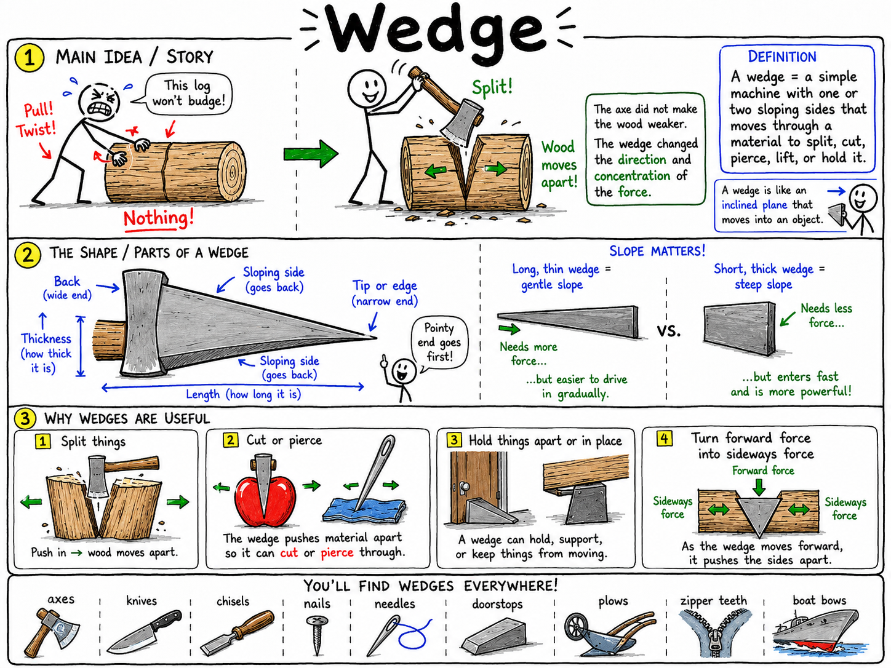
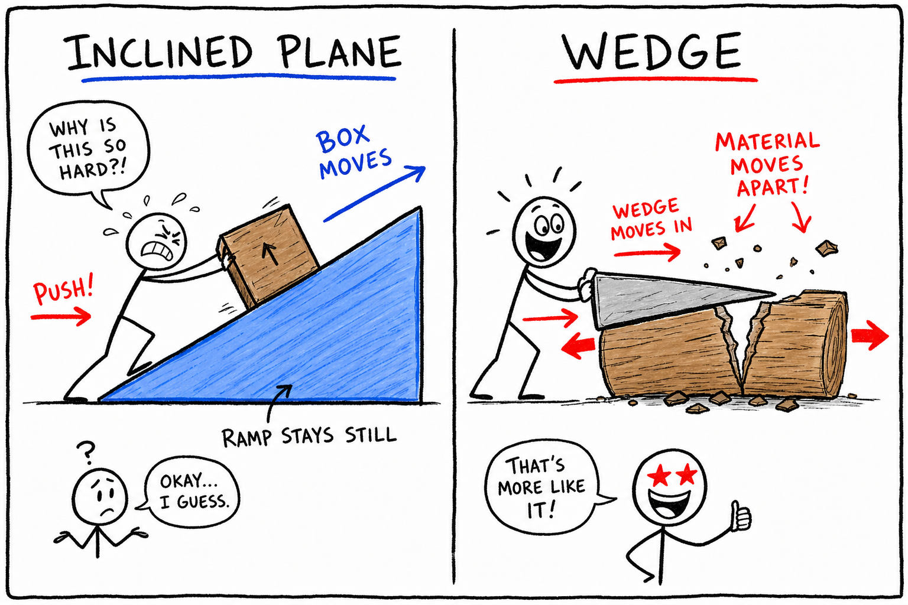
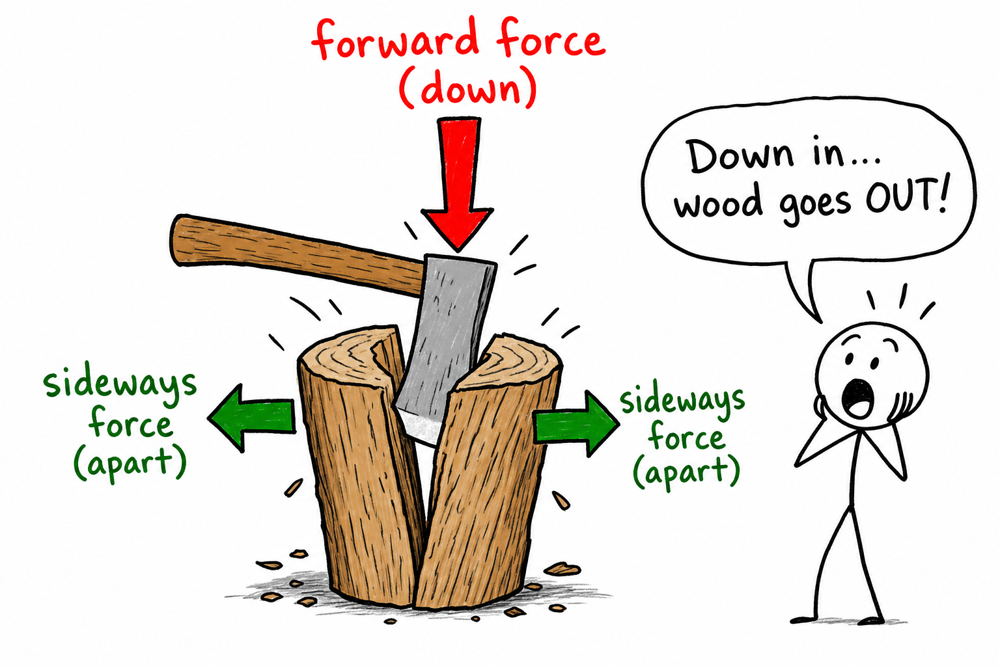
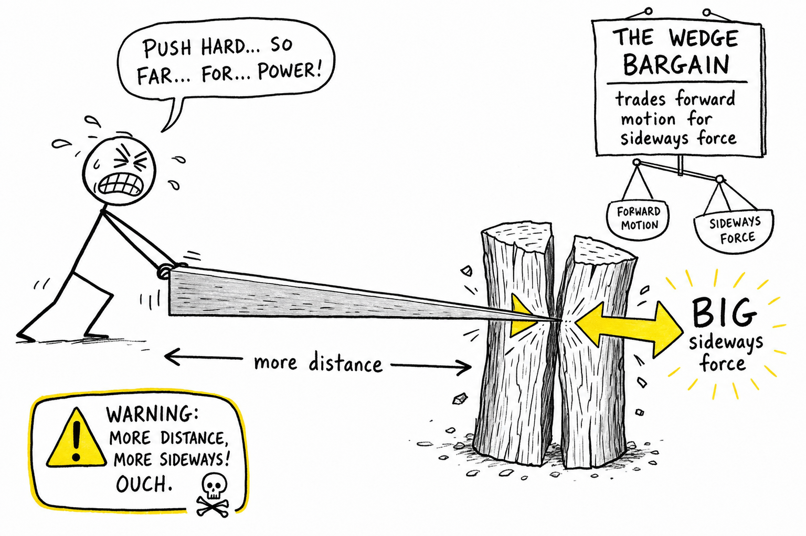
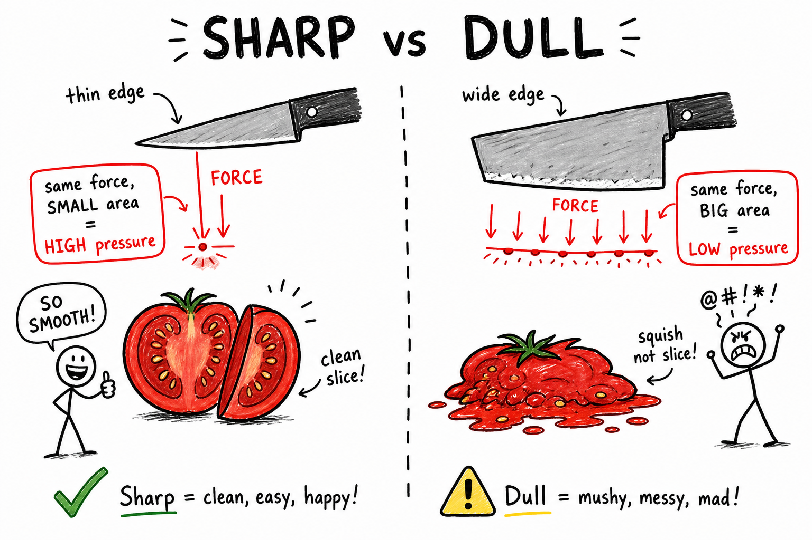
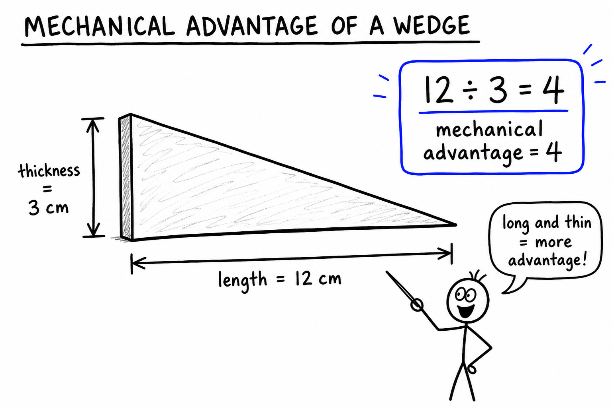
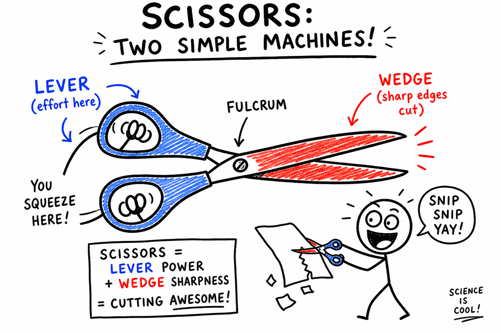
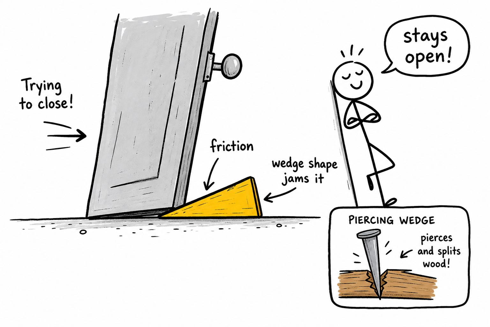

# Wedge

Imagine trying to split a thick piece of firewood with your bare hands. You might pull and twist all day and accomplish nothing. Now place the sharp edge of an axe on the end of the log and swing. The blade bites into the wood, and the wood begins to split apart.

The axe did not make the wood weaker. It changed the direction and concentration of the force.

The axe blade is being used as a wedge.

**A wedge is a simple machine with one or two sloping sides that moves through a material to split, cut, pierce, lift, or hold it.**

A wedge is closely related to the inclined plane. An inclined plane is usually a sloping surface that stays still while an object moves along it. A wedge is like an inclined plane that moves into an object.

Wedges are one of the six classical simple machines. Knives, axes, chisels, nails, needles, doorstops, plows, zipper teeth, and the pointed bows of boats all use wedge ideas.

Wedges may be small, but they are powerful. They help us cut food, split wood, carve stone, fasten boards, hold doors open, and move through air or water.

## The Shape of a Wedge

A wedge has a few important features:

- **Tip or edge**
- **Sloping side or sides**
- **Back**
- **Thickness**
- **Length**

The **tip** or **edge** is the narrow part that first enters the material.

The **sloping sides** spread the material apart as the wedge moves forward.

The **back** is the wider part where force may be applied.

The **thickness** is how wide the wedge becomes.

The **length** is how far the wedge stretches from its tip to its back.

A long, thin wedge has a gentle slope. A short, thick wedge has a steep slope.

## The Moving Inclined Plane

A wedge is often described as a moving inclined plane.

Picture a ramp. If the ramp stays still and a box moves up it, the ramp is an inclined plane. But if the sloping surface itself moves into the box, wood, soil, or another material, it acts as a wedge.

When a wedge moves forward, its sloping sides push material sideways.

This is why an axe splits wood. The blade moves downward into the log, but the sloping sides push the wood pieces apart.

This is why a knife cuts food. The edge enters first, and the sides of the blade push the material apart along the cut.

The important idea is:

**A wedge changes a force in one direction into forces that push outward.**

## Wedges and Work

In science, **work** is done when a force moves an object through a distance in the direction of the force.

A wedge can make work easier, but it does not make work disappear. Like all simple machines, it uses a tradeoff.

With a wedge, you often apply force over a longer distance as the wedge moves into the material. The wedge then creates a large force over a smaller sideways distance.

This is the wedge bargain:

**A wedge trades forward motion for sideways force.**

That tradeoff makes wedges useful for cutting, splitting, piercing, lifting, and holding.

## Sharpness and Force

A sharp wedge has a very thin edge.

When the same force is concentrated on a smaller area, the pressure is greater. This helps the wedge enter the material.

That is why a sharp knife cuts better than a dull knife. The sharp knife concentrates force along a narrow edge. A dull knife spreads the same force over a wider area, so it may crush or tear instead of cutting cleanly.

An axe, chisel, needle, nail, and knife all use narrow tips or edges to concentrate force.

But sharpness is not the only thing that matters. The wedge also needs the right angle, strength, material, and surface finish for the job.

## Wedge Angle

The angle of a wedge affects how it works.

A thin wedge with a small angle usually enters material more easily and gives greater mechanical advantage. It spreads the force over a longer distance.

A thick wedge with a large angle may be stronger and less likely to break, but it usually requires more force to drive into the material.

Think of a razor blade and an axe.

A razor blade is very thin and sharp. It is excellent for slicing soft material, but it would be a poor tool for splitting a log because it is too delicate.

An axe blade is thicker. It needs strength to survive hard blows and to force wood apart.

Good wedge design depends on the job.

## Mechanical Advantage

**Mechanical advantage** describes how much a machine multiplies force.

A wedge can provide mechanical advantage because its sloping sides spread a forward force over a longer distance and create larger sideways forces.

In a simplified ideal model:

**A longer, thinner wedge gives greater mechanical advantage than a shorter, thicker wedge.**

One way to estimate ideal mechanical advantage is:

**Mechanical advantage = length of wedge ÷ thickness of wedge**

Suppose a wedge is 12 centimeters long and 3 centimeters thick.

The ideal mechanical advantage is:

**12 cm ÷ 3 cm = 4**

In an ideal system with no friction, the wedge could multiply force by about 4.

Real wedges have friction and may bend, crush, or chip material, so the actual result is less perfect. Still, the model shows the main idea:

**Long and thin usually means less force is needed, but more distance is required.**

## A Simple Wedge Calculation

Suppose a wedge is 15 centimeters long and 5 centimeters thick at the back.

The ideal mechanical advantage is:

**15 cm ÷ 5 cm = 3**

If an ideal wedge has a mechanical advantage of 3, then a 60-newton push could produce about 180 newtons of separating force:

**60 N × 3 = 180 N**

This does not mean real wedges always work exactly this way. Friction, material strength, wedge shape, and impact all matter.

But the calculation helps you see why wedges are useful:

**A forward push can become a larger sideways force.**

## Cutting Wedges

Knives, scissors, chisels, saw teeth, and razors use wedges to cut.

A knife blade is a wedge with a sharp edge. When you push the blade into food, rope, cardboard, or another material, the edge starts the cut and the sloping sides push the material apart.

Scissors combine levers and wedges. The handles and pivot act like levers, while the blades act like wedges. Your fingers apply effort at the handles, the pivot helps multiply and control the force, and the blades concentrate that force along sharp edges.

Saw teeth are tiny wedges arranged in a row. Each tooth removes a small bit of material as the saw moves back and forth.

Many cutting tools are really wedge systems.

## Splitting Wedges

Axes, splitting mauls, and metal wedges are used to split wood, stone, or other materials.

When an axe enters a log, the blade pushes the wood fibers apart. A splitting wedge may be struck with a hammer or sledge. As the wedge goes deeper, the crack widens.

Splitting wedges are often thicker than slicing wedges because they must force large pieces apart and survive heavy blows.

This is why a kitchen knife and a splitting maul do not have the same shape. The knife is built for slicing. The maul is built for separating.

The best wedge is shaped for its task.

## Piercing Wedges

Some wedges are designed to pierce.

Nails, needles, pins, tacks, awls, and spear points all use sharp tips to enter material.

A nail is a wedge at its tip. When struck with a hammer, the pointed end forces wood fibers apart. The shaft follows into the opening and holds by friction.

A needle uses a very fine wedge shape to pass through cloth or skin with a small opening. A tack uses a sharp point to pierce paper, fabric, or soft wood.

Piercing wedges concentrate force at a point rather than along a long cutting edge.

## Holding Wedges

Some wedges are used not to cut or split but to hold.

A doorstop is a wedge. When pushed under a door, it jams between the door and the floor. Friction and the wedge shape keep the door from moving.

Shims are small wedges used in building and repair work. A carpenter may slide a shim under a cabinet, doorframe, or piece of furniture to level it or hold it in position.

Wedges can also lock parts tightly in place. In these cases, friction is helpful because it prevents the wedge from slipping out.

## Lifting Wedges

A wedge can lift slightly as it moves forward.

If you slide a wedge under a heavy object, the sloping top surface can raise the object a small amount. This can help start a lift, create a gap, or make space for another tool.

Rescue workers, builders, and mechanics may use wedge-shaped tools to separate, lift, or stabilize objects. Even a simple doorstop lifts the door slightly as it slides underneath.

This lifting action is another example of the inclined plane hidden in the wedge.

## Wedges in Nature

Nature uses wedge shapes too.

Animal teeth, claws, beaks, horns, and thorns often have wedge-like shapes. A wolf's tooth pierces and cuts. A bird's beak may crack seeds or tear food. A thorn pierces skin. A claw grips or cuts into a surface.

Ice can act like a wedge when water freezes in cracks. Water enters a small crack in rock. When it freezes, it expands and pushes the rock apart. Over time, this can break stone into pieces.

Plant roots can also act like wedges as they grow into cracks and slowly force material apart.

Wedge shapes appear wherever force must be concentrated or redirected.

## Wedges in Air and Water

Some wedges help objects move through fluids such as air or water.

The pointed bow of a boat helps split water and push it aside. The nose of an airplane helps air flow around it. A plow cuts into soil and pushes it aside. A snowplow blade pushes snow to the side.

These wedges do not simply cut like a knife. They shape the flow of material around them.

A blunt shape may push too much material straight ahead. A wedge shape can separate and guide the material more smoothly.

This is why shape matters in vehicles, tools, and machines.

## Friction and Wedges

Friction plays a major role in wedges.

Friction can make it harder for a wedge to enter material. A rough blade or sticky material resists motion. Sharpening, polishing, or lubricating a wedge can reduce friction and make cutting easier.

But friction can also help. A doorstop works because friction helps hold it under the door. A nail stays in wood partly because friction grips the shaft. A shim stays in place because it presses against surrounding surfaces.

As with many machines, friction is not simply good or bad. It depends on the job.

## Safety with Wedges

Many wedges are sharp or pointed, so safety matters.

Knives, axes, chisels, needles, saws, nails, and scissors can cut or puncture skin. A splitting wedge can fly out if struck badly. A dull blade can be dangerous because it may require extra force and slip unexpectedly.

Good safety habits include:

- Cut away from your body.
- Keep fingers away from sharp edges and points.
- Use the right wedge tool for the job.
- Keep blades sharp enough to work properly, but handle them carefully.
- Secure the material before cutting, splitting, or chiseling.
- Wear eye protection when striking wedges, chisels, or nails.
- Store sharp tools safely.
- Do not use damaged, cracked, or loose-handled tools.

A wedge concentrates force. That makes it useful, but also dangerous if uncontrolled.

## Common Misconceptions

One common mistake is thinking a wedge is only something used to split wood. Many wedges cut, pierce, lift, hold, or guide material.

Another mistake is thinking sharper is always better. A very sharp, thin wedge may cut easily but may also be too weak for heavy splitting.

A third mistake is forgetting that a wedge is related to the inclined plane. A wedge is like a moving inclined plane.

A fourth mistake is thinking friction is always bad. Friction can make cutting harder, but it can help doorstops, nails, and shims hold.

Good wedge design depends on the material, the force, the angle, the strength of the tool, and the purpose of the job.

## The Big Idea

A wedge is a moving inclined plane with one or two sloping sides.

It makes work more practical by changing a forward force into sideways forces. Wedges can split, cut, pierce, lift, hold, or guide materials. Their usefulness depends on sharpness, angle, friction, strength, and the job they are designed to do.

If you remember only one sentence, remember this:

**A wedge uses sloping sides to concentrate and redirect force.**

## Study Questions

1. What is a wedge?
2. How is a wedge related to an inclined plane?
3. What are the main features of a wedge?
4. How does a wedge change the direction of a force?
5. How can a wedge make work easier without making work disappear?
6. Why does a sharp wedge enter material more easily than a dull wedge?
7. How does wedge angle affect how a wedge works?
8. Why is a razor blade shaped differently from a splitting maul?
9. What does mechanical advantage mean?
10. How can you estimate the ideal mechanical advantage of a wedge?
11. A wedge is 12 cm long and 3 cm thick. What is its ideal mechanical advantage?
12. A wedge is 15 cm long and 5 cm thick. What is its ideal mechanical advantage?
13. If an ideal wedge has a mechanical advantage of 3 and is pushed with 60 N, about how much separating force could it produce?
14. Give three examples of cutting wedges.
15. How do scissors combine more than one simple machine?
16. How does an axe split wood?
17. Give three examples of piercing wedges.
18. How does a doorstop work as a wedge?
19. How can wedges help lift or separate objects?
20. Give two examples of wedge shapes in nature.
21. How can wedges help objects move through air or water?
22. How can friction be both helpful and harmful for wedges?
23. What are three safety rules for using wedge tools?
24. In your own words, explain the main tradeoff that makes wedges useful.
