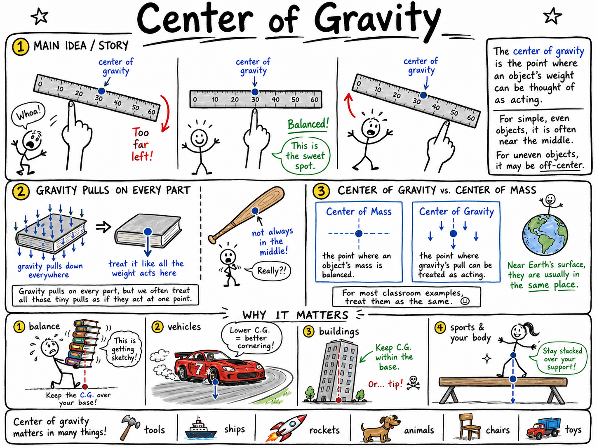

# Center of gravity

Imagine balancing a ruler on one finger. If your finger is too far to the left, the ruler tips right. If your finger is too far to the right, the ruler tips left. But there is one spot where the ruler rests evenly, almost as if all its weight is gathered above your finger.

That balancing spot helps reveal the ruler's center of gravity.

**The center of gravity is the point where an object's weight can be thought of as acting.**

For a simple, even object, the center of gravity is often near the middle. For a strangely shaped object, or an object with more weight on one side, the center of gravity may be far from the middle.

Center of gravity helps explain why things balance, tip, fall, spin, roll, and stand. It matters in sports, buildings, vehicles, animals, tools, ships, rockets, and your own body every time you walk across a room.

## Gravity Pulls on Every Part

Gravity pulls downward on every part of an object.

If you hold a book, gravity pulls on the cover, pages, spine, and corners. It does not pull only on one tiny dot. But for many problems, scientists and engineers can treat all those tiny pulls as if they acted at one point.

That point is the center of gravity.

This idea makes complicated objects easier to understand. Instead of tracking gravity on every grain of wood in a baseball bat or every bolt in a bicycle, we can ask: where is the object's weight effectively centered?

## Center of Gravity and Center of Mass

You may also hear the term **center of mass**.

The **center of mass** is the point where an object's mass is balanced.

The **center of gravity** is the point where gravity's pull on the object can be treated as acting.

Near Earth's surface, where gravity is nearly the same from one side of an ordinary object to the other, the center of mass and center of gravity are usually in the same place. For most classroom examples, you can treat them as the same point.

The distinction matters more in advanced physics, astronomy, and very large objects where gravity may not be the same everywhere.

## Balance

An object balances when its center of gravity is supported.

When you balance a ruler on your finger, the ruler stays level if its center of gravity is directly above the support point. If the center of gravity is to one side of your finger, gravity creates a turning effect, and the ruler tips.

A seesaw works in a related way. The board balances when the turning effects on both sides are equal. A heavier rider can sit closer to the center, while a lighter rider sits farther away.

Balance is not magic. It depends on where the weight is and where the support is.

## Finding the Center of Gravity

For a uniform object with a simple shape, the center of gravity is often easy to find.

The center of gravity of a straight, even ruler is near its middle.

The center of gravity of a square piece of cardboard is near the center of the square.

The center of gravity of a solid ball is at its center.

But many objects are not uniform. A hammer has a heavy metal head and a lighter handle, so its center of gravity is closer to the head. A baseball bat has more mass near the barrel than near the handle, so its center of gravity is not exactly in the middle.

The center of gravity shifts toward the heavier part.

## The Hanging Test

One useful way to find the center of gravity of a flat object is the hanging test.

Punch a small hole near the edge of a piece of cardboard. Hang the cardboard from that hole. Gravity will make it settle so that its center of gravity hangs directly below the support point.

If you hang a string with a small weight from the same point, the string forms a vertical line. Draw that line on the cardboard.

Now hang the cardboard from a different hole and draw a second vertical line.

The center of gravity is near the place where the lines cross.

This works because a hanging object settles with its center of gravity as low as possible, directly below the point of support.

## Line of Gravity

The **line of gravity** is an imaginary vertical line straight down from the center of gravity.

If the line of gravity falls inside the object's base of support, the object tends to stay upright.

If the line of gravity falls outside the base of support, the object tends to tip over.

Picture a tall book standing on a table. As long as its center of gravity is above its bottom face, it can stand. Tip it far enough, and the line of gravity moves beyond the edge of the base. Then gravity pulls it over.

This idea explains why some things are stable and others are easy to topple.

## Base of Support

The **base of support** is the area beneath an object that supports it.

For a box resting on a table, the base of support is the bottom face touching the table.

For a person standing with feet together, the base of support is small. For a person standing with feet apart, the base is wider.

A wider base usually makes an object more stable because the line of gravity can move farther before it passes outside the base.

This is why a wrestler, goalkeeper, or basketball defender often stands with feet apart and knees bent. The wider stance makes him harder to knock off balance.

## Stability

**Stability** is the ability of an object to resist tipping over.

An object is usually more stable when:

- Its center of gravity is low.
- Its base of support is wide.
- Its line of gravity stays inside the base.
- Its weight is arranged evenly or toward the bottom.

A low, wide toy block is stable. A tall, narrow tower is less stable.

This is why racing cars are low and broad, why heavy furniture may tip if loaded badly, and why a person carrying a heavy backpack may lean forward to stay balanced.

## High and Low Centers of Gravity

A high center of gravity makes tipping easier.

Think about a tall lamp. Its center of gravity is high above the floor, and its base may be narrow. A small push can move the line of gravity outside the base, and the lamp falls.

A low center of gravity makes tipping harder.

A sports car sits low to the ground, with much of its mass near the road. It can turn more safely at higher speeds than a tall, narrow vehicle because its center of gravity is lower and its base is wider.

This does not mean low objects can never tip. It means they usually require a larger tilt or stronger push.

## Leaning to Stay Balanced

Your body is always managing its center of gravity.

When you stand still, your center of gravity is roughly around your lower torso, though it changes with posture. When you raise your arms, bend forward, carry a backpack, or hold a heavy object, your center of gravity shifts.

If you carry a heavy suitcase in one hand, you may lean the other way. That lean helps bring your combined center of gravity back over your feet.

When you climb a hill, you lean forward. When you walk down a steep slope, you may lean backward slightly or bend your knees for control.

Your brain and muscles constantly adjust your body so the line of gravity stays within your base of support.

## Center of Gravity in Sports

Athletes use center of gravity even if they never say the phrase.

A wrestler lowers his body to become harder to throw. A football lineman bends his knees and widens his stance to resist being pushed back. A skateboarder shifts weight to turn and stay balanced. A gymnast controls body position in the air. A basketball player crouches before changing direction.

Jumpers and divers also use body shape to control motion. By tucking, stretching, or twisting, they change how their mass is arranged and how their bodies rotate.

Good athletic balance is not only strength. It is control of the center of gravity.

## Center of Gravity in Vehicles

Vehicles must be designed with center of gravity in mind.

A low center of gravity helps a vehicle resist rolling over during turns. A wide wheelbase gives a larger base of support. Heavy parts are often placed low when possible.

Tall trucks, buses, and loaded vans must be driven carefully because their centers of gravity may be higher. Sharp turns, sudden swerves, or uneven loads can make them less stable.

Cargo also matters. If heavy boxes are stacked high on a truck, the center of gravity rises. If the load shifts to one side, the vehicle may become easier to tip.

Engineers and drivers both care about balance.

## Center of Gravity in Buildings

Buildings and towers must keep their weight properly supported.

A tall building needs a strong foundation. Its center of gravity must remain over its base, and the structure must resist wind, earthquakes, and uneven loads.

Builders often make foundations wide and strong. They use heavy materials, careful framing, and sometimes special designs that allow controlled movement without collapse.

A leaning tower is safe only if its line of gravity still falls within its base of support and the structure can handle the forces involved.

The taller the structure, the more seriously engineers must think about stability.

## Center of Gravity in Tools and Objects

The center of gravity affects how tools feel in your hand.

A hammer balances closer to its metal head than to the end of its handle. That helps deliver a strong blow, but it also affects control.

A baseball bat, tennis racket, fishing rod, and hockey stick all have centers of gravity that influence how they swing.

A backpack packed with heavy items high and far from the back can feel awkward. Pack the heavy items lower and closer to the body, and the load is easier to carry.

Good design puts weight where it helps the user.

## Center of Gravity Can Be Outside an Object

The center of gravity does not always have to be inside the material of an object.

Think of a ring or a doughnut. Its center of gravity is near the center of the hole, where there may be no material at all.

A horseshoe-shaped object may also have a center of gravity in empty space between its arms.

This may seem strange at first, but it makes sense. The center of gravity is the balance point of the whole shape, not necessarily a piece of matter you can touch.

## Changing Shape Changes Center of Gravity

If an object changes shape, its center of gravity can move.

A person bending forward moves his center of gravity forward. A gymnast tucking into a ball changes where mass is located. A cat twisting in the air shifts body parts to control landing. A crane lifting a load changes the combined center of gravity of the crane and load.

This is why balance is active. Living things and machines often change position while moving, so their centers of gravity change too.

Understanding the shift helps explain why some motions are graceful and others end in a fall.

## A Simple Stability Test

You can predict tipping by thinking about the line of gravity and base of support.

Place a rectangular block upright on a table. Its line of gravity goes down through its center and falls inside its base. It stands.

Now slowly tilt the block. At first, the line of gravity still falls inside the base. The block may return to its original position if released.

Tilt it farther. When the line of gravity passes beyond the edge of the base, the block tips over.

The tipping point occurs when the center of gravity is no longer supported by the base.

## Common Misconceptions

One common mistake is thinking the center of gravity is always in the exact middle. It is not. It shifts toward heavier parts and depends on shape and mass distribution.

Another mistake is thinking a heavier object is always more stable. Weight can help, but location matters. A tall heavy object can still tip easily if its center of gravity is high and its base is narrow.

A third mistake is thinking balance depends only on the object. The support matters too. The same object may be stable on a wide base and unstable on a narrow base.

Finally, remember that the center of gravity can be outside the object's material, as with a ring.

## Safety and Center of Gravity

Center of gravity is not just a classroom idea. It is a safety idea.

Good safety habits include:

- Keep heavy objects low when stacking or packing.
- Use a wide, stable stance when lifting or pushing.
- Do not climb on furniture that can tip.
- Load carts, wagons, and shelves evenly.
- Slow down when turning tall vehicles or carrying high loads.
- Keep ladders at a safe angle and on firm ground.
- Do not lean too far beyond your base of support.

Many accidents happen because the line of gravity moves outside the base of support. Understanding that can prevent falls, spills, and tip-overs.

## The Big Idea

The center of gravity is the point where an object's weight can be thought of as acting.

Objects balance when their center of gravity is supported. They become more stable when their center of gravity is low, their base of support is wide, and their line of gravity stays inside the base. This idea explains balance in toys, tools, athletes, vehicles, buildings, animals, and the human body.

If you remember only one sentence, remember this:

**An object stays balanced when its center of gravity is supported over its base.**

## Study Questions

1. What is the center of gravity?
2. Why can scientists often treat gravity as if it acts at one point on an object?
3. What is the difference between center of gravity and center of mass?
4. Why are center of gravity and center of mass usually treated as the same near Earth's surface?
5. What must happen for an object to balance on a support?
6. Why does a ruler tip if your finger is not under its center of gravity?
7. How can you find the center of gravity of a flat cardboard shape using the hanging test?
8. What is the line of gravity?
9. What is the base of support?
10. When does an object tend to tip over?
11. What does stability mean?
12. What four features usually make an object more stable?
13. Why does a low center of gravity make tipping harder?
14. Why does a wide stance help an athlete stay balanced?
15. How does carrying a heavy suitcase in one hand affect your balance?
16. Give three examples of center of gravity in sports.
17. Why do vehicle designers care about center of gravity?
18. How can cargo make a truck less stable?
19. Why do tall buildings need strong, carefully designed foundations?
20. How can the center of gravity affect how a tool feels?
21. Can the center of gravity be outside an object? Give an example.
22. How can changing shape or posture move the center of gravity?
23. What are three safety rules related to center of gravity?
24. In your own words, explain why an object tips over when its center of gravity is no longer supported.
