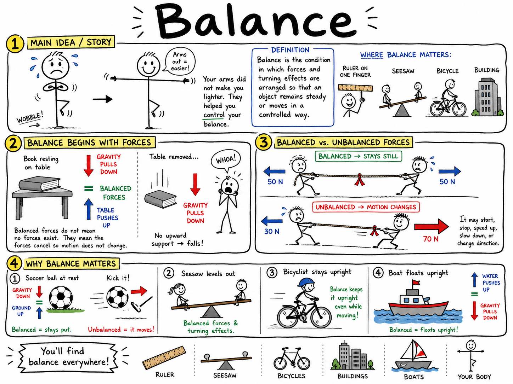
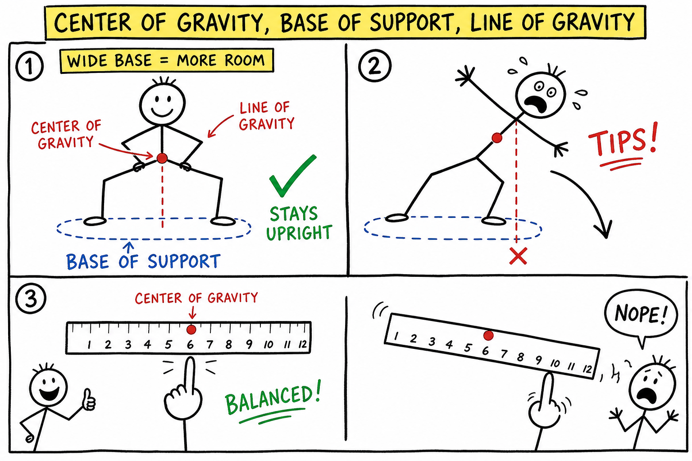
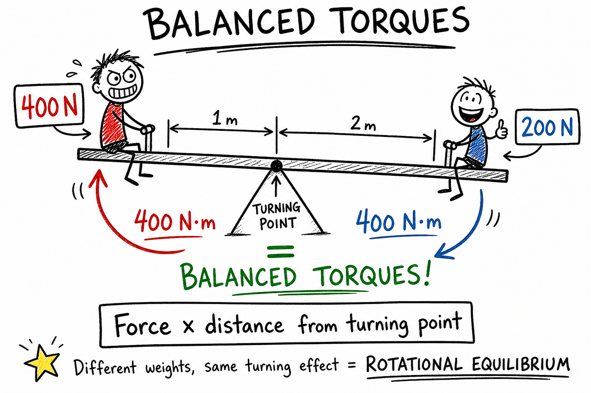
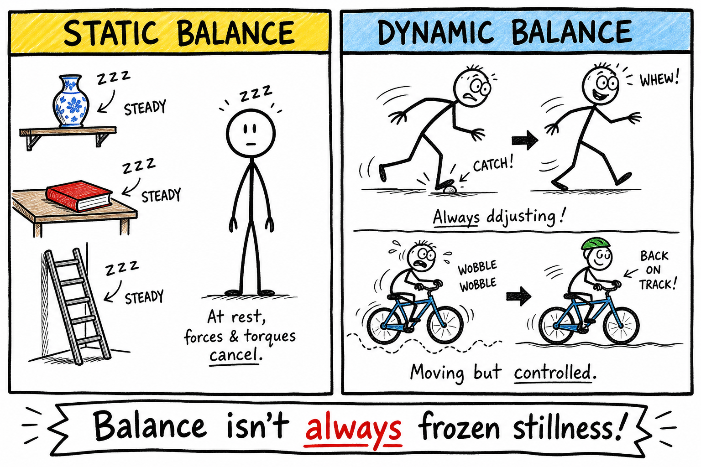
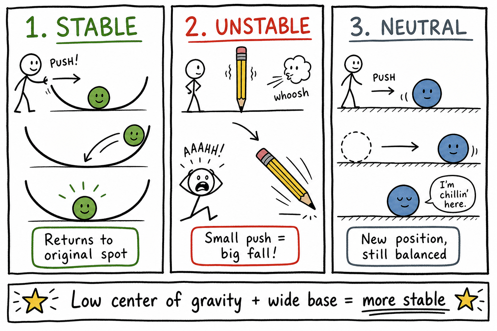
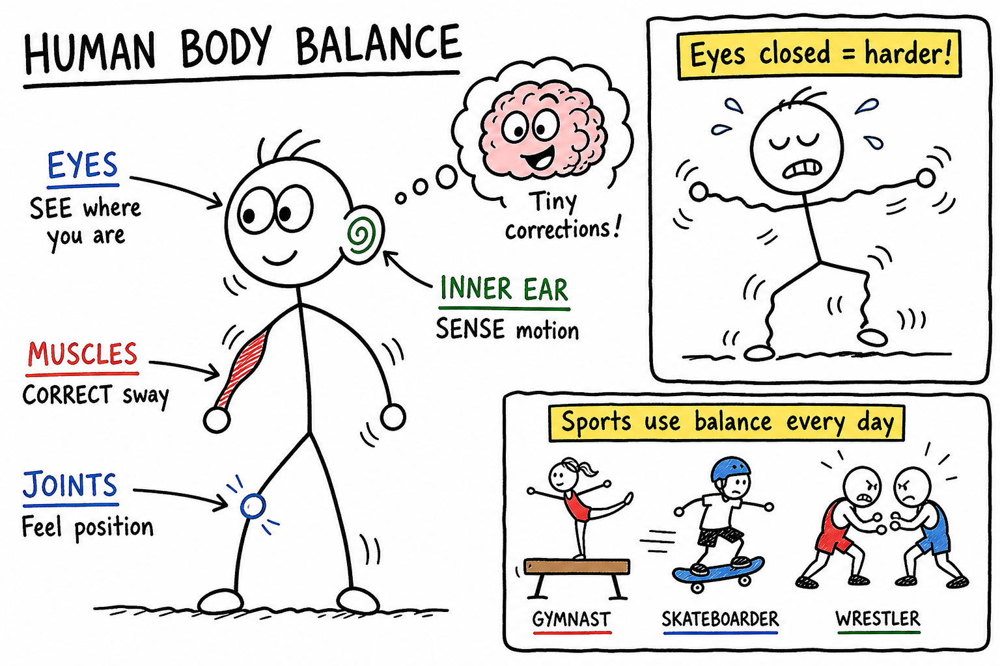
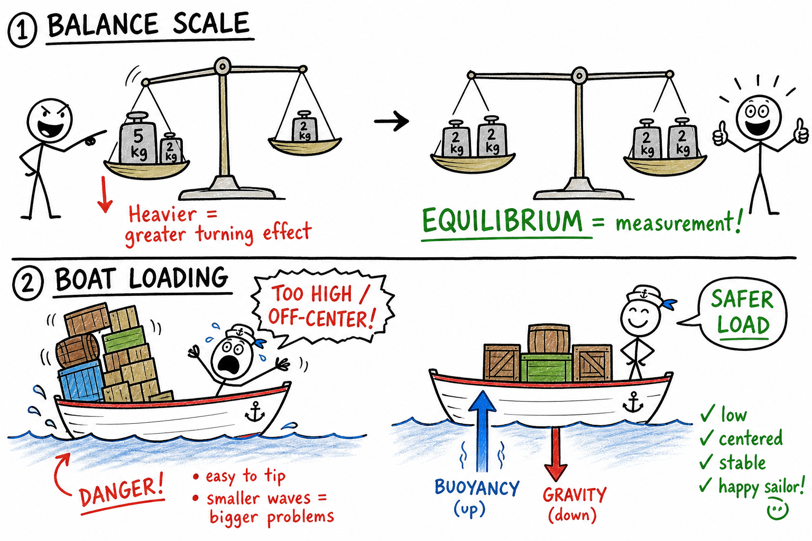

# Balance

Imagine standing on one foot with your arms folded. At first you may wobble. Your ankle shifts, your toes press against the floor, and your body makes tiny corrections. Now stretch your arms out to the sides. Suddenly it may feel easier.

Your arms did not make you lighter. They helped you control your balance.

**Balance is the condition in which forces and turning effects are arranged so that an object remains steady or moves in a controlled way.**

Balance is not only for tightrope walkers and gymnasts. It explains why a ruler can rest on one finger, why a seesaw can level out, why a bicycle stays up while moving, why buildings do not fall over, why boats float upright, and why your body can walk, run, jump, and land.

Balance is one of the most practical ideas in science because it connects force, gravity, motion, and design.

## Balance Begins with Forces

A **force** is a push or pull.

An object is balanced in one simple way when the forces on it cancel each other.

Picture a book resting on a table. Gravity pulls the book downward. The table pushes upward on the book. If the upward push equals the downward pull, the book does not move up or down.

The forces are balanced.

If the table were removed, gravity would no longer be balanced by the table's upward push, and the book would fall.

Balanced forces do not necessarily mean no forces exist. They mean the forces combine to produce no change in motion.

## Balanced and Unbalanced Forces

When forces are **balanced**, an object at rest stays at rest, and an object moving steadily keeps moving steadily.

When forces are **unbalanced**, the object's motion changes. It may speed up, slow down, start moving, stop, or change direction.

If two boys pull on opposite ends of a rope with equal force, the rope may stay still. If one boy pulls harder, the rope moves toward him.

The same idea applies everywhere. A soccer ball sitting on grass has balanced forces in the vertical direction: gravity pulls down, and the ground pushes up. When a player kicks it, the force from the foot is unbalanced, so the ball accelerates.

Balance and motion are closely connected.

## Balance and Gravity

Gravity is always part of balance near Earth.

Gravity pulls objects downward. For an object to stay supported, something must push or pull upward with enough force. A table supports a book. A rope supports a hanging lamp. The ground supports your feet.

But gravity also creates tipping problems. A tall object may not simply fall straight down; it may rotate and topple if its weight is not supported properly.

That is why balance is about both forces and turning effects.

## Center of Gravity

The **center of gravity** is the point where an object's weight can be thought of as acting.

An object balances when its center of gravity is supported. If the center of gravity is above the base of support, the object tends to stay upright. If it moves beyond the base, the object tends to tip.

When you balance a ruler on your finger, your finger must be under the ruler's center of gravity. If the finger is too far to one side, gravity makes the ruler rotate and fall.

This is why a wide stance helps a person stay balanced. The wider base gives the center of gravity more room to shift without moving outside the support.

## Base of Support

The **base of support** is the area beneath an object that supports it.

For a chair, the base of support is the area between and under its legs. For a person, it is the area around the feet. For a table, it is the area covered by its legs or bottom surface.

A wide base of support usually improves balance.

This is why a tripod is stable. Its three legs spread out and make a broad base. It is also why a wrestler or goalkeeper stands with feet apart and knees bent.

Balance depends on the relationship between the center of gravity and the base of support.

## Line of Gravity

The **line of gravity** is an imaginary vertical line running downward from the center of gravity.

If the line of gravity falls inside the base of support, the object is supported. If the line falls outside the base, the object tips.

Try thinking about a tower of blocks. If the tower leans only a little, the line of gravity may still fall within the bottom block. If it leans too far, the line of gravity passes outside the base, and the tower falls.

This simple idea explains many accidents and many clever designs.

## Turning Effects and Torque

Balance is not only about straight-line forces. It is also about turning.

A force can make an object rotate. This turning effect is called **torque**.

Torque depends on the size of the force and how far the force is applied from the turning point.

On a seesaw, the turning point is the support in the middle. A heavier child close to the middle can balance a lighter child farther from the middle because distance matters as well as weight.

The simple rule is:

**Turning effect depends on force and distance from the turning point.**

## Balanced Torques

A seesaw balances when the clockwise turning effect equals the counterclockwise turning effect.

Suppose a 400-newton boy sits 1 meter from the center of a seesaw. His turning effect is:

**400 N × 1 m = 400 N·m**

If a 200-newton boy sits on the other side, he must sit 2 meters from the center to balance:

**200 N × 2 m = 400 N·m**

The boys have different weights, but the turning effects are equal.

This kind of balance is called **rotational equilibrium**. It means the turning effects are balanced, so the object does not start rotating.

## Static Balance

**Static balance** means an object is balanced while at rest.

A book lying on a desk, a ladder leaning safely against a wall, a vase standing on a shelf, and a person standing still are examples of static balance.

Static balance requires forces and turning effects to be arranged so that the object remains steady.

For simple objects, this often means the center of gravity is above the base of support. For more complicated objects, supports, friction, tension, and torque may also matter.

Static balance is important in buildings, bridges, furniture, shelves, cranes, and tools.

## Dynamic Balance

**Dynamic balance** means balance while moving.

Walking is dynamic balance. With every step, your body begins to fall forward, and your next foot catches you. Running, skating, cycling, skiing, and climbing all require constant adjustment.

A bicycle is easier to balance when moving than when standing still. The rider steers, shifts weight, and makes tiny corrections. The spinning wheels also help with control, though steering and body position matter greatly.

Dynamic balance is active. It is not frozen stillness. It is controlled motion.

## Stable Balance

An object has **stable balance** if, after being disturbed a little, it tends to return to its original position.

A marble at the bottom of a bowl is in stable balance. Push it a little, and it rolls back down toward the bottom.

A person standing with feet apart and knees bent is often in a more stable position than a person standing tall with feet together.

Stable balance is helped by a low center of gravity and a wide base of support.

Many objects are designed for stable balance: heavy-bottomed lamps, traffic cones, toy punching bags, and wide-legged stools.

## Unstable Balance

An object has **unstable balance** if a small disturbance makes it move farther from its balanced position.

A pencil balanced on its point is in unstable balance. In theory it could balance perfectly, but the smallest air current or tremble makes it fall.

A marble balanced on top of an upside-down bowl is also unstable. A tiny push sends it rolling away.

Unstable balance is difficult to maintain because corrections must be quick and exact.

Tightrope walkers, gymnasts, and people balancing objects are skilled at making those corrections.

## Neutral Balance

An object has **neutral balance** if, after being moved, it stays balanced in its new position.

A ball resting on a flat floor is a good example. Roll it to a new spot, and it is still balanced.

A wheel on a level axle may also show neutral balance if its center of gravity stays at the same height as it turns.

Neutral balance does not pull the object back to the old position or make it fall farther away. It simply allows a new balanced position.

## Balance in the Human Body

Your body balances by using bones, muscles, joints, eyes, inner ears, and nerves.

Your eyes help you see where you are. Your inner ears help sense motion and position. Sensors in muscles and joints help your brain know where your body parts are. Muscles make corrections.

When you stand, your body is not perfectly still. It sways slightly. Your nervous system corrects the sway before you fall.

This is why balancing with eyes closed is harder. One source of information has been removed.

Balance is a skill your body practices every day.

## Balance in Sports

Sports are full of balance.

A skateboarder shifts weight to turn. A wrestler lowers his center of gravity to resist being thrown. A baseball batter balances while swinging. A soccer player plants one foot while kicking with the other. A gymnast controls balance on a beam. A hockey player balances on thin skate blades while moving quickly.

Good balance allows quick movement, strong positions, and safe landings.

Athletes often train balance because strength alone is not enough. A strong player who is off balance cannot use his strength well.

## Balance in Design

Engineers and designers think about balance constantly.

A chair must not tip too easily. A crane must not fall when lifting a load. A ship must float upright. A backpack should carry weight comfortably. A bridge must balance forces through its supports. A camera tripod must hold equipment steady.

Designers ask questions such as:

- Where is the center of gravity?
- How wide is the base?
- What forces are acting?
- What turning effects are present?
- What happens if the load shifts?

Good design often means arranging weight and supports so balance is maintained even when conditions change.

## Balance Scales

A balance scale compares weights by using balanced torques.

In a simple equal-arm balance, two pans hang from equal distances on either side of a central support. If the weights in the pans are equal, the scale balances.

If one side is heavier, it tips down.

Because the distances from the support are equal, the side with greater weight has greater turning effect. If the arms were unequal, then distance would also have to be considered.

Balance scales show that measurement can come from equilibrium.

## Boats and Balance

Boats must balance in water.

Gravity pulls the boat downward. Buoyancy from the water pushes upward. For the boat to float upright, these forces and their positions must create a stable arrangement.

If cargo is loaded too high or too far to one side, the boat may lean or capsize. A low, centered load is safer.

Sailboats use keels, hull shape, ballast, and careful crew movement to stay balanced against wind and waves.

Balance on water is especially important because the support is moving.

## Common Misconceptions

One common mistake is thinking balance means no forces are acting. Balanced objects often have many forces acting; the forces simply cancel or produce no change in motion.

Another mistake is thinking only weight matters. Distance from a turning point matters too, as a seesaw shows.

A third mistake is thinking balance is always still. Dynamic balance occurs during motion.

A fourth mistake is thinking heavy objects are always stable. A tall heavy object with a narrow base can tip more easily than a lighter low object with a wide base.

Balance depends on force, support, center of gravity, torque, and motion.

## Safety and Balance

Understanding balance helps prevent accidents.

Good safety habits include:

- Keep heavy objects low and centered.
- Use a wide stance when lifting, pushing, or pulling.
- Do not lean too far beyond your base of support.
- Load carts, shelves, backpacks, and boats evenly.
- Keep ladders at a safe angle on firm ground.
- Slow down when turning with a tall or heavy load.
- Do not climb on unstable furniture.
- Secure objects that could roll, tip, or shift.

Many falls and tip-overs happen when balance is lost slowly at first, then suddenly all at once.

## The Big Idea

Balance occurs when forces and turning effects are arranged so that an object remains steady or moves in a controlled way.

Balanced forces prevent changes in straight-line motion. Balanced torques prevent unwanted rotation. Center of gravity, base of support, line of gravity, friction, and motion all help determine whether something stays upright, tips, rolls, or falls.

If you remember only one sentence, remember this:

**Balance depends on forces, turning effects, and keeping support under the center of gravity.**

## Study Questions

1. What is balance?
2. What is a force?
3. What does it mean for forces to be balanced?
4. What happens when forces are unbalanced?
5. How does a book resting on a table show balanced forces?
6. What is the center of gravity?
7. What is the base of support?
8. What is the line of gravity?
9. When does an object tend to tip over?
10. What is torque?
11. What two things determine the size of a turning effect?
12. How can two people of different weights balance on a seesaw?
13. A 400 N boy sits 1 m from the center of a seesaw. How far away must a 200 N boy sit on the other side to balance him?
14. What is static balance?
15. What is dynamic balance?
16. Why is walking an example of dynamic balance?
17. What is stable balance?
18. What is unstable balance?
19. What is neutral balance?
20. How do your eyes and inner ears help with balance?
21. Give three examples of balance in sports.
22. Why do engineers think about balance when designing cranes, chairs, boats, or bridges?
23. How does a balance scale compare weights?
24. Why can a boat become unsafe if cargo is loaded too high or too far to one side?
25. What are three safety rules related to balance?
26. In your own words, explain why balance is not the same as having no forces.
