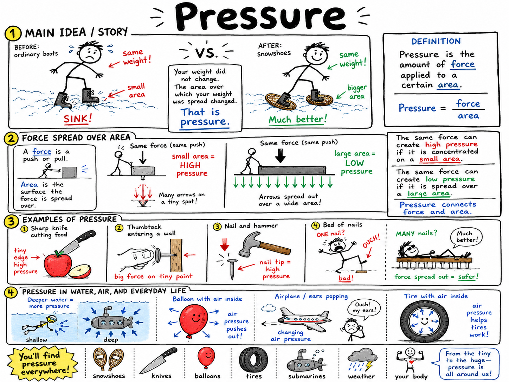

# Pressure

Imagine stepping onto soft snow in ordinary boots. Your feet may sink deeply. Now imagine wearing snowshoes. You are the same boy, with the same weight, standing on the same snow, but you do not sink nearly as much.

Your weight did not change. The area over which your weight was spread changed.

That is pressure.

**Pressure is the amount of force applied to a certain area.**

Pressure helps explain why sharp knives cut, why snowshoes work, why deep water squeezes harder than shallow water, why tires need air, why balloons expand, why ears pop in an airplane, why submarines must be strong, and why a thumbtack can enter a wall with a small push.

Pressure is one of the most useful ideas in science because it connects force, area, liquids, gases, machines, weather, and the human body.

## Force Spread Over Area

A **force** is a push or pull.

**Area** is the amount of surface over which that force is spread.

Pressure depends on both.

The same force can create high pressure if it is concentrated on a small area. The same force can create low pressure if it is spread over a large area.

This is why a nail point can enter wood but the flat head of the nail does not. The hammer force is carried through the nail to a tiny point, producing high pressure at the tip.

This is also why lying on a bed of many nails can be safer than stepping on one nail. Many nails spread the force over many points. One nail concentrates the force on a tiny area.

## The Pressure Formula

The basic formula for pressure is:

**Pressure = force ÷ area**

In symbols:

**P = F ÷ A**

If the same force is spread over a larger area, pressure decreases.

If the same force is concentrated on a smaller area, pressure increases.

This simple formula explains a surprising number of everyday events.

## Units of Pressure

Force is often measured in **newtons**.

Area is often measured in **square meters**.

Pressure is measured in **pascals**.

One pascal means one newton of force spread over one square meter of area:

**1 pascal = 1 newton per square meter**

Pascals can be small units, so you may also see **kilopascals**, or kPa. One kilopascal equals 1,000 pascals.

Tire pressure is often measured in other units, such as pounds per square inch, but the idea is the same: force spread over area.

## A Simple Pressure Calculation

Suppose a box pushes down on the floor with a force of 100 newtons. The bottom of the box touches the floor over an area of 2 square meters.

The pressure is:

**Pressure = force ÷ area**

**Pressure = 100 N ÷ 2 m²**

**Pressure = 50 Pa**

Now suppose the same 100-newton force is concentrated on an area of only 0.5 square meters.

**Pressure = 100 N ÷ 0.5 m²**

**Pressure = 200 Pa**

The force stayed the same, but the pressure increased because the area became smaller.

## High Pressure and Low Pressure

High pressure means a force is concentrated strongly on an area.

Low pressure means a force is spread more gently over an area.

A sharp ice skate blade creates high pressure on the ice because the skater's weight is concentrated along a narrow blade. A snowshoe creates lower pressure on snow because the person's weight is spread over a large frame.

A backpack strap that is thin may dig into your shoulder. A wide padded strap spreads the force over more area, reducing pressure and making the backpack more comfortable.

Pressure is not just about how much force there is. It is about how concentrated the force is.

## Sharp Tools and Pressure

Sharp tools work by increasing pressure.

A knife has a thin edge. When you push down, the force is concentrated along that narrow edge, creating high pressure that separates the material.

A needle has a sharp point. A small push can produce high pressure at the tip, allowing it to pass through cloth.

A thumbtack has a broad head and a sharp point. Your thumb pushes on the broad head, which keeps the pressure on your thumb low. The sharp point presses into the wall with high pressure.

This is clever design: low pressure where your hand touches, high pressure where the tool must enter material.

## Pressure in Solids

In solids, pressure often depends on how force is applied through contact surfaces.

Chair legs press on the floor. A table presses on its supports. Shoes press on the ground. A clamp presses on wood. A pencil point presses on paper.

If the contact area is small, pressure is higher. If the contact area is large, pressure is lower.

This is why heavy machines may need wide tracks or large tires. Spreading their weight over more area prevents them from sinking into soft ground.

Tanks, bulldozers, and snow groomers often use tracks instead of ordinary wheels for this reason.

## Pressure in Liquids

Liquids exert pressure too.

Water in a pool pushes on swimmers, pool walls, and the bottom of the pool. The deeper you go, the more water is above you, so the pressure increases.

This is why your ears may feel pressure when you dive to the bottom of a pool. More water is pressing on you from above and around you.

Liquid pressure acts in all directions. At a given depth, water pushes sideways, upward, and downward.

That is why dams must be thick and strong near the bottom. The water pressure is greater there than near the surface.

## Pressure and Depth

In a liquid, pressure increases with depth.

At the surface of a lake, only the air and a small amount of water pressure act on you. Deeper down, the weight of all the water above you adds more pressure.

Submarines must be built to withstand enormous pressure because deep ocean water presses on them from every side.

Deep-sea animals also face great pressure. Their bodies are adapted to those conditions, while many surface animals could not survive there.

The deeper the liquid, the greater the pressure.

## Pressure in Gases

Gases also exert pressure.

Air is made of tiny particles moving in all directions. These particles bump into surfaces. The combined effect of all those collisions creates air pressure.

A balloon expands when air is blown into it because air particles inside push outward on the rubber. The balloon stops expanding when the outward pressure of the air inside is balanced by the stretch of the rubber and the pressure outside.

A basketball bounces properly when the air pressure inside is high enough. If too much air leaks out, the ball becomes soft because the inside pressure is lower.

Gas pressure comes from moving particles colliding with surfaces.

## Atmospheric Pressure

The air around Earth has weight.

The pressure caused by the weight of the air above us is called **atmospheric pressure**.

At sea level, the atmosphere presses on everything around us. We do not usually feel crushed because air and fluids inside our bodies push outward, balancing much of the pressure.

Atmospheric pressure changes with altitude. High on a mountain, there is less air above you, so the air pressure is lower.

This is why sealed packages may puff up in the mountains and why ears may pop when driving up a mountain or flying in an airplane.

## Ears and Pressure

Your ears are sensitive to pressure differences.

Inside the middle ear is an air-filled space. A small passage called the Eustachian tube helps equalize pressure between the middle ear and the outside air.

When an airplane climbs or descends, outside air pressure changes. If the pressure inside your ear does not change quickly enough, your eardrum may feel pushed or pulled.

Swallowing, yawning, or gently chewing can help equalize the pressure.

This is not magic. It is air pressure changing around your body.

## Air Pressure and Weather

Air pressure is important in weather.

Meteorologists measure air pressure with instruments called **barometers**.

High-pressure areas often bring clearer, calmer weather because air tends to sink and spread out.

Low-pressure areas often bring clouds, wind, and storms because air tends to rise, cool, and form clouds.

Wind is partly caused by air moving from areas of higher pressure toward areas of lower pressure.

Weather is complicated, but pressure differences are one of its main engines.

## Hydraulic Pressure

Liquids are hard to compress. This makes them useful for transmitting pressure.

A **hydraulic system** uses liquid under pressure to move force from one place to another.

In a hydraulic brake, pressing the brake pedal pushes on brake fluid. The pressure travels through the fluid and helps press brake parts against the wheels.

Hydraulic jacks, lifts, excavators, and airplane controls use similar ideas.

One useful rule is called **Pascal's principle**:

**Pressure applied to a confined fluid is transmitted throughout the fluid.**

This means a push in one place can create useful force somewhere else.

## Hydraulic Advantage

Hydraulic systems can multiply force by using different piston sizes.

Suppose a small piston pushes on a fluid. The pressure travels through the fluid to a larger piston. Because the larger piston has more area, the same pressure can create a larger force there.

The tradeoff is distance. The smaller piston must move farther while the larger piston moves a shorter distance.

This is similar to other machines:

**Greater force usually comes with greater input distance.**

Hydraulics are powerful because they can move heavy loads smoothly and with control.

## Floating and Pressure

Pressure also helps explain floating.

Water pressure increases with depth, so the bottom of an object in water usually feels more pressure than the top. This difference creates an upward force called **buoyant force**.

If the buoyant force is large enough to balance the object's weight, the object floats.

A steel ship can float because its shape displaces a large amount of water. The water pressure creates enough upward force to support the ship's weight.

Floating is not because water has no pressure. It is because pressure changes with depth and pushes upward more strongly on the lower parts of the object.

## Pressure and Safety

Pressure can be useful, but it can also be dangerous.

High pressure can cut, crush, burst, or explode. A pressure cooker must release steam safely. A tire can burst if overinflated or damaged. Deep water pressure can harm divers. Compressed gas cylinders must be handled carefully.

Good safety habits include:

- Never point compressed air at skin or eyes.
- Do not overinflate tires, balls, or balloons.
- Keep hands away from hydraulic pinch points.
- Use sharp tools carefully because they create high pressure at their edges.
- Equalize ear pressure gently when swimming, diving, or flying.
- Respect warning labels on pressurized containers.
- Never heat sealed containers unless designed for it.

Pressure is invisible in many situations, but its effects are real.

## Common Misconceptions

One common mistake is thinking pressure and force are the same. They are related, but they are not identical. Pressure is force divided by area.

Another mistake is thinking only solids exert pressure. Liquids and gases exert pressure too.

A third mistake is thinking air has no pressure because it is invisible. Air has weight, and moving air particles push on surfaces.

A fourth mistake is thinking deeper water pulls downward only. Water pressure acts in all directions and increases with depth.

Finally, remember that reducing pressure does not always mean reducing force. Sometimes it means spreading the same force over a larger area.

## The Big Idea

Pressure is force applied over area.

A small area can make a modest force produce high pressure. A large area can spread a large force into lower pressure. Pressure explains sharp tools, snowshoes, tires, deep water, air, weather, hydraulics, floating, and many safety rules.

If you remember only one sentence, remember this:

**Pressure increases when force increases or when the same force is concentrated on a smaller area.**

## Study Questions

1. What is pressure?
2. What two quantities determine pressure?
3. What is the formula for pressure?
4. What is a pascal?
5. A 100 N force is spread over 2 m². What is the pressure?
6. A 100 N force is spread over 0.5 m². What is the pressure?
7. Why do snowshoes help a person walk on soft snow?
8. Why does a sharp knife cut better than a dull knife?
9. How does a thumbtack use both low pressure and high pressure?
10. Why do heavy machines sometimes use wide tracks instead of narrow wheels?
11. How does pressure change as you go deeper in water?
12. Why must dams be stronger near the bottom?
13. What causes gas pressure?
14. Why does a balloon expand when air is blown into it?
15. What is atmospheric pressure?
16. Why is air pressure lower on a mountain than at sea level?
17. Why do ears sometimes pop in an airplane?
18. What instrument measures air pressure?
19. How are pressure differences related to wind and weather?
20. What is Pascal's principle?
21. How can a hydraulic system multiply force?
22. How does pressure help explain floating?
23. What are three safety rules related to pressure?
24. In your own words, explain why pressure is not the same thing as force.
