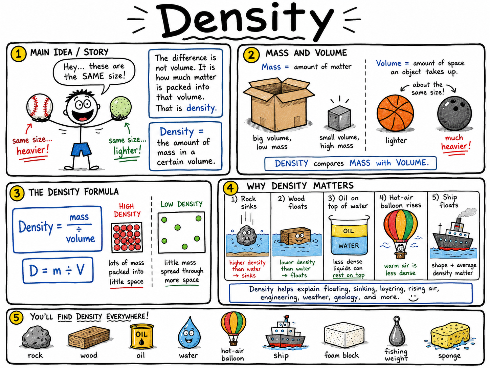

# Density

Imagine holding a baseball in one hand and a ball of foam the same size in the other. They take up about the same amount of space, but the baseball feels much heavier.

The difference is not volume. It is how much matter is packed into that volume.

That is density.

**Density is the amount of mass in a certain volume.**

Density helps explain why rocks sink and wood floats, why oil rests on top of water, why hot air rises, why ships can be made of steel and still float, why a small lead fishing weight feels heavy, and why a giant foam block can be easy to lift.

Density is one of the most useful ideas in science because it connects mass, volume, materials, liquids, gases, buoyancy, weather, geology, engineering, and the human body.

## Mass and Volume

To understand density, you must understand two other ideas:

- **Mass**
- **Volume**

**Mass** is the amount of matter in an object.

**Volume** is the amount of space an object takes up.

A bowling ball and a basketball may be similar in size, so they have similar volumes. But the bowling ball has much more mass. That means the bowling ball is denser.

A large cardboard box may have a big volume but little mass if it is mostly empty. A small metal cube may have a small volume but a lot of mass.

Density compares mass with volume.

## The Density Formula

The formula for density is:

**Density = mass ÷ volume**

In symbols:

**D = m ÷ V**

If an object has a lot of mass packed into a small volume, it has high density.

If an object has little mass spread through a large volume, it has low density.

This is why a small rock may feel heavier than a much larger sponge.

## Units of Density

Density can be measured in different units.

Common units include:

- **grams per cubic centimeter**, written as **g/cm³**
- **grams per milliliter**, written as **g/mL**
- **kilograms per cubic meter**, written as **kg/m³**

For water, a useful density to remember is:

**Water has a density of about 1 g/cm³ or 1 g/mL.**

That number is very helpful. Many objects with density less than water float in water. Many objects with density greater than water sink in water.

This is a rule of thumb, not the whole story, because shape and trapped air can change an object's average density.

## A Simple Density Calculation

Suppose a metal cube has a mass of 80 grams and a volume of 10 cubic centimeters.

Use the formula:

**Density = mass ÷ volume**

**Density = 80 g ÷ 10 cm³**

**Density = 8 g/cm³**

The cube's density is 8 grams per cubic centimeter.

That is much denser than water, so a solid cube like this would likely sink in water.

## Comparing Densities

Density lets you compare materials fairly.

Suppose two blocks have the same volume. One is wood, and one is iron. The iron block has more mass in the same space, so it has greater density.

Suppose two objects have the same mass. One is a small stone, and one is a large foam block. The foam block spreads the same mass over a greater volume, so it has lower density.

Density is not the same as heaviness. A large object can be heavy but low in density. A small object can be light but high in density.

The important question is:

**How much mass is packed into each unit of volume?**

## Density and Floating

Density is closely connected to floating and sinking.

An object usually floats in a fluid if its average density is less than the fluid's density.

An object usually sinks in a fluid if its average density is greater than the fluid's density.

Wood often floats in water because many types of wood are less dense than water. A stone sinks because it is usually more dense than water.

Oil floats on water because oil is less dense than water. Mercury, a liquid metal, is much denser than water, so many objects that sink in water can float on mercury.

Density helps predict what will float, but shape and trapped air matter too.

## Average Density

The **average density** of an object includes all its parts, including empty spaces, air pockets, and hollow sections.

A steel ship floats because the whole ship is not a solid block of steel. It has a large hollow hull filled mostly with air. The ship's average density can be less than water, so it floats.

A solid steel ball sinks because its density is greater than water and it does not displace enough water for its weight.

The material density of steel is high. The average density of a steel ship can be low because of its shape and air spaces.

This is one of the most important distinctions in buoyancy.

## Density and Displacement

When an object is placed in water, it displaces, or pushes aside, some water.

If the object can displace enough water to support its weight, it floats.

Density helps determine whether this happens. A low-density object can often displace enough water before it is fully submerged. A high-density object may become fully submerged and still not displace enough water to balance its weight.

This is why a clay ball may sink but the same clay shaped into a boat may float. The boat shape has a lower average density and displaces more water.

## Density of Liquids

Liquids have density too.

If two liquids do not mix, the less dense liquid usually floats on top of the more dense liquid.

Oil floats on water because oil is less dense than water. Honey sinks below water because honey is denser than water. Corn syrup is denser than water, while rubbing alcohol is less dense than water.

You can sometimes make a density column by carefully layering liquids of different densities.

From top to bottom, the liquids arrange themselves from least dense to most dense.

## Density of Gases

Gases also have density.

Air has density because air has mass and takes up space. Helium is less dense than air, which is why helium balloons rise. Carbon dioxide is denser than ordinary air, which is one reason it can collect in low places if ventilation is poor.

Hot air is less dense than cooler air because heating air makes it expand. The same amount of air takes up more volume, so its density decreases.

This is why hot-air balloons rise. The heated air inside the balloon is less dense than the cooler air outside.

## Temperature and Density

Temperature can change density.

For many substances, heating causes expansion. The mass stays the same, but the volume increases. Since density equals mass divided by volume, the density decreases.

Cooling often causes contraction. The same mass takes up less volume, so density increases.

This is why warm air rises and cool air sinks in many weather situations.

Water has an unusual behavior: it becomes less dense when it freezes. Ice floats on liquid water because ice is less dense than water.

That is very important for life in lakes and ponds.

## Why Ice Floats

Most solids are denser than their liquids. Water is unusual.

When water freezes, its molecules form a crystal structure that takes up more space than liquid water. The mass is nearly the same, but the volume is larger, so the density is lower.

That is why ice floats.

If ice sank, lakes and ponds could freeze from the bottom upward, making winter survival much harder for fish and other aquatic life.

Floating ice forms an insulating layer at the surface, helping water below remain liquid.

## Density and the Human Body

The human body has an average density close to that of water.

That is why some people float easily while others float lower in the water. Lung volume, body composition, saltiness of the water, and body position all matter.

Taking a deep breath adds air to the lungs, increasing volume without adding much mass. This lowers average density and can make floating easier.

Salt water is denser than fresh water, so people usually float more easily in the ocean than in a lake or pool.

Density helps explain why swimming feels different in different kinds of water.

## Density and Earth

Density helps scientists understand Earth.

Rocks and minerals have different densities. Geologists can use density to help identify samples. Dense materials tend to sink lower inside planets, while less dense materials may rise.

Earth's core is very dense, partly because it contains iron and nickel. Earth's crust is less dense than deeper layers, which helps explain why it forms the outer surface.

Volcanoes, ocean crust, continental crust, and mountain building all involve density differences in some way.

Density is not only a classroom calculation. It helps explain the structure of the planet.

## Density in Engineering

Engineers care about density when choosing materials.

An airplane needs strong but low-density materials so it can fly safely and efficiently. A bridge may need dense, strong materials in some places and lighter materials in others. A helmet needs materials that are light enough to wear but able to absorb energy.

Packaging often uses low-density foam to protect objects without adding much weight. Boats use shape and material choices to control average density. Buildings use materials selected for strength, weight, cost, and safety.

Good design often depends on choosing the right density for the job.

## Measuring Volume by Water Displacement

For a regular object like a cube, you can calculate volume from its dimensions.

For an irregular object like a rock, water displacement is often easier.

Fill a graduated cylinder with water and record the starting volume. Gently place the object underwater. The water level rises. The increase in volume equals the object's volume.

For example, if the water rises from 40 mL to 55 mL, the object's volume is:

**55 mL - 40 mL = 15 mL**

Since 1 mL is equal to 1 cm³, the object's volume is 15 cm³.

Then you can find density if you know its mass.

## A Density by Displacement Calculation

Suppose a rock has a mass of 45 grams.

You place it in water, and the water level rises from 30 mL to 45 mL.

The rock's volume is:

**45 mL - 30 mL = 15 mL**

Now calculate density:

**Density = mass ÷ volume**

**Density = 45 g ÷ 15 mL**

**Density = 3 g/mL**

The rock's density is 3 grams per milliliter, which is greater than water's density. It would sink in water.

## Common Misconceptions

One common mistake is thinking density means weight. Density is not weight. Density compares mass with volume.

Another mistake is thinking large things are always denser than small things. A large foam block can be less dense than a small pebble.

A third mistake is thinking all metal objects sink. A solid metal ball may sink, but a hollow metal ship can float because its average density is lower.

A fourth mistake is forgetting that gases have density. Air, helium, carbon dioxide, and hot air all have density.

Finally, remember that temperature can change density by changing volume.

## Safety with Density Experiments

Density experiments are usually safe, but good habits still matter.

Good safety habits include:

- Use only teacher-approved liquids and solids.
- Do not taste lab materials.
- Clean spills quickly to prevent slips.
- Handle glassware carefully.
- Wash hands after working with liquids, powders, or unknown objects.
- Keep small objects away from young children.
- Use caution with heavy objects that could drop or roll.
- Never use mercury or hazardous liquids for classroom density columns.

Science is more enjoyable when the experiment is controlled and safe.

## The Big Idea

Density is mass divided by volume.

It tells how tightly matter is packed into a certain amount of space. Density explains why some objects float and others sink, why liquids form layers, why hot air rises, why ice floats, why ships can be made of steel, and why engineers choose materials carefully.

If you remember only one sentence, remember this:

**Density tells how much mass is packed into a given volume.**

## Study Questions

1. What is density?
2. What is mass?
3. What is volume?
4. What is the formula for density?
5. What are three common units of density?
6. What is the approximate density of water in g/cm³ or g/mL?
7. A metal cube has a mass of 80 g and a volume of 10 cm³. What is its density?
8. Why is density not the same as heaviness?
9. If two objects have the same volume, which one is denser?
10. If two objects have the same mass, how can you tell which one is denser?
11. How does density help predict floating and sinking?
12. What is average density?
13. Why can a steel ship float even though a solid steel ball sinks?
14. How can changing the shape of clay help it float?
15. Why does oil float on water?
16. How do liquids arrange themselves in a density column?
17. Why does a helium balloon rise in air?
18. Why does hot air usually rise?
19. How does heating usually affect density?
20. Why does ice float on liquid water?
21. Why do people often float more easily in salt water than in fresh water?
22. How can water displacement help measure the volume of an irregular object?
23. A rock has a mass of 45 g and displaces 15 mL of water. What is its density?
24. Give two ways engineers use density when choosing materials.
25. What are three safety rules for density experiments?
26. In your own words, explain why a large object is not always denser than a small object.
