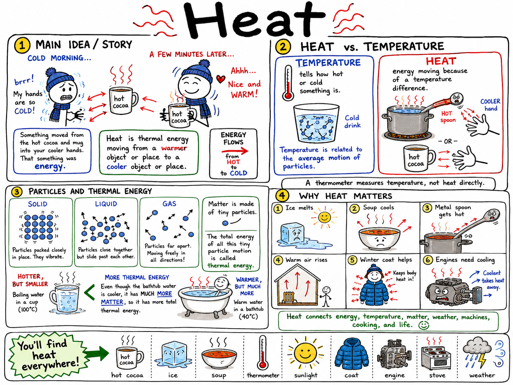
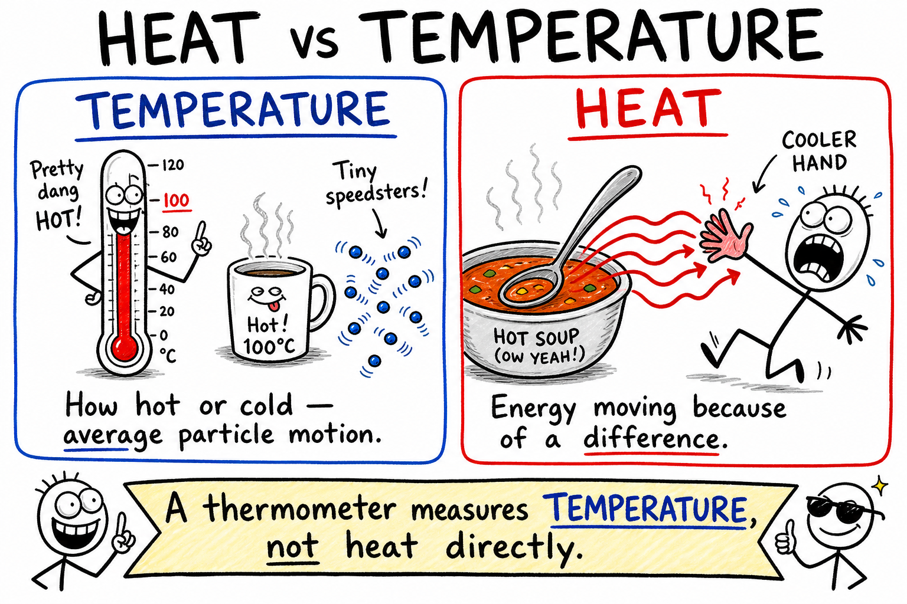
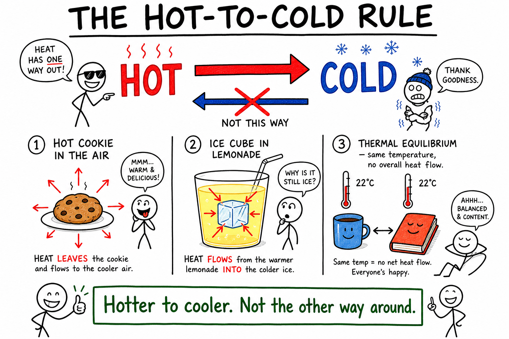
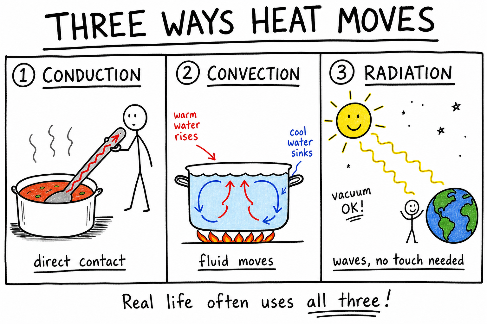
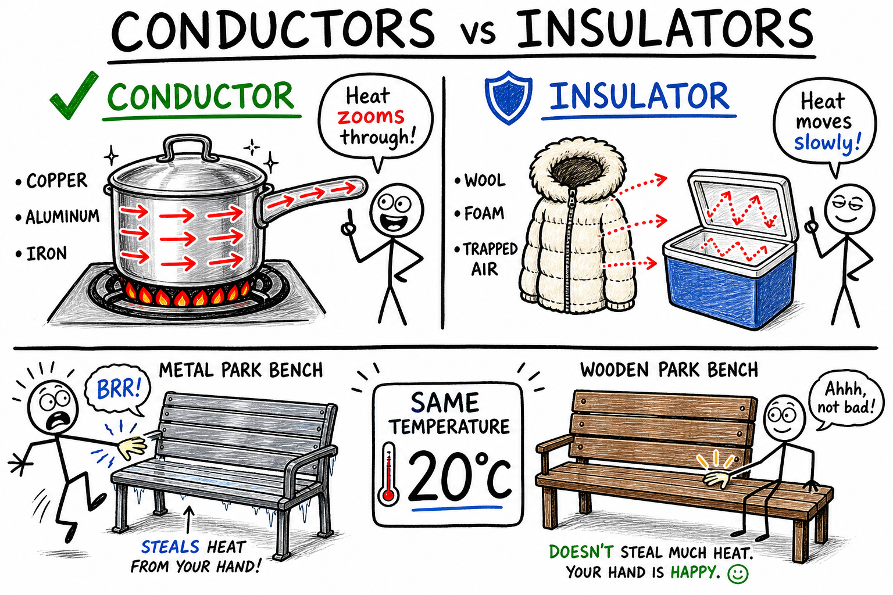
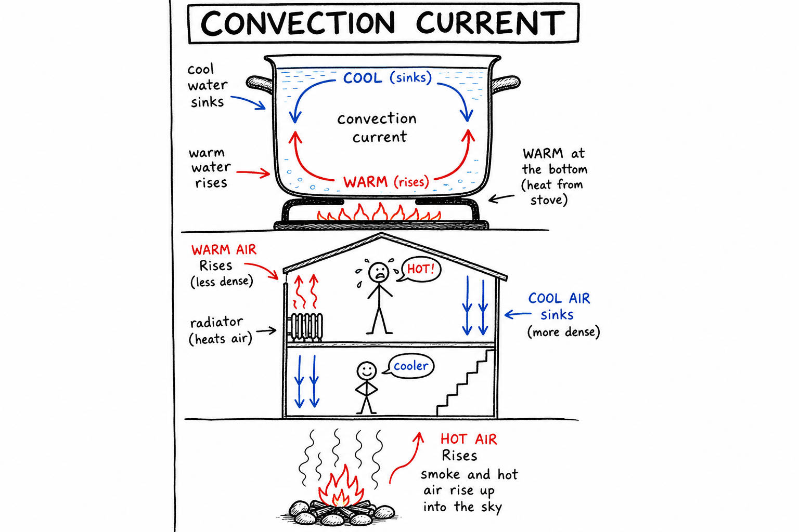
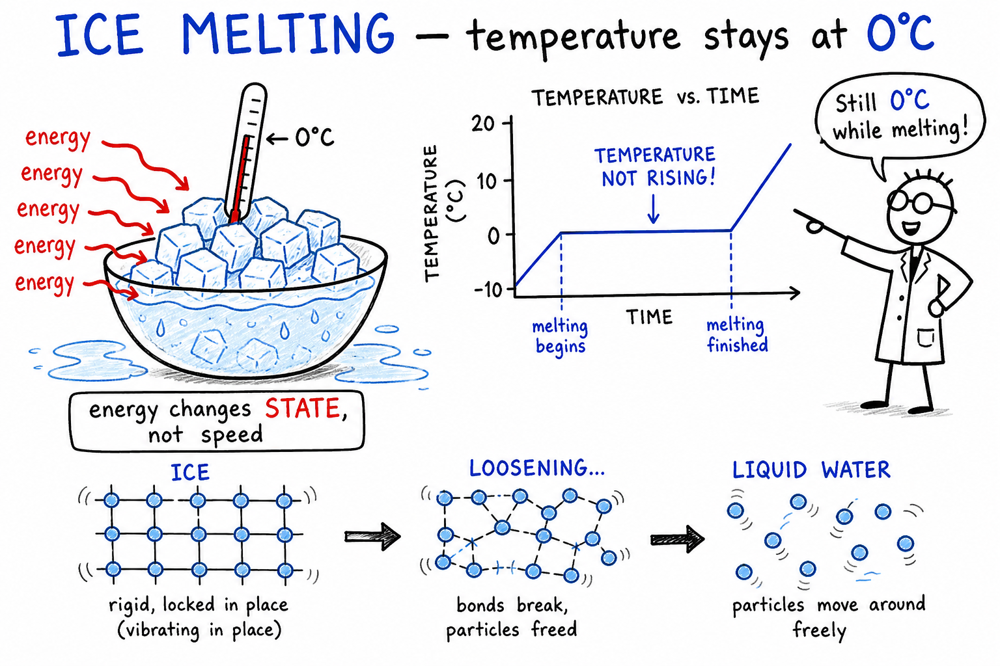

# Heat

Imagine you just pulled a slice of pizza from the oven. The cheese is bubbling. You reach for it anyway—and yank your hand back. The pan is metal. The crust is hot. Even the air above the slice feels like a small blast furnace.

A minute later, the pizza is still warm, but your fingers have stopped screaming. The heat did not vanish. It moved.

**Heat is thermal energy moving from a warmer object or place to a cooler object or place.**

Heat explains why ice melts on a summer sidewalk, why soup cools on the table, why a metal spoon in chili gets too hot to hold, why warm air rises near a campfire, why sunlight warms your face, why a gaming console needs fans, and why a winter coat actually helps on a cold day.

Heat is one of the most important ideas in science because it connects energy, temperature, matter, weather, machines, cooking, the human body, and life on Earth.

## Heat and Temperature Are Not the Same

People often say "heat" when they mean "temperature," but scientists treat them as different ideas.

**Temperature** tells how hot or cold something is. More exactly, it is related to the average motion energy of the particles in a substance.

**Heat** is energy moving because of a temperature difference.

If a hot object touches a cooler object, thermal energy moves from the hot object to the cooler one. That moving thermal energy is heat.

A thermometer measures temperature, not heat directly.

You can feel this difference in real life. A small cup of nearly boiling water has a very high temperature. A swimming pool on a warm afternoon has a lower temperature—but far more water. The pool can hold much more total thermal energy than the cup, even though each cupful feels hotter.

## Particles and Thermal Energy

Matter is made of tiny particles, such as atoms and molecules.

These particles are always moving, even in solid objects. In solids, particles mostly vibrate in place. In liquids, particles can slide past one another. In gases, particles move freely and rapidly.

The total energy of all this tiny particle motion is called **thermal energy**.

Temperature is related to the average motion of the particles. Thermal energy depends on both temperature and the amount of matter.

A bathtub of warm water may contain more thermal energy than a cup of boiling water because the bathtub has much more matter, even though its temperature is lower.

## The Hot-to-Cold Rule

Heat naturally flows from warmer matter to cooler matter.

A hot cookie on a plate cools down because thermal energy leaves the cookie and moves into the plate and surrounding air.

An ice cube in lemonade melts because thermal energy flows from the warmer lemonade into the colder ice.

The flow continues until the objects reach the same temperature, or until outside energy keeps a temperature difference going.

This final condition is called **thermal equilibrium**.

At thermal equilibrium, heat no longer flows between the objects overall because they are at the same temperature.

Remember the rule:

**Hotter to cooler. Not the other way around.**

## Three Ways Heat Moves

Heat can move in three main ways:

- **Conduction**
- **Convection**
- **Radiation**

**Conduction** transfers heat through direct contact.

**Convection** transfers heat by the movement of fluids such as liquids and gases.

**Radiation** transfers heat by electromagnetic waves, including infrared light.

Most real situations use more than one method at once. A pot on a stove heats by conduction from the burner, convection in the water, and radiation from the hot metal.

## Conduction

**Conduction** is heat transfer through direct contact between particles.

Place a metal spoon in a pot of hot soup. The end in the soup heats first. Soon the handle becomes warm too. Thermal energy moves from particle to particle through the metal.

Conduction happens best in solids, especially metals. Metals are good **thermal conductors** because their particles and free electrons pass energy along efficiently.

Wood, plastic, rubber, and air are poor conductors. They are often called **insulators**.

This is why pan handles may be covered with plastic or wood. The metal pan conducts heat well for cooking, while the handle material slows heat flow to your hand.

You have probably noticed something strange: on a cool day, a metal bench can feel freezing, while a wooden bench feels merely cool. Both may be at the same temperature. Metal just conducts heat away from your skin faster, so it feels colder.

## Conductors and Insulators

A **thermal conductor** is a material that lets heat move through it easily.

A **thermal insulator** is a material that slows heat transfer.

Metals such as copper, aluminum, and iron are good conductors. That is why pots, pans, bike frames, and heat sinks are often made of metal.

Materials such as wool, foam, cork, wood, plastic, and trapped air are good insulators.

A winter coat does not create heat by itself. It traps air and slows heat loss from your body. A cooler keeps food cold by slowing heat flow from the warm outside air into the cold inside space.

Insulation is about slowing heat transfer, not blocking it forever.

## Convection

**Convection** is heat transfer by the movement of a fluid.

A fluid is a substance that flows, such as a liquid or a gas.

When part of a fluid is heated, it often expands and becomes less dense. The warmer, less dense fluid rises. Cooler, denser fluid sinks to take its place. This creates a moving loop called a **convection current**.

Water heating in a pot can form convection currents. Warm water rises from the bottom, cooler water sinks, and the water circulates.

Air in a room can also move by convection. Warm air rises near a heater or radiator. Cooler air sinks elsewhere. This motion helps spread heat through the room.

Convection is why smoke from a campfire curls upward and why the attic of a house can feel much hotter than the basement on a summer day.

## Convection in Weather and Earth

Convection is not only a pot-of-water idea. It helps shape weather, oceans, and the planet.

Warm air rising and cooler air sinking help create winds, clouds, storms, and sea breezes.

In the ocean, differences in temperature and saltiness can help drive currents.

Inside Earth, very slow convection in hot rock helps move heat from the interior toward the surface. This motion is connected to volcanoes, earthquakes, and the movement of tectonic plates.

When you watch storm clouds build on a hot afternoon, you are watching convection on a huge scale.

## Radiation

**Radiation** is heat transfer by electromagnetic waves.

Radiation does not need matter to travel through. This is why sunlight can cross empty space and still warm Earth.

You feel radiation when sunlight warms your face, when you stand near a campfire, or when a hot sidewalk still gives off warmth after sunset.

Hot objects often give off infrared radiation. Very hot objects may also glow red, orange, yellow, or white because they emit visible light.

Radiation can travel through empty space, air, glass, and some other materials, depending on the type of radiation and the material.

Dark surfaces often absorb radiant energy more easily than light surfaces. That is one reason a black car hood can feel scorching in the sun while a white shirt stays more comfortable.

## Heat Capacity

Different substances warm up and cool down at different rates.

**Heat capacity** describes how much thermal energy an object must gain or lose to change its temperature by a certain amount.

A large pot of water takes more energy to warm than a small cup of water because the pot contains more water.

The amount of matter matters.

This is why a swimming pool may stay cool on a sunny morning even when the concrete deck around it feels hot. The pool has much more matter and needs much more energy to warm.

## Specific Heat

**Specific heat** is the amount of energy needed to raise the temperature of a certain amount of a substance by a certain amount.

Water has a high specific heat. It takes a lot of energy to warm water, and water releases a lot of energy as it cools.

This is why coastal areas often have milder temperatures than inland areas. Oceans warm and cool slowly, helping moderate nearby climates.

Metal usually has a lower specific heat than water. A metal spoon can heat quickly in hot soup, while a pot of water takes longer to warm.

Specific heat helps explain cooking, climate, weather, and body temperature.

## A Simple Heat Calculation

One common heat formula is:

**Heat energy = mass × specific heat × temperature change**

or

**Q = mcΔT**

Here, **Q** is heat energy, **m** is mass, **c** is specific heat, and **ΔT** means change in temperature.

For this chapter, keep the idea simple:

- More mass needs more energy to change temperature.
- A larger temperature change needs more energy.
- A substance with higher specific heat needs more energy for the same temperature change.

For example, heating 2 kilograms of water by 10 degrees takes twice as much energy as heating 1 kilogram of water by 10 degrees, if everything else is the same.

## Heat and Changes of State

Heat can change the state of matter.

Adding heat can melt a solid into a liquid, boil a liquid into a gas, or cause sublimation from solid directly to gas.

Removing heat can condense a gas into a liquid, freeze a liquid into a solid, or deposit a gas directly into a solid.

These changes are called **phase changes** or **changes of state**.

During a phase change, added or removed energy changes how particles are arranged, not just how fast they move.

That is why ice can remain at its melting temperature while it is melting. The energy is being used to change solid ice into liquid water, not to raise the temperature.

## Melting and Boiling

**Melting** happens when a solid becomes a liquid.

**Boiling** happens when a liquid becomes a gas throughout the liquid, not only at the surface.

Water melts from ice to liquid at 0 degrees Celsius under ordinary pressure. Water boils at 100 degrees Celsius under ordinary pressure at sea level.

Boiling temperature can change with pressure. At high altitudes, where air pressure is lower, water boils at a lower temperature.

This is why cooking pasta in the mountains can take longer than at sea level—the water boils before it gets as hot.

## Evaporation and Cooling

**Evaporation** is the change from liquid to gas at the surface of a liquid.

Evaporation can happen below the boiling point. A puddle can dry on a warm day even though it never boils.

Evaporation causes cooling because the fastest-moving particles are more likely to escape from the liquid. The particles left behind have lower average energy, so the liquid cools.

This is why sweat helps cool your body during a workout. As sweat evaporates from your skin, it carries energy away.

Spraying water on a hot sidewalk or misting plants works the same way: evaporation pulls energy out of the surface.

## Thermal Expansion

Many materials expand when heated and contract when cooled.

This happens because particles usually move more vigorously when heated and tend to spread slightly farther apart.

This effect is called **thermal expansion**.

Bridges, sidewalks, railroad tracks, and pipes may expand in hot weather and contract in cold weather. Engineers leave expansion joints or gaps so materials can move without cracking or buckling.

Thermal expansion also helps old-fashioned liquid thermometers work. As the liquid warms, it expands and rises in the narrow tube.

## Heat in Engines

Many engines use heat to do work.

A car engine burns fuel, producing hot gases. These gases expand and push pistons, helping turn the wheels.

A steam engine heats water to make steam. The expanding steam pushes parts of the machine.

Heat engines do not turn all heat energy into useful work. Some energy is always wasted as heat released to the surroundings.

This is why engines need cooling systems, radiators, oil, and careful design. Without cooling, parts overheat, metal can warp, and the engine can fail.

The same idea applies to computers, phones, and game consoles. Electronics produce waste heat. Fans and heat sinks move that heat away so the device keeps running.

## Heat in the Human Body

Your body produces heat as it uses energy from food.

The body must keep its internal temperature within a narrow range. If you become too hot or too cold, cells and organs can be harmed.

Your body cools itself by sweating, sending more blood to the skin, and increasing heat loss. It warms itself by shivering, reducing blood flow to the skin, and using stored energy.

Clothing, shelter, water, and behavior help the body manage heat.

Heat is not only outside you. It is part of staying alive—and part of performing well in sports, hiking, or any activity that pushes your body hard.

## Heat and Weather

Weather is powered largely by uneven heating of Earth.

The Sun warms Earth's surface. Land and water heat differently. Warm air rises, cool air sinks, and pressure differences create winds.

Water's high specific heat affects climates near oceans and lakes. Evaporation and condensation move heat through the atmosphere. Clouds, storms, and rainfall all involve heat transfer and changes of state.

A sunny day, a sea breeze, a thunderstorm, and morning fog all involve heat.

## Common Misconceptions

One common mistake is thinking heat and temperature are the same. Temperature tells how hot or cold something is. Heat is thermal energy moving because of a temperature difference.

Another mistake is thinking cold flows into warm objects. In ordinary situations, thermal energy flows from warmer objects to cooler ones.

A third mistake is thinking insulators create heat. Insulators slow heat transfer; they do not make heat from nothing.

A fourth mistake is thinking metal is always colder than wood. Metal often feels colder because it conducts heat away from your hand quickly, even if both materials are at the same temperature.

## Safety with Heat

Heat can be useful, but it can injure quickly.

Burns can come from hot metal, boiling water, steam, flames, hot oil, sunlight, electricity, and chemicals. Steam can be especially dangerous because it carries a great deal of energy and can condense on skin.

Good safety habits include:

- Use oven mitts or heat-safe gloves for hot objects.
- Keep handles of pans turned safely inward.
- Never touch hot metal, glass, or liquid without checking safely.
- Be careful with steam from kettles, pots, and microwaved food.
- Keep flammable materials away from flames and hot surfaces.
- Wear eye protection when heating substances in a lab.
- Do not seal containers that are being heated.
- Treat sun exposure seriously; use shade, clothing, and sunscreen when appropriate.

Understanding heat helps you use fire, stoves, sunlight, engines, and laboratory equipment more safely.

## The Big Idea

Heat is thermal energy moving from warmer matter to cooler matter.

Heat transfer happens by conduction, convection, and radiation. Temperature measures how hot or cold something is, while thermal energy depends on particle motion and the amount of matter. Heat can change temperature, change state, cause expansion, power engines, shape weather, and affect living things.

If you remember only one sentence, remember this:

**Heat is energy in motion from hotter places to cooler places.**

## Study Questions

1. What is heat?
2. How is heat different from temperature?
3. What is thermal energy?
4. How are particles in matter related to temperature?
5. Which direction does heat naturally flow?
6. What is thermal equilibrium?
7. What are the three main ways heat transfers?
8. What is conduction?
9. Why are metals usually good thermal conductors?
10. What is a thermal insulator?
11. How does a winter coat help keep a person warm?
12. What is convection?
13. What is a convection current?
14. Give two examples of convection in nature.
15. What is radiation?
16. Why can sunlight warm Earth through space?
17. What is heat capacity?
18. What is specific heat?
19. Why do oceans help moderate nearby climates?
20. In the formula Q = mcΔT, what do mass, specific heat, and temperature change affect?
21. What is a phase change?
22. Why can ice stay at its melting temperature while it is melting?
23. What is evaporation?
24. Why does sweating cool the body?
25. What is thermal expansion?
26. Why do bridges and sidewalks often need expansion joints?
27. How can heat be used to do work in an engine?
28. What are three safety rules for working around heat?
29. In your own words, explain why metal may feel colder than wood even when both are at the same room temperature.
