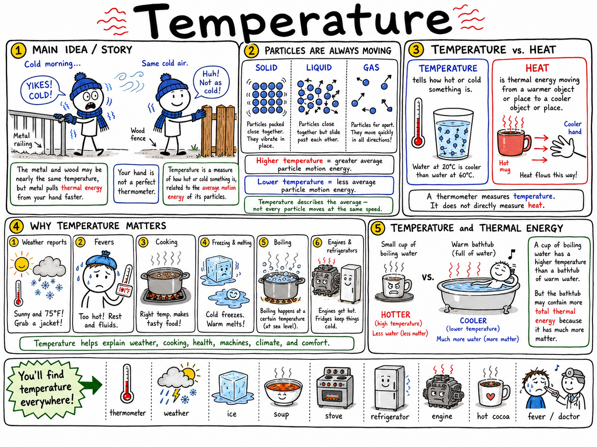
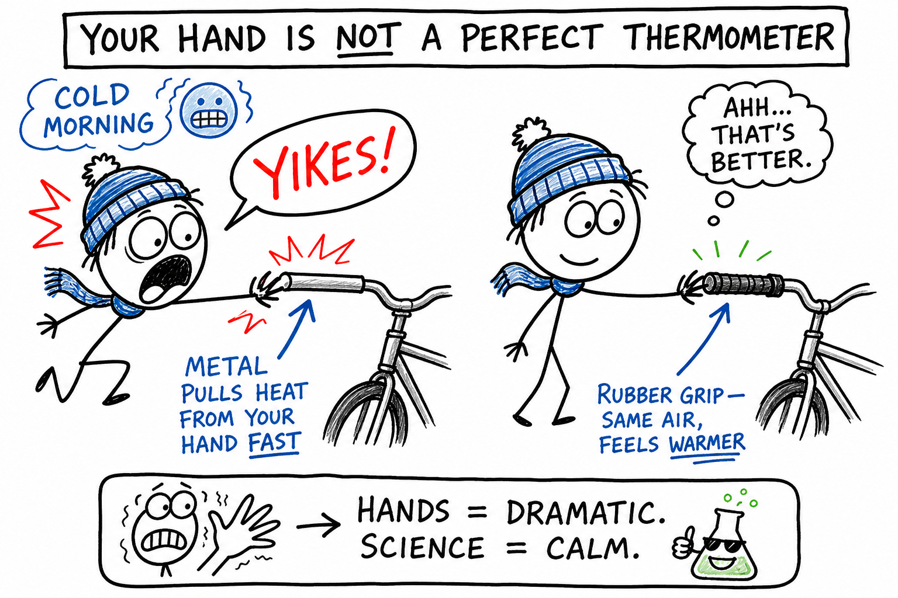
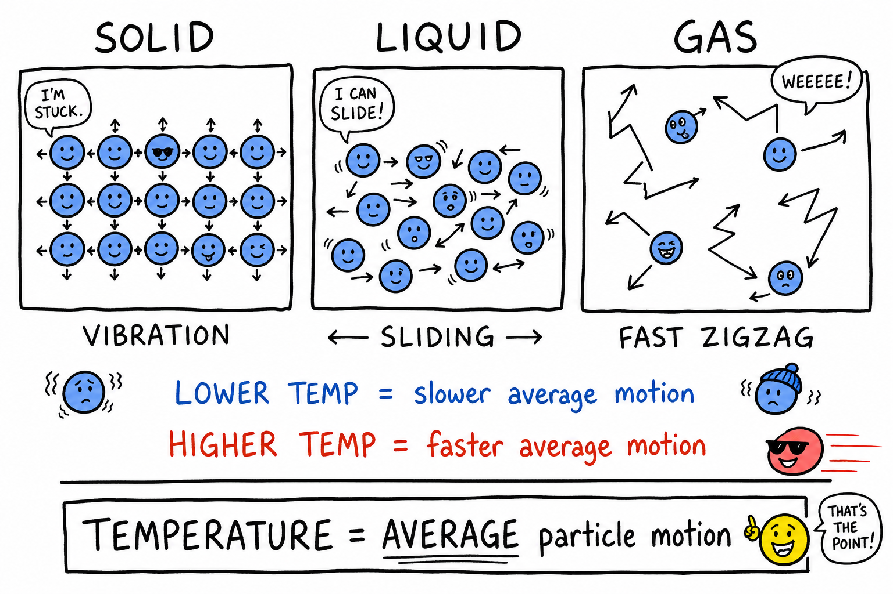
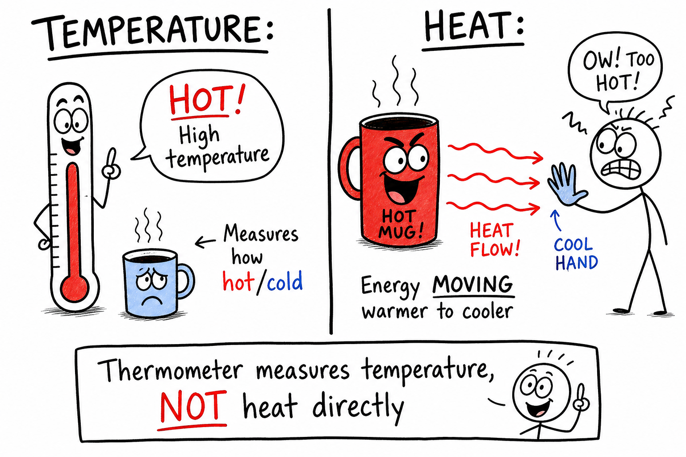
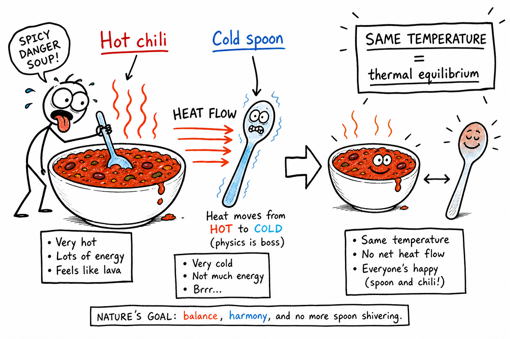
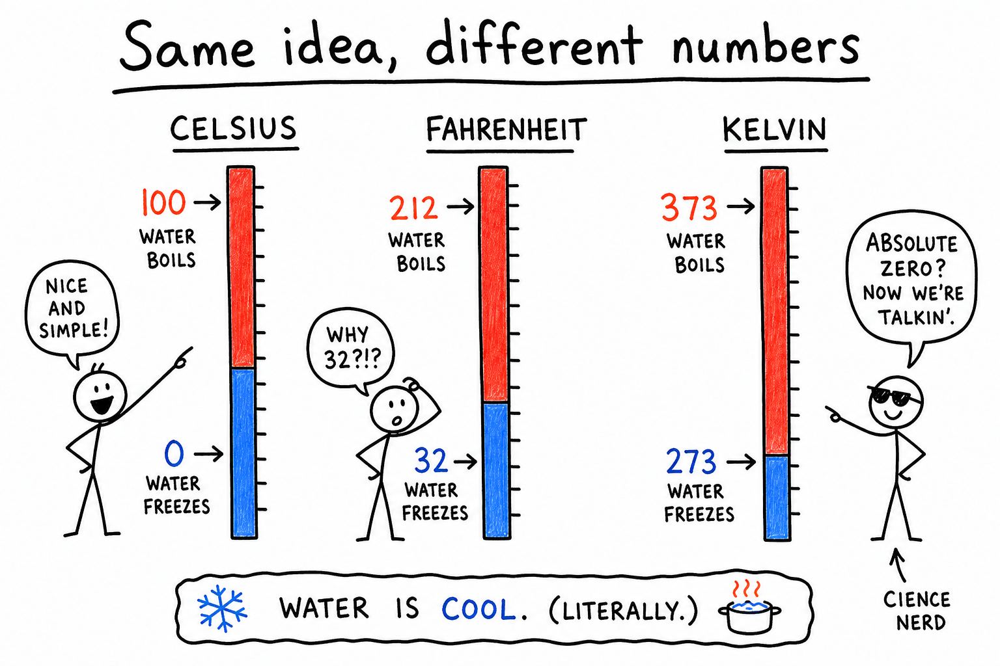
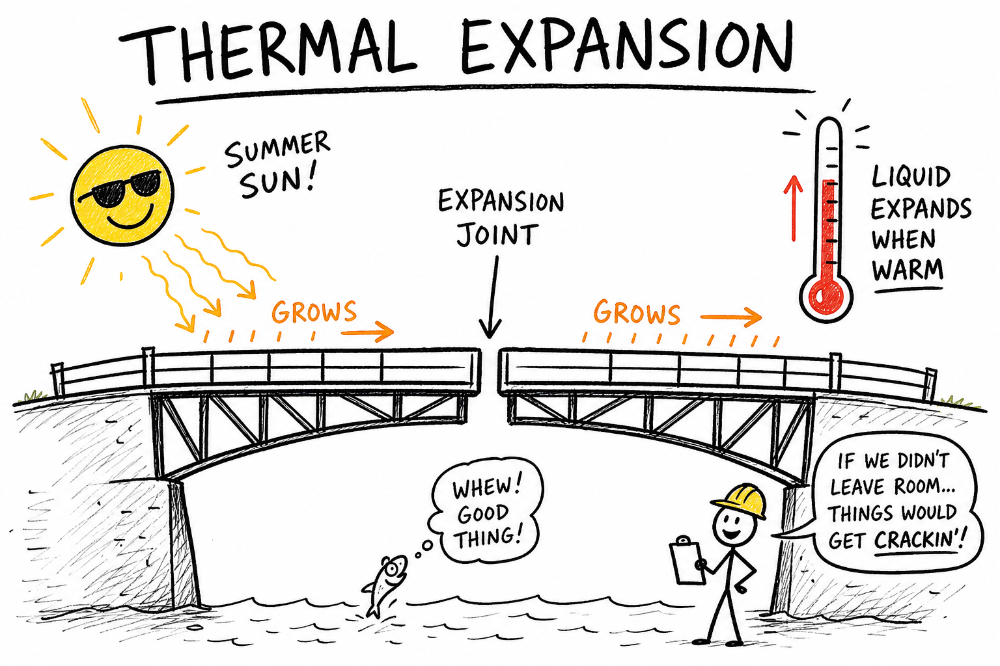

# Temperature

Imagine stepping outside on a freezing morning to grab your bike. You grab the metal handlebar first—and yank your hand back. "Ice!" you think. Then you touch the rubber grip. Same morning air. Same garage. The grip does not feel nearly as brutal.

Your hand lied to you.

The metal and rubber may be almost the same temperature. Metal just pulls thermal energy away from your skin faster. That is why it feels colder.

**Temperature is a measure of how hot or cold something is, related to the average motion energy of its particles.**

Temperature shows up everywhere: weather apps, fevers, pizza ovens, ice rinks, gaming consoles that overheat, tire pressure on a road trip, and whether your water bottle freezes in your backpack overnight. It is one of the most common measurements in daily life—and one of the easiest to misunderstand.

## Particles Are Always Moving

Matter is made of tiny particles—atoms and molecules.

They never stop moving.

In a **solid**, particles mostly vibrate in place. In a **liquid**, they slide past one another. In a **gas**, they zip around freely.

Temperature is tied to the **average** motion energy of those particles.

Higher temperature means greater average motion energy.

Lower temperature means less average motion energy.

Not every particle moves at the same speed. Some are faster. Some are slower. Temperature describes the average.

## Temperature and Heat

People mix these up all the time. Scientists do not.

**Temperature** tells how hot or cold something is.

**Heat** is thermal energy moving from a warmer object or place to a cooler object or place.

A thermometer measures temperature. It does not directly measure heat.

Here is the classic comparison: a small cup of nearly boiling water has a **higher temperature** than a full bathtub of warm water. But the bathtub can hold **more total thermal energy** because it has far more water—even though each cupful in the tub feels less extreme.

Temperature is about average particle energy per bit of matter. Total thermal energy also depends on **how much** matter you have.

Remember:

**Temperature tells hotness. Heat tells energy on the move.**

## Thermal Equilibrium

When two objects at different temperatures touch, thermal energy moves from the warmer one to the cooler one.

The warm object cools. The cool object warms.

If nothing else interferes, they eventually reach the **same temperature**. That is **thermal equilibrium**.

At thermal equilibrium, there is no overall heat flow between them—their temperatures match.

Drop a cold metal spoon into hot chili and watch: the spoon warms, the chili near the spoon cools a little, and they creep toward the same temperature. Same idea when you hold an ice pack on a sore knee, or when a cold drink warms up in your hand.

## Thermometers

A **thermometer** is an instrument used to measure temperature.

Different thermometers work in different ways:

- A **liquid thermometer** uses liquid that expands when warmed and contracts when cooled. The liquid rises or falls in a narrow tube.
- A **digital thermometer** uses electronic parts that change their electrical behavior with temperature.
- An **infrared thermometer** detects radiation from a surface and estimates temperature without touching it.

Every thermometer needs a **scale** so the reading means something. Without a scale, "42" on the display is just a number.

## Three Temperature Scales

Scientists and weather forecasters use three main scales:

- **Celsius** — science and most countries for everyday use
- **Fahrenheit** — everyday weather and body temperature in the United States
- **Kelvin** — science, especially physics and chemistry

They mark temperature differently, but all measure the same physical idea: how hot or cold something is.

### Celsius

Water freezes at **0 °C** and boils at **100 °C** under ordinary pressure at sea level.

Room temperature is often around **20 to 25 °C**. Normal body temperature is about **37 °C**.

Celsius fits science well because it is based on water's freezing and boiling points and works smoothly with metric units.

### Fahrenheit

Water freezes at **32 °F** and boils at **212 °F** under ordinary pressure at sea level.

Room temperature is often around **68 to 77 °F**. Body temperature is about **98.6 °F**.

One degree Celsius equals 1.8 degrees Fahrenheit. Fahrenheit's smaller steps can feel more precise for everyday weather—why U.S. forecasts often stick with it.

### Kelvin

Kelvin starts at **absolute zero**, the lowest possible temperature: **0 K**, equal to **-273.15 °C**.

Kelvin does not use the word "degrees." Write **300 K**, not "300 degrees K."

Kelvin is useful because it starts where particles have the least possible thermal motion, and it avoids negative numbers in many physics calculations.

Water freezes at about **273 K** and boils at about **373 K** under ordinary pressure at sea level.

## Absolute Zero

**Absolute zero** is the bottom of the temperature scale—not just "very cold," but the lowest temperature possible.

At absolute zero, particles have the least thermal motion nature allows. They cannot give up ordinary thermal energy they no longer have.

Scientists can get extremely close in special labs, but they cannot reach absolute zero exactly.

Understanding absolute zero helps scientists study atoms, superconductors, and strange forms of matter at the edge of physics.

## Converting Temperatures

You do not need every formula memorized, but a few anchor points help:

| Situation | Celsius | Fahrenheit | Kelvin |
|-----------|---------|------------|--------|
| Water freezes | 0 °C | 32 °F | 273 K |
| Room temperature | ~20–25 °C | ~68–77 °F | — |
| Body temperature | ~37 °C | ~98.6 °F | — |
| Water boils | 100 °C | 212 °F | 373 K |

For Celsius and Kelvin, one step is the same size. Kelvin is Celsius shifted upward:

**K = °C + 273.15**

For quick classroom estimates:

**K ≈ °C + 273**

## Thermal Expansion

Most materials **expand** when warmed and **contract** when cooled.

Warmer particles usually move more vigorously and spread slightly farther apart. That is **thermal expansion**.

It shows up in:

- Liquid thermometers (liquid rises in the tube)
- Bridge and sidewalk **expansion joints** (room to grow in summer heat)
- Railroad tracks and power lines (length changes with season)
- Metal jar lids (a warm lid can loosen enough to twist open)

Temperature changes can change size—and engineers plan for it.

## Temperature and State of Matter

Temperature helps decide whether matter is solid, liquid, or gas.

At low temperatures, many substances are solid—particles lack enough energy to move freely past one another.

Raise the temperature and a solid may **melt** into a liquid.

Raise it more and a liquid may **boil** or **evaporate** into a gas.

The exact temperatures depend on the substance and the pressure.

Water melts at 0 °C and boils at 100 °C under ordinary pressure—but iron, wax, and oxygen have very different melting and boiling points.

## Temperature and Pressure

Temperature strongly affects **pressure**, especially in gases.

Heat a gas in a closed container and its particles move faster. They hit the walls harder and more often. Pressure rises.

That is why you should not heat sealed containers unless they are built for it—a heated sealed container can burst.

Tire pressure changes with temperature too. Cold morning air can mean lower pressure. After driving or on a hot afternoon, pressure can climb. Check tires when they are cold for the most accurate reading.

## Temperature and Weather

Weather reports lead with temperature because so much else follows from it.

Warm air can hold more water vapor than cold air. Temperature differences drive pressure differences, winds, clouds, and storms.

Land warms and cools faster than large bodies of water. That difference helps create **sea breezes** and shapes coastal climates.

Daily temperature swings affect frost, fog, dew, snow, and thunderstorms. Meteorologists watch temperature like coaches watch the scoreboard—it tells them what the atmosphere is doing next.

## Temperature and the Human Body

Your body works best in a narrow internal temperature range.

Normal body temperature is often about **37 °C (98.6 °F)**, though it varies by person and time of day.

Too hot: heat exhaustion or heatstroke become risks. Too cold: **hypothermia**.

Your body fights back with sweating, shivering, changing blood flow to the skin, and behavior—shade, water, layers, movement.

A thermometer reading during illness matters because **fever** often means your body is fighting infection. Coaches, hikers, and athletes who push hard in heat or cold need the same awareness.

## Temperature in Cooking

Cooking is controlled temperature.

Heat changes food: proteins reshape, starches soften, water boils off, fats melt, sugars brown.

A refrigerator slows microbes by staying cold. A freezer slows change even more by keeping water solid.

An oven or grill uses high heat to change texture, flavor, and safety.

Cooking safely often means hitting the right **internal** temperature—not just heating for a set number of minutes. A burger can look done on the outside while the center is still undercooked.

## Temperature in Engineering

Engineers design for temperature because materials and machines do not stay the same when hot or cold.

Engines need cooling. Electronics fail when they overheat—ask anyone whose laptop fan sounds like a jet during a long gaming session. Aircraft, bridges, roads, and spacecraft must survive expansion, contraction, and strength changes.

Good design asks:

- How hot will this part get?
- How cold might it become?
- Will it expand or contract?
- Will it still be strong?
- How do we measure and control heat?

Temperature is not just a number on a screen. It is a design condition.

## Measuring Temperature Carefully

Good measurement takes care.

Use the right thermometer for the job: room air, food, body, engine coolant. Let the thermometer **equilibrate**—give it time to match what you are measuring. Read the scale carefully. Avoid touching the sensing part with warm fingers if that would skew the reading.

**Infrared** thermometers read **surface** temperature. The outside of a baked potato can be scorching while the center is still cool.

Wrong tool, wrong technique, wrong conclusion.

## Common Misconceptions

**Mistake 1:** Thinking temperature and heat are the same. Temperature measures hotness (average particle motion). Heat is energy moving because of a temperature difference.

**Mistake 2:** Trusting touch as an exact thermometer. Metal and wood at the same temperature can feel different because they conduct heat at different rates.

**Mistake 3:** Thinking cold is a substance that flows into warm things. In ordinary situations, thermal energy flows from warmer matter to cooler matter.

**Mistake 4:** Assuming water always boils at exactly 100 °C. Boiling point depends on pressure—it is lower on a mountain than at sea level.

**Mistake 5:** Writing "degrees Kelvin." Kelvin values use **K** only: 300 K, not 300 °K.

## Safety with Temperature

Temperature can injure even when nothing looks dangerous.

Steam, hot metal, boiling water, dry ice, freezing weather, and overheated engines are all serious hazards.

Good habits:

- Use the correct thermometer for the job.
- Do not touch unknown hot or cold objects with bare hands.
- Use oven mitts or heat-safe gloves when needed.
- Keep faces and hands away from steam.
- Do not heat sealed containers.
- Dress for cold or hot weather.
- Take fever, heat exhaustion, frostbite, and hypothermia seriously.
- Follow lab instructions for very hot or very cold materials.

Temperature is easy to measure. Its effects can be powerful.

## The Big Idea

Temperature measures how hot or cold something is—related to the average motion energy of its particles.

It is not the same as heat, which is thermal energy moving because of a temperature difference. Thermometers report temperature on Celsius, Fahrenheit, or Kelvin scales. Temperature affects expansion, state changes, pressure, weather, cooking, machines, and living things.

If you remember only one sentence, remember this:

**Temperature tells how hot or cold matter is by describing the average motion energy of its particles.**

## Study Questions

1. What is temperature?
2. Why is your hand not a perfect thermometer?
3. How are particles in matter related to temperature?
4. What is the difference between temperature and heat?
5. Why can a bathtub of warm water contain more thermal energy than a cup of boiling water?
6. What is thermal equilibrium?
7. What is a thermometer?
8. How does a liquid thermometer work?
9. What are the three most important temperature scales?
10. At what temperatures does water freeze and boil on the Celsius scale under ordinary pressure at sea level?
11. At what temperatures does water freeze and boil on the Fahrenheit scale under ordinary pressure at sea level?
12. What is the Kelvin scale used for, and how do you write a Kelvin value correctly?
13. What is absolute zero?
14. How do you estimate kelvin from degrees Celsius?
15. What is thermal expansion?
16. Give two examples of thermal expansion in everyday life or engineering.
17. How does temperature affect state of matter?
18. Why can heating a gas in a sealed container increase pressure?
19. How can temperature affect weather?
20. What is normal human body temperature approximately in Celsius and Fahrenheit?
21. How does the body cool itself when too hot?
22. Why is internal temperature important in cooking, not just cooking time?
23. Why must engineers design for temperature changes?
24. Why can metal feel colder than wood even when both are the same temperature?
25. What are three safety rules related to temperature?
26. In your own words, explain why temperature is not the same as heat.
