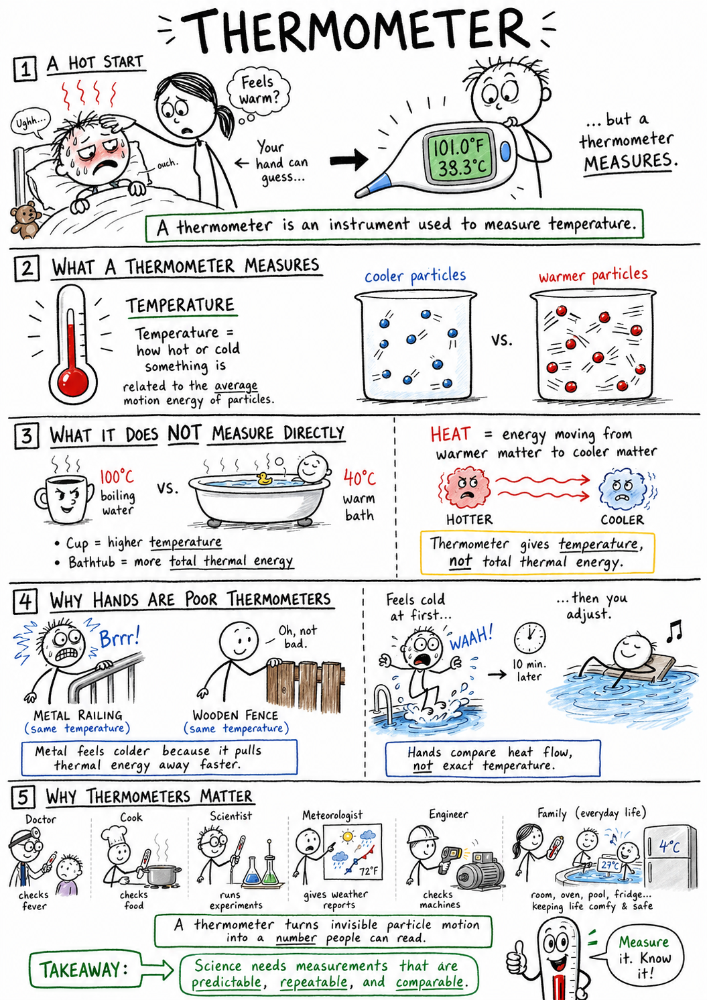
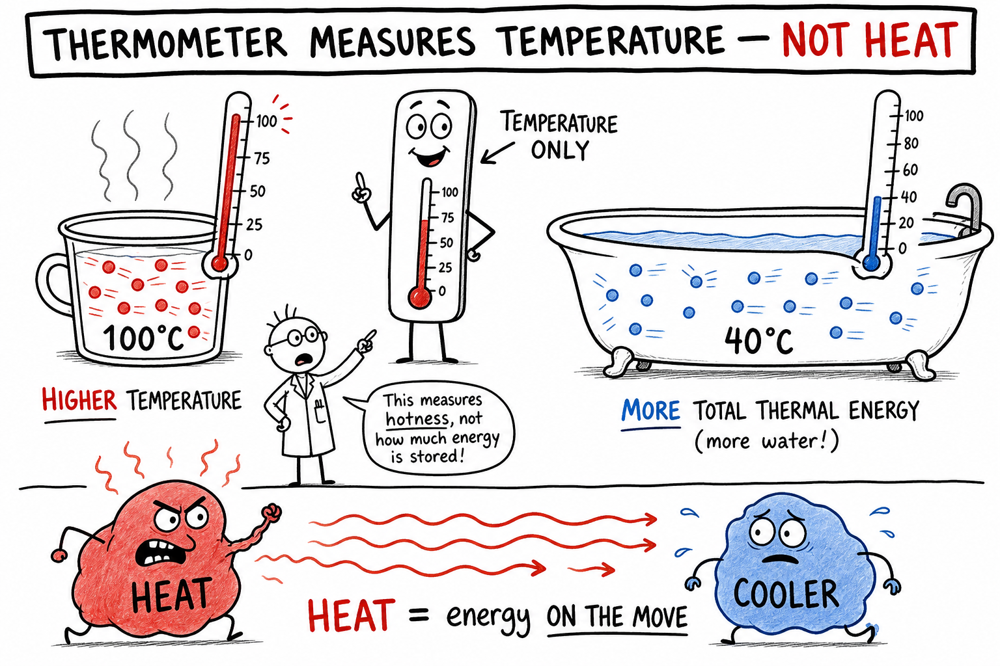
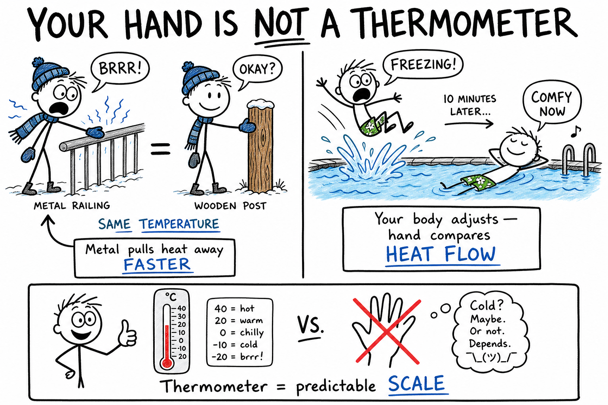
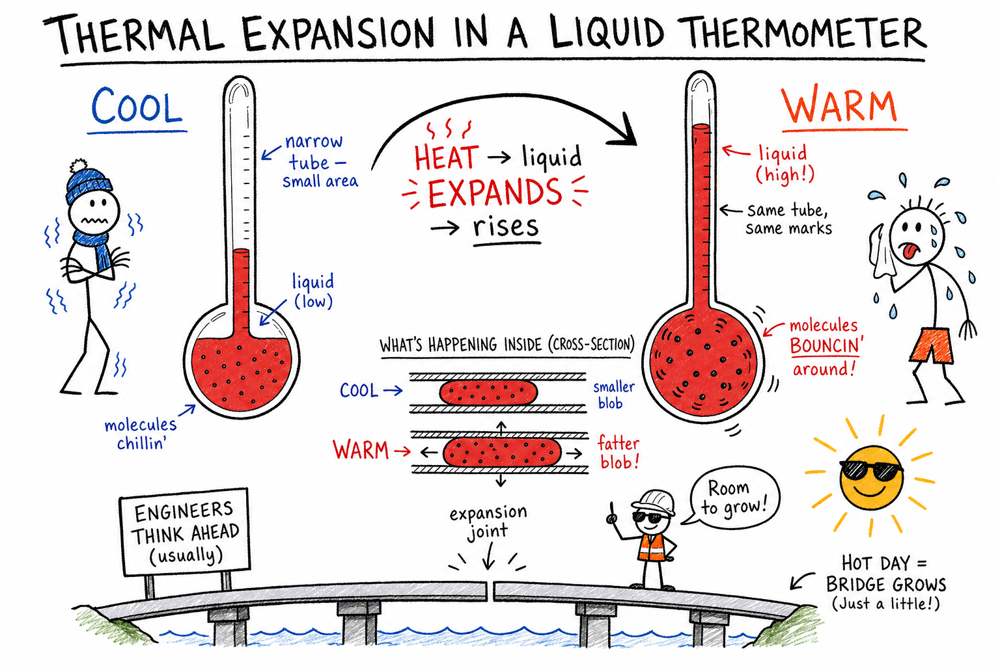
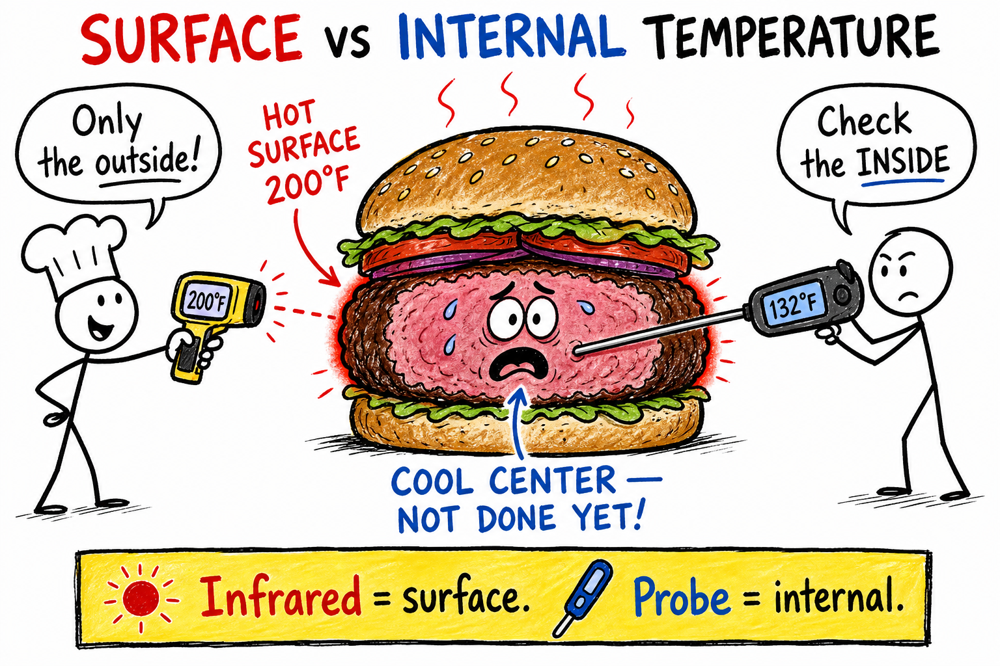
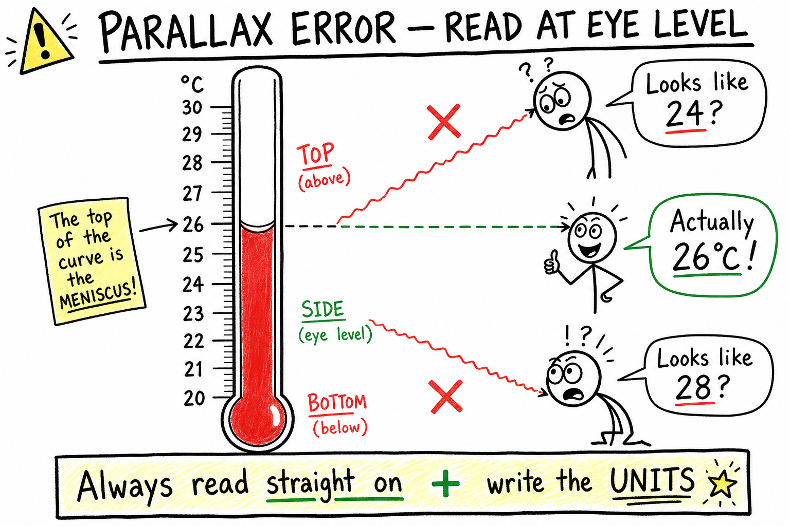
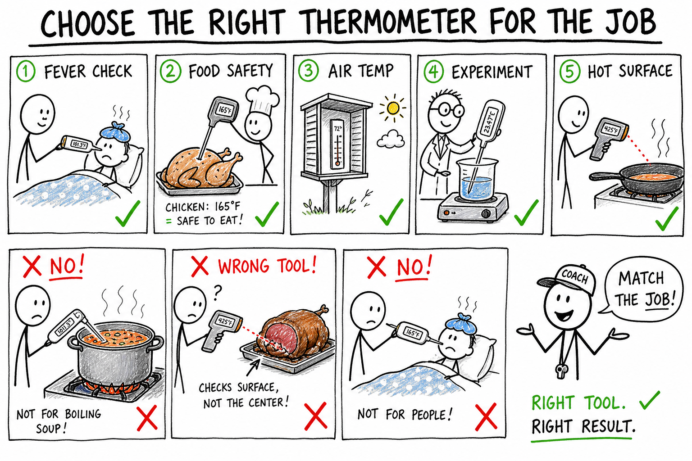

# Thermometer

Imagine waking up before a big game feeling hot, tired, and achy. Your forehead feels warm, but your hand cannot tell exactly how warm. Your parent places a thermometer under your tongue or near your forehead. A few seconds later, a number appears.

Now you know more than "warm." You know a measured temperature.

That is the job of a thermometer.

**A thermometer is an instrument used to measure temperature.**

Thermometers help doctors check fevers, cooks make food safe, scientists run experiments, meteorologists report weather, engineers monitor machines, and families decide whether a room, oven, pool, or refrigerator is at the right temperature.

A thermometer turns the invisible motion of tiny particles into a number people can read.

## What a Thermometer Measures

A thermometer measures **temperature**.

Temperature tells how hot or cold something is. More exactly, it is related to the average motion energy of the particles in a substance.

A thermometer does not measure heat directly. **Heat** is thermal energy moving from warmer matter to cooler matter. Temperature is the measurement of hotness or coldness.

This difference matters.

A cup of nearly boiling water has a **higher temperature** than a warm bathtub. But the bathtub may contain **more total thermal energy** because it has much more water.

The thermometer gives a temperature reading, not the total amount of thermal energy.

Remember:

**Temperature tells hotness. Heat tells energy on the move.**

## Why Your Hand Is Not a Thermometer

Your skin can sense warmth and cold, but it is not a reliable measuring instrument.

Metal and wood at the same temperature can feel different because metal conducts thermal energy away from your hand faster. A swimming pool may feel cold at first and comfortable later because your body adjusts. A fever may feel different depending on the room, blankets, and how you feel overall.

Your hand compares **heat flow**, not exact temperature.

A thermometer is better because it responds in a predictable way and uses a **scale**.

Science depends on measurements that can be repeated and compared.

## Liquid Thermometers

A **liquid thermometer** uses a liquid sealed inside a narrow glass tube.

When the liquid warms, it **expands** and rises in the tube. When the liquid cools, it **contracts** and falls.

The tube has marks beside it showing a temperature scale. The top of the liquid column points to the temperature reading.

Older thermometers often used **mercury**, a shiny silver liquid metal. Many modern liquid thermometers use colored alcohol or another safer liquid.

Mercury thermometers are less common now because mercury is poisonous if released.

## Thermal Expansion

Liquid thermometers work because of **thermal expansion**.

Thermal expansion is the tendency of many materials to expand when heated and contract when cooled.

The liquid in the thermometer expands more noticeably than the glass tube. Since the tube is very narrow, even a small expansion makes the liquid rise a visible distance.

This clever design turns a tiny change in volume into a readable change in height.

The same principle appears in bridges, sidewalks, railroad tracks, and metal jar lids. Engineers leave **expansion joints** so materials have room to grow in summer heat without cracking.

## Digital Thermometers

A **digital thermometer** uses electronic parts to measure temperature.

Many digital thermometers contain a sensor whose electrical resistance changes with temperature. A small computer inside turns that electrical change into a number on a screen.

Digital thermometers are common in medicine, cooking, weather stations, cars, refrigerators, and laboratories.

They are often fast and easy to read. Some can store readings, beep when ready, or send data to other devices.

Even so, they must be used correctly. A digital thermometer can give a poor reading if placed badly, removed too soon, or used for the wrong job.

## Infrared Thermometers

An **infrared thermometer** measures infrared radiation coming from a surface.

All warm objects give off infrared radiation. An infrared thermometer detects that radiation and estimates the surface temperature.

Infrared thermometers are useful because they do not need to touch the object. They can measure hot pans, machine parts, electrical equipment, food surfaces, or a person's forehead from a short distance.

But infrared thermometers measure **surface temperature**, not always internal temperature.

A burger may have a hot surface and a cooler center. A forehead reading may be affected by sweat, wind, distance, or poor aim.

Non-contact measurement is useful, but it must be understood.

## Medical Thermometers

Medical thermometers measure body temperature.

They may be used orally, under the arm, rectally, in the ear, or on the forehead, depending on the type and instructions.

Normal human body temperature is often given as about **37 °C** or **98.6 °F**, but it varies during the day and from person to person.

A **fever** is usually a sign that the body is responding to illness or infection. A very high temperature can be dangerous and should be taken seriously.

Medical thermometers must be clean, used correctly, and read carefully.

## Cooking Thermometers

Cooking thermometers help make food safe and well prepared.

Food may look cooked on the outside but still be too cool inside. Meat, poultry, eggs, casseroles, and reheated foods can contain harmful microbes if not heated enough.

A cooking thermometer measures **internal temperature** when its probe is placed correctly in the **thickest part** of the food, away from bone, fat, or the pan.

Candy thermometers and deep-fry thermometers measure very high temperatures for sugar syrups or cooking oil.

The right thermometer matters because different jobs require different temperature ranges.

## Weather Thermometers

Weather thermometers measure air temperature.

To measure air temperature well, the thermometer should be **shaded from direct sunlight** and placed where air can move around it. If a thermometer sits in bright sun, it may read too high because sunlight warms the thermometer itself—not just the air.

Weather stations often place thermometers in ventilated shelters. These shelters protect instruments from rain and direct sun while allowing air to circulate.

A good weather temperature is not the temperature of pavement, a car hood, or a sunny wall. It is the temperature of the air under standard measuring conditions.

## Laboratory Thermometers

Laboratory thermometers are used in science experiments.

They may measure the temperature of water, air, soil, chemical mixtures, or equipment.

A lab thermometer should be chosen for the correct temperature range. A thermometer designed for body temperature is not suitable for boiling liquids. A cooking thermometer may not be precise enough for certain experiments.

Good lab work requires careful measurement:

- Use the correct thermometer.
- Place it properly.
- Wait for the reading to settle.
- Read the scale at eye level.
- Record the units.

Careful temperature measurement can change the quality of an experiment.

## Temperature Scales

Thermometers use temperature scales.

The three most important scales are:

- **Celsius** — science and most countries for everyday use
- **Fahrenheit** — everyday weather and body temperature in the United States
- **Kelvin** — science, especially physics and chemistry

| Situation | Celsius | Fahrenheit |
|-----------|---------|------------|
| Ice water (ordinary conditions) | ~0 °C | ~32 °F |
| Room temperature | ~20–25 °C | ~68–77 °F |
| Normal body temperature | ~37 °C | ~98.6 °F |
| Boiling water (sea level, ordinary pressure) | ~100 °C | ~212 °F |

A thermometer must show which scale it is using. **25** on the display means nothing until you know whether it is Celsius or Fahrenheit.

Kelvin starts at absolute zero and does not use the word "degrees." Write **300 K**, not "300 degrees K."

## Reading a Thermometer

Reading a thermometer sounds easy, but mistakes are common.

First, **check the scale**. Is it Celsius or Fahrenheit?

Second, look at the spacing between marks. Does each small line mean 1 degree, 2 degrees, or something else?

Third, read at **eye level** if using a liquid thermometer. Looking from above or below can make the reading appear wrong. This is called **parallax error**.

Fourth, **include the unit** in your answer. Writing "25" is incomplete. Writing "25 °C" is clear.

Careful reading is part of good science.

## Calibration

**Calibration** means checking or adjusting an instrument so its readings are accurate.

A thermometer can be tested using known temperatures. For example, a mixture of ice and water should be close to **0 °C** under ordinary conditions. Boiling water should be close to **100 °C** at sea level under ordinary pressure.

If a thermometer gives readings that are consistently too high or too low, it may need adjustment, correction, or replacement.

Calibration matters in medicine, cooking, engineering, and science.

An inaccurate thermometer can lead to wrong conclusions or unsafe choices.

## Accuracy and Precision

**Accuracy** means how close a measurement is to the true value.

**Precision** means how fine or repeatable the measurement is.

A thermometer that reads 38.0 °C every time when the true temperature is 37.0 °C is precise but not accurate.

A thermometer that gives readings of 36, 38, and 37 °C for the same object may be near the right value sometimes, but it is not very precise.

Good instruments should be both accurate and precise enough for the job.

## Response Time

Thermometers do not always show the correct temperature instantly.

They need time to come to **thermal equilibrium** with what they are measuring.

A cold thermometer placed in warm water begins by reading too low. As thermal energy flows into it, the reading rises. When it stops changing, the thermometer and water are closer to the same temperature.

This waiting period is called **response time**.

Some thermometers respond quickly. Others take longer. Removing a thermometer too soon can give a wrong reading.

## Surface and Internal Temperature

Surface temperature and internal temperature can be different.

An oven may be hot, but a potato inside may still be cool in the center. A person may have a warm forehead after exercise but not have a fever. A metal engine part may be hot on the outside while another part inside is hotter still.

Infrared thermometers measure surface temperature. Probe thermometers can measure internal temperature if placed correctly.

The right measurement depends on the question.

If you want to know whether chicken is safely cooked, you need **internal** temperature. If you want to know whether a griddle surface is hot, **surface** temperature may be enough.

## Thermometers and Phase Changes

Thermometers help study melting, freezing, boiling, and condensation.

When ice melts in water, the mixture can stay near **0 °C** until much of the ice has melted. Heat energy is being used to change ice into liquid water rather than raising the temperature quickly.

When water boils under ordinary pressure at sea level, it stays near **100 °C** while boiling. Added energy changes liquid water into steam.

A thermometer lets you see that temperature can remain steady during a phase change.

This is one reason thermometers are powerful scientific tools.

## Thermometers in Machines

Machines often need temperature monitoring.

Cars use temperature sensors to help prevent engines from overheating. Computers use sensors to control fans and protect electronic parts—anyone whose laptop sounds like a jet during a long gaming session has met this idea. Refrigerators use thermostats to keep food cold. Ovens use temperature controls to cook food properly.

A **thermostat** is a device that helps control temperature, often by turning heating or cooling systems on and off.

Temperature sensors are hidden in many machines. They help machines protect themselves and do their jobs.

## Choosing the Right Thermometer

A thermometer is useful only if it suits the job.

Good measurement asks:

- What am I measuring—air, body, food, liquid, or a surface?
- Do I need surface temperature or internal temperature?
- What temperature range is expected?
- How fast must the reading settle?
- Which scale will I record?

Using a medical thermometer in boiling soup, or an infrared thermometer to check whether a roast is done in the center, can give misleading or unsafe results.

## Common Misconceptions

**Mistake 1:** Thinking a thermometer measures heat. It measures temperature, not heat directly.

**Mistake 2:** Trusting touch as more reliable than a thermometer. Touch can be fooled by heat transfer, surface material, and body condition.

**Mistake 3:** Reading a thermometer without checking the scale. Celsius and Fahrenheit numbers are very different.

**Mistake 4:** Assuming surface temperature and internal temperature are always the same.

**Mistake 5:** Thinking every thermometer can be used for every job. Medical, cooking, weather, infrared, and laboratory thermometers have different purposes and limits.

## Safety with Thermometers

Thermometers are useful instruments, but they must be used safely.

Good safety habits include:

- Use the correct thermometer for the task.
- Do not use a medical thermometer for cooking or laboratory chemicals.
- Do not use a cooking thermometer as a medical thermometer.
- Handle glass thermometers carefully.
- Tell an adult or teacher if a thermometer breaks.
- Avoid mercury thermometers unless handled by trained adults under proper rules.
- Clean medical thermometers according to instructions.
- Keep probe tips away from hands when measuring hot food or liquids.
- Do not point infrared thermometers with laser pointers at eyes.
- Record units clearly to avoid dangerous mistakes.

A thermometer is a measuring tool, not a toy.

## The Big Idea

A thermometer is an instrument that measures temperature.

Different thermometers use different physical effects, such as liquid expansion, electrical changes, or infrared radiation. Good temperature measurement requires the correct instrument, careful placement, enough response time, the right scale, and clear units.

If you remember only one sentence, remember this:

**A thermometer turns temperature into a reliable number when it is chosen, used, and read correctly.**

## Study Questions

1. What is a thermometer?
2. What does a thermometer measure?
3. Why does a thermometer not measure heat directly?
4. Why is your hand a poor thermometer?
5. How does a liquid thermometer work?
6. What is thermal expansion?
7. Why are mercury thermometers less common today?
8. How does a digital thermometer measure temperature?
9. What does an infrared thermometer measure?
10. Why might an infrared thermometer not tell the internal temperature of food?
11. What are medical thermometers used for?
12. What is normal human body temperature approximately in Celsius and Fahrenheit?
13. Why are cooking thermometers important?
14. Where should a cooking thermometer be placed to measure internal food temperature?
15. How should a weather thermometer be placed for a good air temperature reading?
16. What are the three most important temperature scales?
17. Why must you check the scale before reading a thermometer?
18. What is parallax error?
19. Why should units be recorded with temperature readings?
20. What is calibration?
21. How can ice water help check a thermometer?
22. What is the difference between accuracy and precision?
23. What is response time?
24. Why can surface temperature and internal temperature be different?
25. What is a thermostat?
26. Why does choosing the correct thermometer matter?
27. What are three safety rules for using thermometers?
28. In your own words, explain why a thermometer is more trustworthy than touch for measuring temperature.
