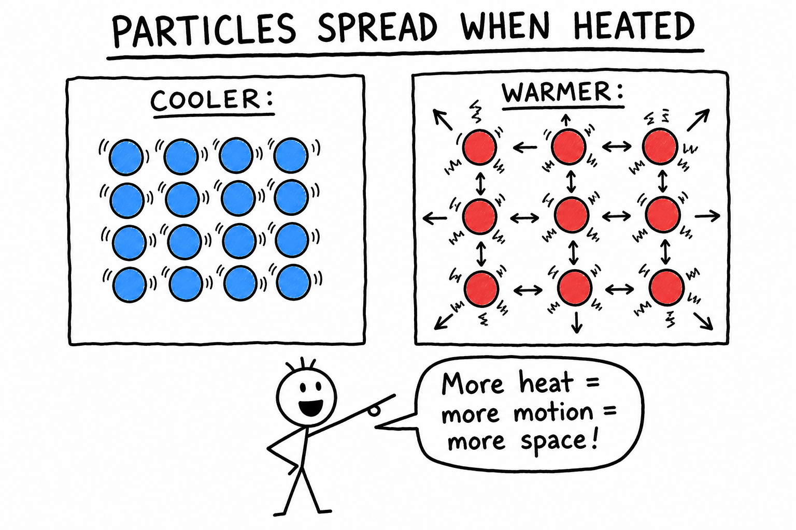
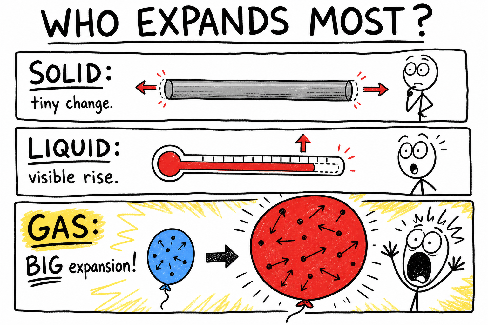
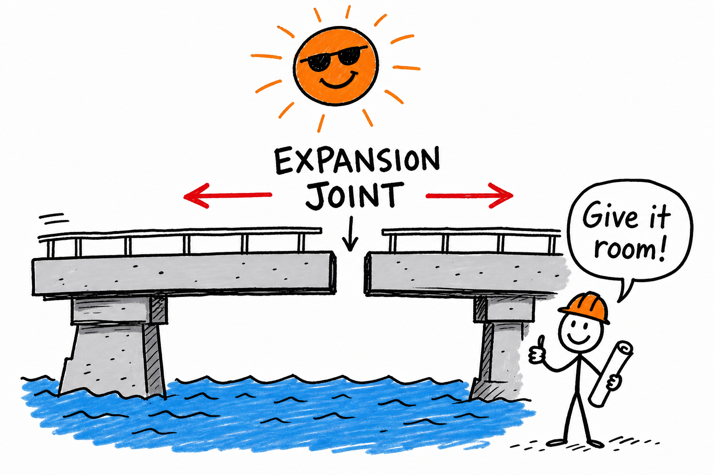
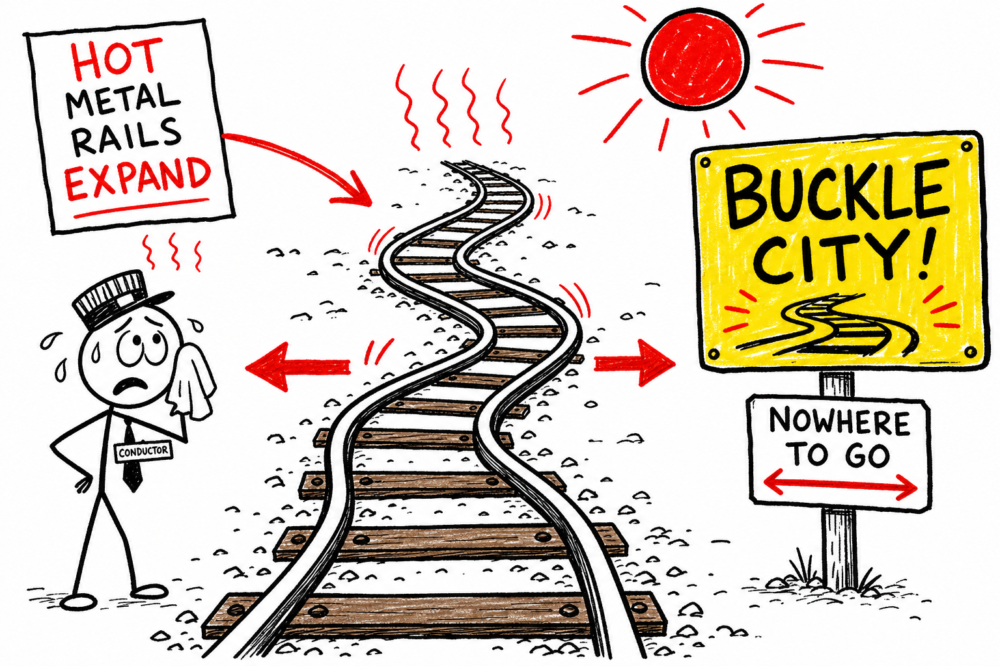
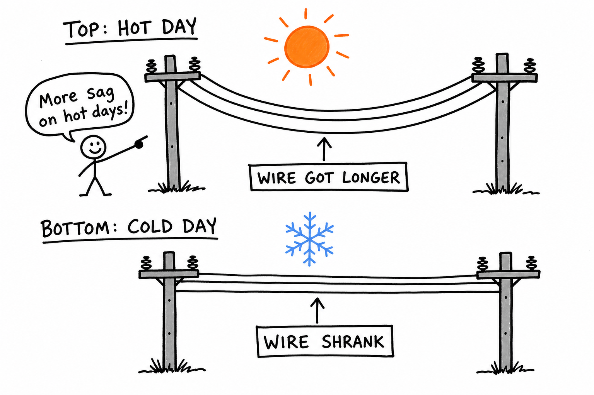
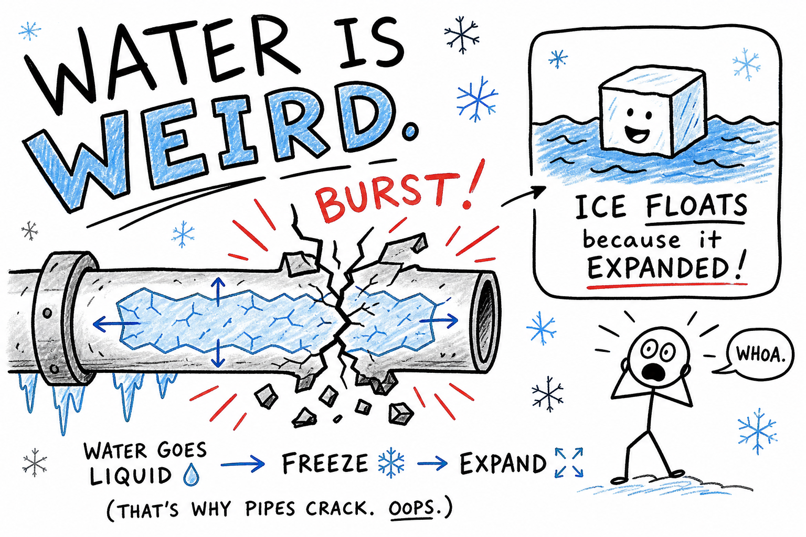

# Expansion by heat

You have been there: a jar of pickles, a pasta sauce lid, or a jam jar that will not budge. You twist until your hand hurts. Your brother tries. Your dad tries. Nobody wins.

Then someone runs warm water over the metal lid for thirty seconds. You twist again—and pop. It opens.

The glass did not magically shrink. The lid did not lose weight. The metal **expanded** slightly when warmed, loosening its grip.

That tiny size change is **expansion by heat**.

**Expansion by heat is the tendency of many materials to increase in size when their temperature rises.**

Most solids, liquids, and gases expand when heated and contract when cooled. The change is often too small to see, but it still matters. It can loosen a lid, burst a pipe, buckle a railroad track, sag a power line, lift liquid in a thermometer, crack a sidewalk, change tire pressure, or bend a bimetallic strip in a thermostat.

Expansion by heat is a quiet idea with loud consequences.

## Particles and Expansion

Matter is made of tiny particles—atoms and molecules.

They are always moving. In a **solid**, they mostly vibrate in place. In a **liquid**, they slide past one another. In a **gas**, they move freely.

When matter is heated, particles usually move more vigorously. In many materials, that stronger motion pushes particles slightly farther apart. The material takes up more space.

That is **thermal expansion**.

When matter cools, particle motion usually decreases, and the material often **contracts**—shrinks.

## Thermal Expansion

The scientific name for expansion by heat is **thermal expansion**.

**Thermal expansion is the increase in size that often happens when a material is heated.**

**Thermal contraction** is the decrease in size that often happens when a material is cooled.

Expansion can happen in length, width, height, area, or volume.

A metal rod may become a little longer. A sidewalk slab may grow slightly wider. A liquid may take up more volume. A gas may expand greatly—if it is allowed to.

The change may be invisible, but it can still create real force.

## Solids, Liquids, and Gases

All three states of matter usually expand when heated—but not equally.

**Solids** expand, but usually the least. Metal bridge decking, railroad rails, concrete, and bike spokes all change size with temperature. Because solid particles are held tightly, they do not spread as much as gas particles can.

**Liquids** expand more noticeably than most solids. That is why liquid thermometers work: warm liquid rises in a narrow tube; cool liquid falls.

**Gases** expand the most when they are free to spread out. Heat the air in a balloon and the balloon grows. Heat air in a rigid sealed bottle and the gas cannot expand much—so **pressure** rises instead. That is why sealed containers are dangerous when heated.

## A Small Change Can Be a Big Deal

Expansion sounds gentle. It is not always gentle.

If a solid can expand freely, it simply grows a little longer or wider. If it is **trapped**—pinned between walls, welded tight, or locked in place—it pushes hard against whatever holds it.

Engineers leave **gaps**, **joints**, and **flexible space** so materials can move. Without room, solids may bend, buckle, crack, or break.

Remember:

**Tiny expansion + nowhere to go = big trouble.**

## Expansion and Density

Heating often makes a material expand without adding mass.

Same mass, bigger volume → **lower density**.

Warm air is usually less dense than cool air. The same amount of air spreads into a larger volume, so it tends to **rise** through cooler, denser air below.

That helps create **convection currents**, winds, sea breezes, and weather patterns. Expansion by heat connects directly to ideas you have seen in chapters on **heat**, **temperature**, and **density**.

## Liquid Thermometers

A liquid thermometer is one of the clearest uses of thermal expansion.

Inside is a liquid sealed in a narrow glass tube. When the liquid warms, it expands. Because the tube is thin, even a small volume increase makes the liquid column rise noticeably. When the liquid cools, it contracts and falls.

Marks on the glass connect column height to temperature. The thermometer works because expansion is **predictable**—not because the liquid gained mass.

Different liquids expand by different amounts. Alcohol, mercury, water, and oil do not all respond the same way.

## Expansion Joints

An **expansion joint** is a gap or flexible connection that lets a structure expand and contract safely.

Bridges often have expansion joints. On a hot day, bridge materials grow longer. On a cold day, they shrink. The joint gives the bridge room to change without cracking the deck or buckling supports.

Sidewalks and roads have grooves or gaps for the same reason. Pipelines, rails, buildings, and large metal structures may need expansion space too.

Good engineering expects materials to move—not to fight temperature forever.

## Railroad Tracks and Buckling

Railroad tracks are long metal rails—miles of steel in the sun.

In hot weather, rails expand. If they cannot lengthen safely, they may **buckle** sideways, twisting off the straight line. A buckled rail is dangerous. Trains can derail.

Engineers manage expansion with careful design: proper gaps, strong fasteners, welded-rail techniques, and maintenance. Cold weather creates the opposite stress—rails **contract** and can pull tight or open small gaps if not designed well.

The track looks still. Temperature is always working on it.

## Wires, Cables, and Power Lines

Wires and cables expand and contract with temperature.

On a hot afternoon, metal power lines may **sag** more because the wire lengthens. In winter, the same wire contracts and pulls tighter between poles.

Engineers hang lines with enough slack for both seasons. Too much sag can be unsafe. Too much tension in cold weather can stress towers or break wires.

Long objects make small expansions easier to notice. A wire that grows only a tiny fraction of a percent can still sag several feet over a long span.

## Jars, Lids, and Everyday Life

Thermal expansion shows up in ordinary life all the time.

- A **metal jar lid** may loosen after warm water because metal often expands more than glass.
- A **bike tire** may feel harder on a hot pavement ride because the air inside warmed and expanded, raising pressure.
- A **basketball** may feel softer on a cold morning because cooler gas inside contracts and pressure drops.
- A **skateboard** or **car** left in the sun: metal parts fit slightly differently hot than cold.

Most changes are tiny. They are still real—and sometimes useful.

## Bimetallic Strips

A **bimetallic strip** is two different metals bonded together.

The metals expand by **different amounts** when heated. Because they are joined, the strip **bends** as temperature changes.

Bimetallic strips appear in thermostats, some thermometers, circuit breakers, and safety switches. In an old room thermostat, a bending strip could turn the furnace on or off.

Engineers turned unequal expansion from a problem into a **useful signal**.

## Engines, Bikes, and Machines

Hot machines change size.

In a car engine, metal pistons, cylinders, valves, and bolts expand as they heat. Parts must be designed with tiny clearances so everything fits at **working temperature**, not just in a cold garage.

Too tight when hot → rubbing, seizing, leaking. Too loose when hot → power loss and wear.

The same idea applies to bicycles, lawn mowers, gaming consoles, and laptops. Electronics produce waste heat. Fans and heat sinks move that heat away so parts do not over-expand, warp, or fail.

A good machine is designed for the temperatures it will actually face—not just room temperature on a mild day.

## Water Is Unusual

Most materials contract as they cool. Water mostly does too—until it nears freezing.

Water is **densest at about 4 °C**. As it cools below that toward freezing, it **expands**. Ice is less dense than liquid water, which is why ice **floats**.

That unusual behavior matters enormously:

- Water in rock cracks freezes and expands, splitting stone and helping form potholes.
- Water pipes can burst when ice forms inside.
- Floating ice insulates lakes and ponds, letting liquid water remain below the surface.

Water breaks the simple rule—and nature depends on the exception.

## Expansion and Weather

Expansion by heat helps drive weather.

Sunlight warms Earth's surface unevenly. Warm ground heats the air above it. The warm air expands, becomes less dense, and **rises**. Cooler, denser air sinks and flows in to replace it.

That movement builds convection currents, winds, clouds, and storms. Sea breezes, afternoon thunderheads, and shifting winds all involve warm air rising and cool air sinking.

The atmosphere is always moving partly because heated air expands.

## Expansion and Measurement

Thermal expansion can affect measurements.

A metal ruler is slightly longer on a hot day than on a cold one. For everyday schoolwork, the difference is usually too small to matter. For precision machining, laboratories, or spacecraft parts, temperature matters.

Engineers ask: What temperature was this part at when it was measured? What temperature will it face in use?

Temperature changes dimensions. Serious builders plan for that.

## Expansion Can Create Enormous Force

Free expansion is gentle. **Blocked** expansion is not.

A metal beam that can grow freely simply lengthens a little. The same beam trapped between rigid walls pushes with enormous force as it tries to expand.

Bridge joints, pipe loops, rail gaps, and concrete grooves exist to give expansion somewhere to go.

**Freezing water** is another powerful example. Water expands as it freezes. Trapped in a crack or pipe, that expansion can split rock or burst metal.

Small change in size. Large stress in the material.

## Common Misconceptions

**Mistake 1:** Thinking expansion means the object gained mass. Usually mass stays the same. Volume increases, so density may decrease.

**Mistake 2:** Thinking only metals expand. Solids, liquids, and gases usually expand when heated.

**Mistake 3:** Thinking expansion is always visible. Often it is microscopic—but still strong enough to buckle rails or burst pipes.

**Mistake 4:** Thinking expansion is always bad. It makes thermometers, thermostats, and many safety devices work.

**Mistake 5:** Forgetting that water expands when it freezes. That exception shapes weather, geology, plumbing, and life in cold climates.

## Safety with Expansion by Heat

Thermal expansion creates real safety risks.

- Sealed containers can **burst** when heated.
- Hot liquids can **expand and overflow**.
- Frozen water can **break pipes**.
- Hot metal parts can **fit differently** than cold ones.
- Tires and sports balls can change **pressure** with temperature.

Good safety habits:

- Never heat sealed containers unless they are designed for heating.
- Leave room for liquids to expand when heating them.
- Be careful opening hot jars, bottles, or containers.
- Protect water pipes from freezing.
- Check tire and ball pressure according to instructions, especially after big temperature swings.
- Use gloves or tools when handling hot metal parts.
- Keep face and hands away from steam and hot liquids.
- Follow laboratory directions when heating glassware or liquids.

Expansion by heat is predictable. That is why you can plan for it—and why ignoring it is dangerous.

## The Big Idea

Expansion by heat is the tendency of many materials to increase in size when warmed.

Particles usually move more vigorously and spread slightly farther apart as temperature rises. Solids, liquids, and gases all expand, though gases usually expand the most when free to do so. Thermal expansion explains thermometers, bridge joints, railroad tracks, sagging wires, loose jar lids, burst pipes, weather, and machine design.

If you remember only one sentence, remember this:

**Heating usually makes matter expand, and cooling usually makes it contract.**

## Study Questions

1. What is expansion by heat?
2. What is the scientific name for expansion by heat?
3. How does heating usually affect particle motion and spacing?
4. What is thermal contraction?
5. In what ways can an object expand?
6. Why can a small expansion in a solid still be very important?
7. Which state of matter usually expands the most when heated—and why?
8. How do liquid thermometers use thermal expansion?
9. What may happen if a gas is heated in a rigid sealed container?
10. How can heating affect density?
11. Why does warm air usually rise?
12. What is an expansion joint?
13. Why do bridges need expansion joints?
14. Why can railroad tracks buckle in hot weather?
15. Why do power lines often sag more on hot days?
16. Why can warming a metal jar lid make it easier to open?
17. What is a bimetallic strip, and why does it bend when heated?
18. Why must engine and machine designers think about thermal expansion?
19. What is unusual about water as it freezes?
20. How can freezing water break rocks or pipes?
21. How does expansion by heat help drive weather?
22. Why can temperature matter in precise measurements?
23. How can blocked expansion create large forces?
24. Give two examples of thermal expansion in everyday life.
25. What are three safety rules related to expansion by heat?
26. In your own words, explain why expansion by heat does not usually mean an object gained mass.
