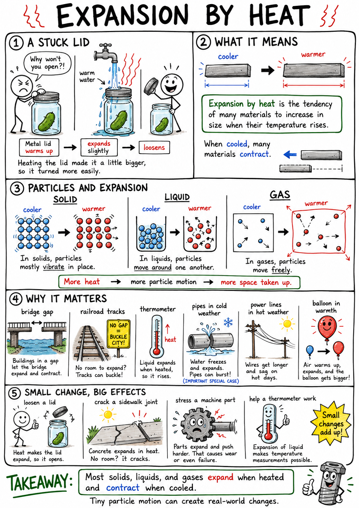

# Expansion by heat

Imagine a metal lid stuck tightly on a glass jar. You run warm water over the lid for a short time, try again, and suddenly the lid turns. The jar did not shrink in your hands like magic. The metal lid expanded slightly when warmed, making it easier to loosen.

That small change is an example of expansion by heat.

**Expansion by heat is the tendency of many materials to increase in size when their temperature rises.**

Most solids, liquids, and gases expand when heated and contract when cooled. This effect is usually small, but it matters in thermometers, bridges, railroad tracks, engines, wires, sidewalks, pipes, jars, balloons, weather, and many machines.

Expansion by heat is one of those quiet ideas that can break a bridge, loosen a lid, burst a pipe, or make a thermometer work.

## Particles and Expansion

Matter is made of tiny particles, such as atoms and molecules.

These particles are always moving. In a solid, they mostly vibrate in place. In a liquid, they move around one another. In a gas, they move freely.

When matter is heated, its particles usually move more vigorously.

In many materials, this stronger motion causes particles to spread slightly farther apart. The material takes up more space.

That is thermal expansion.

When matter cools, particle motion usually decreases, and the material often contracts.

## Thermal Expansion

The scientific name for expansion by heat is **thermal expansion**.

**Thermal expansion is the increase in size that often happens when a material is heated.**

Thermal contraction is the decrease in size that often happens when a material is cooled.

Expansion can happen in length, width, height, area, or volume.

A metal rod may become a little longer. A metal plate may become slightly wider and longer. A liquid may take up more volume. A gas may expand greatly if it is allowed to.

The change may be too small to see with your eyes, but it can still be strong enough to matter.

## Solids Expand

Solids usually expand when heated.

A metal bridge becomes slightly longer on a hot day. A railroad track expands in summer sunlight. A metal ring expands when warmed. A concrete sidewalk can expand in the heat.

The particles in a solid are held in place by strong attractions, so solids do not expand as much as gases. Still, even a tiny expansion can create large forces if the solid is trapped and cannot move.

This is why engineers leave gaps, joints, and flexible spaces in structures.

If there is no room to expand, a solid may bend, buckle, crack, or break.

## Liquids Expand

Liquids also usually expand when heated.

This is how many liquid thermometers work. The liquid inside the thermometer expands when warmed and rises in a narrow tube. When cooled, it contracts and falls.

Different liquids expand by different amounts. Alcohol, mercury, water, and oil do not all respond to temperature in the same way.

Liquids are useful in thermometers because their volume changes can be made visible in a thin tube.

But liquid expansion can also be dangerous. A liquid in a completely full sealed container may push hard on the container when heated.

## Gases Expand

Gases expand much more than solids or liquids when heated, if they are free to expand.

Heat air in a balloon, and the air particles move faster and spread out. If the balloon can stretch, it becomes larger. If the gas is in a rigid sealed container, the gas cannot expand much, so the pressure rises instead.

This is why sealed containers should not be heated unless they are designed for it.

Gases are especially important in weather, engines, hot-air balloons, and pressure systems.

Warm air expands, becomes less dense, and often rises.

## Expansion and Density

Heating often makes a material expand without adding mass.

If the mass stays the same but the volume increases, the density decreases.

This is why warm air is usually less dense than cool air. The same amount of air spreads into a larger volume.

Less dense warm air tends to rise through cooler, denser air. This helps create convection currents, winds, sea breezes, and weather patterns.

Expansion by heat is therefore connected to density, buoyancy, and convection.

## Thermal Expansion in Thermometers

Liquid thermometers are one of the clearest uses of thermal expansion.

Inside the thermometer is a liquid sealed in a narrow tube. When the liquid warms, it expands. Because the tube is narrow, a small increase in liquid volume makes the liquid column rise noticeably.

When the liquid cools, it contracts, and the column falls.

Marks on the thermometer connect the height of the liquid to temperature readings.

The thermometer works because expansion is predictable.

## Expansion Joints

An **expansion joint** is a gap or flexible connection that allows a structure to expand and contract safely.

Bridges often have expansion joints. On a hot day, bridge materials expand. On a cold day, they contract. The joints give the bridge room to change length without cracking or buckling.

Sidewalks and concrete roads also have grooves or gaps. These help prevent random cracking when concrete expands and contracts.

Pipelines, rails, buildings, and large metal structures may also need expansion space.

Good engineering expects materials to move.

## Railroad Tracks and Buckling

Railroad tracks are long metal rails.

In hot weather, the rails expand. If the rails cannot expand safely, they may buckle sideways. A buckled rail is dangerous because it can derail a train.

Railroad engineers use careful design, strong fasteners, proper gaps or welded-rail techniques, and maintenance to manage expansion.

Cold weather creates the opposite problem. Rails contract and can create stress or gaps if not designed properly.

The track may look still, but temperature is always working on it.

## Wires and Cables

Wires and cables expand and contract with temperature.

Power lines may sag more on hot days because the metal wire expands and becomes longer. In cold weather, the wire contracts and may become tighter.

Engineers must hang wires with enough slack to handle both hot and cold conditions. Too much sag can be unsafe. Too much tension can break wires or supports.

This is another example of a small material change becoming important on a large scale.

Long objects make small expansions easier to notice.

## Jars, Lids, and Everyday Expansion

Thermal expansion appears in ordinary life.

A metal jar lid may loosen after being warmed because metal often expands more than glass. The lid becomes slightly larger, making it easier to turn.

A stuck metal ring may loosen when warmed, though this should be done carefully. A bike tire pressure may rise on a hot day because the air inside warms. A basketball may feel softer in cold weather because the gas pressure drops.

Objects around you are constantly responding to temperature.

Most changes are tiny, but they are real.

## Bimetallic Strips

A **bimetallic strip** is made from two different metals joined together.

The two metals expand by different amounts when heated. Because they are joined, the strip bends as temperature changes.

Bimetallic strips have been used in thermostats, thermometers, circuit breakers, and safety devices.

In an old thermostat, a bimetallic strip could bend as the room warmed or cooled, turning a heating system on or off.

This device uses a problem, unequal expansion, as a useful signal.

## Engines and Machines

Engines become hot when they run.

Metal parts in engines expand as they heat. Pistons, cylinders, valves, bolts, and bearings must be designed with tiny clearances so they fit properly at working temperatures.

If parts expand too much, they may rub, seize, leak, or break. If they are too loose when hot, the engine may lose power or wear out quickly.

Machines often need cooling systems, lubricants, and carefully chosen materials to manage heat expansion.

A good machine is designed not just for room temperature, but for the temperatures it will actually face.

## Water Is Unusual

Most materials contract as they cool.

Water does this too at first, but it has an important exception. Water is densest at about 4 degrees Celsius. As it cools below that and freezes, it expands.

Ice is less dense than liquid water, which is why ice floats.

This unusual expansion matters greatly. If water in cracks freezes, it expands and can split rock or damage roads. If water pipes freeze, the expanding ice can burst the pipes.

At the same time, floating ice helps insulate lakes and ponds, allowing water below to remain liquid.

Water's unusual behavior is one of nature's most important exceptions.

## Expansion and Weather

Expansion by heat helps drive weather.

Sunlight warms Earth's surface unevenly. Warm ground heats the air above it. The warm air expands, becomes less dense, and rises. Cooler air moves in to replace it.

This movement helps create convection currents and winds.

Sea breezes, thunderstorms, and many cloud patterns involve warm air rising and cooler air sinking.

Expansion by heat is one reason the atmosphere is always moving.

## Expansion and Measurement

Thermal expansion can affect measurements.

A metal ruler is slightly longer when hot than when cold. For ordinary schoolwork, this change is usually too small to matter. For precise engineering, machining, or scientific measurement, temperature can be important.

Factories and laboratories sometimes control temperature carefully so measurements remain accurate.

When building bridges, engines, spacecraft, or precision tools, engineers must ask: what temperature will the part have when it is measured, and what temperature will it have when it is used?

Temperature changes can change dimensions.

## Expansion Can Create Force

Expansion may seem gentle, but it can create enormous force if blocked.

If a metal beam expands freely, it simply grows slightly longer. If it is trapped between two rigid walls, it pushes hard as it tries to expand.

This is why bridge joints, pipe loops, rail design, and concrete grooves are important. They give expansion somewhere to go.

Freezing water is another powerful example. Water expands as it freezes. If trapped inside rock cracks or pipes, the expansion can split the rock or burst the pipe.

Small changes in size can create large stresses.

## Common Misconceptions

One common mistake is thinking expansion by heat means objects become heavier. Usually the mass stays the same. The object takes up more space, so its density may decrease.

Another mistake is thinking only metals expand. Solids, liquids, and gases usually expand when heated.

A third mistake is thinking expansion is always visible. Often it is tiny, but still important.

A fourth mistake is thinking expansion is always harmful. It can be useful in thermometers, thermostats, engines, and safety devices.

Finally, remember that water has an unusual expansion behavior near freezing.

## Safety with Expansion by Heat

Thermal expansion can create safety risks.

Sealed containers can burst when heated. Hot liquids can expand and overflow. Frozen water can break pipes. Hot metal parts can fit differently than cold ones. Tires and balls can change pressure with temperature.

Good safety habits include:

- Never heat sealed containers unless they are designed for heating.
- Leave room for liquids to expand when heating them.
- Be careful opening hot jars, bottles, or containers.
- Protect water pipes from freezing.
- Check tire pressure according to instructions, especially with temperature changes.
- Use gloves or tools when handling hot metal parts.
- Keep face and hands away from steam and hot liquids.
- Follow laboratory directions when heating glassware or liquids.

Expansion by heat is usually predictable, but it should not be ignored.

## The Big Idea

Expansion by heat is the tendency of many materials to increase in size when warmed.

It happens because particles usually move more vigorously and spread farther apart as temperature rises. Solids, liquids, and gases can all expand, though gases usually expand the most. Thermal expansion explains thermometers, bridge joints, railroad tracks, sagging wires, loose jar lids, frozen pipes, weather, and machine design.

If you remember only one sentence, remember this:

**Heating usually makes matter expand, and cooling usually makes it contract.**

## Study Questions

1. What is expansion by heat?
2. What is the scientific name for expansion by heat?
3. How does heating usually affect the motion of particles?
4. What is thermal contraction?
5. In what ways can an object expand?
6. Why can a small expansion in a solid still be important?
7. How do liquid thermometers use thermal expansion?
8. Why do gases often expand more noticeably than solids or liquids?
9. What may happen if a gas is heated in a rigid sealed container?
10. How can heating affect density?
11. Why does warm air usually rise?
12. What is an expansion joint?
13. Why do bridges need expansion joints?
14. Why can railroad tracks buckle in hot weather?
15. Why do power lines often sag more on hot days?
16. Why can warming a metal jar lid make it easier to open?
17. What is a bimetallic strip?
18. How can a bimetallic strip be useful in a thermostat?
19. Why must engine designers think about thermal expansion?
20. What is unusual about water as it freezes?
21. How can freezing water break rocks or pipes?
22. How does expansion by heat help drive weather?
23. Why can temperature matter in precise measurements?
24. How can blocked expansion create large forces?
25. What are three safety rules related to expansion by heat?
26. In your own words, explain why expansion by heat does not usually mean an object gained mass.
