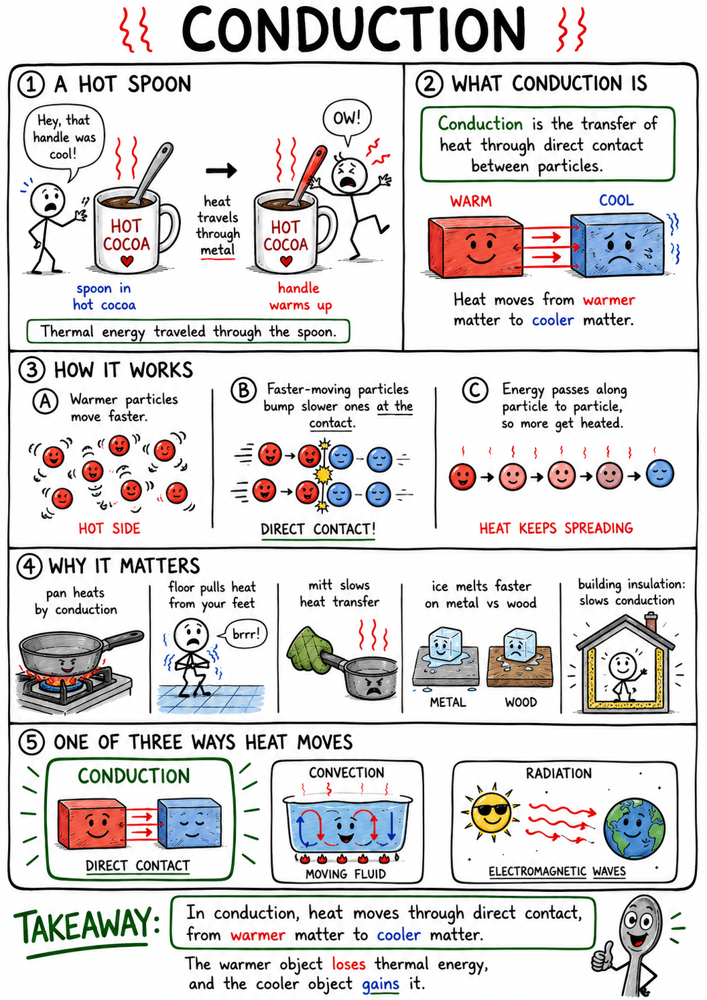
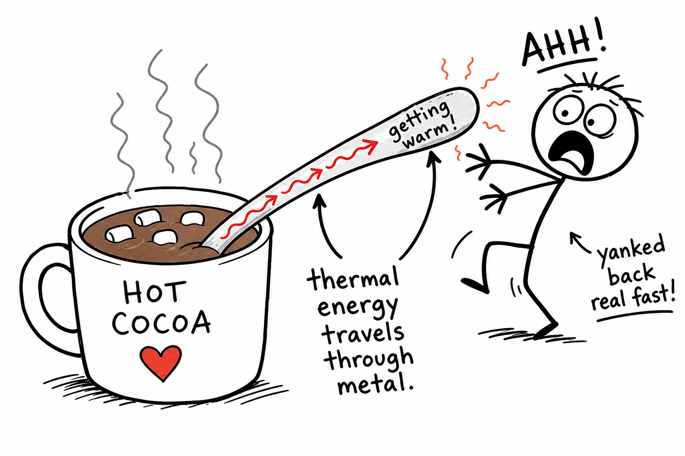
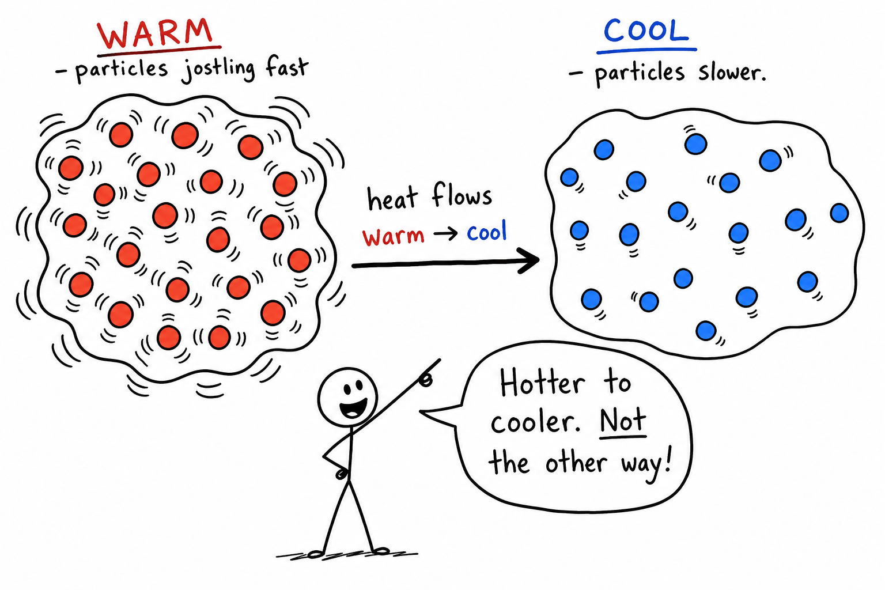
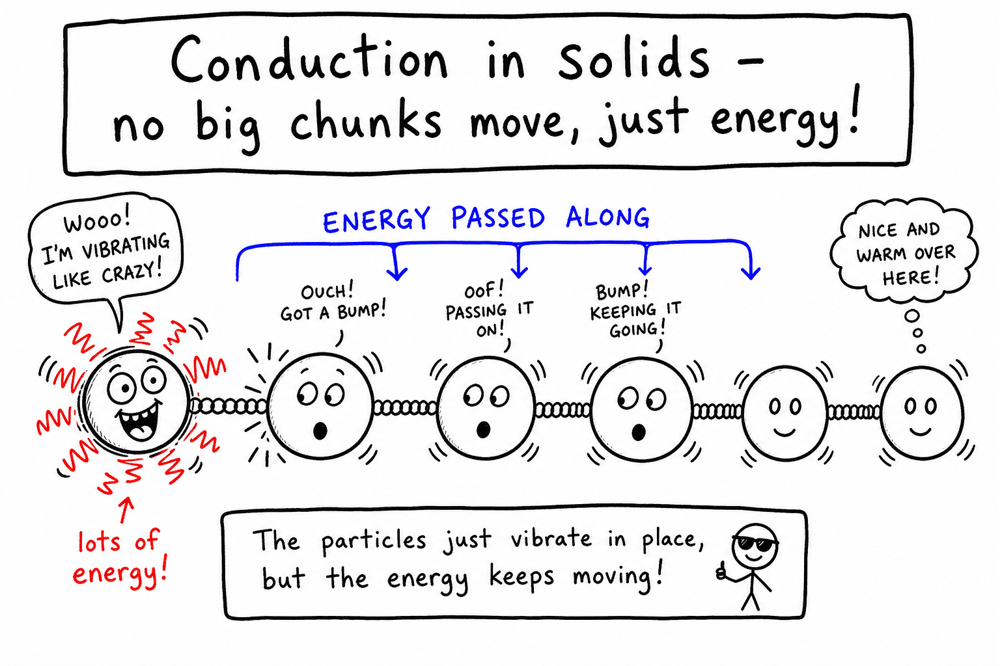
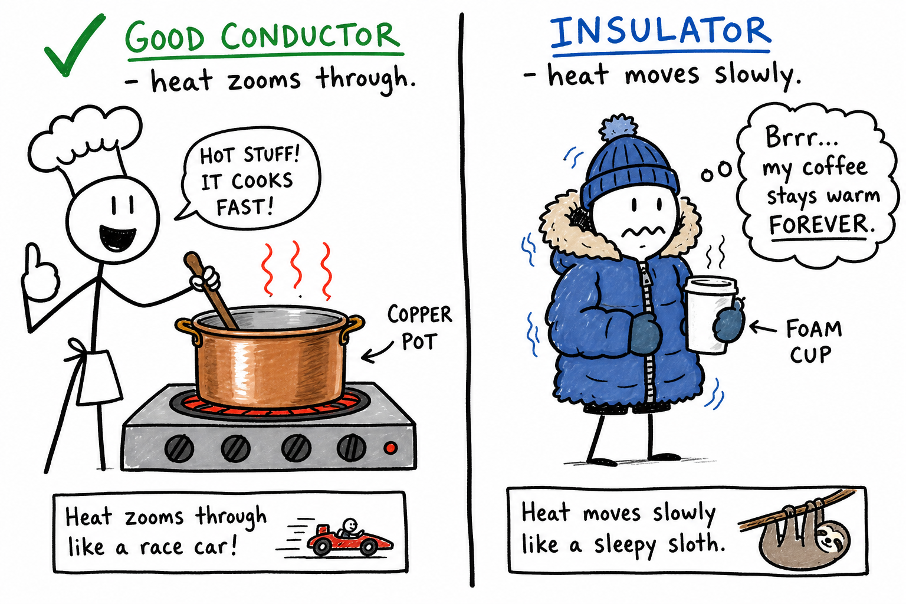
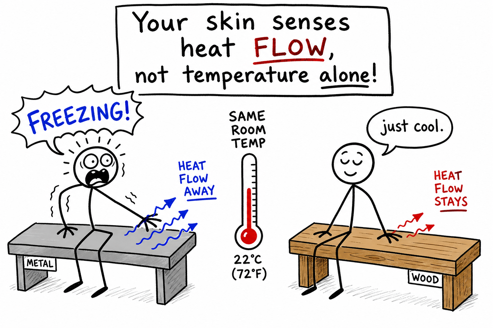
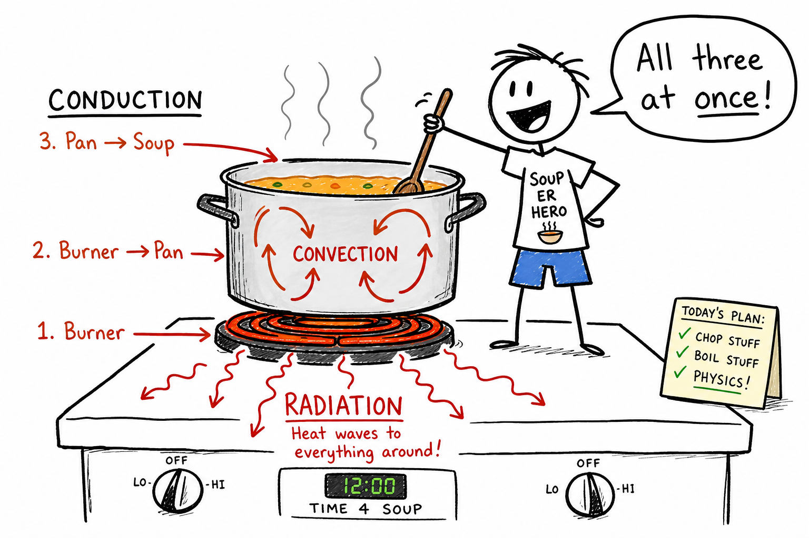

# Conduction

Imagine you grab a metal spoon and stick it into a steaming bowl of chili. The bowl end gets hot fast. A minute later, the handle is too hot to hold—even though the handle never touched the chili.

Thermal energy traveled through the spoon.

That kind of heat transfer is **conduction**.

**Conduction is the transfer of heat through direct contact between particles.**

Conduction explains why a frying pan heats on a stove, why bare feet hate cold tile, why oven mitts save your skin, why ice melts faster on a metal tray than on a wooden cutting board, and why your gaming laptop needs a heat sink when the fans spin up.

Conduction is one of the three main ways heat moves. The other two are convection and radiation.

## Heat Moves from Warm to Cool

Heat is thermal energy moving from warmer matter to cooler matter.

In conduction, that movement happens through direct contact.

When a hot object touches a cooler object, faster-moving particles in the warmer object bump into slower-moving particles in the cooler object. Energy gets passed along from particle to particle.

The warmer object loses some thermal energy. The cooler object gains some.

This continues until the objects reach the same temperature, or until something keeps adding or removing heat.

Remember the rule:

**Hotter to cooler. Not the other way around.**

## Particles Passing Energy

Matter is made of tiny particles—atoms and molecules.

In a solid, particles are packed closely together and mostly vibrate in place. When one part of the solid is heated, the particles there vibrate harder.

Those particles jostle their neighbors. The neighbors jostle their neighbors. In this way, thermal energy travels through the material.

This is conduction at the particle level.

No big chunk of the solid has to slide from one place to another. The energy is passed along through the material.

## Conduction in Solids

Conduction is especially important in solids.

In solids, particles sit close together, so energy can hop from one particle to the next. Metals conduct heat especially well. Many nonmetals conduct heat poorly.

Hold a metal nail in a flame, and the far end gets hot along the length. Hold a wooden stick near a flame, and one end may char while the other end stays cooler longer.

Wood still has particles. The difference is how easily thermal energy moves through the material.

## Conductors

A **thermal conductor** is a material that lets heat move through it easily.

Metals are usually good thermal conductors.

Examples include:

- Copper
- Aluminum
- Iron
- Steel
- Silver

That is why cooking pots and pans are often metal. The metal conducts heat from the stove to the food.

Copper and aluminum spread heat quickly—useful for even cooking. Iron and steel are strong and durable, though they may conduct heat differently.

Good conductors are useful when you want heat to move on purpose.

## Why Metals Conduct Well

Metals conduct heat well for two main reasons.

First, their atoms are packed closely, so vibrations can pass energy along.

Second, metals contain **free electrons** that can move through the material. These mobile electrons help carry energy from hotter regions to cooler regions.

That is why a metal spoon heats much faster than a wooden spoon in the same pot of soup.

The metal gives thermal energy an easier path.

## Insulators

A **thermal insulator** is a material that slows heat transfer.

Examples include:

- Wood
- Plastic
- Rubber
- Foam
- Wool
- Cork
- Fiberglass
- Trapped air

Insulators are useful when you want to keep heat from moving quickly.

Oven mitts, winter coats, cooler walls, sleeping bags, house insulation, and plastic pan handles all use insulation.

An insulator does not create heat or cold. It slows the movement of thermal energy.

## Air as an Insulator

Air can be a good insulator when it is trapped and cannot move much.

A wool sweater traps many tiny pockets of air. A foam cup traps air in small spaces. Double-pane windows trap air or another gas between two sheets of glass. Bird feathers and animal fur trap air near the body.

The trapped air slows conduction.

Loose moving air can carry heat by convection, but trapped still air is often a useful insulator.

That is why fluffy materials can keep you warm even though the fluffy stuff itself is not hot.

## Conduction and Touch

Conduction affects what objects feel like.

A metal chair and a wooden bench in the same cold room may be at the same temperature. But the metal feels colder because it conducts heat away from your skin faster.

Your skin senses heat **flow**, not temperature alone.

That is why tile floors feel colder than carpet in winter. Tile conducts heat away from your feet faster. Carpet and trapped air slow heat transfer.

Touch can mislead you. A thermometer gives a better temperature measurement.

## A Simple Conduction Example

Suppose one end of a metal rod is placed in hot water while the other end sits in cool air.

The end in the hot water warms first. Thermal energy moves by conduction through the metal toward the cooler end.

After some time, the far end becomes warmer too.

The rate of warming depends on:

- The material
- The length of the rod
- The thickness of the rod
- The temperature difference
- The surrounding air or water

Conduction is not only about whether heat moves. It is also about how quickly it moves.

## Factors That Affect Conduction

Several things affect how fast conduction happens.

**Material:** Metals conduct faster than wood, plastic, or rubber.

**Temperature difference:** A larger difference between hot and cold regions usually makes heat flow faster.

**Thickness:** A thick insulating layer slows heat flow better than a thin one.

**Area:** More contact area can allow more heat transfer.

**Distance:** Heat moves more slowly through a long path than through a short path.

These factors help engineers design cookware, insulation, clothing, machines, and buildings.

## Conduction in Cooking

Cooking often depends on conduction.

A frying pan conducts heat from the stove to the food. The bottom of a pancake cooks where it touches the hot pan. A baked potato warms partly because heat conducts inward from its hot outer surface.

Some cookware spreads heat evenly. Other cookware may create hot spots.

A thick pan can store and spread heat. A thin pan may heat quickly but unevenly.

Cooking is not only about having heat. It is about moving heat into food at the right rate.

## Conduction in the Human Body

Your body gains and loses heat by conduction.

Sit on cold stone, and heat conducts from your body into the stone. Hold a warm mug, and heat conducts from the mug into your hands.

Water conducts heat away from the body much faster than air. That is why cold water can be dangerous even when the air temperature does not seem extreme.

Wet clothing also increases heat loss because water conducts heat better than trapped air.

Understanding conduction helps explain why staying dry matters in cold weather—and why a quick dip in a cold lake can shock your system even on a mild day.

## Conduction in Buildings

Buildings are designed to control heat conduction.

In winter, people want to slow heat loss from the warm inside to the cold outside. In summer, they want to slow heat gain from the hot outside to the cooler inside.

Walls, roofs, floors, windows, and doors can all conduct heat.

Insulation in walls and attics slows conduction. Double-pane windows reduce heat transfer better than single-pane windows. Weather stripping helps stop air leaks, which can also reduce heat movement by convection.

Good buildings manage heat transfer in several ways at once.

## Conduction in Machines

Machines often need careful control of conduction.

Engines, computers, motors, and electrical devices produce heat. If that heat is not carried away, parts may overheat and fail.

Metal **heat sinks** conduct heat away from hot electronic parts. Engine blocks conduct heat to coolant. Radiators conduct heat from hot fluid to metal fins, where air can carry the heat away.

Your phone, laptop, or game console may feel warm after heavy use because waste heat must move out through metal, plastic, and air. Fans and heat sinks exist because conduction alone is not always fast enough.

Sometimes engineers want conduction. Sometimes they want insulation.

The right choice depends on whether heat should move or stay put.

## Conduction, Convection, and Radiation Together

Real situations often involve more than one kind of heat transfer.

A pot of soup on a stove is a good example. Heat conducts from the burner into the metal pot. Heat conducts from the pot into the soup touching it. Convection currents move warm soup around inside the pot. Radiation from the flame or hot burner may also warm nearby surfaces.

A winter coat also involves several kinds of heat transfer. It slows conduction through trapped air, reduces convection by stopping air movement, and may reduce radiation depending on the materials.

Scientists separate conduction, convection, and radiation to understand them. Nature often uses them together.

## Common Misconceptions

One common mistake is thinking conductors are always hot. A conductor can be hot or cold. It simply transfers heat quickly.

Another mistake is thinking insulators make heat. They do not. They slow heat transfer.

A third mistake is thinking metal is always colder than wood. Metal may feel colder because it conducts heat from your hand faster, even if both materials are at the same temperature.

A fourth mistake is thinking conduction only happens in solids. Conduction can happen in liquids and gases too, but it is often most important and easiest to observe in solids.

## Safety with Conduction

Conduction can cause burns or dangerous heat loss.

Hot metal tools, pans, pipes, engine parts, and glass can conduct heat into skin quickly. Cold metal, cold water, and wet clothing can conduct heat away from the body quickly.

Good safety habits include:

- Use oven mitts or heat-safe gloves with hot cookware.
- Do not touch metal tools or engine parts that may be hot.
- Remember that glass can be hot even if it does not glow.
- Keep pot handles turned safely inward.
- Use insulated handles when possible.
- Stay dry in cold weather.
- Avoid sitting or lying on cold conductive surfaces for long periods.
- Let hot objects cool before handling them.

Conduction is invisible, but its effects can be felt quickly.

## The Big Idea

Conduction is heat transfer through direct contact between particles.

It happens when thermal energy passes from warmer matter to cooler matter through touching particles or materials. Metals are usually good conductors, while wood, plastic, rubber, foam, wool, and trapped air are often good insulators. Conduction explains cooking, cold floors, warm mugs, oven mitts, building insulation, machine cooling, and many safety rules.

If you remember only one sentence, remember this:

**Conduction is heat moving through direct contact from warmer matter toward cooler matter.**

## Study Questions

1. What is conduction?
2. What direction does heat naturally move?
3. How do particles transfer energy during conduction?
4. Why is conduction especially important in solids?
5. What is a thermal conductor?
6. Give three examples of good thermal conductors.
7. Why do metals usually conduct heat well?
8. What is a thermal insulator?
9. Give five examples of thermal insulators.
10. Why can trapped air be a good insulator?
11. Why can a metal chair feel colder than a wooden bench at the same temperature?
12. Why is touch not always a reliable way to measure temperature?
13. What factors affect how fast conduction happens?
14. How does temperature difference affect conduction?
15. How does thickness affect insulation?
16. How is conduction used in cooking?
17. Why can cold water be dangerous to the human body?
18. How does insulation help buildings?
19. How do heat sinks help electronic devices?
20. Give an example where conduction, convection, and radiation work together.
21. Why is it wrong to say that insulators create heat?
22. Why is it wrong to say that metal is always colder than wood?
23. What are three safety rules related to conduction?
24. In your own words, explain why a metal spoon heats faster than a wooden spoon in hot soup.
