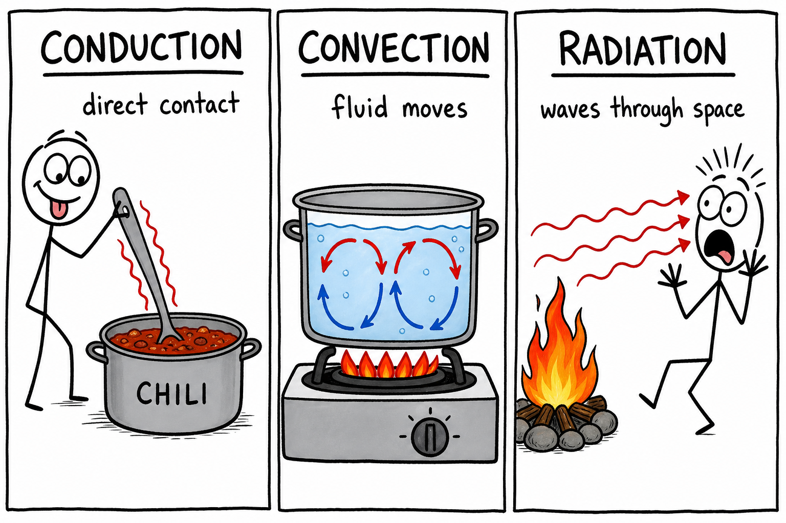
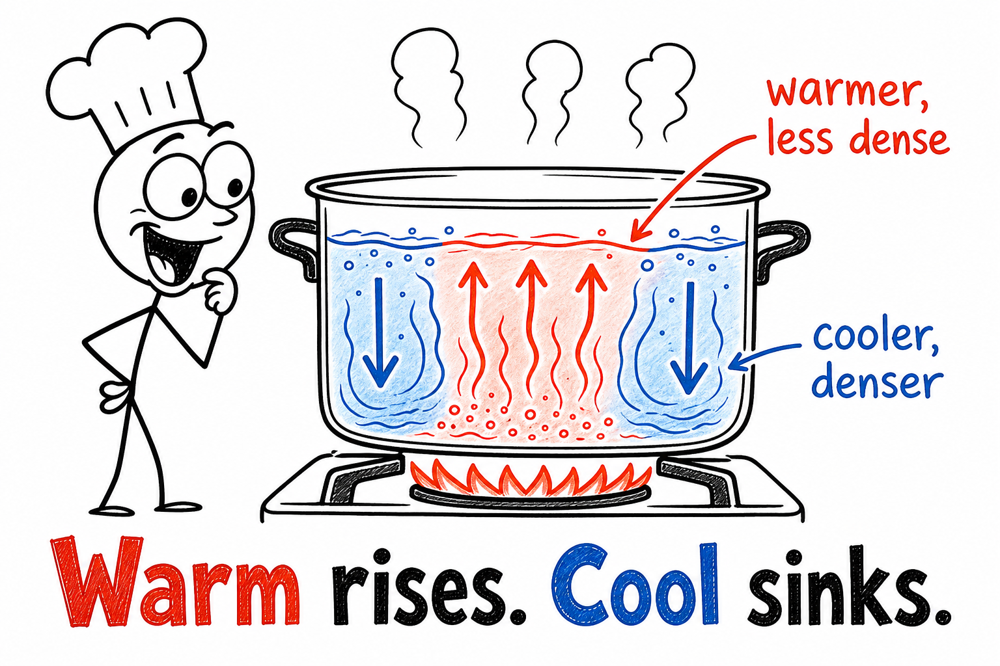
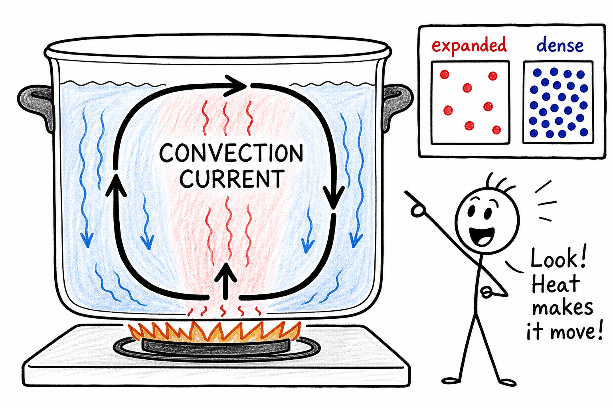
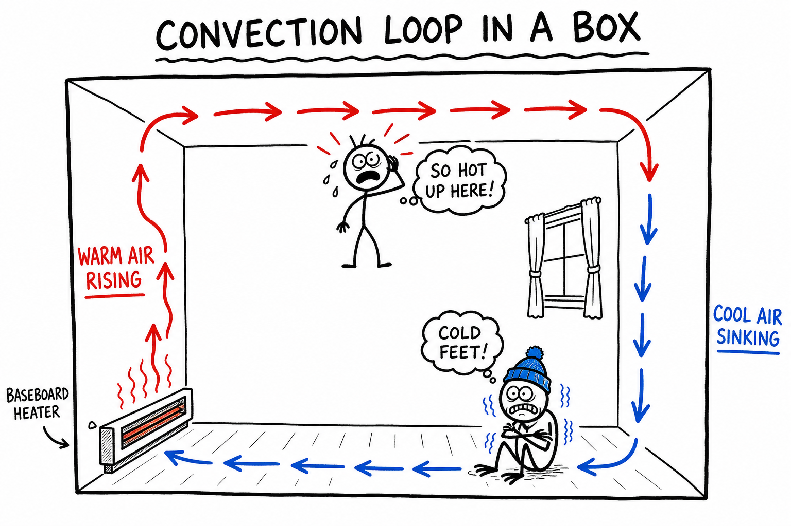
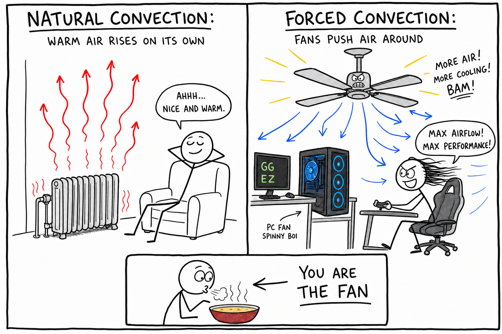
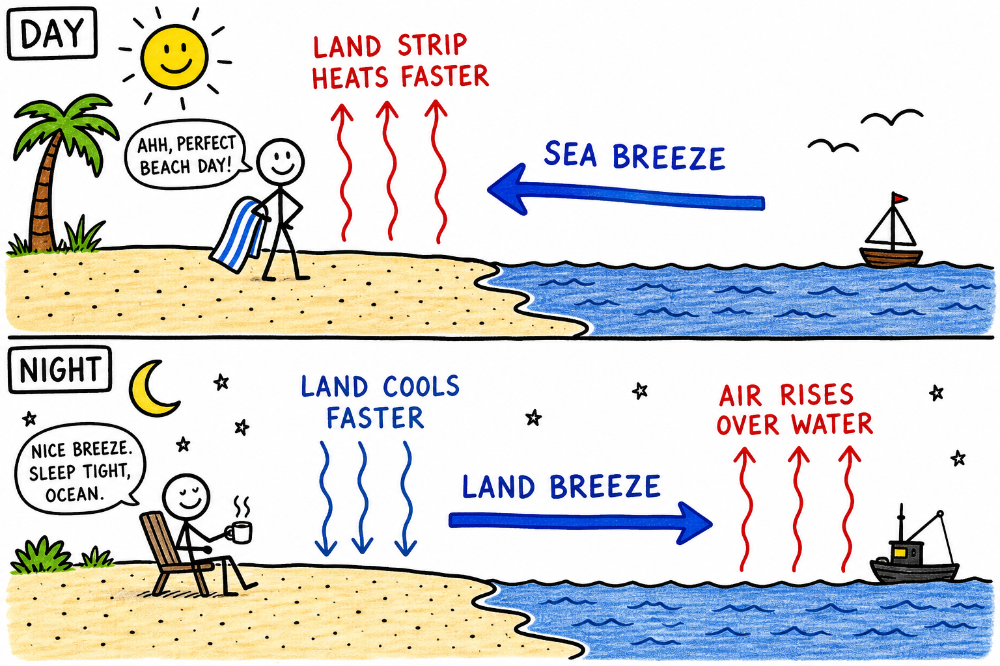
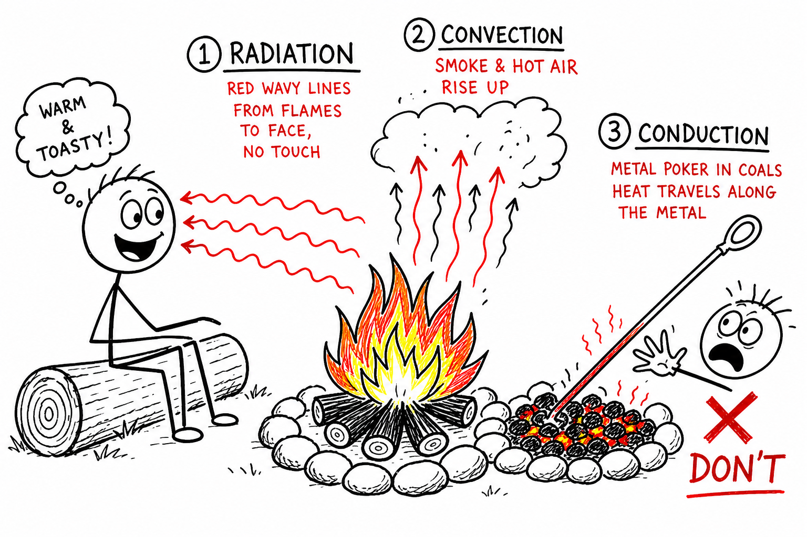

# Convection

You heat a pot of ramen on the stove. At first the water looks still. Then tiny bubbles cling to the bottom. Soon the water swirls—warm streaks rising, cooler water sliding down the sides. Lift the lid and a puff of steam hits your face.

The heat is not sitting in one spot. Moving water is carrying it.

That kind of heat transfer is **convection**.

**Convection is the transfer of heat by the movement of a fluid.**

A **fluid** is a substance that flows, such as a liquid or a gas. Water is a fluid. Air is a fluid. Convection explains boiling soup, hot air from a vent, sea breezes at the beach, thunderheads on summer afternoons, ocean currents, hot-air balloons, smoke from a campfire, and slow churning deep inside Earth.

Convection is one of the three main ways heat moves. The other two are **conduction** and **radiation**.

## Fluids Can Carry Heat

Heat naturally moves from warmer matter toward cooler matter.

In **conduction**, energy passes through direct contact between particles—often without the material as a whole moving far. Grab a metal spoon in hot chili and the handle gets warm even though it never touched the soup. That is conduction.

In **convection**, the matter itself moves. A warm pocket of air or water travels from one place to another, carrying thermal energy with it.

The moving fluid is the messenger.

When warm air rises from a radiator or warm water lifts off the bottom of a pot, thermal energy is being transported by motion.

Remember:

**Convection needs flow. No moving fluid, no convection.**

## Heating Changes Density

Convection often starts with a change in **density**.

When a fluid is heated, it usually **expands**—the same amount of matter takes up more space, so its density decreases. You saw this idea in **expansion by heat**: warm air is often less dense than cool air.

Warm, less-dense fluid tends to rise through cooler, denser fluid.

Cooler fluid sinks to replace it.

That rising and sinking can create a circulating loop called a **convection current**.

The main idea:

**Warm fluid usually rises. Cool fluid usually sinks.**

## Convection Currents

A **convection current** is a moving loop of fluid caused by heating, cooling, expansion, and sinking.

In a pot of water, water near the bottom is heated by the stove. It expands, becomes less dense, and rises. Cooler water near the top sinks to take its place. That water is heated, rises, and the cycle continues.

The water circulates.

Convection currents can be small—a cup of cocoa—or enormous—the atmosphere and oceans.

Wherever fluids are heated unevenly, convection may appear.

## A Simple Convection Example

Picture a room with a baseboard heater along one wall.

Air near the heater warms and expands. It becomes less dense and rises along the wall. Cooler air near the floor slides in to replace it. Warm air may collect near the ceiling while cooler air stays low.

You have a convection loop in a box.

The same pattern appears in a pot, in a thunderstorm, and—very slowly—in Earth's mantle. The scale changes. The physics rhyme.

## Natural Convection

**Natural convection** happens when fluid motion is caused by density differences alone.

Warm air rising from a radiator is natural convection. Smoke climbing from a campfire is natural convection. Water circulating in a heated pot is natural convection. A **sea breeze** on a sunny beach is natural convection.

No fan or pump is required. Gravity and density differences do the work.

The warm, less-dense fluid rises because cooler, denser fluid around it pushes upward on it—**buoyancy**.

Natural convection is everywhere: homes, weather, oceans, and Earth.

## Forced Convection

**Forced convection** happens when a fan, pump, or other device moves the fluid on purpose.

A ceiling fan stirring room air. A car's cooling system pumping coolant through the engine. A hair dryer blasting warm air. A **convection oven** with a fan that whirls hot air around pizza rolls. The fan in your gaming PC or laptop pushing air across hot chips.

Forced convection can move heat faster than natural convection because the fluid is driven along deliberately.

Blow on hot soup and it cools faster. You are not "blowing the heat away" like magic—you are moving warm, moist air off the surface and letting cooler air take its place. That is forced convection at work.

## Convection in Air

Air moves by convection all around you.

Warm air near a heater or register rises. Cooler air drifts in near the floor. This creates circulation in a room—which is why the ceiling can feel warm while your feet stay cold.

On a hot day, pavement heats up. Air above it expands, becomes less dense, and rises. You may see **heat shimmer**—wavy lines above the road. That is convection in action.

Air looks empty. It is not. It is always shifting and carrying heat.

## Convection in Water

Water moves by convection too.

Heat a pot from below and warm water rises while cooler water sinks. That circulation spreads heat through the liquid—why stirring is not always necessary for even warming.

In lakes, surface water can cool, become denser, and sink while deeper water rises. That mixing can move oxygen and nutrients.

In the ocean, convection works with wind, salinity, temperature, and Earth's rotation to help drive **currents**. Moving water can carry enormous amounts of heat from the equator toward the poles—and back again.

## Sea Breezes and Land Breezes

Convection helps create **sea breezes** and **land breezes**—a pattern every beach kid notices.

During the day, **land heats faster than water**. Air over the land warms, expands, becomes less dense, and rises. Cooler air from over the water slides inland to replace it. That is a **sea breeze**—cool air off the ocean toward the beach.

At night, **land cools faster than water**. Air over the water may now be warmer and rise. Cooler air from land drifts toward the water. That is a **land breeze**.

Same physics, reversed timing. Uneven heating moves the air.

## Convection and Weather

Weather depends heavily on convection.

The Sun heats Earth's surface unevenly. Warm air rises. As it rises, it expands and cools. If the air is moist, water vapor can condense into tiny droplets—**clouds**. Strong rising motion can build towering thunderheads.

Convection can create:

- Winds
- Clouds and storms
- Sea breezes
- **Thermals**—columns of rising warm air
- Rainfall patterns

Hawks, eagles, and glider pilots ride thermals to gain height without flapping or running an engine. The atmosphere is rarely still for long because convection keeps the air in motion.

## Convection in Oceans

Ocean currents carry heat around the planet.

Warm water near the equator can move toward cooler regions. In some places, cold, salty water becomes dense enough to sink and creep through the deep ocean.

Saltier water is denser than fresher water. Colder water is usually denser than warmer water. Both temperature and salinity affect density.

The deep circulation driven by these density differences is sometimes called **thermohaline circulation**. "Thermo" refers to temperature; "haline" refers to salt.

That slow global conveyor belt influences climate, marine life, and weather far from the sea.

## Convection Inside Earth

Earth has convection too—just very, very slow.

Deep in the mantle, hot rock can flow over millions of years. Warmer material rises; cooler material sinks. Heat moves from the deep interior toward the surface.

That motion in the mantle is connected to **plate tectonics**—the movement of Earth's crustal plates. Plate tectonics helps explain earthquakes, volcanoes, mountain building, and why continents drift.

The mantle is not liquid like water. Over geologic time, solid rock can flow enough for convection to matter.

## Convection in Cooking

Cooking leans on convection constantly.

In boiling water, convection currents swirl hot water around noodles or vegetables. In a standard oven, hot air circulates—sometimes unevenly. A **convection oven** adds a fan to force hot air around food, often cooking faster and more evenly.

Soup on a stove warms partly because hot liquid rises and cool liquid sinks.

Stirring is manual forced convection—you shove hot and cool regions around until the temperature evens out.

Cooking rarely uses only one heat-transfer method. **Conduction** from burner to pan, **convection** in the liquid or air, and **radiation** from hot surfaces often work together.

## Convection in Buildings

Convection shapes how buildings feel.

Warm air rises toward ceilings. Cool air settles near floors. Drafts under doors and leaks around windows can carry warm air out in winter and let hot air in during summer.

Furnaces and air conditioners use fans to move air on purpose—forced convection at building scale.

Insulation slows **conduction**, but comfort also depends on controlling convection: sealing drafts, using fans wisely, and understanding that heat rides on moving air.

## Convection and Cooling Machines

Many machines would overheat without convection.

A car **radiator** passes hot coolant through thin metal tubes; air flowing past carries heat away—often helped by a fan. Computers and game consoles use fans to push air across hot processors and heat sinks.

Refrigerators and air conditioners move heat using fluids and fans. Still air is a poor heat remover; moving air does the job.

If a cooling fan fails, parts can overheat in minutes. Forced convection is not optional in those designs—it is survival.

## Conduction, Convection, and Radiation Together

Real heat transfer usually combines all three methods.

Sit by a campfire. **Radiation** from the flames warms your face. Hot air and smoke rise by **convection**. Touch a metal poker in the coals and **conduction** burns your hand fast.

A pot of soup on a stove: **conduction** from burner to pot; **convection** in the swirling soup; **radiation** from hot metal and flame.

Scientists separate the three methods to study them clearly. In nature and in your kitchen, they work as a team.

## Common Misconceptions

One common mistake is thinking convection happens in solids the same way it happens in air or water. Ordinary convection needs a fluid that can flow. Solids conduct heat through vibrating particles; they do not usually circulate like a pot of water.

Another mistake is thinking warm air rises because "heat floats." Heat is energy, not a substance. Warm air rises because it **expands**, becomes **less dense**, and is pushed upward by cooler, denser air around it.

A third mistake is thinking convection always means boiling. Water can convect long before it boils. Air convects in a room with no bubbles anywhere.

A fourth mistake is forgetting **forced** convection. Fans and pumps move fluid and transfer heat even when natural rising and sinking are weak.

## Safety with Convection

Convection can carry heat in ways that surprise you.

Steam rises and can burn skin badly. Hot air blasts from ovens, heaters, and engines. Wind strips heat from your body quickly in cold weather. In a fire, hot smoke and toxic gases rise—**stay low** where the air is cooler and easier to breathe.

Good safety habits include:

- Keep face and hands away from rising steam.
- Open hot containers carefully so steam does not hit you.
- Use caution around oven doors, heaters, and vents.
- Do not block cooling fans on computers, engines, or appliances.
- Dress for wind as well as temperature in cold weather.
- Stay low in smoky fires because hot smoke rises.
- Follow instructions for fans, heaters, and cooking appliances.
- Let hot liquids settle before carrying them.

Convection is useful because fluids carry heat—but moving hot fluids can hurt you fast.

## The Big Idea

Convection is heat transfer by the movement of a fluid.

Warm fluid carries thermal energy from place to place. Natural convection often begins when heating makes fluid expand, become less dense, and rise while cooler fluid sinks. Forced convection uses fans or pumps to move fluid on purpose. Convection helps explain cooking, room comfort, weather, ocean currents, machine cooling, and slow motion inside Earth.

If you remember only one sentence, remember this:

**Convection moves heat by moving warm liquids or gases from place to place.**

## Study Questions

1. What is convection?
2. What is a fluid?
3. How is convection different from conduction?
4. Why does warm fluid usually rise?
5. What is a convection current?
6. What is natural convection?
7. Give three examples of natural convection.
8. What is forced convection?
9. Give three examples of forced convection.
10. How does convection move air in a heated room?
11. How does convection move water in a heated pot?
12. What causes a sea breeze during the day?
13. What causes a land breeze at night?
14. How does convection help create clouds and storms?
15. What are thermals, and who might use them?
16. How do ocean currents carry heat?
17. What does thermohaline circulation involve?
18. How is convection inside Earth connected to plate tectonics?
19. How does a convection oven use forced convection?
20. How does convection affect heating and cooling in buildings?
21. Why do computers and engines often need fans or moving fluids?
22. Give an example where conduction, convection, and radiation work together.
23. Why is it wrong to say that warm air rises because heat itself floats?
24. What are three safety rules related to convection?
25. In your own words, explain why convection needs a moving fluid.
