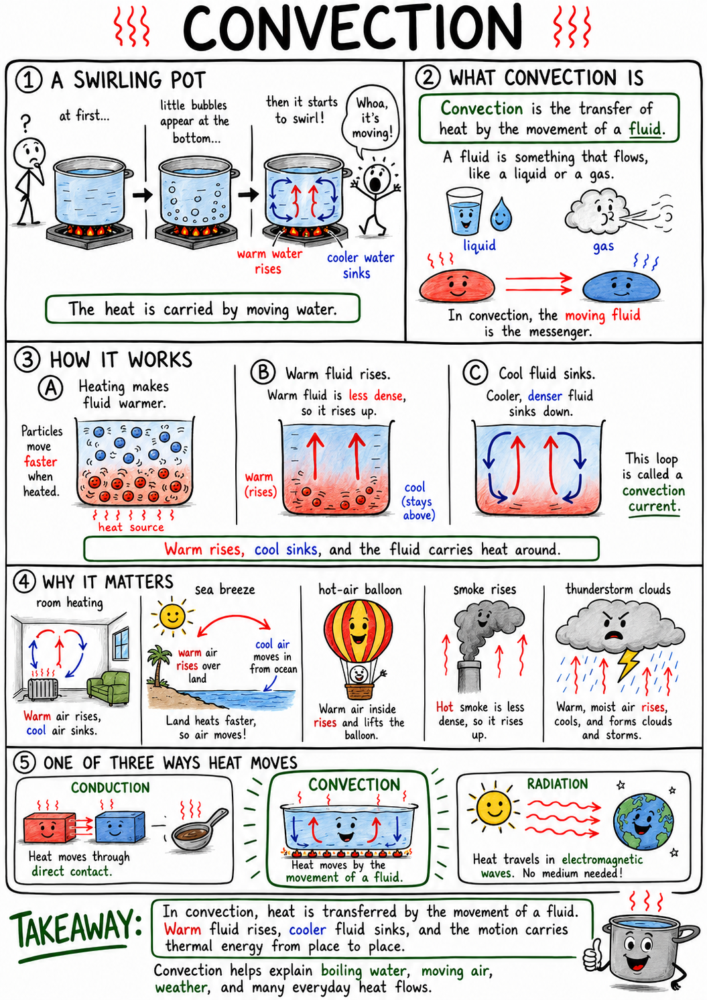

# Convection

Imagine watching a pot of water heat on a stove. At first the water looks still. Then tiny bubbles appear near the bottom, and soon the water begins to swirl. Warmer water rises, cooler water sinks, and the whole pot starts to move.

The heat is not staying in one place. It is being carried by moving water.

That kind of heat transfer is convection.

**Convection is the transfer of heat by the movement of a fluid.**

A **fluid** is a substance that flows, such as a liquid or a gas. Water is a fluid. Air is a fluid. Convection explains boiling water, room heating, sea breezes, thunderstorms, ocean currents, hot-air balloons, smoke rising, and even slow movement deep inside Earth.

Convection is one of the three main ways heat moves. The other two are conduction and radiation.

## Fluids Can Carry Heat

Heat naturally moves from warmer matter toward cooler matter.

In convection, heat moves because the matter itself moves. A warm part of a fluid travels from one place to another, carrying thermal energy with it.

This is different from conduction. In conduction, energy passes through direct contact between particles, often without the material as a whole moving far.

In convection, the moving fluid is the messenger.

When warm air rises from a heater or warm water rises from the bottom of a pot, thermal energy is being transported by motion.

## Heating Changes Density

Convection often begins with a change in density.

When a fluid is heated, it usually expands. The same amount of matter takes up more space, so its density decreases.

Warm, less dense fluid tends to rise through cooler, denser fluid.

Cooler fluid sinks to replace it.

This rising and sinking can create a circulating motion called a convection current.

The main idea is:

**Warm fluid usually rises, and cooler fluid usually sinks.**

## Convection Currents

A **convection current** is a moving loop of fluid caused by heating, cooling, expansion, and sinking.

In a pot of water, water near the bottom is heated by the stove. It expands, becomes less dense, and rises. Cooler water near the top sinks to take its place. Then that water is heated, rises, and the cycle continues.

The water circulates.

Convection currents can be small, like in a cup of soup, or enormous, like in the atmosphere and oceans.

Wherever fluids are heated unevenly, convection may appear.

## Natural Convection

**Natural convection** happens when fluid motion is caused by density differences.

Warm air rising from a radiator is natural convection. Smoke rising from a campfire is natural convection. Water circulating in a heated pot is natural convection.

No fan or pump is required. Gravity and density differences do the work.

The warm, less dense fluid rises because it is buoyed upward by cooler, denser fluid around it.

Natural convection is common in homes, weather, oceans, and Earth.

## Forced Convection

**Forced convection** happens when a fan, pump, or other device moves the fluid.

A fan blowing air across a room is forced convection. A car's cooling system pumps liquid coolant through the engine. A hair dryer forces warm air past wet hair. A computer fan moves air across hot electronic parts.

Forced convection can move heat faster than natural convection because the fluid is pushed along deliberately.

This is why blowing on hot soup cools it faster. You move warm air and moist air away from the soup, letting cooler air take its place.

## Convection in Air

Air moves by convection all around you.

Warm air near a heater rises. Cooler air moves in near the floor to replace it. This creates circulation in a room.

In a house, warm air may collect near the ceiling while cooler air stays near the floor. Ceiling fans can help mix the air.

On a hot day, air near sun-warmed pavement can heat, expand, and rise. This can create shimmering waves above roads.

Air may look empty, but it is constantly moving and carrying heat.

## Convection in Water

Water also moves by convection.

When water is heated from below, warmer water rises and cooler water sinks. This helps spread heat through the pot.

Lakes can also experience convection. In some seasons, surface water cools, becomes denser, and sinks, while deeper water rises. This mixing can move oxygen and nutrients.

In the ocean, convection works with wind, salinity, temperature, and Earth's rotation to help drive currents.

Moving water can carry enormous amounts of heat from one place to another.

## Sea Breezes and Land Breezes

Convection helps create sea breezes and land breezes.

During the day, land often heats faster than water. The air over land warms, expands, becomes less dense, and rises. Cooler air from over the water moves in to replace it. This creates a **sea breeze** blowing from sea toward land.

At night, land often cools faster than water. Air over the water may now be warmer and rise, while cooler air from land moves toward the water. This creates a **land breeze**.

These breezes are convection currents in the atmosphere.

They show how uneven heating can move air.

## Convection and Weather

Weather depends greatly on convection.

The Sun heats Earth's surface unevenly. Warm air rises, cools as it rises, and may form clouds. If conditions are right, strong rising air can help produce thunderstorms.

Convection can create:

- Winds
- Clouds
- Sea breezes
- Storms
- Thermals
- Rainfall patterns

Birds and glider pilots can use rising warm air called **thermals** to gain height without flapping or using an engine.

Convection is one reason the atmosphere is never still for long.

## Convection and Clouds

When warm, moist air rises, it expands and cools.

Cooler air cannot hold as much water vapor as warm air. Some water vapor may condense into tiny droplets, forming clouds.

If rising motion continues, clouds may grow taller. In strong convection, towering thunderclouds can form.

This is why hot sunny afternoons can sometimes produce storms. The ground heats the air above it, the warm air rises, and convection helps build clouds.

Clouds are not just floating decorations. They are signs of moving air, changing temperature, and water changing state.

## Convection in Oceans

Ocean currents carry heat around the planet.

Warm water near the equator can move toward cooler regions. Cold water can sink and move through the deep ocean. Differences in temperature and salinity both affect density.

Saltier water is denser than fresher water. Colder water is usually denser than warmer water.

The deep ocean circulation driven by density differences is sometimes called **thermohaline circulation**. "Thermo" refers to temperature, and "haline" refers to salt.

This circulation helps influence climate, marine life, and weather patterns.

## Convection Inside Earth

Earth has convection too, though it is very slow.

Deep inside Earth, hot rock can flow very slowly over long periods of time. Warmer material rises, cooler material sinks, and heat moves from the deep interior toward the surface.

This motion in Earth's mantle is connected to plate tectonics.

Plate tectonics helps explain earthquakes, volcanoes, mountain building, ocean trenches, and the movement of continents.

The mantle is not liquid like water, but over long times it can behave like a very slow-moving solid. Convection can happen in materials that flow slowly enough.

## Convection in Cooking

Cooking often uses convection.

In boiling water, convection currents help move hot water around food. In an oven, hot air circulates around bread, meat, or vegetables. A convection oven uses a fan to force hot air to move, cooking food more evenly or quickly.

Soup heated on a stove warms partly because hot liquid rises and cooler liquid sinks.

Stirring food is a way of forcing convection. It moves hot and cool regions around so temperature becomes more even.

Cooking is full of heat transfer: conduction, convection, and radiation often work together.

## Convection in Buildings

Convection affects heating and cooling in buildings.

Warm air rises toward ceilings. Cooler air settles near floors. Air leaks around doors and windows can carry warm air out and cold air in during winter.

Heating systems often use fans or moving air to distribute warmth. Air conditioners move warm indoor air across cold coils and then blow cooled air back into rooms.

Insulation helps slow conduction, but buildings must also control convection by reducing drafts and air leaks.

A comfortable building manages heat movement in several ways.

## Convection and Cooling Machines

Many machines use convection to remove heat.

A car radiator lets hot coolant pass through thin metal tubes. Air moving across the radiator carries heat away. Fans in computers move air across hot parts and heat sinks.

Refrigerators and air conditioners move heat from one place to another using fluids and fans.

Forced convection is often essential because still air may not carry heat away fast enough.

If a fan fails in a computer or engine system, parts can overheat.

## Convection, Conduction, and Radiation Together

Real heat transfer often combines all three methods.

A campfire warms you by radiation from the flames and coals. Hot air rises from the fire by convection. If you touch a hot metal poker, conduction carries heat into your hand.

A pot of soup on a stove uses conduction from burner to pot, convection in the moving soup, and radiation from hot surfaces.

Scientists separate the three methods to study them clearly. In real life, they often work together.

## Common Misconceptions

One common mistake is thinking convection happens in solids the same way it happens in air or water. Ordinary convection requires a fluid that can flow.

Another mistake is thinking warm air rises because heat itself floats. Warm air rises because it expands, becomes less dense, and is pushed upward by cooler, denser air.

A third mistake is thinking convection always requires boiling. Convection can happen in air or water far below boiling temperature.

A fourth mistake is forgetting forced convection. Fans and pumps can move fluids and transfer heat even when natural rising and sinking are weak.

## Safety with Convection

Convection can carry heat in ways that surprise people.

Steam rises and can burn skin. Hot air from ovens, heaters, fires, and engines can injure. Wind can remove heat from the body quickly in cold weather. Smoke and hot gases rise during fires, making high air dangerous to breathe.

Good safety habits include:

- Keep face and hands away from steam.
- Open hot containers carefully so rising steam does not hit you.
- Use caution around oven doors, heaters, and vents.
- Do not block cooling fans on computers, engines, or appliances.
- Dress for wind as well as temperature in cold weather.
- Stay low in smoky fires because hot smoke rises.
- Use fans, heaters, and cooking appliances according to instructions.
- Let hot liquids settle before carrying them.

Convection is useful because fluids carry heat, but moving hot fluids can be dangerous.

## The Big Idea

Convection is heat transfer by the movement of a fluid.

It happens when warm fluid carries thermal energy from one place to another. Natural convection often begins when warm fluid expands, becomes less dense, and rises while cooler fluid sinks. Forced convection uses fans or pumps to move fluids. Convection helps explain cooking, weather, ocean currents, room heating, machine cooling, and Earth's interior.

If you remember only one sentence, remember this:

**Convection moves heat by moving warm liquids or gases from place to place.**

## Study Questions

1. What is convection?
2. What is a fluid?
3. How is convection different from conduction?
4. Why does warm fluid usually rise?
5. What is a convection current?
6. What is natural convection?
7. Give three examples of natural convection.
8. What is forced convection?
9. Give three examples of forced convection.
10. How does convection move air in a room?
11. How does convection move water in a heated pot?
12. What causes a sea breeze during the day?
13. What causes a land breeze at night?
14. How does convection help create clouds?
15. What are thermals?
16. How do ocean currents carry heat?
17. What does thermohaline circulation involve?
18. How is convection inside Earth connected to plate tectonics?
19. How does a convection oven use forced convection?
20. How does convection affect heating and cooling in buildings?
21. Why do computers and engines often need fans or moving fluids?
22. Give an example where conduction, convection, and radiation work together.
23. Why is it wrong to say that warm air rises because heat itself floats?
24. What are three safety rules related to convection?
25. In your own words, explain why convection needs a moving fluid.
