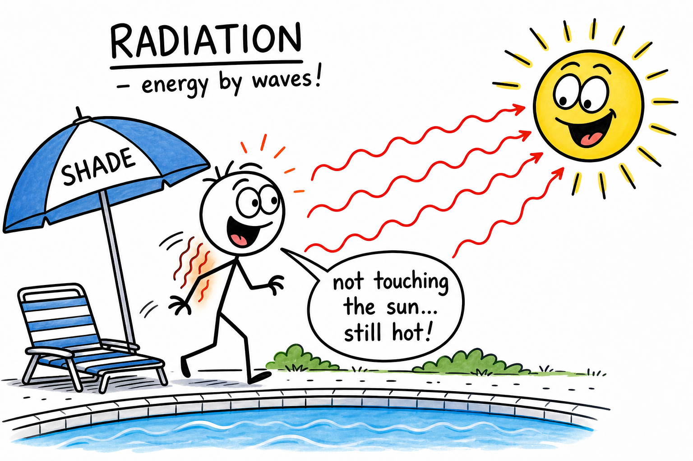
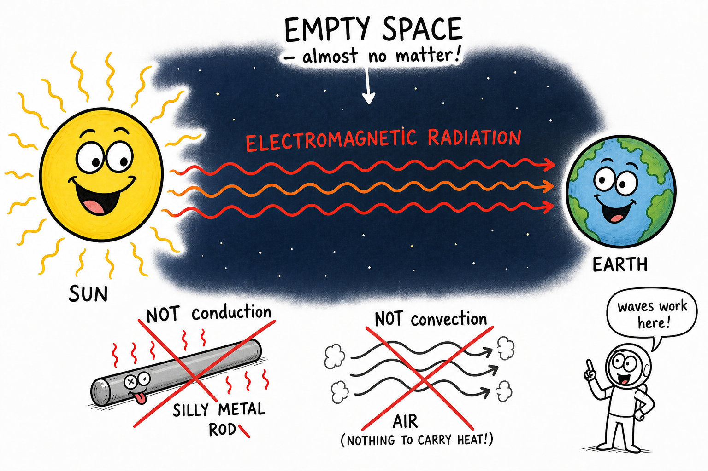
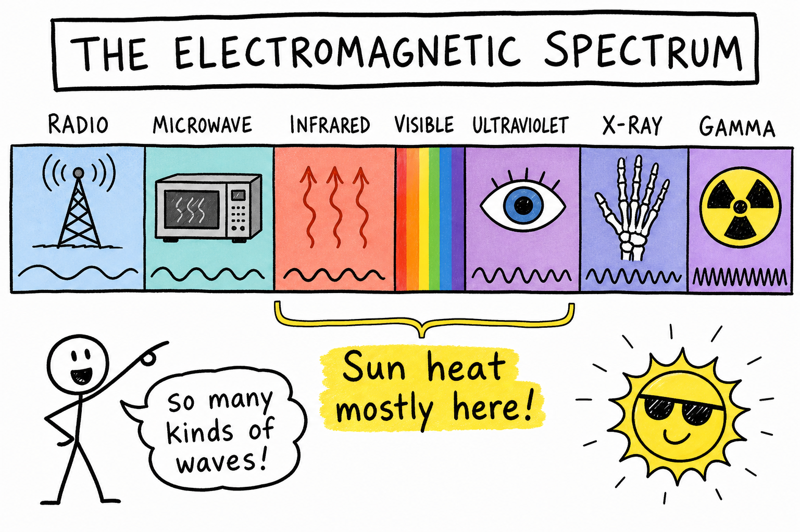
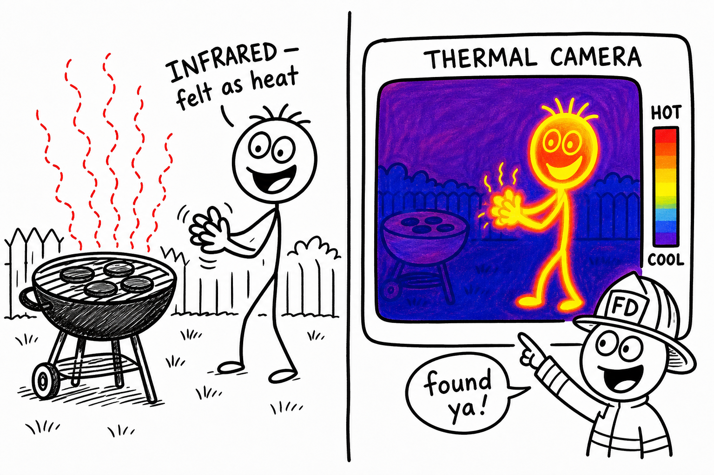
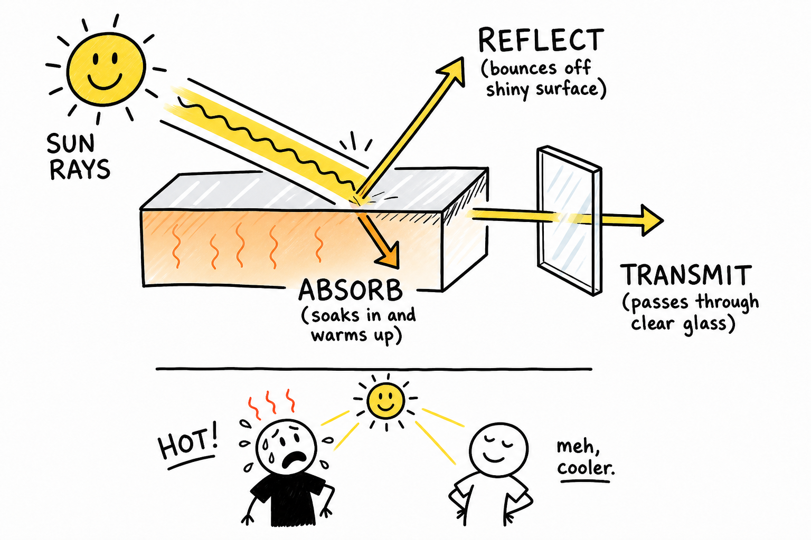
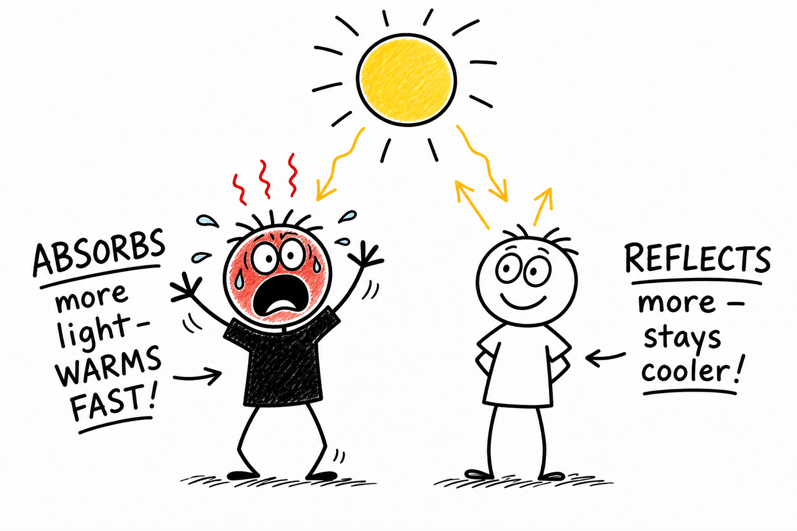
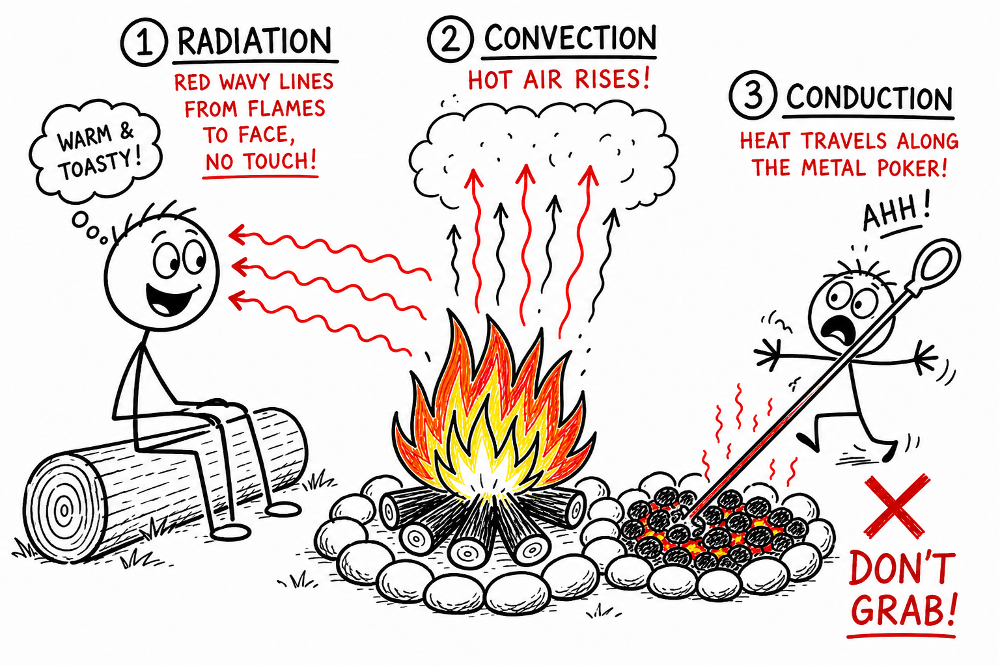

# Radiation

You step out of the shade and into full sun at the pool. Same air temperature—but your shoulders heat up fast. You are not touching the Sun. No hot wind is required. Energy is crossing space and air as waves.

That kind of heat transfer is **radiation**.

**Radiation is the transfer of energy by electromagnetic waves.**

Radiation explains why sunlight warms your skin, why you feel a grill from several feet away, why black asphalt burns bare feet in July, why a shiny emergency blanket helps in cold weather, why frost can form on a clear night, and why astronauts need special shielding in space.

Radiation is one of the three main ways heat moves. The other two are **conduction** and **convection**.

## Radiation Does Not Need Matter

**Conduction** needs direct contact between particles. Stick a metal spoon in hot chili and the handle warms—even though it never touched the soup. Particles pass energy along.

**Convection** needs a moving fluid. Warm air rises from a radiator; soup swirls in a heated pot. The fluid carries heat.

Radiation is different. It can travel through empty space.

The Sun warms Earth across about 150 million kilometers of near-vacuum. No metal rod conducts heat from the Sun. No air current carries it across space.

Energy travels as **electromagnetic radiation**.

Remember:

**Radiation can cross empty space. Conduction and convection cannot.**

## Electromagnetic Waves

**Electromagnetic waves** are waves of electric and magnetic fields that carry energy through space.

They include:

- Radio waves
- Microwaves
- Infrared radiation
- Visible light
- Ultraviolet radiation
- X-rays
- Gamma rays

Together they form the **electromagnetic spectrum**.

You use different parts every day. Radio waves carry music. Microwaves heat leftovers. Visible light lets you read this page. Ultraviolet from the Sun can sunburn skin. Doctors use X-rays to see bones.

For heat transfer, **infrared radiation** matters most—but visible light and ultraviolet can warm or affect materials when absorbed.

## Infrared Radiation

**Infrared radiation** is electromagnetic radiation we often feel as heat.

You cannot see it with your eyes, but your skin senses it when it is strong enough.

A grill, a heat lamp, sun-baked pavement, your own body, and glowing coals all emit infrared radiation.

**Thermal cameras** detect infrared and build heat pictures—warmer areas look brighter. Firefighters search for people in smoke. Mechanics hunt hot engine parts. Coaches check for sore muscles. The technology is radiation made visible.

Infrared is a major way warm objects lose energy to cooler surroundings.

## All Objects Radiate

Every object with a temperature above absolute zero gives off electromagnetic radiation.

Cool objects emit small amounts—mostly infrared. Warm objects emit more. Very hot objects can **glow** red, orange, yellow, or white because they emit visible light too.

Heat metal in a forge and watch the color change: dull red, then orange, then yellow as temperature climbs.

The hotter the object, the more radiation it gives off—and the more energetic that radiation tends to be.

Temperature and radiation stay linked.

## A Simple Radiation Example

Stand in sunlight with your palm facing the Sun, then turn your palm away.

Facing the Sun: absorbed radiation warms your skin.

Facing away: less direct radiation; your palm cools faster.

You did not change the air temperature much. You changed how much radiation you **absorbed**. That is radiation at work—no contact required.

## Absorption, Reflection, and Transmission

When radiation hits an object, three things can happen:

- **Absorb** — energy enters the material
- **Reflect** — energy bounces off
- **Transmit** — energy passes through

Often a mix of all three.

### Absorption

**Absorbed** radiation becomes thermal energy in the material. The object warms.

Sunlight warms your skin because your skin absorbs part of the Sun's radiation. A black shirt in July soaks up visible light and heats up. Dark pavement can become painful to touch.

Waves arrive; the material gets warmer inside.

### Reflection

**Reflected** radiation bounces off instead of being absorbed.

Shiny, light-colored, or metallic surfaces often reflect more than dark, dull ones. A shiny emergency blanket reflects infrared back toward your body. A white roof reflects more sunlight than a black roof, keeping the building cooler.

Reflection does not destroy energy—it redirects it.

Engineers use reflection to control heating, cooling, and safety.

### Transmission

**Transmitted** radiation passes through a material.

Visible light passes through clear glass. Some infrared passes through certain plastics or gases; other types are blocked. Sunscreen, clothing, and Earth's atmosphere filter ultraviolet in different ways.

A window can flood a room with sunlight while blocking or slowing other radiation—depending on the glass and the wave type.

## Color and Surface

Color strongly affects how much **visible light** is absorbed or reflected.

Black absorbs most visible light that hits it. White reflects much of it.

That is why a black shirt often feels hotter than a white shirt in the same sun. The black shirt converts more radiation into thermal energy.

Color is not everything. Texture, thickness, and how a surface behaves with **infrared** also matter. A dull dark surface and a shiny dark surface can behave differently. Still, color is the easiest clue in everyday life.

## Radiation from the Sun

The Sun is Earth's main energy source.

Solar radiation crosses space, enters the atmosphere, and reaches the surface. Clouds, ice, snow, and bright surfaces reflect some back to space. Land, water, and air absorb the rest.

That absorbed energy drives weather, winds, ocean currents, evaporation, photosynthesis, and climate.

Without solar radiation, Earth would be frozen and life as we know it could not continue.

Sunlight is not only for seeing. It powers the living world.

## Radiation and the Atmosphere

Earth's atmosphere filters and traps radiation.

Some solar radiation passes through and warms the ground. The warm surface then emits **infrared** radiation upward. Certain gases absorb and re-emit some of that infrared.

That helps keep Earth warmer than it would be with no atmosphere—a natural **greenhouse effect**.

The greenhouse effect is necessary for life. Problems appear when human activities add enough extra greenhouse gases to change climate over long periods.

## Greenhouse Gases

**Greenhouse gases** absorb and re-emit infrared radiation.

Important examples:

- Water vapor
- Carbon dioxide
- Methane
- Nitrous oxide

They do not block all radiation. They interact strongly with certain infrared wavelengths.

A greenhouse gas molecule can absorb infrared, hold energy briefly, and emit radiation in new directions—including back toward Earth's surface.

That slows heat loss to space.

## Radiation in Space

In space, radiation is king.

There is almost no matter, so **conduction** and **convection** barely help. A spacecraft in sunlight can bake on one side while the shaded side freezes.

Engineers use reflective films, insulation, radiators, heaters, and careful orientation.

A spacecraft **radiator** dumps waste heat as infrared into space—like sweating, but with waves instead of water.

In orbit, managing radiation is survival engineering.

## Warming and Cooling by Radiation

Radiation warms—and helps things cool.

A campfire warms your face. A heat lamp warms food or animals. The Sun warms the ground. After sunset, a hot sidewalk radiates energy away and slowly cools.

Objects always exchange radiation with their surroundings. If they radiate more than they absorb, they cool down.

On a clear night, the ground can radiate energy to the cold sky. Cool enough, and **dew** or **frost** forms—even when the air a few feet up is not freezing.

Radiation is not only what hot things send at you. It is how everything loses energy to the universe.

## Radiation in Cooking

Cooking uses radiation constantly.

A **toaster** glows hot wires that radiate into bread. A **broiler** radiates from above. Campfire coals radiate into marshmallows on a stick.

A **microwave oven** uses microwaves—another part of the spectrum—to shake water molecules in food and warm it from the inside out.

In a full oven, hot walls radiate, hot air convects, and food conducts heat inward. Real cooking is a team sport for all three methods.

## Radiation and the Human Body

Your body emits infrared radiation all the time.

In a cold room you lose heat to the walls and air—not only by conduction and convection at your skin, but by radiating energy outward.

Thick clothing traps air and slows other heat loss. **Emergency blankets** are shiny because they reflect your infrared radiation back toward you.

Leave a phone in the sun and it heats up from absorbed radiation. Sit near a campfire and your front warms while your back stays cool—radiation from one direction.

Your body is always sending and receiving electromagnetic waves.

## Radiation, Conduction, and Convection Together

Real situations blend all three.

At a campfire: **radiation** warms your face from the flames. **Convection** lifts hot air and smoke. **Conduction** heats a metal poker in the coals—and burns your hand if you grab it.

In a sunny room: **radiation** warms the floor. The floor **conducts** to the air at the surface. **Convection** circulates that air through the house.

Scientists separate the three to study them. Nature never separates them.

## Helpful and Harmful Radiation

Radiation is a broad word—not automatically dangerous.

**Helpful:** sunlight for plants and vitamin D; infrared lamps for animals; radio and cell signals; microwave cooking; medical imaging when used properly.

**Harmful:** too much ultraviolet (sunburn, eye damage); intense infrared burns; high doses of X-rays or gamma rays; mishandled radioactive materials.

The effect depends on **type**, **energy**, **amount**, and **time**.

Radiation must be understood and controlled—not feared in every form.

## Common Misconceptions

One mistake is thinking **radiation** always means nuclear danger. Heat from a fire or the Sun is radiation too—usually infrared or visible light.

Another mistake is thinking radiation needs air. It does not. It crosses vacuum.

A third mistake is thinking only very hot objects radiate. Everything above absolute zero radiates; cooler objects just radiate less.

A fourth mistake is thinking shiny things **create** cold. They reflect radiation and can slow heating or cooling—they do not manufacture coldness.

## Safety with Radiation

Safety depends on the type of radiation.

Good habits include:

- Use sunscreen, shade, hats, and clothing in strong sunlight.
- Never stare at the Sun.
- Wear proper eye protection for welding, intense lamps, or lasers.
- Keep skin away from heat lamps, broilers, and open flames.
- Follow microwave instructions; do not use damaged ovens.
- Respect warning signs for X-rays, lasers, and radioactive materials.
- Do not handle unknown radioactive substances.
- Use emergency blankets and reflective gear correctly in cold or survival situations.

Radiation carries energy across space and into your body. That makes it powerful—and worth respecting.

## The Big Idea

Radiation is energy transfer by electromagnetic waves.

It does not require matter, which is why sunlight reaches Earth through space. Objects absorb, reflect, or transmit radiation. Infrared is central to heat transfer, but visible light and ultraviolet matter too. Radiation explains sunshine, campfires, night frost, climate, cooking, thermal cameras, spacecraft, and everyday safety.

If you remember only one sentence, remember this:

**Radiation moves energy by waves, even through empty space.**

## Study Questions

1. What is radiation?
2. How is radiation different from conduction and convection?
3. Why can sunlight warm Earth through space?
4. What are electromagnetic waves?
5. Name five types of electromagnetic radiation.
6. What is infrared radiation?
7. Do all objects give off radiation? Explain.
8. How does temperature affect the amount of radiation an object gives off?
9. What does it mean for radiation to be absorbed?
10. What does it mean for radiation to be reflected?
11. What does it mean for radiation to be transmitted?
12. Why does a black shirt often feel hotter than a white shirt in sunlight?
13. How does solar radiation affect Earth?
14. What is the greenhouse effect?
15. Name three greenhouse gases.
16. Why is radiation especially important in space?
17. How can an object cool by radiation?
18. Give three examples of radiation in cooking.
19. How does the human body exchange energy by radiation?
20. Give an example where radiation, conduction, and convection work together.
21. Why is it wrong to think radiation always means dangerous nuclear radiation?
22. Why is it wrong to think only very hot objects radiate?
23. What are three safety rules related to radiation?
24. In your own words, explain why shiny emergency blankets can help keep a person warm.
