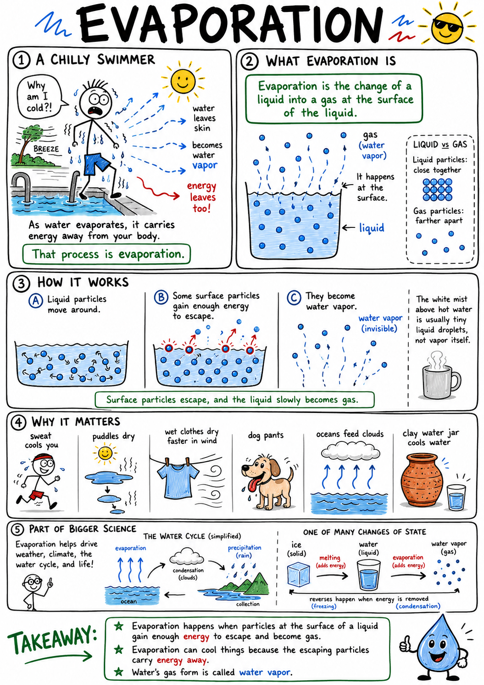
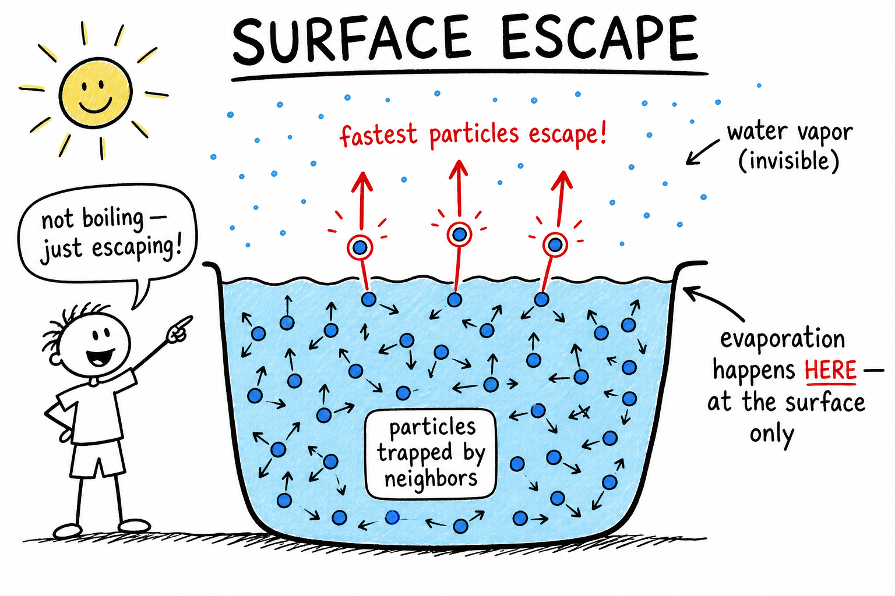
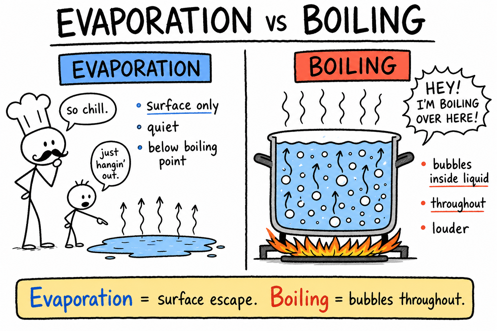
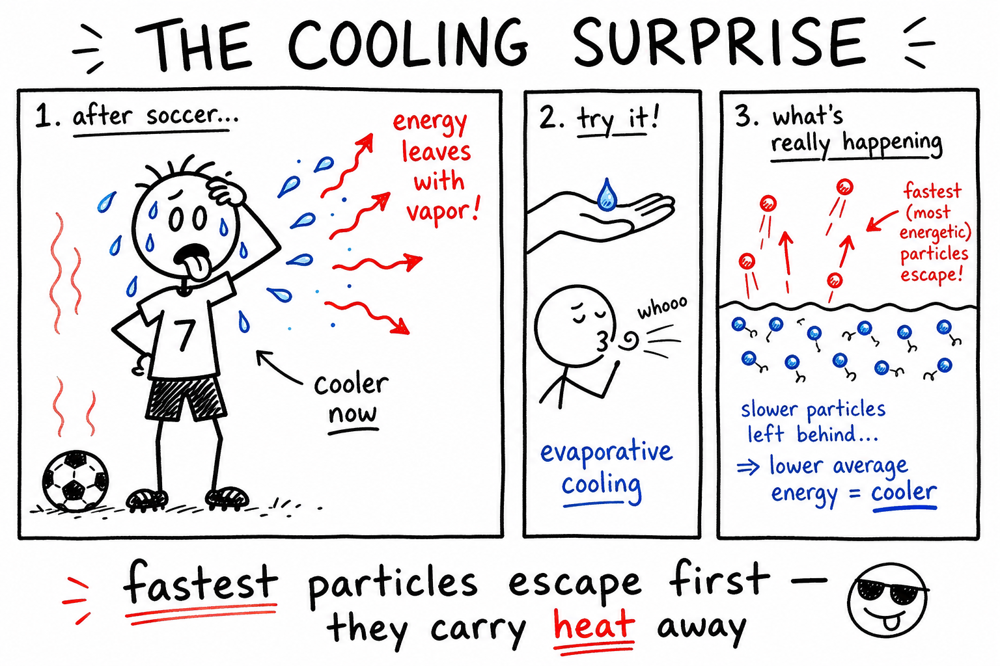
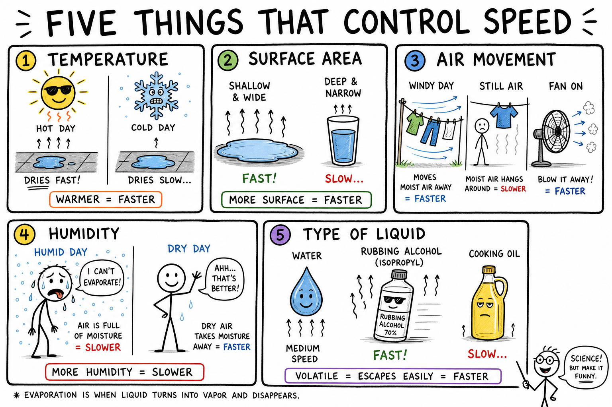
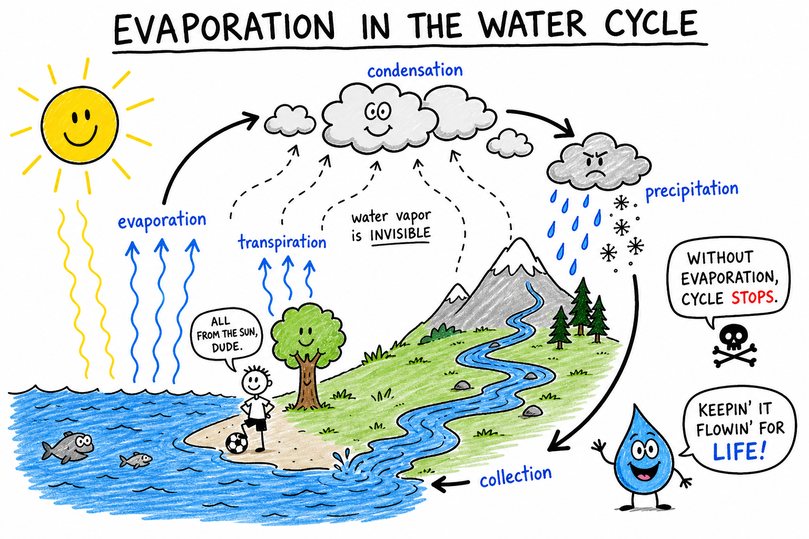

# Evaporation

Imagine finishing a hard soccer game on a hot afternoon. Your shirt is soaked with sweat. You sit in the shade and feel a breeze. Within minutes your skin feels cooler—even though the air is still warm.

The water on your skin is not just sitting there. It is turning into invisible water vapor and drifting into the air.

As it leaves, it carries energy away from your body.

That process is **evaporation**.

**Evaporation is the change of a liquid into a gas at the surface of the liquid.**

Evaporation explains why puddles vanish after rain, why wet cleats dry faster in the wind, why a dog pants after a run, why oceans feed clouds, and why a sweaty athlete cools down without jumping into ice water.

Evaporation is quiet, but it drives weather, climate, the water cycle, and life.

## Liquids and Gases

Matter can exist in different states, including solid, liquid, and gas.

In a liquid, particles are close together but can move around one another. In a gas, particles are farther apart and move freely through space.

For a liquid particle to become part of a gas, it must escape from the liquid.

Evaporation happens when particles at the **surface** of a liquid gain enough energy to break away and become gas particles.

For water, the gas form is called **water vapor**.

Water vapor is invisible. The white mist above hot water is usually tiny liquid droplets, not the vapor itself.

## Surface Escape

Evaporation happens only at the surface.

Particles deep inside a liquid are surrounded by neighbors on all sides. Surface particles have fewer neighbors above them, so the fastest ones can shoot into the air if they have enough energy.

Not every particle moves at the same speed. Even in a cup of room-temperature water, some particles zip around faster than others.

The quickest surface particles are the ones most likely to escape.

That is why a puddle can dry on a cool day without ever boiling. Evaporation does not need the whole liquid to reach the boiling point. It only needs enough energetic particles at the surface.

## Evaporation and Boiling

Evaporation and boiling both change liquid into gas, but they are not the same.

**Evaporation** happens at the surface and can occur below the boiling point.

**Boiling** happens throughout a liquid when bubbles of vapor form inside the liquid and rise to the surface.

A puddle after a storm **evaporates**. A pot of water on a hot stove **boils**.

Evaporation can be slow and silent. Boiling is usually louder and more vigorous, and for water at sea level it happens at about 100 degrees Celsius under ordinary pressure.

Remember the difference:

**Evaporation = surface escape. Boiling = bubbles throughout the liquid.**

## The Cooling Surprise

Evaporation often causes cooling.

The fastest particles are the ones most likely to escape. When they leave, they carry energy with them.

The particles left behind have lower average energy, so the liquid—or the surface they left—becomes cooler.

This is called **evaporative cooling**.

Your body uses it constantly. Sweat on your skin absorbs energy from your body as it evaporates. The vapor drifts away, taking that energy with it.

If sweat drips off without evaporating, it cools you far less. That is why humid, windless days feel brutal during sports: the sweat stays put.

Rub a little water on the back of your hand and blow on it. The skin feels cooler because evaporation is carrying heat away.

## Five Things That Control Speed

Several factors affect how quickly evaporation happens:

- **Temperature**
- **Surface area**
- **Air movement**
- **Humidity**
- **Type of liquid**

### Temperature

Warmer liquids usually evaporate faster. More particles have enough energy to escape.

A wet sidewalk dries faster on a hot July afternoon than on a chilly October morning. Warm soup gives off more water vapor than cold soup.

Temperature changes the **rate** of evaporation. It does not have to reach the boiling point.

### Surface Area

Evaporation happens at the surface, so more surface means faster drying.

A shallow puddle dries faster than the same amount of water in a deep cup. Wet socks spread on a rack dry faster than socks balled up in a gym bag. A towel hung open beats one wadded on the floor.

### Air Movement

Moving air speeds evaporation.

When water evaporates, water vapor gathers near the surface. Still air can become crowded with vapor, slowing further escape. Wind or a fan carries that vapor away and brings in drier air.

That is why laundry dries faster on a breezy day and why blowing on wet paint or damp hands helps them dry.

### Humidity

**Humidity** is the amount of water vapor already in the air.

When humidity is high, the air is already full of moisture, so evaporation slows. When humidity is low, evaporation speeds up.

On a hot, humid day, sweat may barely evaporate and your body struggles to cool down. On a dry day, sweat vanishes quickly and you feel cooler—even at the same temperature.

### Type of Liquid

Not all liquids evaporate at the same rate.

Rubbing alcohol evaporates faster than water. Gasoline evaporates quickly and gives off flammable vapors. Cooking oil evaporates much more slowly under ordinary conditions.

The rate depends partly on how strongly particles attract one another. If particles escape easily, the liquid is more **volatile**.

A **volatile** liquid evaporates readily. Volatile liquids need extra care because their vapors can be harmful or flammable.

## Evaporation and the Water Cycle

Evaporation is a major part of the **water cycle**.

The Sun warms oceans, lakes, rivers, soil, and wet surfaces. Water evaporates into the atmosphere as invisible water vapor.

Plants join in too. They release water vapor from tiny openings in their leaves in a process called **transpiration**. Together, evaporation from open water and transpiration from plants are sometimes called **evapotranspiration**—a big word for an everyday idea: water leaving the land and entering the air.

Water vapor rises and drifts through the atmosphere. Later it may cool and **condense** into clouds. Eventually water returns to Earth as rain, snow, sleet, or hail.

Without evaporation, the water cycle would stop.

## Clouds, Weather, and Energy

Evaporation supplies water vapor to the air, but vapor itself is invisible. Clouds form when water vapor cools and condenses into tiny liquid droplets or ice crystals.

Warm air can hold more water vapor than cold air. When warm, moist air rises and cools—over mountains, for example—some vapor condenses and clouds appear.

Evaporation and condensation work as a team. Evaporation puts water into the air. Condensation turns some of it back into liquid or ice.

Evaporation also moves **energy**. When water evaporates from a lake or ocean, it absorbs energy from the surface. Later, when water vapor condenses in clouds, that energy is released into the air and can help power storms.

Weather is not only wind and clouds. It is the movement of water and energy through evaporation and condensation.

## Cooling Tricks in Nature and Technology

Living things have been using evaporative cooling for millions of years.

**Humans** sweat when hot. Sweat that evaporates carries heat away. Drinking water matters because sweating removes water from your body—dehydration is a real risk in heat.

**Dogs** pant so moisture evaporates from the tongue and airways. **Elephants** spray water or mud on their skin. **Birds** may flutter throat tissues to increase evaporation. In dry climates, animals balance cooling against precious water loss.

People build cooling devices too. An **evaporative cooler** (sometimes called a swamp cooler) blows air through wet pads. As water evaporates, it cools the air. These work best in dry climates; in humid air they struggle.

Clay water jars use the same idea. A little water seeps through tiny pores and evaporates from the outside, carrying energy away and keeping the water inside cooler.

Hand sanitizer feels cool for the same reason: alcohol evaporates quickly and pulls heat from your skin.

## Evaporation Everywhere

You see evaporation's results when:

- Puddles dry after rain
- Wet cleats dry on the porch
- Paint dries on a fence
- Sweat cools you after a workout
- A towel dries after a shower
- Wet hair dries after swimming
- Salt is left behind when seawater evaporates

Sometimes evaporation helps. Sometimes it causes trouble—soil drying in a drought, food shriveling when left uncovered, or a river shrinking in a long dry spell.

## When Evaporation Leaves Solids Behind

When a solution evaporates, dissolved solids may remain.

If salt water evaporates, the water becomes vapor, but the salt stays. People have collected salt from seawater and salty ponds this way for thousands of years.

If muddy water evaporates, dirt and minerals may form a crust.

Evaporation removes liquid particles, not dissolved or suspended solids. That is why it can **separate** substances when one evaporates much more easily than the other.

## Common Misconceptions

One common mistake is thinking evaporation only happens when water boils. Evaporation can happen far below the boiling point.

Another mistake is thinking water vapor is the same as visible steam or mist. Water vapor is invisible; visible mist is made of tiny liquid droplets.

A third mistake is thinking evaporation destroys water. It does not. It changes liquid water into water vapor.

A fourth mistake is thinking sweat cools the body simply by being wet. Sweat cools best when it **evaporates**.

Finally, remember that evaporation depends on temperature, surface area, air movement, humidity, and the liquid itself.

## Safety with Evaporation

Evaporation can create safety concerns.

Some liquids give off vapors that can burn, irritate lungs, or catch fire. Gasoline, paint thinner, alcohol, and many cleaning liquids must be used carefully. Even water loss through sweating can lead to dehydration in hot weather or during hard exercise.

Good safety habits include:

- Use volatile liquids only with adult or teacher supervision.
- Keep flammable liquids away from flames, sparks, and heat.
- Work in well-ventilated areas when using liquids that give off strong vapors.
- Do not sniff unknown vapors.
- Close containers when not in use.
- Drink water during hot weather or heavy exercise.
- Take humid heat seriously because sweat may not evaporate well.
- Follow labels and laboratory instructions.

Evaporation may seem gentle, but vapors and water loss can be serious.

## The Big Idea

Evaporation is the change of a liquid into a gas at the liquid's surface.

Surface particles escape into the air. Evaporation can happen below the boiling point and often causes cooling because the fastest particles carry energy away. Temperature, surface area, air movement, humidity, and liquid type all affect how fast it happens.

If you remember only one sentence, remember this:

**Evaporation is surface particles escaping from a liquid into a gas, often carrying heat away as they go.**

## Study Questions

1. What is evaporation?
2. What is water vapor?
3. Why does evaporation happen at the surface of a liquid?
4. Why can evaporation happen below the boiling point?
5. How is evaporation different from boiling?
6. Why does evaporation often cause cooling?
7. What is evaporative cooling?
8. How does sweating cool the body?
9. Name five factors that affect how quickly evaporation happens.
10. How does temperature affect evaporation?
11. How does surface area affect evaporation?
12. Why does moving air speed evaporation?
13. What is humidity?
14. Why does sweat cool less effectively on a humid day?
15. What does volatile mean?
16. Give two examples of liquids that evaporate quickly.
17. How is evaporation part of the water cycle?
18. What is transpiration?
19. How are evaporation and condensation connected in cloud formation?
20. How can evaporation help power weather or storms?
21. Give three examples of evaporation in everyday life.
22. How does an evaporative cooler work?
23. Why does salt remain after salt water evaporates?
24. Why is visible mist not the same as water vapor?
25. What are three safety rules related to evaporation?
26. In your own words, explain why a puddle can dry without boiling.
