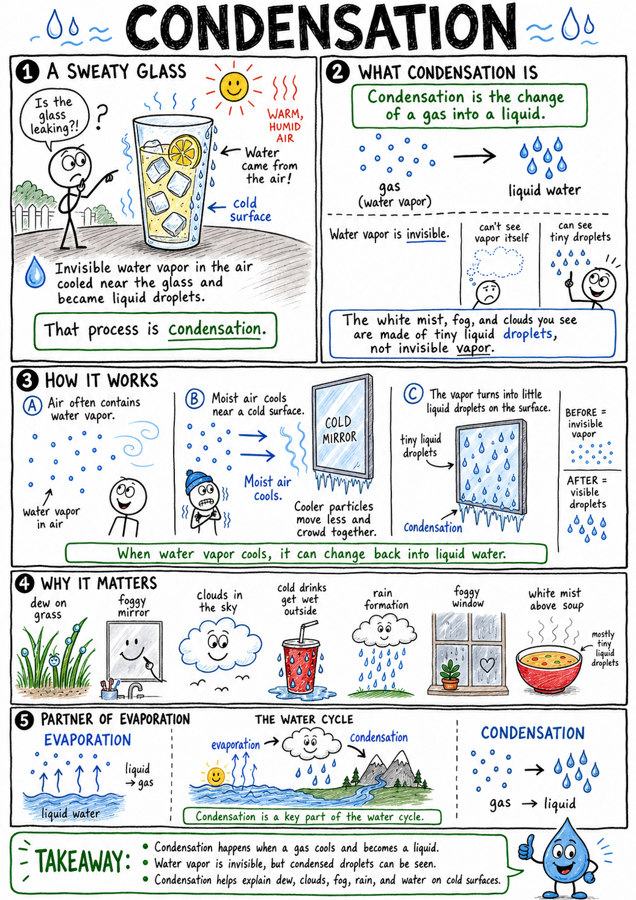
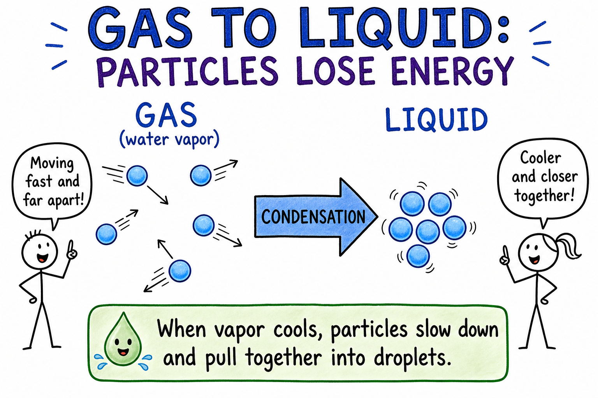
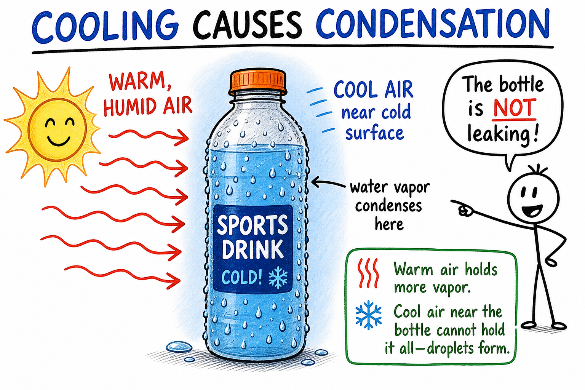
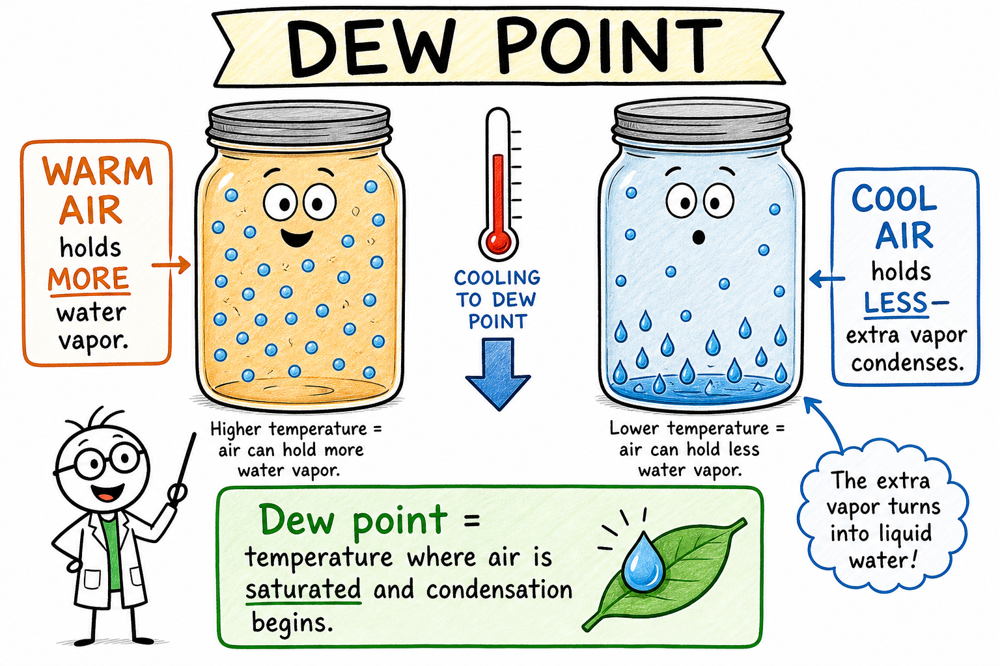
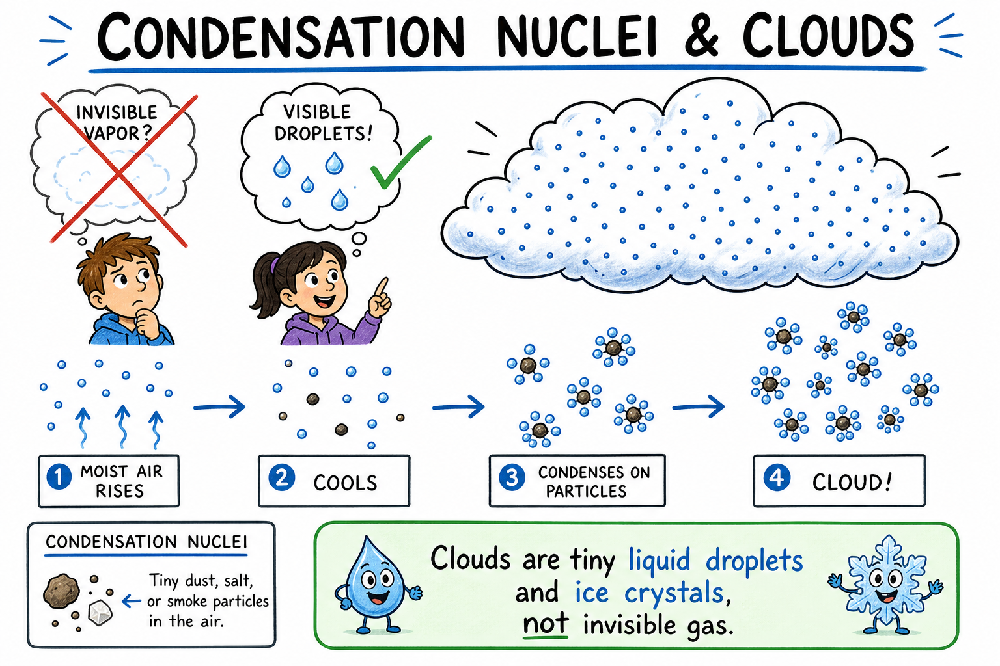
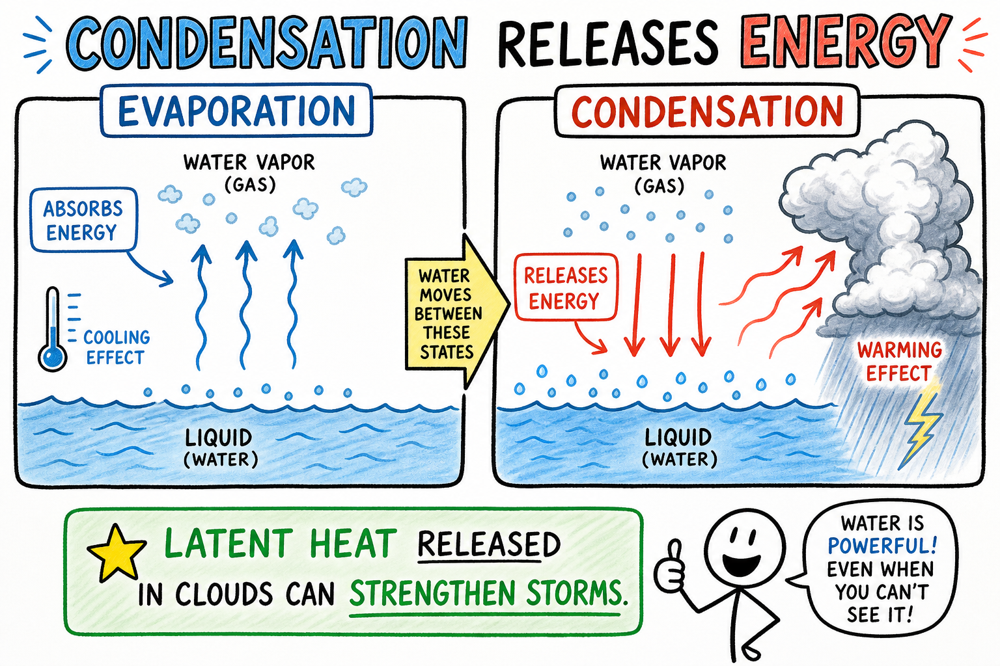
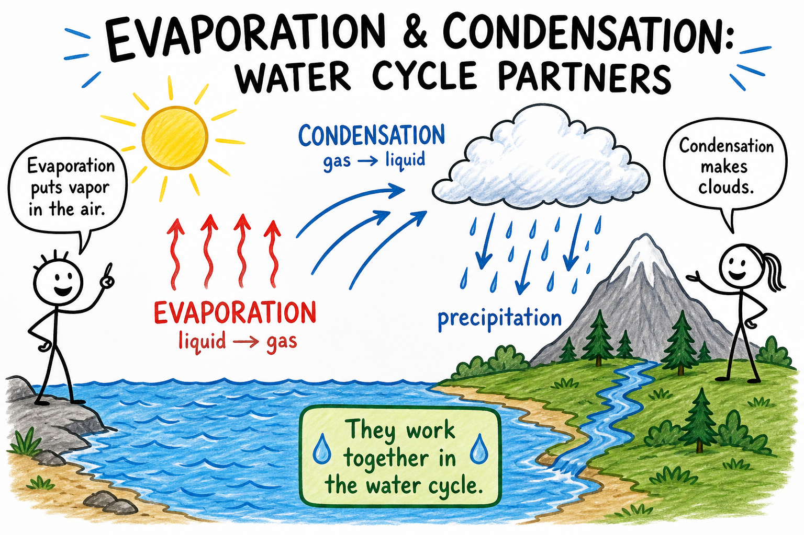

# Condensation

Imagine walking onto a soccer field early on a cool morning. The grass looks wet, but it did not rain overnight. Your shoes leave dark prints in the shimmering grass. Touch a blade of grass and your fingers come away damp.

That moisture is dew. It formed when water vapor in the air cooled and changed into tiny liquid droplets.

Now imagine carrying a cold bottle of sports drink outside on a warm, humid afternoon. Within minutes, water beads up on the outside of the bottle. The bottle is not leaking. That water came from the air too.

Invisible water vapor cooled near the cold surface and gathered into liquid droplets.

That process is condensation.

**Condensation is the change of a gas into a liquid.**

Condensation explains dew on grass, fog on goggles, clouds in the sky, water drops on cold drinks, rain formation, foggy bathroom mirrors, mist above hot soup, and moisture on tent walls. It is the partner of evaporation and one of the most important processes in the water cycle.

Condensation is quiet, but it shapes weather, storms, buildings, and everyday life.

## Water Vapor in the Air

Air often contains water vapor.

**Water vapor** is water in its gas form. It is invisible.

You cannot see water vapor itself. When you see fog, mist, clouds, or the white "steam" above hot water, you are usually seeing tiny liquid droplets or ice crystals, not the invisible vapor.

Condensation happens when water vapor changes back into liquid water.

This usually occurs when moist air cools or when water vapor touches a cool surface.

## Particles Losing Energy

Matter is made of tiny particles.

In a gas, particles move freely and are farther apart. In a liquid, particles are closer together and stay near one another while still moving.

For a gas to become a liquid, its particles must lose enough energy to come closer together.

When water vapor cools, its particles move more slowly. Attractions between the particles can pull them together into tiny liquid droplets.

That is condensation at the particle level.

## Condensation and Evaporation

Condensation is the opposite of evaporation.

**Evaporation** changes a liquid into a gas.

**Condensation** changes a gas into a liquid.

Both processes are happening around us all the time. In a closed container of water, some liquid particles evaporate while some vapor particles condense back into liquid.

If more particles evaporate than condense, the amount of liquid decreases.

If more particles condense than evaporate, droplets grow.

The balance depends on temperature, humidity, air movement, and surfaces.

Evaporation puts water vapor into the air. Condensation turns some of that vapor back into liquid or ice. Together they keep the water cycle moving.

## Cooling Causes Condensation

Cooling is one of the most common causes of condensation.

Warm air can hold more water vapor than cold air. When moist air cools, it may no longer be able to hold as much water vapor. The extra water vapor condenses into liquid droplets.

This is why a cold drink gathers water on a humid day. Air near the bottle cools. Water vapor in that air condenses on the cold surface.

This is also why a bathroom mirror fogs after a hot shower. Warm, moist air touches the cooler mirror and water droplets form.

This is also why your breath looks like a small cloud on a cold winter day. Warm, moist air from your lungs meets cold outdoor air and water vapor condenses into tiny droplets you can see.

## Dew Point

The **dew point** is the temperature at which air becomes saturated with water vapor and condensation begins.

If air cools to its dew point, water vapor starts condensing into liquid droplets, if surfaces or tiny particles are available.

When grass, cars, or rooftops cool at night, the air touching them may reach the dew point. Water vapor condenses as dew.

If the temperature is below freezing, water vapor may form frost instead of liquid dew.

The dew point helps meteorologists understand humidity, fog, clouds, and comfort. On a humid summer day, the dew point may be high, which can make the air feel sticky even when the temperature is not extreme.

## Humidity and Saturation

**Humidity** is the amount of water vapor in the air.

Air is **saturated** when it contains as much water vapor as it can hold at that temperature.

Warm air can hold more water vapor than cold air. If saturated air cools, some water vapor must condense.

This is why humid air feels heavy and why condensation often appears when warm, moist air meets a cooler surface.

High humidity means condensation may happen more easily if the air cools even a little.

On a dry day, the air has more room for water vapor, so condensation is less likely unless something cools sharply.

## Factors That Favor Condensation

Several factors make condensation more likely:

- **Cooling**
- **High humidity**
- **Cold surfaces**
- **Tiny particles in the air**

Cooling slows gas particles and can push air to its dew point.

High humidity means the air is already close to saturation, so only a small drop in temperature may trigger condensation.

Cold surfaces, such as windows, mirrors, drink bottles, or metal tools, cool nearby air quickly.

Tiny particles give water molecules something to gather on as droplets form.

## Condensation Needs a Surface

Water vapor often condenses on a surface.

The surface might be a cold glass, a mirror, grass, a window, dust, smoke particles, or tiny salt particles in the air.

In clouds, water vapor condenses around tiny particles called **condensation nuclei**.

These particles give water molecules something to gather on.

Without tiny particles in the air, cloud droplets would have a harder time forming.

Condensation often begins with something small to cling to.

## Clouds

Clouds form when moist air rises and cools.

As air rises, it expands because pressure is lower higher in the atmosphere. Expanding air cools. If it cools to the dew point, water vapor condenses around tiny particles.

The result is a cloud made of tiny liquid droplets, ice crystals, or both.

Clouds are not made of invisible water vapor. They are made of many tiny droplets or crystals so small that they can remain suspended in moving air.

A cloud is condensation made visible.

## Fog

Fog is a cloud near the ground.

Fog forms when air near the surface cools to its dew point or when moist air moves over a cooler surface.

On a cool morning, the ground may chill the air above it. Water vapor condenses into tiny droplets, and fog forms.

Fog can reduce visibility, making travel dangerous for drivers, cyclists, hikers, and pilots.

Like clouds, fog is made of tiny droplets or ice crystals suspended in air.

## Dew and Frost

**Dew** is liquid water that condenses on cool surfaces near the ground.

Grass, leaves, cars, and railings often cool during clear nights. If nearby air reaches its dew point, water vapor condenses on those surfaces.

**Frost** forms when water vapor becomes ice on a surface below freezing.

Frost is not frozen dew in every case. Sometimes water vapor changes directly into ice. That process is called **deposition**.

Dew and frost both show that air contains water even when the sky looks clear.

## Rain and Precipitation

Condensation is part of rain formation.

In clouds, tiny droplets form by condensation. At first they are far too small to fall as rain. But droplets can collide and combine. Ice crystals can grow and fall through cloud layers.

When water drops or ice particles become large enough, gravity pulls them down as precipitation.

**Precipitation** includes rain, snow, sleet, and hail.

Condensation does not by itself guarantee rain, but it is an important step in making clouds that can produce precipitation.

## Condensation Releases Energy

Evaporation absorbs energy from the surroundings.

Condensation releases energy to the surroundings.

When water vapor changes into liquid water, particles move closer together and release energy. This released energy is sometimes called **latent heat**.

In the atmosphere, condensation can release large amounts of energy into rising air. This can help power storms.

Thunderstorms and hurricanes gain much of their strength from water vapor condensing and releasing energy.

Condensation is not just water appearing. It is also energy moving.

## Condensation and Weather

Condensation affects weather in powerful ways.

Water evaporating from oceans, lakes, and wet ground adds invisible water vapor to the air. When that moist air rises and cools, condensation forms clouds.

As droplets and ice crystals grow, precipitation may fall. As water vapor condenses, energy is released into the air. That energy can strengthen rising air and help build thunderstorms.

Weather is not only wind and clouds. It is also the movement of water and energy through evaporation and condensation.

## Condensation in Sports and Outdoors

Condensation shows up often in active life.

You may notice it when:

- Soccer or football cleats get wet from morning dew
- Ski or snowboard goggles fog on a cold day
- Bike helmet vents steam in cool air after a hard ride
- A tent wall feels damp inside on a chilly night
- Breath clouds form during winter practice
- A water bottle sweats on the sidelines in humid weather

In each case, moist air or vapor met a cooler surface or cooler air, and droplets formed.

Understanding condensation helps you predict foggy mornings, protect gear, and stay safe when visibility drops.

## Condensation on Windows and in Buildings

Windows often show condensation.

In winter, warm indoor air may contain water vapor from cooking, showering, breathing, and drying clothes. If that air touches a cold window, it cools. Water vapor condenses into droplets on the glass.

If the window is very cold, frost may form.

Condensation on windows can be a sign of high indoor humidity, poor ventilation, or cold glass surfaces.

Too much condensation can lead to mold, water damage, or rotting wood.

Buildings must manage moisture as well as temperature.

Ventilation helps carry moist air away. Insulation can keep surfaces warmer so they are less likely to reach the dew point. Dehumidifiers remove water vapor from indoor air.

Good homes control condensation to protect health and building materials.

Moisture that appears harmless can cause problems if it collects repeatedly.

## Condensation in Everyday Life

Condensation is everywhere.

You see its results when:

- A cold drink sweats on a humid day
- A mirror fogs after a shower
- Soup steam turns into visible mist above the bowl
- A car windshield fogs on a cool morning
- Water beads on the lid of a pot
- A basement feels damp and clammy
- A phone screen fogs when you come inside from the cold

Sometimes condensation is useful, such as when an air conditioner removes moisture from hot, sticky air. Sometimes it is a problem, such as when moisture damages wood, paper, or electronics.

## Condensation in Machines

Condensation can affect machines and electronics.

If a cold electronic device is brought into a warm, humid room, water may condense on or inside it. This can cause corrosion or electrical problems.

Engines, air conditioners, refrigerators, and compressed-air systems may all produce or collect condensation.

Air conditioners remove moisture from air by cooling it below the dew point, causing water vapor to condense on cold coils. The liquid water then drains away.

This is why air conditioners can make indoor air feel less humid.

Let cold electronics warm to room temperature before turning them on in a humid room. That simple habit can protect phones, laptops, cameras, and game consoles.

## Condensation and the Water Cycle

Condensation is a major part of the water cycle.

Water evaporates from oceans, lakes, rivers, soil, and living things. The water vapor enters the atmosphere. When moist air cools, water vapor condenses into cloud droplets or ice crystals.

Those clouds may later produce precipitation.

Evaporation moves water into the air. Condensation helps turn it back into visible droplets and clouds.

Without condensation, there would be no clouds as we know them and no ordinary rain from clouds.

## Common Misconceptions

One common mistake is thinking the water on the outside of a cold glass came through the glass. It did not. It came from water vapor in the air.

Another mistake is thinking clouds are made of invisible water vapor. Clouds are made of tiny liquid droplets, ice crystals, or both.

A third mistake is thinking condensation only happens in cold weather. It can happen whenever moist air or vapor cools enough, including on a summer drink bottle.

A fourth mistake is thinking steam and water vapor are the same visible thing. Water vapor is invisible. The white cloud near steam is tiny condensed droplets.

A fifth mistake is thinking dew is rain that fell during the night. Dew usually forms when water vapor in the air condenses on cool surfaces, not when rain falls.

Finally, remember that condensation depends on cooling, humidity, surfaces, and tiny particles in the air.

## Safety with Condensation

Condensation can create safety and health issues.

Wet floors can be slippery. Fog can reduce visibility. Condensation in buildings can encourage mold. Moisture in electronics can cause damage. Steam can condense on skin and release heat, causing burns.

Good safety habits include:

- Wipe up condensation on floors or counters.
- Use ventilation when showering, cooking, or drying clothes indoors.
- Be cautious in fog while walking, biking, or traveling.
- Let cold electronics warm up before turning them on in humid rooms.
- Keep face and hands away from steam.
- Use oven mitts and caution around hot lids and boiling pots.
- Report persistent indoor moisture or mold.
- Store sensitive equipment in dry places.

Condensation may look gentle, but water and released heat can cause real problems.

## The Big Idea

Condensation is the change of a gas into a liquid.

It often happens when water vapor cools to the dew point and forms droplets on surfaces or tiny particles in air. Condensation creates dew, fog, clouds, drops on cold drinks, and moisture on windows. It releases energy that can help power storms. It is the partner of evaporation and an essential part of the water cycle and weather.

If you remember only one sentence, remember this:

**Condensation happens when gas particles lose energy and gather into liquid droplets.**

## Study Questions

1. What is condensation?
2. What is water vapor?
3. Why can you not see water vapor itself?
4. What happens to particles when a gas condenses into a liquid?
5. How is condensation related to evaporation?
6. Why does cooling often cause condensation?
7. Why does a cold drink gather water droplets on a humid day?
8. Why does a bathroom mirror fog after a hot shower?
9. Why can your breath look like a cloud on a cold day?
10. What is the dew point?
11. What does it mean for air to be saturated?
12. What is humidity?
13. Name four factors that make condensation more likely.
14. Why does condensation often need a surface or tiny particles?
15. What are condensation nuclei?
16. How do clouds form?
17. Why is a cloud not invisible water vapor?
18. What is fog?
19. What is dew?
20. How is frost different from dew?
21. What is precipitation?
22. How does condensation help make rain possible?
23. Does condensation absorb or release energy?
24. How can condensation help power storms?
25. Give three examples of condensation in sports or outdoor life.
26. Why might condensation form on windows in winter?
27. How can homes control unwanted condensation?
28. Give two examples of condensation affecting machines or electronics.
29. What are three safety rules related to condensation?
30. In your own words, explain why the outside of a cold drink bottle becomes wet.
