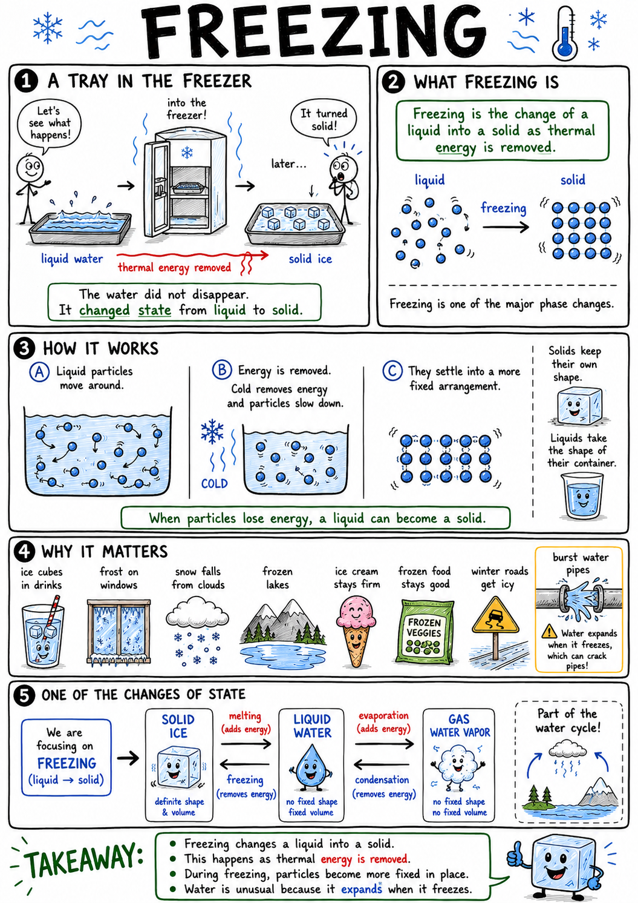

# Freezing

Imagine placing a tray of water into a freezer. At first the water sloshes as a liquid. Later, it becomes hard, clear ice that keeps the shape of the tray. The water did not disappear. It changed state.

The liquid became a solid.

That process is freezing.

**Freezing is the change of a liquid into a solid as thermal energy is removed.**

Freezing explains ice cubes, frost, snow, frozen lakes, ice cream, frozen food, burst water pipes, winter roads, glaciers, and why water is unusual compared with many other substances.

Freezing is one of the major phase changes, or changes of state, in matter.

## Liquids and Solids

Matter can exist in different states, including solid, liquid, and gas.

In a liquid, particles are close together but can move around one another. That is why a liquid flows and takes the shape of its container.

In a solid, particles are usually arranged more firmly. They may vibrate, but they do not move freely past one another. That is why a solid keeps its own shape.

When a liquid freezes, its particles lose energy and settle into a more fixed arrangement.

The substance becomes solid.

## Removing Thermal Energy

Freezing happens when thermal energy is removed from a liquid.

Thermal energy is the energy of tiny particle motion. As a liquid cools, its particles move more slowly on average.

At the freezing point, particles can begin forming a solid structure.

Energy must continue to leave the substance while freezing happens. During the change, the temperature may stay nearly the same even though energy is still being removed.

That energy is involved in changing the arrangement of particles, not simply lowering temperature.

## Freezing Point

The **freezing point** is the temperature at which a liquid changes into a solid under certain conditions.

For pure water under ordinary pressure, the freezing point is:

**0 degrees Celsius**

or

**32 degrees Fahrenheit**

Different substances have different freezing points. Melted candle wax, liquid iron, cooking oil, mercury, and water all freeze at different temperatures.

Pressure and impurities can also affect freezing point.

## Freezing and Melting

Freezing and melting are opposite changes.

**Freezing** changes a liquid into a solid.

**Melting** changes a solid into a liquid.

For a pure substance under the same pressure, freezing and melting happen at the same temperature.

Water freezes at 0 degrees Celsius and ice melts at 0 degrees Celsius under ordinary pressure.

Whether freezing or melting happens depends on whether energy is being removed or added.

## Freezing Releases Energy

When a liquid freezes, it releases energy to its surroundings.

Particles in the liquid move into a more organized solid arrangement. As they settle into that arrangement, energy is given off.

This energy is sometimes called **latent heat**.

That means freezing is not simply "cold appearing." It is a process where thermal energy leaves the liquid and goes somewhere else.

In weather, the release of energy during freezing can affect clouds, storms, and precipitation.

## Supercooling

Sometimes a liquid can be cooled below its normal freezing point without immediately becoming solid.

This is called **supercooling**.

Supercooled water can remain liquid below 0 degrees Celsius if it is very pure and undisturbed. If it is shaken or touches a seed crystal, it may freeze suddenly.

Supercooling can happen in clouds, where tiny water droplets remain liquid below freezing. These droplets can freeze when they touch surfaces or ice particles.

Supercooling reminds us that freezing can depend on conditions, not temperature alone.

## Nucleation

Freezing often begins at a tiny starting point.

This beginning is called **nucleation**.

A dust speck, scratch, ice crystal, or rough surface can help particles begin arranging into a solid.

Once a small solid crystal forms, more particles can join it, and freezing spreads.

This is why ice crystals can grow from small beginnings into snowflakes, frost patterns, or ice on a pond.

Many natural patterns begin with tiny starting points.

## Water Is Unusual

Most liquids contract as they cool and become denser when they freeze.

Water is unusual. As water cools, it becomes denser until about 4 degrees Celsius. Below that, it begins to expand. When it freezes, it forms ice that is less dense than liquid water.

That is why ice floats.

This unusual behavior matters greatly for life on Earth. If ice sank, lakes and ponds could freeze from the bottom upward. Instead, ice forms on top and helps insulate the water below.

Fish and other aquatic life can survive under the ice in winter.

## Expansion When Water Freezes

Water expands when it freezes.

This expansion can create powerful forces.

If water gets into a crack in rock and freezes, the expanding ice can widen the crack. Repeated freezing and thawing can break rocks apart. This is called **frost wedging**.

If water freezes inside a pipe, the expanding ice can burst the pipe.

If a full bottle of water freezes, it may crack or bulge.

Water's expansion during freezing is useful in nature but dangerous in buildings and containers.

## Freezing in Weather

Freezing is important in weather.

Snow forms when water vapor or tiny droplets become ice crystals in cold clouds. Sleet forms when raindrops freeze before reaching the ground. Freezing rain occurs when liquid drops fall and freeze on cold surfaces.

Frost forms when water vapor becomes ice on cold surfaces.

Hail forms in strong storm clouds when ice pellets are carried up and down by powerful air currents, gaining layers of ice.

Winter weather is full of freezing and related phase changes.

## Ice Crystals and Snowflakes

Snowflakes are made of ice crystals.

Water molecules in ice arrange themselves in patterns that often produce six-sided shapes. Temperature, humidity, and air movement affect how snow crystals grow.

No two large snowflakes are exactly alike because each follows a different path through changing cloud conditions.

Snowflakes show that freezing is not only a change of state. It can also create beautiful structures.

The arrangement of particles matters.

## Freezing and Food

Freezing helps preserve food.

Many microbes grow slowly or stop growing at freezer temperatures. Chemical changes in food also slow down.

Freezing does not kill all microbes, and it does not make spoiled food safe again. It mainly slows activity.

When food freezes, water inside it forms ice crystals. Large ice crystals can damage cells, which may change texture when the food thaws. Quick freezing often creates smaller crystals and can preserve texture better.

Freezing is useful, but safe food handling still matters.

## Salt and Freezing Point

Adding salt can lower the freezing point of water.

This is called **freezing point depression**.

Salt spread on icy roads can help ice melt when temperatures are not too low. The salty water mixture freezes at a lower temperature than pure water.

Ice cream makers may use salt with ice around a container. The salt lowers the freezing point, making the ice-salt mixture colder than ordinary melting ice. This helps freeze the ice cream mixture.

Salt does not make cold from nothing. It changes the temperature at which water freezes.

## Freezing and Roads

Freezing can make roads dangerous.

Water on a road may freeze into ice. Ice reduces friction between tires and pavement, making it harder to stop or steer.

Black ice is especially dangerous because it is thin, clear, and difficult to see.

Bridges may freeze before nearby roads because cold air can pass above and below the bridge, cooling it faster.

Drivers and pedestrians must be careful when temperatures are near or below freezing.

## Freezing in Living Things

Freezing can harm living cells.

When water inside cells freezes, ice crystals can damage cell structures. Freezing can also pull water out of cells and change chemical balances.

Some organisms have special adaptations. Certain fish, insects, frogs, and plants can survive freezing conditions using natural antifreeze chemicals, controlled ice formation, or dormancy.

Humans must protect skin and body tissues from freezing.

Frostbite occurs when body tissues freeze or are damaged by extreme cold.

## Freezers and Refrigeration

A freezer does not create cold as a substance.

It removes thermal energy from the inside and releases that energy outside. This is why the back or underside of a refrigerator or freezer can feel warm.

Freezers use a circulating refrigerant, compression, expansion, and heat transfer to move energy.

The freezer keeps food cold by continually removing thermal energy faster than it leaks in from the room.

Cold is not something added. Heat is removed.

## Common Misconceptions

One common mistake is thinking freezing creates cold. Freezing happens when thermal energy is removed from a liquid.

Another mistake is thinking all substances freeze at 0 degrees Celsius. That is the freezing point of pure water under ordinary pressure, not every liquid.

A third mistake is thinking ice is denser than water because it is solid. Ice is less dense than liquid water, so it floats.

A fourth mistake is thinking frozen food has no microbes. Freezing slows many microbes, but it does not necessarily kill them all.

Finally, remember that freezing and melting can happen at the same temperature; the direction depends on whether energy is removed or added.

## Safety with Freezing

Freezing can create safety problems.

Ice can cause slips and crashes. Frozen water can burst pipes and containers. Frostbite can injure skin. Frozen food can be unsafe if thawed and refrozen improperly. Dry ice, which is frozen carbon dioxide, is much colder than water ice and can injure skin.

Good safety habits include:

- Walk carefully on icy surfaces.
- Never assume a frozen pond or lake is safe.
- Protect skin in freezing weather.
- Keep water pipes from freezing when possible.
- Do not place sealed full containers of water in a freezer.
- Handle dry ice only with proper adult supervision and protection.
- Keep frozen food at safe temperatures.
- Use caution around freezing rain, black ice, and icy steps.

Freezing is ordinary, but ice and extreme cold deserve respect.

## The Big Idea

Freezing is the change of a liquid into a solid as thermal energy is removed.

Particles lose energy and settle into a more fixed arrangement. Each substance has its own freezing point, and water is unusual because it expands as it freezes and forms ice that floats. Freezing shapes weather, preserves food, breaks rocks, damages pipes, forms snow and ice, and affects living things.

If you remember only one sentence, remember this:

**Freezing happens when a liquid loses enough thermal energy for its particles to form a solid.**

## Study Questions

1. What is freezing?
2. How are particles arranged differently in liquids and solids?
3. What happens to particle motion as a liquid cools?
4. What is the freezing point?
5. What is the freezing point of pure water under ordinary pressure in Celsius and Fahrenheit?
6. How are freezing and melting related?
7. Why can freezing and melting happen at the same temperature?
8. Does freezing absorb or release energy?
9. What is latent heat?
10. What is supercooling?
11. What is nucleation?
12. Why can scratches, dust, or ice crystals help freezing begin?
13. What is unusual about water as it freezes?
14. Why does ice float on liquid water?
15. Why is floating ice important for life in lakes and ponds?
16. How can freezing water break rocks or pipes?
17. What is frost wedging?
18. Give three examples of freezing in weather.
19. How do snowflakes form?
20. How does freezing help preserve food?
21. Why does freezing not make spoiled food safe again?
22. How does salt affect the freezing point of water?
23. Why can black ice be dangerous?
24. How does a freezer keep food frozen?
25. What are three safety rules related to freezing?
26. In your own words, explain why freezing is not the same as "adding cold."
