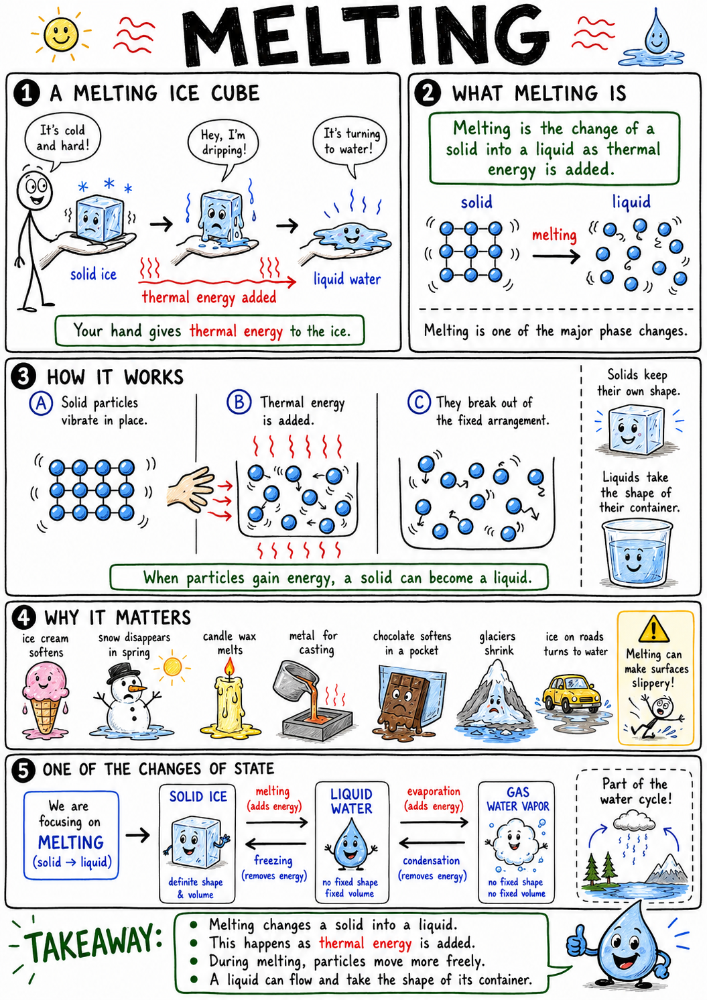

# Melting

Imagine holding an ice cube in your hand. At first it is hard and slippery. Soon your fingers feel cold, drops of water appear, and the sharp corners soften. The ice is changing into liquid water.

Your hand is giving thermal energy to the ice.

That process is melting.

**Melting is the change of a solid into a liquid as thermal energy is added.**

Melting explains ice cream softening, snow disappearing in spring, candle wax becoming liquid, metal being cast into shapes, chocolate softening in a pocket, glaciers shrinking, and ice on roads turning to water.

Melting is one of the major phase changes, or changes of state, in matter.

## Solids and Liquids

Matter can exist in different states, including solid, liquid, and gas.

In a solid, particles are usually held in a fixed arrangement. They can vibrate, but they do not move freely past one another. This is why a solid keeps its own shape.

In a liquid, particles are still close together, but they can move around one another. This is why a liquid flows and takes the shape of its container.

When a solid melts, its particles gain enough energy to break out of their fixed arrangement and move more freely.

The substance becomes liquid.

## Adding Thermal Energy

Melting happens when thermal energy is added to a solid.

Thermal energy is the energy of tiny particle motion. As a solid warms, its particles vibrate more strongly.

At the melting point, particles can begin moving out of the solid arrangement.

Energy must continue to enter the substance while melting happens. During the change, the temperature may stay nearly the same even though energy is still being added.

That energy is being used to change the arrangement of particles, not simply to raise temperature.

## Melting Point

The **melting point** is the temperature at which a solid changes into a liquid under certain conditions.

For pure ice under ordinary pressure, the melting point is:

**0 degrees Celsius**

or

**32 degrees Fahrenheit**

Different substances have different melting points. Candle wax melts at a fairly low temperature. Chocolate melts near body temperature. Iron melts only at a very high temperature.

Pressure and impurities can also affect melting point.

## Melting and Freezing

Melting and freezing are opposite changes.

**Melting** changes a solid into a liquid.

**Freezing** changes a liquid into a solid.

For a pure substance under the same pressure, melting and freezing happen at the same temperature.

Ice melts at 0 degrees Celsius and water freezes at 0 degrees Celsius under ordinary pressure.

Whether melting or freezing happens depends on whether energy is being added or removed.

## Melting Absorbs Energy

Melting absorbs energy from the surroundings.

When ice melts in your hand, thermal energy leaves your hand and enters the ice. Your hand feels cold because it is losing energy.

This energy helps loosen the solid arrangement of the ice particles so they can become liquid water.

The energy absorbed during a phase change is sometimes called **latent heat**.

Melting is not just a solid getting warmer. It is a change in particle arrangement that requires energy.

## Temperature During Melting

During melting, temperature can remain nearly constant.

If you heat a mixture of ice and water, the temperature often stays near 0 degrees Celsius while ice is still present. The added energy is being used to melt ice rather than quickly raising the temperature.

Once all the ice has melted, added energy can raise the temperature of the liquid water.

This is an important idea:

**During a phase change, energy can change state instead of changing temperature.**

That is why melting ice can keep a drink cold for a long time.

## Melting Ice and Cooling Drinks

Ice cools a drink in two ways.

First, heat flows from the warmer drink into the colder ice. Second, the melting ice absorbs energy as it changes from solid to liquid.

As long as ice remains, much of the incoming energy goes into melting the ice. This helps keep the drink near the melting temperature of ice.

This is why a cooler full of ice can keep food cold. The ice absorbs heat as it melts.

The melting process is a useful energy sink.

## Impurities and Melting Point

Impurities can change melting point.

Adding salt to ice can lower the melting point of the ice-water mixture. This means ice can melt at a temperature below 0 degrees Celsius.

Road crews use salt to help melt ice when conditions are suitable. Ice cream makers may use salt with ice around a container to create a colder mixture that can freeze the ice cream.

The salt does not create heat. It changes the freezing and melting behavior of water.

This effect is called **melting point depression** or **freezing point depression**.

## Melting in Weather

Melting is important in weather and seasons.

Snow melts when it gains enough energy from sunlight, warm air, warm ground, or rain. Ice on lakes melts in spring as the air and water warm. Hailstones may partially melt as they fall through warmer air.

Melting snow can feed streams and rivers. In mountains, melting snowpack is an important water source.

Too much rapid melting can cause floods.

Weather is full of phase changes, and melting is one of the most visible.

## Melting and Water's Importance

Water's melting point is important for life.

On Earth, temperatures often move above and below water's freezing and melting point. This allows water to cycle between solid ice and liquid water.

Liquid water is essential for life as we know it. Ice can store water in glaciers, snowpack, and polar regions. Melting releases that water into streams, rivers, lakes, and oceans.

The melting of ice shapes landscapes, seasons, and ecosystems.

It also helps scientists study climate change by observing glaciers and sea ice.

## Melting in Cooking

Cooking uses melting often.

Butter melts in a pan. Chocolate melts in warm hands or over gentle heat. Cheese melts on pizza. Fat melts in meat. Sugar can melt and later caramelize when heated strongly.

Different foods melt at different temperatures because their materials and structures differ.

Careful cooking often means controlling melting. Too much heat can burn chocolate, separate butter, or scorch sugar.

Melting changes texture, flavor, and how ingredients mix.

## Melting Metals

Metals can melt if heated enough.

Molten metal can be poured into molds to make tools, engine parts, sculptures, pipes, and machine components. This process is called **casting**.

Iron, aluminum, copper, gold, and steel all have melting points. Some are much higher than ordinary fires can reach.

Metal melting requires special furnaces and safety equipment because molten metal is extremely hot and dangerous.

The ability to melt and shape metals changed human history.

## Melting Rocks

Rocks can melt deep inside Earth.

Melted rock below Earth's surface is called **magma**. When it reaches the surface, it is called **lava**.

Rock melts at very high temperatures, and pressure also matters. The melting of rock helps create volcanoes, igneous rocks, and parts of Earth's crust.

Magma is not simply underground fire. It is molten rock containing minerals, gases, and crystals.

Melting inside Earth helps build and reshape the planet.

## Partial Melting

Some mixtures do not melt all at once.

Chocolate, butter, rock, and many alloys are mixtures of different substances. Different parts may soften or melt at different temperatures.

This is called **partial melting** when only some components melt.

In geology, partial melting is important because it can produce magma with a different composition from the original rock.

In cooking, partial melting affects texture. A food may soften before it becomes fully liquid.

Melting can be simple for pure substances and more complicated for mixtures.

## Melting and Shape

When a solid melts, it loses its fixed shape.

An ice cube becomes water that spreads to fit its container. Candle wax becomes liquid and can flow. Melted metal can be poured into a mold.

The mass of the substance usually stays the same, but the shape and volume may change.

This is why molds are useful. A material can be melted, shaped while liquid, and then allowed to freeze or solidify into a new solid form.

Many manufactured objects are made this way.

## Common Misconceptions

One common mistake is thinking melting means a substance disappears. It does not. The substance changes from solid to liquid.

Another mistake is thinking all solids melt at 0 degrees Celsius. That is the melting point of pure ice under ordinary pressure, not all solids.

A third mistake is thinking melting and dissolving are the same. They are different. Ice melting becomes liquid water. Salt dissolving in water becomes a solution.

A fourth mistake is thinking temperature always rises while heat is added. During melting, temperature may stay nearly constant while energy changes the state.

Finally, remember that melting absorbs energy from the surroundings.

## Safety with Melting

Melting can involve dangerous heat.

Hot wax, melted sugar, molten plastic, boiling water, and molten metal can burn skin badly. Some materials give off harmful fumes when heated or melted. Ice melting on roads can refreeze and create slippery surfaces.

Good safety habits include:

- Do not touch melted wax, sugar, plastic, or metal.
- Use adult or teacher supervision when heating substances.
- Use heat-safe gloves and eye protection when appropriate.
- Heat materials only in approved containers.
- Keep flammable materials away from heat sources.
- Do not melt unknown materials.
- Be careful on wet or refrozen surfaces.
- Remember that melted substances may stay hot even after they stop glowing or bubbling.

Melting is common, but hot liquids and softened materials can be dangerous.

## The Big Idea

Melting is the change of a solid into a liquid as thermal energy is added.

Particles gain enough energy to move out of a fixed solid arrangement and flow as a liquid. Each substance has its own melting point, and melting absorbs energy. Melting explains ice in drinks, snow in spring, cooking, metal casting, lava, wax, chocolate, and many useful manufacturing processes.

If you remember only one sentence, remember this:

**Melting happens when a solid absorbs enough thermal energy for its particles to move as a liquid.**

## Study Questions

1. What is melting?
2. How are particles arranged differently in solids and liquids?
3. What happens to particle motion as a solid warms?
4. What is the melting point?
5. What is the melting point of pure ice under ordinary pressure in Celsius and Fahrenheit?
6. How are melting and freezing related?
7. Why can melting and freezing happen at the same temperature?
8. Does melting absorb or release energy?
9. What is latent heat?
10. Why can your hand feel cold when ice melts in it?
11. Why can temperature stay nearly constant while ice melts?
12. How does melting ice help keep a drink cold?
13. How can salt affect the melting point of ice?
14. Why is it wrong to say salt creates heat when it melts ice?
15. Give three examples of melting in weather or seasons.
16. Why is melting snowpack important in some places?
17. Give three examples of melting in cooking.
18. What is casting?
19. Why is molten metal dangerous?
20. What is magma?
21. How is lava different from magma?
22. What is partial melting?
23. How can melting help make objects in molds?
24. Why is melting different from dissolving?
25. What are three safety rules related to melting?
26. In your own words, explain why melting does not mean a substance disappeared.
