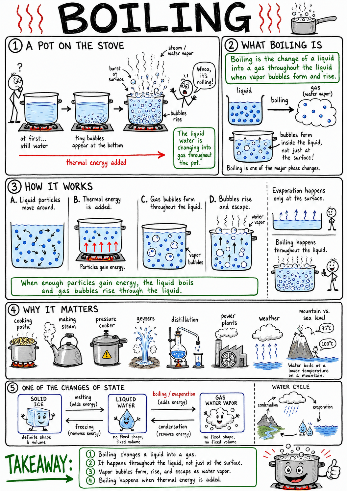
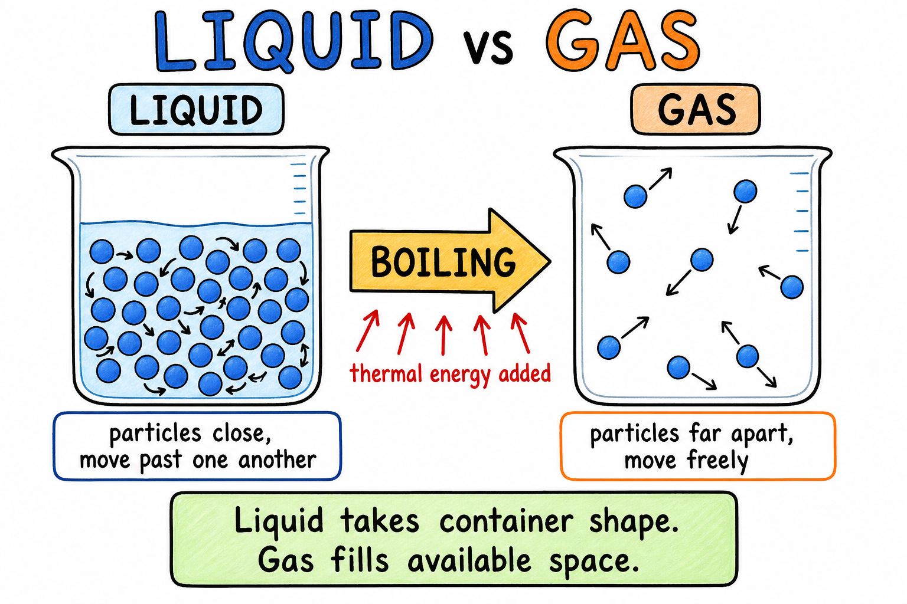
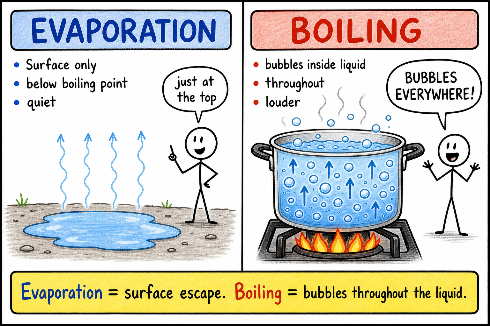
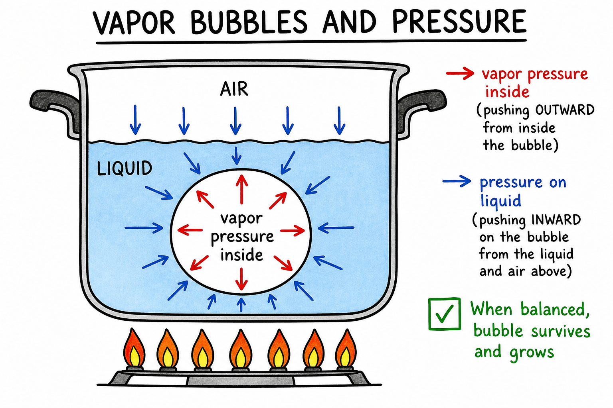
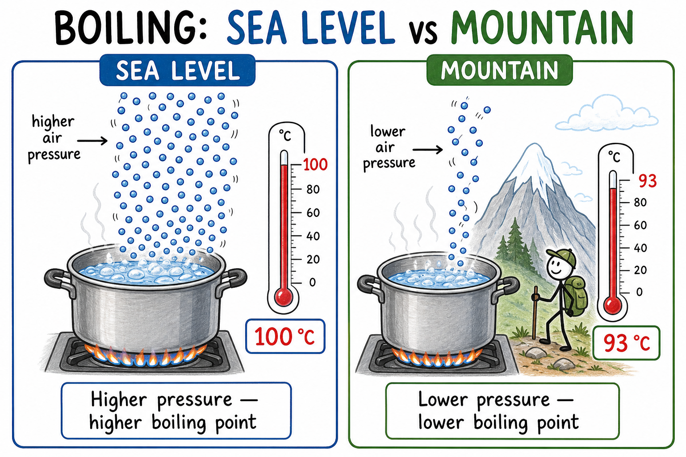
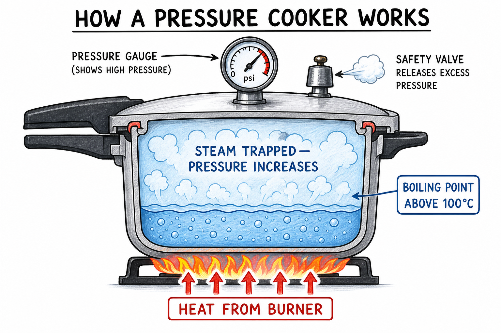
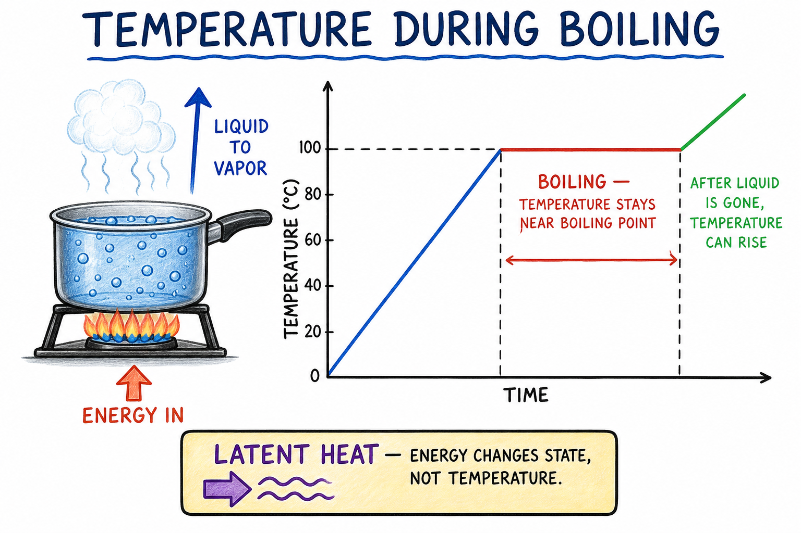
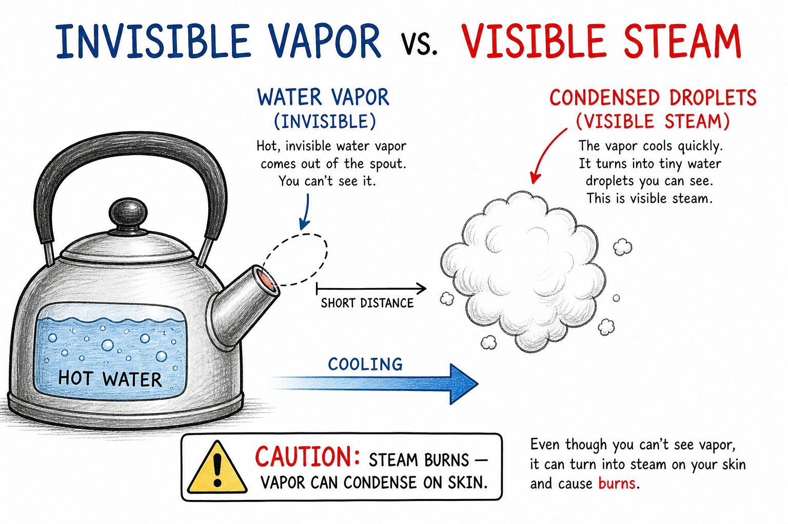

# Boiling

You drop a block of ramen into a pot and crank the stove. At first the water is still. Then tiny bubbles cling to the bottom. Soon the whole pot churns, steam shoots up, and the noodles start to soften. The liquid is turning into gas **throughout** the pot—not just at the top.

That rolling, bubbling change is boiling.

**Boiling is the change of a liquid into a gas throughout the liquid when vapor bubbles form and rise.**

Boiling explains cooking pasta, making steam, pressure cookers, geysers, distillation, power plants, steam engines, weather, and why water boils at a lower temperature on a mountain than at sea level.

Boiling is one of the major phase changes, or changes of state, in matter.

## Liquids and Gases

Matter can exist in different states, including solid, liquid, and gas.

In a liquid, particles are close together but can move around one another. In a gas, particles are much farther apart and move freely.

When a liquid boils, particles throughout the liquid gain enough energy to become gas particles.

The gas forms bubbles inside the liquid. These bubbles rise and escape at the surface.

For water, the gas form is called **water vapor**.

## Boiling and Evaporation

Boiling and evaporation both change liquid into gas, but they are not the same.

**Evaporation** happens at the surface of a liquid and can occur below the boiling point.

**Boiling** happens throughout a liquid when vapor bubbles form inside the liquid.

A puddle after a storm **evaporates**. A pot of water on a hot stove **boils**.

Evaporation can be slow and quiet. Boiling is usually louder and more vigorous, and for water at sea level it happens at about 100 degrees Celsius under ordinary pressure.

Remember the difference:

**Evaporation = surface escape. Boiling = bubbles throughout the liquid.**

## Boiling Point

The **boiling point** is the temperature at which a liquid boils under certain pressure conditions.

For pure water at sea level under ordinary atmospheric pressure, the boiling point is:

**100 degrees Celsius**

or

**212 degrees Fahrenheit**

Different liquids have different boiling points. Rubbing alcohol boils at a lower temperature than water. Cooking oil boils at a much higher temperature, though it may smoke or burn before ordinary cooks ever see it boil.

The boiling point depends on the substance and the pressure around it.

## Vapor Pressure

To understand boiling, it helps to know about **vapor pressure**.

Particles in a liquid can escape into gas. The gas particles above or within the liquid push with pressure. This pressure is called vapor pressure.

As a liquid gets hotter, more particles have enough energy to escape, so vapor pressure increases.

Boiling begins when the vapor pressure inside bubbles can match or overcome the pressure pushing on the liquid.

In simple words:

**A liquid boils when vapor bubbles can survive and grow inside it.**

## Pressure and Boiling

Pressure affects boiling.

At sea level, air pressure is fairly high because there is a lot of air above you. Water boils at about 100 degrees Celsius.

High on a mountain, air pressure is lower because there is less air above you. Water can boil at a lower temperature.

This is why cooking can take longer at high altitudes. The water may be boiling, but it is not as hot as boiling water at sea level.

Lower pressure lowers boiling point. Higher pressure raises boiling point.

## Pressure Cookers

A **pressure cooker** uses higher pressure to raise the boiling point of water.

Inside a pressure cooker, steam is trapped. The pressure increases. Because the pressure is higher, water can become hotter than 100 degrees Celsius before boiling vigorously.

Hotter water and steam cook food faster. Tough stew meat and dried beans are classic examples.

Pressure cookers must be designed with strong walls, seals, and safety valves. If pressure is not controlled, the cooker can be dangerous.

This is a powerful example of the connection between pressure and boiling.

## Boiling Absorbs Energy

Boiling absorbs energy.

When water reaches its boiling point, adding more heat does not immediately make the water much hotter. Instead, much of the added energy is used to change liquid water into water vapor.

This energy is called **latent heat**.

During boiling at steady pressure, the temperature of the liquid often remains nearly constant until much of the liquid has changed into gas.

That is why a pot of boiling water stays near 100 degrees Celsius at sea level, even if the stove is turned higher. A hotter flame makes it boil away faster, but the liquid water does not rise far above its boiling point under ordinary conditions.

This is an important idea:

**During a phase change, energy can change state instead of changing temperature.**

## Bubbles in Boiling Water

The bubbles in boiling water are not air bubbles from nowhere.

At first, small bubbles on the bottom or sides of a pot may be dissolved air leaving the water as it warms.

During true boiling, the bubbles are mostly water vapor.

They form where water near the heated surface gains enough energy. If the bubbles can survive the pressure around them, they grow and rise.

When they reach the surface, they burst and release water vapor into the air.

Watch a pot closely: the quiet early bubbles are not the same as the rolling boil that follows.

## Steam and Water Vapor

Water vapor is invisible.

The white cloud people often call steam is usually made of tiny liquid water droplets that form when hot water vapor cools and condenses in the air.

The invisible vapor near boiling water can be extremely hot. When it touches cooler skin, it can condense and release energy, causing serious burns.

This is why steam burns can be worse than burns from hot water at the same temperature.

The vapor carries energy, and condensation releases more energy onto the skin.

## Boiling and Cooking

Boiling is common in cooking—and you have probably used it without calling it science.

People boil water for pasta, rice, potatoes, eggs, vegetables, soups, and hot drinks. Boiling can cook food, soften materials, dissolve ingredients, and kill many microbes.

A **rolling boil** keeps pasta moving so noodles do not stick together. A **simmer** is gentler—small bubbles rising slowly—useful for soup or sauce.

But boiling is not always the fastest or best cooking method. Some foods become mushy if boiled too long. Some nutrients dissolve into the water. Some flavors change.

At high altitudes, boiling water is cooler, so cooking may take longer. Campers and hikers notice this on mountain trips.

Cooking with boiling water is really cooking with heat transfer and phase change.

## Simmering and Rolling Boils

Not all boiling looks the same.

A **simmer** is gentle heating with small bubbles rising slowly.

A **rolling boil** is vigorous boiling with large bubbles rapidly rising and stirring the liquid.

Recipes may ask for one or the other because foods respond differently. Soup may simmer gently for flavor. Pasta may need a stronger boil to cook evenly and keep moving.

The amount of bubbling tells you about heat input and vapor formation, but the water temperature at ordinary pressure remains near the boiling point.

## Boiling and Purifying Water

Boiling water can kill many disease-causing microbes.

This is why boiling is sometimes recommended when water may be unsafe to drink—on a camping trip, after a storm, or when traveling.

However, boiling does not remove all chemical pollutants, heavy metals, or salt. In some cases, boiling can even concentrate dissolved substances because water evaporates away.

Boiling is useful for biological safety, but it is not a complete purification method for every problem.

Safe water treatment depends on what is contaminating the water.

## Distillation

**Distillation** is a process that uses boiling and condensation to separate substances.

A liquid mixture is heated. The substance with the lower boiling point may vaporize first. The vapor is then cooled and condensed back into liquid in another container.

Distillation can be used to purify water, separate liquids, or collect useful substances.

For example, salt water can be distilled. Water boils and becomes vapor, while most salt remains behind. The water vapor condenses into fresh water.

Distillation works because substances can have different boiling points.

## Boiling in Nature

Boiling can happen in nature.

**Geysers** and hot springs are heated by geothermal energy from inside Earth. Water underground becomes hot. In some cases, pressure builds until water and steam burst upward as a geyser.

Underwater volcanic vents can heat water to very high temperatures. Deep ocean pressure can keep water from boiling even when it is hotter than 100 degrees Celsius.

Again, pressure matters.

Nature uses the same physics as a kitchen pot, but often on a grander scale.

## Boiling and Engines

Boiling has powered machines for centuries.

In a **steam engine**, water is heated until it becomes steam. The expanding steam pushes pistons or turbines, turning heat energy into motion. Historic trains and ships used this idea.

**Power plants** may boil water to make steam that spins turbines and generates electricity.

Engines and power plants must control pressure, temperature, and steam carefully.

Steam can do useful work, but uncontrolled steam pressure can be dangerous.

## Boiling and Cooling Systems

Boiling can be useful, but it can also signal trouble.

If a car engine overheats, coolant may boil. Boiling coolant can create pressure and steam, and the engine may be damaged.

This is why radiator caps and cooling systems are designed to hold pressure and raise the boiling point of coolant. Special coolant mixtures also change boiling and freezing behavior.

Never open a hot radiator cap. Hot pressurized liquid and steam can burst out and cause severe burns.

Boiling in a machine is often a warning.

## Boiling in Everyday Life

Boiling is everywhere once you start looking.

You see its results when:

- A kettle whistles on the stove
- Ramen or pasta cooks in a rolling pot
- Steam fogs a mirror after a shower
- A pressure cooker hisses and speeds up dinner
- Old photos show steam locomotives at a station
- A geyser erupts in a national park
- A distillation setup separates salt from water in science class
- Coolant boils in an overheating engine

Sometimes boiling is helpful. Sometimes it is a hazard—scalding water, steam burns, or boiling over onto a burner.

## Common Misconceptions

One common mistake is thinking boiling and evaporation are the same. Boiling happens throughout the liquid with vapor bubbles. Evaporation happens at the surface and can occur below the boiling point.

Another mistake is thinking the bubbles in boiling water are ordinary air. During true boiling, the bubbles are mostly vapor of the liquid itself.

A third mistake is thinking water always boils at exactly 100 degrees Celsius. That is true for pure water at sea level under ordinary pressure, but pressure changes boiling point.

A fourth mistake is thinking turning the stove higher makes boiling water much hotter. At ordinary pressure, it mainly makes water boil away faster.

Finally, remember that the visible white cloud near steam is usually condensed droplets, while water vapor itself is invisible.

## Safety with Boiling

Boiling involves hot liquids, vapor, pressure, and burns.

Good safety habits include:

- Keep face and hands away from steam.
- Use oven mitts or heat-safe gloves with hot pots.
- Turn pot handles inward so they are not knocked over.
- Do not overfill pots that may boil over.
- Lift lids away from your face so steam escapes safely.
- Never open a hot pressure cooker unless instructions say it is safe.
- Never open a hot car radiator cap.
- Use adult or teacher supervision when boiling liquids.
- Remember that boiling liquids can splash and scald.

Boiling is familiar, but it is one of the more dangerous ordinary kitchen processes.

## The Big Idea

Boiling is the change of a liquid into a gas throughout the liquid when vapor bubbles form and rise.

It happens at a boiling point that depends on the substance and pressure. Boiling absorbs energy as liquid becomes gas, so temperature may remain nearly constant during the phase change. Boiling is useful in cooking, water treatment, distillation, engines, and power plants, but steam and pressure must be handled carefully.

If you remember only one sentence, remember this:

**Boiling happens when a liquid has enough energy for vapor bubbles to form throughout it and escape as gas.**

## Study Questions

1. What is boiling?
2. How are particles arranged differently in liquids and gases?
3. What are the bubbles during true boiling mostly made of?
4. How is boiling different from evaporation?
5. What is the boiling point?
6. What is the boiling point of pure water at sea level under ordinary pressure in Celsius and Fahrenheit?
7. Why do different liquids have different boiling points?
8. What is vapor pressure?
9. What must happen for vapor bubbles to survive and grow inside a liquid?
10. How does lower pressure affect boiling point?
11. Why can cooking take longer at high altitude?
12. How does a pressure cooker raise the boiling point of water?
13. Does boiling absorb or release energy?
14. What is latent heat?
15. Why can boiling water stay near the same temperature while heat is still being added?
16. What is the difference between invisible water vapor and the white cloud often called steam?
17. Why can steam burns be especially dangerous?
18. What is a simmer?
19. What is a rolling boil?
20. Why can boiling help make water safer to drink?
21. Why does boiling not remove every possible water contaminant?
22. What is distillation?
23. How can distillation separate salt from water?
24. Give two examples of boiling in nature.
25. How can boiling water or steam be used in engines or power plants?
26. Give four examples of boiling in everyday life.
27. What are three safety rules related to boiling?
28. In your own words, explain why turning the stove higher does not make ordinary boiling water much hotter.
