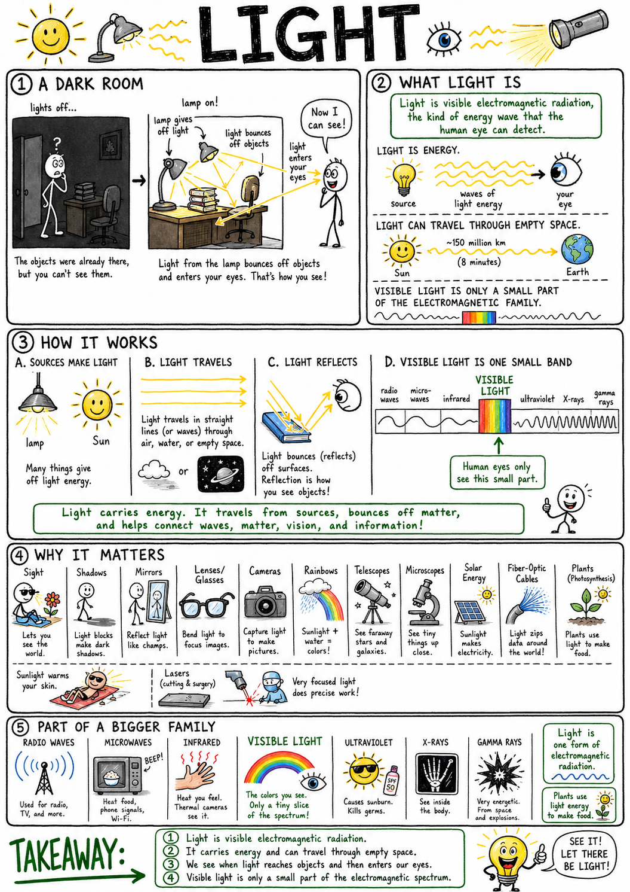
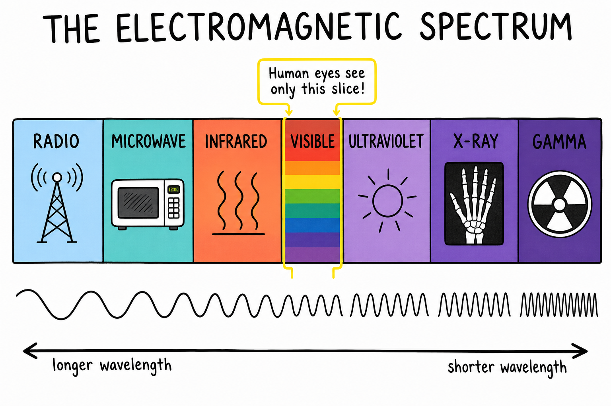
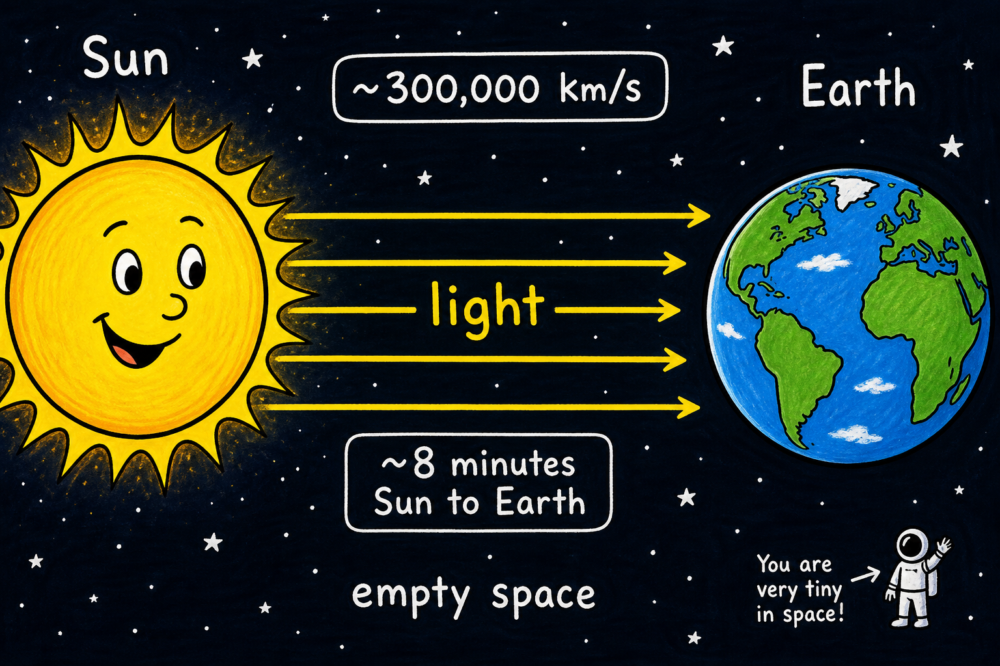
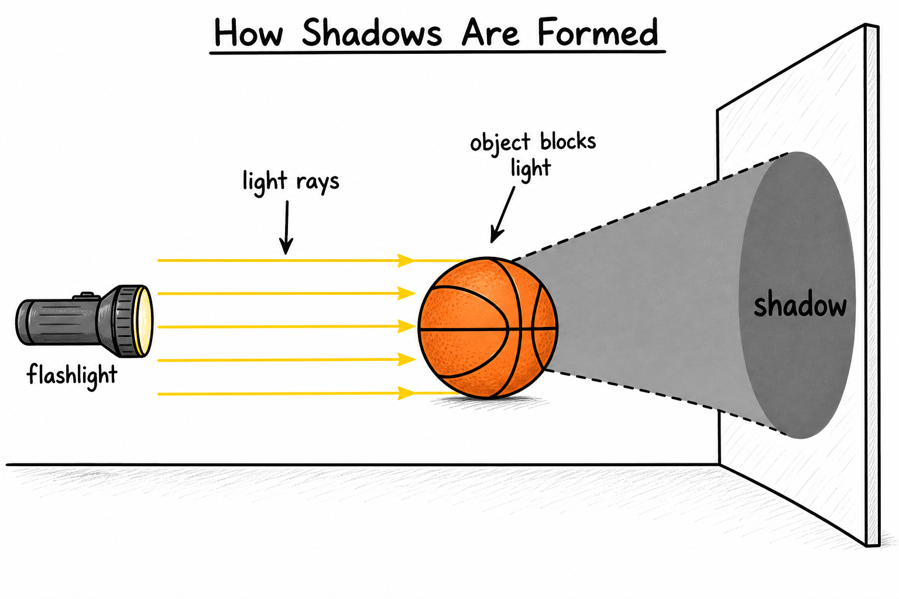
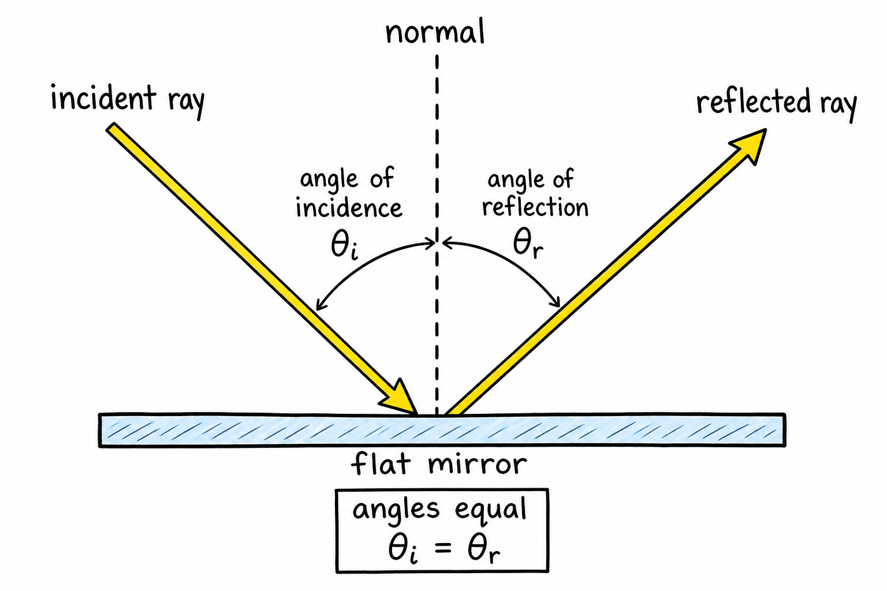
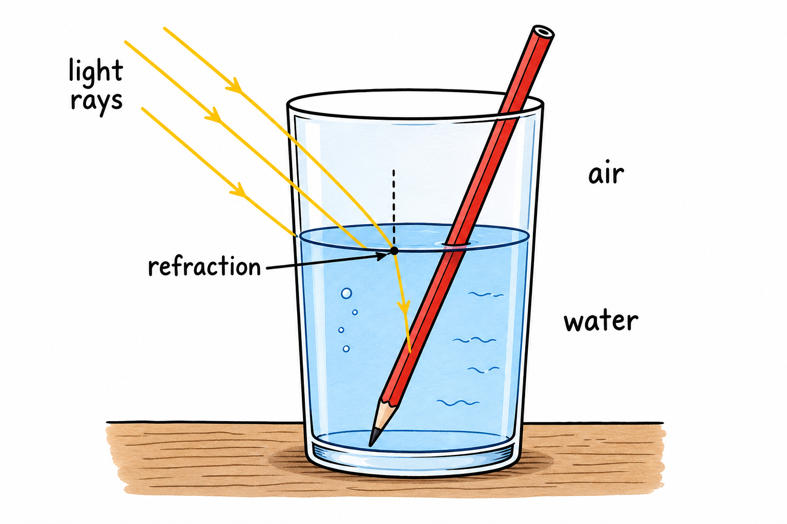
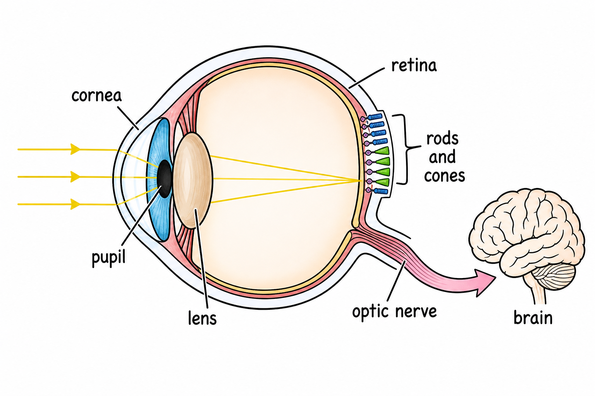
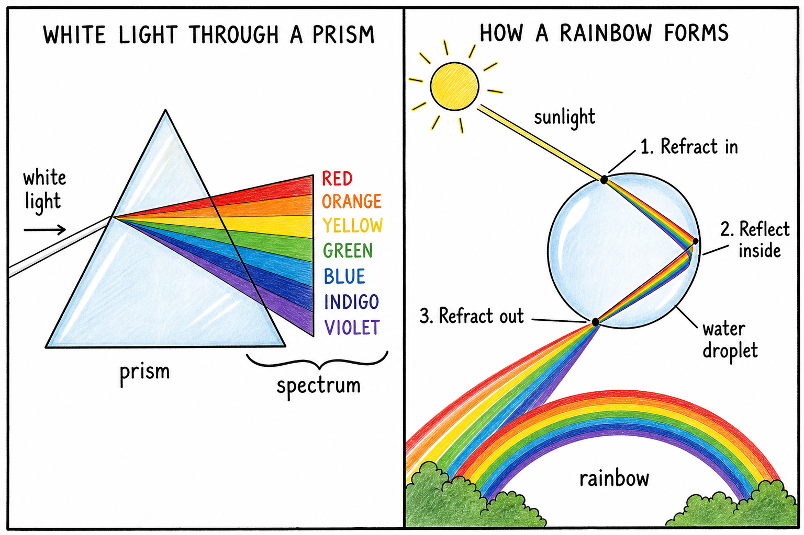

# Image briefs — 039 Light

Use when creating or updating `039_Light_01.png` through `039_Light_08.png`. Each file is referenced in `039_Light.md` at the placement noted below.

Match **033_Radiation** / **032_Convection** style: clear labels, arrows for light direction, simple colors, print-friendly, ages 11–13. Avoid photorealism and cluttered text.

---

## 039_Light_01.png — How we see (opening)

**Placement:** Top of chapter (after title).

**Scene:** Split or comic-style panel: dark room with phone flashlight vs. lamp-on version. Light rays from source → bounce off desk/chair → enter eyes. Optional tiny labels: luminous source, reflection, vision.

**Caption in chapter:** ``

**Note:** Existing infographic covers dark room + overview; update hook to match storm/phone flashlight opening if revising art.

---

## 039_Light_02.png — Electromagnetic spectrum (simplified)

**Placement:** End of “The Electromagnetic Spectrum.”

**Scene:** Horizontal bar from long wavelength (left) to short wavelength (right).

**Bands to label:** radio, microwave, infrared, **visible** (small rainbow strip), ultraviolet, X-ray, gamma.

**Highlight:** bracket on visible band — “human eyes see only this slice.”

**Optional:** tiny link note “same family as radiation” without crowding.

**Caption idea:** The electromagnetic spectrum.

---

## 039_Light_03.png — Sun to Earth in 8 minutes

**Placement:** End of “Light Travels Fast.”

**Scene:** Sun left, Earth right, mostly empty space. Straight or wavy arrows crossing gap.

**Labels:** ~300,000 km/s; ~8 minutes Sun → Earth; empty space.

**Caption idea:** Light from the Sun to Earth.

---

## 039_Light_04.png — Straight rays and shadow

**Placement:** End of “Shadows.”

**Scene:** Point or small flashlight source, object (ball or hand), screen/wall. Straight arrows from source; blocked region labeled **shadow**.

**Labels:** light ray; object blocks light.

**Caption idea:** Light rays and shadows.

---

## 039_Light_05.png — Law of reflection

**Placement:** End of “Reflection.”

**Scene:** Ray hits flat mirror (or smooth surface). Draw normal line (dashed perpendicular). Label angle of incidence and angle of reflection equal.

**Labels:** incident ray; reflected ray; normal; θᵢ = θᵣ (or “angles equal”).

**Caption idea:** Reflection and the law of reflection.

---

## 039_Light_06.png — Refraction at water surface

**Placement:** End of “Refraction.”

**Scene:** Straw or pencil in glass of water; rays bend at air–water boundary. Optional inset: speed changes (air faster label vs water slower label) kept simple.

**Labels:** refraction; air; water.

**Caption idea:** Refraction—light bends at a boundary.

---

## 039_Light_07.png — Human eye (simplified)

**Placement:** End of “The Human Eye.”

**Scene:** Side-view eye cross-section with light entering.

**Labels (minimal):** cornea, pupil, lens, retina, rods & cones, optic nerve → brain.

**Caption idea:** How the eye uses light.

---

## 039_Light_08.png — Prism and rainbow

**Placement:** End of “Rainbows and Prisms.”

**Scene:** Split panel — left: white light → prism → ROYGBIV spread; right: sun + raindrop path (refract in, reflect inside, refract out) with small rainbow arc.

**Labels:** prism; spectrum; water droplet.

**Caption idea:** Prism and rainbow.

---

## Markdown reference (current chapter)

These lines belong in `039_Light.md` when PNGs exist:

```markdown








```

---

## Checklist for illustrators

- [x] _01 — how we see (source → reflect → eye)
- [x] _02 — labeled spectrum bar with visible highlighted
- [x] _03 — Sun → Earth, speed and 8 minutes
- [x] _04 — rays and shadow
- [x] _05 — reflection with equal angles
- [x] _06 — bent straw / refraction at boundary
- [x] _07 — labeled eye diagram
- [x] _08 — prism spectrum + rainbow droplet path
