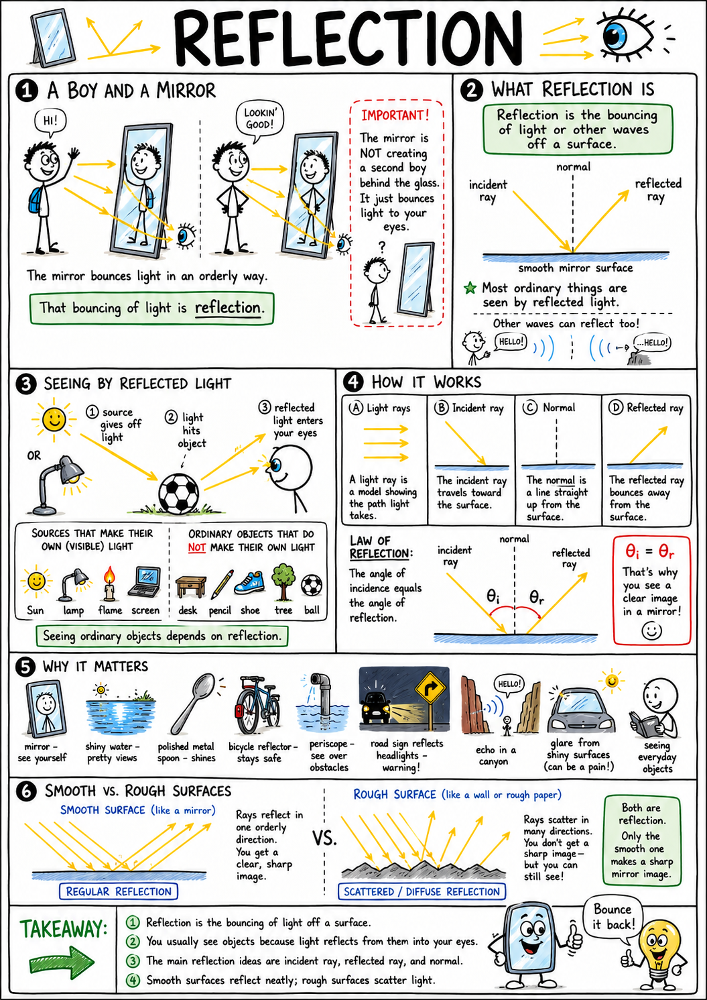
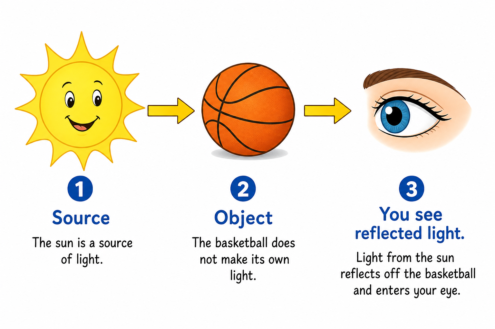
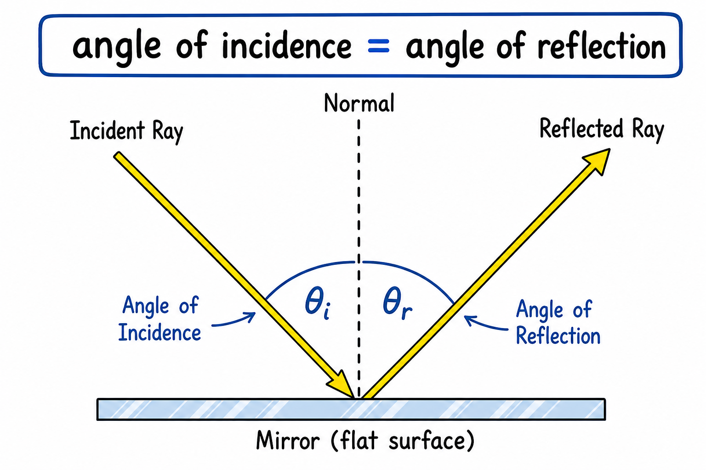
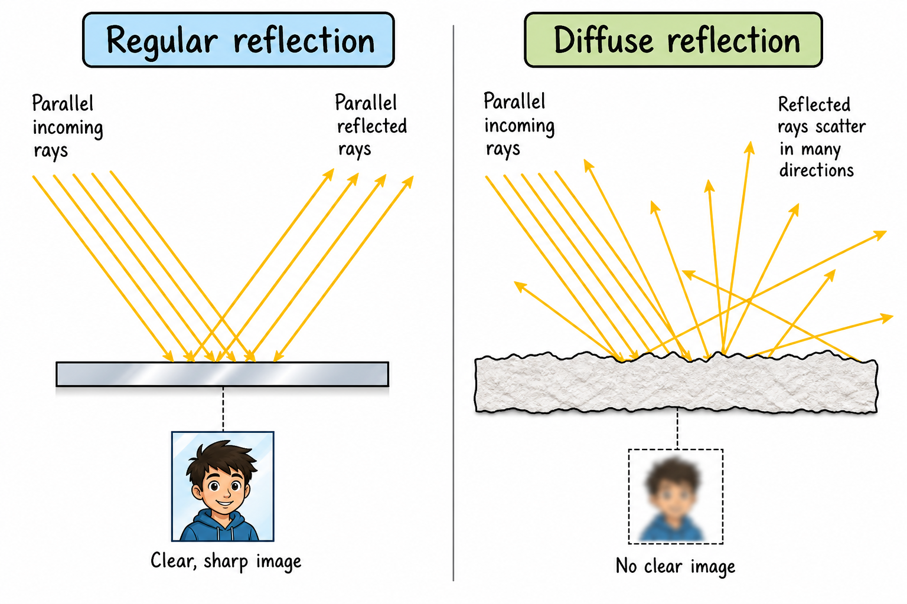
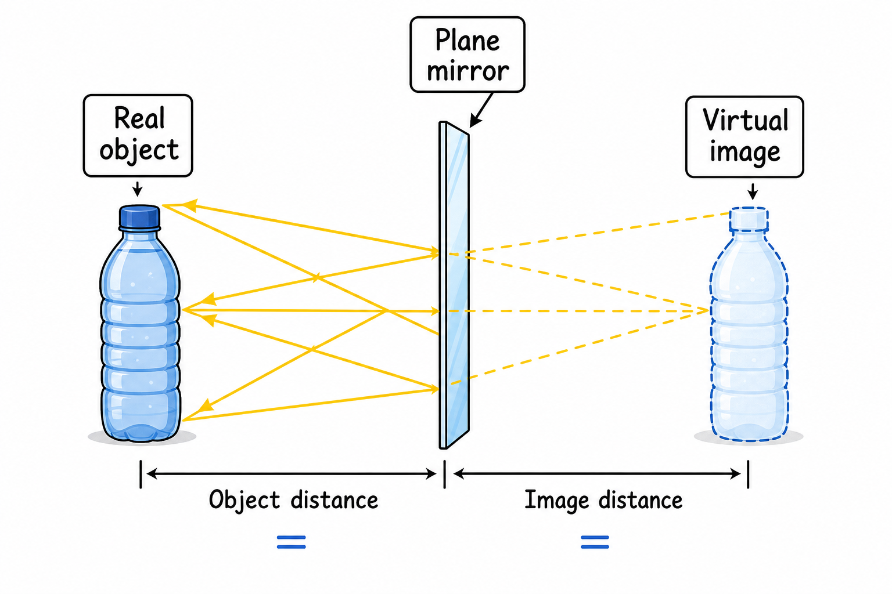
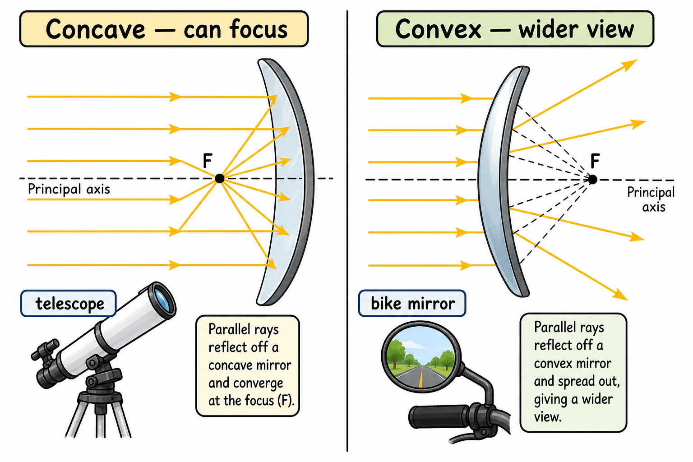
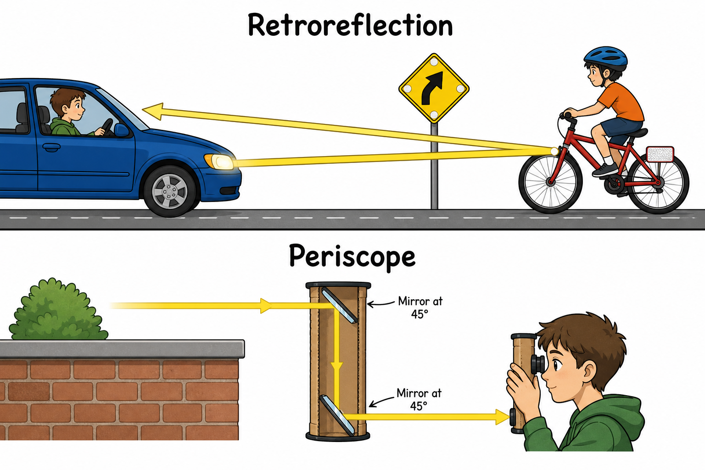
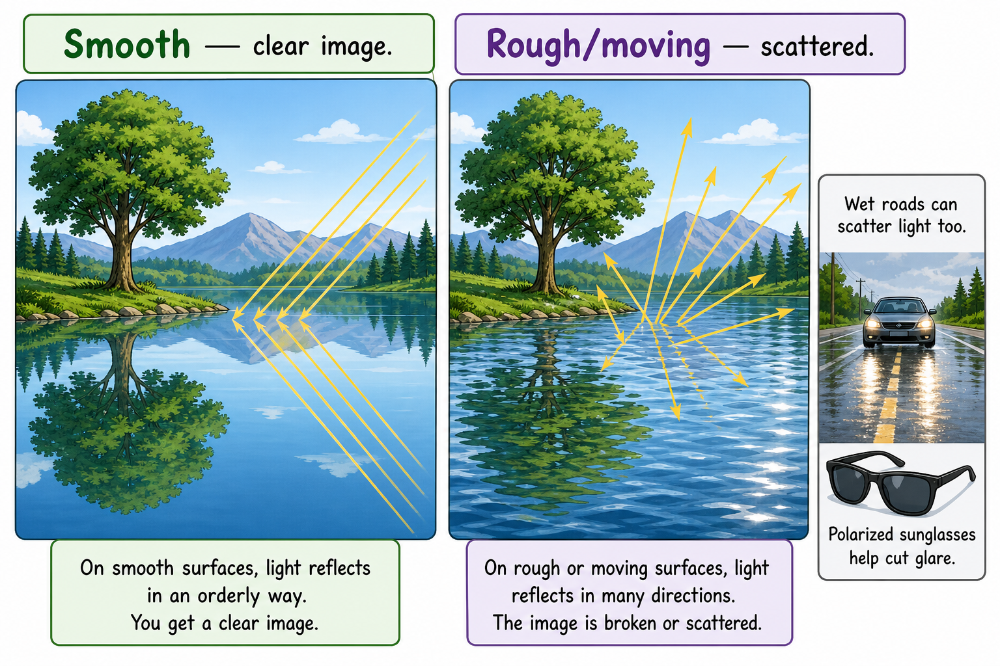

# Reflection

You raise your right hand in the bathroom mirror before school. The image raises its left. You grin—and it grins back. There is no second person trapped behind the glass. The mirror is redirecting light that already exists.

That redirecting is **reflection**.

**Reflection is the bouncing of light or other waves off a surface.**

Reflection explains mirrors, shiny puddles after rain, polished bike chrome, reflectors that flash in headlights, periscopes, telescope mirrors, echoes in a canyon, screen glare, and the plain fact that you can see a backpack, a basketball, or a tree. Without reflection, most objects would be invisible unless they made their own light.

Reflection is one of the central ideas in **optics**, the study of light.

## Seeing by Reflected Light

Most objects do not produce their own light.

The Sun, a lamp, a flame, and a screen can give off light. A desk, cleat, wall, or glove usually cannot. You see those things because light from a source hits them and **reflects** into your eyes.

Sunlight strikes a basketball. Some light bounces off the ball and enters your eyes. Your brain turns that reflected light into shape, color, and position.

Seeing ordinary objects depends on reflection.

Remember:

**If it does not glow on its own, you probably see it by reflected light.**

## Light Rays

Scientists often draw **light rays**—straight arrows showing the path light takes.

The ray traveling **toward** a surface is the **incident ray**.

The ray bouncing **away** is the **reflected ray**.

An imaginary line drawn perpendicular to the surface at the point where the ray hits is the **normal**.

These three ideas—incident ray, reflected ray, and normal—make reflection easy to describe on paper.

## The Law of Reflection

Reflection follows one simple rule:

**The angle of incidence equals the angle of reflection.**

The **angle of incidence** is the angle between the incident ray and the normal.

The **angle of reflection** is the angle between the reflected ray and the normal.

If light hits a flat mirror at 30° from the normal, it leaves at 30° on the other side of the normal.

That rule works for mirrors, still water, polished metal, and many other surfaces.

Angles are always measured from the **normal**, not from the mirror itself.

## A Quick Check

Suppose a ray hits a flat mirror at **40° from the normal**.

By the law of reflection:

**Angle of reflection = angle of incidence**

So the reflected ray leaves at **40° from the normal**.

If the angle of incidence is 15°, the angle of reflection is 15°.

The math is simple. The idea is powerful:

**Light reflects in a predictable way.**

## Regular Reflection

**Regular reflection** happens when light bounces from a **smooth** surface in an orderly pattern.

A mirror is the classic example. Rays that arrive in an orderly pattern leave in an orderly pattern. A clear image can form.

Still water, glossy glass, and polished metal can do the same. That is why you see your face in a bathroom mirror—or trees upside down in a calm pond.

The smoother the surface compared with the wavelength of light, the more orderly the bounce can be.

## Diffuse Reflection

**Diffuse reflection** happens when light bounces from a **rough** surface in many directions.

Most surfaces look smooth to your hand but are rough at a microscopic scale. Paper, cloth, wood, skin, painted walls, and dirt all **scatter** reflected light.

Diffuse reflection usually does not make a sharp mirror image—but it is essential. It lets you see objects from many angles.

If a textbook reflected only like a mirror, you could read it only from one exact spot. Because paper scatters light, rays leave the page in many directions and reach your eyes from a normal reading position.

Diffuse reflection is not "no reflection." It is reflection spread out.

## Mirrors

A **mirror** is a surface that reflects light regularly enough to form an image.

Most household mirrors use glass with a thin metal coating behind it. Light passes through the glass, reflects from the metal, and returns to your eyes.

A good mirror must stay smooth. Scratches, dust, or warping blur or twist the image.

Mirrors do not create light. They redirect light that is already there.

That is why a mirror in a completely dark room shows nothing.

## Plane Mirrors

A **plane mirror** is flat.

The image in a plane mirror appears:

- Upright
- The same size as the object
- As far behind the mirror as the object is in front
- Reversed front-to-back—which we often notice as left-right reversal

The image seems to sit behind the glass because your brain traces the reflected rays backward in straight lines.

Nothing real is behind the mirror. The image is a **virtual image**: light rays appear to come from that spot, but they do not actually pass through it.

## Curved Mirrors

Not every mirror is flat.

A **concave mirror** curves inward, like the inside of a spoon. It can bring reflected rays together—**focus** them. Concave mirrors can magnify nearby objects. They appear in makeup mirrors, some headlights, and reflecting telescopes.

A **convex mirror** curves outward, like the back of a spoon. It spreads reflected rays apart and shows a **wider** view. Convex mirrors show up on some vehicle side mirrors, store security mirrors, and hallway safety mirrors.

Curved mirrors are useful because they control how reflected light spreads or comes together.

## Reflection and Images

An **image** is a visual likeness your eye and brain interpret as coming from an object.

Mirrors form images by steering reflected light.

In a plane mirror, reflected rays seem to come from behind the glass. In a concave mirror, rays may meet to form a **real** image, or spread as if from a larger virtual image—depending on where the object sits.

You do not need advanced optics for the main idea:

**Images form when reflected or bent light reaches your eyes in an organized pattern.**

## Periscopes

A **periscope** uses mirrors to see over or around something in the way.

A simple periscope has two mirrors at angles. Light from the scene reflects off the top mirror, travels down a tube, reflects off the lower mirror, and enters the eye.

Submarines, trenches, and classroom builds all use the same trick: reflection can **redirect** light without changing the information the light carries about the scene.

Mirrors can guide information as well as energy.

## Retroreflection

Some surfaces are built to send light **back toward its source**.

That is **retroreflection**.

Bicycle reflectors, road signs, lane paint, and safety vests often use tiny corner reflectors or glass beads. When car headlights hit them, much of the light returns toward the driver.

That is why a reflector on your bike or backpack can flash bright at night even when little else glows.

Retroreflection is engineered for safety—not ordinary shine.

## Reflection and Color

Color depends heavily on reflection.

White light contains many colors. An object looks a certain color because of which colors it **reflects** and which it **absorbs**.

A green jersey looks green because it reflects much green light and absorbs much of the rest.

A red helmet reflects much red light. Black gear absorbs much visible light and reflects little. White shoes reflect many colors.

The color you see depends on the light source, the object, and your eyes. Change the lighting, and reflected color can change too.

## Reflection and Glare

**Glare** is bright reflected light that makes seeing uncomfortable or hard.

Glare comes from sunlight on snow, water, glass, wet roads, or car windshields. It is often strong **regular** reflection from a smooth surface.

Sunglasses, visors, matte finishes, and smart lighting design can cut glare.

Glare is not only annoying. It can be dangerous when driving, skiing, boating, or working under intense lamps.

## Reflection in Water

Still water can act like a mirror.

On a calm lake, light from trees or clouds reflects in an orderly way and forms a clear image. When wind ripples the surface, tiny tilts scatter rays in changing directions.

That is why choppy water gives a broken, shimmering reflection.

Water teaches the same lesson as mirrors:

**Smooth surfaces → orderly images. Rough or moving surfaces → scattered light.**

## Reflection Beyond Visible Light

Reflection is not only for visible light.

Sound waves reflect as **echoes**. Radio waves reflect from surfaces and the atmosphere. **Radar** uses reflected radio waves to track aircraft, storms, and speed. Infrared reflects from shiny emergency blankets.

The same pattern applies:

**A wave reaches a surface and bounces away.**

Reflection is wave behavior—not just a mirror trick.

## Reflection in Technology

Engineers use reflection everywhere.

Reflecting **telescopes** collect faint starlight with large mirrors. Some cameras use mirrors to steer light to a viewfinder. **Fiber-optic** cables trap light inside glass with internal reflection. Laser scanners, barcode readers, solar cookers, and microscopes all depend on reflection in some form.

Reflection lets people guide light, gather light, and use light to carry information.

## Common Misconceptions

One mistake is thinking reflection happens only in mirrors. Almost everything you see reflects light.

Another mistake is thinking rough surfaces do not reflect. They do—they scatter it.

A third mistake is thinking mirrors magically flip left and right. A plane mirror reverses **front and back**; your viewpoint makes it feel like left-right reversal.

A fourth mistake is thinking the image behind a mirror is a real object. It is a virtual image formed by reflected light.

Finally, remember that echoes and radar show reflection works for many wave types—not only light.

## Safety with Reflection

Reflected light can be intense.

Sunlight bouncing off snow, water, glass, or metal can harm eyes or skin. A laser reflected from a mirror can damage vision. Glare on wet pavement can hide hazards.

Good habits include:

- Never aim lasers at mirrors, eyes, faces, vehicles, or aircraft.
- Wear sunglasses or goggles in bright snow, water, or desert sun.
- Do not look at the Sun directly—or in a mirror.
- Use proper eye protection for welding or other intense light.
- Reduce driving glare: clean windows, use visors when needed.
- Be careful with mirrors in light labs.
- Never bounce bright light into someone else's eyes.
- Follow teacher rules for flashlights, mirrors, and lasers.

Reflection redirects light. That power has to be controlled.

## The Big Idea

Reflection is the bouncing of light or other waves off a surface.

The law of reflection says the angle of incidence equals the angle of reflection. Smooth surfaces give regular reflection and clear images; rough surfaces give diffuse reflection that scatters light. Reflection explains mirrors, color, glare, periscopes, road reflectors, water images, and most of everyday vision.

If you remember only one sentence, remember this:

**Reflection lets us see because light bounces from objects into our eyes.**

## Study Questions

1. What is reflection?
2. Why can you see most objects that do not make their own light?
3. What is a light ray?
4. What is the incident ray?
5. What is the reflected ray?
6. What is the normal?
7. What does the law of reflection say?
8. Angles in the law of reflection are measured from what line?
9. If light hits a mirror at 40° from the normal, what is the angle of reflection?
10. What is regular reflection?
11. What is diffuse reflection?
12. Why does a mirror form a clearer image than a sheet of paper?
13. Why is diffuse reflection useful for reading a book?
14. What is a plane mirror?
15. What is a virtual image?
16. How does a concave mirror differ from a convex mirror?
17. Give two uses of concave mirrors.
18. Give two uses of convex mirrors.
19. How does a periscope use reflection?
20. What is retroreflection?
21. Why do bicycle reflectors and road signs appear bright at night?
22. How is reflection related to color?
23. What is glare?
24. Why does rippled water make broken reflections?
25. Give two examples of reflection involving waves other than visible light.
26. What are three safety rules related to reflection?
27. In your own words, explain why rough surfaces still reflect light even though they do not act like mirrors.
