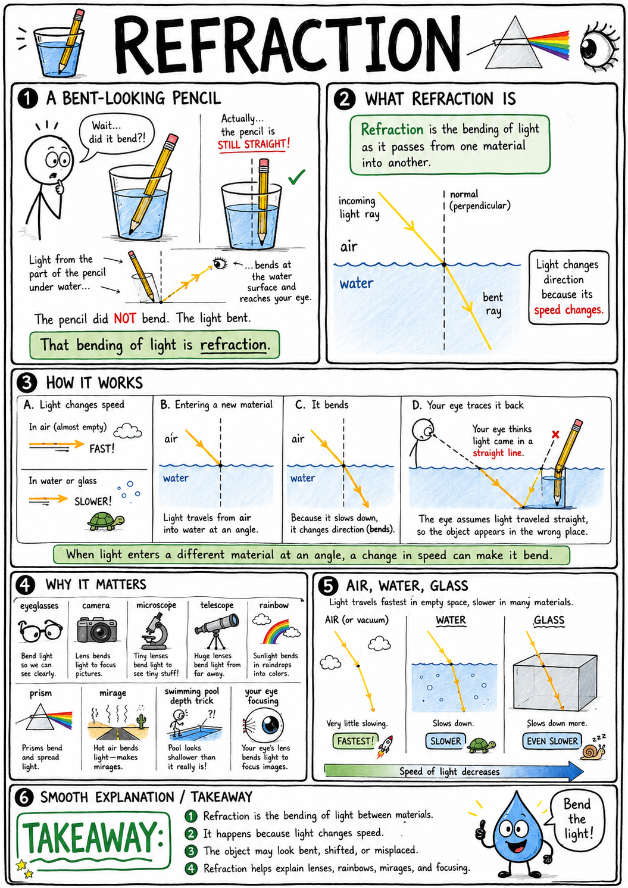
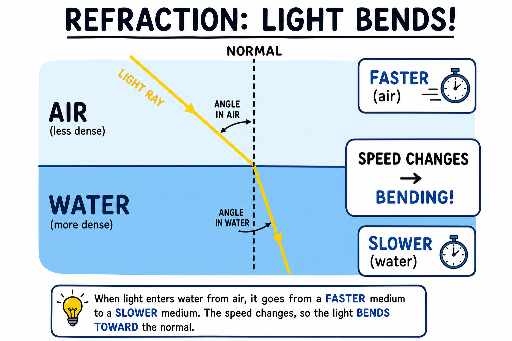
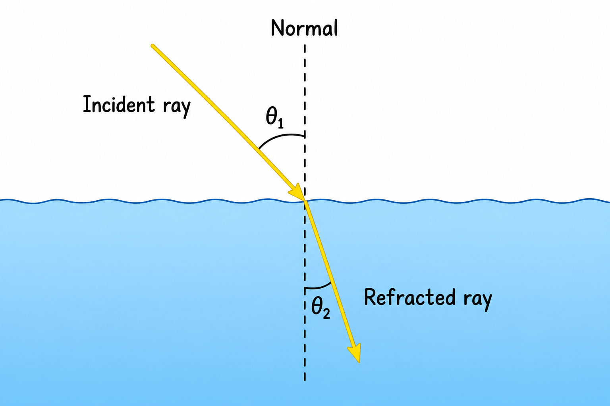
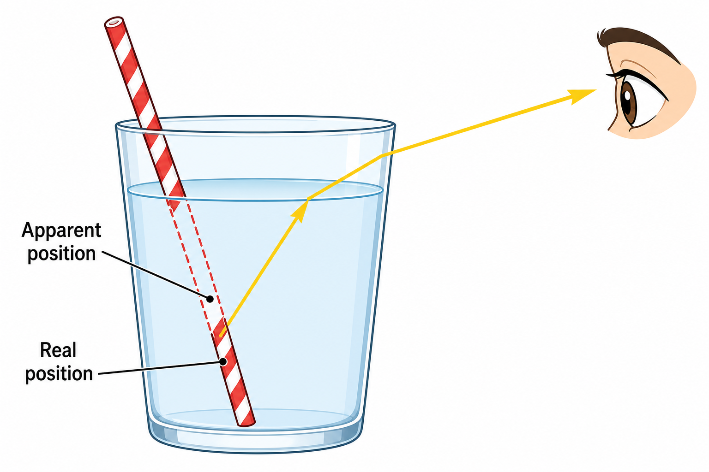
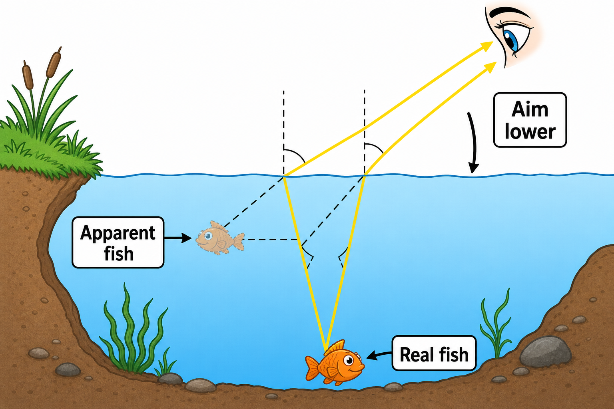
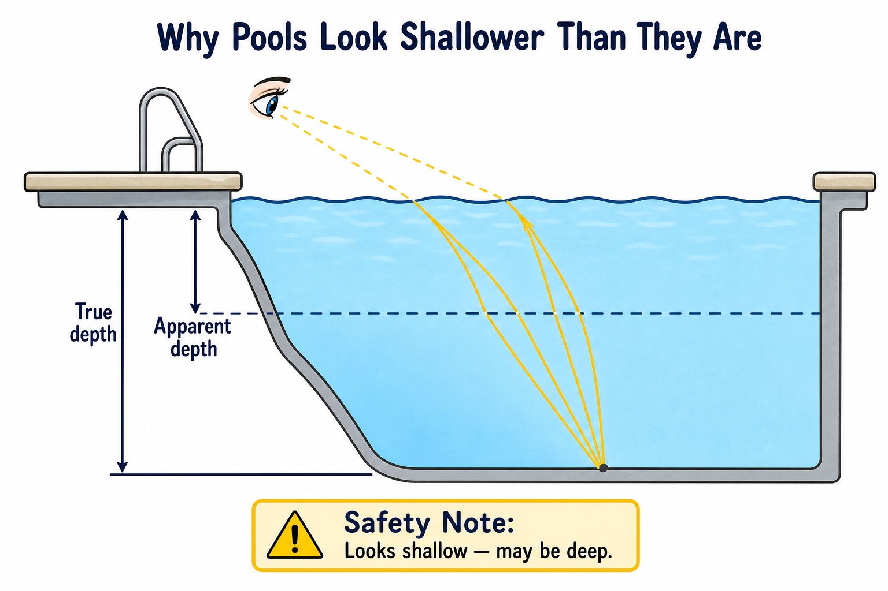
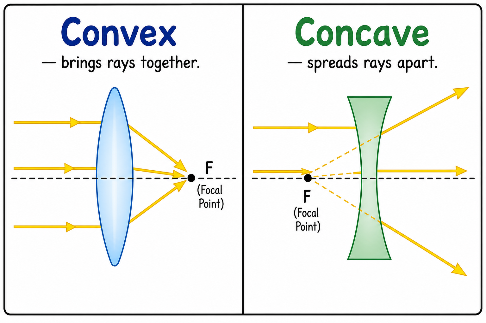
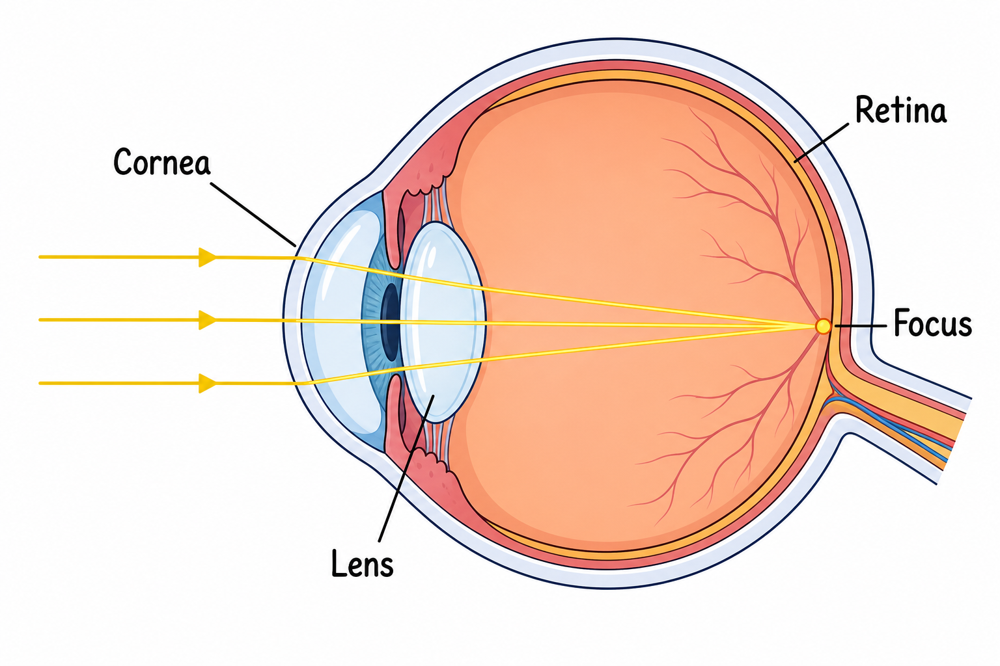
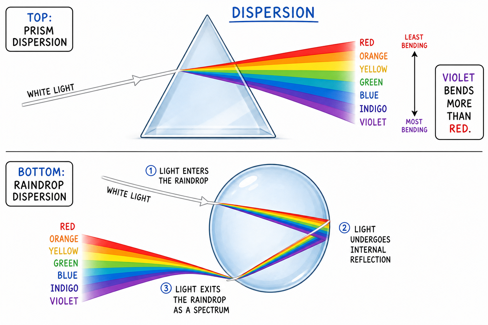

# Image briefs — 041 Refraction

Use when creating or updating `041_Refraction_01.png` through `041_Refraction_09.png`. Each file is referenced in `041_Refraction.md` at the placement noted below.

Match **040_Reflection** / **033_Radiation** style: clear labels, arrows for light rays, simple colors, print-friendly, ages 11–13. Avoid photorealism and cluttered text.

---

## 041_Refraction_01.png — Bent straw in water (opening)

**Placement:** Top of chapter (after title).

**Scene:** Clear glass with water and a straw or pencil; side view shows apparent “break” at the water line. Optional: iced drink, simple table—keep focus on the illusion.

**Labels (optional):** Light bends — refraction.

**Caption in chapter:** ``

**Note:** If the existing art shows only a pencil, either is fine; align with opening hook (straw in lemonade).

---

## 041_Refraction_02.png — Light slows in a denser material

**Placement:** End of “Light Changes Speed.”

**Scene:** Ray enters flat boundary from air (top) into water or glass (bottom) at an angle.

- Show speed change: shorter wavelength spacing or label “slower” in denser medium
- Ray bends toward normal when entering slower medium (air → water)

**Labels:** Faster (air); slower (water/glass); speed changes → bending at an angle.

**Caption idea:** Light slows down entering a denser material.

---

## 041_Refraction_03.png — Normal, incident, and refracted rays

**Placement:** End of “The Normal Line.”

**Scene:** Flat surface (water or glass top surface). Dashed **normal** perpendicular to surface. One **incident** ray in air, one **refracted** ray in material. Angles marked from normal (small arcs), not from surface.

**Labels:** Normal; incident ray; refracted ray.

**Caption idea:** The normal and refracted light.

---

## 041_Refraction_04.png — Bent straw illusion

**Placement:** End of “Bending Toward the Normal.”

**Scene:** Side view of glass with straw. Light rays from underwater part of straw: bend at water→air boundary, then straight to eye. Dashed “apparent” ray backward to shifted position.

**Labels (optional):** Real position vs apparent position.

**Caption idea:** Bent straw in a glass of water.

---

## 041_Refraction_05.png — Fish appears higher

**Placement:** End of “Bending Away from the Normal.”

**Scene:** Pond or aquarium cross-section. Fish at true depth; light rays from fish bend away from normal leaving water; eye/brain traces back to **apparent** fish higher in the water.

**Labels:** Real fish; apparent fish; aim lower (optional, small).

**Caption idea:** Fish appears higher than its real position.

---

## 041_Refraction_06.png — Apparent depth in a pool

**Placement:** End of “Apparent Depth.”

**Scene:** Pool or pond edge view. True bottom depth vs shallower **apparent** bottom line. Rays from bottom bend at surface.

**Labels:** True depth; apparent depth.

**Optional safety tone:** “Looks shallow — may be deep.”

**Caption idea:** Apparent depth in a swimming pool.

---

## 041_Refraction_07.png — Convex and concave lenses

**Placement:** After convex/concave comparison (end of concave section).

**Scene:** Side-by-side lens profiles with three parallel incoming rays each.

| Lens | Ray behavior | Label |
|------|----------------|--------|
| Convex (thick middle) | Rays converge toward focal point | Convex — brings rays together |
| Concave (thin middle) | Rays spread apart | Concave — spreads rays apart |

**Caption idea:** Convex and concave lenses.

---

## 041_Refraction_08.png — Eye refraction

**Placement:** End of “The Eye and Refraction.”

**Scene:** Simplified eye cross-section: cornea, lens, retina. Two or three light rays bent at cornea and lens, meeting on retina. Optional small inset: blurry focus in front of/behind retina with glasses correcting path.

**Labels:** Cornea; lens; retina; focus.

**Caption idea:** Light focusing in the eye.

---

## 041_Refraction_09.png — Prism and rainbow droplet

**Placement:** End of “Prisms” (covers dispersion; rainbow section can refer back).

**Scene:** Split panel or stacked:

| Top | Bottom (optional inset) |
|-----|-------------------------|
| Triangular prism, white ray in, spectrum out (red least bend, violet most) | Single raindrop with enter → internal reflect → exit, color spread |

**Labels:** Dispersion; violet bends more than red.

**Caption idea:** Prism dispersion and rainbow in a droplet.

---

## Markdown reference (current chapter)

These lines are in `041_Refraction.md` when PNGs exist:

```markdown









```

---

## Checklist for illustrators

- [x] _01 — bent straw/pencil in water (opening)
- [x] _02 — ray slowing and bending at boundary
- [x] _03 — normal, incident, refracted rays with angles from normal
- [x] _04 — straw illusion with ray paths to eye
- [x] _05 — fish real vs apparent position
- [x] _06 — apparent depth vs true depth (safety-friendly)
- [x] _07 — convex vs concave ray diagrams
- [x] _08 — eye focusing on retina
- [x] _09 — prism spectrum + optional raindrop rainbow path
