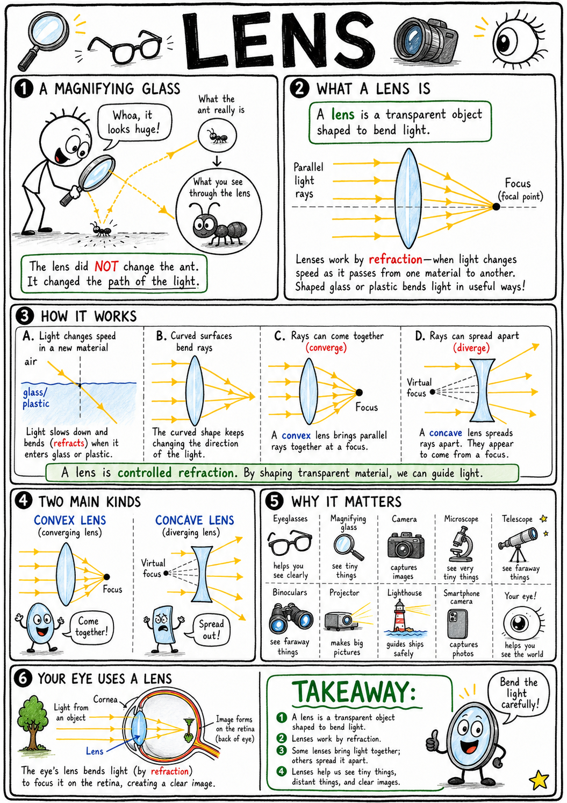
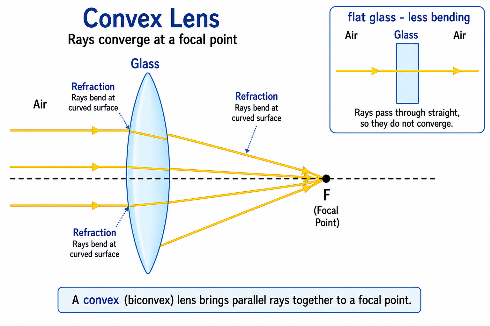
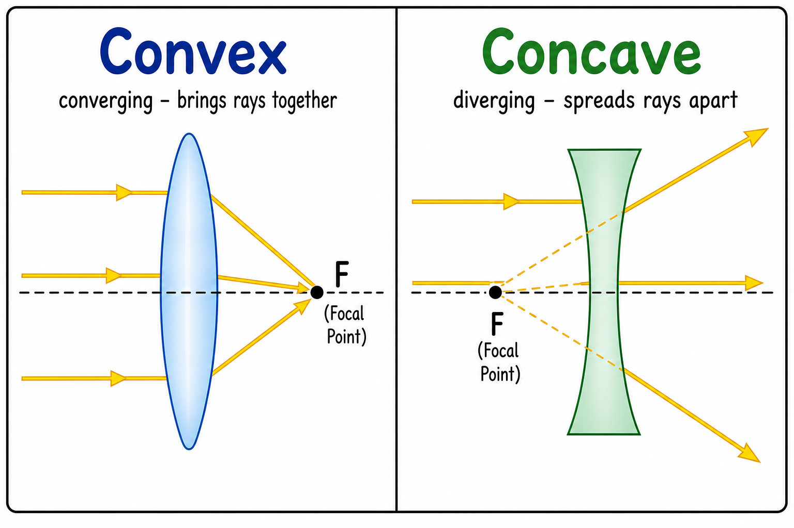
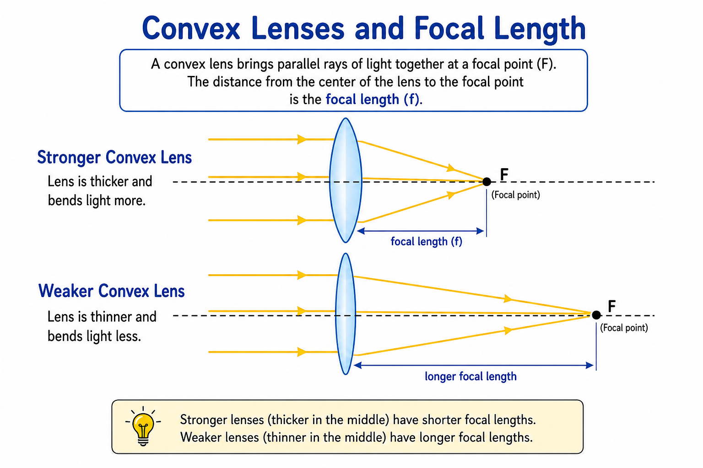
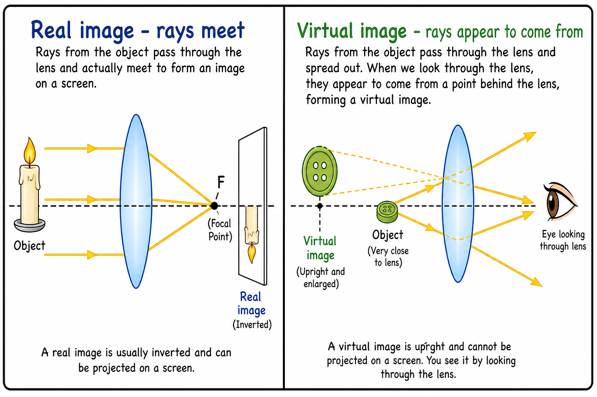
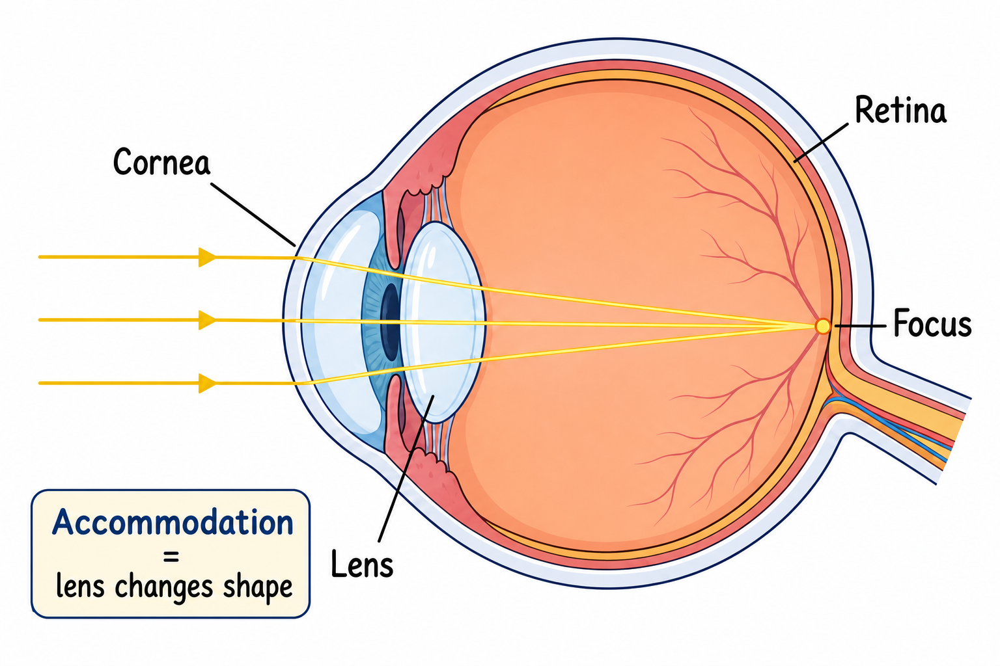
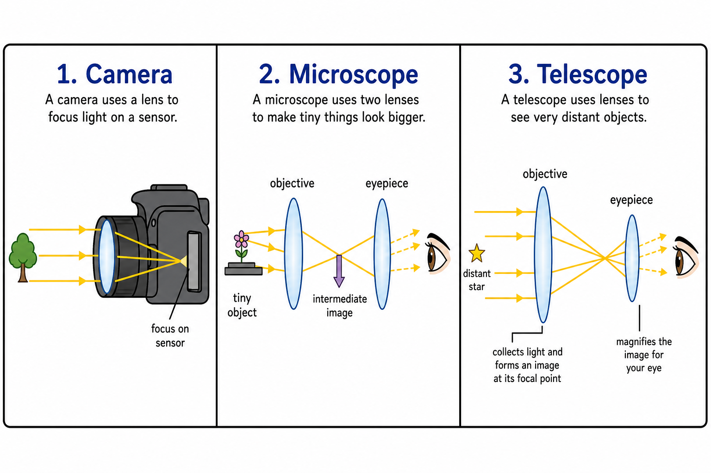
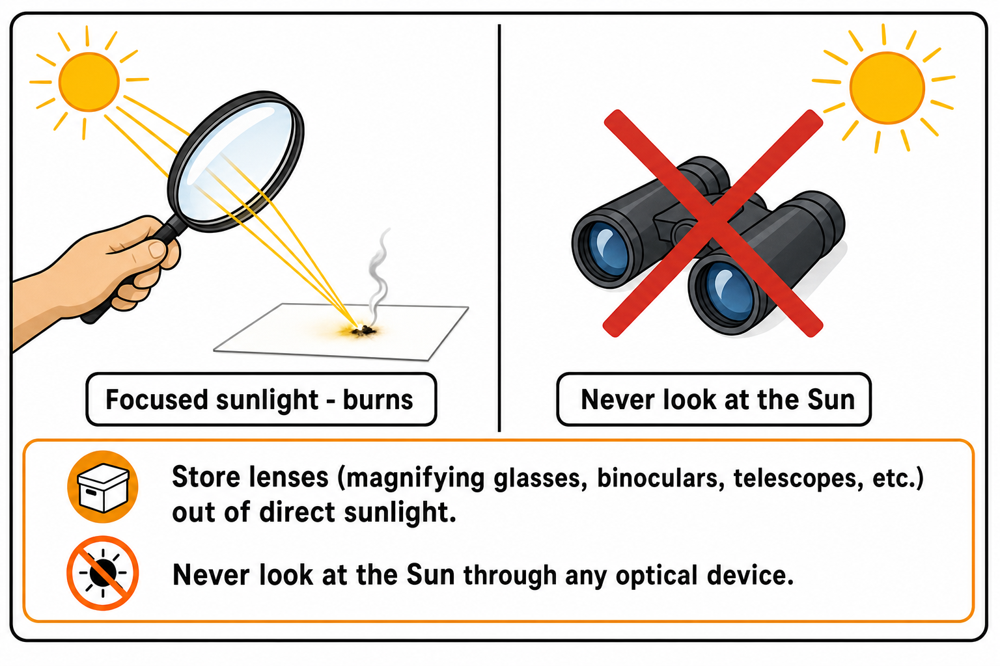

# Image briefs — 042 Lens

Use when creating or updating `042_Lens_01.png` through `042_Lens_08.png`. Each file is referenced in `042_Lens.md` at the placement noted below.

Match **041_Refraction** / **040_Reflection** / **014_Simple_Machines** style: clear labels, arrows for light rays, simple colors, print-friendly, ages 11–13. Avoid photorealism and cluttered text.

`042_Lens_01.png` already exists (opening infographic: magnifying glass, convex/concave, eye, applications).

---

## 042_Lens_01.png — Lens (opening)

**Placement:** Top of chapter (after title).

**Scene:** Comic-style infographic: magnifying glass and ant; definition; convex focusing rays; applications icons; eye diagram. Existing art is acceptable; simplify only if replacing.

**Caption in chapter:** ``

---

## 042_Lens_02.png — Controlled refraction in a lens

**Placement:** End of “Lenses Work by Refraction.”

**Scene:** Side view of a convex lens cross-section. Three parallel rays enter from the left (air), bend at each curved surface (glass), converge toward a focal point on the right.

Optional inset: flat glass slab—ray slows but stays straight (contrast).

**Labels:** Air; glass; refraction; rays bend at curved surfaces.

**Caption idea:** Light bends in a lens.

---

## 042_Lens_03.png — Convex and concave lenses

**Placement:** End of “Concave Lenses” (after convex/concave comparison).

**Scene:** Side-by-side lens profiles with three parallel incoming rays each.

| Lens | Profile | Ray behavior | Label |
|------|---------|--------------|--------|
| Convex | Thick middle | Rays converge to focal point on far side | Convex — converging |
| Concave | Thin middle | Rays diverge; dashed extensions to virtual focus on near side | Concave — diverging |

**Caption idea:** Convex and concave lenses.

---

## 042_Lens_04.png — Focal point and focal length

**Placement:** End of “Focal Point and Focal Length.”

**Scene:** One convex lens, parallel rays converging at **F**. Double-headed arrow from lens center to F labeled **focal length**. Optional second weaker lens with longer focal length (smaller bend) for comparison.

**Labels:** Focal point (F); focal length.

**Caption idea:** Focal point and focal length.

---

## 042_Lens_05.png — Real vs virtual image

**Placement:** End of “Virtual Images.”

**Scene:** Split panel.

| Left — real | Right — virtual |
|-------------|-----------------|
| Convex lens, distant object (window or candle), rays actually cross on screen/paper; image upside down | Magnifying glass, object close to lens, rays diverge after lens; dashed extensions to enlarged upright virtual image; eye viewing |

**Labels:** Real image (rays meet); Virtual image (rays appear to come from).

**Caption idea:** Real image on paper vs virtual image in a magnifying glass.

---

## 042_Lens_06.png — Eye lens system

**Placement:** End of “The Eye as a Lens System.”

**Scene:** Simplified eye cross-section: cornea, pupil, lens, retina. Rays from distant object bent at cornea and lens, focusing on retina. Small note: **accommodation** = lens changes shape.

**Labels:** Cornea; lens; retina; focus.

**Caption idea:** Light focusing in the eye.

---

## 042_Lens_07.png — Camera, microscope, telescope

**Placement:** End of “Cameras, Microscopes, and Telescopes.”

**Scene:** Three small panels in a row:

| Panel | Show |
|-------|------|
| Camera | Lens → sensor; “focus on sensor” |
| Microscope | Object → objective lens → intermediate image → eyepiece → eye |
| Refracting telescope | Large objective lens collects parallel rays from star → eyepiece magnifies |

Keep each diagram simple; shared style with chapter 041 where possible.

**Caption idea:** Camera, microscope, and telescope.

---

## 042_Lens_08.png — Lens light safety

**Placement:** End of “Lenses and Light Safety.”

**Scene:** Magnifying glass focusing sunlight to bright spot on paper (smoke optional, mild). Red X over eye looking through binoculars at Sun. Safe habits callout box: store lenses out of sun; never look at Sun through optics.

**Labels:** Focused sunlight — burns; Never look at the Sun.

**Tone:** Serious but not frightening; ages 11–13.

**Caption idea:** Never focus sunlight on eyes or flammable objects.

---

## Markdown reference (current chapter)

```markdown








```

---

## Checklist for illustrators

- [x] _01 — opening infographic (exists)
- [x] _02 — curved lens refraction / controlled bending
- [x] _03 — convex vs concave ray diagrams
- [x] _04 — focal point and focal length
- [x] _05 — real vs virtual image comparison
- [x] _06 — eye focusing on retina
- [x] _07 — camera, microscope, refracting telescope
- [x] _08 — sunlight focusing hazard / Sun safety
