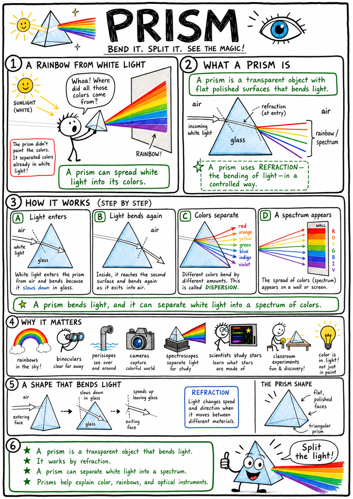
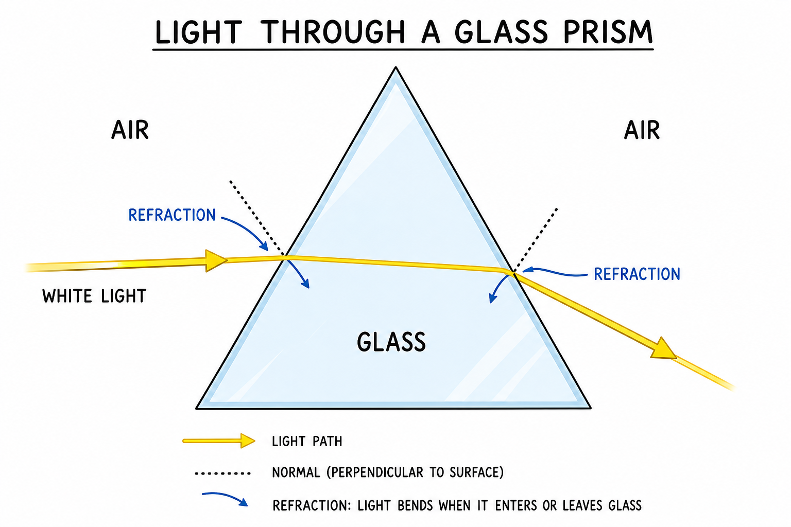
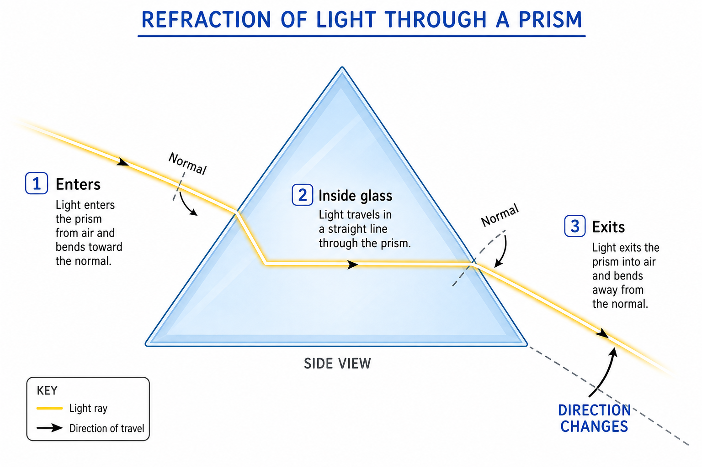
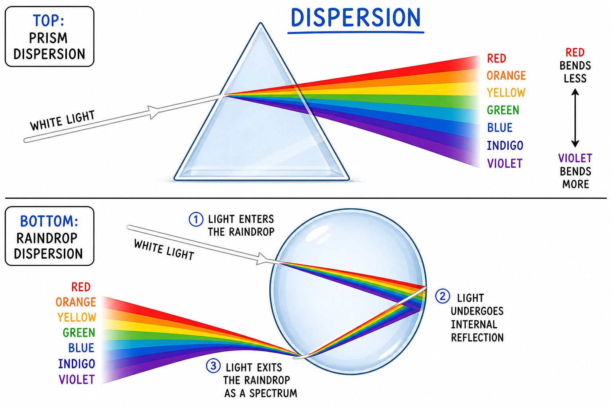
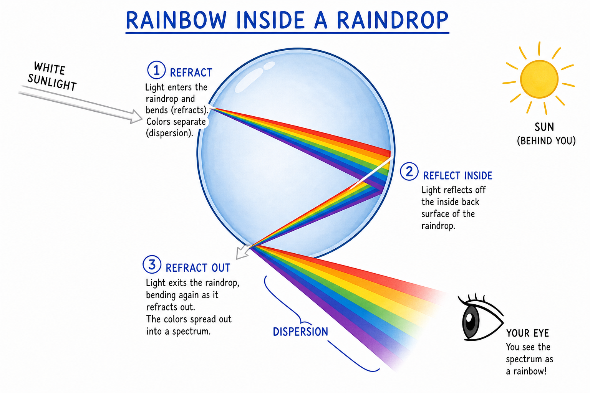
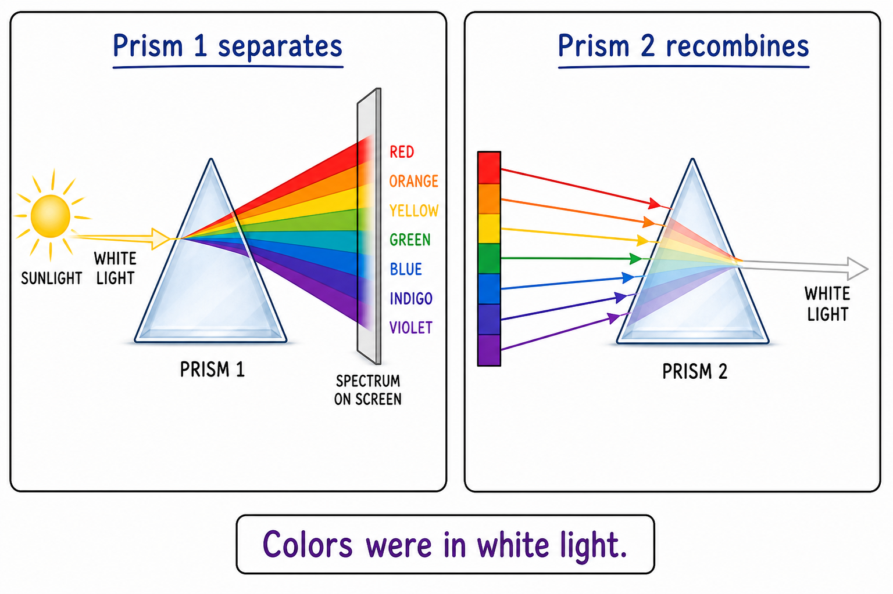
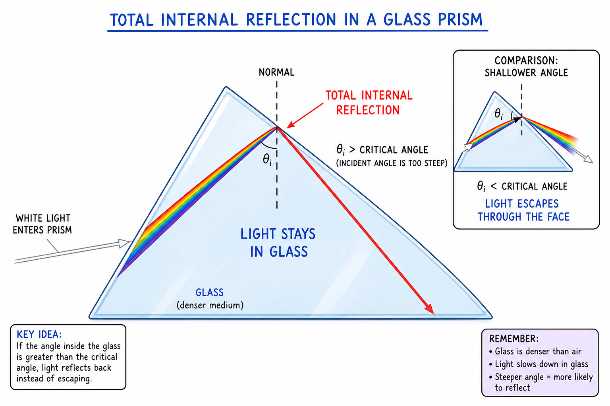
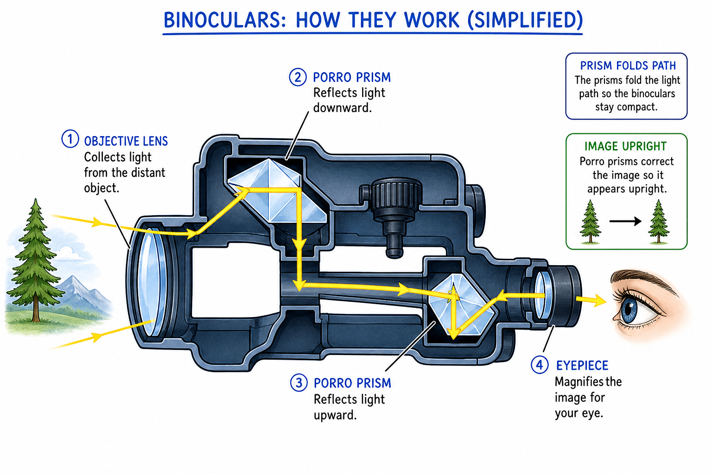
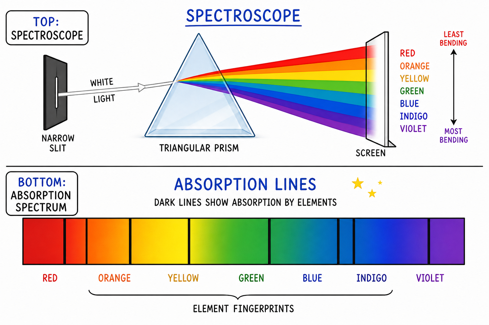

# Prism

You are in a dim room with one bright beam of white light from a lamp or a narrow slit in a window shade. A friend hands you a clear triangular block of glass. You slide it into the beam. Suddenly the white patch on the wall becomes a stripe of red, orange, yellow, green, blue, indigo, and violet—like a tiny rainbow you can hold in your hand.

The glass did not paint those colors. It pulled apart colors that were already mixed inside the white light.

That triangular piece of glass is a **prism**.

**A prism is a transparent object with flat polished surfaces that bends light.**

Prisms explain rainbows, the color of light, **refraction**, binoculars, periscopes, cameras, **spectroscopes**, and how astronomers figure out what distant stars are made of. A prism fits in your palm, but it can reveal secrets hidden inside ordinary white light.

## A Shape That Bends Light

A prism is usually made of glass, plastic, or another transparent material.

Many classroom prisms are **triangular**. They have flat faces and angled sides. The exact shape can vary—some prisms have four or more faces—but the important idea is the same: light enters one polished face and leaves another at an angle.

When light passes from air into glass, it **slows down**. When it leaves glass and returns to air, it **speeds up** again. If the light crosses the boundary at an angle, its path **bends**.

That bending is **refraction**—the same idea you met in the chapter on refraction, when a straw looks broken in a glass of water.

A prism uses refraction on purpose. Its angles are chosen to make bending useful and dramatic.

## Refraction in a Prism

Light bends when it moves from one material into another because its **speed changes**.

When a ray enters a glass prism from air, it slows and bends. Inside the glass it travels in a straight line until it reaches the second face. When it leaves the prism and enters air again, it speeds up and bends a second time.

The two angled faces add up. The beam can leave the prism traveling in a **different direction** than it arrived—sometimes noticeably shifted to one side.

That is why a prism can steer a laser dot or a sunbeam across a room without a mirror.

The same physics explains a bent straw in water. A prism is shaped so the effect is strong, repeatable, and easy to study.

## White Light Is a Mixture

White light may look plain, but it usually contains **many colors**.

Sunlight, for example, includes all the colors of the **visible spectrum**. Mixed together, they look white to your eyes.

A prism can **separate** white light into its colors.

This is one of the great lessons of optics:

**White light is not empty of color. It is full of color.**

The prism shows what your eyes normally blend into one.

If you only shine **red** light into a prism, you get bent red light—not a full rainbow. The other colors were never there to spread out.

**The prism separates; the light supplies the colors.**

## Dispersion

**Dispersion** is the spreading of light into different colors because different **wavelengths** bend by different amounts.

In a typical glass prism:

- **Red** light bends **less**.
- **Violet** light bends **more**.
- Orange, yellow, green, blue, and indigo fall between them.

Because each color bends a slightly different amount, white light spreads into a band called a **spectrum**.

Dispersion is why a prism can paint a rainbow on a wall. It is also why cheap lenses sometimes show colored edges around images—that unwanted color spread is related to the same idea (often called **chromatic aberration** in lenses).

## The Visible Spectrum

The **visible spectrum** is the range of light colors the human eye can see.

A common order is:

- Red
- Orange
- Yellow
- Green
- Blue
- Indigo
- Violet

Many people remember this order with the name **ROY G. BIV**.

The colors blend smoothly. The names are helpful labels, but the spectrum itself is **continuous**—there are no sharp walls between orange and yellow.

Red light has a **longer wavelength** than violet light. Violet has a **shorter wavelength** and is bent more strongly by many prisms.

## Prisms and Rainbows

Raindrops can act like tiny prisms.

When sunlight enters a raindrop, it **refracts**. Some of the light **reflects** inside the drop. Then the light **refracts again** as it leaves. Different colors bend by different amounts, so the sunlight spreads into a spectrum.

That is how a **rainbow** forms.

To see a rainbow, the Sun is usually **behind** you and rain or mist is **in front** of you.

A rainbow is not a solid object hanging in the sky. It is a pattern of light reaching your eyes from **many** water droplets, each sending a bit of color your way.

## Newton and the Prism

In the 1600s, Isaac Newton studied light with prisms.

Some people thought a prism somehow **colored** white light—like adding dye. Newton showed the colors were **already inside** the white light. He passed sunlight through one prism to spread it into colors, then used a **second prism** to recombine those colors back into white light.

That experiment was a turning point.

It helped prove that white light is a **mixture** of colors and that color is a property of **light**, not something the glass invents.

Prisms helped launch modern optics and spectroscopy—the science of reading light to learn about matter.

## Total Internal Reflection

Prisms can do more than spread colors.

They can also **reflect** light inside the glass.

When light inside glass hits the glass–air boundary at a steep enough angle, it may reflect completely back into the glass instead of escaping. This is **total internal reflection**.

Total internal reflection can be very efficient—almost no light is lost compared with a dusty mirror.

Some optical devices use prisms instead of mirrors because prism reflection is bright, stable, and protected inside the glass.

## Prisms in Binoculars and Periscopes

Binoculars often use prisms.

A simple telescope can produce an image that is upside down or reversed. Prisms inside binoculars **flip** the image upright and **fold** the light path so the binoculars can be shorter and easier to carry.

The light travels through lenses and prisms before it reaches your eyes.

Without prisms, many binoculars would be longer tubes—or would show images in awkward orientations.

A **periscope** sends light around a corner. Simple periscopes use mirrors; some instruments use prisms to redirect light by total internal reflection. Submarine periscopes and other devices may combine lenses, mirrors, and prisms to guide images from where light enters to where the eye or sensor needs it.

Prisms are tools for **steering** light through tight spaces.

## Spectroscopes and Absorption Lines

A **spectroscope** is an instrument that spreads light into a spectrum for study.

Some spectroscopes use prisms. Others use **diffraction gratings** (fine ruled surfaces that also separate colors). The goal is the same: spread light by wavelength so you can read it.

Scientists use spectra to learn about materials.

When elements are heated or energized, they can emit light at specific wavelengths—bright **emission lines** that act like fingerprints.

When light passes through a cool gas, certain wavelengths may be **absorbed**. If that light is then spread into a spectrum, **dark absorption lines** appear where colors are missing. Different elements absorb different wavelengths.

By studying light from stars, scientists can learn which elements are present, how hot the stars are, and how they are moving.

Prisms helped open the door to reading the **chemistry of the universe**.

## Prisms and Lenses

Prisms and **lenses** are cousins in the family of refracting tools.

Both bend light by refraction.

A prism has **flat, angled** surfaces. It can shift a beam, spread colors, or redirect light with total internal reflection.

A lens has **curved** surfaces. It can bring light together or spread it apart to form **images**.

Some lenses show unwanted color fringes because different colors refract differently—that is chromatic aberration. Optical designers combine lens shapes and special glasses to reduce it.

If you understand prisms, you are already on the way to understanding lenses and cameras.

## Everyday Prism Effects

You may see prism-like color without a science-lab triangle.

Sunlight through cut glass, a crystal, or a chandelier can throw colored patches on a wall. The edge of a water glass, a raindrop on a window, or a diamond ring can separate light into flashes of color.

Oil films, soap bubbles, and compact discs can show rainbow colors too—but those often involve **interference** or **diffraction**, not ordinary prism dispersion. The colors look similar; the physics behind them can differ.

The world is full of hidden color when light is bent, reflected, or spread.

## Common Misconceptions

One common mistake is thinking a prism **adds** colors to white light. It does not. It **separates** colors already in the light.

Another mistake is thinking every rainbow-like effect is a prism effect. Some involve diffraction, interference, or scattering.

A third mistake is thinking only triangular prisms exist. Triangular prisms are common in classrooms, but prisms can have other shapes.

A fourth mistake is confusing **refraction** (bending as light enters a new material) with **reflection** (bouncing off a surface or boundary). Prisms use both.

Finally, remember that prisms can **redirect** light as well as **disperse** it. Binoculars care about direction; spectroscopes care about color spread.

## Safety with Prisms

Prisms are usually safe, but light and glass require care.

Good safety habits include:

- Do not look at the Sun through a prism.
- Do not use prisms to direct bright sunlight into anyone's eyes.
- Handle glass prisms carefully so they do not chip or break.
- Keep prisms away from table edges.
- Do not focus or redirect strong light onto skin, paper, or flammable materials.
- Use teacher-approved light sources for experiments.
- Wear eye protection if glass or strong light sources are involved.
- Store prisms where they will not scratch other lenses or be scratched themselves.

The purpose of a prism is to **control** light. Controlled light should be used thoughtfully.

## The Big Idea

A prism is a transparent object with flat polished surfaces that bends light.

Prisms work by **refraction** and can separate white light into a visible **spectrum** because different colors bend by different amounts (**dispersion**). They also redirect light in binoculars, periscopes, and scientific instruments. Prisms helped scientists discover that white light contains many colors and that spectra can reveal information about atoms and stars.

If you remember only one sentence, remember this:

**A prism bends light and can reveal the colors hidden inside white light.**

## Study Questions

1. What is a prism?
2. What process lets a prism bend light?
3. Why does light bend when it enters and leaves a prism?
4. What is white light made of?
5. What is dispersion?
6. Which color usually bends less in a glass prism, red or violet?
7. What is a spectrum?
8. What colors are commonly listed in the visible spectrum?
9. What does ROY G. BIV help you remember?
10. How are raindrops like tiny prisms?
11. How does a rainbow form?
12. Why is a rainbow not a solid object in the sky?
13. What did Isaac Newton show with prisms?
14. Why is it wrong to say a prism creates the colors in white light?
15. What is total internal reflection?
16. How can prisms be useful in binoculars?
17. How can prisms help redirect light in optical instruments?
18. What is a spectroscope?
19. How can spectra help scientists identify elements?
20. What are absorption lines?
21. What happens if only red light passes through a prism?
22. How are prisms and lenses alike?
23. How are prisms and lenses different?
24. Give two everyday examples where prism-like color effects may appear.
25. Name one rainbow-like effect that may **not** be ordinary prism dispersion, and say why.
26. What are three safety rules for using prisms?
27. In your own words, explain why a prism can teach us that white light is a mixture.
