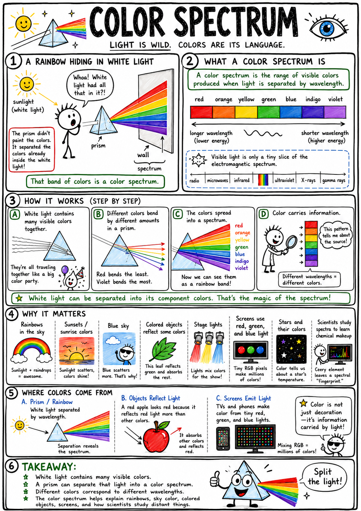

# Color spectrum

Imagine sunlight passing through a prism and spreading across a wall. A beam that looked white becomes a band of red, orange, yellow, green, blue, indigo, and violet. The colors were not painted onto the wall by the glass. They were hidden together inside the white light.

That band of colors is a color spectrum.

**A color spectrum is the range of visible colors produced when light is separated by wavelength.**

The color spectrum helps explain rainbows, prisms, sunsets, the blue sky, colored objects, stage lights, screens, stars, and the way scientists study the chemical makeup of distant objects.

Color is not merely decoration. It is information carried by light.

## Visible Light

Light is electromagnetic radiation that human eyes can detect.

Visible light is only a small part of the larger **electromagnetic spectrum**, which also includes radio waves, microwaves, infrared radiation, ultraviolet radiation, X-rays, and gamma rays.

Human eyes see visible light as color and brightness.

Different colors of visible light have different wavelengths.

The visible spectrum is the range of wavelengths the human eye can see.

## Wavelength

A **wavelength** is the distance from one crest of a wave to the next crest.

For visible light, wavelength is very small. It is usually measured in nanometers.

A **nanometer** is one billionth of a meter.

Red light has a longer wavelength than green, blue, or violet light.

Violet light has a shorter wavelength than red light.

These wavelength differences are one reason light can be separated into colors.

## The Order of the Spectrum

The common order of colors in the visible spectrum is:

- **Red**
- **Orange**
- **Yellow**
- **Green**
- **Blue**
- **Indigo**
- **Violet**

Many students remember this order with the name:

**ROY G. BIV**

The colors do not actually occur as seven separate blocks in nature. They blend smoothly from one to the next.

The names help us talk about the spectrum, but the spectrum itself is continuous.

## White Light

White light is usually a mixture of many colors of visible light.

Sunlight appears white or nearly white to our eyes because it contains many visible wavelengths together.

A white light bulb also emits many wavelengths. When all those colors enter your eye together in the right balance, your brain sees white.

A prism or diffraction grating can spread white light out and reveal the colors inside it.

This is one of the great discoveries of optics:

**White light can contain a whole spectrum of colors.**

## Dispersion

**Dispersion** is the spreading of light into colors because different wavelengths bend by different amounts.

In a glass prism, violet light bends more than red light. The colors separate as they leave the prism, forming a spectrum.

Dispersion also helps produce rainbows.

White sunlight enters raindrops, bends, reflects inside, and bends again as it leaves. The different colors spread out, and a rainbow appears to the observer.

Dispersion reveals the color structure of light.

## Rainbows

A rainbow is a natural color spectrum.

Raindrops act like tiny prisms and mirrors. Sunlight enters each droplet, refracts, reflects, disperses, and leaves separated into colors.

To see a rainbow, the Sun is usually behind you and rain or mist is in front of you.

A rainbow is not a solid arch in the sky. It is a pattern of light reaching your eyes from many droplets.

Each person may see a slightly different rainbow because the light entering each person's eyes comes from different droplets.

## Continuous Spectra

A **continuous spectrum** contains a smooth range of colors with no large gaps.

Sunlight spread by a prism can produce a nearly continuous visible spectrum.

An incandescent bulb, a glowing hot object, or a rainbow can also show a continuous range of colors.

In a continuous spectrum, colors blend into one another.

This kind of spectrum often comes from hot, dense objects or broad light sources that emit many wavelengths.

## Line Spectra

Not all spectra are continuous.

A **line spectrum** shows bright lines of certain colors or dark missing lines at certain wavelengths.

When gases are heated or energized, their atoms can give off light at specific wavelengths. These appear as bright lines.

When light passes through a cooler gas, the gas may absorb certain wavelengths. These missing wavelengths appear as dark lines in a continuous spectrum.

Line spectra are like fingerprints for elements.

Hydrogen, helium, sodium, neon, and other elements have their own patterns.

## Spectroscopes

A **spectroscope** is an instrument that spreads light into a spectrum so it can be studied.

Some spectroscopes use prisms. Others use diffraction gratings, which have many tiny lines that spread light by wave effects.

A simple spectroscope can show that different light sources have different spectra.

Sunlight, fluorescent lamps, LED lights, neon signs, and incandescent bulbs may produce different patterns.

Scientists use spectroscopes to study light from flames, lamps, stars, galaxies, and gases.

## Spectra and Stars

Spectra let scientists study objects too far away to touch.

A star's light can be spread into a spectrum. Bright and dark lines in that spectrum reveal which elements are present in the star's atmosphere.

Spectra can also tell scientists about temperature, motion, and sometimes magnetic fields.

If spectral lines shift toward redder wavelengths, the object may be moving away. If they shift toward bluer wavelengths, it may be moving toward us. This idea is called the Doppler effect, which is studied more deeply later.

The color spectrum helps make astronomy possible.

## Color and Reflection

Objects appear colored because of the light they reflect and absorb.

A red apple looks red because it reflects much red light and absorbs much of the other visible light.

A green leaf reflects much green light and absorbs much red and blue light.

A white object reflects many colors of visible light.

A black object absorbs much visible light and reflects little.

The color you see depends on the light source, the object, and your eye.

## Color and Absorption

**Absorption** happens when matter takes in light energy.

If an object absorbs a certain color, that color is less likely to reach your eye from the object.

This is why a blue shirt may look dark under red light. The shirt reflects blue well, but if the light source supplies little blue light, there is little blue to reflect.

Colored filters work by transmitting some wavelengths and absorbing others.

A red filter lets much red light pass but blocks many other colors.

Color is partly about what is missing as well as what is present.

## Mixing Colored Light

Colored light mixes differently from paint.

The main colors used to mix light are often **red**, **green**, and **blue**. These are called additive primary colors.

Mix red and green light, and your eye may see yellow.

Mix red, green, and blue light in the right amounts, and your eye may see white.

Computer screens, televisions, and phone displays use tiny red, green, and blue light sources to create many colors.

They do not need a separate lamp for every color. They mix light.

## Mixing Pigments

Pigments and paints work by absorbing some colors and reflecting others.

Mixing pigments usually removes more wavelengths from the reflected light. This is why mixing many paints often produces a darker, duller color.

Common subtractive primary colors used in printing are **cyan**, **magenta**, and **yellow**, often with black added.

Paint mixing and light mixing are different because pigments subtract wavelengths while lights add wavelengths.

This is why a computer screen and a paint palette do not mix color in exactly the same way.

## The Eye and Color

Your retina contains cells called rods and cones.

**Rods** are sensitive in dim light but do not detect color well.

**Cones** help you see color and fine detail in brighter light.

Most people have three main kinds of cones, sensitive to different ranges of wavelengths. The brain compares signals from these cones to create color perception.

Color is not only in the light. It is also in the way your eye and brain respond to the light.

This is why color vision can differ from person to person.

## Color Blindness

Some people have color vision differences, often called **color blindness**.

The most common types make it harder to distinguish reds and greens.

Color blindness does not usually mean a person sees only black and white. It often means certain colors are harder to tell apart.

Designers should remember this when making signs, maps, graphs, games, and safety signals.

Good design uses labels, shapes, brightness, and position, not color alone.

## The Sky and Sunsets

The color spectrum also helps explain the sky.

Air molecules scatter shorter blue wavelengths of sunlight more than longer red wavelengths. That scattered blue light reaches your eyes from many directions, making the sky look blue.

At sunrise or sunset, sunlight travels through more atmosphere. Much of the blue light is scattered out of the direct path, leaving more reds, oranges, and yellows to reach your eyes.

The colors of the sky are not painted on. They come from light interacting with air.

## Beyond Visible Colors

The visible spectrum is only the part human eyes can see.

Just beyond red is **infrared radiation**, which we often feel as heat.

Just beyond violet is **ultraviolet radiation**, which can cause sunburn and help some materials glow.

Other animals can see parts of the spectrum humans cannot. Bees can see ultraviolet patterns on some flowers. Some snakes can sense infrared radiation.

Human color vision is impressive, but it is not the whole story of light.

## Common Misconceptions

One common mistake is thinking white light has no color. White light often contains many colors mixed together.

Another mistake is thinking a prism creates the colors. The prism separates colors already present in the light.

Another mistake is thinking the visible spectrum is truly divided into exactly seven colors. The color range is continuous, though seven names are traditional.

A fourth mistake is thinking paint colors mix the same way light colors mix. Light mixing is additive; pigment mixing is subtractive.

Finally, remember that color depends on the light source, the object, and the observer.

## Safety with Color and Spectra

Studying color and spectra is usually safe, but bright light can be dangerous.

Good safety habits include:

- Never look directly at the Sun.
- Do not look at the Sun through prisms, lenses, binoculars, or spectroscopes.
- Use teacher-approved light sources for spectrum experiments.
- Do not aim bright lights or lasers at eyes.
- Use proper eye protection for intense light sources.
- Be careful with glass prisms, bulbs, and spectroscope parts.
- Avoid ultraviolet lamps unless handled by trained adults with proper protection.
- Do not rely on color alone for safety signals if color vision differences may matter.

Light carries energy. Strong light must be respected.

## The Big Idea

The color spectrum is the range of visible colors separated by wavelength.

White light can contain many colors mixed together. Prisms, raindrops, and spectroscopes can spread light into a spectrum. Spectra help explain rainbows, object colors, sky colors, screens, pigments, color vision, and the chemistry of stars.

If you remember only one sentence, remember this:

**The color spectrum reveals that visible light is made of different wavelengths our eyes see as colors.**

## Study Questions

1. What is a color spectrum?
2. What is visible light?
3. What is wavelength?
4. What unit is often used for visible-light wavelengths?
5. Which has a longer wavelength, red light or violet light?
6. What is the common order of colors in the visible spectrum?
7. What does ROY G. BIV help you remember?
8. Why is it not quite correct to say the spectrum has only seven colors?
9. What is white light?
10. How can a prism reveal colors inside white light?
11. What is dispersion?
12. How does a rainbow form?
13. What is a continuous spectrum?
14. What is a line spectrum?
15. Why can line spectra act like fingerprints for elements?
16. What is a spectroscope?
17. How can spectra help scientists study stars?
18. Why does a red apple look red?
19. Why might a blue shirt look dark under red light?
20. What are the additive primary colors of light?
21. How do screens use red, green, and blue light?
22. How is mixing pigments different from mixing colored light?
23. What are rods and cones?
24. What is color blindness?
25. Why does the sky look blue?
26. Why are sunsets often red, orange, or yellow?
27. What are infrared and ultraviolet radiation?
28. What are three safety rules for studying color spectra?
29. In your own words, explain why color depends on the light source, object, and observer.
