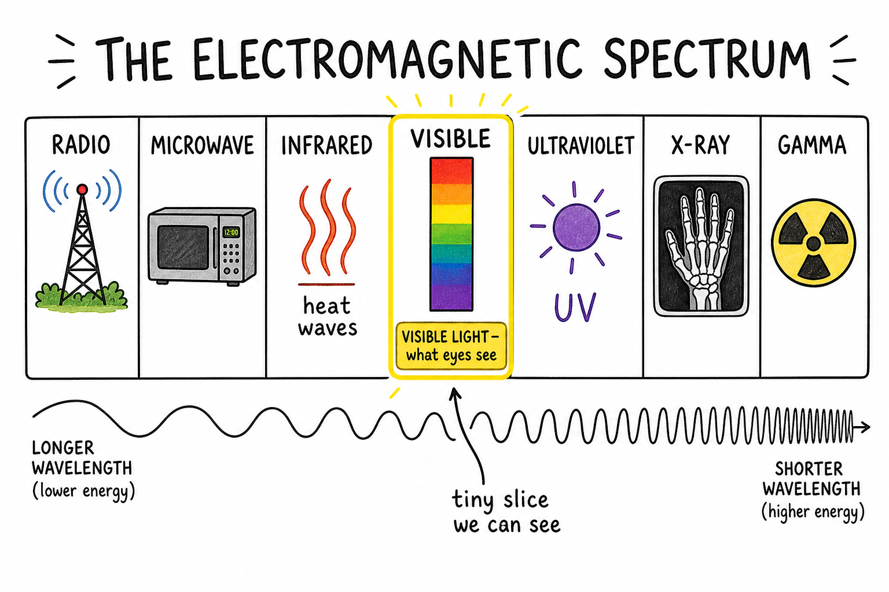
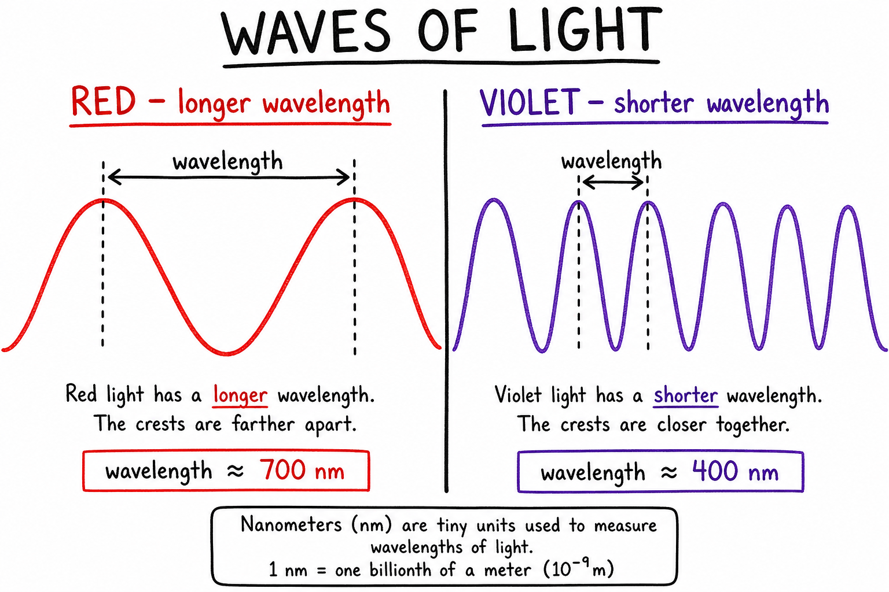
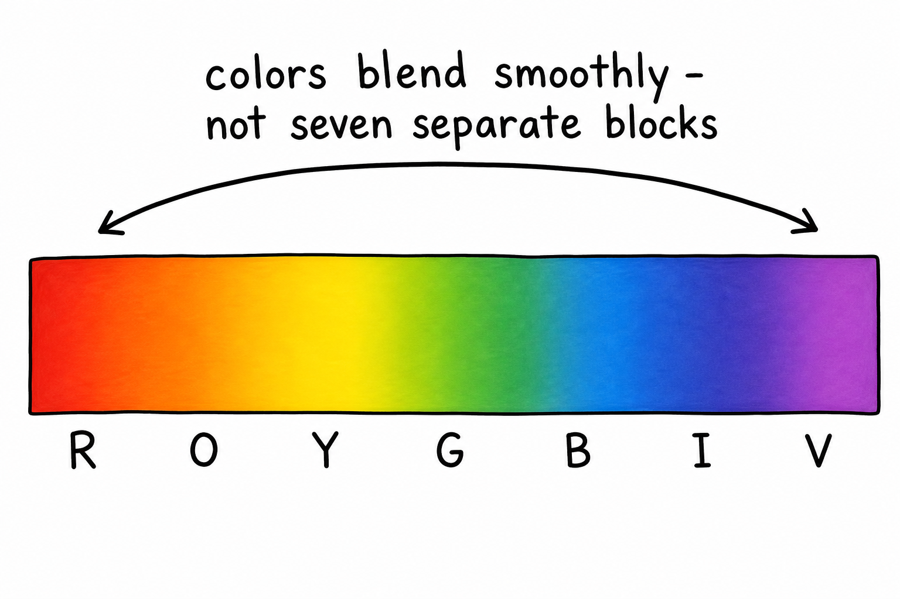
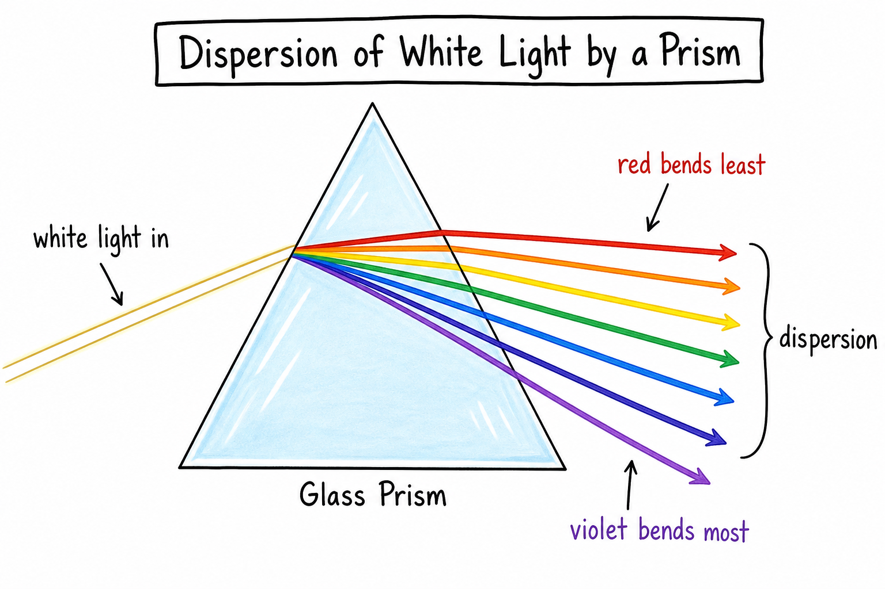
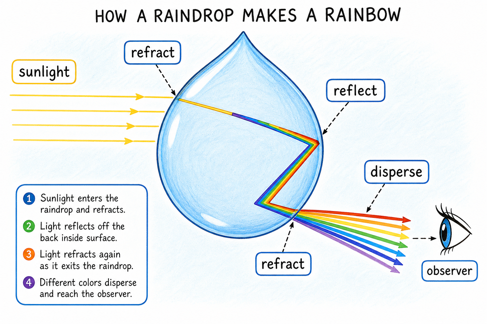
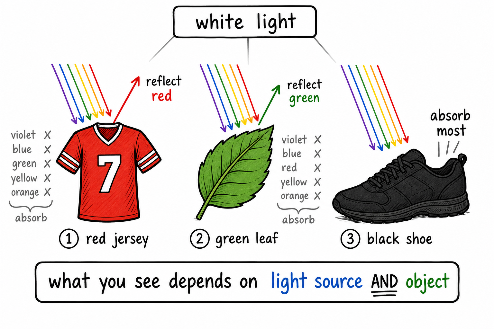
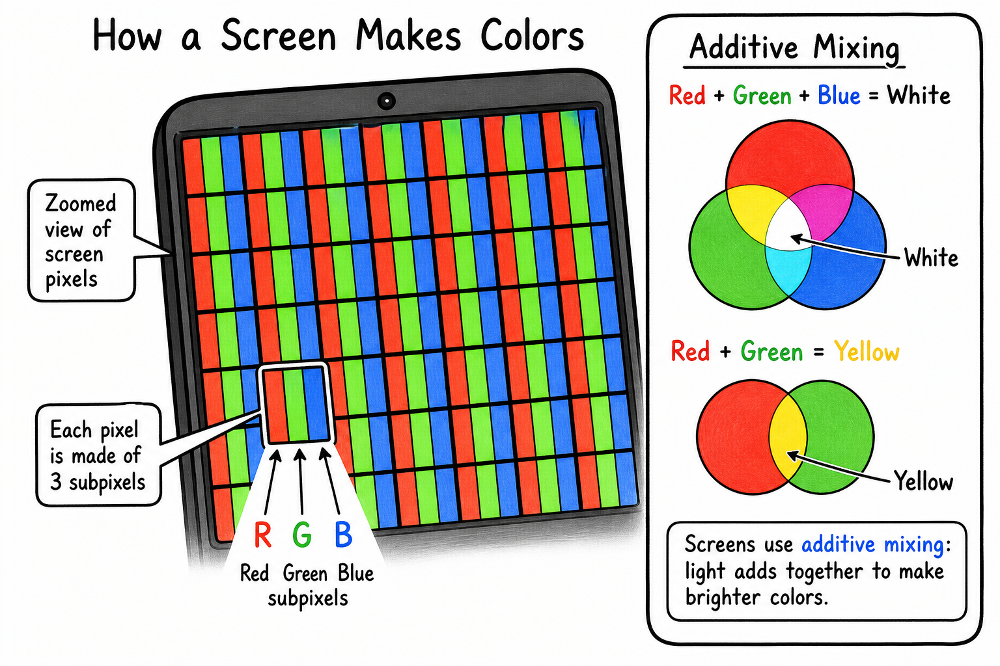

# Color spectrum

You crank up the brightness on your monitor. White text on a dark background looks crisp. Then you zoom in on a photo—or watch a slow-motion replay of a goal—and the screen is not one flat color at all. It is a grid of tiny **red**, **green**, and **blue** lights, blinking in different amounts. Your brain blends them into millions of colors.

Step outside after a storm. The Sun breaks through. A rainbow arches across the sky—red on the outside, violet on the inside. Nobody painted it. Light did the work.

Hold a glass prism to a window on a sunny day (with an adult supervising). A white beam hits the glass and fans out on the wall: red, orange, yellow, green, blue, indigo, violet. The glass did not invent those colors. They were **already inside** the white light, mixed together.

That spread-out band of colors is a **color spectrum**.

**A color spectrum is the range of visible colors produced when light is separated by wavelength.**

The color spectrum explains rainbows, prisms, sunsets, the blue sky, team jerseys, stage lights, phone screens, fireworks, stars, and how scientists figure out what distant objects are made of—without ever touching them.

Color is not just decoration. It is **information** carried by light.

You already know **light** from earlier chapters. You know **refraction** bends light when it enters new materials. You know **reflection** bounces light off surfaces. The color spectrum ties those ideas together: different colors of light can bend, scatter, reflect, and absorb in different ways.

## Visible Light

**Light** is electromagnetic radiation—the same family as radio waves, microwaves, infrared, ultraviolet, X-rays, and gamma rays. You met that family in **radiation**.

**Visible light** is the small slice of the electromagnetic spectrum your eyes can detect.

Human eyes see visible light as color and brightness. Different colors match different **wavelengths**—the distance from one wave crest to the next.

The **visible spectrum** is the range of wavelengths your eye can see.

## Wavelength

A **wavelength** is the distance from one crest of a wave to the next crest.

For visible light, wavelength is tiny. Scientists usually measure it in **nanometers** (nm).

A **nanometer** is one billionth of a meter.

**Red light** has a **longer** wavelength than green, blue, or violet.

**Violet light** has a **shorter** wavelength than red.

Those differences are a big reason white light can split into separate colors.

Remember:

**Longer wavelength → toward red. Shorter wavelength → toward violet.**

## The Order of the Spectrum

The traditional order of colors in the visible spectrum is:

- **Red**
- **Orange**
- **Yellow**
- **Green**
- **Blue**
- **Indigo**
- **Violet**

Many students remember this order with the name:

**ROY G. BIV**

The spectrum in nature is **not** seven separate blocks. Colors **blend smoothly** from one to the next. The seven names are a useful way to talk—not sharp walls in the rainbow.

## White Light

**White light** is usually a **mixture** of many visible colors at once.

Sunlight looks white or nearly white because it contains many wavelengths together.

A white LED or classroom bulb also sends out many wavelengths. When enough of them enter your eye together in the right balance, your brain sees white.

A prism, a diffraction grating, or a raindrop can **spread** that mixture apart and show the colors hiding inside.

That is one of the great discoveries of optics:

**White light can contain a whole spectrum of colors.**

## Dispersion

**Dispersion** is the spreading of light into colors because different wavelengths **bend by different amounts**.

In a glass prism, **violet** bends more than **red**. Colors separate as they leave the prism and form a spectrum.

You saw this idea in **refraction**: light changes speed in glass and bends. Dispersion is refraction **plus** the fact that each color bends a little differently.

Dispersion also helps make **rainbows**.

Sunlight enters a raindrop, bends, reflects inside, bends again as it leaves, and spreads into colors. Each droplet sends a bit of the spectrum toward your eyes.

Dispersion reveals the **structure** of light—not just that light exists, but that it is built from wavelengths.

## Rainbows

A rainbow is a natural color spectrum.

Raindrops act like tiny prisms and mirrors. To see one, the Sun is usually **behind** you and rain or mist is **in front** of you.

A rainbow is not a solid arch you could touch. It is a pattern of light from millions of droplets. Each person may see a slightly different rainbow because the light reaching each pair of eyes comes from different droplets.

The outer edge is often **red**; the inner edge is often **violet**—the same wavelength order as a prism spectrum.

## Continuous Spectra

A **continuous spectrum** contains a smooth range of colors with no large gaps.

Sunlight through a prism, a glowing hot filament, or a rainbow can show a nearly continuous band—colors blending into one another.

This kind of spectrum often comes from hot, dense sources that emit many wavelengths at once.

## Line Spectra

Not every spectrum is smooth.

A **line spectrum** shows bright lines at certain colors—or **dark gaps** where wavelengths are missing.

When gases are heated or energized, atoms can emit light at specific wavelengths. Those appear as bright lines.

When light passes through a cooler gas, the gas may **absorb** certain wavelengths. Dark lines appear in what would otherwise be a continuous spectrum.

Line spectra are like **fingerprints** for elements. Hydrogen, helium, sodium, and neon each have their own patterns. Scientists use them to identify what is in a flame, a lamp, or a star.

## Spectroscopes and Stars

A **spectroscope** is an instrument that spreads light into a spectrum so it can be studied. Some use prisms; others use **diffraction gratings**—surfaces with thousands of tiny lines that spread light by wave effects.

Point a simple spectroscope at sunlight, an LED, a fluorescent tube, or a neon sign. The patterns differ. That is how you know sources are not all the same.

A star is too far away to sample in a lab. But its light can be spread into a spectrum. Bright and dark lines reveal which elements are in the star's atmosphere. Spectra can also hint at temperature and motion.

If spectral lines shift toward **redder** wavelengths, the object may be moving away. If they shift toward **bluer** wavelengths, it may be moving toward us. That idea is the **Doppler effect**—studied more deeply later.

The color spectrum makes **astronomy** possible from Earth.

## Color and Reflection

Most things you see do not glow on their own. You see them because light from a source hits them and **reflects** into your eyes.

A red jersey looks red because it **reflects** much red light and **absorbs** much of the other visible colors.

A green field reflects much green light and absorbs much red and blue.

A white shirt reflects many colors.

A black shoe absorbs much visible light and reflects little.

The color you see depends on three things: the **light source**, the **object**, and your **eye**.

## Color and Absorption

**Absorption** happens when matter takes in light energy.

If an object absorbs a color, less of that color reaches your eye from the object.

That is why a blue shirt can look **almost black** under red stage light. The shirt reflects blue well—but if the light has little blue in it, there is little blue to bounce back.

Colored filters work the same way: they **transmit** some wavelengths and **absorb** others. A red filter passes much red and blocks much else.

Color is partly about what is **missing**, not only what is present.

## Mixing Colored Light (Additive)

Colored **light** mixes differently from **paint**.

The main colors for mixing light are often **red**, **green**, and **blue**—the **additive primary colors**.

Mix red and green light, and your eye may see **yellow**.

Mix red, green, and blue in the right amounts, and your eye may see **white**.

Phone screens, TVs, stadium boards, and gaming monitors use millions of tiny red, green, and blue emitters. They do not need a separate lamp for every color on screen. They **add** light.

## Mixing Pigments (Subtractive)

**Pigments** and paints work by **absorbing** some colors and reflecting others.

Mixing pigments usually removes more wavelengths from the reflected light. Mix many paints together and you often get a darker, duller brown or gray—not white.

Printers often use **cyan**, **magenta**, and **yellow** as subtractive primaries, plus black.

**Additive** mixing (light) adds wavelengths. **Subtractive** mixing (pigment) removes them. That is why a screen and a paint set do not behave the same way.

## The Eye and Color Vision

Your **retina** has **rods** and **cones**.

**Rods** help you see in dim light but do not detect color well.

**Cones** help you see color and fine detail in brighter light.

Most people have three main types of cones, sensitive to different wavelength ranges. Your brain compares their signals to build color perception.

Color is not only "in" the light. It is also in how your **eye and brain** respond.

## Color Blindness and Good Design

Some people have **color vision differences**, often called **color blindness**.

The most common types make it harder to tell **reds** and **greens** apart. It usually does not mean seeing only black and white.

When you design maps, games, graphs, or safety signs, do not rely on **color alone**. Use labels, shapes, brightness, and position too.

## The Sky and Sunsets

The spectrum also explains sky color.

Air molecules **scatter** shorter blue wavelengths of sunlight more than longer red ones. Blue light reaches your eyes from many directions, so the sky looks blue.

At sunrise or sunset, sunlight travels through more atmosphere. Much blue scatters out of the direct path to your eyes. More reds, oranges, and yellows get through—so the horizon glows.

The sky is not painted on. It is light interacting with air.

## Beyond Visible Colors

Visible light is only what human eyes detect.

Just beyond red is **infrared radiation**, often felt as heat.

Just beyond violet is **ultraviolet radiation**, which can cause sunburn and make some materials glow under black lights.

Other animals see differently. Bees can sense ultraviolet patterns on flowers. Some snakes detect infrared from warm prey.

Human color vision is amazing—but it is not the whole story of light.

## Common Misconceptions

One mistake is thinking **white light has no color**. White light often contains many colors mixed together.

Another mistake is thinking a **prism creates** the colors. The prism **separates** colors already in the light.

Another mistake is treating the spectrum as exactly **seven** separate bands. It is **continuous**; seven names are tradition.

A fourth mistake is mixing **paint** the same way you mix **light**. Light mixing is additive; pigment mixing is subtractive.

Finally, color depends on the **source**, the **object**, and the **observer**—change any one and the color you see can change.

## Safety with Color and Spectra

Studying color and spectra is usually safe, but **bright light** can hurt your eyes.

Good safety habits include:

- Never look directly at the Sun.
- Do not look at the Sun through prisms, lenses, binoculars, or spectroscopes.
- Use teacher-approved light sources for spectrum experiments.
- Do not aim bright lights or lasers at anyone's eyes.
- Use proper eye protection for intense light sources.
- Handle glass prisms, bulbs, and spectroscope parts carefully.
- Avoid ultraviolet lamps unless trained adults provide proper protection.
- Do not rely on color alone for safety signals if color vision differences may matter.

Light carries energy. Strong light deserves respect.

## The Big Idea

The color spectrum is the range of visible colors separated by wavelength.

White light can hold many colors at once. Prisms, raindrops, and spectroscopes can spread light into a spectrum. Spectra explain rainbows, object color, sky color, screens, pigments, vision, and the chemistry of distant stars.

If you remember only one sentence, remember this:

**The color spectrum reveals that visible light is made of different wavelengths our eyes see as colors.**

## Study Questions

1. What is a color spectrum?
2. What is visible light?
3. What is wavelength?
4. What unit is often used for visible-light wavelengths?
5. Which has a longer wavelength, red light or violet light?
6. What is the common order of colors in the visible spectrum?
7. What does ROY G. BIV help you remember?
8. Why is it not quite correct to say the spectrum has only seven colors?
9. What is white light?
10. How can a prism reveal colors inside white light?
11. What is dispersion?
12. How does a rainbow form?
13. What is a continuous spectrum?
14. What is a line spectrum?
15. Why can line spectra act like fingerprints for elements?
16. What is a spectroscope?
17. How can spectra help scientists study stars?
18. Why does a red jersey look red?
19. Why might a blue shirt look dark under red light?
20. What are the additive primary colors of light?
21. How do screens use red, green, and blue light?
22. How is mixing pigments different from mixing colored light?
23. What are rods and cones?
24. What is color blindness?
25. Why does the sky look blue?
26. Why are sunsets often red, orange, or yellow?
27. What are infrared and ultraviolet radiation?
28. What are three safety rules for studying color spectra?
29. In your own words, explain why color depends on the light source, object, and observer.
