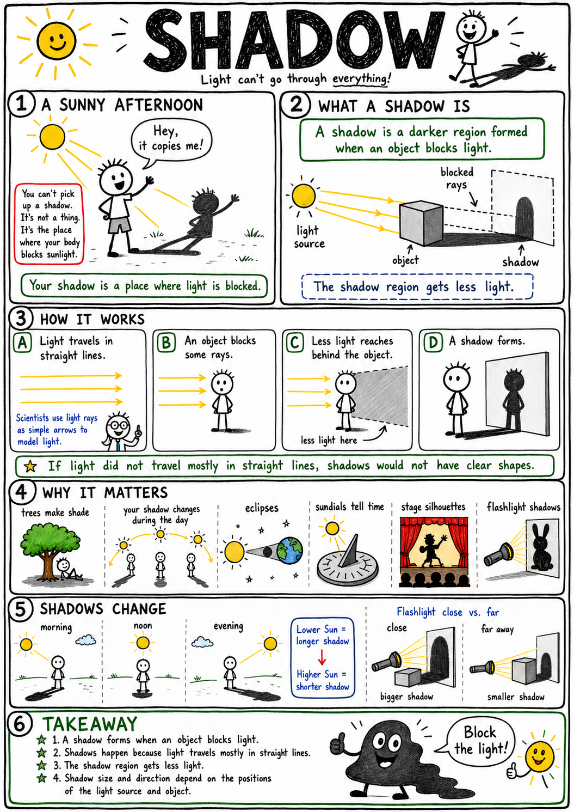
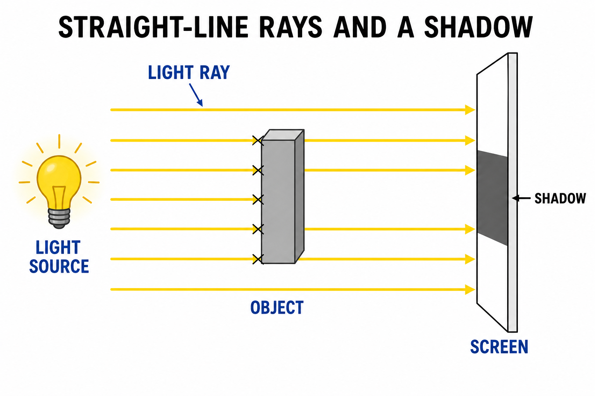
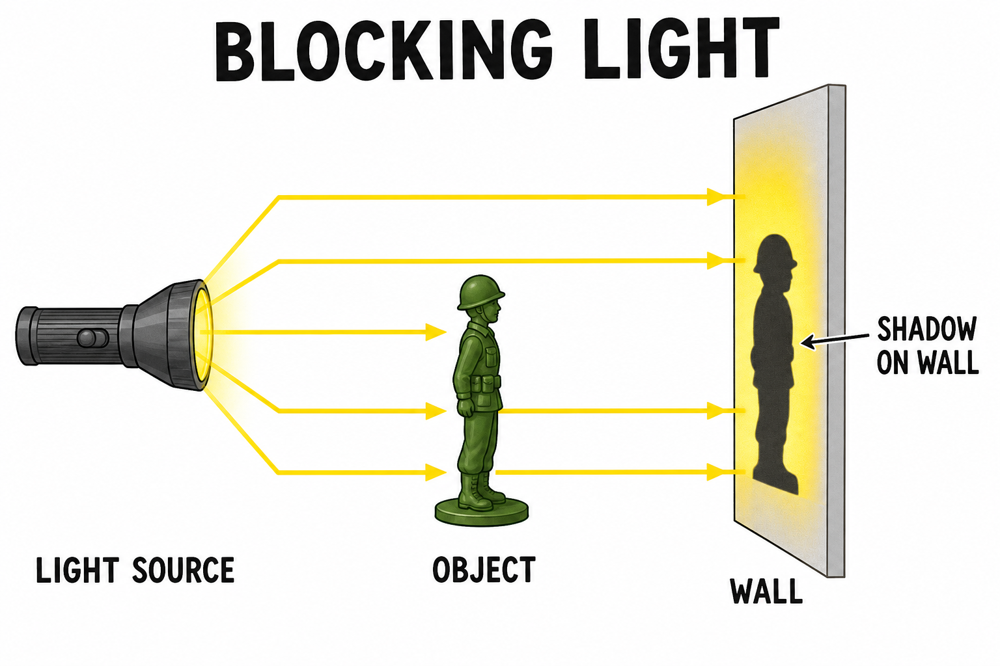
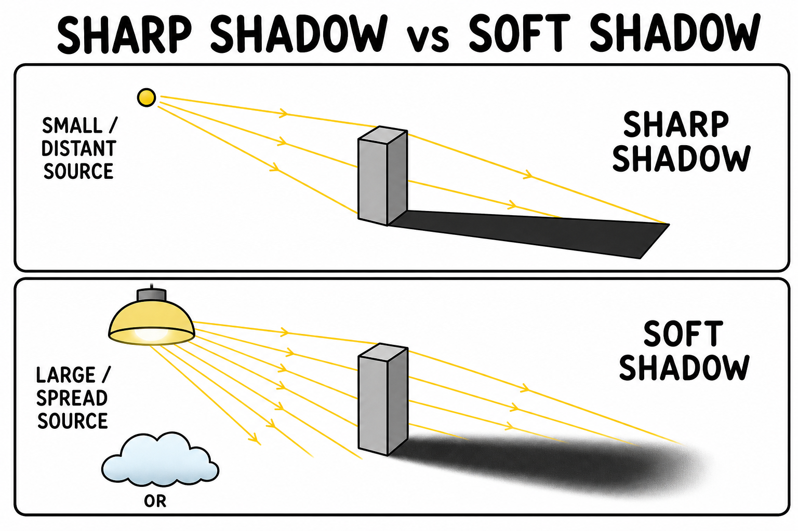
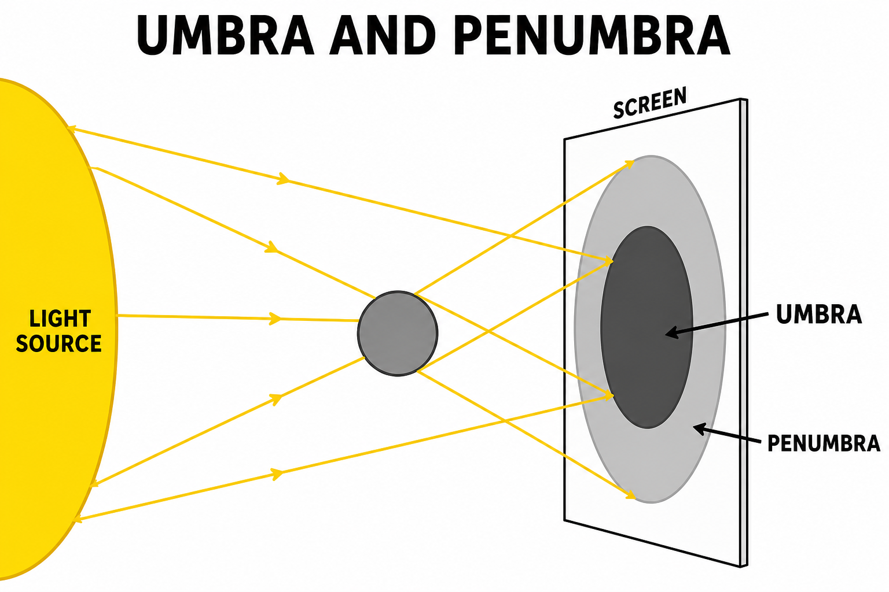
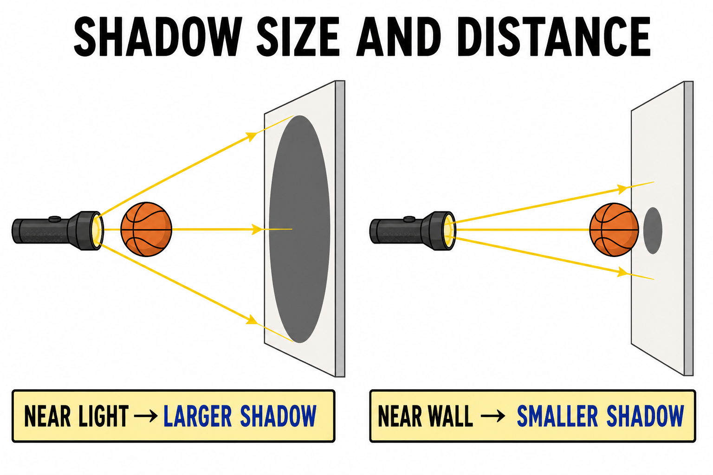
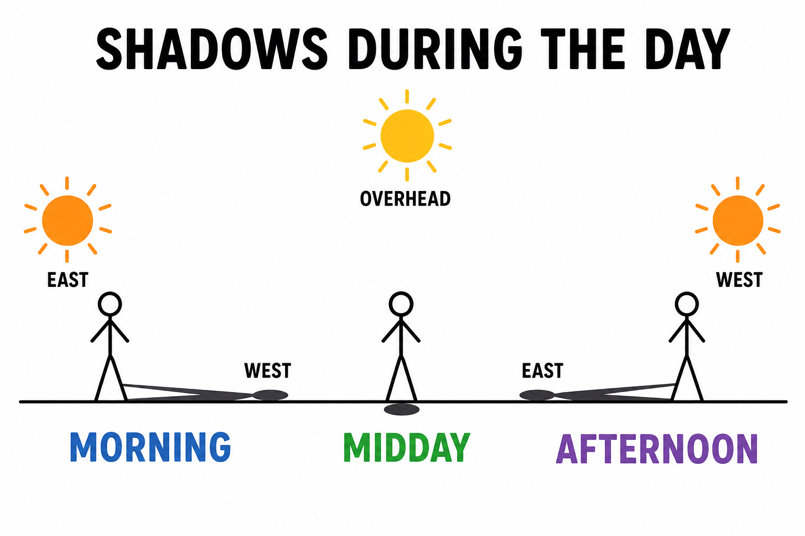
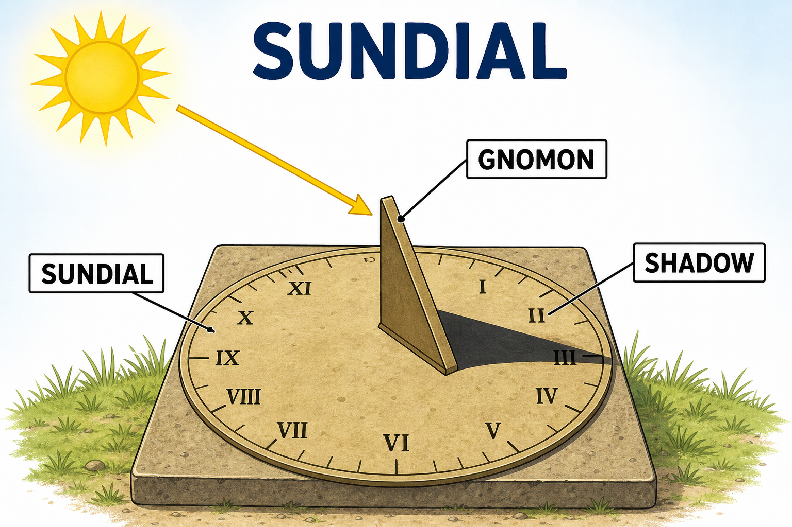
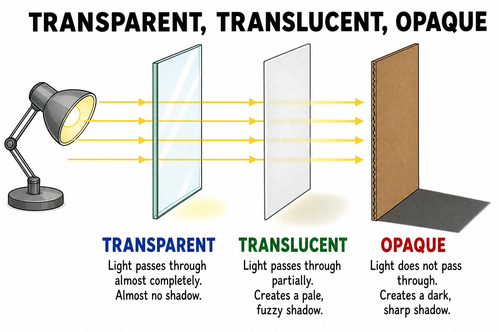
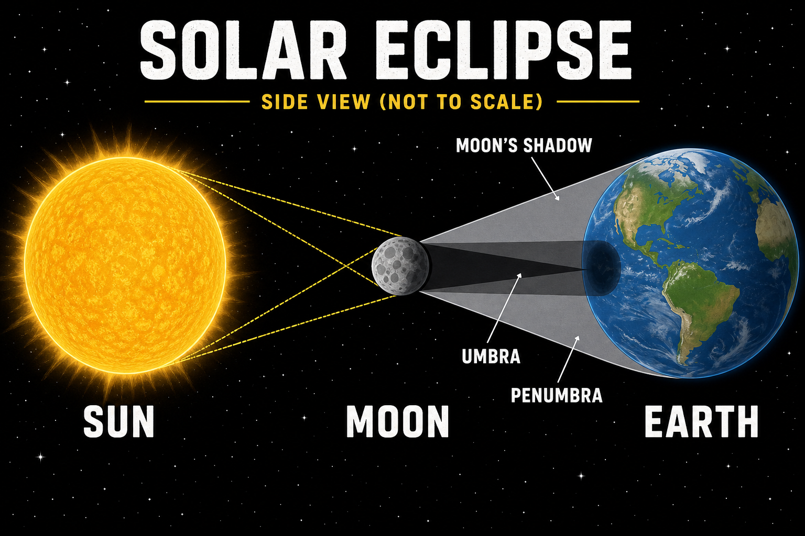

# Shadow

You sprint across the blacktop at recess. Your sneakers slap the pavement—and a dark copy of you slaps the ground right beside you. Jump. It jumps. Freeze. It freezes. Try to stomp on it and your foot lands on hot asphalt while the dark shape stays just out of reach.

That dark shape is not a second you. It is not a sticker. You cannot peel it off the ground.

It is a **shadow**.

**A shadow is a darker region formed when an object blocks light.**

Shadows explain why the shady side of a basketball court feels cooler, why your silhouette stretches across the lawn in the morning, why a tree blocks the Sun on a hike, why eclipses happen, why sundials can tell time, why horror-movie posters use creepy silhouettes, and why light traveling in straight lines matters so much in **optics**—the study of light.

You already know that **light** is energy your eyes can detect. In **reflection**, light bounces off a surface. In **refraction**, light bends when it enters a new material. In a shadow, light never reaches a place at all—something got in the way.

Shadows are simple to see. They also reveal deep truths about light, geometry, and the motion of Earth and the Moon.

## Light Travels in Straight Lines

In a uniform material—like still air—light travels in straight lines.

Scientists often model light with **rays**: straight arrows showing the path light takes.

When rays from a source head toward an object, the object may block some of them. The region behind the object receives less light.

That darker region is the shadow.

If light did not travel mostly in straight lines, shadows would not have clear shapes. They would blur and smear in useless ways.

## Blocking Light

A shadow forms because light is blocked.

Picture a flashlight aimed at a toy figure in front of a wall. Rays that miss the figure hit the wall. Rays that hit the figure are blocked, absorbed, or reflected away.

The part of the wall behind the figure receives less light. A shadow appears.

The shadow’s shape matches the **outline** of the object as seen from the light’s direction.

That is why your shadow on the ground looks like your body’s silhouette—not your front view, not your top view, but your outline from the Sun’s angle.

## Light Sources

The kind of light source changes the shadow.

A **small** or **distant** source—like a tiny bright bulb or the Sun as seen from Earth—can make a **sharper** shadow with a clearer edge.

A **large** or **spread-out** source—like a wide lamp, a ring light, or sunlight scattered through thick clouds—makes **softer** edges. Light reaches the object from many slightly different directions, so some rays sneak past the edges.

The Sun is huge, but it is also very far away. From Earth it looks small in the sky, so sunlight can make fairly sharp shadows on a clear day.

On a cloudy day, sunlight is scattered in many directions. Shadows become faint or disappear.

## Umbra

The darkest part of a shadow is called the **umbra**.

In the umbra, the light source is **completely** blocked from that spot.

Stand in the umbra of a big oak tree and little direct sunlight reaches you—you are in full shade. During a **solar eclipse**, if the Moon’s umbra falls on your town, you may see the Sun completely covered for a short time.

The umbra is the full-shadow region: the place where the object blocks all direct light from the source.

## Penumbra

The lighter outer part of a shadow is called the **penumbra**.

In the penumbra, the light source is only **partly** blocked.

Real light sources have size. From one part of the penumbra, the left side of the Sun might be hidden while the right side still shines in. Some light gets through; not all of it does.

The penumbra creates a softer edge around many shadows.

Look closely at a shadow on pavement. The edge often fades from dark to light instead of cutting off like a knife.

## Shadow Size

The size of a shadow depends on **distances**—how far the object is from the light and how far it is from the screen or wall.

Move an object **closer to the light** and its shadow on a distant wall often grows **larger**.

Move the object **closer to the wall** and the shadow often becomes **smaller** and can look **sharper**.

Hold your hand near a flashlight aimed at a garage wall and you can cast a giant hand shadow. Move the same hand close to the wall and the shadow shrinks.

Shadow size is geometry made visible.

### A Quick Check

Suppose a basketball blocks light from a lamp and casts a shadow on the floor.

- Move the ball **closer to the lamp** → shadow on the floor usually gets **bigger**.
- Move the ball **closer to the floor** → shadow on the floor usually gets **smaller**.

Same ball. Same lamp. Different distances—different shadow.

## Shadow Shape

A shadow’s shape depends on the object’s outline **and** the direction of the light.

A round ball makes a circular shadow from many directions. A cylinder might make a circle from one angle and a rectangle from another.

Your body can make a short shadow at noon, a long shadow at sunrise, or a stretched shadow when the Sun is low.

Shadows are **two-dimensional projections** of three-dimensional objects—the flat “picture” your body throws on the ground.

That is why **shadow puppets** work: hands and cutout shapes can look like animals, monsters, or faces on a wall.

## Shadows During the Day

Your shadow changes during the day because the Sun appears to move across the sky.

In the **morning**, the Sun is low in the east. Shadows are **long** and point generally **west**.

Near **midday**, the Sun is higher. Shadows are **shorter**.

In the **afternoon**, the Sun is lower in the west. Shadows grow **long** again and point generally **east**.

The Sun does not actually orbit Earth each day. **Earth rotates**, so the Sun seems to move. Shadows are a daily clock you can read with your feet.

## Sundials

A **sundial** is a device that uses a shadow to tell time.

It has a raised part called a **gnomon**. Sunlight hits the gnomon, and the gnomon casts a shadow onto marked lines or numbers.

As Earth rotates, the Sun appears to move, and the shadow slides across the dial.

People used sundials for thousands of years before clocks and watches. A sundial still works on a sunny day if it is set up correctly for its location.

## Transparent, Translucent, and Opaque

Different materials block light differently.

A **transparent** material lets light pass through clearly. Clear window glass is transparent.

A **translucent** material lets some light through but scatters it. Wax paper, frosted glass, and thin fabric are translucent.

An **opaque** material blocks most light. Wood, metal, cardboard, your body, and a closed door are opaque.

**Opaque** objects make the darkest shadows.

**Translucent** objects may make pale or blurry shadows.

**Transparent** objects may make little shadow, though they can still bend light (**refraction**) or bounce it (**reflection**).

## Colored Shadows

Shadows are not always plain black.

If more than one **colored** light shines on an object, the object may block one color while another color still reaches the surface behind it.

Shine red and blue lights on your hand from different sides. In one region the hand blocks red but blue still arrives—the shadow there may look bluish. In another region it might look reddish.

Colored shadows remind us that a shadow is not a “thing.” It is a place where **some** light is missing and **other** light may still be present.

## Eclipses

An **eclipse** happens when one object in space moves into another object’s shadow—or blocks light from reaching it.

A **solar eclipse** occurs when the Moon passes between the Sun and Earth, casting a shadow on Earth.

A **lunar eclipse** occurs when Earth passes between the Sun and the Moon, and the Moon moves into Earth’s shadow.

Eclipses are shadows on an enormous scale. They can be predicted because Earth, Moon, and Sun follow regular patterns.

## Solar Eclipses

During a solar eclipse, the Moon blocks sunlight from reaching part of Earth.

Where the Moon’s **umbra** touches Earth, observers may see a **total** solar eclipse. Where the **penumbra** falls, people may see a **partial** eclipse.

The Moon’s umbra makes a narrow path across Earth’s surface, so a total solar eclipse is rare for any one town.

Solar eclipses are spectacular—but **looking at the Sun is dangerous**. Ordinary sunglasses are not enough. Use proper **eclipse glasses** or approved indirect viewing methods, with adult or teacher supervision.

## Lunar Eclipses

During a lunar eclipse, Earth blocks sunlight from reaching the Moon.

The Moon passes into Earth’s shadow.

During a **total** lunar eclipse, the Moon may look **reddish**. Some sunlight bends through Earth’s atmosphere and still reaches the Moon. The atmosphere scatters much blue light and lets more red light through—the same reason sunsets can look red.

Unlike solar eclipses, lunar eclipses are **safe** to view with the unaided eye.

They are a beautiful reminder that shadows can stretch across space.

## Shadows in Art, Games, and Design

Shadows are not only science—they are tools.

Artists use light and dark to show shape and depth. A shaded circle can look like a sphere. Stage lights throw sharp silhouettes behind actors. Photographers chase shadow direction for mood.

You use shadows in **flashlight tag**, **shadow puppets**, and games where you try to stay in shade. Video games use fake shadows to make worlds look solid.

Architects plan shadows when they design windows, porches, and buildings. A good overhang can keep a room cool in summer.

Shadows guide attention. Your brain reads them as clues about where light is coming from.

## Shadows and Temperature

Shadows affect temperature.

A shaded surface receives less direct sunlight than a sunny one. It usually stays **cooler**.

That is why shade under a tree beats standing in the open on a hot day. A car in a parking-lot shadow stays cooler than one in direct Sun. Athletes rest in shade between plays.

Shade is a shadow used for comfort. It is not cold by itself—it is an area receiving **less radiant energy** from the Sun.

## Shadows in Measurement

Shadows can be used to **measure**.

Compare the length of a shadow with the height of an object and you can estimate heights. Ancient thinkers used shadows to estimate the size of Earth.

If you know the angle of the Sun and the length of a shadow, you can calculate the height of a tree, flagpole, or building.

Even without advanced math, you can see the principle:

**Shadows connect light direction with object size.**

## Common Misconceptions

One common mistake is thinking a shadow is a physical object. It is not. It is a region where light is blocked or reduced.

Another mistake is thinking shadows are always black. They can be gray, soft-edged, colored, or faint depending on the light.

A third mistake is thinking shadows only happen in sunlight. Any light source—a lamp, phone flashlight, stadium light—can cast a shadow.

A fourth mistake is thinking transparent objects never affect light. They may not make dark shadows, but they can bend, reflect, or faintly absorb light.

Finally, remember: the Sun does not travel around Earth each day. Shadows change mainly because **Earth rotates**.

## Safety with Shadows and Light

Studying shadows is usually safe, but **light sources** can be dangerous.

Good safety habits include:

- Never look directly at the Sun.
- Use proper eclipse glasses for solar eclipses—not ordinary sunglasses.
- Do not aim bright lights or lasers at anyone’s eyes.
- Keep hot lamps away from paper, cloth, and skin.
- Be careful with cords when using classroom lamps.
- Do not walk into traffic or unsafe areas while watching shadows outdoors.
- Use adult or teacher supervision for eclipse activities.

The shadow on the ground may be harmless. The light that casts it may not be.

## The Big Idea

A shadow is a darker region formed when an object blocks light.

Shadows exist because light travels in straight lines through uniform materials. Their size, shape, sharpness, and direction depend on the light source, the object, the screen, and the distances involved. Shadows help explain shade, sundials, eclipses, art, measurement, temperature, and the motion of Earth and Moon.

If you remember only one sentence, remember this:

**A shadow is what appears where light cannot reach because something blocks its path.**

## Study Questions

1. What is a shadow?
2. Why does light traveling in straight lines help explain shadows?
3. What is a light ray?
4. How does an object make a shadow?
5. How does the size of a light source affect shadow sharpness?
6. Why are shadows faint or missing on many cloudy days?
7. What is the umbra?
8. What is the penumbra?
9. Why do many shadows have soft edges?
10. How does moving an object closer to a light source often affect its shadow?
11. How does moving an object closer to a screen or wall often affect its shadow?
12. Why can the same object make different shadow shapes from different directions?
13. How do shadows change from morning to midday to afternoon?
14. Why do shadows change during the day?
15. What is a sundial?
16. What is a gnomon?
17. How do transparent, translucent, and opaque materials differ in making shadows?
18. How can shadows appear colored?
19. What is an eclipse?
20. What happens during a solar eclipse?
21. What happens during a lunar eclipse?
22. Why can the Moon look reddish during a lunar eclipse?
23. How do artists, designers, or games use shadows?
24. Why is shade usually cooler than direct sunlight?
25. How can shadows help measure height?
26. What are three safety rules related to shadows and light?
27. In your own words, explain why a shadow is not a physical object.
