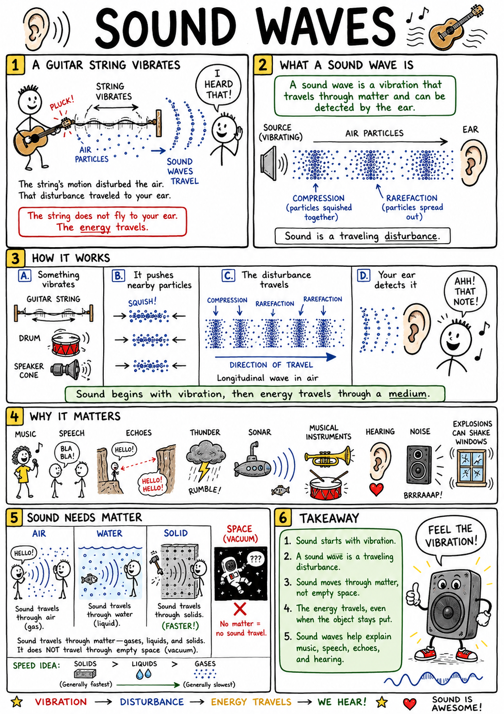
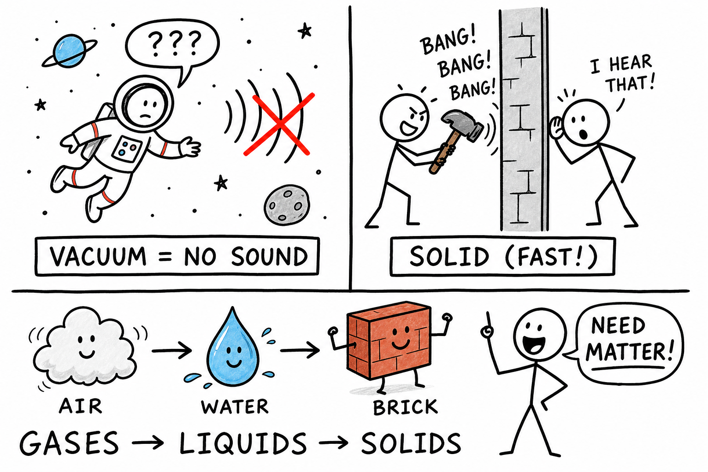
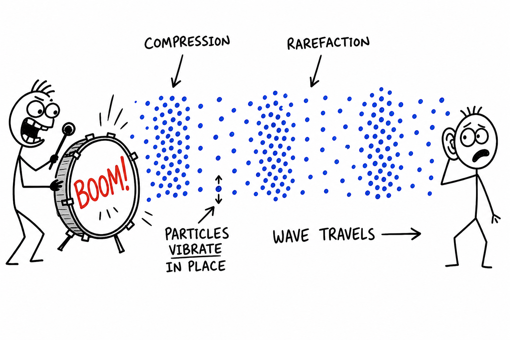
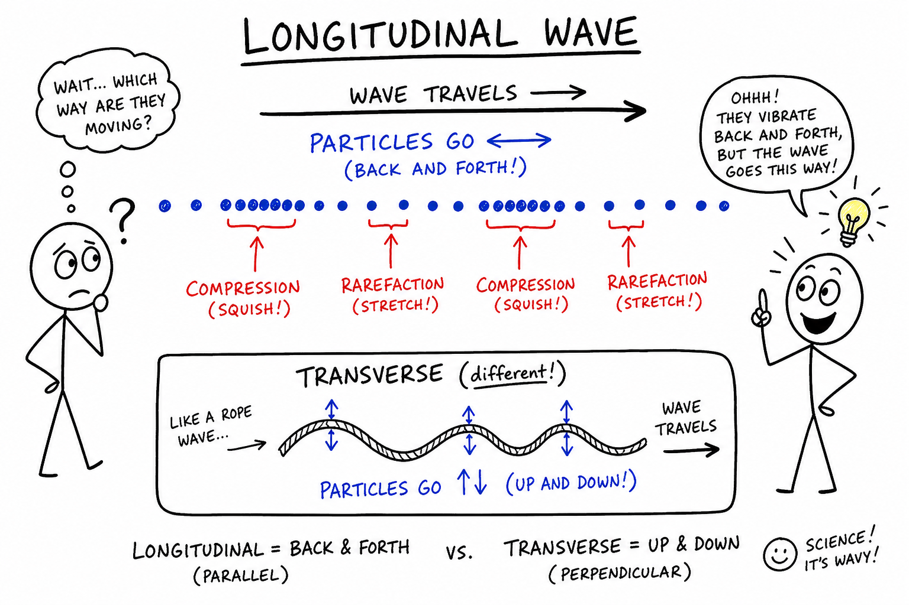
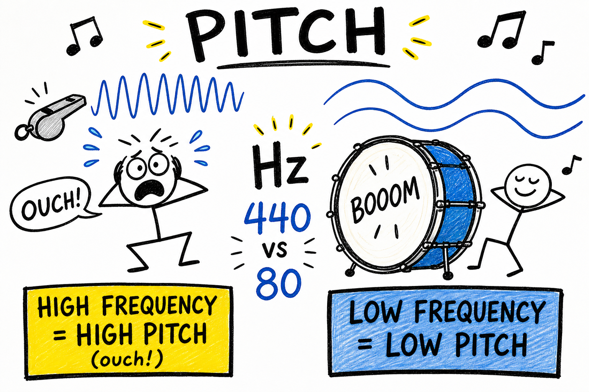
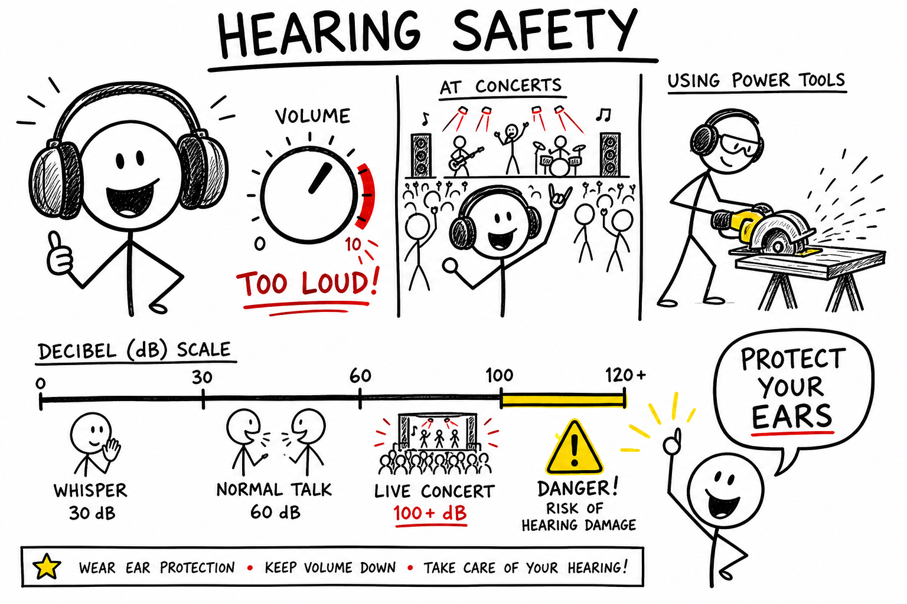
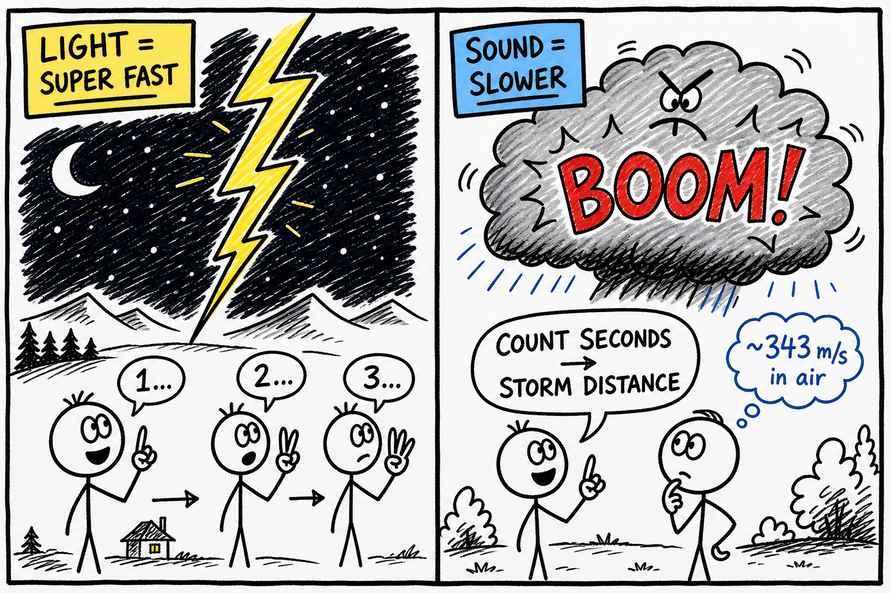
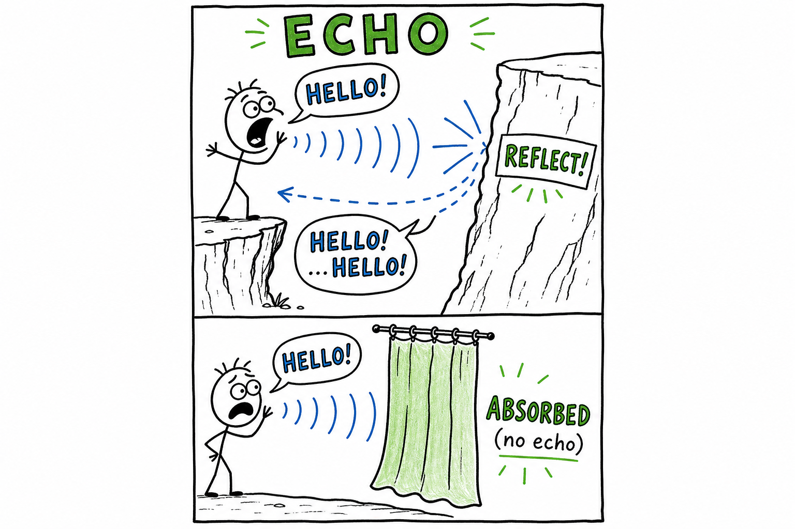
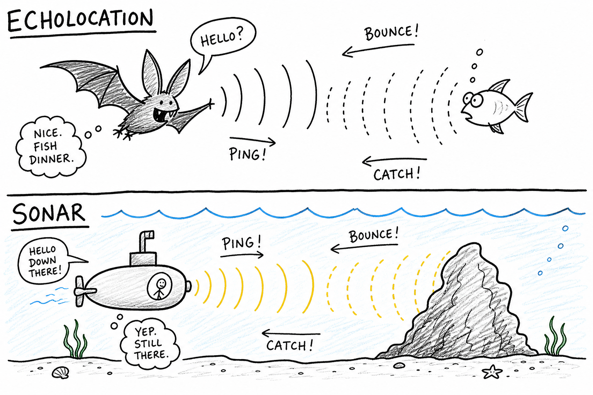

# Sound waves

Imagine plucking a guitar string. The string shakes back and forth so fast it becomes a blur. A moment later, you hear a note. The string's motion disturbed the air—and that disturbance traveled to your ear.

Or think about the last time you wore headphones. The tiny speaker inside never touched your eardrum. It vibrated, pushed on the air (or your ear cushion), and your brain heard music, game effects, or a friend's voice.

That traveling disturbance is a **sound wave**.

**A sound wave is a vibration that travels through matter and can be detected by the ear.**

Sound waves explain music, speech, echoes in a gym, thunder after lightning, sonar on submarines, bats hunting in the dark, musical instruments, hearing, annoying noise, and why a nearby explosion can rattle a window. Sound is familiar—but it is also one of the clearest examples of how **energy** can move through matter without the source flying across the room.

## Sound Begins with Vibration

Sound begins when something vibrates.

A **vibration** is a back-and-forth motion.

A guitar string vibrates. A drumhead vibrates. Your vocal cords vibrate when you speak or yell across a field. A bell vibrates when struck. A phone speaker vibrates when a video plays. Even the ground can vibrate when something heavy drops.

These vibrations push and pull on nearby particles in the medium—usually air.

Those particles push and pull on their neighbors, and the disturbance spreads outward.

The vibrating object does not usually travel all the way to your ear. The **energy** of the vibration travels through the medium.

## Sound Needs a Medium

Sound needs matter to travel through.

The material through which a wave travels is called a **medium**.

Sound can travel through gases, liquids, and solids. It moves through air, water, wood, metal, rock, and even the ground under your feet.

Sound cannot travel through a perfect **vacuum** because there are no particles to vibrate and pass the disturbance along.

That is a huge difference between sound and light. Light can cross empty space—sunlight reaches Earth through the vacuum of space. Sound cannot. In space, nobody hears you scream (movie explosions with loud booms in space are wrong).

## Sound in Air

Most sounds you hear every day travel through air.

When a drumhead moves outward, it squeezes nearby air particles closer together. When it moves inward, it leaves a region where particles are spread farther apart.

Those crowded and spread-out regions travel through the air as a sound wave.

The air particles themselves mostly vibrate back and forth. They do **not** fly from the drum all the way to your ear like a swarm of bees.

The wave moves through the air, carrying energy.

## Compressions and Rarefactions

A sound wave in air has alternating regions called **compressions** and **rarefactions**.

A **compression** is a region where particles are crowded closer together.

A **rarefaction** is a region where particles are spread farther apart.

As a sound wave moves, compressions and rarefactions travel through the medium.

Your ear detects these pressure changes.

Sound in air is a **pressure wave** made of repeating compressions and rarefactions.

## Longitudinal Waves

Sound waves in air are usually **longitudinal waves**.

In a longitudinal wave, particles vibrate back and forth in the **same direction** the wave travels.

If the sound wave travels east, the air particles vibrate east and west.

That is different from a wave on a rope, where the rope may move up and down while the wave travels sideways. That kind is called a **transverse wave**.

Sound in air is longitudinal because the air particles push and pull along the direction the sound travels.

## Frequency

**Frequency** is how many vibrations or wave cycles happen each second.

Frequency is measured in **hertz**, written **Hz**.

One hertz means one vibration per second.

If a guitar string vibrates 440 times per second, its frequency is 440 Hz.

Frequency is one of the main features of a sound wave.

It is closely related to **pitch**.

## Pitch

**Pitch** is how high or low a sound seems.

A high-pitched sound has a high frequency.

A low-pitched sound has a low frequency.

A whistle has a higher pitch than a bass drum because its vibrations have a higher frequency.

A large drum usually sounds lower than a small drum because it vibrates more slowly.

Pitch is what lets you tell a high note from a low note—even when both are equally loud.

## Amplitude

**Amplitude** describes the size or strength of a wave's vibration.

In sound, greater amplitude means stronger pressure changes.

A sound wave with large amplitude usually sounds **louder**. A sound wave with small amplitude usually sounds **quieter**.

Pluck a guitar string gently: small amplitude, soft sound. Pluck it hard: larger amplitude, louder sound.

Amplitude is closely related to loudness—but they are not the same thing (see below).

## Loudness and Decibels

**Loudness** is how strong a sound seems to your ear.

Loudness depends mostly on amplitude, but it also depends on your ears and the frequency of the sound.

Sound level is often measured in **decibels**, written **dB**.

A whisper may be around 30 dB. Normal conversation may be around 60 dB. A loud concert, power tool, or gaming headset cranked up can go over 100 dB.

The decibel scale is not a simple ordinary scale. An increase of 10 dB means a much greater sound **intensity**.

Very loud sounds can damage hearing—sometimes permanently.

## Wavelength

**Wavelength** is the distance from one part of a wave to the matching part of the next wave.

For sound waves, it can be measured from one compression to the next compression.

High-frequency sounds have shorter wavelengths if they travel through the same medium.

Low-frequency sounds have longer wavelengths.

Wavelength, frequency, and wave speed are connected.

For a given speed, higher frequency means shorter wavelength.

## Speed of Sound

Sound travels at a finite speed—it is fast, but not instant.

In air at room temperature, sound travels about **343 meters per second** (about 767 miles per hour).

Sound travels faster in water than in air, and often faster still in solids such as steel.

Particles in liquids and solids are closer together and can pass vibrations along efficiently, though the exact speed depends on the material.

You see lightning before you hear thunder because light travels much faster than sound.

Counting seconds between the flash and the rumble can help estimate how far away a storm is. Rough rule: divide the seconds by three to get distance in kilometers (or by five for miles)—not perfect, but useful.

## Sound and Temperature

Temperature affects the speed of sound in air.

Warm air usually lets sound travel faster than cold air because particles move more quickly and pass disturbances along more rapidly.

This can affect how sound bends through the atmosphere and how far it carries.

On some nights, sound from a road or train may seem to carry farther because temperature layers in the air bend sound waves.

Sound is always tied to the medium it travels through.

## Echoes

An **echo** is a reflected sound.

Shout near a cliff, tunnel, empty gym, or large wall. The sound wave travels to the surface, reflects, and returns to your ears. If the reflected sound arrives late enough, you hear it as a separate echo.

Echoes show that sound waves can **reflect** from surfaces.

Hard, smooth surfaces often reflect sound well. Soft materials—thick curtains, carpet, acoustic foam—absorb more sound and reduce echoes.

Echoes are useful in nature, architecture, and technology.

## Sonar and Echolocation

**Sonar** uses sound waves to detect objects underwater.

A sonar device sends out a sound pulse and listens for the echo. By measuring how long the echo takes to return, it can estimate distance.

Ships and submarines use sonar to map the seafloor, find objects, and navigate.

Some animals use a similar idea called **echolocation**.

Bats and dolphins send out sounds and listen to returning echoes to locate insects, fish, obstacles, and other objects.

They use sound to "see" their surroundings.

## Resonance

**Resonance** happens when an object vibrates strongly at certain natural frequencies.

Push a swing at just the right rhythm, and it goes higher. That is a kind of resonance.

A guitar body resonates with the vibrating strings, making the sound louder and richer. A drum shell and the air inside can resonate. Tap a glass at the right pitch and it may ring loudly.

Resonance can be useful in musical instruments.

It can also be dangerous if vibrations grow too strong in bridges, buildings, or machines—engineers study resonance carefully.

## Musical Instruments

Musical instruments make controlled sound waves.

String instruments use vibrating strings. Wind instruments use vibrating air columns. Drums use vibrating membranes. Brass instruments use vibrating lips and air columns. Electronic speakers use vibrating cones.

The instrument shapes the sound by controlling frequency, amplitude, resonance, and tone quality.

A violin and a flute can play the same note, but they sound different because their wave patterns are different.

That difference in sound quality is called **timbre**.

## The Human Voice

Your voice begins with vibrating **vocal cords** in the larynx.

Air from your lungs passes through the vocal cords, making them vibrate. Your throat, mouth, tongue, lips, and nasal passages shape the sound into speech or song.

Changing tension in the vocal cords changes pitch.

Changing airflow changes loudness.

The human voice is a living musical instrument—no batteries required.

## Hearing

Your ear detects sound waves.

Sound waves enter the outer ear and travel down the ear canal to the **eardrum**. The eardrum vibrates. Tiny bones in the middle ear pass the vibration to the inner ear.

Inside the **cochlea**, fluid and tiny hair cells respond to vibrations. These cells send nerve signals to the brain.

The brain interprets the signals as sound.

Hearing is the conversion of sound wave energy into nerve signals.

## Soundproofing and Absorption

Sound can be reflected, absorbed, or transmitted.

Hard walls reflect sound and can create echoes. Soft materials absorb sound and reduce reflections. Thick, heavy barriers can block sound transmission.

Soundproofing often uses several strategies:

- Absorb sound inside a room.
- Block sound from passing through walls.
- Seal gaps where air and sound can leak.
- Reduce vibrations in structures.

A quiet recording studio or study room is designed, not accidental.

## Common Misconceptions

One common mistake is thinking sound can travel through empty space. Sound needs a medium, so it cannot travel through a perfect vacuum.

Another mistake is thinking air particles travel from the speaker all the way to your ear. The particles mostly vibrate in place while the wave travels.

A third mistake is thinking **pitch** and **loudness** are the same. Pitch depends mostly on frequency. Loudness depends mostly on amplitude.

A fourth mistake is thinking echoes are brand-new sounds made by the cliff. Echoes are **reflected** sound waves—same sound, bounced back.

Finally, remember that sound waves carry **energy**, not matter, from the source to your ear.

## Safety with Sound

Sound can damage hearing if it is too loud or lasts too long.

Good safety habits include:

- Keep headphone and earbud volume moderate.
- Take breaks from loud music or gaming audio.
- Wear ear protection around power tools, engines, fireworks, or loud concerts.
- Move away from painfully loud sounds.
- Do not shout directly into someone's ear.
- Tell an adult if your ears ring after a loud event.
- Protect hearing during shooting sports or motorsports.
- Remember that hearing damage can be permanent.

Your ears are sensitive instruments. Protect them.

## The Big Idea

Sound waves are vibrations that travel through matter.

In air, sound travels as longitudinal waves made of compressions and rarefactions. Frequency affects pitch, amplitude affects loudness, and the medium affects speed. Sound can reflect as echoes, resonate in instruments, travel through solids, liquids, and gases, and be detected by the ear.

If you remember only one sentence, remember this:

**Sound is energy carried by vibrations traveling through matter.**

## Study Questions

1. What is a sound wave?
2. What is a vibration?
3. How does a vibrating object make sound in air?
4. What is a medium?
5. Why can sound not travel through a perfect vacuum?
6. How is sound different from light in this way?
7. What are compressions and rarefactions?
8. What is a longitudinal wave?
9. What is frequency?
10. What unit is frequency measured in?
11. How is frequency related to pitch?
12. What is amplitude?
13. How is amplitude related to loudness?
14. What are decibels used to measure?
15. What is wavelength?
16. About how fast does sound travel in air at room temperature?
17. Why do you see lightning before hearing thunder?
18. What is an echo?
19. How does sonar use echoes?
20. What is echolocation?
21. What is resonance?
22. How do musical instruments use vibrations?
23. What is timbre?
24. How does the human voice make sound?
25. How does the ear detect sound?
26. How can soft materials reduce echoes?
27. What are three safety rules related to sound?
28. In your own words, explain why pitch and loudness are not the same.
