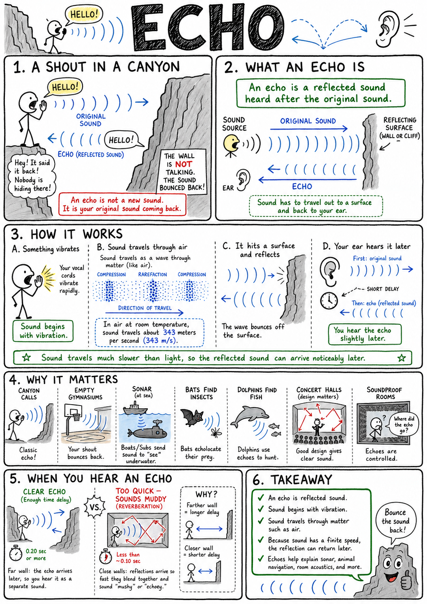
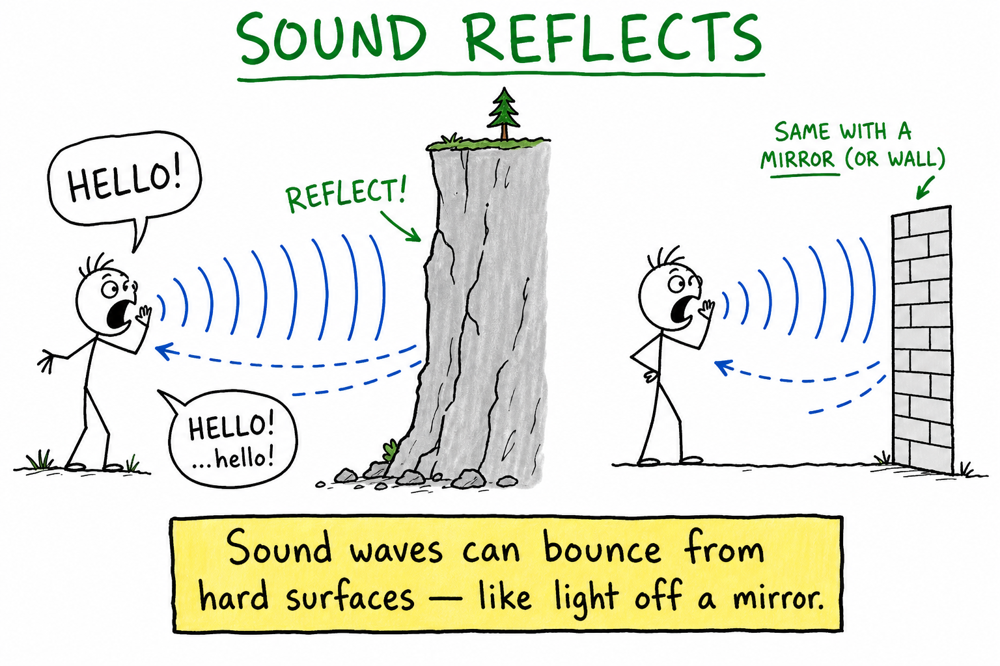
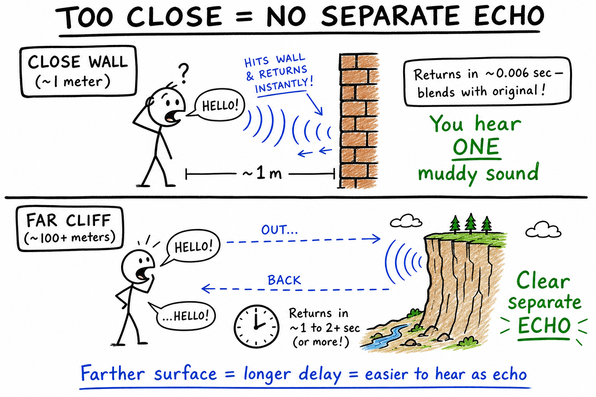
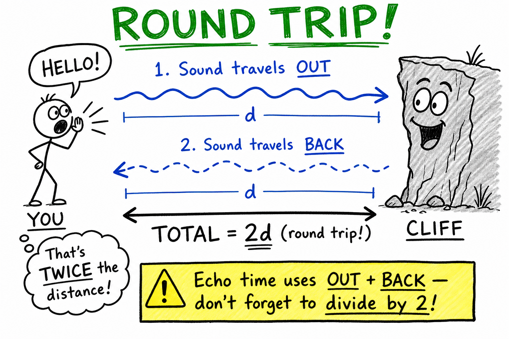
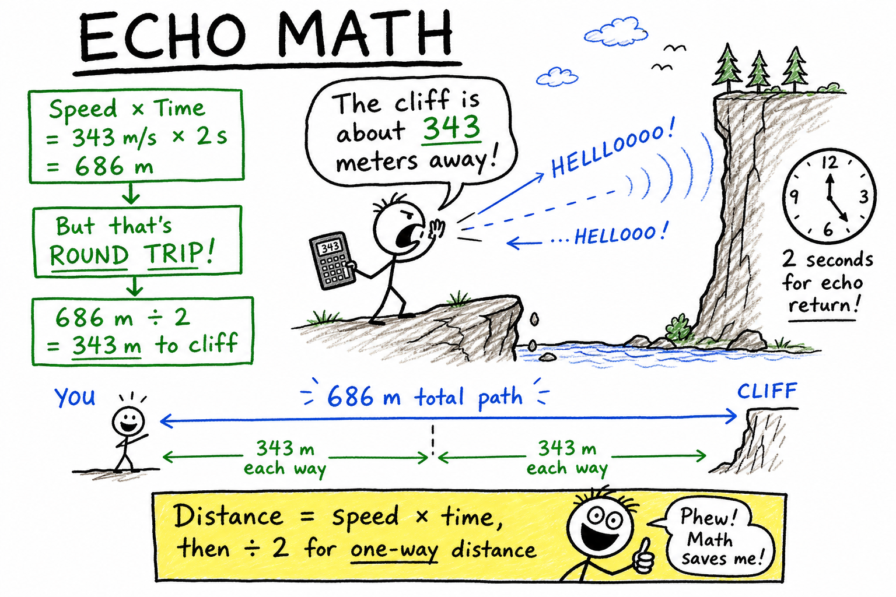
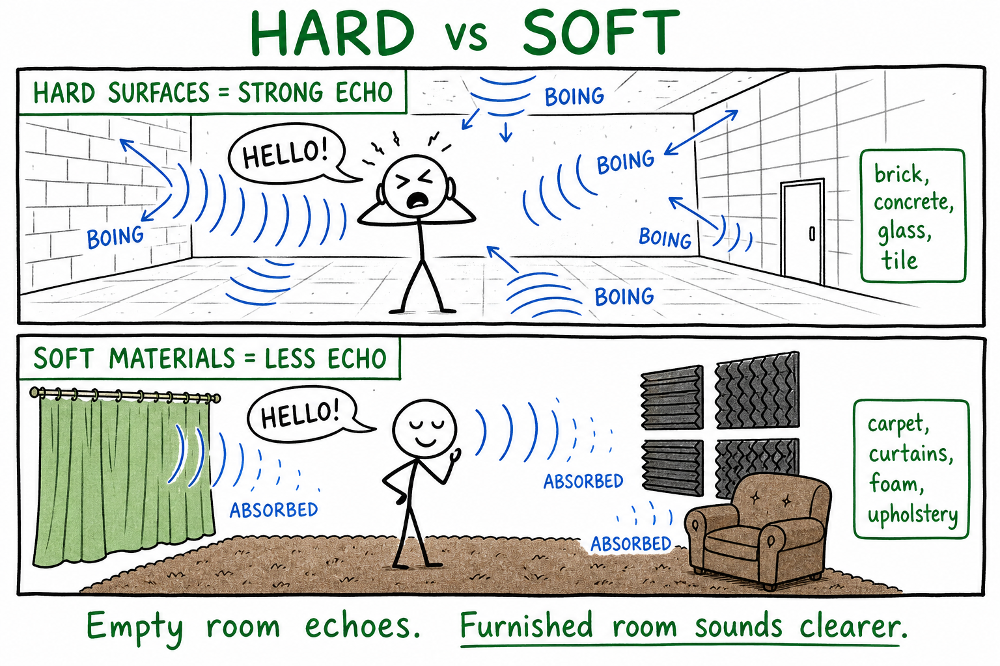
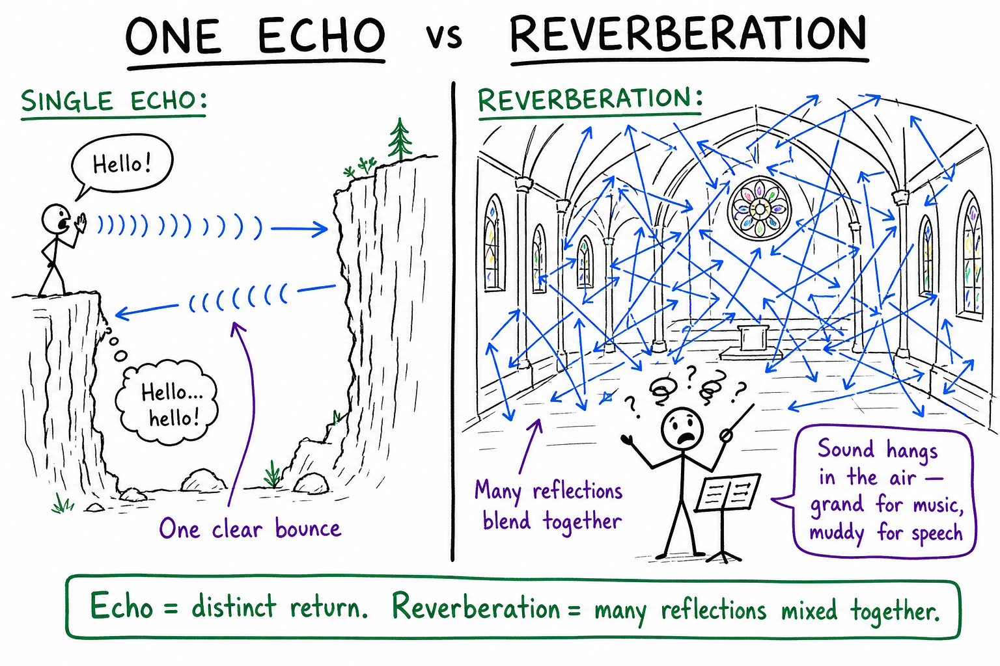
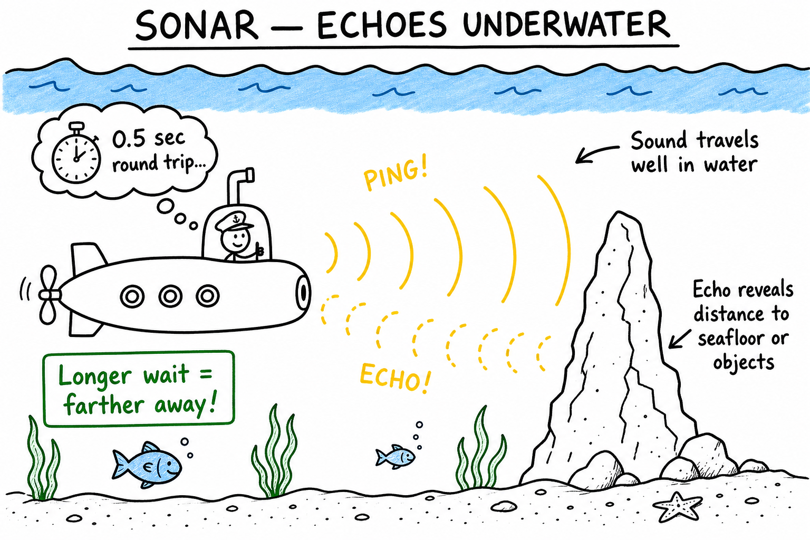
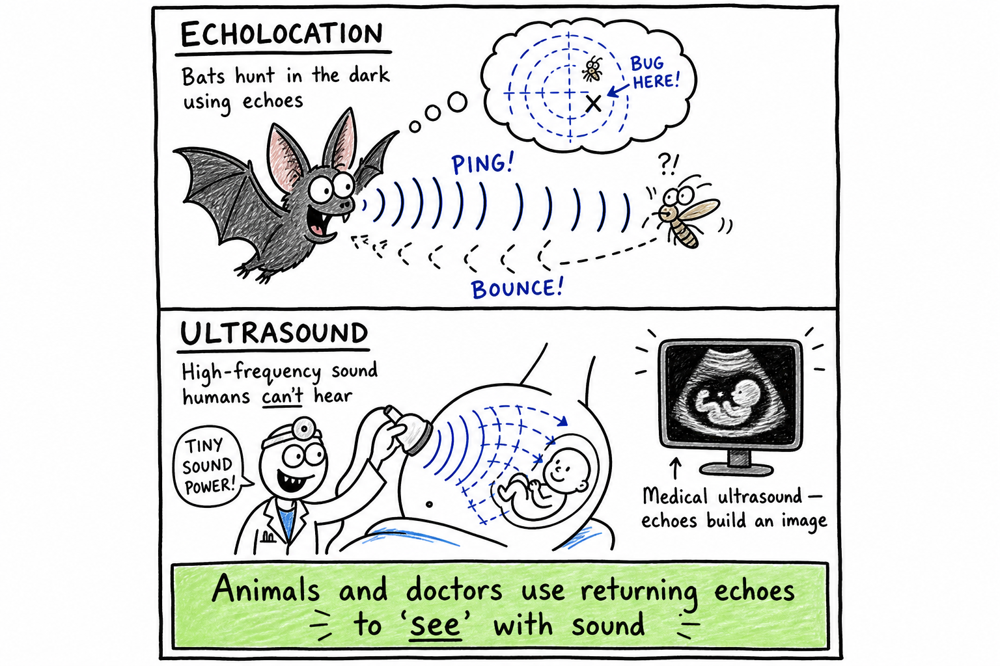

# Echo

Imagine standing near a canyon wall and shouting, "Hello!" A moment later, the canyon seems to answer back: "Hello!" No person is hiding in the rocks. Your own sound has traveled to the wall, bounced off, and returned to your ears.

That returning sound is an echo.

**An echo is a reflected sound heard after the original sound.**

Echoes explain canyon calls, empty gymnasiums, sonar, bats hunting insects, dolphins finding fish, soundproof rooms, concert hall design, and why some places sound clear while others sound muddy and confusing.

An echo is not a new sound. It is your original sound coming back.

## Sound Travels as a Wave

Sound begins with vibration.

When something vibrates, it pushes and pulls on nearby particles in a medium such as air, water, or solid material. The disturbance travels outward as a sound wave.

In air, sound travels as repeating compressions and rarefactions, which are regions where air particles are crowded together and spread apart.

Sound travels much slower than light.

In air at room temperature, sound travels about **343 meters per second**.

Because sound has a finite speed, a reflected sound can arrive noticeably later than the original.

## Reflection of Sound

Sound waves can reflect from surfaces.

When a sound wave reaches a wall, cliff, building, or other surface, some of the sound energy may bounce back.

This is reflection.

Light reflects from mirrors and shiny surfaces. Sound reflects from hard surfaces too.

The reflected sound wave can travel back to your ear. If it arrives late enough and clearly enough, you hear an echo.

## Echo and Delay

For you to hear a separate echo, the reflected sound must return after a short delay.

If the reflecting surface is very close, the reflected sound returns almost immediately and blends with the original sound. You may not hear it as a separate echo.

If the surface is far enough away, your ear and brain can separate the original sound from the returning sound.

A canyon wall, large building, or distant cliff can produce a clear echo because the sound has time to travel out and back.

Echoes are delayed reflections.

## Round Trip Distance

An echo travels a round trip.

If you shout at a wall, the sound travels from you to the wall, then from the wall back to you.

That means the sound travels twice the distance between you and the wall.

This is important for echo calculations.

If an echo returns after 2 seconds, the sound did not travel only from you to the wall. It traveled to the wall and back.

To find the distance to the wall, you use half the round-trip distance.

## A Simple Echo Calculation

Suppose sound travels through air at about 343 meters per second.

You shout toward a cliff, and the echo returns after 2 seconds.

First find how far the sound traveled in 2 seconds:

**Distance = speed x time**

**Distance = 343 m/s x 2 s**

**Distance = 686 m**

But this is the round trip: to the cliff and back.

So the cliff is half that distance away:

**686 m ÷ 2 = 343 m**

The cliff is about 343 meters away.

## Hard Surfaces and Soft Surfaces

Hard, smooth surfaces often reflect sound well.

Examples include:

- Cliffs
- Brick walls
- Concrete
- Tile
- Glass
- Metal
- Empty gym walls

Soft, rough, or porous materials often absorb more sound.

Examples include:

- Curtains
- Carpet
- Foam
- Upholstered seats
- Thick clothing
- Acoustic panels

This is why an empty room may echo, while a furnished room sounds quieter and clearer.

## Absorption

**Absorption** happens when sound energy is taken into a material rather than reflected strongly.

Soft materials can convert some sound energy into tiny amounts of heat as fibers and air pockets vibrate.

This does not destroy energy. It changes sound energy into other forms, mostly thermal energy.

Absorption is useful in theaters, recording studios, classrooms, and homes.

If a room reflects too much sound, speech can become hard to understand.

## Reverberation

**Reverberation** is the persistence of sound in a space after the original sound is made.

It happens when sound reflects many times from walls, ceilings, floors, and objects.

Reverberation is not exactly the same as a single echo. An echo is a distinct reflected sound. Reverberation is a collection of many reflections that blend together.

A cathedral may have long reverberation, making music sound grand but speech less clear.

A recording studio has much shorter reverberation so sounds can be recorded cleanly.

## Echoes Indoors

Indoor spaces can create echoes and reverberation.

An empty gym, hallway, stairwell, or large cafeteria often sounds echoey because hard surfaces reflect sound.

Add people, curtains, carpets, bookshelves, or padded seats, and the sound changes. More sound is absorbed and scattered, so echoes become weaker.

Architects think about this when designing classrooms, theaters, concert halls, and auditoriums.

Good sound design helps people hear clearly.

## Echoes Outdoors

Outdoors, echoes often come from large surfaces.

Cliffs, canyon walls, buildings, bridges, tunnels, and mountains can reflect sound.

Forests, grass, snow, and uneven ground often absorb or scatter sound, making echoes weaker.

Wind, temperature, and humidity can also affect how sound travels.

On some days, an echo may be sharp. On other days, the same place may sound different.

The air itself is part of the sound path.

## Sonar

**Sonar** uses sound echoes to detect objects underwater.

A sonar device sends out a sound pulse. The pulse travels through water, reflects from an object or the seafloor, and returns as an echo.

By measuring the time it takes for the echo to return, sonar can estimate distance.

Ships use sonar to map the ocean floor, find fish, detect obstacles, and navigate.

Sound travels well in water, which makes sonar very useful in oceans.

## Echolocation

**Echolocation** is using echoes to locate objects.

Bats send out high-pitched sounds, often too high for humans to hear. The sounds reflect from insects, trees, walls, and other objects. By listening to the returning echoes, bats can judge distance, direction, size, and movement.

Dolphins use echolocation underwater to find fish and navigate.

Some humans who are blind learn to use tongue clicks or cane taps and listen to echoes to understand nearby spaces.

Echolocation is active listening.

## Echoes and Distance

Echoes can reveal distance because sound speed is known.

If you know how fast sound travels and how long the echo takes to return, you can estimate how far away the reflecting surface is.

This idea is used in sonar, animal echolocation, medical ultrasound, and some measuring devices.

The key is time:

**Longer delay means greater distance.**

But remember the round trip. The sound travels out and back.

## Ultrasound Echoes

**Ultrasound** is sound with frequencies higher than humans can usually hear.

Medical ultrasound uses high-frequency sound waves. The waves enter the body and reflect from boundaries between tissues. A computer uses the echoes to create images.

Ultrasound can show a developing baby, muscles, organs, blood flow, and other structures.

Unlike X-rays, ultrasound does not use ionizing radiation.

It is a medical use of echoes.

## Echoes and Animals

Animals use echoes in remarkable ways.

Bats can hunt in darkness using echolocation. Dolphins can detect fish in murky water. Some whales use sound to communicate across long distances in the ocean. Certain birds in caves use clicking sounds to navigate.

These animals do not simply hear sounds. They interpret echoes.

Their brains turn timing, loudness, pitch changes, and direction into information about the world.

Echoes can be a map made of sound.

## Echoes and Music

Echoes and reverberation affect music.

A little reverberation can make music sound rich and full. Too much can make fast notes blur together.

Concert halls are designed so reflected sound supports the music without confusing it.

Recording engineers may add artificial echo or reverb to music to make it sound like it is in a larger room.

Musicians care about echoes because sound does not simply leave an instrument and vanish. It interacts with the space.

## Echoes and Noise

Echoes can make noise problems worse.

In a cafeteria, gym, or pool, hard surfaces reflect many sounds. Voices, footsteps, balls, water splashes, and chairs all bounce around. The result can be loud and tiring.

Soft materials, acoustic panels, curtains, and careful design can reduce reflected sound.

Clear sound is not only about making things louder.

It is often about controlling echoes.

## Common Misconceptions

One common mistake is thinking an echo is another person repeating you. It is your own sound reflected back.

Another mistake is thinking all reflected sound is heard as an echo. If it returns too quickly or blends with many reflections, it may be heard as reverberation or simply as room sound.

A third mistake is forgetting the round trip in echo distance calculations. The sound travels to the object and back.

A fourth mistake is thinking soft materials block all sound. They may absorb some sound, but blocking sound completely often requires mass, sealing gaps, and careful design.

## Safety with Echoes and Sound

Echoes themselves are usually harmless, but sound can be dangerous if loud.

Good safety habits include:

- Do not shout close to someone's ear.
- Wear hearing protection in very loud echoing spaces when needed.
- Keep headphone volume moderate.
- Move away from painfully loud sounds.
- Use ear protection near engines, tools, fireworks, or concerts.
- Be cautious in places where echoes make it hard to hear warnings.
- Do not rely only on echoes near roads, cliffs, or water.
- Tell an adult if your ears ring after loud noise.

Echoes are interesting, but hearing is worth protecting.

## The Big Idea

An echo is a reflected sound heard after the original sound.

Echoes happen because sound waves can bounce from surfaces. Hard surfaces reflect sound well, while soft materials often absorb more sound. Echo time can reveal distance because sound travels at a known speed and must travel out and back. Echoes are used in sonar, echolocation, ultrasound, music, architecture, and everyday listening.

If you remember only one sentence, remember this:

**An echo is sound returning after it bounces from a surface.**

## Study Questions

1. What is an echo?
2. Why is an echo not a new sound?
3. What must sound travel through?
4. About how fast does sound travel in air at room temperature?
5. What happens when a sound wave reaches a hard wall or cliff?
6. Why must an echo return after a delay to be heard separately?
7. Why is echo distance a round-trip problem?
8. If an echo returns after 2 seconds and sound travels 343 m/s, about how far away is the cliff?
9. What kinds of surfaces reflect sound well?
10. What kinds of materials absorb sound well?
11. What is sound absorption?
12. What is reverberation?
13. How is reverberation different from a single echo?
14. Why does an empty gym often sound echoey?
15. How can architects reduce echoes in a room?
16. What is sonar?
17. How does sonar use echoes to measure distance?
18. What is echolocation?
19. Give two animals that use echolocation.
20. How can echoes help some humans who are blind?
21. What is ultrasound?
22. How does medical ultrasound use echoes?
23. How can echoes affect music?
24. How can echoes make noisy rooms harder to understand?
25. What are three safety rules related to echoes and loud sound?
26. In your own words, explain why longer echo delay usually means greater distance.
