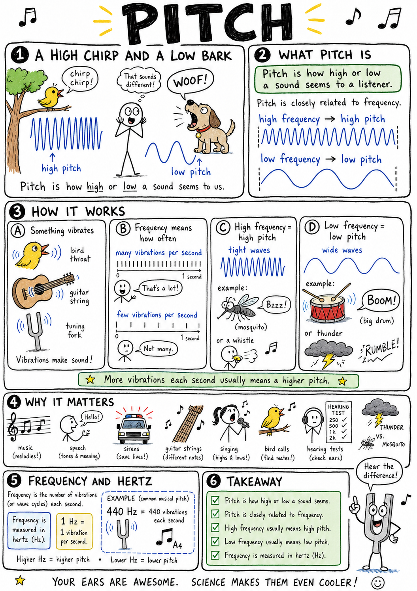

# Pitch

Imagine hearing a tiny bird chirp from a tree and then hearing a large dog bark nearby. The bird's sound seems high. The dog's sound seems low. Both are sounds traveling through air, but your ear and brain can tell they are different.

That highness or lowness is pitch.

**Pitch is how high or low a sound seems to a listener.**

Pitch helps explain music, speech, whistles, sirens, guitar strings, drums, voices, tuning forks, hearing tests, and why a mosquito whine sounds different from thunder. Pitch is one of the main qualities that lets us make sense of sound.

## Pitch Comes from Frequency

Pitch is closely related to **frequency**.

**Frequency** is how many vibrations or wave cycles happen each second.

Frequency is measured in **hertz**, written **Hz**.

One hertz means one vibration per second.

A sound with a high frequency usually has a high pitch.

A sound with a low frequency usually has a low pitch.

If a string vibrates 440 times per second, it produces a sound with a frequency of 440 Hz.

## High Pitch and Low Pitch

A high-pitched sound comes from fast vibrations.

Examples include:

- A whistle
- A small bird chirp
- A piccolo
- A mosquito whine
- A small bell

A low-pitched sound comes from slower vibrations.

Examples include:

- Thunder
- A bass drum
- A tuba
- A large bell
- A deep voice

Your ear detects the frequency of the sound wave, and your brain interprets it as pitch.

## Pitch Is Not Loudness

Pitch and loudness are different.

**Pitch** describes how high or low a sound is.

**Loudness** describes how strong or soft a sound seems.

A flute can play a high note quietly or loudly. A bass drum can make a low sound softly or loudly.

Pitch depends mostly on frequency.

Loudness depends mostly on amplitude, the size or strength of the vibration.

This distinction is important: high does not mean loud, and low does not mean quiet.

## Frequency and Wavelength

Frequency is connected to wavelength.

**Wavelength** is the distance from one part of a wave to the matching part of the next wave, such as compression to compression in a sound wave.

For sound traveling through the same medium, higher frequency means shorter wavelength.

Lower frequency means longer wavelength.

A high note has waves packed closer together. A low note has waves spread farther apart.

Frequency, wavelength, and wave speed are linked.

## Human Hearing Range

Most young people can hear sounds from about **20 Hz to 20,000 Hz**.

This range can vary from person to person.

As people age, they often lose the ability to hear very high frequencies. Loud noise can also damage hearing and reduce the range of sounds a person can detect.

Sounds below the usual human hearing range are called **infrasound**.

Sounds above the usual human hearing range are called **ultrasound**.

Human hearing is impressive, but it is not the whole world of sound.

## Ultrasound

**Ultrasound** is sound with frequency above the usual human hearing range.

Many people use 20,000 Hz as the upper edge of ordinary human hearing. Sounds above that are ultrasonic.

Bats and dolphins use ultrasonic sounds for echolocation. Medical ultrasound uses high-frequency sound waves to make images inside the body.

Some dog whistles produce sounds too high for many humans to hear but audible to dogs.

Ultrasound is still sound. It is simply too high-pitched for us to hear.

## Infrasound

**Infrasound** is sound with frequency below the usual human hearing range.

Many people use 20 Hz as the lower edge of ordinary human hearing. Sounds below that are infrasonic.

Earthquakes, volcanoes, ocean waves, thunder, large machines, and some animals can produce infrasound.

Elephants may use very low-frequency sounds that travel long distances.

Infrasound is still vibration traveling through matter, but it is too low-pitched for ordinary human hearing.

## Strings and Pitch

String instruments control pitch by changing how strings vibrate.

A shorter string usually vibrates faster and makes a higher pitch.

A longer string usually vibrates more slowly and makes a lower pitch.

A tighter string usually makes a higher pitch.

A looser string usually makes a lower pitch.

A thinner, lighter string often makes a higher pitch than a thicker, heavier string of the same length and tension.

This is why guitars, violins, cellos, and pianos have strings of different lengths, thicknesses, and tensions.

## Air Columns and Pitch

Wind instruments use vibrating columns of air.

A shorter air column usually produces a higher pitch.

A longer air column usually produces a lower pitch.

When a flute player opens and closes holes, the effective length of the vibrating air column changes. When a trombone player moves the slide, the length of the air path changes.

Small instruments often have higher pitches than large instruments because their air columns are shorter.

A piccolo plays higher than a flute. A tuba plays lower than a trumpet.

## Drums and Pitch

Drums can have pitch too, though it may be less clear than a flute or guitar note.

A small drumhead usually vibrates faster and makes a higher pitch.

A large drumhead usually vibrates more slowly and makes a lower pitch.

Tighter drumheads make higher pitches. Looser drumheads make lower pitches.

Drums also create complex vibrations, so their pitch can be mixed with noise and many overtones.

That is part of what gives drums their powerful sound.

## The Human Voice

Your voice has pitch because your vocal cords vibrate.

Air from your lungs passes through the vocal cords in your larynx. The cords vibrate, creating sound waves.

Tighter vocal cords vibrate faster and produce higher pitch.

Looser vocal cords vibrate more slowly and produce lower pitch.

Your throat, mouth, tongue, lips, and nose shape the sound into speech and song.

People have different voice pitches because their vocal cords and vocal tracts differ in size, shape, and control.

## Musical Notes

Music uses pitches in organized patterns.

A **note** is a sound with a particular pitch and duration.

In many musical systems, notes are named with letters such as A, B, C, D, E, F, and G.

One common tuning note is **A = 440 Hz**. This means the A above middle C vibrates 440 times per second.

An **octave** is the distance between two notes where one frequency is double the other.

For example, 880 Hz is one octave above 440 Hz.

## Tuning

**Tuning** means adjusting an instrument so it produces the desired pitches.

A guitar is tuned by tightening or loosening strings. Tightening a string raises its pitch. Loosening it lowers its pitch.

A drummer may tune a drum by tightening or loosening the drumhead.

Wind instruments can be adjusted by changing tube length or mouthpiece position.

Tuning matters because music depends on pitches fitting together.

An instrument slightly out of tune can make music sound sour or uneasy.

## Overtones

Most musical sounds contain more than one frequency.

The main pitch you hear is often called the **fundamental frequency**.

Higher frequencies that occur along with it are called **overtones** or **harmonics**.

These overtones help give instruments their different sound qualities.

A violin and a flute can play the same note, but they do not sound identical. Their overtones differ.

Pitch tells you the note. Overtones help tell you what made it.

## Timbre

**Timbre** is the quality of a sound that lets you tell different instruments or voices apart even when they play the same pitch at the same loudness.

Timbre depends on overtones, attack, decay, and the shape of the sound wave.

A trumpet, clarinet, guitar, and human voice can all play or sing the same note. You can still tell them apart because their timbres differ.

Pitch is only one part of sound.

Timbre gives sound its character.

## The Doppler Effect

Pitch can seem to change when a sound source moves.

This is called the **Doppler effect**.

When a siren moves toward you, sound waves are squeezed closer together, so the frequency you hear is higher. When the siren moves away, the waves are stretched farther apart, so the frequency you hear is lower.

This is why an ambulance siren seems to drop in pitch as it passes you.

The source may be making the same sound, but motion changes the frequency reaching your ears.

## Pitch and Animals

Animals hear different pitch ranges.

Dogs can hear higher frequencies than humans can. Bats use very high-pitched sounds for echolocation. Elephants can use very low-pitched sounds that travel long distances.

Some insects produce high chirps or buzzes by vibrating wings or body parts.

Pitch matters in animal communication, hunting, warning, and navigation.

The world is full of sounds outside ordinary human hearing.

## Common Misconceptions

One common mistake is thinking pitch and loudness are the same. Pitch is high or low; loudness is strong or soft.

Another mistake is thinking high-frequency sounds must always be dangerous. Danger depends on loudness, exposure time, and frequency. Very high sounds can be harmless if quiet, but loud sounds can damage hearing.

A third mistake is thinking large objects cannot make high sounds. They can, depending on what part is vibrating and how.

A fourth mistake is thinking pitch belongs only to music. Speech, machinery, animals, alarms, and tools all have pitch.

## Safety with Pitch and Sound

Pitch itself is not usually the main danger. Loudness and exposure time are often more important.

Still, high-pitched sounds can be painful, and some alarms are designed to be hard to ignore.

Good safety habits include:

- Keep headphone volume moderate.
- Take breaks from loud sound.
- Wear hearing protection around power tools, engines, concerts, fireworks, and loud machines.
- Move away from sounds that hurt your ears.
- Do not test high-pitched whistles or tones close to someone's ear.
- Tell an adult if your ears ring after loud sound.
- Respect alarms and warning sounds.
- Remember that hearing damage can be permanent.

Your ability to hear pitch is worth protecting.

## The Big Idea

Pitch is how high or low a sound seems.

Pitch depends mostly on frequency. Higher-frequency vibrations produce higher pitches, and lower-frequency vibrations produce lower pitches. Strings, air columns, drumheads, vocal cords, animals, machines, and musical instruments all control pitch by controlling vibration.

If you remember only one sentence, remember this:

**Pitch is the highness or lowness of sound, mainly determined by vibration frequency.**

## Study Questions

1. What is pitch?
2. What is frequency?
3. What unit is frequency measured in?
4. What does one hertz mean?
5. How are high pitch and frequency related?
6. How are low pitch and frequency related?
7. Why is pitch not the same as loudness?
8. What is amplitude mostly related to?
9. How are frequency and wavelength related for sound in the same medium?
10. What is the usual human hearing range for young people?
11. What is ultrasound?
12. Give two uses or examples of ultrasound.
13. What is infrasound?
14. Give two sources or examples of infrasound.
15. How does string length affect pitch?
16. How does string tension affect pitch?
17. How does air column length affect pitch in wind instruments?
18. Why does a piccolo usually play higher than a tuba?
19. How can drumhead tightness affect pitch?
20. How do vocal cords produce different pitches?
21. What is a musical note?
22. What does A = 440 Hz mean?
23. What is an octave?
24. What is tuning?
25. What are overtones?
26. What is timbre?
27. What is the Doppler effect?
28. Why does an ambulance siren seem to drop in pitch as it passes?
29. What are three safety rules related to pitch and sound?
30. In your own words, explain why a shorter guitar string usually sounds higher than a longer one.
