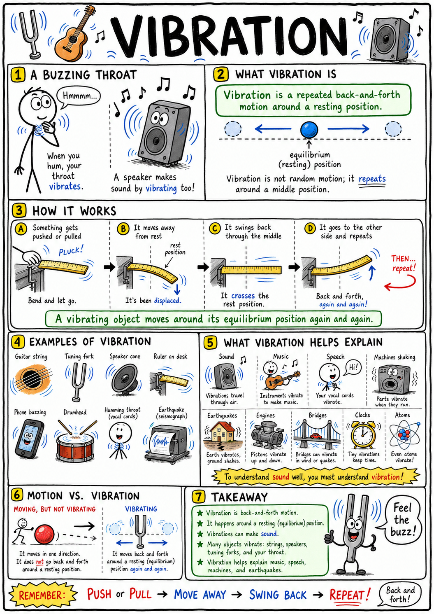
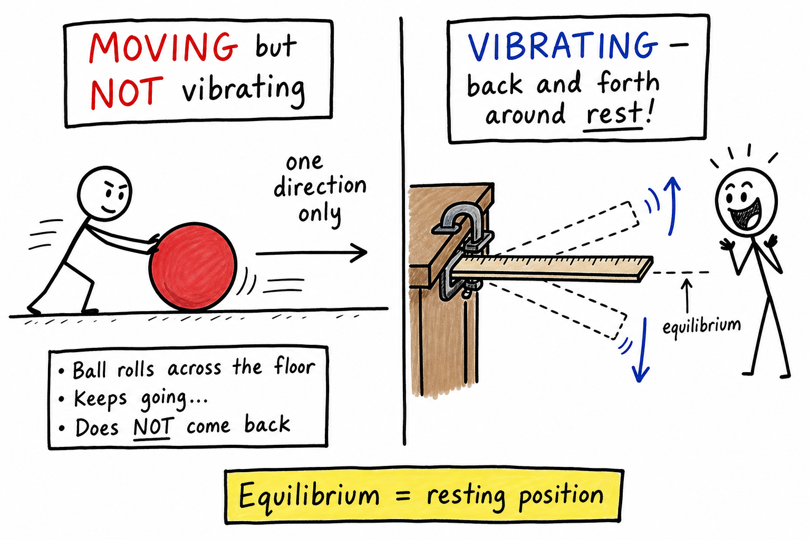
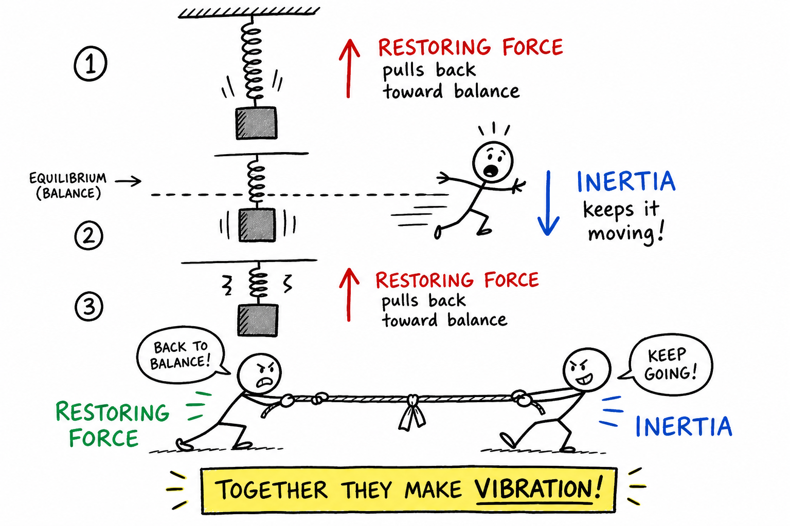
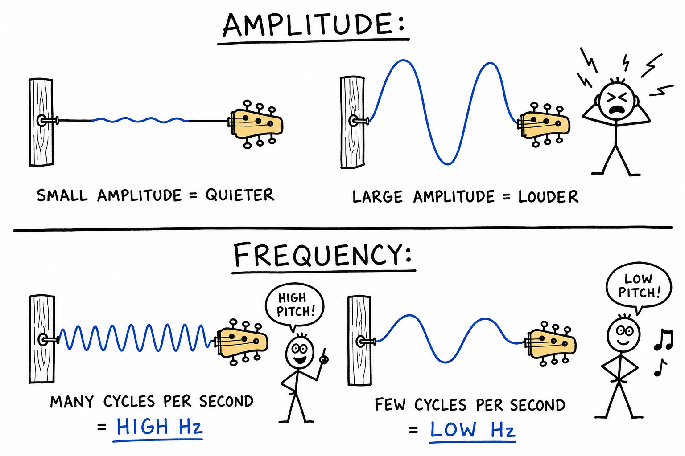
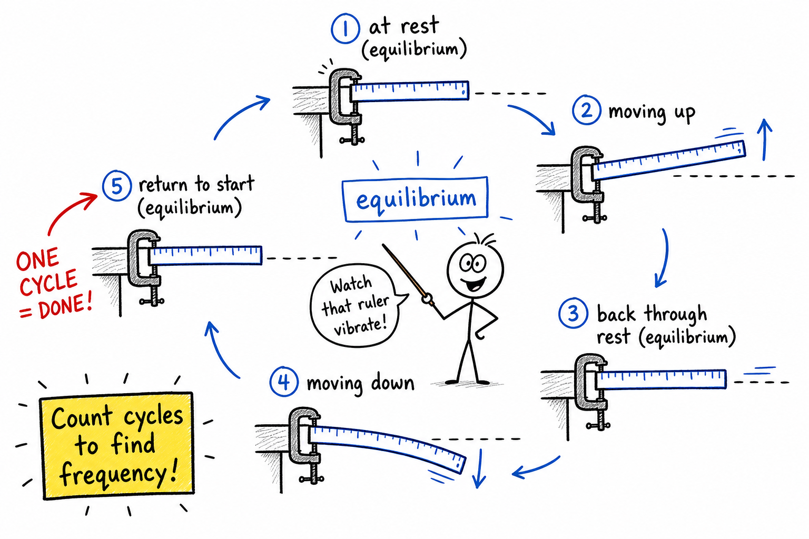
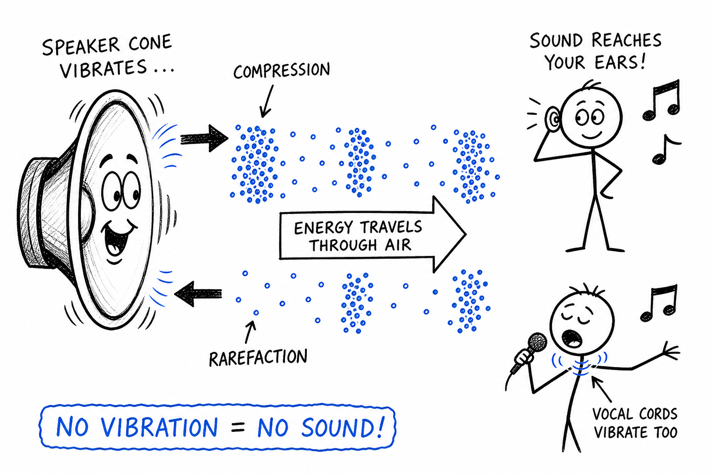
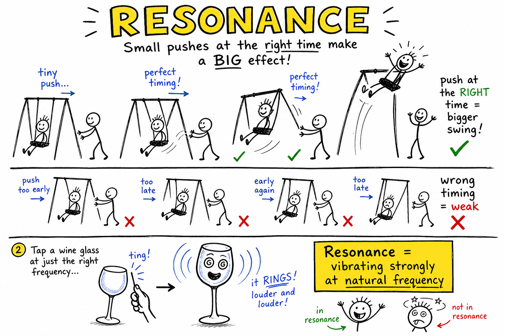
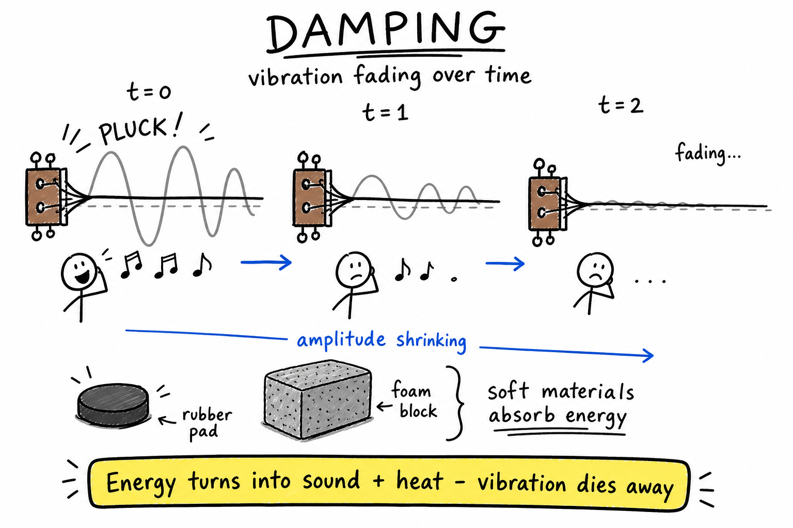
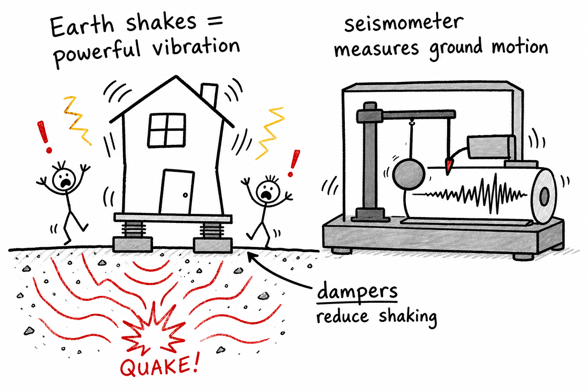

# Vibration

Put your fingers gently on your throat and hum. You can feel something buzzing. Touch the side of a speaker while music is playing softly. You may feel it shaking. Pluck a rubber band, strike a tuning fork, or watch a guitar string after it is picked. In each case, something moves back and forth.

That back-and-forth motion is vibration.

**Vibration is a repeated back-and-forth motion around a resting position.**

Vibration is one of the most important ideas in the science of sound, but it is not only about sound. Vibrations appear in machines, bridges, engines, earthquakes, musical instruments, phones, clocks, atoms, and even your own voice.

To understand sound well, you must understand vibration.

## Back and Forth

A vibration is not just any movement.

If a ball rolls across the floor, it is moving, but it is not necessarily vibrating.

If a ruler is pulled down and released so it wiggles up and down, it is vibrating.

A vibrating object moves away from a resting position, returns, moves the other way, and comes back again.

The resting position is often called the **equilibrium position**.

**Equilibrium** means a balanced or resting condition.

During vibration, the object keeps moving around that equilibrium position.

## Oscillation

Another word closely related to vibration is **oscillation**.

**Oscillation is repeated motion back and forth or up and down around an equilibrium position.**

All vibrations are oscillations, though scientists may use the words in slightly different ways depending on the situation.

A swinging pendulum oscillates. A plucked string vibrates. A mass bouncing on a spring oscillates. A tuning fork vibrates.

The common idea is repeated motion.

## What Starts a Vibration?

A vibration usually begins when something is disturbed from its resting position.

You pluck a string.

You strike a drumhead.

You tap a tuning fork.

You pull a spring and let it go.

You stomp near a puddle and send ripples outward.

In each case, energy is added to the system. That energy makes matter move.

Once the object is displaced, forces inside the object pull or push it back toward its equilibrium position.

## Restoring Force

A **restoring force** is a force that pulls or pushes an object back toward its equilibrium position.

Imagine stretching a rubber band. The rubber band pulls back. That pull is a restoring force.

Imagine pushing a diving board downward. The board pushes back upward.

Imagine compressing a spring. The spring pushes outward.

Without restoring forces, vibrations would not happen. The object would simply move away and keep going.

Restoring forces help an object return, overshoot, return again, and continue vibrating.

## Inertia

Restoring force alone is not the whole story.

**Inertia** is the tendency of matter to resist changes in motion.

When a vibrating object reaches its equilibrium position, the restoring force may be small, but the object is already moving. Because of inertia, it keeps going past the resting position.

Then the restoring force pulls it back again.

Vibration happens because restoring force and inertia work together.

The restoring force pulls the object toward balance. Inertia carries it past balance.

## Amplitude

**Amplitude** is the size of a vibration.

If a guitar string moves only a little, it has small amplitude.

If it moves a lot, it has large amplitude.

For sound, larger amplitude usually means louder sound, because the vibration creates stronger pressure changes in the air.

Amplitude does not usually decide whether the sound is high or low. Pitch depends mostly on frequency.

## Frequency

**Frequency** is how many vibrations or cycles happen each second.

Frequency is measured in **hertz**, written **Hz**.

One hertz means one vibration per second.

If a tuning fork vibrates 256 times each second, its frequency is 256 Hz.

Frequency is one of the most important measurements of vibration.

In sound, frequency is closely related to pitch.

High-frequency vibrations usually make high-pitched sounds. Low-frequency vibrations usually make low-pitched sounds.

## Period

**Period** is the time needed for one complete vibration.

If something vibrates slowly, each cycle takes more time, so the period is long.

If something vibrates quickly, each cycle takes less time, so the period is short.

Frequency and period are opposites in a useful way.

High frequency means short period.

Low frequency means long period.

For example, if a vibration happens 2 times per second, each vibration takes 1/2 second.

## One Complete Cycle

A **cycle** is one complete vibration.

For a ruler vibrating up and down, one cycle might be:

- Starting at the resting position
- Moving upward
- Returning through the resting position
- Moving downward
- Returning again to the starting condition

Scientists count cycles to measure frequency.

If 50 cycles happen in one second, the frequency is 50 Hz.

## Vibration and Sound

Sound begins with vibration.

When an object vibrates, it pushes and pulls on nearby particles of matter.

In air, the vibrating object creates compressions and rarefactions. These pressure changes travel outward as sound waves.

A speaker cone vibrates and pushes air.

A drumhead vibrates and pushes air.

A guitar string vibrates and makes the air around it vibrate, often with help from the guitar body.

Your vocal cords vibrate and create sound waves that become speech or song.

No vibration means no sound source.

## Vibration Needs Matter for Sound

The vibrating source is only the beginning.

For sound to travel, there must be a **medium**.

A medium is the material through which a wave travels.

Sound can travel through air, water, wood, metal, and many other materials. It cannot travel through a perfect vacuum because there are no particles to vibrate.

Vibration in one object can pass energy to nearby particles. Those particles pass energy to other particles. That is how sound travels.

## Resonance

Some objects vibrate especially strongly at certain frequencies.

This is called **resonance**.

**Resonance happens when an object is made to vibrate strongly at one of its natural frequencies.**

A playground swing gives a simple example. If you push at the right times, the swing goes higher and higher. If you push at the wrong times, the motion is weaker.

A guitar body resonates with the strings and helps make the sound louder.

A wine glass can ring when tapped because it vibrates at natural frequencies.

Resonance can be useful, but it can also be dangerous if vibrations become too large.

## Natural Frequency

A **natural frequency** is a frequency at which an object tends to vibrate easily.

Different objects have different natural frequencies.

Size, shape, material, stiffness, and mass all matter.

A small bell usually has a higher natural frequency than a large bell.

A tight string has a different natural frequency from a loose string.

Engineers study natural frequencies carefully so buildings, bridges, aircraft, and machines do not shake dangerously.

## Damping

Vibrations do not usually last forever.

**Damping** is the reduction of vibration over time as energy is transferred away.

If you pluck a guitar string, the sound slowly fades.

If you strike a drum, the vibration dies away.

If a bouncing ball keeps losing height, its motion is being damped.

Damping happens because energy is changed into sound, heat, and motion in surrounding materials.

Soft materials can damp vibrations well.

That is why rubber pads, foam, carpets, and shock absorbers can reduce shaking or sound.

## Forced Vibration

Sometimes one vibrating object makes another object vibrate.

This is called **forced vibration**.

If a loudspeaker plays a low tone, nearby objects may buzz.

If a truck passes by, windows may rattle.

If a guitar string vibrates, the guitar body vibrates too.

Forced vibration helps instruments produce stronger sounds. It also explains annoying rattles in cars, rooms, and machines.

## Vibration in Musical Instruments

Musical instruments control vibration.

String instruments use vibrating strings. The body of the instrument helps amplify the sound.

Wind instruments use vibrating air columns. The player changes pitch by changing the length of the air column or how the air vibrates.

Drums use vibrating membranes.

Brass instruments use vibrating lips and air columns.

Electronic speakers use vibrating cones or surfaces.

Music is organized vibration.

## Vibration in the Human Body

Your body uses and senses vibration.

Your vocal cords vibrate when you speak.

Your eardrum vibrates when sound enters your ear.

Tiny bones in the middle ear pass those vibrations inward.

Fluid and hair cells in the cochlea help turn vibration into nerve signals.

You can also feel vibrations through your skin. A phone buzzing in your hand, a bass speaker shaking the floor, or a train passing nearby can all be felt as vibration.

## Vibration in Machines

Machines often vibrate.

Engines vibrate because parts move rapidly inside them.

Washing machines vibrate if clothes are unevenly distributed.

Power tools vibrate as motors spin and blades cut.

Phones vibrate using tiny motors.

Some vibration is useful. Too much vibration can loosen screws, wear out parts, make noise, waste energy, or cause damage.

Engineers try to control vibration with balancing, damping, rubber mounts, bearings, and careful design.

## Vibration in Buildings and Bridges

Large structures can vibrate too.

Bridges may vibrate when people walk, vehicles pass, wind blows, or earthquakes shake the ground.

Tall buildings can sway in strong winds.

This does not always mean they are unsafe. Many structures are designed to move a little rather than crack.

But engineers must understand natural frequency, resonance, damping, and strength.

If a structure vibrates too much at the wrong frequency, it can become dangerous.

## Earthquakes

Earthquakes are powerful vibrations of the ground.

Energy released inside Earth travels as seismic waves.

These waves shake buildings, roads, bridges, and land.

Earthquake engineering is partly the science of helping structures survive vibration.

Buildings may use flexible materials, deep foundations, braces, dampers, or base isolators to reduce damaging motion.

Earthquakes remind us that vibration is not always small or harmless.

## Measuring Vibration

Vibration can be measured in several ways.

Scientists and engineers may measure:

- Frequency: how many cycles per second
- Amplitude: how large the motion is
- Period: how long one cycle takes
- Direction: which way the vibration moves
- Acceleration: how quickly motion changes

Tools such as microphones, accelerometers, seismometers, and vibration sensors can detect vibrations.

A **seismometer** measures ground motion from earthquakes.

An **accelerometer** can measure changes in motion and is used in phones, vehicles, games, and engineering tests.

## Helpful Vibrations

Vibration can be useful.

Examples include:

- Speakers making sound
- Musical instruments making notes
- Electric toothbrushes cleaning teeth
- Phones silently alerting users
- Medical ultrasound imaging
- Industrial tools compacting soil or concrete
- Watches and clocks keeping time
- Machines sorting materials

Vibration is not just a problem. It is also a tool.

## Harmful Vibrations

Vibration can also cause trouble.

It can loosen bolts, crack materials, damage machines, annoy people, or injure hands and arms after long exposure.

Loud sound is also vibration, and loud sound can damage hearing.

Workers who use vibrating tools for long periods may need special safety rules.

Engineers study harmful vibration so they can reduce it before it causes failure.

## Common Misconceptions

One mistake is thinking vibration always means sound. Many vibrations are too small, too slow, too fast, or too weak to hear.

Another mistake is thinking an object has to move a large distance to vibrate. Many vibrations are tiny but still important.

A third mistake is thinking vibration always means danger. Controlled vibration can be helpful.

A fourth mistake is thinking sound travels because air moves from the source to your ear. The air particles mostly vibrate back and forth while energy travels through them.

## Safety with Vibration

Vibration safety depends on the situation.

Good habits include:

- Keep hearing protection near loud tools and machines.
- Do not put vibrating objects close to your ear.
- Stop using a tool if it causes pain, numbness, or tingling.
- Keep machine parts tightened and balanced.
- Do not stand on or climb structures that are shaking unexpectedly.
- Report rattling, shaking, or buzzing machinery to an adult.
- During an earthquake, follow local safety instructions.
- Treat powerful vibration as a sign to pay attention.

Small vibrations can be fun and useful. Strong vibrations deserve respect.

## The Big Idea

Vibration is repeated back-and-forth motion around a resting position.

Vibration begins when energy disturbs an object. Restoring forces and inertia keep the motion going. Frequency tells how fast the vibration happens. Amplitude tells how large it is. Vibration creates sound, drives music, shakes machines, helps technology work, and must be controlled in buildings and tools.

If you remember only one sentence, remember this:

**Vibration is repeated motion around a resting position, and it is the physical source of sound.**

## Study Questions

1. What is vibration?
2. What is an equilibrium position?
3. What is oscillation?
4. What usually starts a vibration?
5. What is a restoring force?
6. Why is inertia important in vibration?
7. What is amplitude?
8. How is amplitude related to loudness in sound?
9. What is frequency?
10. What unit is frequency measured in?
11. What does one hertz mean?
12. How is frequency related to pitch?
13. What is period?
14. How are frequency and period related?
15. What is one complete cycle?
16. How does vibration create sound?
17. Why does sound need a medium?
18. What is resonance?
19. What is a natural frequency?
20. Name three things that can affect an object's natural frequency.
21. What is damping?
22. Give two examples of materials or devices that can damp vibration.
23. What is forced vibration?
24. How do musical instruments use vibration?
25. How does the human body use or sense vibration?
26. Give two examples of useful vibration.
27. Give two examples of harmful vibration.
28. What does a seismometer measure?
29. What are three safety rules related to vibration?
30. In your own words, explain why vibration is important for understanding sound.
