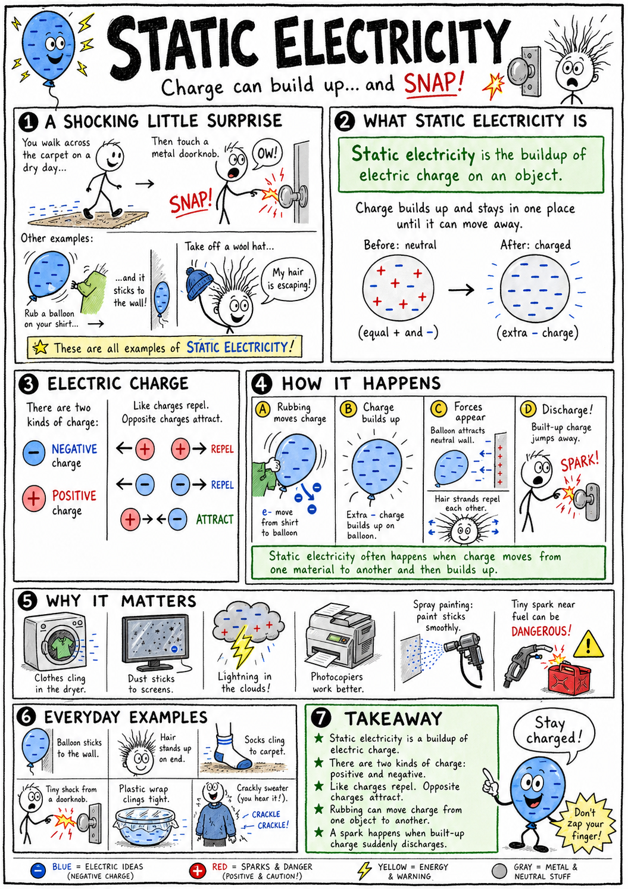

# Static electricity

Walk across a carpet on a dry winter day, then touch a metal doorknob. Snap! A tiny spark jumps to your finger. Pull a wool hat off your head, and your hair may stand up like it is trying to escape. Rub a balloon on your shirt, and it may stick to a wall.

These are not magic tricks. They are examples of static electricity.

**Static electricity is the buildup of electric charge on an object.**

Static electricity can be surprising, funny, useful, annoying, and sometimes dangerous. It helps explain sparks, clinging clothes, dust sticking to screens, lightning, photocopiers, paint sprayers, and the tiny forces between atoms.

To understand static electricity, we must begin with electric charge.

## Electric Charge

**Electric charge** is a property of matter that can cause electric forces.

There are two main kinds of electric charge:

- Positive charge
- Negative charge

Objects with electric charge can push or pull on other charged objects.

The rule is simple:

**Like charges repel, and opposite charges attract.**

Two positive charges repel each other.

Two negative charges repel each other.

A positive charge and a negative charge attract each other.

This rule is at the heart of static electricity.

## Atoms and Charge

Everything around you is made of atoms.

Atoms contain tiny particles.

**Protons** have positive charge.

**Electrons** have negative charge.

**Neutrons** have no electric charge.

Protons and neutrons are found in the nucleus at the center of an atom. Electrons are found outside the nucleus.

Most atoms normally have equal numbers of protons and electrons, so their positive and negative charges balance.

An object with balanced positive and negative charges is **neutral**.

Neutral does not mean it has no charges. It means the charges balance overall.

## Electrons Move More Easily

In ordinary static electricity, protons usually stay locked inside the nuclei of atoms.

Electrons are the particles that move more easily from one object to another.

If an object gains extra electrons, it becomes negatively charged.

If an object loses electrons, it becomes positively charged.

This is why rubbing a balloon on hair can charge both objects. Electrons may move from one material to the other.

One object ends up with extra negative charge. The other is left with more positive charge.

## Static Means Not Flowing

The word **static** means not moving or staying in one place.

In static electricity, electric charge builds up on an object instead of flowing steadily through a circuit.

This is different from the electric current that powers a lamp, computer, or fan.

**Electric current** is the flow of electric charge.

Static electricity is a buildup of charge.

Current electricity is moving charge.

They are related, but they are not the same thing.

## Charging by Friction

One common way to make static electricity is **charging by friction**.

**Charging by friction happens when rubbing causes electrons to move from one material to another.**

When you rub a balloon on wool, hair, or cloth, electrons may transfer between the materials.

The rubbing does not create charge from nothing. It separates charge that was already there.

After rubbing, the balloon and the cloth may have opposite charges.

That is why a balloon can attract hair, paper bits, or a wall.

## Charging by Contact

Another way to charge an object is by contact.

**Charging by contact happens when a charged object touches another object and transfers some charge to it.**

If a negatively charged rod touches a neutral metal sphere, some electrons may move onto the sphere.

The sphere can become negatively charged too.

Charging by contact requires touching.

It is one reason sparks can happen when charge suddenly moves between objects.

## Charging by Induction

Objects can also be charged without direct touching.

**Charging by induction happens when a charged object causes charges in a nearby object to rearrange.**

Suppose a negatively charged balloon is brought near a neutral wall.

The negative charge on the balloon repels electrons in the wall slightly away from the balloon. The nearby surface of the wall becomes a little more positive.

The positive side of the wall attracts the negative balloon.

That is why the balloon can stick to the wall even though the wall was neutral overall.

Induction is charge rearrangement caused by a nearby charged object.

## Polarization

A neutral object can still be attracted to a charged object because of **polarization**.

**Polarization** is the slight separation or shifting of positive and negative charges within an object.

The object may still be neutral overall, but one side becomes slightly more positive and the other side slightly more negative.

This helps explain why charged balloons attract small bits of paper.

The paper is neutral overall, but its charges shift slightly. The side closer to the balloon becomes attracted more strongly than the far side is repelled.

The result is attraction.

## Conductors

Some materials allow electric charge to move easily.

These materials are called **conductors**.

Metals are good conductors because some of their electrons can move through the material.

Copper, aluminum, silver, and steel conduct electricity well.

If static charge builds up on a conductor, it may spread out over the surface or move away through another conductor.

This is why touching a metal doorknob after walking across a carpet can produce a spark.

Your body and the metal provide a path for charge to move quickly.

## Insulators

Some materials do not allow electric charge to move easily.

These materials are called **insulators**.

Rubber, plastic, glass, dry air, wool, and many fabrics can act as insulators.

Insulators are often good at holding static charge in one place.

That is why a plastic comb, rubber balloon, or synthetic sweater can become statically charged.

Insulators do not stop all electric effects, but they make charge movement much harder.

## Grounding

**Grounding** means providing a path for electric charge to move safely into or out of Earth.

Earth is so large that it can accept or supply charge without changing much.

If a charged object is connected to the ground by a conductor, excess charge can move away.

Grounding reduces static buildup.

Many electrical systems use grounding for safety. Fuel trucks, electronics factories, and lightning protection systems also use grounding to reduce dangerous sparks.

When you touch a metal object after building up charge, you may be briefly grounding yourself through that object.

## Sparks

A **spark** is a sudden movement of electric charge through air.

Air is usually an insulator. But if the electric force becomes strong enough, charge can force its way through the air.

The air becomes ionized, meaning some atoms lose or gain electrons.

The moving charge heats the air and gives off light.

That tiny snap you feel after walking on carpet is a small spark.

Lightning is a huge spark.

## Lightning

Lightning is one of the most powerful examples of static electricity.

Inside storm clouds, collisions among water droplets, ice crystals, and air currents can separate charges.

Different parts of the cloud become charged. The ground below may also become charged by induction.

When the electric difference becomes large enough, charge moves suddenly through the air.

That movement is lightning.

Lightning can travel between clouds, within a cloud, or between a cloud and the ground.

It is extremely hot and dangerous.

Thunder is the sound made when lightning rapidly heats air, causing it to expand explosively.

## Static Cling

Static electricity explains static cling in clothes.

When clothes tumble in a dryer, different fabrics rub together. Electrons can transfer between materials.

Some clothes become positively charged, and others become negatively charged.

Opposite charges attract, so the clothes cling together.

Dry air makes static cling worse because charge does not leak away easily.

Dryer sheets and fabric softeners can reduce static by making charge buildup less likely.

## Hair Standing Up

When a person touches a charged object, some charge may spread onto the hair.

If many hairs receive the same kind of charge, they repel each other.

That repulsion makes the hairs spread apart and stand up.

This is often shown with a Van de Graaff generator, a device that can build up large static charges.

Such demonstrations should only be done with proper equipment and adult supervision.

## Why Dry Days Are Sparky

Static electricity is more noticeable on dry days.

Water vapor in humid air helps charge leak away from surfaces.

Dry air is a better insulator, so charge can build up more easily.

That is why static shocks are common in winter in heated indoor air.

Carpets, socks, blankets, plastic objects, and synthetic fabrics can all help charge build up.

## Static Electricity and Dust

Static electricity can attract dust.

A charged screen, plastic surface, or balloon can pull on tiny neutral dust particles by polarization.

This is why dust may cling to television screens, computer monitors, plastic containers, or fan blades.

Static electricity can be annoying, but this attraction can also be useful.

Some air cleaners use electric charge to help collect dust and smoke particles.

## Useful Static Electricity

Static electricity is not just a nuisance.

It has useful applications.

Examples include:

- Photocopiers and laser printers using charged areas to attract toner
- Electrostatic paint sprayers helping paint stick evenly to surfaces
- Air cleaners attracting dust particles
- Industrial powder coating
- Separating materials in recycling or mining
- Scientific instruments that move or detect charged particles

Engineers use static electricity carefully because it can control tiny particles.

## Static Electricity in Electronics

Static electricity can damage delicate electronic parts.

A small spark that a person barely feels may harm a computer chip.

This is called **electrostatic discharge**, or **ESD**.

People who build or repair computers often use grounding straps, antistatic mats, and special packaging to prevent static damage.

Electronic parts may be small, but they can be very sensitive to sudden charge movement.

## Electric Fields

Charged objects affect the space around them.

An **electric field** is the region around a charged object where electric forces can act.

You cannot see an electric field directly, but you can observe its effects.

A charged balloon attracting hair shows the effect of an electric field.

Bits of paper jumping toward a charged comb also show an electric field at work.

Electric fields help explain how charged objects can push or pull without touching.

## Static Electricity and Energy

Static electricity involves energy.

It takes energy to separate charges.

Rubbing materials together, moving through dry air, or storm cloud motion can separate charges and store electrical potential energy.

When charge suddenly moves, that stored energy may become light, heat, sound, and motion.

A spark is a quick release of stored electrical energy.

Lightning is a massive release.

## Static Electricity Compared with Magnetism

Static electricity and magnetism are related parts of electromagnetism, but they are not the same.

Static electricity involves electric charges at rest or built up on objects.

Magnetism involves magnetic fields, moving charges, and certain materials such as iron.

A charged balloon can attract paper because of electric forces, not because it has become an ordinary magnet.

This distinction helps avoid confusion.

## Common Misconceptions

One mistake is thinking rubbing creates electric charge from nothing. Rubbing usually transfers electrons and separates charge that already existed.

Another mistake is thinking neutral objects have no charges. Neutral objects have positive and negative charges that balance overall.

A third mistake is thinking only metal can be involved in static electricity. Insulators such as plastic, rubber, and wool often hold static charge very well.

A fourth mistake is thinking small shocks and lightning are completely different. They differ enormously in size, but both involve sudden movement of electric charge.

## Safety with Static Electricity

Most everyday static shocks are harmless, but static electricity deserves respect.

Good safety habits include:

- Never play outside during thunderstorms.
- If thunder is heard, go indoors or into a hard-topped vehicle.
- Stay away from tall isolated objects during lightning storms.
- Do not handle fuel, gas cans, or flammable vapors carelessly around static sparks.
- Ground yourself before handling sensitive electronics.
- Follow adult instructions around Van de Graaff generators or other high-voltage demonstrations.
- Do not use static electricity experiments near medical devices, electronics, or flammable materials.
- Remember that lightning is deadly, not a toy.

Static electricity can be fun to study, but safety comes first.

## The Big Idea

Static electricity is the buildup of electric charge on objects.

It happens when electrons are transferred or charges rearrange. Like charges repel, opposite charges attract, and neutral objects can be attracted by polarization. Static electricity explains sparks, clinging clothes, charged balloons, dust attraction, lightning, and some important technologies.

If you remember only one sentence, remember this:

**Static electricity is built-up electric charge, usually caused by electrons moving or rearranging between materials.**

## Study Questions

1. What is static electricity?
2. What is electric charge?
3. What are the two main kinds of electric charge?
4. What happens when like charges are near each other?
5. What happens when opposite charges are near each other?
6. What charge does a proton have?
7. What charge does an electron have?
8. What does it mean for an object to be neutral?
9. In ordinary static electricity, which particles usually move more easily: protons or electrons?
10. What happens when an object gains extra electrons?
11. What happens when an object loses electrons?
12. How is static electricity different from electric current?
13. What is charging by friction?
14. Why does rubbing not create charge from nothing?
15. What is charging by contact?
16. What is charging by induction?
17. What is polarization?
18. Why can a charged balloon stick to a neutral wall?
19. What is a conductor?
20. Give two examples of conductors.
21. What is an insulator?
22. Give two examples of insulators.
23. What is grounding?
24. What is a spark?
25. Why is lightning an example of static electricity?
26. Why is static electricity often stronger on dry days?
27. How can static electricity damage electronics?
28. What is an electric field?
29. Give two useful applications of static electricity.
30. What are three safety rules for static electricity or lightning?
