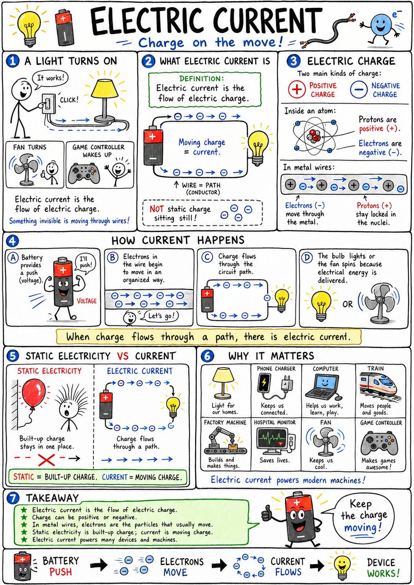

# Electric current

Flip a switch, and a lamp lights the room. Press a button, and a game controller wakes up. Plug in a fan, and its blades begin to spin. Inside each of these ordinary moments, something invisible is moving through wires.

That moving something is electric charge.

**Electric current is the flow of electric charge.**

Electric current powers homes, phones, computers, trains, factories, hospitals, and nearly every modern machine. It is one of the chief reasons the modern world looks so different from the world of a few centuries ago.

To understand electric current, we must begin with charge.

## Electric Charge

**Electric charge** is a property of matter that can cause electric forces.

There are two main kinds of electric charge:

- Positive charge
- Negative charge

Protons have positive charge. Electrons have negative charge.

In solid metal wires, the particles that usually move are electrons. The protons are locked inside the nuclei of atoms and do not travel down the wire.

When many electrons move in an organized way through a conductor, there is an electric current.

## Static Electricity and Electric Current

Static electricity and electric current both involve electric charge, but they are not the same.

**Static electricity** is the buildup of electric charge on an object.

**Electric current** is the flow of electric charge through a path.

A charged balloon sticking to a wall is an example of static electricity. A flashlight shining because charge flows through its circuit is an example of electric current.

Static electricity is built-up charge.

Electric current is moving charge.

## Current Needs a Path

Electric current does not flow just anywhere. It needs a path.

That path is usually made of conductors, such as metal wires.

A **conductor** is a material that allows electric charge to move easily.

Common conductors include:

- Copper
- Aluminum
- Silver
- Gold
- Iron
- Steel

Copper is used in many electrical wires because it conducts well, bends easily, and is less expensive than silver or gold.

## Insulators

An **insulator** is a material that does not allow electric charge to move easily.

Common insulators include:

- Rubber
- Plastic
- Glass
- Dry wood
- Dry air
- Cloth

Insulators are just as important as conductors. The copper wire inside a cord carries current, while the plastic or rubber coating around it helps keep the current where it belongs.

Without insulation, wires could shock people, start fires, or cause short circuits.

## Circuits

An **electric circuit** is a complete path through which electric current can flow.

A simple circuit may include:

- A source of electrical energy, such as a battery
- Conducting wires
- A device that uses electrical energy, such as a bulb, buzzer, or motor
- A switch to open or close the path

For current to flow steadily, the circuit must be closed.

A **closed circuit** is a complete, unbroken path.

An **open circuit** has a gap or break, so current cannot flow through the whole path.

When you turn a light switch on, you usually close a circuit. When you turn it off, you open the circuit.

## Batteries

A **battery** is a device that uses chemical energy to push electric charge through a circuit.

A battery has two terminals:

- Positive terminal
- Negative terminal

Inside the battery, chemical reactions create a difference in electric potential between the terminals. This difference can push charge through a circuit when the terminals are connected by a conducting path.

A battery does not create electrons from nothing. The wires and circuit materials already contain electrons. The battery supplies energy that helps move them.

## Voltage

**Voltage** is electric potential difference, or the electric push that can move charge through a circuit.

Voltage is measured in **volts**, named after Alessandro Volta, an early scientist of electricity.

A higher voltage can push charge more strongly. That is why a 9-volt battery can push charge through some circuits more strongly than a 1.5-volt battery.

Voltage is not the same thing as current.

Voltage is the push.

Current is the flow.

A helpful comparison is water in pipes. Voltage is like water pressure. Current is like the amount of water flowing past a point each second.

The comparison is not perfect, but it is useful.

## Amperes

Electric current is measured in **amperes**, often shortened to **amps**.

One ampere means a certain amount of electric charge is flowing past a point each second.

The symbol for current is usually **I**.

The symbol for ampere is **A**.

For example, a small electronic device may use a tiny fraction of an ampere. A powerful appliance may use many amperes.

Current is not just whether electricity is present. It tells how much charge is flowing.

## Resistance

**Resistance** is how much a material or device opposes the flow of electric current.

Resistance is measured in **ohms**.

In many textbooks, ohms are shown with the Greek letter omega, but the word **ohm** is enough for this chapter.

High resistance makes current harder to push through.

Low resistance lets current flow more easily.

A long, thin wire usually has more resistance than a short, thick wire of the same material. Some materials naturally resist current more than others.

Resistance is not always bad. It can be useful.

The glowing wire inside an old-style incandescent light bulb has resistance. As current flows through it, the wire becomes hot and glows.

Heating elements in toasters, electric kettles, and space heaters also use resistance.

## Ohm's Law

One of the most important rules in electric circuits is **Ohm's law**.

Ohm's law connects voltage, current, and resistance.

It is written:

**V = I x R**

This means:

- **V** is voltage, measured in volts
- **I** is current, measured in amperes
- **R** is resistance, measured in ohms

If voltage increases and resistance stays the same, current increases.

If resistance increases and voltage stays the same, current decreases.

For example, imagine pushing water through a hose. More pressure gives more flow. A narrower or clogged hose gives less flow. In a circuit, voltage is like the pressure, resistance is like the difficulty of the path, and current is the flow.

Ohm's law is simple, but it is powerful. Engineers use it constantly.

## Series Circuits

A **series circuit** has only one path for current.

In a series circuit, current must pass through each device one after another.

If one part of a series circuit is broken, the whole circuit stops working. Old strings of holiday lights often worked this way. If one bulb failed, the entire string could go dark.

In a series circuit, adding more bulbs or devices usually increases total resistance and reduces current, so bulbs may glow dimmer.

## Parallel Circuits

A **parallel circuit** has more than one path for current.

In a parallel circuit, current can split and travel through different branches.

If one branch is broken, current may still flow through the other branches. This is why one lamp in a house can be turned off while other lamps stay on.

Most home wiring uses parallel circuits because devices need to work independently.

Parallel circuits are especially useful when many devices must share the same voltage source but turn on and off separately.

## Switches

A **switch** is a device that opens or closes a circuit.

When a switch is closed, the circuit path is complete and current can flow.

When a switch is open, there is a gap and current stops flowing through that path.

Switches can be simple, like a wall switch or flashlight button. They can also be tiny and complex, like the switches inside a computer chip.

A switch gives control over electric current.

## Short Circuits

A **short circuit** is an unintended path with very low resistance.

Because the path has low resistance, too much current may flow.

Short circuits can be dangerous. They may cause wires to overheat, damage batteries, start fires, or ruin electrical equipment.

This is why circuits need proper insulation, careful wiring, and protective devices.

In a classroom, a battery connected directly from one terminal to the other with only a wire can create a short circuit. The wire and battery may become hot quickly.

Never short-circuit a battery on purpose.

## Fuses and Circuit Breakers

Electrical systems need protection from too much current.

A **fuse** is a safety device with a thin piece of metal that melts if too much current flows. When it melts, the circuit opens and current stops.

A **circuit breaker** is a safety switch that opens a circuit when too much current flows. Unlike many fuses, a breaker can usually be reset.

Fuses and circuit breakers help prevent overheating and fires.

They do not make electricity harmless. They are safety devices, not permission to be careless.

## Direct Current

**Direct current**, or **DC**, is electric current that flows in one direction.

Batteries produce direct current.

Flashlights, remote controls, many toys, and many small electronic devices use DC.

In a simple battery circuit, electrons drift through the wire in one overall direction. The energy travels through the circuit and powers the device.

## Alternating Current

**Alternating current**, or **AC**, is electric current that repeatedly changes direction.

The electricity supplied to homes and schools is usually AC.

In many countries, household current changes direction many times each second. AC is useful because it can be sent long distances through power lines efficiently when used with transformers.

Do not experiment with household wall outlets. They can deliver dangerous current and voltage.

Classroom circuit work should use safe, low-voltage batteries or approved power supplies.

## Electron Flow and Conventional Current

There is one confusing point in electricity that good students should know.

In metal wires, electrons actually move from the negative side of a battery toward the positive side.

However, scientists often draw **conventional current** as flowing from positive to negative.

Why?

The convention was chosen before electrons were understood. Scientists kept using it because it was already built into diagrams and calculations.

This means two descriptions are common:

- **Electron flow** goes from negative to positive in a metal wire.
- **Conventional current** is drawn from positive to negative.

Both can be useful, as long as you know which one is being used.

## Electric Energy

Electric current can transfer energy.

That energy may become:

- Light in a bulb or screen
- Motion in a motor
- Heat in a toaster
- Sound in a speaker
- Magnetism in an electromagnet
- Chemical change in a rechargeable battery

Electric current itself is not "used up" in the same simple way fuel is burned. The circuit transfers energy from a source to devices that transform that energy into other forms.

For example, a battery's chemical energy can become electrical energy in a circuit and then light and heat in a bulb.

## Power

**Electric power** is the rate at which electrical energy is transferred or used.

Power is measured in **watts**.

A brighter bulb or stronger motor usually uses more power than a dim bulb or tiny motor.

Power can be calculated by multiplying voltage and current:

**P = V x I**

This means:

- **P** is power in watts
- **V** is voltage in volts
- **I** is current in amperes

For example, if a device uses 2 amperes at 10 volts, its power is 20 watts.

## Current and Magnetism

Electric current and magnetism are closely connected.

A current flowing through a wire creates a magnetic field around the wire.

If the wire is coiled, the magnetic field becomes stronger and more organized. If the coil is wrapped around an iron core, it can become an electromagnet.

This is how electric current can make magnetism.

Motors, generators, speakers, doorbells, relays, and many machines depend on the connection between current and magnetism.

## Current in the Human Body

The human body uses tiny electric signals.

Nerves send signals partly by moving charged particles across cell membranes. Muscles, including the heart, depend on electrical activity to work properly.

Doctors can measure some of this activity. An electrocardiogram, or ECG, records electrical activity from the heart.

This does not mean the body is safe around strong electric current. Quite the opposite. Outside electric current can interfere with nerves, muscles, breathing, and the heart.

Electric shock can be dangerous or deadly.

## Electrical Safety

Electric current is useful because it transfers energy. It is dangerous for the same reason.

Good safety habits include:

- Never put objects into electrical outlets.
- Never touch damaged cords, bare wires, or exposed metal parts of electrical devices.
- Keep electrical devices away from water unless they are designed for that use.
- Do not overload outlets or extension cords.
- Do not short-circuit batteries.
- Disconnect classroom battery circuits when not in use.
- Use only low-voltage batteries for student experiments.
- Ask an adult before using unfamiliar electrical equipment.
- Stay away from fallen power lines.
- Go indoors during thunderstorms.

Electricity deserves respect. Safe habits make experiments and technology useful instead of dangerous.

## Common Misconceptions

One mistake is thinking current is the same as voltage. Voltage is the electric push. Current is the flow of charge.

Another mistake is thinking a battery creates electrons. The circuit already contains electrons. The battery supplies energy to move charge.

A third mistake is thinking current gets "used up" as it travels through a circuit. Energy is transferred to devices, but charge continues around a closed circuit.

A fourth mistake is thinking all circuits are safe if the device is small. Even small batteries can heat wires during a short circuit, and wall electricity is especially dangerous.

A fifth mistake is thinking electrons race through wires as fast as light. Individual electrons drift slowly, but electrical effects travel through a circuit very quickly.

## The Big Idea

Electric current is the flow of electric charge.

Current needs a complete circuit and usually flows through conductors such as metal wires. Voltage provides the electric push, resistance opposes the flow, and current is measured in amperes. Circuits can be open or closed, series or parallel, direct current or alternating current. Electric current transfers energy and can produce light, heat, motion, sound, magnetism, and chemical change.

If you remember only one sentence, remember this:

**Electric current is flowing electric charge in a complete path, driven by voltage and limited by resistance.**

## Study Questions

1. What is electric current?
2. What is electric charge?
3. Which particles usually move through solid metal wires: protons or electrons?
4. How is electric current different from static electricity?
5. What is a conductor?
6. Give three examples of conductors.
7. What is an insulator?
8. Give three examples of insulators.
9. What is an electric circuit?
10. What is the difference between a closed circuit and an open circuit?
11. What does a battery do in a circuit?
12. What are the two terminals of a battery called?
13. What is voltage?
14. What unit is voltage measured in?
15. What is current measured in?
16. What is resistance?
17. What unit is resistance measured in?
18. What does Ohm's law connect?
19. What happens to current if voltage increases and resistance stays the same?
20. What happens to current if resistance increases and voltage stays the same?
21. What is a series circuit?
22. What is a parallel circuit?
23. Why do homes usually use parallel circuits rather than simple series circuits?
24. What does a switch do?
25. What is a short circuit, and why can it be dangerous?
26. What do fuses and circuit breakers do?
27. What is the difference between direct current and alternating current?
28. What is the difference between electron flow and conventional current?
29. Name four forms of energy or effects that electric current can produce.
30. What are three important electrical safety rules?
