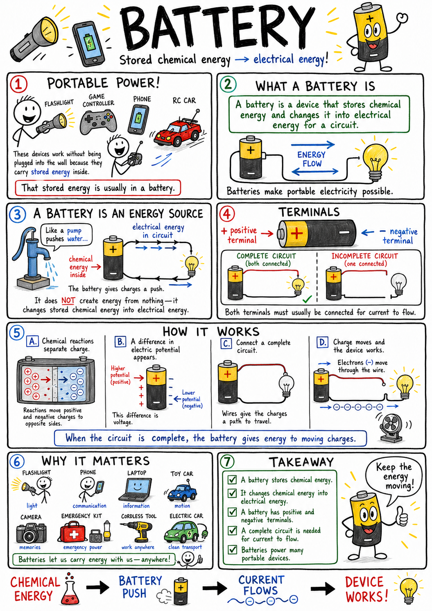
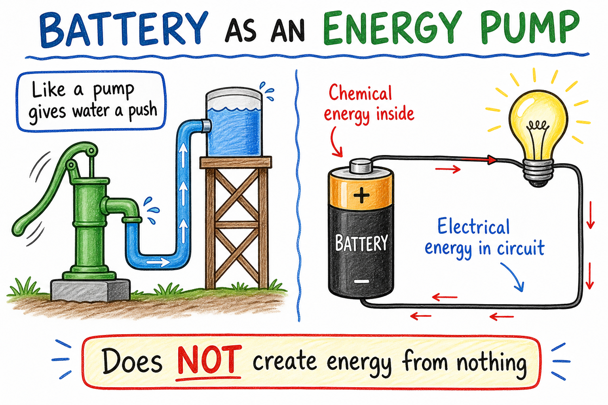
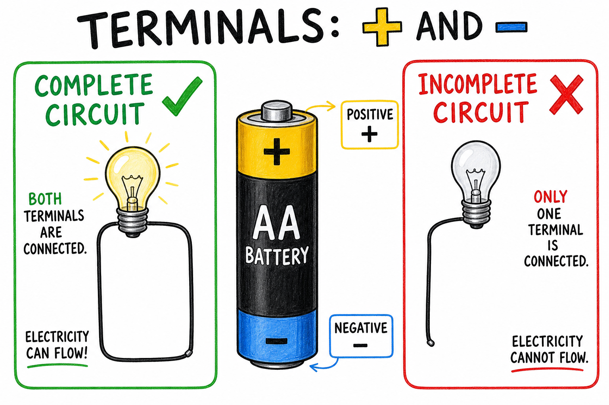
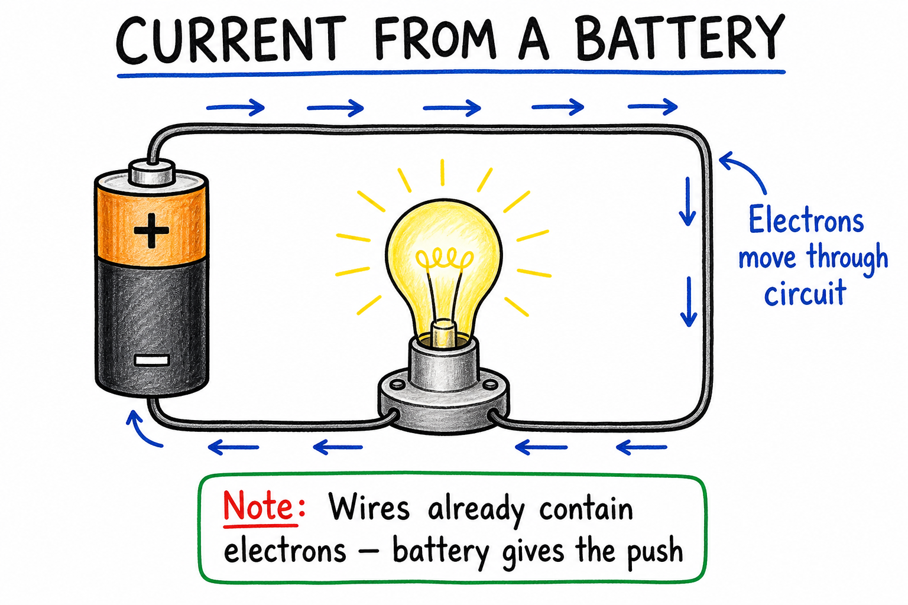
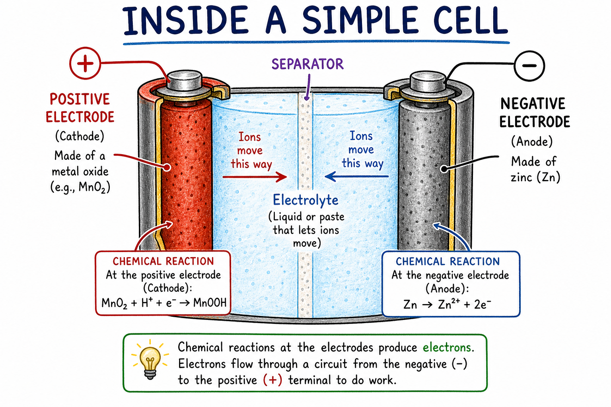
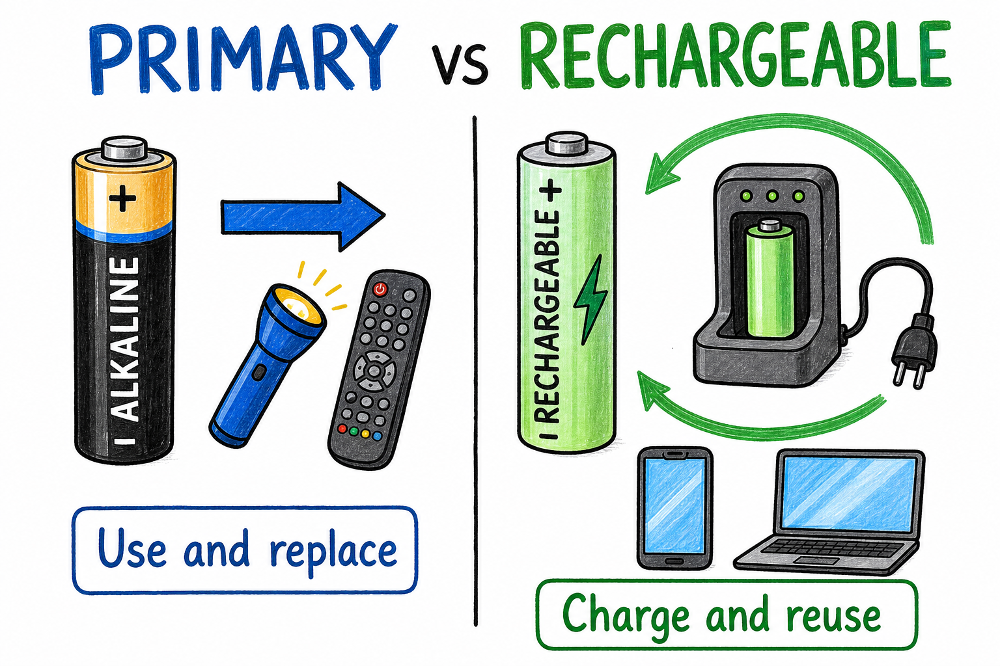
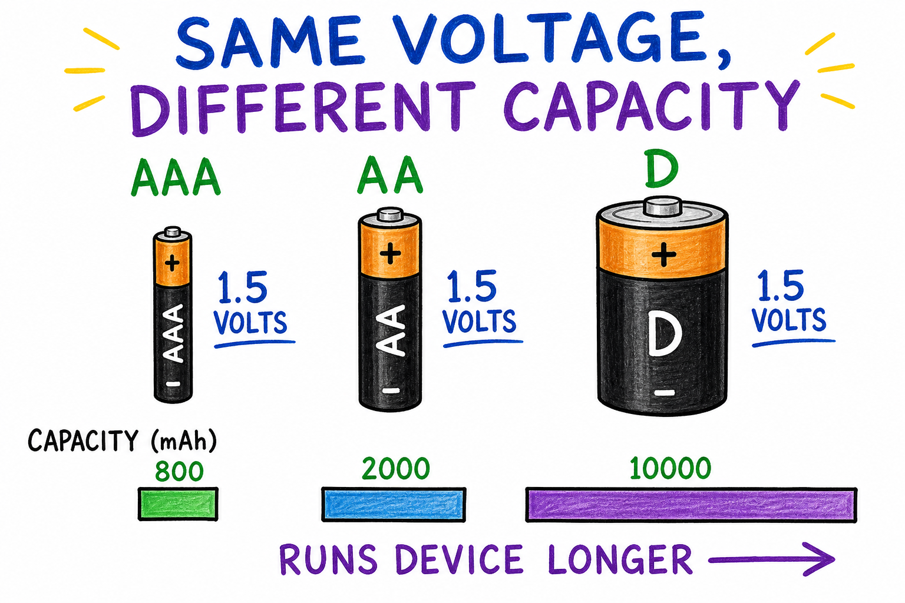
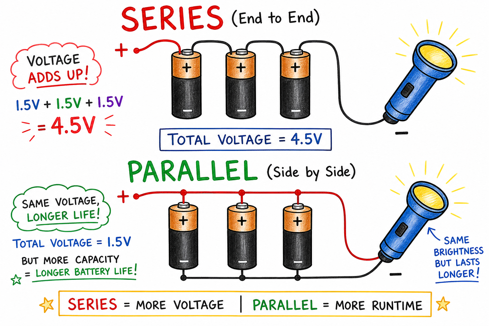
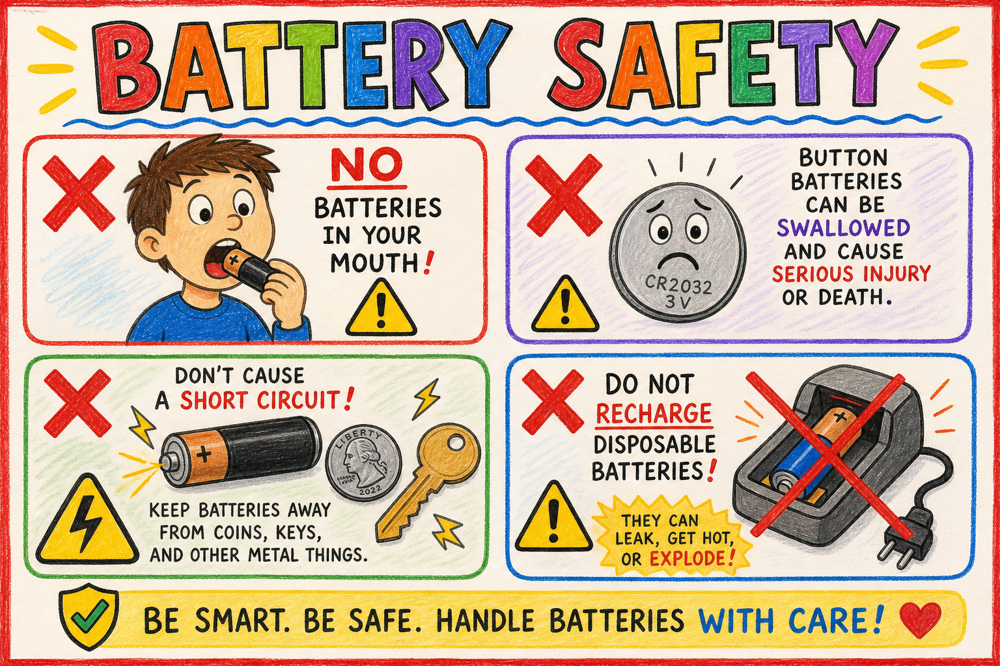

# Battery

You are camping at night when your flashlight clicks off. You swap in a fresh battery, click it on, and light floods the tent again. Your game controller dies in the middle of a match. You plug it in, wait while it charges, and jump back into the game. A drone sits on the ground because its battery is empty. You slide in a charged pack, and the rotors spin up.

None of these devices were plugged into a wall outlet. Each one carried its own small store of energy inside.

That store is usually a **battery**.

**A battery is a device that stores chemical energy and changes it into electrical energy for a circuit.**

Batteries make portable electricity possible. They let people carry light, sound, motion, information, and communication in pockets, backpacks, cars, tools, and emergency kits.

To understand a battery, we must understand what it does in a circuit.

## A Battery Is an Energy Source

A battery does not create energy from nothing.

Instead, it changes stored **chemical energy** into **electrical energy**.

Inside a battery are materials that can react chemically. These reactions separate electric charge and create a difference in electric potential between two terminals.

When the battery is connected to a complete circuit, the battery gives energy to charges in the circuit. The charges move, and electric current flows.

The battery is like a pump for electric charge. It does not make the water in the pipes, but it gives the push that keeps the flow moving.

## Terminals

A battery has two ends or contact points called **terminals**.

The two terminals are:

- Positive terminal
- Negative terminal

On many batteries, the positive terminal is marked with a plus sign: **+**.

The negative terminal is marked with a minus sign: **-**.

For a battery to power a device, both terminals must usually be connected into a circuit. If only one terminal is connected, there is no complete path for current.

That is why a flashlight with one battery inserted backward, or a loose contact in a toy, may not work even when the battery still has energy inside.

## Electric Potential Difference

A battery creates an electric potential difference between its terminals.

This difference is called **voltage**.

**Voltage is the electric push that can move charge through a circuit.**

Voltage is measured in **volts**.

A common AA battery has about 1.5 volts. A rectangular household battery often has 9 volts. A car battery is usually about 12 volts.

Higher voltage can push charge more strongly, but voltage alone does not tell the whole story. The circuit's resistance also matters.

## Current from a Battery

When a battery is connected to a closed circuit, electric current can flow.

**Electric current is the flow of electric charge.**

In metal wires, the moving charges are usually electrons. The battery supplies energy that helps move these charges through the circuit.

A battery does not fill empty wires with electricity. The wires already contain electrons. The battery creates conditions that make charges move in an organized way.

If the circuit is open, current stops. The battery may still have stored chemical energy, but the charge has no complete path.

## Cells and Batteries

People often use the word battery for many portable power sources, but there is a useful distinction.

An **electric cell** is one chemical unit that can produce voltage.

A **battery** is two or more cells connected together.

In everyday speech, a single AA "battery" is often really one cell. The common name has become normal, so people still call it a battery.

A 9-volt battery contains several small cells connected inside the case. Their voltages add together to make a larger total voltage.

## Inside a Simple Cell

A simple electric cell has three important parts:

- Two different electrodes
- An electrolyte
- A separator or space that prevents a direct internal short circuit

An **electrode** is a conductor where electric charge enters or leaves the cell.

The **electrolyte** is a material that allows charged particles called ions to move inside the cell.

The two electrodes are made of different materials or are treated differently. Chemical reactions at the electrodes cause electrons to build up at one terminal and be taken away at the other.

This separation of charge creates voltage.

## Chemical Reactions

The work of a battery comes from chemical reactions.

In many batteries, one electrode gives up electrons during a chemical reaction. The other electrode takes in electrons during a different reaction.

Electrons cannot easily pass straight through the inside of the battery from one electrode to the other. When an outside circuit is connected, electrons can move through the wire and devices instead.

This outside movement of electrons is what can power a bulb, motor, buzzer, or screen.

The chemical reactions inside the battery keep the process going until the useful reactants are used up or the battery is recharged.

## Direct Current

Batteries produce **direct current**, or **DC**.

Direct current flows in one overall direction through a circuit.

This is different from the alternating current, or AC, supplied by most wall outlets.

Because batteries produce DC, they are useful for portable devices such as flashlights, watches, calculators, phones, radios, toys, and electric vehicles.

Many electronic devices that plug into the wall use adapters to change AC from the outlet into DC for the device.

## Primary Batteries

A **primary battery** is a battery meant to be used and then replaced or recycled.

It is not designed to be recharged for normal use.

Common examples include many alkaline batteries used in flashlights, remote controls, clocks, and toys.

When the chemicals in a primary battery are used up, the battery can no longer provide useful voltage and current. Trying to recharge an ordinary non-rechargeable battery can be dangerous. It may leak, overheat, or burst.

Primary batteries are convenient because they hold charge well and are easy to use, but they should be disposed of or recycled according to local rules.

## Secondary Batteries

A **secondary battery** is a rechargeable battery.

Its chemical reactions can be reversed by sending electrical energy back into the battery.

Rechargeable batteries are used in:

- Phones
- Laptops
- Tablets
- Electric toothbrushes
- Cordless tools
- Cameras
- Electric cars
- Drones and RC vehicles
- Some emergency lights

Rechargeable batteries do not last forever. After many charge and discharge cycles, they usually hold less energy than when they were new.

That is why an old phone may run out of power faster than it did when it was new.

## Common Battery Types

Different batteries use different chemicals.

Common types include:

- Alkaline batteries
- Zinc-carbon batteries
- Lithium-ion batteries
- Nickel-metal hydride batteries
- Lead-acid batteries

**Alkaline batteries** are common disposable batteries for household devices.

**Lithium-ion batteries** are common rechargeable batteries in phones, laptops, tablets, and electric vehicles.

**Nickel-metal hydride batteries** are rechargeable and are often found in AA or AAA form.

**Lead-acid batteries** are heavy rechargeable batteries used in many cars and backup power systems.

Each type has advantages and disadvantages involving cost, weight, voltage, capacity, rechargeability, safety, and environmental impact.

## Capacity

Battery capacity tells how much electric charge a battery can deliver before it is considered drained.

Capacity is often measured in **ampere-hours** or **milliampere-hours**.

An ampere-hour means a battery can deliver one ampere of current for one hour in ideal conditions.

A milliampere-hour is one-thousandth of an ampere-hour.

You may see phone or power bank capacity written as mAh. A higher mAh number usually means the battery can store more charge, but the device's energy use also matters.

Capacity is not the same as voltage.

Voltage is the push.

Capacity is how much charge the battery can supply over time.

## Energy in a Battery

A battery stores energy, not just charge.

The total useful energy depends on both voltage and capacity.

A large battery can run a device longer because it stores more chemical energy. A small battery may have the same voltage as a larger one but less capacity.

For example, a small AAA battery and a larger D battery may both have about 1.5 volts. The D battery usually can run a device longer because it contains more material and stores more energy.

This is why voltage alone does not tell you how long a battery will last.

## Internal Resistance

Real batteries are not perfect.

Inside every battery is some **internal resistance**.

Internal resistance is opposition to current inside the battery itself.

If a device needs a large current, internal resistance can cause the battery's voltage to drop while it is working. It can also cause the battery to heat up.

Different batteries are designed for different jobs. A tiny coin cell is good for a watch or small sensor, but it cannot safely power a large motor. A car battery can supply a large current for starting an engine, but it is heavy and must be handled carefully.

## Batteries in Series

Batteries can be connected in **series**.

In a series connection, the positive terminal of one battery is connected to the negative terminal of the next.

The voltages add together.

For example, two 1.5-volt cells in series produce about 3 volts. Four 1.5-volt cells in series produce about 6 volts.

Many flashlights and toys use cells in series to get the voltage they need.

When placing batteries into a device, the correct direction matters. That is why battery compartments show plus and minus signs.

## Batteries in Parallel

Batteries can also be connected in **parallel**.

In a parallel connection, positive terminals are connected together and negative terminals are connected together.

The voltage stays about the same as one battery, but the group can often supply current for a longer time.

Parallel battery connections must be designed carefully. Mismatched batteries can push current into each other, overheat, leak, or become damaged.

Students should not build battery packs unless a teacher or knowledgeable adult has designed the activity safely.

## Battery Life

Battery life depends on several factors:

- How much energy the battery stores
- How much current the device needs
- Temperature
- Battery age
- Battery chemistry
- How deeply the battery is discharged
- How carefully it is charged

A device that uses a lot of current drains a battery faster.

Cold temperatures can make some batteries perform poorly. Very hot temperatures can damage batteries and increase safety risks.

Batteries also slowly lose charge even when not being used. This is called **self-discharge**.

## Why Batteries Run Down

A battery runs down because its chemical reactions can no longer maintain enough voltage and current for the device.

In a primary battery, the useful chemicals are gradually used up.

In a rechargeable battery, the chemicals can be restored by charging, but not perfectly forever. Over many cycles, small changes inside the battery reduce its capacity.

A "dead" battery may still have some energy left, but not enough to operate the device properly.

## Charging Batteries

Rechargeable batteries must be charged correctly.

A **charger** sends electrical energy into a rechargeable battery to reverse its chemical reactions.

Different batteries need different charging methods. A charger made for one type of battery may be unsafe for another type.

Overcharging, overheating, puncturing, or using the wrong charger can damage a rechargeable battery. Some battery types, especially lithium-ion batteries, can be dangerous if abused.

Use the charger made for the device or approved by the manufacturer.

## Leaking and Corrosion

Old or damaged batteries may leak chemicals.

Battery leakage can leave crusty material in a battery compartment. This material may damage metal contacts and irritate skin or eyes.

Do not touch leaking battery material with bare hands. Ask an adult for help.

Devices that will be stored for a long time should often have their batteries removed. This helps prevent damage from leaks.

## Batteries and the Environment

Batteries contain useful materials, but some also contain materials that should not be thrown carelessly into the environment.

Many places have battery recycling programs.

Recycling can recover valuable materials and reduce pollution. It is especially important for rechargeable batteries, button cells, lead-acid batteries, and lithium-ion batteries.

Different communities have different rules. The responsible habit is to follow local disposal and recycling instructions.

## Button Batteries

**Button batteries** are small, round batteries used in watches, hearing aids, key fobs, small toys, thermometers, and remote controls.

They are useful, but they can be very dangerous if swallowed.

A swallowed button battery can cause serious internal burns in a short time. This is a medical emergency.

Small batteries must be kept away from young children and pets. Battery compartments on toys should be secure.

Never put any battery in your mouth.

## Short Circuits

A short circuit happens when a battery's terminals are connected by a path with very low resistance.

This can allow too much current to flow.

A short-circuited battery can become hot, leak, burst, or start a fire.

Loose batteries should not be stored where their terminals can touch metal objects such as coins, keys, paper clips, foil, or tools.

This is especially important for powerful rechargeable batteries and 9-volt batteries, whose terminals are close together.

## Batteries and Modern Life

Batteries are everywhere.

They power tiny devices such as watches and hearing aids. They power emergency flashlights, smoke alarms, phones, laptops, drones, radios, medical equipment, cordless tools, and electric vehicles.

Batteries also help store energy from solar panels and wind turbines. When the Sun is not shining or the wind is not blowing, stored energy can still be used.

Better batteries are important for cleaner transportation, reliable emergency power, portable medicine, space exploration, and renewable energy.

A battery may look simple from the outside, but inside it is a carefully designed chemical machine.

## Common Misconceptions

One mistake is thinking a battery stores electricity in the same way a bottle stores water. A battery stores chemical energy and changes it into electrical energy when connected to a circuit.

Another mistake is thinking a battery creates electrons. The circuit already contains electrons. The battery supplies energy that moves charge.

A third mistake is thinking a bigger battery always has higher voltage. A bigger battery may have the same voltage but greater capacity.

A fourth mistake is thinking all batteries are rechargeable. Some batteries are not designed to be recharged and can be dangerous if charging is attempted.

A fifth mistake is thinking dead batteries are harmless. They may still leak, short-circuit, or cause environmental problems if handled carelessly.

## Battery Safety

Batteries are useful, but they must be treated carefully.

Good safety habits include:

- Never put batteries in your mouth.
- Keep button batteries away from young children and pets.
- Do not try to recharge non-rechargeable batteries.
- Use the correct charger for rechargeable batteries.
- Do not short-circuit a battery.
- Do not carry loose batteries with coins, keys, or other metal objects.
- Do not use swollen, leaking, crushed, punctured, or unusually hot batteries.
- Ask an adult before handling battery leaks.
- Remove batteries from devices that will be stored for a long time.
- Recycle or dispose of batteries according to local rules.

Batteries are powerful tools. Treat them with the same care you would give any useful source of energy.

## The Big Idea

A battery stores chemical energy and changes it into electrical energy for a circuit.

Its chemical reactions create a voltage between positive and negative terminals. When the battery is connected to a closed circuit, it gives energy to moving charges, producing electric current. Batteries may be disposable or rechargeable, small or large, simple or complex. They power portable devices, vehicles, emergency equipment, and many parts of modern life.

If you remember only one sentence, remember this:

**A battery is a chemical energy source that creates voltage to push electric charge through a circuit.**

## Study Questions

1. What is a battery?
2. What form of energy is stored inside a battery?
3. What form of energy does a battery provide to a circuit?
4. Does a battery create energy from nothing? Explain.
5. What are the two terminals of a battery called?
6. What symbols are often used to mark the positive and negative terminals?
7. What is voltage?
8. What unit is voltage measured in?
9. What must be true of a circuit for a battery to produce steady current?
10. Does a battery create the electrons in a wire? Explain.
11. What is an electric cell?
12. How is a battery different from a single electric cell in strict scientific language?
13. What are electrodes?
14. What is an electrolyte?
15. How do chemical reactions inside a battery help produce electric current?
16. What kind of current do batteries produce: direct current or alternating current?
17. What is a primary battery?
18. What is a secondary battery?
19. Give two examples of devices that use rechargeable batteries.
20. Name three common battery types.
21. What does battery capacity describe?
22. Why might a large D battery last longer than a small AAA battery even if both have the same voltage?
23. What is internal resistance?
24. What happens to voltage when batteries are connected in series?
25. What usually happens when batteries are connected in parallel?
26. Name three factors that affect battery life.
27. Why do rechargeable batteries eventually wear out?
28. Why can button batteries be especially dangerous?
29. What is a battery short circuit, and why is it dangerous?
30. What are three important battery safety rules?
