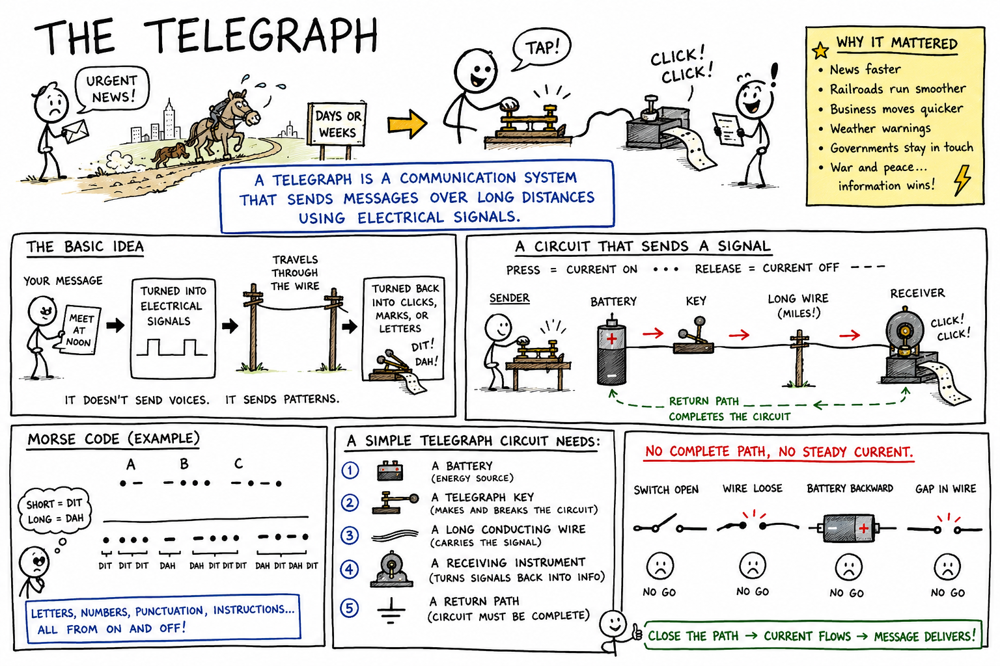

# Telegraph

Imagine needing to send urgent news from New York to Chicago in the year 1830. There are no telephones, no radios, no text messages, and no internet. A letter must travel by horse, coach, boat, or train. Important news may take days or weeks to arrive.

Then imagine a wire stretched across the land. A person taps a key in one city, and a clicking machine in another city responds almost instantly.

That was the telegraph.

**A telegraph is a communication system that sends messages over long distances using electrical signals.**

The telegraph was one of the first technologies to make information travel much faster than people, horses, ships, or trains. It helped change business, newspapers, railroads, government, war, weather reporting, and everyday life.

To understand the telegraph, we must begin with a simple circuit.

## The Basic Idea

A telegraph turns a message into electrical signals.

Those signals travel through a wire. At the other end, the signals are turned back into marks, clicks, sounds, or letters that a person can understand.

The simplest telegraph does not send a human voice. It sends patterns.

These patterns can stand for letters, numbers, punctuation, or instructions.

In the most famous telegraph system, short and long signals were used. These signals became **Morse code**.

## A Circuit That Sends a Signal

A telegraph needs an electric circuit.

A simple telegraph circuit includes:

- A battery or other source of electrical energy
- A telegraph key
- A long conducting wire
- A receiving instrument
- A return path for the current

When the operator presses the key, the circuit closes. Electric current flows.

When the operator releases the key, the circuit opens. The current stops.

This simple on-off action can carry information.

The genius of the telegraph is that a message can be built from nothing more than current on and current off.

## The Telegraph Key

A **telegraph key** is a switch used to send telegraph signals.

When the operator presses the key down, metal contacts touch and close the circuit.

When the operator lets the key rise, the contacts separate and open the circuit.

Pressing the key briefly makes a short signal.

Holding it down a little longer makes a long signal.

With practice, a skilled operator could tap out messages quickly and clearly.

The telegraph key is a fine example of how a simple switch can become a tool for language.

## The Receiver

The receiving end of a telegraph must detect the electrical signal.

Early telegraph receivers used electromagnets.

An **electromagnet** is a magnet made by electric current.

When current flowed through a coil of wire, the coil became magnetic and pulled on a small iron armature. When the current stopped, the magnetism weakened and a spring pulled the armature back.

This motion could make a click, move a pointer, or mark a strip of paper.

The receiver changed electrical signals into mechanical motion.

That motion made the message visible or audible.

## Sounders

A common telegraph receiver was called a **sounder**.

A sounder used an electromagnet to make clicking sounds.

When current flowed, the electromagnet pulled a metal lever down with a click. When current stopped, the lever sprang back with another click.

Operators learned to recognize the rhythm of the clicks. They could hear short and long signals and translate them into letters.

This was faster than reading marks on paper.

A trained telegraph operator could listen to a clicking sounder and write down the message as it arrived.

## Morse Code

**Morse code** is a system of short and long signals used to represent letters, numbers, and punctuation.

The short signal is often called a **dot**.

The long signal is often called a **dash**.

For example:

- A is dot dash
- B is dash dot dot dot
- C is dash dot dash dot
- E is dot
- S is dot dot dot
- O is dash dash dash

The famous distress signal **SOS** is:

**dot dot dot, dash dash dash, dot dot dot**

Morse code can be sent by telegraph key, flashing light, radio signal, or sound.

It is a code because it uses agreed patterns to stand for letters.

## Dots, Dashes, and Timing

Morse code depends on timing.

A dot is a short signal.

A dash is a longer signal.

Small pauses separate parts of a letter. Longer pauses separate letters. Even longer pauses separate words.

Without correct timing, the message becomes confusing.

For example, the same taps could be misunderstood if the pauses are in the wrong places.

Good telegraphy required steady hands, sharp ears, and careful timing.

## Information from On and Off

The telegraph shows a powerful idea:

**Information can be sent using simple patterns of on and off signals.**

This idea did not stop with the telegraph.

Modern computers also use patterns of signals. Digital systems often represent information using two states, such as on and off, high and low, or 1 and 0.

The telegraph was not a computer, but it helped prove that messages could be broken into code and sent electrically.

That idea is one of the roots of modern communication technology.

## The Role of the Battery

Early telegraphs needed a source of electrical energy.

Batteries supplied the voltage that pushed current through the telegraph circuit.

When the key was pressed, the battery pushed current through the line. When the key was released, the circuit opened and current stopped.

Long telegraph lines needed careful design because wires have resistance. Over long distances, signals could become weaker.

Engineers had to think about batteries, wire material, insulation, grounding, resistance, and weather.

A telegraph was simple in idea, but difficult to build well across a continent.

## Wires and Insulation

Telegraph lines used metal wires to carry current.

The wires had to be supported so they did not touch the ground, trees, buildings, or each other in the wrong way.

Wooden poles often held the wires above the ground.

Insulators made of glass, ceramic, or other materials helped keep current from leaking away into the poles.

Rain, wind, ice, fallen branches, and broken poles could damage lines.

Maintaining telegraph lines was hard work.

## The Earth Return

Some telegraph systems used Earth as part of the return path for current.

Instead of using two long wires for every line, engineers discovered that current could travel through one wire and return through the ground under suitable conditions.

This saved wire and money.

The system still needed good grounding connections at each end.

The idea may sound strange, but Earth can act as a huge conductor in some electrical systems.

Ground return systems must be designed carefully. They are not something students should try to build on their own.

## Relays

A **relay** is an electrically controlled switch.

Relays were important in long-distance telegraphy because signals could weaken over long wires.

Imagine a weak signal arriving after traveling a long distance. It might not be strong enough to operate a sounder clearly. But it could operate a sensitive relay.

The relay could then close a new local circuit with a fresh battery, making a stronger signal for the next part of the line.

In this way, relays helped messages travel farther.

Relays are still used today in many electrical systems, though modern electronics also use transistors for switching.

## Repeaters

A **repeater** is a device that receives a signal and sends it onward again.

Telegraph repeaters helped messages travel over very long distances.

They could take a weak or incoming signal and use it to create a stronger outgoing signal.

This idea is common in communication.

Modern fiber-optic cables, radio networks, computer networks, and cell systems all use some version of receiving, strengthening, cleaning up, or retransmitting signals.

The old telegraph repeater is an ancestor of many modern communication tools.

## Samuel Morse and Alfred Vail

Samuel Morse is one of the names most closely connected with the electric telegraph.

Morse was an American artist and inventor who helped develop and promote a practical telegraph system.

Alfred Vail, a skilled mechanic and inventor, worked with Morse and made important improvements to the equipment and code.

The system they helped build became famous because it was practical, useful, and successful.

Many people contributed to telegraphy in different countries. Invention often grows from the work of many minds, not one person alone.

## "What Hath God Wrought"

In 1844, Samuel Morse sent a famous message from Washington, D.C., to Baltimore.

The message was:

**What hath God wrought**

This old-fashioned sentence means something like, "What has God done?"

The message was not just a sentence. It was a demonstration that electrical communication over distance could work.

After that, telegraph lines spread rapidly.

News, business orders, railroad instructions, election results, and personal messages could travel with astonishing speed.

## How the Telegraph Changed Time

Before the telegraph, information usually traveled only as fast as a person, horse, ship, or train could carry it.

After the telegraph, information could travel at the speed of an electrical signal through a wire.

This changed how people thought about distance.

Businesses could learn prices in faraway cities. Newspapers could print fresh news from distant places. Governments could send urgent orders. Families could receive important messages more quickly.

The world seemed to shrink.

The telegraph was sometimes called the "Victorian internet" because it created a rapid communication network for its age.

## Railroads and Telegraphs

Railroads and telegraphs grew together.

Railroads needed fast communication to manage trains safely. Dispatchers had to know where trains were, where they were going, and when tracks were clear.

Telegraph lines often followed railroad tracks.

Stations used telegraph messages to coordinate schedules, report delays, and prevent accidents.

The telegraph helped railroads run more safely and efficiently.

In return, railroads helped spread telegraph lines across long distances.

## News and Newspapers

The telegraph transformed news.

Before telegraphy, newspapers often printed reports that were days or weeks old.

With telegraph lines, reports from distant cities could arrive the same day.

News agencies used telegraphs to gather and distribute information quickly.

Weather reports, election results, market prices, sports scores, and war news all moved faster because of telegraphy.

People began to expect news to be recent, not ancient.

## Telegraph Offices

A telegraph office was a place where messages were sent and received.

A person who wanted to send a message could write it down and pay for it to be transmitted.

The telegraph operator sent the message in code. Another operator at the receiving office wrote it down. Then the message could be delivered to the recipient.

Messages sent by telegraph were often called **telegrams**.

Telegrams were usually brief because they cost money by the word.

This led to a short, direct style of writing.

## Undersea Telegraph Cables

Telegraph wires did not only cross land.

Engineers also laid cables under water.

The most famous early challenge was the transatlantic telegraph cable, which connected Europe and North America.

Laying a cable across the ocean was extremely difficult. The cable had to be strong, insulated, and long enough to cross thousands of miles of sea floor.

Early attempts failed, but success eventually came.

Before the cable, a message across the Atlantic had to go by ship. After the cable, messages could cross the ocean in minutes.

This was one of the great engineering achievements of the 1800s.

## Signal Speed

Electrical signals in telegraph wires travel very fast.

They are not carried by individual electrons racing from one city to another like runners in a race. Electrons in metal drift slowly.

Instead, the electrical effect moves through the circuit quickly, somewhat like a push moving through a line of people.

This is why a telegraph signal could be received almost instantly compared with mail or messengers.

The exact speed depends on the wire, insulation, distance, and electrical conditions.

## Telegraphy and Magnetism

The telegraph depends on the connection between electricity and magnetism.

When electric current flows through a coil of wire, it creates a magnetic field. That magnetic field can pull on iron.

In a telegraph receiver, current in the coil makes an electromagnet. The electromagnet moves a lever or armature.

When the current stops, the lever returns.

So the telegraph uses electric current to make controlled motion at a distance.

This is the same basic family of ideas used in relays, doorbells, buzzers, speakers, and many motors.

## Telegraphy and Codes

A telegraph message must be encoded before it is sent.

To **encode** means to change information into a form suitable for sending or storing.

To **decode** means to change the signal back into a message that can be understood.

Morse code encodes letters as dots and dashes.

The receiving operator decodes the clicks into letters and words.

All communication systems need some kind of agreement about what signals mean. Spoken language, writing, traffic lights, computer files, and wireless messages all depend on shared codes.

## Accuracy and Errors

Telegraph messages had to be sent carefully.

A wrong dot, dash, or pause could change a letter. A noisy line could make signals hard to read. A tired operator could make mistakes.

Operators used skill, repetition, and sometimes confirmation messages to reduce errors.

Important messages might be checked or repeated.

Modern communication systems also fight errors. Computers use error-checking methods to detect or correct mistakes in transmitted data.

The problem is old: how do you send a message accurately through an imperfect channel?

## The Telegraph and the Telephone

The telegraph came before the telephone.

The telegraph sent coded signals. The telephone sent the changing sound of a human voice.

The telegraph required operators who knew code. The telephone allowed ordinary speech to travel through wires.

Even after telephones appeared, telegraphs remained useful for official messages, business records, railroads, ships, and long-distance communication.

Each new technology builds on earlier ones.

The telephone did not make the telegraph unimportant. It grew from the same world of wires, signals, circuits, and electrical invention.

## Wireless Telegraphy

Later inventors learned to send telegraph signals without long wires between stations.

This was called **wireless telegraphy**.

Wireless telegraphy used radio waves to carry Morse code through the air.

Ships at sea used wireless telegraphy to send messages and distress calls.

The famous SOS signal became connected with emergency radio communication.

Wireless telegraphy helped lead to radio, broadcasting, radar, and modern wireless communication.

## From Telegraph to Internet

The telegraph may seem old-fashioned, but its big ideas are very modern.

It used networks.

It used addresses and routing.

It used electrical signals.

It used codes.

It used skilled operators and technical standards.

It changed how quickly information moved through society.

Today's internet is far more powerful, but it still depends on sending coded signals through wires, fibers, radio waves, and networks.

The telegraph was one of the first great steps toward the connected world.

## Common Misconceptions

One mistake is thinking the telegraph sent voices. Ordinary electric telegraphs sent coded signals, not speech.

Another mistake is thinking Morse code is electricity itself. Morse code is a code; electricity is the physical signal that can carry it.

A third mistake is thinking one wire alone is enough without any return path. A telegraph circuit still needs a complete path for current.

A fourth mistake is thinking telegraph signals were carried by electrons zooming from city to city. The electrical signal travels fast, while individual electrons drift slowly.

A fifth mistake is thinking the telegraph was a small invention because it seems simple now. In its time, it was revolutionary.

## Telegraph Safety

Classroom telegraph models should use only safe, low-voltage batteries.

Good safety habits include:

- Use only low-voltage battery circuits for demonstrations.
- Never connect homemade telegraph circuits to wall outlets.
- Do not short-circuit batteries.
- Disconnect wires when the activity is finished.
- Do not let wires or batteries become hot.
- Keep water away from electrical circuits.
- Do not climb utility poles or touch outdoor wires.
- Stay away from fallen power lines.
- Use adult supervision for electromagnet and relay activities.

Real telegraph systems used long wires, outdoor poles, and electrical equipment. Classroom models should stay small, simple, and safe.

## The Big Idea

The telegraph is an electrical communication system.

It sends messages by turning letters into patterns of electrical signals. A key opens and closes a circuit, current travels through a wire, and a receiver uses electromagnetism to make clicks, marks, or motion. Morse code allowed short and long signals to represent letters and numbers. The telegraph changed history by making information travel faster than people and vehicles.

If you remember only one sentence, remember this:

**A telegraph sends coded messages over distance by using a circuit to turn electric current on and off.**

## Study Questions

1. What is a telegraph?
2. What kind of signals does a simple electric telegraph send?
3. What are five basic parts of a simple telegraph circuit?
4. What happens when a telegraph operator presses the key?
5. What happens when the operator releases the key?
6. What is a telegraph key?
7. What is an electromagnet?
8. How did an electromagnet help a telegraph receiver work?
9. What was a telegraph sounder?
10. What is Morse code?
11. What are dots and dashes in Morse code?
12. Why is timing important in Morse code?
13. What does the SOS signal look like in dots and dashes?
14. What powerful idea about information does the telegraph show?
15. What role did batteries play in early telegraphs?
16. Why did telegraph wires need insulation?
17. What is a relay?
18. Why were relays useful for long-distance telegraph lines?
19. What is a repeater?
20. Who were Samuel Morse and Alfred Vail?
21. What famous message did Morse send in 1844?
22. How did the telegraph change the speed of communication?
23. Why were telegraphs important to railroads?
24. How did telegraphs change newspapers and news?
25. What was a telegram?
26. Why were undersea telegraph cables important?
27. How is telegraphy connected to magnetism?
28. What is the difference between encoding and decoding?
29. How was the telegraph different from the telephone?
30. What are three safety rules for building or studying telegraph circuits?
