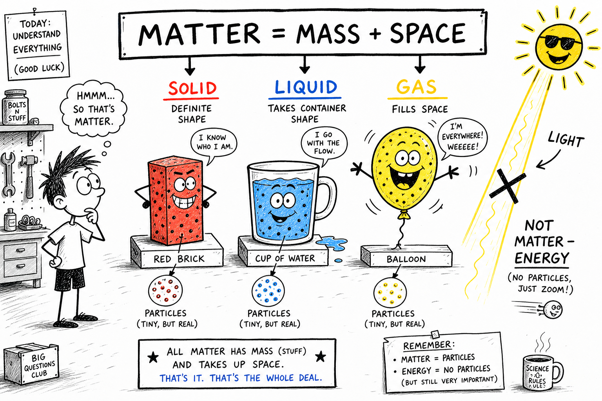

# Matter

You pump air into a bicycle tire until it feels firm. You bite into a slice of pizza. You watch steam rise from a bowl of soup. You toss a baseball across the yard. You breathe in and out without thinking about it.

Every one of those moments involves the same basic idea.

**Matter is anything that has mass and takes up space.**

Matter is the stuff of the physical world. Your desk, shoes, water bottle, lunch, and even the air in your lungs are matter. Some matter is hard, like a rock. Some flows, like water. Some spreads out invisibly, like air. Some is living, like muscle. Some is not living, like glass.

If you want to understand chemistry, cooking, weather, machines, medicine, and living things, you must first understand matter.

## Mass and Space

Matter has two features you can always check for.

First, matter has **mass**.

Mass is the amount of matter in an object.

Second, matter takes up **space**.

The amount of space matter takes up is called **volume**.

A brick has mass and takes up space. A cup of water does too. So does the air inside a balloon, even though you cannot usually see it.

Light is not matter. It is energy. It can travel through space, but it does not have mass in the ordinary way that a stone, book, or puff of air does.

## Matter Is Made of Particles

Matter may look smooth and solid, but it is made of tiny particles far too small to see with your eyes.

The main particles of ordinary matter include **atoms** and **molecules**.

An **atom** is one of the tiny building blocks of matter.

A **molecule** is a group of atoms joined together.

Water is made of water molecules. Each water molecule contains atoms of hydrogen and oxygen. The chair you sit on, the air you breathe, and the food you eat are all made of particles arranged in different ways.

## Atoms

Atoms are extremely small. Millions could fit across the head of a pin.

Atoms are not all the same. Different kinds of atoms make different **elements**.

For example:

- Oxygen atoms are found in the air and in water.
- Carbon atoms are found in wood, food, paper, living things, and many fuels.
- Iron atoms are found in nails, tools, steel, and blood.
- Gold atoms are found in jewelry and coins.

The type of atoms present helps determine what kind of matter something is.

## Molecules

Atoms can join together to make molecules.

A molecule may contain atoms of the same kind or different kinds.

Oxygen gas in the air is made of oxygen molecules, each with two oxygen atoms. Water is made of molecules with hydrogen and oxygen atoms joined together. Carbon dioxide is made of molecules with carbon and oxygen atoms.

Molecules help explain why substances behave differently. Water, oxygen, sugar, and carbon dioxide act differently because their particles are different and arranged differently.

## States of Matter

Matter commonly exists in three familiar states:

- **Solid**
- **Liquid**
- **Gas**

These are called **states of matter**.

The state of a substance depends on how its particles are arranged and how they move.

In a solid, particles are packed closely and mostly vibrate in place.

In a liquid, particles are close together but can slide past one another.

In a gas, particles are far apart and move freely.

The same substance can often change from one state to another. Ice, liquid water, and steam are all water — just in different states.

## Solids

A **solid** has a definite shape and a definite volume.

A rock, ice cube, pencil, coin, brick, and baseball are solids. The particles in a solid are close together. They may vibrate, but they do not usually move freely from place to place. That is why a solid object can hold its shape.

Solids can be hard, soft, stiff, bendable, smooth, rough, heavy, light, brittle, or elastic.

## Liquids

A **liquid** has a definite volume but does not have a definite shape.

A liquid takes the shape of its container. Water in a cup has the shape of the cup. Pour it into a bottle, and it takes the shape of the bottle.

The particles in a liquid are close together, but they can slide past one another. This allows liquids to flow.

Examples include water, milk, oil, juice, and liquid mercury. Honey flows slowly. Water flows easily. Both are liquids.

## Gases

A **gas** has no definite shape and no definite volume.

A gas spreads out to fill its container. Air is a mixture of gases, including oxygen, nitrogen, carbon dioxide, and water vapor.

The particles in a gas are far apart compared with particles in solids and liquids. They move freely and quickly. That is why gases can be compressed more easily than solids or liquids.

When you pump air into a bicycle tire, gas particles are squeezed into a smaller space.

## Plasma and Other States

Solid, liquid, and gas are the most familiar states, but they are not the only ones.

**Plasma** is a hot, electrically charged state of matter. Plasma is found in stars, lightning, some flames, neon signs, and certain kinds of lamps.

Scientists also study unusual states under extreme conditions, such as very low temperatures or very high pressures. For this chapter, the most important states are solid, liquid, and gas.

## Matter Can Change State

Matter can change from one state to another.

Common changes of state include:

- **Melting:** solid to liquid
- **Freezing:** liquid to solid
- **Evaporation:** liquid to gas
- **Condensation:** gas to liquid
- **Boiling:** liquid to gas throughout the liquid
- **Sublimation:** solid directly to gas

Ice melting into water is a change of state. Water freezing into ice is too. Water vapor condensing on a cold glass is another example.

In these changes, the substance may stay the same kind of matter, but its particles move and arrange themselves differently.

## Physical Properties

A **physical property** is a characteristic of matter that can be observed or measured without changing the substance into a different substance.

Examples include:

- Color
- Shape
- Size
- Mass
- Volume
- Density
- Hardness
- Texture
- Melting point
- Boiling point
- Magnetism
- Electrical conductivity

If you measure the mass of a coin, you have not changed the coin into a different substance. If you observe that copper is reddish-brown and conducts electricity, you are observing physical properties.

## Chemical Properties

A **chemical property** describes how a substance can change into a different substance.

Examples include:

- Ability to burn
- Ability to rust
- Ability to react with acid
- Ability to tarnish
- Ability to support combustion

Iron can rust when exposed to oxygen and water. Paper can burn. Chemical properties are often observed when a chemical change happens.

## Physical Changes

A **physical change** changes the form, size, shape, or state of matter without changing it into a different substance.

Examples include:

- Cutting paper
- Melting ice
- Freezing water
- Crushing a can
- Dissolving sugar in water
- Bending a wire
- Breaking glass

After a physical change, the matter is still the same substance. An ice cube and liquid water are both made of water. The state changed, but the substance did not become a new kind of matter.

## Chemical Changes

A **chemical change** forms one or more new substances.

Examples include:

- Burning wood
- Rusting iron
- Baking a cake
- Cooking an egg
- Digesting food
- Vinegar reacting with baking soda
- Tarnishing silver

Signs of a chemical change may include color change, gas formation, heat or light production, odor change, or formation of a solid from liquids.

These signs are clues, not perfect proof by themselves. Boiling water makes bubbles, but that is not a chemical change. The bubbles are water vapor, not a new substance.

## Pure Substances

A **pure substance** is matter that has a fixed composition.

**Elements** and **compounds** are pure substances.

An **element** is a pure substance made of only one kind of atom. Gold, oxygen, carbon, iron, and hydrogen are elements.

A **compound** is a pure substance made of two or more kinds of atoms chemically joined in a fixed ratio. Water is a compound made of hydrogen and oxygen. Carbon dioxide is a compound made of carbon and oxygen. Salt is a compound made of sodium and chlorine.

Pure substances have definite properties.

## Mixtures

A **mixture** is matter made of two or more substances physically combined.

In a mixture, the substances are not chemically joined in a fixed ratio.

Examples include:

- Trail mix
- Soil
- Air
- Seawater
- Salad
- Granite
- Lemonade

Mixtures can often be separated by physical methods, such as filtering, sorting, evaporating, or using a magnet. Iron filings can be separated from sand with a magnet.

## Solutions

A **solution** is a mixture that is evenly mixed.

Salt water is a solution. The salt dissolves in the water and spreads evenly throughout it. Sugar water is another solution. Air is also a solution of gases, mostly nitrogen and oxygen.

In a solution, the parts may be so evenly mixed that you cannot see them separately. That does not mean the parts vanished. They are still present, just spread out at the particle level.

## Density

**Density** is how much mass is packed into a certain volume.

Density helps explain why some objects float and others sink.

A steel nail sinks in water because it is denser than water. A piece of cork floats because it is less dense than water.

Density is not the same as weight. A small piece of lead may weigh less than a large log, but lead is denser because more mass is packed into each unit of volume.

## Measuring Matter

Scientists measure matter carefully. They may measure:

- Mass with a balance or scale
- Volume with a graduated cylinder, ruler, or measuring cup
- Temperature with a thermometer
- Length with a ruler or meter stick
- Density by comparing mass and volume

Careful measurement helps scientists describe matter accurately instead of guessing. If two objects look similar, measuring their mass, volume, density, or other properties can reveal important differences.

## Conservation of Matter

One of the great rules of science is the **conservation of matter**.

In ordinary physical and chemical changes, matter is not created or destroyed. Atoms are rearranged, but they do not simply disappear.

When wood burns, it may seem to vanish. But the matter becomes gases, ash, smoke particles, and other products. Some of it spreads into the air.

When ice melts, the water is still there. When sugar dissolves, the sugar particles spread through the water. The form changes, but the matter remains.

## Matter and Energy

Matter and energy are related, but they are not the same idea.

Matter has mass and takes up space. **Energy** is the ability to do work or cause change. Heat, light, motion, sound, and electrical energy are forms of energy.

A hot cup of cocoa contains matter, and it also has thermal energy. A moving baseball is matter, and it also has kinetic energy. Matter can store, transfer, and transform energy, but matter itself is the stuff that has mass and volume.

## Living and Nonliving Matter

Living things are made of matter. Plants, animals, fungi, and bacteria are made of atoms and molecules. Your body contains water, proteins, fats, minerals, sugars, salts, and many other kinds of matter.

Nonliving things are also made of matter. Rocks, rivers, clouds, soil, air, metals, and glass are matter. Living matter is organized in special ways that allow life processes, but it is still matter.

## Matter in the Air

Air may seem like empty space, but it is matter. Air has mass. Air takes up space. Air can push, flow, heat, cool, and carry water vapor.

You can feel moving air as wind. You can see evidence of air when it inflates a balloon. You can weigh a ball before and after pumping it with air and find that the pumped ball has slightly more mass.

Air matters, even when it is invisible.

## Matter at Different Scales

Matter can be studied at many scales.

At the large scale, you can study mountains, oceans, buildings, and planets.

At the everyday scale, you can study cups, coins, food, and tools.

At the tiny scale, you can study grains of salt, drops of water, dust, cells, atoms, and molecules.

A glass of water is a liquid you can drink. It is also a collection of countless water molecules moving and sliding past one another. Good science often connects what you can see with what is happening too small to see.

## Why Matter Matters

Understanding matter helps explain much of daily life.

It explains why ice floats, why metal pans heat well, why balloons expand, why bread rises, why rust forms, why smoke spreads, why salt dissolves, and why some materials are better for building than others.

Engineers choose materials based on their properties. Doctors study matter in the body. Chemists study how matter changes. Cooks use changes in matter every time they heat, cool, mix, dissolve, freeze, melt, bake, or burn something.

Matter is not a small topic. It is the physical world itself.

## Common Misconceptions

One mistake is thinking only solids are matter. Liquids and gases are matter too.

Another mistake is thinking air is not matter because it is invisible. Air has mass and takes up space.

A third mistake is thinking matter disappears when it burns, evaporates, or dissolves. In ordinary changes, matter is rearranged or spread out, not destroyed.

A fourth mistake is thinking all changes are chemical changes. Melting, freezing, cutting, and crushing are usually physical changes.

A fifth mistake is thinking mass and weight are exactly the same. Mass is the amount of matter. Weight is the pull of gravity on that matter.

## Safety with Matter

Matter includes many substances, and not all substances are safe to touch, smell, taste, heat, or mix.

Good safety habits include:

- Do not taste unknown substances.
- Do not smell chemicals directly.
- Do not mix household chemicals without adult instruction.
- Wear goggles when an activity requires them.
- Wash hands after experiments.
- Keep powders and liquids away from eyes.
- Use heat only with adult supervision.
- Treat broken glass, sharp metal, and hot materials carefully.
- Label substances clearly during investigations.
- Follow teacher instructions for disposal.

Studying matter is safe and exciting when materials are chosen carefully and handled with respect.

## The Big Idea

Matter is anything that has mass and takes up space.

Matter is made of tiny particles such as atoms and molecules. It can exist as solids, liquids, gases, and other states. Matter has physical and chemical properties, and it can undergo physical and chemical changes. It can be pure substances or mixtures. In ordinary changes, matter is conserved, meaning it is rearranged rather than created or destroyed.

If you remember only one sentence, remember this:

**Matter is the stuff of the physical world: it has mass, takes up space, and is made of particles.**

## Study Questions

1. What is matter?
2. What two features must something have to be matter?
3. What is mass? What is volume?
4. Why is air considered matter?
5. Is light matter? Explain.
6. What are atoms and molecules?
7. What are the three most familiar states of matter?
8. How are particles arranged and moving in a solid, a liquid, and a gas?
9. What shape and volume does a solid have? What about a liquid? What about a gas?
10. What is plasma?
11. Name four changes of state.
12. What is the difference between a physical property and a chemical property?
13. What is the difference between a physical change and a chemical change?
14. Give two examples of each kind of change.
15. What is a pure substance?
16. What is the difference between an element and a compound?
17. What is a mixture? What is a solution?
18. What is density, and how does it relate to floating and sinking?
19. What does conservation of matter mean?
20. How are matter and energy different?
21. Name three safety rules for studying matter.
22. In your own words, explain why understanding matter helps you understand the world around you.
