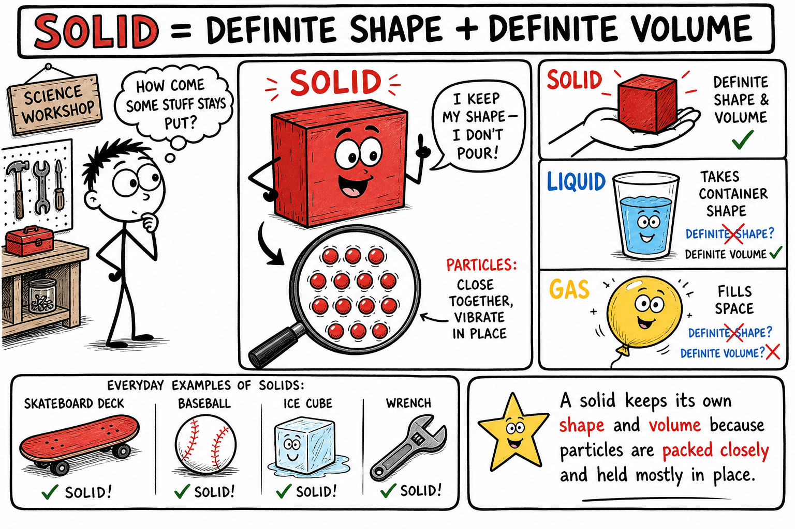
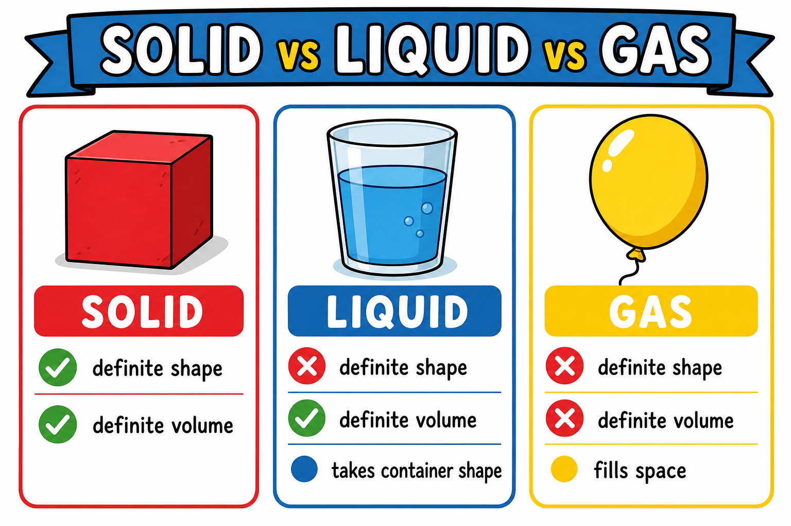
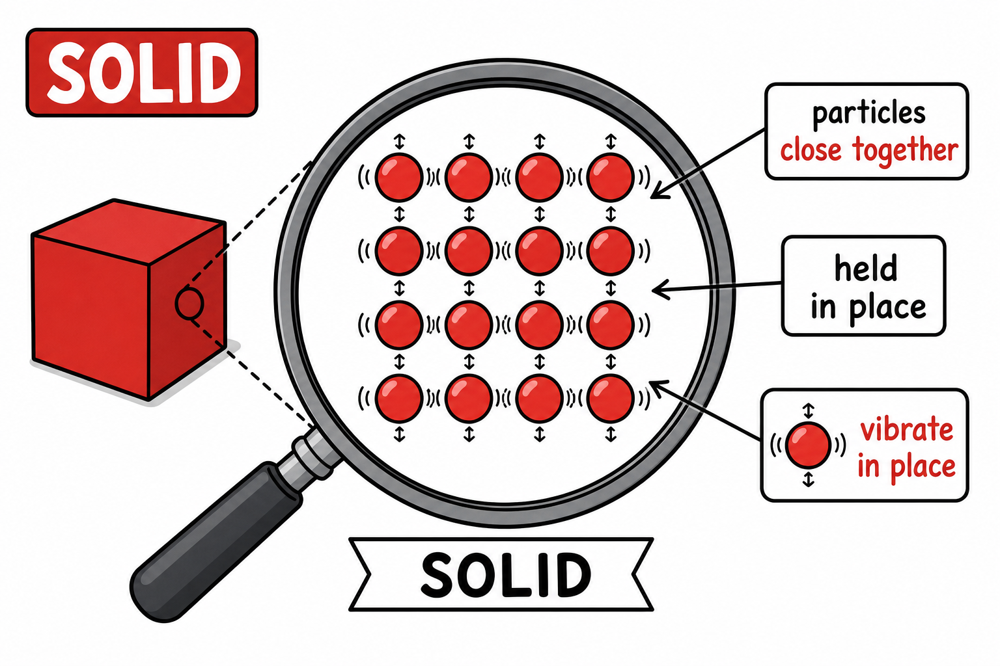
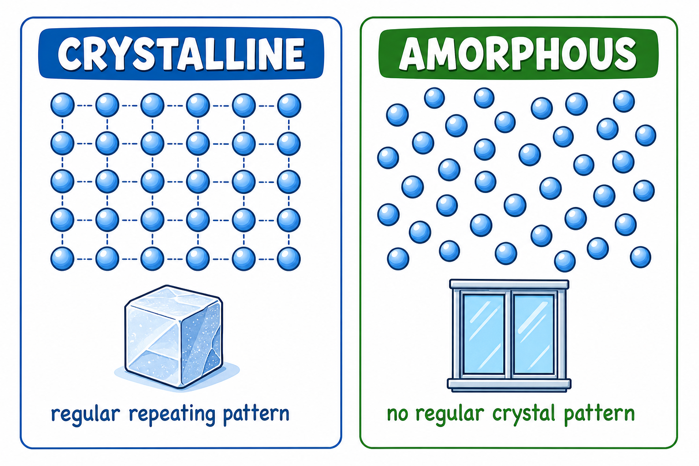
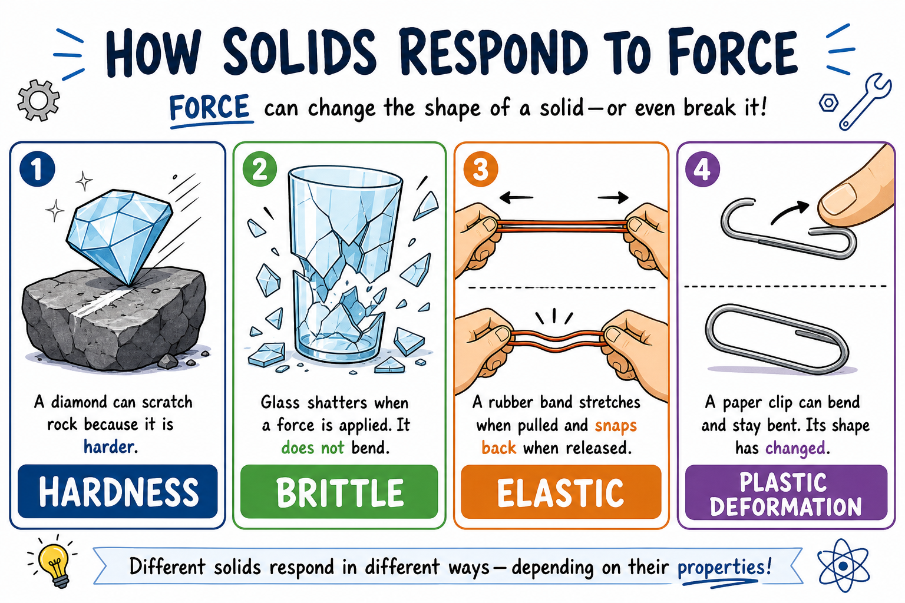
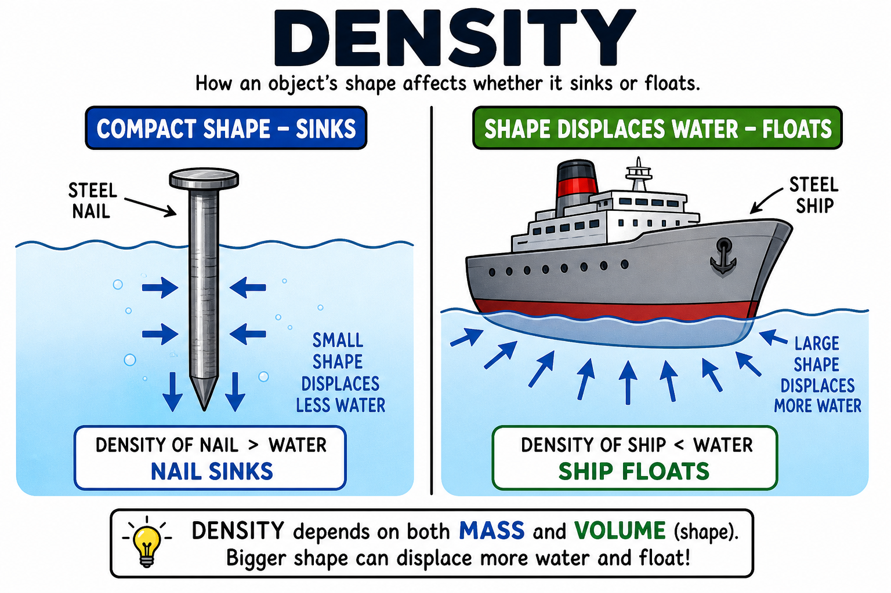
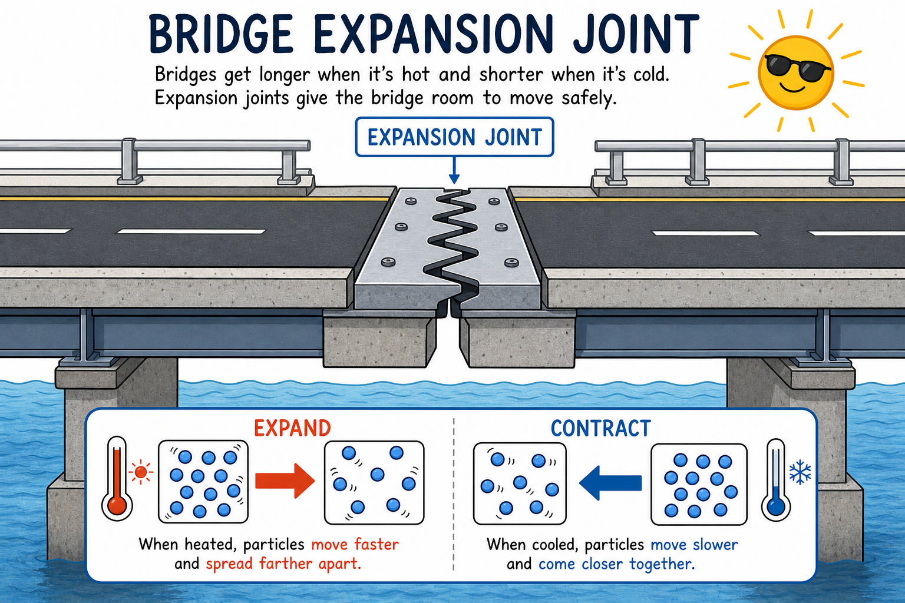
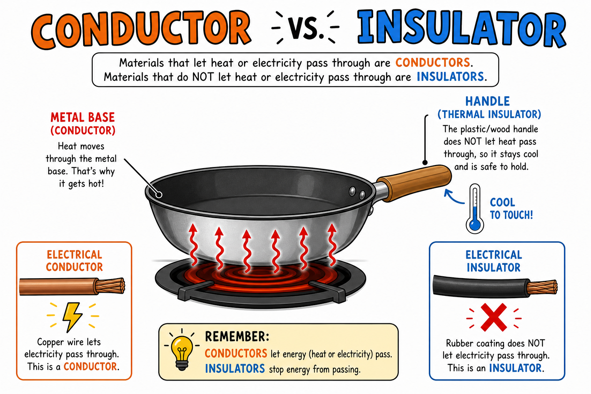
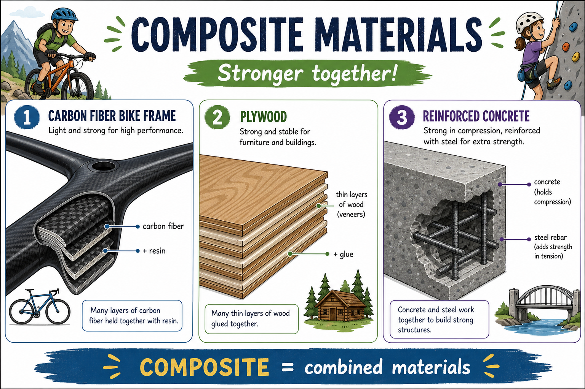

# Solid

You grip a skateboard deck, toss a baseball, tap a phone screen, and bite into an ice cube from a drink. None of them pour through your fingers. None of them spread out to fill a room like air. Each one keeps its own shape and size under ordinary conditions.

These objects are solids.

**A solid is a state of matter with a definite shape and a definite volume.**

Solids are everywhere in the world you actually use. They make up bike frames, cleats, game controllers, fishing lures, tent stakes, drumsticks, wrench handles, skateboard wheels, and the rocks you skip across a pond. They can be hard as diamond, soft as wax, brittle as glass, elastic as a rubber band, strong as steel, or crumbly as dry clay.

To understand solids, you must look smaller — at their particles.

## Solids Are Matter

A solid is a kind of matter.

As you learned in the chapter on matter, **matter** is anything that has mass and takes up space.

Solids have mass. A hockey puck, a marble, and a wrench can all be weighed.

Solids also take up space. A phone occupies room in your pocket. A stone displaces water when dropped into a full cup.

Because solids have mass and volume, they are matter.

## Definite Shape and Definite Volume

A solid has two features that set it apart from liquids and gases under ordinary conditions.

It has a **definite shape**. It keeps its own shape unless something changes it. A wooden block stays block-shaped on a workbench, in a toolbox, or in your hand. That is different from water, which takes the shape of its container.

It also has a **definite volume**. **Volume** is the amount of space matter takes up. A metal cube takes up the same amount of space on a desk or inside a drawer. That is different from a gas, which spreads out to fill its container.

Of course, solids can be bent, cut, crushed, melted, or broken. Definite shape does not mean unchangeable forever. It means the solid does not flow to fit its container the way a liquid does.

## Particles in a Solid

Solids are made of tiny particles such as atoms, molecules, or ions.

In a solid, these particles are packed close together.

They are held in place by forces between particles.

The particles still move, but they mostly **vibrate in place**. They do not usually slide freely past one another as liquid particles do.

This close packing and limited motion help solids keep their shape and volume.

When a solid is heated, its particles usually vibrate faster. When it is cooled, they usually vibrate more slowly. That particle motion helps explain expansion by heat, contraction by cooling, and melting.

## Crystalline and Amorphous Solids

Not all solids arrange their particles the same way.

Some solids have particles in regular repeating patterns. These are **crystalline solids**. A **crystal** is a solid whose particles are arranged in an orderly pattern.

Examples include:

- Salt
- Sugar
- Quartz
- Diamond
- Snowflakes
- Many metals

The flat faces and sharp angles of many crystals come from the orderly arrangement inside. Even a tiny grain of salt has a pattern at the particle level. Look at sugar crystals through a hand lens — the neat shape is a clue.

Other solids do not have neatly repeating patterns. An **amorphous solid** is a solid whose particles are not arranged in a regular crystal pattern.

Examples include:

- Glass
- Rubber
- Many plastics
- Wax
- Some gels

*Amorphous* means "without shape" in the sense of lacking a regular crystal arrangement. A glass window is still a solid with definite shape and volume even though its particles are not arranged like a crystal.

## How Solids Respond to Force

Different solids behave very differently when you push, pull, bend, scratch, or stretch them. Engineers choose materials partly by how they respond to force.

### Hardness

**Hardness** is a material's resistance to being scratched or dented.

Diamond is extremely hard. Talc is very soft.

Hardness is not the same as strength. Glass is hard because it resists scratching, but it can break easily. Rubber is not very hard, but it can stretch and return to shape.

### Strength

**Strength** is a material's ability to resist breaking under force.

Some materials resist being pulled apart. This is **tensile strength**.

Some resist being squeezed. This is **compressive strength**.

Some resist being bent or twisted.

Steel is strong in many useful ways, which is why it appears in bridges, bike frames, tools, rails, and machines. But strength depends on shape as well as material. A thin steel wire and a thick steel beam behave differently because they are shaped differently.

### Brittleness and Elasticity

A **brittle** solid breaks or shatters without much bending. Glass, dry spaghetti, chalk, and some ceramics are brittle.

**Elasticity** is the ability of a material to return to its original shape after being stretched, squeezed, or bent. Rubber bands, springs, and some plastics, foams, and metals show elasticity.

Elasticity has limits. Stretch a rubber band too far, and it may snap or stay stretched.

### Plastic Deformation

Sometimes a solid changes shape and does not return to its original form. This is called **plastic deformation**.

Bend a paper clip slightly, and it may spring back. Bend it too far, and it stays bent.

Clay can be shaped and keep its new form. Metal can be hammered, rolled, or pressed into useful shapes. Plastic deformation is important in manufacturing — coins, cans, car parts, and tools all depend on it.

### Malleability and Ductility

Some solids can be shaped without breaking.

**Malleability** is the ability of a material to be hammered or rolled into thin sheets.

**Ductility** is the ability of a material to be drawn into wires.

Gold, aluminum, and copper are malleable. Copper is also ductile, which is one reason it is used for electrical wiring.

## Density of Solids

Solids can have very different densities.

**Density** is how much mass is packed into a certain volume.

A block of lead is much denser than a block of wood of the same size. That is why a small metal object can feel heavier than a much larger piece of foam.

Density helps explain floating and sinking.

Some solids float in water, such as cork and many woods. Others sink, such as steel, stone, and glass.

Shape also matters. A steel nail sinks, but a steel ship can float because its shape includes a large volume of air and displaces enough water.

## Melting, Freezing, and Particle Motion

A solid can change into a liquid by melting.

**Melting** is the change of state from solid to liquid.

Ice melts into liquid water. Wax melts when heated. Metals can melt in very hot furnaces.

During melting, particles gain enough energy to move past one another more freely. The solid loses its fixed shape and becomes a liquid.

Different substances melt at different temperatures. The temperature at which a solid melts is called its **melting point**.

**Freezing** is the opposite change — from liquid to solid. Liquid water freezes into ice. Molten metal freezes into solid metal as it cools.

Freezing and melting are usually **physical changes**. The substance changes state, but it does not become a new chemical substance. (You learned more about melting in the chapter on melting.)

## Expansion and Contraction

Most solids expand when heated and contract when cooled.

To **expand** means to take up more space. To **contract** means to take up less space.

When a solid is heated, its particles vibrate faster and usually move slightly farther apart. The solid expands.

When it cools, the particles vibrate more slowly and usually move closer together. The solid contracts.

Engineers must plan for this. Bridges, railroad tracks, sidewalks, and buildings may need **expansion joints** so materials can expand and contract without cracking or buckling.

On a hot summer day, you may hear railroad tracks click as metal expands. That is particle motion showing up at the scale you can see and hear.

## Heat and Electricity Through Solids

Some solids conduct heat well. A **thermal conductor** lets heat move through it easily.

Metals such as copper, aluminum, and iron are good thermal conductors. That is why many cooking pans are made of metal — and why the metal part of a pan gets hot while you are cooking.

Other solids are poor conductors of heat. These are called **thermal insulators**. Wood, plastic, rubber, foam, and wool are often better thermal insulators than metals. That is why pan handles may be made of plastic or wood instead of bare metal.

Some solids conduct electricity well. Metals are usually good electrical conductors because some of their electrons can move through the solid. Copper and aluminum are commonly used in wires, headphones, chargers, and circuits.

Many solids do not conduct electricity well. Rubber, plastic, dry wood, glass, and ceramics are usually electrical insulators. That is why wire coatings, plug covers, and tool handles are often made from them.

## Magnetic Solids

Some solids are strongly attracted to magnets.

Iron, steel, nickel, and cobalt are common magnetic materials.

Most solids are not strongly magnetic. Wood, plastic, glass, paper, rubber, copper, and aluminum are not strongly attracted to ordinary magnets.

Magnetism is a physical property. Testing whether a solid is magnetic can help identify a material or separate it from a mixture — for example, pulling iron filings out of sand with a magnet.

## Choosing the Right Solid for the Job

Modern engineering is partly the art of picking the right solid for the job.

A skateboard deck needs stiffness and grip. A helmet needs a hard shell and energy-absorbing foam inside. A fishing rod needs strength without snapping on a big fish. A phone case needs impact resistance. A tent stake needs strength in a thin shape that can be driven into ground.

Good design asks:

- Does it need to be strong, flexible, hard, or soft?
- Should it conduct or block heat and electricity?
- Is weight or density important?
- Will it be bent, hammered, cut, or heated?
- Is it safe to handle in this form?

Engineers do not ask only whether a material works. They ask whether it works well for that exact task.

## Composite Materials

A **composite material** is made by combining two or more materials to get useful properties.

Plywood is made from layers of wood. Reinforced concrete combines concrete and steel. Fiberglass combines glass fibers with plastic resin. Carbon-fiber parts can be strong and lightweight.

Many modern sports and outdoor products use composites. A carbon-fiber bike frame or fiberglass kayak can be stiff and strong without being as heavy as solid metal.

Composites show that people can design solids with special combinations of strength, weight, flexibility, and durability.

## Solids in Nature and Technology

Nature is full of solids: rocks, minerals, sand, ice, shells, bones, teeth, wood, and seeds. Earth's crust is mostly solid rock. Snowflakes are solid water with beautiful crystal shapes. Bones are solid tissues that support the body.

Technology depends on solids just as much.

Buildings need solid beams, bricks, concrete, nails, screws, and glass. Bikes and skateboards need solid frames, wheels, bearings, and bolts. Machines need solid gears, shafts, frames, and tools. Electronics need solid metals, plastics, ceramics, glass, and semiconductor materials.

Sports gear, musical instruments, spacecraft, pencils, eyeglasses, and shoes all depend on carefully chosen solids.

## Physical and Chemical Changes

Solids can undergo many **physical changes**, such as cutting, crushing, grinding, bending, melting, freezing, polishing, or dissolving.

When sugar is crushed into powder, it is still sugar. When ice melts, it is still water. When a wooden board is cut in half, it is still wood. Physical changes alter form, not chemical identity.

Solids can also take part in **chemical changes**, such as wood burning, iron rusting, silver tarnishing, bread baking, clay firing into ceramic, or food browning during cooking.

In a chemical change, new substances form. Iron rust is not simply iron in a different shape. It is a different substance formed when iron reacts with oxygen and water.

## Identifying Solids by Properties

Scientists often identify solids by studying their properties.

Useful properties include color, shape, hardness, density, magnetism, crystal form, texture, luster, conductivity, and melting point.

No single property always tells the whole story. Many solids may have the same color or similar hardness. But a set of properties can help identify a substance — especially in geology, chemistry, materials science, and engineering.

## Common Misconceptions

One mistake is thinking all solids are hard. Rubber, wax, clay, and foam are solids but may be soft.

Another mistake is thinking particles in a solid do not move at all. They usually vibrate in place.

A third mistake is thinking a solid cannot change shape. Solids can be bent, cut, crushed, stretched, melted, or broken.

A fourth mistake is thinking all solids sink. Some solids float if they are less dense than the liquid or shaped to displace enough liquid.

A fifth mistake is thinking melting is a chemical change. Melting is usually a physical change.

## Safety with Solids

Many solids are safe to handle, but not all solids are harmless.

Good safety habits include:

- Do not taste unknown solids.
- Do not breathe dust from powders.
- Wear goggles when cutting, crushing, heating, or testing solids.
- Handle glass carefully because it can shatter.
- Handle sharp metal, tools, and broken objects carefully.
- Use heat only with adult supervision.
- Do not touch hot solids until they have cooled.
- Wash hands after handling soil, minerals, powders, or unknown materials.
- Keep small solids away from young children who might swallow them.
- Follow teacher instructions for disposal.

Solids may look simple, but they can be sharp, hot, dusty, toxic, brittle, or reactive.

## The Big Idea

A solid is a state of matter with a definite shape and definite volume.

The particles in a solid are close together and mostly vibrate in place, which helps solids keep their shape. Solids may be crystalline or amorphous, hard or soft, brittle or elastic, dense or light, conductive or insulating, magnetic or nonmagnetic. Solids can undergo physical and chemical changes, and their properties make them useful in nature, technology, building, tools, machines, and everyday life.

If you remember only one sentence, remember this:

**A solid keeps its own shape and volume because its particles are packed closely and held mostly in place.**

## Study Questions

1. What is a solid?
2. Why is a solid considered matter?
3. What does definite shape mean?
4. What does definite volume mean?
5. How are particles arranged and moving in a solid?
6. What is a crystalline solid? Give three examples.
7. What is an amorphous solid? Give three examples.
8. What is hardness, and why is it not the same as strength?
9. What does brittle mean?
10. What is elasticity?
11. What is plastic deformation?
12. What are malleability and ductility?
13. What is density?
14. Why can a steel ship float even though a steel nail sinks?
15. What is melting? What is freezing?
16. Why are melting and freezing usually physical changes?
17. What usually happens to most solids when they are heated?
18. Why do bridges and railroad tracks sometimes need expansion joints?
19. Give two examples of solids that conduct heat well and two that are thermal insulators.
20. Give two examples of solids that are electrical conductors and two that are insulators.
21. What is a composite material? Give one example.
22. Name two physical changes and two chemical changes involving solids.
23. What are three safety rules for studying or handling solids?
24. In your own words, explain why engineers must choose different solids for different jobs.
