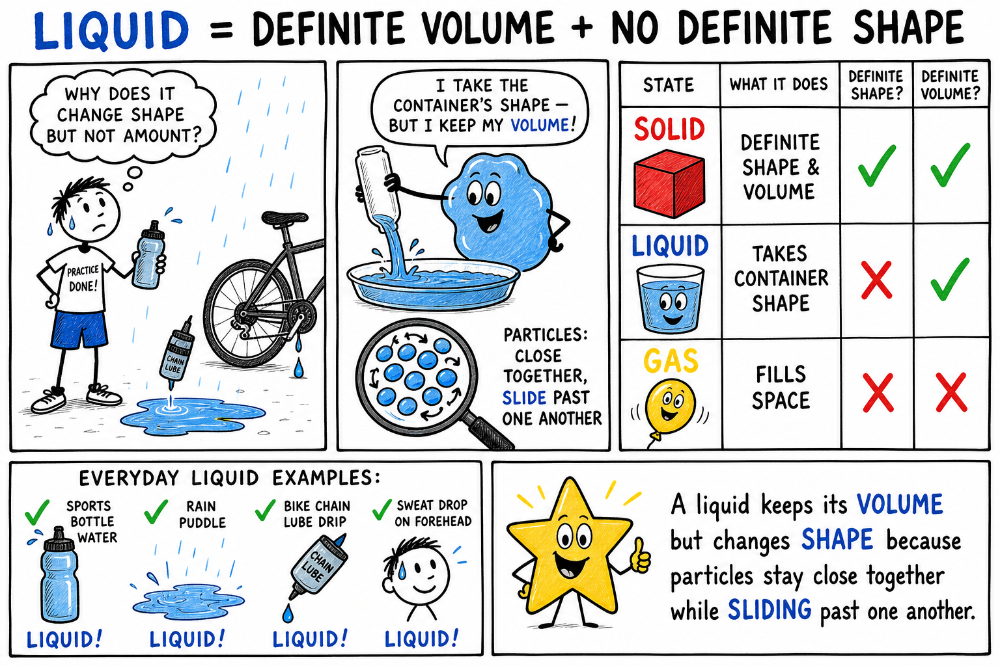
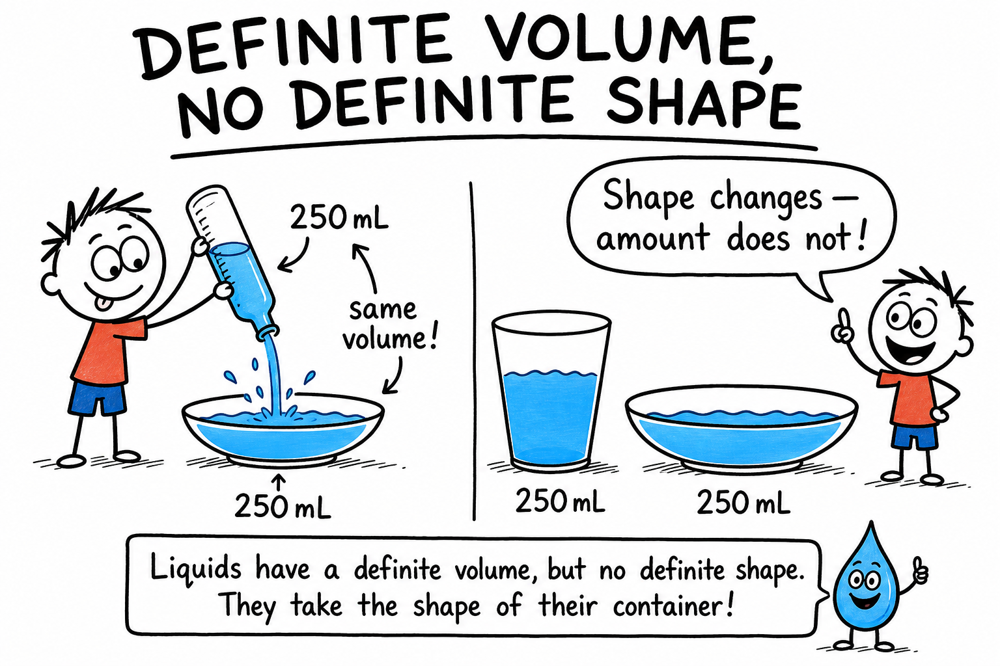
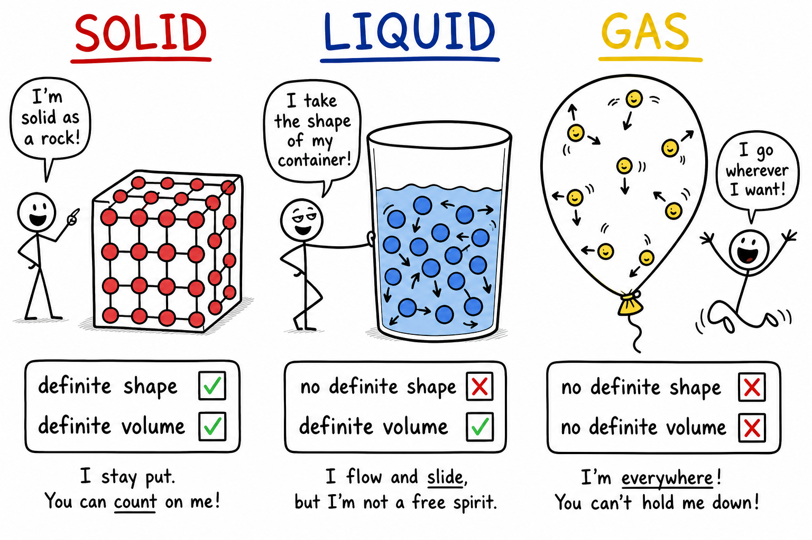
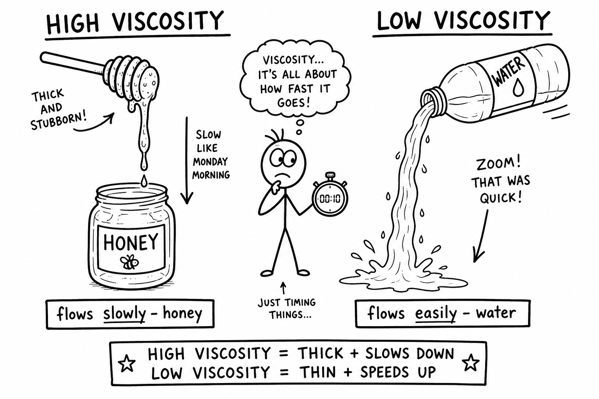
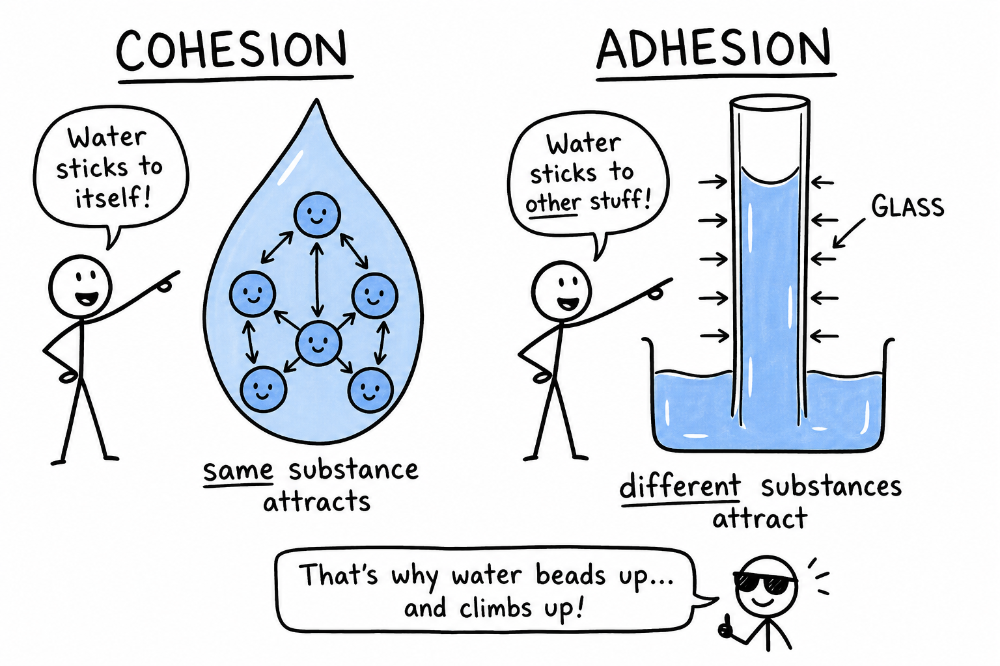
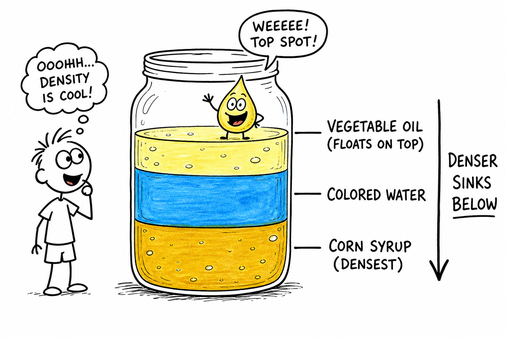
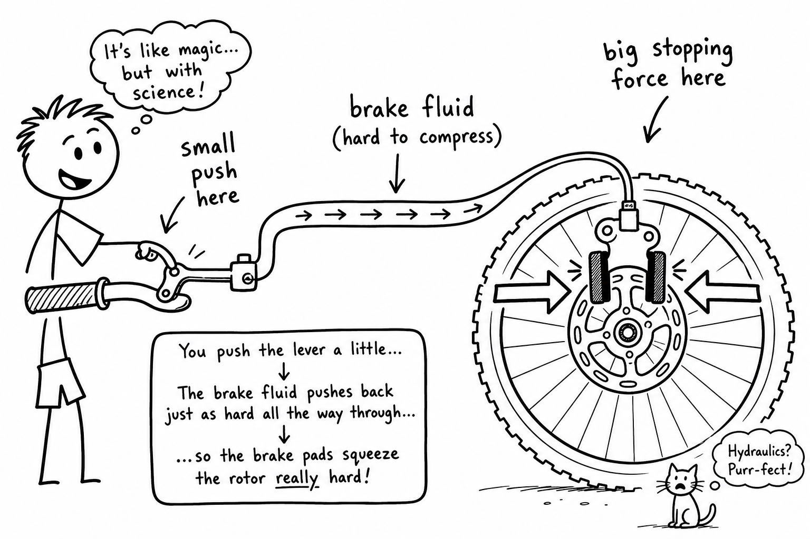
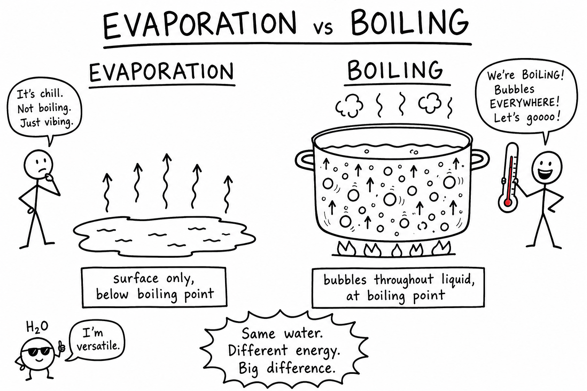

# Liquid

You squeeze a sports bottle and water shoots into your mouth. Rain pools in a puddle after practice. Chain lube drips onto a bike gear. Sweat beads on your forehead and helps cool you when it evaporates.

None of those liquids keep the shape of the container they came from. Pour the same water into a tall cup, a wide bowl, or a narrow flask, and the shape changes each time.

But the amount of water is still the same.

That is one of the key ideas about liquids.

**A liquid is a state of matter with a definite volume but no definite shape.**

Liquids are everywhere in the world you actually use. They include water, sports drinks, milk, juice, oil, rain, blood, gasoline, ink, liquid soap, brake fluid, and engine oil. They cool your body, power machines, shape weather, and carry nutrients through living things.

To understand liquids, you must look smaller — at how their particles behave.

## Liquids Are Matter

A liquid is a kind of matter.

As you learned in the chapter on matter, **matter** is anything that has mass and takes up space.

Liquids have mass. A full water bottle weighs more than an empty one.

Liquids also take up space. If you pour too much water into a cup, it overflows because the cup has only so much volume.

Because liquids have mass and volume, they are matter.

## Definite Volume

A liquid has a **definite volume**.

Volume is the amount of space matter takes up.

If you pour 250 milliliters of water from a measuring cup into a bowl, the shape changes, but the volume is still 250 milliliters.

This is different from a gas. A gas spreads out to fill whatever container it is in.

A liquid does not usually expand to fill an entire room. It keeps about the same volume under ordinary conditions.

## No Definite Shape

A liquid does not have a definite shape.

Instead, it takes the shape of its container.

Water in a tall sports bottle is tall and narrow. The same water in a shallow dish is wide and flat.

This happens because the particles in a liquid can move and slide past one another.

Liquids can flow, pour, drip, splash, and spread.

They do not hold their own shape the way solids usually do.

## Particles in a Liquid

Liquids are made of tiny particles such as atoms, molecules, or ions.

In a liquid, the particles are close together, but they are not locked in fixed positions.

They can move around and slide past one another.

This particle motion explains why liquids flow and take the shape of their containers.

Liquid particles have more freedom of motion than particles in a solid, but they are still much closer together than particles in a gas.

## Liquids Compared with Solids and Gases

Solids, liquids, and gases are all states of matter, but their particles behave differently.

In a solid, particles are packed closely and mostly vibrate in place. A solid has definite shape and definite volume.

In a liquid, particles are close together but can slide past one another. A liquid has definite volume but no definite shape.

In a gas, particles are far apart and move freely. A gas has no definite shape and no definite volume.

Liquids are in the middle. They are more flexible than solids but more compact than gases.

If you have read the chapter on solids, you already know one side of this comparison. Liquids are the state between a rigid solid and a spread-out gas.

## Flow

To **flow** means to move smoothly from one place to another.

Liquids flow because their particles can move past one another.

Water flows down a stream. Syrup flows slowly from a bottle. Rainwater flows along a gutter. Blood flows through blood vessels. Brake fluid flows through lines when you press a pedal.

Gravity often pulls liquids downward, but liquids can also be pushed through pipes by pumps or pressure.

Flow is one of the most important features of liquids.

## Viscosity

Not all liquids flow at the same speed.

**Viscosity** is a liquid's resistance to flowing.

A liquid with high viscosity flows slowly.

A liquid with low viscosity flows easily.

Honey has higher viscosity than water. Molasses has higher viscosity than juice. Motor oil is more viscous than gasoline. Thick chain lube moves more slowly than water.

Temperature can affect viscosity. Warm honey flows more easily than cold honey because heating lets its particles move more freely.

Viscosity matters in cooking, engines, medicine, painting, and many machines. Engineers choose liquids partly by how fast they need to flow.

## Surface Tension

Some small insects can stand on water. A carefully placed paper clip may float on the surface even though steel is denser than water.

This happens because of **surface tension**.

Surface tension is the tightness of a liquid's surface caused by attraction between particles.

Water molecules attract one another. At the surface, this attraction can make the water act a little like a stretched skin.

Surface tension helps water form droplets. It also helps explain why water beads up on waxed surfaces or on a freshly waxed car.

Soap reduces water's surface tension, which helps water spread and clean more effectively.

## Cohesion and Adhesion

Liquids show two useful kinds of attraction.

**Cohesion** is attraction between particles of the same substance.

Water molecules sticking to other water molecules show cohesion.

**Adhesion** is attraction between particles of different substances.

Water sticking to glass shows adhesion.

Cohesion helps water form drops.

Adhesion helps water climb slightly up the sides of a glass tube and wet surfaces.

Together, cohesion and adhesion help explain many liquid behaviors.

## Capillary Action

**Capillary action** is the movement of liquid through narrow spaces, often against gravity.

Water can move upward in a thin tube, paper towel, plant stem, or tiny spaces in soil.

Capillary action happens because of cohesion, adhesion, and surface tension.

Plants depend on it as part of the way water moves from roots toward leaves.

Paper towels work because water is pulled into tiny spaces between fibers.

Capillary action is a small effect with large importance.

## Meniscus

When water is in a narrow glass container, the surface may curve near the edges.

This curved surface is called a **meniscus**.

Water usually forms a meniscus that curves downward in the middle because water is attracted to glass.

Mercury forms a meniscus that curves upward in the middle because mercury particles attract one another more strongly than they attract glass.

When measuring liquid in a graduated cylinder, scientists read the volume at the bottom of the water meniscus.

Careful measurement matters in labs, cooking, and medicine.

## Measuring Liquid Volume

Liquid volume is often measured with tools such as:

- Measuring cups
- Graduated cylinders
- Beakers
- Pipettes
- Syringes
- Flasks

Common units include liters and milliliters.

A **liter** is a common metric unit of volume.

A **milliliter** is one-thousandth of a liter.

Water has a helpful relationship: one milliliter of water has a mass of about one gram under ordinary classroom conditions.

This makes water useful for learning about mass, volume, and density.

## Density of Liquids

Liquids have density.

**Density** is how much mass is packed into a certain volume.

Some liquids are denser than others.

For example, corn syrup is denser than water, and many oils are less dense than water.

This is why oil often floats on water.

If liquids do not mix, they may form layers according to density. Denser liquids settle below less dense liquids.

A density column made from safe liquids such as corn syrup, colored water, and vegetable oil can show this clearly.

## Floating and Sinking in Liquids

Objects float or sink in a liquid depending partly on density.

An object floats if it is less dense than the liquid or if its shape lets it displace enough liquid.

An object sinks if it is denser than the liquid and cannot displace enough liquid to support its weight.

A cork floats in water because it is less dense than water.

A stone sinks because it is denser than water.

A steel ship floats because its hollow shape includes air and lets it displace a large volume of water.

Liquids make buoyancy visible.

## Pressure in Liquids

Liquids can exert pressure.

**Pressure** is force spread over an area.

The deeper you go in a liquid, the greater the pressure becomes because more liquid is above you pushing down.

This is why deep-sea submarines must be very strong.

It is also why your ears may feel pressure when you dive underwater in a pool or lake.

Liquid pressure pushes in all directions, not just downward.

Hydraulic machines use this fact.

## Hydraulics

**Hydraulics** is the use of liquids to transmit force.

Liquids are difficult to compress, so they can carry force through pipes and cylinders.

Hydraulic systems are used in:

- Car and bike brakes
- Excavators
- Lifts
- Dump trucks
- Airplane controls
- Some doors and presses

In a hydraulic brake system, pressing a pedal puts pressure on brake fluid. The fluid transmits the pressure to the brakes near the wheels.

Hydraulics shows that liquids can do heavy work. A small push at one end can create a large push somewhere else.

## Compressibility

Liquids are usually difficult to compress.

To **compress** means to squeeze into a smaller volume.

Gases compress easily because their particles are far apart.

Liquids do not compress easily because their particles are already close together.

This is why liquids are useful in hydraulic systems. They can transmit pressure well because they do not simply shrink much when squeezed.

## Changing State

Liquids do not stay liquids forever. They can change into other states of matter.

**Evaporation** is the change from liquid to gas at the surface of a liquid. Sweat evaporating from your skin after a game carries energy away and helps cool you. For more detail, see the chapter on evaporation.

**Boiling** is the change from liquid to gas throughout a liquid. Bubbles of water vapor rise through the liquid. Boiling happens at a substance's boiling point under ordinary pressure. Water boils at about 100 degrees Celsius at sea level. For more detail, see the chapter on boiling.

**Condensation** is the change from gas to liquid. Water droplets on a cold drink form when water vapor in the air cools and condenses.

**Freezing** is the change from liquid to solid. Liquid water freezes into ice at 0 degrees Celsius under ordinary conditions. For more detail, see the chapter on freezing.

**Melting** is the change from solid to liquid. Ice melts into water. Wax and chocolate melt when heated. For more detail, see the chapter on melting.

Evaporation happens at the surface. Boiling happens throughout the liquid. Melting and freezing are opposite changes at the same temperature for a pure substance.

## Water: A Special Liquid

Water is the most important liquid on Earth.

Living things need water. Weather depends on water. Oceans, lakes, rivers, rain, snow, clouds, and groundwater shape the planet.

Water can dissolve many substances, which is why it is often called a universal solvent. That does not mean it dissolves everything. Oil, sand, and many plastics do not dissolve well in water.

Water is also unusual because solid water, ice, is less dense than liquid water. Ice floats.

This matters greatly. If ice sank, lakes and ponds could freeze from the bottom up, making life much harder for many organisms.

## Solutions, Suspensions, and Mixing

A **solution** is an evenly mixed mixture. Salt water and sugar water are solutions. In a solution, one substance dissolves in another. The **solute** is dissolved. The **solvent** does the dissolving. In salt water, salt is the solute and water is the solvent.

A **suspension** is a mixture in which particles are spread through a liquid but not dissolved. Muddy water and paint with pigment are suspensions. The particles may settle unless the mixture is stirred or shaken.

Some liquids do not mix evenly. Liquids that do not mix are called **immiscible**. Oil and water are the familiar example. When shaken together, they may form droplets briefly, but they usually separate again into layers, with oil floating because it is less dense than water.

## Liquids in the Real World

Living things depend on liquids. Blood carries oxygen and nutrients. Sap moves through plants. Sweat helps cool you during exercise. Tears protect the eyes.

Weather depends on liquids too. Rain is liquid water falling from clouds. Fog is made of tiny water droplets near the ground. The water cycle depends on evaporation, condensation, freezing, melting, and precipitation.

Technology uses liquids everywhere. Engine oil reduces friction. Brake fluid transmits pressure. Coolants carry heat away from machines. Liquid fuels store chemical energy. Ink carries color. A mechanic does not put water in an engine where oil belongs — the properties of the liquid must match the job.

## Common Misconceptions

One mistake is thinking all liquids are watery. Honey, oil, syrup, and mercury are liquids too, but they behave differently from water.

Another mistake is thinking a liquid has no volume because it changes shape. A liquid changes shape, but it keeps a definite volume.

A third mistake is thinking evaporation and boiling are the same. Evaporation happens at the surface; boiling happens throughout the liquid.

A fourth mistake is thinking bubbles in boiling water are air. The bubbles are mostly water vapor.

A fifth mistake is thinking all liquids mix with water. Oil and many other liquids do not mix evenly with water.

## Safety with Liquids

Many liquids are safe in ordinary use, but liquids can also be hot, poisonous, slippery, flammable, corrosive, or irritating.

Good safety habits include:

- Do not taste unknown liquids.
- Do not smell chemicals directly.
- Keep liquids away from electrical devices unless the activity is designed for it.
- Wipe spills quickly with adult guidance.
- Walk carefully near wet floors.
- Wear goggles when mixing, heating, or pouring liquids in experiments.
- Use heat only with adult supervision.
- Do not mix household liquids or cleaners without adult instruction.
- Label liquids clearly during investigations.
- Wash hands after handling experiment materials.
- Follow teacher instructions for disposal.

Liquids are useful because they flow. That same ability means they can spill, spread, and carry substances where they should not go.

## The Big Idea

A liquid is a state of matter with definite volume but no definite shape.

Liquid particles are close together but can slide past one another, allowing liquids to flow and take the shape of their containers. Liquids have properties such as viscosity, surface tension, density, and the ability to dissolve substances. They can evaporate, boil, condense, freeze, transmit pressure, and support life.

If you remember only one sentence, remember this:

**A liquid keeps its volume but changes shape because its particles stay close together while sliding past one another.**

## Study Questions

1. What is a liquid?
2. Why is a liquid considered matter?
3. What does definite volume mean?
4. Why does a liquid not have a definite shape?
5. How are particles arranged and moving in a liquid?
6. How is a liquid different from a solid?
7. How is a liquid different from a gas?
8. What does it mean for a liquid to flow?
9. What is viscosity?
10. Which has higher viscosity: honey or water?
11. What is surface tension?
12. How does soap affect water's surface tension?
13. What is cohesion? What is adhesion?
14. What is capillary action?
15. What is a meniscus?
16. What is density? Why does oil often float on water?
17. What is hydraulics? Why are liquids useful in hydraulic systems?
18. How is evaporation different from boiling?
19. What is a solution? What is the difference between a solute and a solvent?
20. Why is ice floating on water important for lakes and ponds?
21. What are three safety rules for studying or handling liquids?
22. In your own words, explain why a bike or car needs the right liquid for brakes or an engine, not just any liquid that pours.
