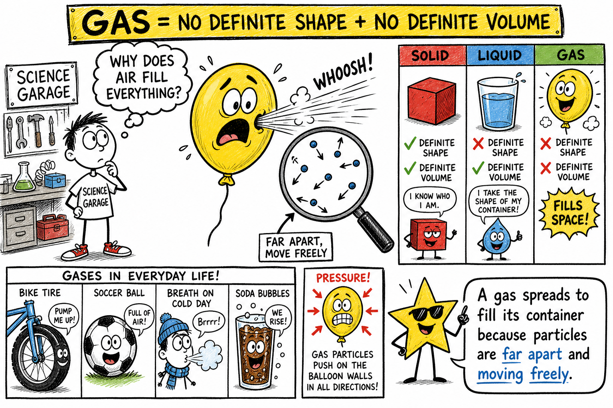
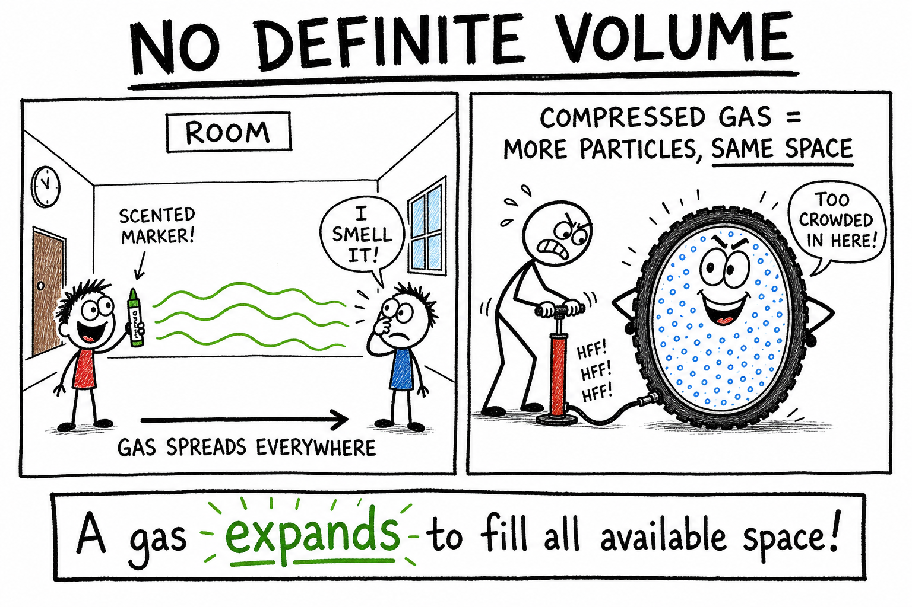
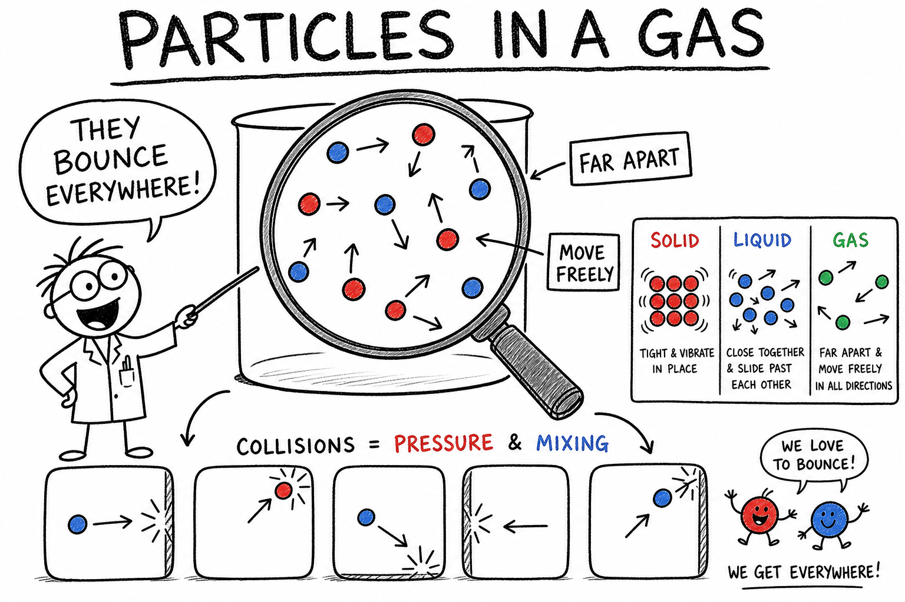
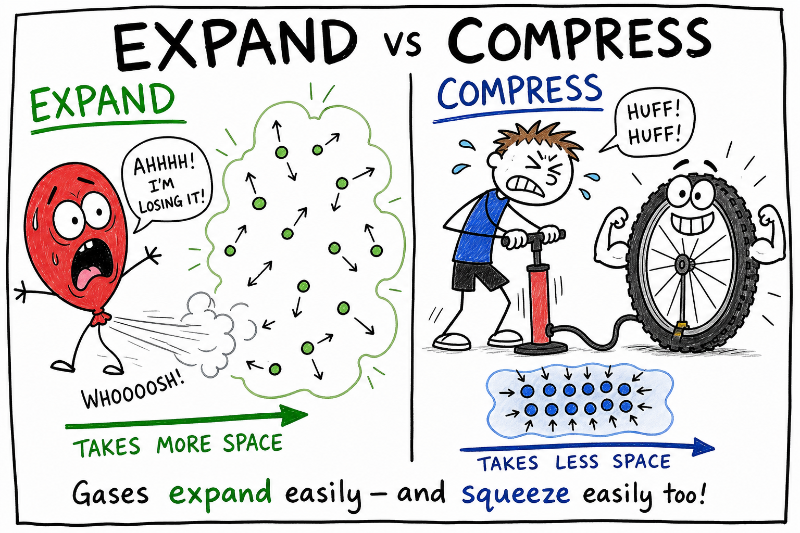
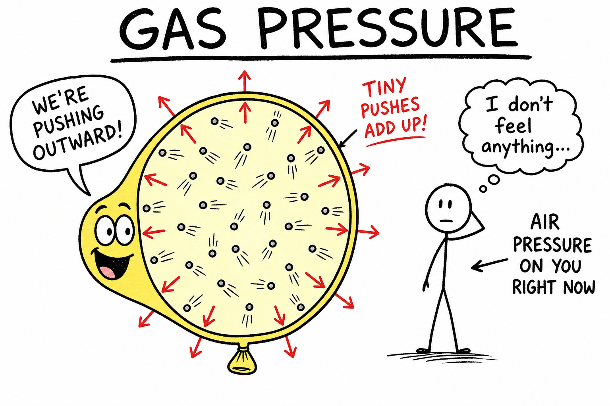
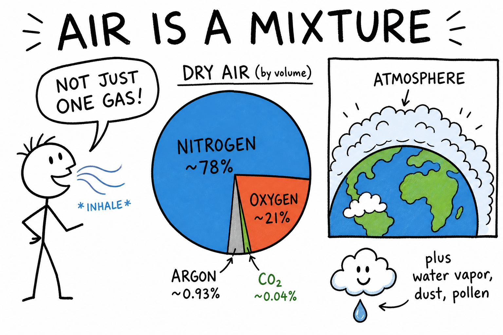
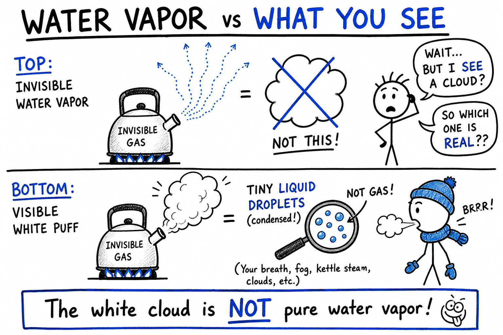
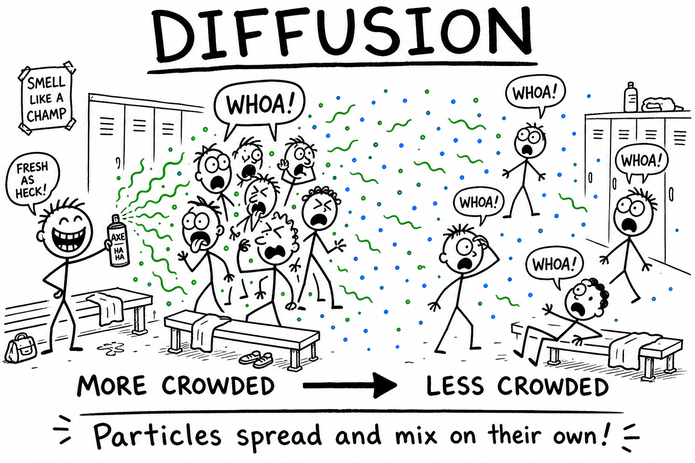
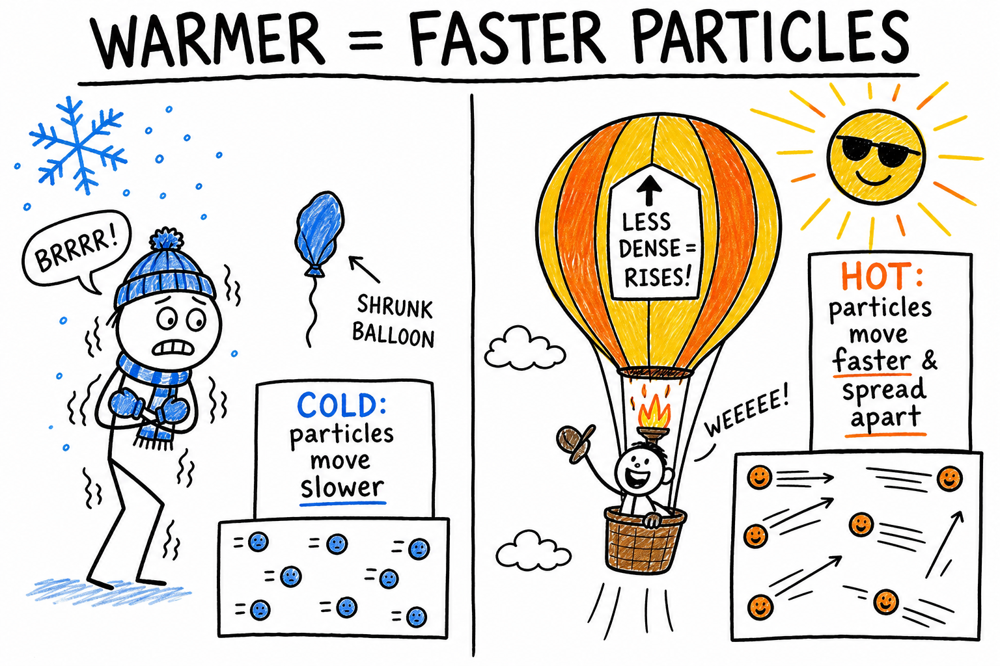

# Gas

Pump air into a bike tire and the rubber firms up. Let go of a tied balloon and it shoots across the room. Crack open a soda and bubbles rush out. On a cold morning, your breath makes a little cloud in front of you.

You cannot see most of the gas around you, but you can see what it does.

These are all clues about gases.

**A gas is a state of matter with no definite shape and no definite volume.**

Gases spread out, fill containers, push on surfaces, mix easily, and often stay invisible. Air, oxygen, nitrogen, carbon dioxide, helium, water vapor, and natural gas are all gases under ordinary conditions.

To understand gases, you must think about tiny particles moving freely.

## Gases Are Matter

A gas is a kind of matter.

As you learned in the chapter on matter, **matter** is anything that has mass and takes up space.

Gases have mass. A soccer ball pumped full of air weighs slightly more than the same ball with less air inside.

Gases also take up space. Air can fill a balloon, a tire, a room, or a scuba tank.

Because gases have mass and volume, they are matter, even when they are invisible.

## No Definite Shape

A gas has no definite shape.

Instead, it takes the shape of its container.

Air in a balloon has the shape of the balloon. Air in a gym has the shape of the gym. Helium in a tank has the shape of the tank.

This happens because gas particles move freely and spread out.

Unlike a solid, a gas does not keep its own shape. Unlike a liquid, it does not merely settle at the bottom of a container. It spreads in all directions.

## No Definite Volume

A gas has no definite volume.

It expands to fill the space available to it.

If someone opens a scented marker at one end of a room, the smell can eventually reach the other end. Gas particles spread through the air.

If more air is pumped into a bike tire, more gas particles are squeezed into the same space. The tire becomes firm because the compressed gas pushes outward on the rubber.

This is different from a liquid. A cup of water keeps about the same volume when poured into a bowl. A gas spreads out to fill its container.

## Particles in a Gas

Gases are made of tiny particles such as atoms or molecules.

In a gas, the particles are far apart compared with particles in solids and liquids.

They move freely, quickly, and in many directions.

They collide with one another and with the walls of their container.

These constant collisions explain many gas behaviors, including pressure, expansion, and mixing.

## Gases Compared with Solids and Liquids

Solids, liquids, and gases are all states of matter.

In a solid, particles are close together and mostly vibrate in place. A solid has definite shape and definite volume.

In a liquid, particles are close together but can slide past one another. A liquid has definite volume but no definite shape.

In a gas, particles are far apart and move freely. A gas has no definite shape and no definite volume.

Gases are the most spread-out of the three familiar states.

If you have read the chapters on solids and liquids, you already know two sides of this comparison. A gas is the state where particles have the most freedom and the most empty space between them.

## Expansion

To **expand** means to take up more space.

Gases expand easily because their particles are far apart and move freely.

When gas is placed in a larger container, it spreads out to fill the larger space.

If a balloon is untied, the compressed air inside expands outward and rushes away.

Expansion is one reason gases matter in engines, weather, breathing, and many machines.

## Compression

To **compress** means to squeeze into a smaller volume.

Gases can be compressed much more easily than liquids or solids.

This is because gas particles have lots of empty space between them.

When you pump air into a bike tire or a basketball, you squeeze more gas particles into the same space. The tire or ball becomes firm because the compressed gas pushes outward.

Compressed gases are useful, but they can be dangerous if stored carelessly. A pressurized tank can release energy suddenly if damaged.

## Gas Pressure

**Gas pressure** is the force of gas particles hitting the walls of a container or surface.

Gas particles are constantly moving. When they collide with a wall, they push on it.

Many tiny pushes together create pressure.

Air pressure pushes on your body all the time. You do not usually notice it because the pressure inside your body balances much of the pressure outside.

A balloon stays inflated because gas particles inside it push outward on the rubber.

## Air Pressure

Air is a mixture of gases surrounding Earth.

The weight of this air creates **air pressure**.

Air pressure is strongest near sea level because more air is above you pushing down.

At high mountains, air pressure is lower because there is less air above.

Lower air pressure means fewer oxygen molecules in each breath, which is why mountain climbers may need time to adjust or may use oxygen equipment.

Air pressure affects weather, breathing, boiling point, balloons, airplanes, and many instruments.

## The Atmosphere

Earth is surrounded by a blanket of gases called the **atmosphere**.

The atmosphere contains mostly nitrogen and oxygen.

It also contains argon, carbon dioxide, water vapor, and small amounts of other gases.

The atmosphere protects life, helps keep Earth warm enough for living things, carries water vapor, and provides oxygen for animals and carbon dioxide for plants.

Without the atmosphere, Earth would be a very different and much harsher place.

Storms, wind, clouds, and the air you breathe all happen inside this gas layer.

## Air Is a Mixture

Air is not a single gas.

Air is a mixture of gases.

Dry air near Earth's surface is mostly:

- Nitrogen
- Oxygen
- Argon
- Carbon dioxide

Air also often contains water vapor, dust, pollen, smoke particles, and tiny droplets.

Nitrogen makes up most of the air. Oxygen is the gas humans and many animals need for breathing. Carbon dioxide is used by plants in photosynthesis.

## Oxygen

**Oxygen** is a gas needed by humans and many other living things for respiration.

Respiration is the process cells use to release energy from food.

Oxygen also supports combustion. That means many fires need oxygen to keep burning.

A campfire, a gas grill, and a candle all need oxygen from the air to keep burning.

Oxygen is important, but pure oxygen can make fires burn more intensely. It must be handled carefully in hospitals, laboratories, and industry.

In ordinary air, oxygen is mixed with nitrogen and other gases.

## Carbon Dioxide

**Carbon dioxide** is a gas made of carbon and oxygen.

Animals breathe out carbon dioxide.

Burning fuels often produces carbon dioxide.

Plants use carbon dioxide, water, and sunlight to make food during photosynthesis.

Carbon dioxide is also used in fizzy drinks, fire extinguishers, and dry ice.

Too much carbon dioxide in an enclosed space can be dangerous because it can crowd out oxygen.

Carbon dioxide is also an important greenhouse gas in Earth's atmosphere.

## Water Vapor

**Water vapor** is water in the gas state.

Water vapor is invisible. The white cloud you see above a kettle or on a cold morning is not pure water vapor. It is mostly tiny liquid droplets formed when water vapor cools and condenses.

Water vapor enters the air by evaporation from puddles, lakes, sweat, and transpiration from plants.

When water vapor cools, it can condense into liquid water droplets, forming clouds, fog, dew, or rain.

Water vapor is a key part of weather and the water cycle.

## Helium

**Helium** is a gas that is much less dense than air.

Helium balloons rise because the helium inside is lighter than the surrounding air.

Helium does not burn and is safer than hydrogen for balloons.

Helium is also used in science, medicine, and technology, including some MRI machines and very cold research equipment.

Never inhale helium from balloons or tanks. It can replace the oxygen your body needs and cause serious harm.

## Diffusion

**Diffusion** is the spreading of particles from an area where they are more crowded to an area where they are less crowded.

Gases diffuse easily because their particles move freely and quickly.

If someone sprays deodorant in a locker room, the smell can eventually spread across the room. The particles move and mix with air particles.

Diffusion helps gases mix, spread odors, move oxygen into the lungs, and move carbon dioxide out of the body.

**Effusion** is a related idea: gas escaping through a tiny opening, such as air slowly leaking from a balloon through a small hole. You do not need to memorize the word, but it helps explain why some balloons deflate over time.

## Temperature and Gases

Heating a gas makes its particles move faster.

Cooling a gas makes its particles move more slowly.

If a gas is trapped in a closed container, heating it often increases pressure because faster particles hit the container walls harder and more often.

If a gas can expand, heating it often makes it take up more space.

This is why hot air balloons rise. Heating the air inside the balloon makes it expand. Some air leaves the opening, and the remaining hot air inside becomes less dense than the cooler air outside.

You can see a smaller version of this with a balloon. A balloon may shrink in cold air and expand again in warm air because gas particle motion changes with temperature.

For this chapter, remember the simple idea: warmer gas particles move faster and tend to spread farther apart.

## Pressure and Volume

When temperature stays about the same, squeezing a gas into a smaller volume increases its pressure.

If you push the plunger of a sealed syringe, the trapped air is compressed. The gas particles have less space, so they collide with the walls more often. That makes the pressure increase.

If you let the gas expand into a larger space, the pressure decreases.

This relationship helps explain pumps, syringes, lungs, tires, and many machines.

## Gases and Density

Gases have density, but they are usually much less dense than solids and liquids.

**Density** is how much mass is packed into a certain volume.

Warm air is usually less dense than cool air because its particles are spread farther apart.

Less dense gases can rise through denser gases.

This helps explain hot air balloons, chimney drafts, weather patterns, and rising warm air currents.

Different gases also have different densities. Helium is less dense than air. Carbon dioxide is denser than air.

## Buoyancy in Gases

Buoyancy is not only for liquids.

Objects can float in gases too.

A helium balloon floats in air because the balloon and helium together are less dense than the air they displace.

A hot air balloon floats because the heated air inside is less dense than the cooler air outside.

Air pushes upward on objects in it, just as water pushes upward on objects in water.

The upward push is usually small for ordinary objects, but it matters greatly for balloons and airships.

## Gases and Weather

Weather happens in the atmosphere, so gases are central to weather.

Air moves from place to place as wind.

Warm air rises. Cool air sinks.

Water vapor evaporates, condenses, forms clouds, and falls as precipitation.

Air pressure differences help create winds and storms.

Weather maps often show high-pressure and low-pressure areas because pressure affects how air moves.

Understanding gases helps explain wind, clouds, storms, fog, humidity, and temperature changes.

A cold front, a thunderstorm, and a foggy morning all involve gases moving, mixing, and changing.

## Breathing

Breathing depends on gases.

When you inhale, air enters your lungs. Oxygen moves from the air into your blood.

When you exhale, carbon dioxide leaves your blood and exits your body.

Your diaphragm and rib muscles help change the volume of your chest. This changes air pressure and moves air in and out.

Breathing is not just "sucking in air." It is a pressure and volume process involving gases.

After a hard run, you breathe faster because your body needs more oxygen and must remove more carbon dioxide.

## Gases in Water

Gases can dissolve in liquids.

Fish use oxygen dissolved in water.

Carbon dioxide dissolves in soda under pressure. When the bottle is opened, pressure decreases and carbon dioxide bubbles out.

This is why fizzy drinks foam and hiss.

Warmer water often holds less dissolved gas than cooler water. This matters for fish and other aquatic life.

The behavior of gases affects oceans, lakes, drinks, blood, and living systems.

## Combustion and Gases

Many fires involve gases.

Oxygen gas supports combustion.

Fuel vapors can burn when mixed with oxygen and ignited.

Smoke contains hot gases and tiny particles.

Carbon monoxide is a dangerous gas that can form when fuels burn without enough oxygen. It is poisonous and hard to detect because it has no color or smell.

This is why homes need carbon monoxide detectors and why engines, stoves, heaters, and grills must be used safely.

## Gases in Technology

Gases are used in many technologies.

Compressed air powers tools, inflates tires, and operates some machines.

Oxygen is used in medicine and welding.

Carbon dioxide is used in fire extinguishers and fizzy drinks.

Helium is used in balloons and scientific equipment.

Natural gas is used as a fuel for stoves and heaters.

Nitrogen is used to protect foods, fill some tires, and create low-temperature conditions when liquefied.

Gases may be invisible, but they are powerful tools in workshops, kitchens, hospitals, and factories.

## Aerosols and Sprays

Some products use gas pressure to spray liquids or fine particles.

Examples include spray paint, whipped cream cans, and some cleaning products.

Pressurized containers must be handled carefully.

They should not be heated, punctured, crushed, or thrown into fires.

The gas inside can expand and raise pressure dangerously.

Always follow safety labels on pressurized containers.

## Condensation

**Condensation** is the change of state from gas to liquid.

Water vapor condenses on a cold drink cup, forming droplets.

Dew forms when water vapor in air cools on grass, leaves, and other surfaces.

Clouds form when water vapor rises, cools, and condenses into tiny droplets or ice crystals.

Condensation is the opposite of evaporation.

It shows that gases can change state when temperature changes.

## Evaporation and Boiling

Liquids become gases by evaporation or boiling.

Evaporation happens at the surface of a liquid.

Boiling happens throughout a liquid when bubbles of vapor form inside it.

Water can evaporate from a puddle at ordinary outdoor temperatures.

Water boils when heated to its boiling point under the surrounding pressure.

Both processes turn liquid water into water vapor, but they happen differently.

If you have read the chapter on liquids, you already know evaporation and boiling from the liquid side. Here you see the same changes from the gas side.

## Sublimation

**Sublimation** is the change of state from solid directly to gas.

Dry ice, which is solid carbon dioxide, sublimates into carbon dioxide gas.

Snow and ice can also slowly sublime under certain cold, dry conditions.

Sublimation is less familiar than melting or boiling, but it is an important change of state.

Dry ice should only be handled with adult supervision because it is extremely cold and produces carbon dioxide gas.

## Common Misconceptions

One mistake is thinking gases are not matter because many are invisible. Gases have mass and take up space.

Another mistake is thinking air is empty space. Air is a mixture of gases.

A third mistake is thinking gases have no weight. Gases have mass, so gravity pulls on them.

A fourth mistake is thinking steam and water vapor are exactly what you see above boiling water. Invisible water vapor may condense into visible tiny droplets.

A fifth mistake is thinking all gases are safe because they cannot be seen. Some gases are poisonous, flammable, very hot, very cold, or able to push with dangerous pressure.

## Gas Safety

Gases can be useful, but they deserve respect.

Good safety habits include:

- Do not inhale gases from balloons, tanks, cans, or experiments.
- Do not smell unknown gases directly.
- Keep flames away from flammable gases and vapors.
- Use pressurized containers only as directed.
- Do not heat or puncture aerosol cans or gas cylinders.
- Use dry ice only with adult supervision and good ventilation.
- Make sure rooms are ventilated during activities that produce gases.
- Never mix household chemicals to make gases.
- Leave an area and tell an adult if you smell gas, smoke, or strong fumes.
- Stay away from damaged gas cylinders or tanks.

Invisible does not mean harmless. A safe scientist treats gases carefully.

## The Big Idea

A gas is a state of matter with no definite shape and no definite volume.

Gas particles are far apart and move freely, so gases expand to fill containers, compress easily, diffuse, exert pressure, and change with temperature. Gases make up the atmosphere, support breathing and combustion, shape weather, dissolve in liquids, power technologies, and take part in many changes of state.

If you remember only one sentence, remember this:

**A gas spreads to fill its container because its particles are far apart and moving freely.**

## Study Questions

1. What is a gas?
2. Why is a gas considered matter?
3. Why does a gas have no definite shape?
4. Why does a gas have no definite volume?
5. How are particles arranged and moving in a gas?
6. How is a gas different from a solid?
7. How is a gas different from a liquid?
8. What does it mean for a gas to expand?
9. What does it mean to compress a gas?
10. Why can gases be compressed more easily than liquids or solids?
11. What is gas pressure?
12. What causes air pressure?
13. What is the atmosphere?
14. What gases make up most of dry air near Earth's surface?
15. Why is oxygen important?
16. Why is carbon dioxide important?
17. What is water vapor?
18. Why do helium balloons rise in air?
19. What is diffusion?
20. Give one example of diffusion in a gas.
21. What happens to gas particles when a gas is heated?
22. What usually happens to gas pressure in a closed container when the gas is heated?
23. What happens to gas pressure when a gas is squeezed into a smaller volume?
24. What is density?
25. Why does warm air often rise?
26. How does breathing depend on pressure and volume changes?
27. Why does soda fizz when opened?
28. What is condensation?
29. What is sublimation?
30. What are three safety rules for studying or handling gases?
31. In your own words, explain why pumping air into a bike tire makes it feel firm even though you cannot see the air inside.
