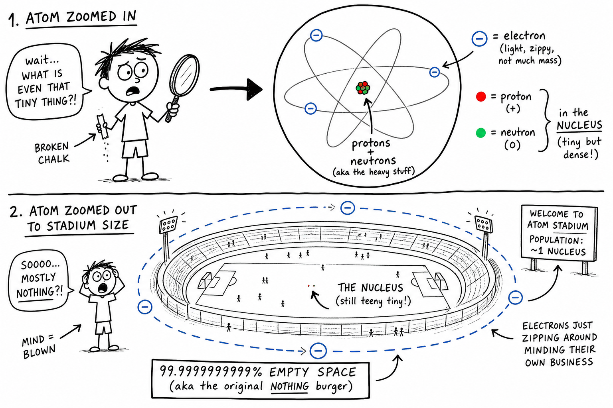

# Atom

Snap a pencil lead. Crush a piece of chalk. Scratch rust off a bike chain. Every one of those actions breaks matter into smaller pieces — but only down to a point.

If you could keep dividing and dividing, you would eventually reach particles too tiny to see with any ordinary microscope.

Those particles are **atoms**.

**An atom is one of the tiny building blocks of matter.**

Atoms are so small that millions of them could fit across the head of a pin. Yet atoms make up the aluminum in a bat, the carbon in a campfire, the iron in your blood, the copper in headphone wires, the oxygen you breathe, the sodium in sports drinks, and the silicon in computer chips.

To understand matter, chemistry, electricity, heat, light, life, and materials, you must understand atoms.

## Matter Is Made of Atoms

As you learned in the chapter on matter, **matter** is anything that has mass and takes up space.

All ordinary matter is made of atoms.

A rock, a puddle, the air in your lungs, and your own body are all made of atoms.

Atoms can join together in many ways. Different kinds of atoms and different arrangements produce the many substances in the world.

That is why diamond, sugar, oxygen, iron, water, salt, and wood behave so differently. Their atoms are different, arranged differently, or joined differently.

## How Small Is an Atom?

Atoms are extremely small.

A single grain of sand contains an enormous number of atoms.

Scientists sometimes use a size comparison to help picture this: if an atom were enlarged to the size of a sports stadium, its nucleus would still be tiny compared with the whole stadium. Most of the atom's volume is space where electrons may be found.

This does not mean matter is empty in the ordinary sense. The forces between particles make matter feel solid, resist squeezing, and behave as the materials you know.

The smallness of atoms is one reason science is so remarkable. We cannot see individual atoms with our eyes, but we can understand them through evidence, experiments, and models.

## Parts of an Atom

Atoms are made of smaller particles.

The three main subatomic particles for this chapter are:

- **Protons** — positive electric charge
- **Neutrons** — no electric charge
- **Electrons** — negative electric charge

Protons and neutrons are found in the **nucleus**, the tiny, dense center of the atom. Electrons are found outside the nucleus.

Almost all the mass of an atom is in the nucleus. The nucleus is very small compared with the whole atom, but it is extremely important. The number of protons in the nucleus determines what **element** the atom is.

## Protons and Atomic Number

A **proton** is a positively charged particle in the nucleus of an atom.

The number of protons is called the **atomic number**.

Every atom of the same element has the same number of protons. Change the number of protons, and you change the element.

| Element | Protons (atomic number) |
|---------|-------------------------|
| Hydrogen | 1 |
| Carbon | 6 |
| Oxygen | 8 |
| Iron | 26 |
| Gold | 79 |

For example, every carbon atom has 6 protons. If an atom has 6 protons, it is carbon. If it has 7 protons, it is nitrogen.

No two different elements have the same atomic number.

Protons help give the nucleus its positive charge. Because protons are positive and electrons are negative, they attract each other by electric force.

## Neutrons

A **neutron** is a particle in the nucleus with no electric charge.

Neutrons add mass to the atom and help stabilize many nuclei.

Atoms of the same element can have different numbers of neutrons. These forms are called **isotopes**.

For example, most carbon atoms have 6 neutrons, but some carbon atoms have 7 or 8 neutrons. They are still carbon because they still have 6 protons.

## Electrons

An **electron** is a negatively charged particle found outside the nucleus.

Electrons are much less massive than protons or neutrons. They are important because they help determine how atoms bond, react, conduct electricity, and form materials.

In a **neutral atom**, the number of electrons equals the number of protons. A neutral carbon atom with 6 protons has 6 electrons. A neutral oxygen atom with 8 protons has 8 electrons.

**Neutral does not mean the atom has no charges.** It means the positive and negative charges balance overall.

## Ions

If an atom gains or loses electrons, it becomes an **ion** — an atom or group of atoms with an electric charge.

- Lose electrons → more protons than electrons → **positively charged**
- Gain electrons → more electrons than protons → **negatively charged**

For example, a sodium atom can lose one electron and become a positive sodium ion. A chlorine atom can gain one electron and become a negative chloride ion. Oppositely charged ions can attract each other and form compounds such as table salt.

Ions connect directly to static electricity and many chemical reactions you will study later.

## Elements

An **element** is a pure substance made of only one kind of atom.

Oxygen, carbon, iron, and gold are all elements. Each element is defined by its number of protons.

The **periodic table** organizes the elements by atomic number and properties. When you learn about atoms, you are learning the alphabet of matter. Elements are like the letters. Compounds and materials are like words and stories made from those letters.

## Mass Number and Isotopes

The **mass number** is the total number of protons and neutrons in an atom's nucleus.

Electrons are so light compared with protons and neutrons that they usually contribute very little to mass number.

For example:

- Carbon with 6 protons and 6 neutrons → mass number 12 (carbon-12)
- Carbon with 6 protons and 7 neutrons → mass number 13 (carbon-13)

Both are carbon atoms because both have 6 protons. They are different **isotopes** — atoms of the same element with different numbers of neutrons.

Carbon-14 has 6 protons and 8 neutrons. Some isotopes are stable. Others are **radioactive**, meaning their nuclei can change and release radiation. Scientists use isotopes in medicine, archaeology, energy, and research — including dating ancient objects and tracing substances inside the body.

## Electrons Around the Nucleus

Electrons are found outside the nucleus in regions often called **shells** or **energy levels**.

An **energy level** is a region around the nucleus where electrons may be found with certain amounts of energy.

Older diagrams often draw electrons like tiny planets orbiting the nucleus. These pictures are useful for beginners, but real electrons do not move exactly like planets. Modern science describes electrons using **clouds of probability** — regions where electrons are likely to be found.

For this chapter, the important idea is that electrons occupy regions around the nucleus and their arrangement helps determine how atoms behave.

## Valence Electrons

The electrons farthest from the nucleus are especially important. These are called **valence electrons**.

Valence electrons are involved in bonding and chemical reactions. Atoms often react in ways that change, share, or transfer valence electrons.

For example, sodium and chlorine can form salt because sodium tends to lose one electron and chlorine tends to gain one electron. The arrangement of valence electrons helps explain why some elements are very reactive — like sodium — and others are not — like gold.

## Molecules and Chemical Bonds

A **molecule** is a group of atoms joined together.

- Oxygen gas is made of oxygen molecules, each with two oxygen atoms.
- Water molecules contain hydrogen and oxygen atoms.
- Carbon dioxide molecules contain carbon and oxygen atoms.

Atoms join to make molecules through **chemical bonds** — attractions that hold atoms or ions together.

Two important kinds of bonding are:

- **Ionic bonding** — electrons are transferred and oppositely charged ions attract
- **Covalent bonding** — atoms share electrons

Chemical bonds explain why atoms stay together in compounds and molecules.

## Compounds

A **compound** is a pure substance made of two or more elements chemically joined in a fixed ratio.

Water is a compound made of hydrogen and oxygen. Carbon dioxide is a compound made of carbon and oxygen. Table salt is a compound made of sodium and chlorine.

Compounds can have properties very different from the elements that make them. Sodium is a reactive metal. Chlorine is a poisonous gas. Joined as sodium chloride, they form ordinary table salt you can safely sprinkle on food.

Atoms can become something surprisingly different when they combine.

## Atomic Models

An **atomic model** is a simplified picture or idea used to explain atoms.

Because atoms are too small to see directly with ordinary tools, scientists use models to help think about them. Models are not perfect copies of reality — a model airplane is not a real airplane, but it can show shape and parts. An atomic model is not the atom itself, but it can help explain evidence.

Scientific models change when new evidence is found. The history of the atom is a story of better and better models.

### Dalton's Atomic Theory

In the early 1800s, John Dalton helped develop an important atomic theory. Dalton proposed that matter is made of atoms and that atoms of different elements are different. His ideas helped explain chemical reactions and why substances combine in fixed proportions.

Dalton did not know about protons, neutrons, and electrons. Those discoveries came later. Even so, his work was a major step toward modern chemistry.

### Thomson and the Electron

J. J. Thomson discovered the electron in the late 1800s. This showed that atoms were not solid, indivisible balls. Atoms had smaller parts.

Thomson knew electrons were negatively charged, so he proposed a model with electrons inside a positively charged material. His model was later replaced, but discovering the electron was a huge breakthrough. It opened the door to understanding electricity, ions, bonding, and atomic structure.

### Rutherford and the Nucleus

Ernest Rutherford and his students performed a famous experiment using thin gold foil. They shot tiny positive particles at the foil. Most passed through, but a few bounced back or changed direction sharply.

This surprised scientists. Rutherford concluded that atoms have a tiny, dense, positively charged nucleus. Most of the atom is space around that nucleus. This experiment changed the model of the atom.

### Bohr's Model

Niels Bohr proposed a model in which electrons occupy certain energy levels around the nucleus. Bohr's model helped explain why atoms absorb and give off specific colors of light.

You may see Bohr diagrams in school, with electrons drawn on rings around the nucleus. These diagrams are useful for learning, especially for simple atoms. Modern atomic theory is more complex, but Bohr's model remains a helpful stepping stone.

### The Modern Atomic Model

The modern atomic model does not show electrons as tiny planets on neat circular tracks. Instead, electrons are described by regions where they are likely to be found — sometimes called electron clouds or **orbitals**.

This model is based on **quantum mechanics**, a branch of physics that studies very small particles. You do not need all the advanced mathematics now.

The important point is this:

**Atoms have a tiny nucleus with protons and neutrons, and electrons occupy regions around it.**

## Atoms and Electricity

Atoms help explain electricity — a topic you have already begun studying.

Electrons have negative charge and can move more easily in some materials than in others. In metals, some electrons can move through the material. That is why metals often conduct electric current well. Copper wires in headphones, aluminum in power lines, and the circuits in a game controller all depend on moving electrons.

Static electricity often happens when electrons transfer from one object to another. Electric current in wires is usually the movement of electrons through a conductor.

Understanding atoms helps explain why electricity works.

## Atoms and Magnetism

Atoms also help explain magnetism.

Electrons are connected to tiny magnetic effects. In most materials, these effects cancel out. In magnetic materials such as iron, many atomic magnetic effects can line up in regions called **domains**. When many domains line up, the material acts like a magnet.

This connects the atom chapter to magnetism and electromagnets. The behavior of tiny particles can create forces large enough to lift paper clips, run motors, and guide compasses.

## Atoms and Light

Atoms can absorb and give off light.

When electrons in atoms gain energy, they may move to higher energy levels. When they lose energy, they may give off light.

Different elements give off different patterns of light. Scientists can study these patterns to identify elements in stars, lamps, flames, and distant gases. That is one way we know what the Sun and stars are made of, even though we cannot scoop up a piece of them.

Fireworks use this idea. Different metal atoms in the powder produce different colors when heated.

## Atoms in Living Things

Living things are made of atoms.

Your body contains mostly oxygen, carbon, hydrogen, nitrogen, calcium, and phosphorus atoms, along with smaller amounts of many others. These atoms are arranged into water, proteins, fats, sugars, DNA, bones, muscles, nerves, and blood.

Life depends not on special "living atoms," but on ordinary atoms arranged in extraordinarily organized ways. Chemistry is one of the bridges between matter and life.

## Atoms Are Conserved in Chemical Changes

In ordinary chemical reactions, atoms are rearranged. They are not created or destroyed.

When hydrogen burns in oxygen to form water, hydrogen atoms and oxygen atoms are rearranged into water molecules. When iron rusts on a bike chain, iron atoms join with oxygen atoms to form rust.

This helps explain the **conservation of matter**. The atoms present before a chemical reaction are still present after the reaction, but they may be joined in new ways.

## Atoms and Nuclear Changes

Most chemistry deals with electrons and chemical bonds. The nucleus usually stays the same during ordinary chemical changes.

In **nuclear changes**, the nucleus itself changes. Nuclear changes can release much more energy than ordinary chemical reactions. Radioactive decay, nuclear fission, and nuclear fusion involve changes in atomic nuclei.

These topics are more advanced, but it is useful to know that changing the nucleus is very different from ordinary chemistry.

## Seeing Atoms

You cannot see atoms with your eyes or with an ordinary classroom microscope.

However, scientists have tools that can image or detect atoms and their effects. Powerful instruments such as scanning tunneling microscopes and electron microscopes help scientists study matter at extremely small scales.

Even before such instruments existed, scientists had strong evidence for atoms from chemical reactions, gases, crystals, electricity, and Brownian motion.

Science often learns about things too small to see directly by studying their effects.

## Common Misconceptions

One mistake is thinking atoms are alive because they make up living things. Atoms are not alive by themselves.

Another mistake is thinking atoms are tiny solid balls. Atoms have internal structure — a tiny nucleus and electrons around it.

A third mistake is thinking electrons orbit exactly like planets. That picture is a beginner's model, not the full modern model.

A fourth mistake is thinking all atoms of an element are identical in every way. Isotopes of an element have the same number of protons but different numbers of neutrons.

A fifth mistake is thinking chemical reactions destroy atoms. Ordinary chemical reactions rearrange atoms; they do not destroy them.

## Safety and Atoms

You do not handle individual atoms in ordinary classroom activities, but atomic ideas connect to real substances and experiments.

Good safety habits include:

- Do not taste unknown substances.
- Do not smell chemicals directly.
- Wear goggles when an experiment requires them.
- Do not mix chemicals without teacher instruction.
- Wash hands after handling lab materials.
- Treat powders, liquids, metals, acids, bases, and gases with care.
- Follow instructions for heat, glassware, electricity, and disposal.
- Do not touch radioactive materials or unknown minerals without proper supervision.

Atomic science explains the tiny world, but safe science still begins with careful behavior in the visible world.

## The Big Idea

An atom is one of the tiny building blocks of matter.

Atoms contain a nucleus made of protons and neutrons, with electrons in regions around the nucleus. The number of protons determines the element. Electrons help explain bonding, ions, electricity, magnetism, and chemical reactions. Atoms can join to form molecules and compounds, and ordinary chemical changes rearrange atoms rather than destroying them.

If you remember only one sentence, remember this:

**An atom is a tiny particle of matter with a proton-and-neutron nucleus and electrons around it, and its protons identify the element.**

## Study Questions

1. What is an atom?
2. Why are atoms important for understanding matter?
3. Name the three main subatomic particles discussed in this chapter and their charges.
4. What is the nucleus, and which particles are found there?
5. What determines which element an atom is?
6. What is atomic number?
7. What is mass number?
8. What are isotopes?
9. What does it mean for an atom to be neutral?
10. What is an ion? What happens when an atom loses electrons? Gains electrons?
11. What is an element?
12. What is a molecule?
13. What is the difference between ionic bonding and covalent bonding?
14. What is a compound? Give one example.
15. Why are atomic models useful?
16. What did Thomson discover?
17. What did Rutherford's gold foil experiment show?
18. How is the modern atomic model different from simple planet-like pictures?
19. How do atoms help explain electric current in metals?
20. How do atoms help explain why different elements produce different colors in fireworks?
21. What is the difference between a chemical change and a nuclear change?
22. What are three safety rules for studying substances and atomic ideas in the classroom?
23. In your own words, explain why learning about atoms helps you understand things you can actually see and use.
