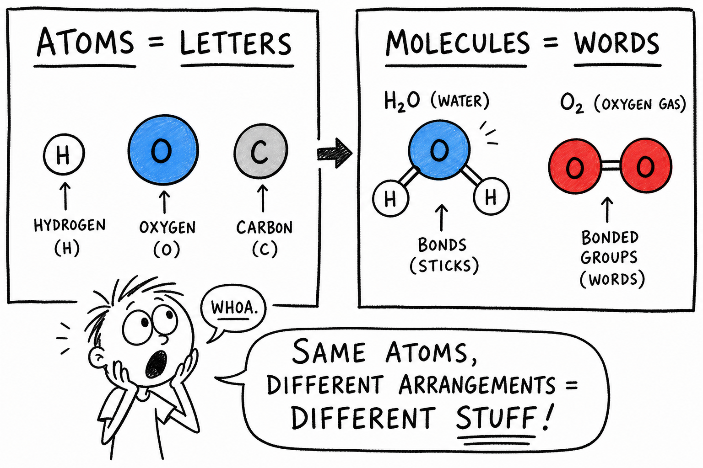

# Molecule

You crack open a sports drink after practice. You smell smoke from a campfire. You watch bubbles race up through a soda. You breathe hard after a sprint and feel your chest rise and fall.

You cannot see the tiny pieces inside any of those moments, but they are there — billions of them.

Each sip, each smell, each bubble, and each breath involves **molecules**.

**A molecule is a group of atoms held together by chemical bonds.**

Molecules make up water, oxygen gas, carbon dioxide, sugar, fats, proteins, plastics, fuels, smells, flavors, and much of your own body. If atoms are the letters of matter, molecules are like words made from those letters.

To understand molecules, start with what you already know about **atoms** — the tiny building blocks from the last chapter.

## Atoms Join Together

An **atom** is one of the tiny building blocks of matter.

Atoms can exist alone, but many atoms join with other atoms. When they join, they form larger particles.

Sometimes two atoms join. Sometimes hundreds or thousands join. Sometimes millions connect in long chains or networks.

The way atoms join helps explain why substances behave differently. Water acts nothing like oxygen gas because its atoms are joined in a different pattern.

## Chemical Bonds

A **chemical bond** is an attraction that holds atoms or ions together.

Chemical bonds involve electrons, especially the **valence electrons** — the outer electrons farthest from the nucleus.

Atoms bond because certain arrangements of electrons are more stable than others.

You do not need every detail of bonding yet. The main idea is this:

**Chemical bonds hold atoms together to make molecules and compounds.**

## Molecules and Compounds

A molecule is a group of atoms bonded together.

A **compound** is a pure substance made of two or more elements chemically joined in a fixed ratio.

Some molecules are compounds. Water is both a molecule and a compound because it contains hydrogen and oxygen atoms chemically joined. Carbon dioxide is both because it contains carbon and oxygen.

Some molecules are not compounds. Oxygen gas is made of molecules with two oxygen atoms bonded together. It is a molecule, but not a compound, because it contains only one element.

| Substance | Formula | Molecule? | Compound? | Why |
|-----------|---------|-----------|-----------|-----|
| Water | H2O | Yes | Yes | Hydrogen and oxygen bonded together |
| Carbon dioxide | CO2 | Yes | Yes | Carbon and oxygen bonded together |
| Oxygen gas | O2 | Yes | No | Only oxygen atoms |
| Nitrogen gas | N2 | Yes | No | Only nitrogen atoms |

## Molecules of Elements

Some elements naturally form molecules.

- **Oxygen gas** — O2, two oxygen atoms per molecule
- **Nitrogen gas** — N2, two nitrogen atoms per molecule
- **Hydrogen gas** — H2, two hydrogen atoms per molecule

These are **molecules of elements**. Atoms are bonded together, but all atoms are the same element.

The air you breathe is mostly nitrogen molecules (N2) and oxygen molecules (O2), not single atoms floating alone.

## Molecules of Compounds

Many molecules contain atoms of different elements. These are **molecules of compounds**.

Examples include water, carbon dioxide, methane, ammonia, sugar, and the acetic acid in vinegar.

The atoms in each molecule are joined in a specific pattern. Water is not just any mixture of hydrogen and oxygen. A water molecule always has two hydrogen atoms bonded to one oxygen atom. That arrangement matters.

## Chemical Formulas

A **chemical formula** is shorthand for what atoms are in a substance.

| Substance | Formula | Atoms in one molecule |
|-----------|---------|----------------------|
| Water | H2O | 2 hydrogen, 1 oxygen |
| Carbon dioxide | CO2 | 1 carbon, 2 oxygen |
| Oxygen gas | O2 | 2 oxygen |
| Methane | CH4 | 1 carbon, 4 hydrogen |
| Table sugar (sucrose) | C12H22O11 | 12 carbon, 22 hydrogen, 11 oxygen |

Chemical formulas are like compact recipes for molecules.

## Subscripts

In a chemical formula, small numbers called **subscripts** show how many atoms of an element are present.

In H2O, the 2 belongs to hydrogen — two hydrogen atoms. O has no written subscript, which means one oxygen atom.

In CO2, the 2 belongs to oxygen — two oxygen atoms.

Read subscripts carefully. **H2O** is water. **H2O2** is hydrogen peroxide — a completely different substance used in some cleaners. Small differences in formulas can mean large differences in properties.

## Molecular Shape

Molecules have shapes. Atoms are not usually lined up in a perfectly straight row unless bonding makes that shape.

- Water molecules have a **bent** shape.
- Carbon dioxide molecules are **straight** (linear).
- Methane molecules are shaped like a tiny pyramid.

Shape matters because it affects how molecules attract one another, dissolve, react, smell, taste, and behave in living things. Molecules are too small to see with your eyes, but their shapes have large effects.

## Covalent Bonds

Many molecules are held together by **covalent bonds** — bonds that form when atoms **share electrons**.

In a water molecule, hydrogen and oxygen atoms share electrons. Sharing helps the atoms become more stable.

Covalent bonds are common in molecules made from nonmetal elements such as hydrogen, oxygen, nitrogen, carbon, chlorine, and sulfur. Most molecules in living things contain covalent bonds.

## Ionic Compounds

Not every substance made of joined atoms is best described as separate little molecules.

Table salt is made of sodium ions and chloride ions that attract each other because they have opposite charges. Salt is an **ionic compound**. It forms a **crystal lattice** — a repeating pattern of ions — rather than separate salt molecules.

For now, remember: **molecules** are groups of atoms bonded together, while some compounds like salt are made of repeating networks of ions.

## Diatomic Molecules

A **diatomic molecule** is a molecule made of exactly two atoms.

Important examples include hydrogen (H2), nitrogen (N2), oxygen (O2), fluorine (F2), and chlorine (Cl2).

Oxygen in the air is mostly O2. Nitrogen is mostly N2. These paired atoms are stable enough to be common in nature — which is why your cells can use oxygen from each breath.

## Attractions Between Molecules

Molecules can attract one another. These attractions are usually **weaker** than the chemical bonds holding atoms together inside a molecule — but they are still very important.

They help explain why water is a liquid at room temperature, why sugar dissolves in water, why oil and water separate, and why some substances evaporate easily.

If molecules attract strongly, the substance may have a higher boiling point. If they attract weakly, the substance may evaporate more easily.

## Water — The Molecule That Runs the World

Water is one of the most important molecular substances on Earth.

Each water molecule has two hydrogen atoms bonded to one oxygen atom: **H2O**.

Water molecules have a bent shape and uneven charge distribution, so they attract one another strongly. These attractions help give water its high surface tension, its ability to dissolve many substances, and its unusually high boiling point for such a small molecule.

Water molecules are small, but their behavior shapes oceans, weather, cells, rivers, clouds, and life.

## Oxygen and Carbon Dioxide

**Oxygen gas** is made of O2 molecules — two oxygen atoms bonded together. Humans and many animals need oxygen for **respiration**, the process cells use to release energy from food. Oxygen also supports combustion, which is why pure oxygen tanks must be handled carefully around flames.

**Carbon dioxide** (CO2) has one carbon atom and two oxygen atoms per molecule. It is produced when animals breathe out, when fuels burn, and when many living things decompose. Plants use carbon dioxide during photosynthesis. It can dissolve in water — which is why fizzy drinks bubble — and it is an important greenhouse gas in the atmosphere.

## Sugar, Smell, and Taste

Sugar is made of molecules. Table sugar (**sucrose**) has the formula C12H22O11 — carbon, hydrogen, and oxygen in a fixed ratio and arrangement.

Sugar tastes sweet because its molecules fit certain receptors on your tongue. Sugar dissolves in water because water molecules can attract and surround sugar molecules.

**Smells come from molecules too.** When you smell popcorn, pine trees, smoke, or wet soil, molecules from those materials enter the air and reach your nose. Special receptors respond to different molecular shapes. Your brain interprets those signals as smells. That is why a tiny amount of a strong-smelling substance can be noticed from far away — molecules travel through gases by **diffusion**.

## Molecules in Living Things

Living things depend on molecules.

Important biological molecules include water, sugars, fats, proteins, DNA, vitamins, and hormones.

- **Proteins** help build structures and control chemical reactions in cells.
- **DNA** stores genetic information.
- **Fats** store energy and form cell membranes.
- **Sugars** provide energy and building materials.

Life is organized chemistry, and chemistry depends on molecules.

## Large Molecules and Polymers

Some molecules are small, like water or oxygen. Others are enormous.

A **macromolecule** is a very large molecule. Proteins, DNA, starch, and many plastics are macromolecules. They may contain hundreds, thousands, or even millions of atoms. Their size and shape let them do complicated jobs — a protein's shape helps determine what it does in a cell.

A **polymer** is a large molecule made of many repeating smaller units called **monomers**.

Many plastics are polymers. Natural rubber is a polymer. Starch and cellulose in plants are polymers made from sugar units. Proteins are polymers made from amino acids. Polymers can be flexible, strong, stretchy, sticky, smooth, tough, or lightweight depending on their structure — which is why a bike tire, a protein muscle fiber, and a plastic water bottle feel so different even though all are made of molecules.

## Molecular Motion and States of Matter

As you learned in the chapters on solids, liquids, and gases, **molecules are always moving**.

- In a **solid**, molecules mostly vibrate in place.
- In a **liquid**, molecules can slide past one another.
- In a **gas**, molecules move freely and spread far apart.

Heating generally makes molecules move faster. Cooling generally slows them down.

Molecular motion helps explain temperature, melting, freezing, evaporation, boiling, diffusion, and pressure.

## Changes of State

Molecules help explain changes of state.

When ice melts, water molecules do not stop being water molecules. They gain enough energy to move past one another more freely.

When water evaporates, some water molecules escape from the liquid surface into the air as gas. When water vapor condenses, water molecules slow down and come together as liquid droplets.

In these **physical changes**, the molecules remain water molecules. The arrangement and motion change, but the chemical identity stays the same.

## Chemical Reactions

In a **chemical reaction**, atoms are rearranged into new substances. Chemical bonds break and new bonds form.

For example, hydrogen and oxygen can react to form water. Methane can burn in oxygen to form carbon dioxide and water. Vinegar and baking soda react to form new substances, including carbon dioxide gas.

The atoms are not destroyed in ordinary chemical reactions. They are rearranged into different molecules or compounds.

## Conservation of Atoms

In ordinary chemical reactions, **atoms are conserved** — the same atoms present before the reaction are still present after, though joined in new ways.

This is why chemical equations must be **balanced**. A balanced equation shows the same number of each type of atom on both sides. If carbon atoms are present before a reaction, those carbon atoms must appear in the products afterward.

Molecules can change, but atoms are not casually lost.

## Mixtures and Solutions

Many materials are **mixtures** of molecules.

Air is a mixture of nitrogen molecules, oxygen molecules, carbon dioxide molecules, water vapor, and other gases. Lemonade is a mixture of water molecules, sugar molecules, acids, and flavors.

In a mixture, different substances are physically combined, not chemically joined into one fixed formula. Mixtures can often be separated by physical methods.

A **solution** is an evenly mixed mixture. In sugar water, sugar molecules spread among water molecules. The substance being dissolved is the **solute**. The substance doing the dissolving is the **solvent**. At the molecular level, dissolving means particles become separated and surrounded by solvent particles.

## Molecular Models

Scientists use models to represent molecules because molecules are too small to see directly.

Common models include:

- **Ball-and-stick models** — atoms as balls, bonds as sticks
- **Space-filling models** — show how much space atoms take up
- **Structural formulas** — show atoms and bonds on paper
- **Computer models** — used in research and design

No model is perfect, but each helps show something useful — shape, bonds, reactions, or properties.

## Same Atoms, Different Arrangements

Sometimes substances can have the same kinds and numbers of atoms but different arrangements. These are called **isomers**.

The idea is like using the same letters to make different words. *Listen* and *silent* use the same letters but mean different things. In chemistry, arrangement matters.

## Molecules and Materials

The behavior of materials depends on their molecules and how those molecules are arranged.

Plastic wrap, rubber bands, cotton, wood, glue, paint, soap, medicines, fuels, and food all depend on molecular structure. A material's strength, flexibility, melting point, smell, solubility, and flammability can all depend on molecules.

Engineers and chemists design materials by thinking about molecular structure — waterproof fabrics, strong plastics, safer medicines, better batteries, and lighter sports gear all start with molecular ideas.

## Common Misconceptions

One mistake is thinking atoms and molecules are the same thing. **Atoms** are single building blocks; **molecules** are groups of atoms bonded together.

Another mistake is thinking all compounds are made of separate molecules. Some compounds, such as table salt, are made of repeating patterns of ions.

A third mistake is thinking molecules stop moving in solids. Molecules in solids usually **vibrate in place**.

A fourth mistake is thinking a chemical formula shows the full shape of a molecule. A formula shows which atoms are present and how many — not always the complete 3D shape.

A fifth mistake is thinking substances disappear when they dissolve. Their molecules or ions spread out among solvent particles — they do not vanish.

## Molecule Safety

Molecules make up safe substances and dangerous substances. Water, sugar, and oxygen are made of molecules — but so are poisons, fumes, fuels, acids, and many medicines.

Good safety habits include:

- Do not taste unknown substances.
- Do not smell chemicals directly.
- Do not mix chemicals or household cleaners without adult instruction.
- Wear goggles when an activity requires them.
- Use heat only with adult supervision.
- Keep flammable liquids and vapors away from flames.
- Wash hands after experiments.
- Label substances clearly.
- Follow teacher instructions for disposal.
- Treat medicines, cleaners, fuels, and lab chemicals as substances for adult-supervised use.

Knowing that everything is made of molecules does not mean everything is safe. Molecular structure matters.

## The Big Idea

A molecule is a group of atoms held together by chemical bonds.

Molecules may contain atoms of the same element or atoms of different elements. Chemical formulas show what atoms are present and how many. Molecular shape, bonding, motion, and attractions help explain states of matter, dissolving, smells, biological molecules, materials, and chemical reactions. In ordinary chemical changes, atoms are rearranged into new molecules and compounds.

If you remember only one sentence, remember this:

**A molecule is a bonded group of atoms whose arrangement helps determine the substance's properties.**

## Study Questions

1. What is a molecule?
2. What is an atom?
3. What is a chemical bond?
4. What are valence electrons?
5. How is a molecule different from a single atom?
6. What is a compound?
7. Why is water both a molecule and a compound?
8. Why is oxygen gas a molecule but not a compound?
9. What is a chemical formula?
10. What does the formula H2O mean?
11. What are subscripts in chemical formulas?
12. Why can a small difference in a formula matter?
13. Why does molecular shape matter?
14. What is a covalent bond?
15. How is table salt different from a simple molecule like water?
16. What is a diatomic molecule? Give two examples.
17. How can attractions between molecules affect properties?
18. What are two important facts about water molecules?
19. What is a macromolecule? What is a polymer?
20. How does molecular motion differ in solids, liquids, and gases?
21. What happens to water molecules when ice melts?
22. What happens in a chemical reaction?
23. How is a mixture different from a compound?
24. What happens at the particle level when sugar dissolves in water?
25. What are three safety rules for studying substances made of molecules?
26. In your own words, explain why learning about molecules helps you understand things you can actually see, smell, taste, and use every day.
