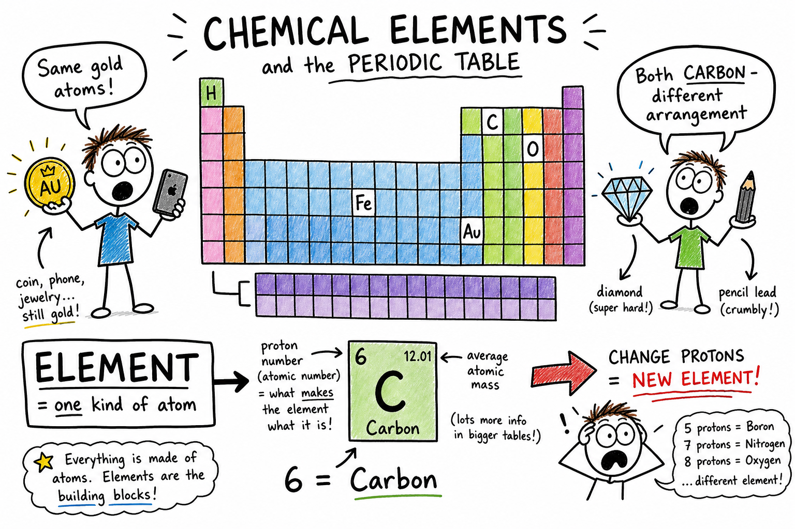

# Element

You flip a gold coin. You breathe after a sprint. You tap the aluminum frame of a bike. You sharpen a pencil and leave a gray streak on paper. You smell smoke from a campfire.

None of those moments look the same. But each one involves **elements** — pure kinds of matter built from one type of atom.

Gold looks like gold whether it is shaped into a coin, a ring, or a tiny flake. Oxygen is still oxygen whether it is in the air, in water, or locked inside rocks. Carbon can appear as soft graphite in a pencil or as diamond, one of the hardest natural materials known.

**An element is a pure substance made of only one kind of atom.**

Elements are the basic chemical building blocks of matter. Everything from stars to stones, oceans to oak trees, game controllers to your own body is made from elements joined or mixed in different ways.

As you learned in the chapter on **atoms**, atoms are tiny building blocks. As you learned in the chapter on **molecules**, atoms can bond into larger groups. **Elements** are the "letters" of chemistry — the pure kinds of atoms that everything else is built from.

## Elements and Atoms

An **atom** is one of the tiny building blocks of matter.

An element is defined by the kind of atoms it contains.

- Pure gold contains only gold atoms.
- Pure oxygen contains only oxygen atoms.
- Pure carbon contains only carbon atoms.

If a substance contains only one kind of atom, it is an **element**.

If it contains atoms of different elements chemically joined, it is a **compound**.

If it contains different substances physically mixed, it is a **mixture**.

| Example | Type | Why |
|---------|------|-----|
| Gold foil | Element | Only gold atoms |
| Oxygen gas (O2) | Element | Only oxygen atoms (often as molecules) |
| Water (H2O) | Compound | Hydrogen and oxygen chemically joined |
| Air | Mixture | Gases physically combined |
| Steel | Mixture (alloy) | Iron mixed with carbon and other elements |

**Important:** Some elements, such as oxygen and nitrogen, commonly exist as **molecules** made of two atoms of the same element. They are still elements because every atom is the same kind.

## Atomic Number — An Element's ID

The identity of an element depends on the number of **protons** in its atoms.

A **proton** is a positively charged particle in the nucleus of an atom.

The number of protons is called the **atomic number**.

| Element | Atomic number (protons) |
|---------|-------------------------|
| Hydrogen | 1 |
| Carbon | 6 |
| Nitrogen | 7 |
| Oxygen | 8 |
| Iron | 26 |
| Gold | 79 |

Every carbon atom has 6 protons. Every oxygen atom has 8. Every gold atom has 79.

**Change the number of protons, and you change the element.**

No two different elements have the same atomic number. If an atom has 6 protons, it is carbon. If it has 7, it is nitrogen. If it has 8, it is oxygen.

The **periodic table** lists elements in order by atomic number. That order is one reason the table is so useful — it is like a map of matter with each element at its own address.

## Elements Are Pure Substances

A **pure substance** has a fixed composition.

An element is a pure substance because it contains only one kind of atom.

Pure copper contains copper atoms. Pure helium contains helium atoms. Pure sulfur contains sulfur atoms.

Most materials around you are **not** pure elements. Wood, glass, water, air, steel, soil, milk, and paper contain more than one element or substance.

Elements are basic building blocks, but they often appear in nature combined with other elements.

## Chemical Symbols

Each element has a **chemical symbol** — a short way to write its name.

| Style | Examples |
|-------|----------|
| One capital letter | H hydrogen, C carbon, O oxygen, N nitrogen, S sulfur |
| Two letters (first capital, second lowercase) | He helium, Ca calcium, Fe iron, Na sodium, Cl chlorine |

**Capital letters matter.** CO is not the same as Co. CO means carbon monoxide (a compound). Co is cobalt (an element).

Chemists around the world use the same symbols so they can understand one another — like a universal shorthand.

## Why Some Symbols Look Strange

Some element symbols come from older names, often Latin.

| Symbol | Element | From |
|--------|---------|------|
| Fe | Iron | ferrum |
| Na | Sodium | natrium |
| K | Potassium | kalium |
| Ag | Silver | argentum |
| Au | Gold | aurum |
| Pb | Lead | plumbum |

These symbols may look surprising at first. Once you know the pattern, they become useful clues — not random letters.

## The Periodic Table

The **periodic table** is a chart that organizes all known elements.

Elements are arranged by atomic number. The table also places elements with similar properties near one another.

That makes the periodic table more than a list. It is a **map of matter**.

From an element's place on the table, scientists can learn about its behavior, its atomic structure, and the kinds of compounds it may form. The periodic table is one of the greatest tools in science.

## Rows and Columns

The horizontal rows are called **periods**.

The vertical columns are called **groups** or **families**.

Elements in the same group often have similar chemical properties because they have similar arrangements of outer electrons.

- **Sodium and potassium** — same group; both are reactive metals.
- **Fluorine and chlorine** — same group; both are reactive nonmetals.
- **Helium, neon, and argon** — same group; noble gases, usually very unreactive.

## Metals, Nonmetals, and Metalloids

Many elements are **metals**. Metals are often shiny, good conductors of heat and electricity, malleable (can be hammered into shape), and ductile (can be drawn into wire). Most are solid at room temperature — mercury is a famous exception.

Examples: iron, copper, aluminum, gold, silver, zinc, nickel, calcium.

Metals show up in wires, tools, buildings, vehicles, coins, cooking pans, machines, and electronics. Different metals have different properties, so engineers choose carefully.

**Nonmetals** usually do not have metallic properties. Many are poor conductors. Some are gases (oxygen, nitrogen, hydrogen, chlorine). Some are solids (carbon, sulfur, phosphorus, iodine).

Nonmetals are extremely important. Oxygen supports respiration. Carbon is the backbone of life. Nitrogen is a major part of air and proteins. Chlorine is used in disinfectants and forms part of table salt.

**Metalloids** have properties between metals and nonmetals — silicon, boron, germanium, arsenic, antimony, tellurium.

Silicon is especially important: it is used in computer chips and solar cells. Some metalloids are **semiconductors** — they conduct electricity better than insulators but not as well as metal conductors. Modern electronics depend on that special in-between behavior.

| Category | Typical properties | Examples |
|----------|-------------------|----------|
| Metal | Shiny, conductive, malleable | Iron, copper, aluminum |
| Nonmetal | Often dull, poor conductor | Oxygen, carbon, sulfur |
| Metalloid | In-between | Silicon, boron |

## Noble Gases

The **noble gases** sit in the far-right group of the periodic table: helium, neon, argon, krypton, xenon, radon.

They are usually very unreactive because their outer electron levels are stable.

- **Helium** — balloons, very cold scientific equipment
- **Neon** — glowing signs
- **Argon** — some light bulbs and welding (does not react easily)

Noble gases show how electron arrangement affects chemical behavior.

## Reactive Elements

Some elements react very easily.

Sodium reacts strongly with water. Chlorine is a reactive gas. Fluorine is extremely reactive. Oxygen reacts with many substances — especially in burning and rusting.

Reactive elements must be handled carefully. Some are dangerous in pure form but useful when combined safely in compounds.

For example, sodium metal and chlorine gas are both hazardous alone, but **sodium chloride** is ordinary table salt.

## Elements and Compounds

Elements can combine chemically to form **compounds** — pure substances made of two or more elements chemically joined in a fixed ratio.

| Compound | Elements in it |
|----------|----------------|
| Water | Hydrogen + oxygen |
| Carbon dioxide | Carbon + oxygen |
| Table salt | Sodium + chlorine |

Compounds often have properties very different from the elements that form them. Water is a liquid you drink; hydrogen and oxygen are gases at room temperature. That contrast is one of the most important ideas in chemistry.

## Elements and Mixtures

Elements can also be part of **mixtures** — matter made of two or more substances physically combined.

- **Air** — nitrogen, oxygen, argon, carbon dioxide, and other gases mixed together
- **Steel** — mostly iron with carbon and sometimes other elements (an **alloy**)
- **Soil** — minerals, organic matter, water, air, and living organisms

In a mixture, the parts are not chemically joined in one fixed ratio.

## Alloys

An **alloy** is a mixture of a metal with one or more other elements, made to improve properties.

| Alloy | Made from | Used for |
|-------|-----------|----------|
| Steel | Iron + carbon (+ others) | Frames, tools, vehicles |
| Bronze | Copper + tin | Historical tools, statues |
| Brass | Copper + zinc | Fittings, instruments |

Alloys can be stronger, harder, more corrosion-resistant, or easier to shape than pure metals. Many useful "metals" in daily life — including parts of bikes, cars, and tools — are actually alloys.

## Elements in Living Things

Living things are made mostly of a few elements:

- **Oxygen** — in water and many biological molecules
- **Carbon** — backbone of life's molecules; can form many kinds of bonds
- **Hydrogen** — in water and organic compounds
- **Nitrogen** — in proteins and DNA
- **Calcium** — bones and teeth
- **Phosphorus** — DNA, cell membranes, bones

Life uses elements from the same periodic table as rocks, air, oceans, and stars.

## Elements in Earth and Stars

Earth's crust is rich in oxygen, silicon, aluminum, iron, calcium, sodium, potassium, and magnesium. Oxygen is common in rocks because it combines with many other elements. Silicon and oxygen form many minerals. Iron is common in rocks and in Earth's core.

Gold, silver, and copper are less common but valuable because of their properties and scarcity. Geology is partly the study of elements arranged in minerals and rocks.

**Stars** are made mostly of hydrogen and helium. In hot stellar cores, **nuclear fusion** can join smaller atoms to form larger ones. Many elements heavier than hydrogen and helium were formed in stars or in violent events such as supernovae.

The carbon, oxygen, calcium, and iron in your body were made possible by processes in stars long before Earth existed. You are literally built from star stuff.

## Natural and Synthetic Elements

Some elements are found naturally on Earth. Others have been made in laboratories — **synthetic elements**. Many synthetic elements are unstable and exist only briefly before changing into other elements. Scientists create and study them to learn more about atomic nuclei. The periodic table includes both natural and synthetic entries.

## Isotopes

Atoms of the same element can have different numbers of **neutrons**. These forms are called **isotopes**.

Isotopes have the same number of protons but different mass numbers.

- **Carbon-12** — 6 protons, 6 neutrons
- **Carbon-14** — 6 protons, 8 neutrons

Both are carbon. Some isotopes are stable. Others are **radioactive**. Isotopes are useful in medicine, archaeology, energy, and research.

## Discovering Elements and Reading Light

People have known some elements since ancient times: gold, silver, copper, iron, carbon, sulfur, tin, lead, and mercury.

Other elements were discovered later as tools improved — experiments, careful measurement, electricity, **spectroscopy**, and atomic theory.

Elements can give off or absorb specific colors of light. This pattern is called a **spectrum** — almost like a fingerprint for each element.

Scientists use spectra to identify elements in stars, flames, lamps, and gases. **Helium** was first detected in the Sun's spectrum before it was found on Earth. That is a powerful example of learning about faraway matter by studying light.

## Element Names and Abundance

Element names come from many sources: places (californium, europium), scientists (einsteinium, curium), properties (hydrogen means "water-former"), and ancient words (gold, iron, silver).

Not all elements are equally common.

- **Hydrogen** — most common in the universe
- **Oxygen** — very common in Earth's crust
- **Nitrogen** — most common gas in Earth's atmosphere
- **Iron** — common in Earth's core; vital for tools and buildings

Some useful elements are rare, which affects mining, technology, cost, and environmental decisions.

## Elements and Human Use

People use elements because of their properties.

- **Copper** — conducts electricity well; used in wires
- **Aluminum** — lightweight, resists corrosion; cans, aircraft, buildings
- **Iron** — made into steel for structures and machines
- **Silicon** — computer chips and solar cells
- **Helium** — light, unreactive gas where needed
- **Carbon** — fuels, plastics, pencils, diamonds, living things

Engineers pick elements (and alloys) the way athletes pick gear — for the job, not just because it looks cool.

## Conservation of Elements

In ordinary chemical reactions, atoms are rearranged but not destroyed.

That means **elements are conserved** in ordinary chemistry. If a reaction begins with carbon atoms, those carbon atoms must appear in the products. If oxygen atoms are present before, they must still be present afterward.

Chemical reactions can change compounds, mixtures, colors, gases, and energy — but they do not casually turn one element into another. Changing one element into another requires **nuclear change**, not ordinary chemistry.

## Common Misconceptions

One mistake is thinking an element is always a single atom by itself. Some elements, such as oxygen and nitrogen, commonly exist as two-atom molecules.

Another mistake is thinking compounds have the same properties as the elements that form them. Salt is nothing like reactive sodium metal plus poisonous chlorine gas.

A third mistake is thinking every pure substance is an element. **Compounds** are pure substances too, but they contain more than one element chemically joined.

A fourth mistake is thinking chemical symbols are always the first letter of the English name. Some come from Latin.

A fifth mistake is thinking ordinary chemical reactions can easily turn one element into another. That requires nuclear changes.

## Element Safety

Elements vary greatly in safety. Some are harmless in ordinary forms. Some are poisonous, reactive, radioactive, flammable, corrosive, or dangerous under certain conditions.

Good safety habits include:

- Do not taste unknown substances.
- Do not touch unknown metals, powders, or crystals without permission.
- Do not smell gases directly.
- Wear goggles when an activity requires them.
- Do not handle reactive elements except in teacher demonstrations.
- Keep metals and powders away from flames unless instructed.
- Wash hands after handling samples.
- Treat mercury, lead, arsenic, and radioactive materials as hazardous.
- Follow teacher instructions for storage and disposal.
- Remember that an element's safety depends on its form, amount, and situation.

The periodic table is fascinating, but it is not a toy chest.

## The Big Idea

An element is a pure substance made of only one kind of atom.

Each element is identified by its number of protons — its **atomic number**. Elements are organized on the periodic table and written with chemical symbols. They may be metals, nonmetals, metalloids, noble gases, or other groups. Elements combine to form compounds, appear in mixtures and alloys, build living things, form Earth and stars, and supply the materials used in technology.

If you remember only one sentence, remember this:

**An element is a pure substance whose atoms all have the same number of protons.**

## Study Questions

1. What is an element?
2. What is an atom?
3. What determines the identity of an element?
4. What is atomic number?
5. Why can no two different elements have the same atomic number?
6. What is the difference between an element, a compound, and a mixture?
7. Why can oxygen gas (O2) still be an element?
8. What is a chemical symbol? Why do capital letters matter?
9. Why does iron have the symbol Fe instead of Ir?
10. What is the periodic table, and how are elements arranged on it?
11. What are periods and groups on the periodic table?
12. Name three common properties of many metals.
13. Give three examples of metals and three examples of nonmetals.
14. What is a metalloid? Why is silicon important?
15. What are noble gases, and why are they usually unreactive?
16. What is a compound? How can a compound differ from the elements that form it?
17. What is a mixture? What is an alloy?
18. Name four important elements in living things and one role for each.
19. What are isotopes?
20. What is a spectrum, and how can it help identify elements?
21. What does conservation of elements mean in ordinary chemical reactions?
22. Name one common misconception about elements.
23. What are three safety rules for studying elements?
24. In your own words, explain why the periodic table is useful — not just as a list to memorize, but as a map of matter.
