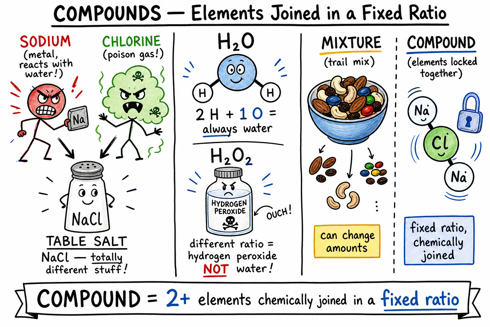
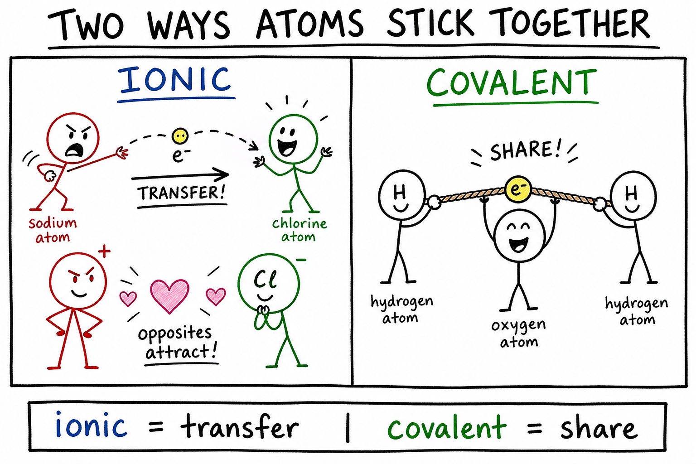
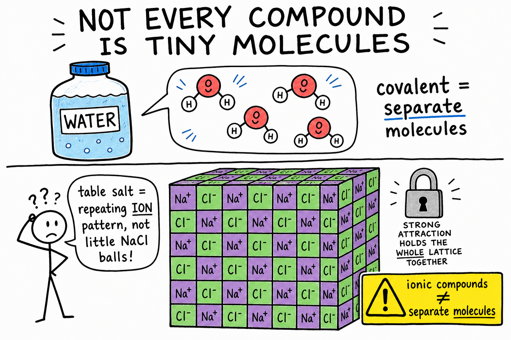
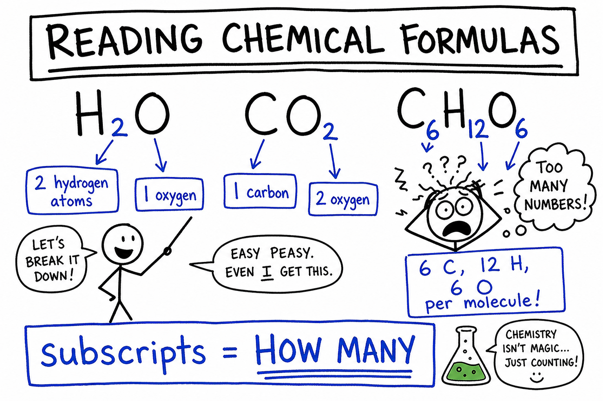
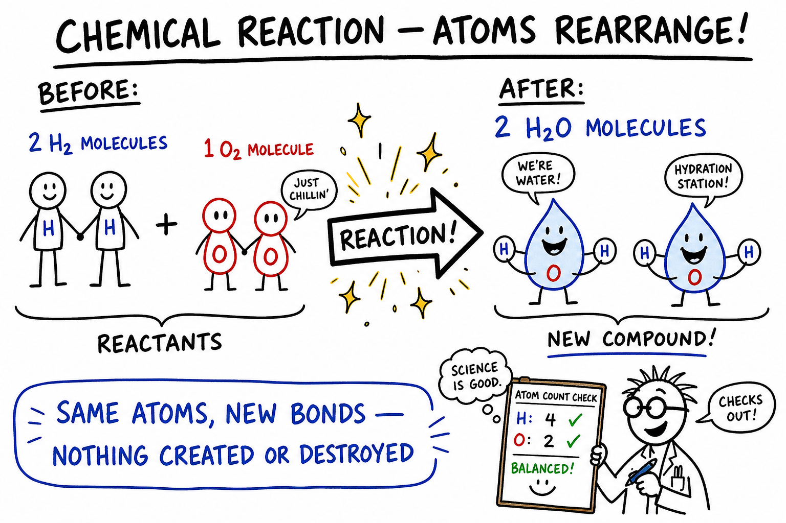
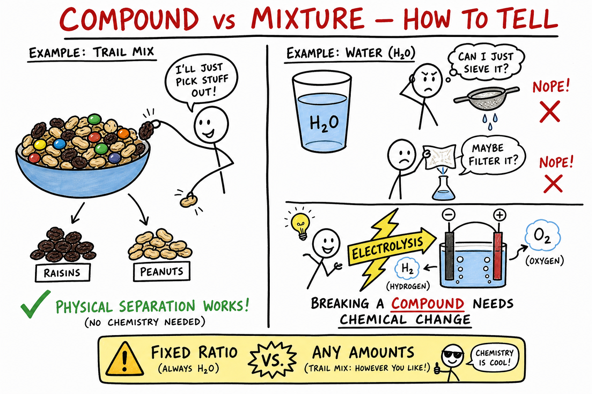

# Compound

You crack open a soda and watch bubbles race upward. You sprinkle salt on fries after a game. You mix baking soda and vinegar for a fizzing volcano demo. You breathe out after a hard sprint and plants later use what you released.

None of those moments look the same. But each one involves **compounds** — pure substances made when atoms of different elements join in a fixed ratio.

Table salt looks harmless enough. It is made from **sodium**, a soft metal that reacts violently with water, and **chlorine**, a poisonous greenish gas. Joined together, they become something entirely different.

That is the power of compounds.

**A compound is a pure substance made of two or more elements chemically joined in a fixed ratio.**

Compounds make up water, sugar, salt, carbon dioxide, baking soda, chalk, rust, vinegar, many medicines, many plastics, and most of the substances in your body. Chemistry is largely the study of how elements form compounds and how compounds change.

As you learned in the chapter on **atoms**, matter is built from tiny particles. As you learned in the chapter on **molecules**, atoms can bond into groups. As you learned in the chapter on **elements**, each element is one kind of atom. **Compounds** are what you get when different elements join chemically — new substances with new properties.

## Elements Join Chemically

An **element** is a pure substance made of only one kind of atom.

Hydrogen, oxygen, carbon, sodium, chlorine, iron, and gold are elements.

Elements can join chemically to form compounds. When they join, their atoms are held together by **chemical bonds**. The result is not just a pile of elements mixed together. It is a new pure substance with its own properties.

| Starting elements | Compound formed | Formula |
|-------------------|-----------------|---------|
| Hydrogen + oxygen | Water | H2O |
| Carbon + oxygen | Carbon dioxide | CO2 |
| Sodium + chlorine | Sodium chloride (table salt) | NaCl |

## Fixed Ratio

A compound has a **fixed ratio** of elements — a definite proportion that does not change for that compound.

Water always has two hydrogen atoms for every one oxygen atom. That is why water's formula is H2O.

Carbon dioxide always has one carbon atom for every two oxygen atoms. That is why its formula is CO2.

**If the ratio changes, the substance changes.**

H2O is water. H2O2 is hydrogen peroxide. Same elements, different ratios — different compounds with different properties. Water is safe to drink in ordinary amounts. Hydrogen peroxide is used as a disinfectant and is not something you drink.

## Pure Substances

A compound is a **pure substance**.

A **pure substance** has a fixed composition. Pure water contains water molecules, not random amounts of hydrogen and oxygen floating separately. Pure carbon dioxide contains carbon dioxide molecules. Pure sodium chloride contains sodium and chloride ions in a fixed pattern.

**Important:** pure substance does not always mean element.

| Type | What it contains | Example |
|------|------------------|---------|
| Element | One kind of atom | Gold, oxygen (O2) |
| Compound | Two or more elements chemically joined | Water, salt, CO2 |
| Mixture | Substances physically combined | Air, trail mix |

A compound can be pure even though it contains more than one element.

## Compounds and Mixtures

A compound is different from a **mixture**.

A **mixture** is matter made of two or more substances physically combined. In a mixture, the parts are not chemically joined in a fixed ratio.

| | Compound | Mixture |
|---|----------|---------|
| How parts combine | Chemically bonded | Physically mixed |
| Ratio | Fixed | Can vary |
| Examples | Water, salt, CO2 | Air, trail mix, salt water |
| Separation | Usually needs chemical change | Often physical methods work |

Trail mix is a mixture — you can have more raisins or fewer peanuts. Air is a mixture of gases. Salt water is a mixture of dissolved salt and water.

Water, carbon dioxide, and table salt are compounds. Their elements are locked together in definite ratios.

## Chemical Bonds

A **chemical bond** is an attraction that holds atoms or ions together.

Compounds form because atoms or ions bond. Two important kinds at this level:

- **Ionic bonding** — electrons are transferred; oppositely charged ions attract
- **Covalent bonding** — atoms share electrons

The kind of bond affects properties such as melting point, hardness, solubility, and whether the compound conducts electricity when melted or dissolved.

## Ionic Compounds

An **ionic compound** is made of positive and negative **ions** held together by electric attraction.

An **ion** is an atom or group of atoms with an electric charge.

Table salt is an ionic compound. Sodium atoms can lose electrons and become positive sodium ions. Chlorine atoms can gain electrons and become negative chloride ions. The opposites attract and form sodium chloride, NaCl.

Ionic compounds often form crystals. Many have high melting points. Some conduct electricity when melted or dissolved in water — useful in batteries and many industrial processes.

## Covalent Compounds

A **covalent compound** is made of atoms joined by sharing electrons.

Water, carbon dioxide, methane, and sugar are covalent compounds. Many covalent compounds form from nonmetal elements. They often exist as **molecules**, though some form large networks.

Their properties vary widely — some are gases, some liquids, some solids at room temperature.

## Molecules and Compounds

A **molecule** is a group of atoms held together by chemical bonds.

Many compounds are made of molecules. Water molecules contain hydrogen and oxygen. Carbon dioxide molecules contain carbon and oxygen. Sugar molecules contain carbon, hydrogen, and oxygen.

But not every compound is best described as separate little molecules.

| Substance | Compound? | Best picture |
|-----------|-----------|--------------|
| Water (H2O) | Yes | Separate molecules |
| Carbon dioxide (CO2) | Yes | Separate molecules |
| Table salt (NaCl) | Yes | Repeating pattern of ions, not separate "salt molecules" |

Table salt is a compound made of a repeating pattern of sodium and chloride ions — not a bag of tiny NaCl molecules the way a bottle of water holds separate H2O molecules.

## Chemical Formulas

A **chemical formula** shows which elements are in a compound and how many atoms or ions are represented.

| Compound | Formula | Elements present |
|----------|---------|-------------------|
| Water | H2O | Hydrogen, oxygen |
| Carbon dioxide | CO2 | Carbon, oxygen |
| Sodium chloride | NaCl | Sodium, chlorine |
| Calcium carbonate | CaCO3 | Calcium, carbon, oxygen |
| Glucose | C6H12O6 | Carbon, hydrogen, oxygen |

Formulas use **element symbols** and **subscripts**. Subscripts tell how many atoms of an element are in each formula unit or molecule. No subscript usually means one.

### Reading Formulas

In **H2O**: H = hydrogen, 2 = two hydrogen atoms, O = oxygen, no subscript = one oxygen atom.

In **CO2**: C = carbon, O = oxygen, 2 = two oxygen atoms.

In **C6H12O6**: 6 carbon, 12 hydrogen, 6 oxygen atoms per molecule.

Formulas are one of chemistry's main languages — not just labels, but information about what is inside and in what ratio.

## Properties of Compounds

A compound has its own properties. They can be very different from the elements that form it.

| Element(s) | Properties | Compound | New properties |
|------------|------------|----------|----------------|
| Hydrogen (burns) + oxygen (supports burning) | Gases | Water (H2O) | Liquid; puts out many fires |
| Sodium (reactive metal) + chlorine (poison gas) | Dangerous separately | Sodium chloride (NaCl) | Table salt — safe in normal food amounts |

Chemical bonding creates new substances, not just mixtures of old properties.

## Water — Earth's Most Important Compound

Water's formula is H2O. Each molecule has two hydrogen atoms and one oxygen atom.

Water is a liquid at ordinary room temperature. It dissolves many substances, moves nutrients in living things, shapes weather, carves landforms, and supports life.

Ice floats on liquid water because solid water is less dense than liquid water — unusual and important for lakes and oceans in winter.

## Carbon Dioxide

Carbon dioxide (CO2) is made of carbon and oxygen. It is a gas at ordinary temperatures.

Animals breathe it out. Plants use it in photosynthesis. Burning fuels often produces it. It appears in fizzy drinks, fire extinguishers, and Earth's atmosphere. It is also a **greenhouse gas** — it helps trap heat in the atmosphere.

## Sodium Chloride — Table Salt

Sodium chloride (NaCl) is ordinary table salt — ions in a crystal pattern. It dissolves in water and is essential for your body in proper amounts, though too much can be unhealthy.

People use it in cooking, food preservation, medicine, road de-icing, and countless chemical processes. Salt is the classic example of a compound that is nothing like its elements.

## Calcium Carbonate

Calcium carbonate (CaCO3) is in limestone, chalk, marble, seashells, coral, and eggshells.

If vinegar touches chalk or a seashell, bubbles may form — carbon dioxide gas from a chemical reaction. That reaction helps geologists identify carbonate minerals and shows how compounds build rocks, shells, and structures in nature.

## Glucose and Sugars

Glucose (C6H12O6) contains carbon, hydrogen, and oxygen. Plants make it in photosynthesis. Living things use it as a major energy source.

Table sugar (sucrose, C12H22O11) is another compound of carbon, hydrogen, and oxygen. Sugars store chemical energy and support life.

## Acids, Bases, and Salts

Many compounds are **acids**, **bases**, or **salts**.

- An **acid** can produce hydrogen ions in water or donate protons in reactions (vinegar contains acetic acid).
- A **base** can accept protons or produce hydroxide ions in water (baking soda is a mild base).
- A **salt** is an ionic compound often formed from an acid-base reaction (table salt is a salt).

These topics will go deeper in later chapters.

## Organic and Inorganic Compounds

Many carbon-containing compounds are **organic compounds** — sugars, fats, proteins, DNA, vitamins, fuels (methane, gasoline), plastics, and many medicines. Carbon is special because it can form many bonds and many structures, making carbon chemistry extremely rich.

**Inorganic compounds** include water, salts, minerals, many acids and bases, and metal oxides. Rocks and minerals often contain inorganic compounds. Rust (iron and oxygen) and calcium carbonate in limestone are inorganic.

Both kinds matter. The world contains both.

## Compounds in Living Things

Your body is built from compounds.

| Compound type | Role |
|---------------|------|
| Water | Most abundant; solvent and transport |
| Proteins | Tissues, enzymes, structure |
| Fats | Energy storage, cell membranes |
| Carbohydrates | Energy and structure |
| DNA | Genetic instructions |
| Mineral compounds | Bones, signals, cell function |

Life depends on compounds arranged in complex, organized ways.

## Compounds in Earth and Technology

Earth is full of compounds. Quartz (silicon and oxygen), limestone (calcium carbonate), clay minerals, and iron ores are examples. Water dissolves compounds, carries minerals, freezes, melts, and reacts with rocks — geology and chemistry stay connected.

Technology depends on compounds too: glass (silicon and oxygen compounds), concrete, plastics, medicines, battery materials, and the extremely pure silicon in computer chips. Modern life is built from compounds as much as from metals and machines.

## Chemical Reactions Make New Compounds

Compounds form and change in **chemical reactions**. Bonds break and new bonds form. Atoms rearrange. New substances appear.

- Hydrogen and oxygen can react to form water.
- Iron can react with oxygen and water to form rust.
- Vinegar and baking soda react to produce carbon dioxide and other products.

Chemical reactions are how many compounds are made, changed, and broken apart.

## Breaking Compounds Apart

Compounds break into simpler substances by **chemical** means — not by simple filtering, sorting, or evaporation alone.

Water can be split into hydrogen and oxygen using electricity (**electrolysis**). Those physical methods work well for many **mixtures**, but separating a **compound** into its elements usually requires chemical change.

That difference is one of the most important ideas in chemistry.

## Conservation of Atoms

In ordinary chemical reactions, **atoms are conserved** — not created or destroyed, only rearranged.

If a reaction begins with 2 hydrogen atoms and 1 oxygen atom, those same atoms must still be present afterward. That is why chemical equations must be **balanced**. Conservation of atoms is the particle-level explanation for conservation of matter.

## Naming Compounds

Compounds have **common names** (water, baking soda, chalk, table salt) and **systematic chemical names** (sodium chloride, calcium carbonate, carbon dioxide, sodium bicarbonate).

Chemical names often tell which elements are present. "Sodium chloride" points to sodium and chlorine. "Carbon dioxide" points to carbon and oxygen; the prefix "di-" means two oxygen atoms.

Learning compound names is like learning a scientific vocabulary.

## Safe Household Compounds

Water, sugar, table salt, baking soda, and vinegar are familiar and usually safe when used properly. Even so, science activities have rules:

- Do not taste substances during experiments.
- Do not mix household chemicals unless an adult gives clear instructions.
- Some ordinary-looking compounds can irritate skin, damage eyes, give off fumes, or react dangerously with other substances.

Safety depends on the substance, amount, concentration, and use — not on whether it sounds familiar.

## Common Misconceptions

One mistake is thinking a compound is the same as a mixture. A compound has elements chemically joined in a fixed ratio; a mixture is physically combined and can vary.

Another mistake is thinking compounds must behave like their elements. Salt is nothing like reactive sodium metal plus poisonous chlorine gas.

A third mistake is thinking every compound is made of separate molecules. Ionic compounds such as sodium chloride form repeating ion patterns.

A fourth mistake is thinking formulas are just labels. Formulas show which elements are present and the ratios of their atoms or ions.

A fifth mistake is thinking compounds can always be separated by physical methods alone. Breaking a compound apart usually requires chemical change.

## Compound Safety

Compounds can be safe, useful, irritating, poisonous, flammable, corrosive, reactive, or explosive — depending on what they are and how they are used.

Good safety habits include:

- Do not taste compounds during science activities.
- Do not smell unknown substances directly.
- Do not mix household cleaners or chemicals without adult instruction.
- Wear goggles when an activity requires them.
- Keep acids, bases, fuels, and solvents away from eyes and skin.
- Use heat only with adult supervision.
- Keep flammable compounds away from flames.
- Label containers clearly.
- Wash hands after handling experiment materials.
- Follow teacher instructions for storage and disposal.

Chemical knowledge and careful habits belong together.

## The Big Idea

A compound is a pure substance made of two or more elements chemically joined in a fixed ratio.

Compounds have chemical formulas, chemical bonds, and properties that can be very different from the elements that form them. Some compounds are molecular; others are ionic. Compounds make up water, salt, carbon dioxide, sugars, minerals, medicines, plastics, rocks, living things, and much of modern technology. Chemical reactions form, change, and break compounds by rearranging atoms.

If you remember only one sentence, remember this:

**A compound is a new pure substance formed when atoms of different elements are chemically joined in a fixed ratio.**

## Study Questions

1. What is a compound?
2. What is an element?
3. What does it mean for elements to be chemically joined?
4. What does fixed ratio mean in a compound?
5. Why are H2O and H2O2 different compounds?
6. What is a pure substance?
7. Why can a compound be a pure substance even though it contains more than one element?
8. How is a compound different from a mixture?
9. What is a chemical bond?
10. What is ionic bonding?
11. What is covalent bonding?
12. What is an ionic compound?
13. What is a covalent compound?
14. Why is sodium chloride not usually described as separate little salt molecules?
15. What is a chemical formula?
16. What do subscripts tell you in a chemical formula?
17. What elements are in water, H2O?
18. What elements are in carbon dioxide, CO2?
19. What elements are in glucose, C6H12O6?
20. Why can a compound have properties very different from its elements?
21. Give three examples of common compounds.
22. What is calcium carbonate, and where is it found?
23. What are organic compounds?
24. Give three examples of compounds in living things.
25. How are compounds important in technology?
26. What happens in a chemical reaction?
27. Why are chemical changes needed to break compounds apart?
28. What does conservation of atoms mean?
29. Name two common misconceptions about compounds.
30. What are three safety rules for studying compounds?
