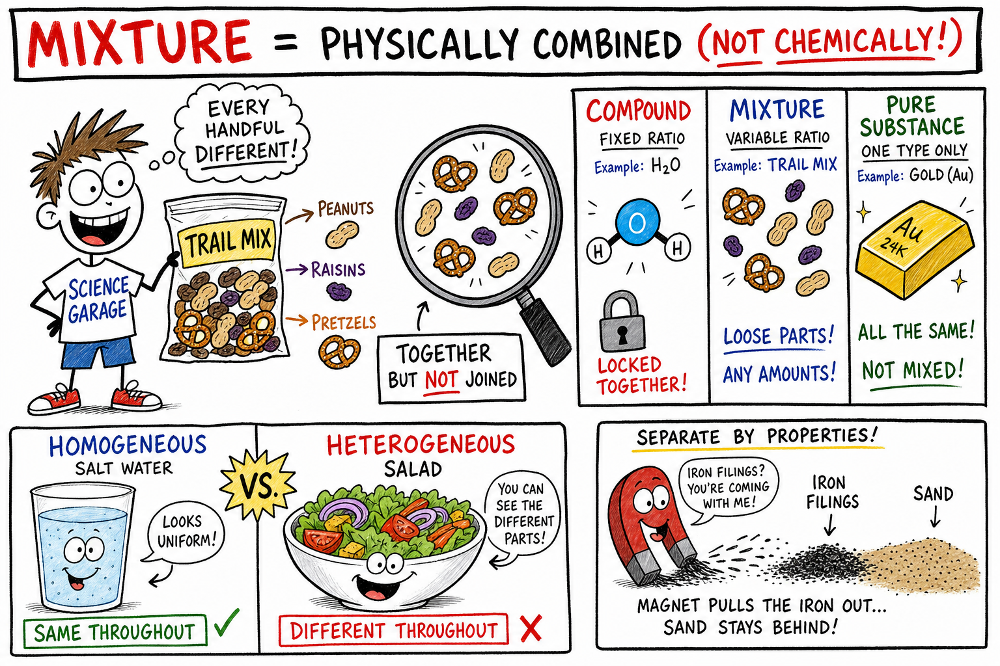
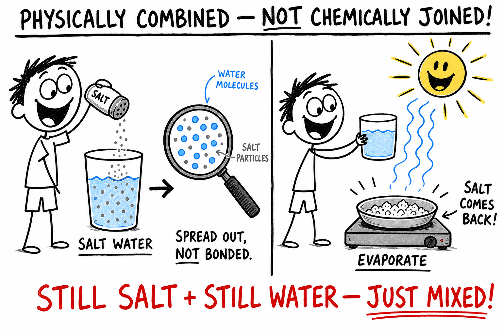
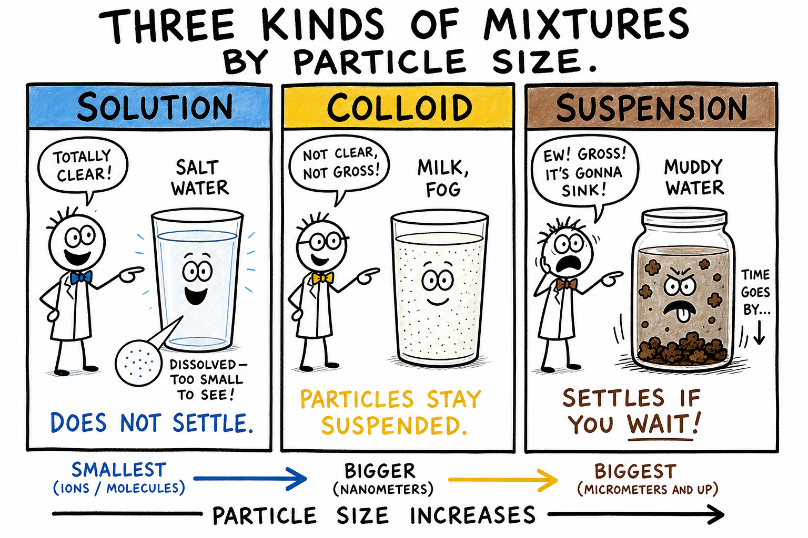
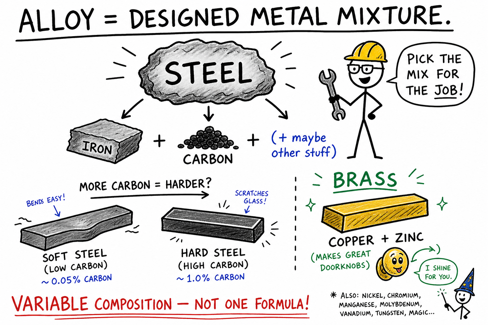
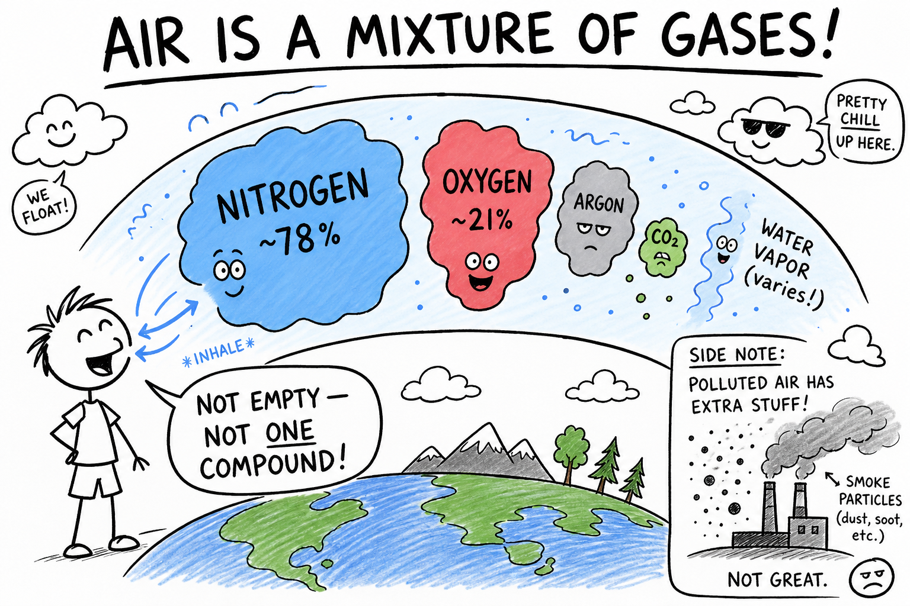
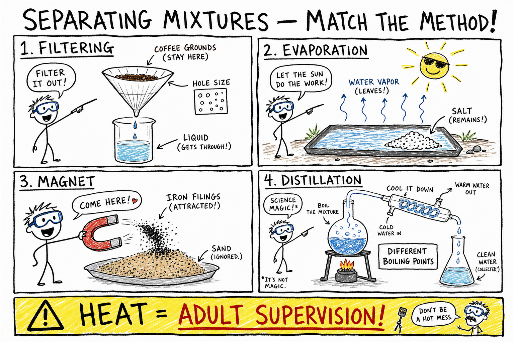
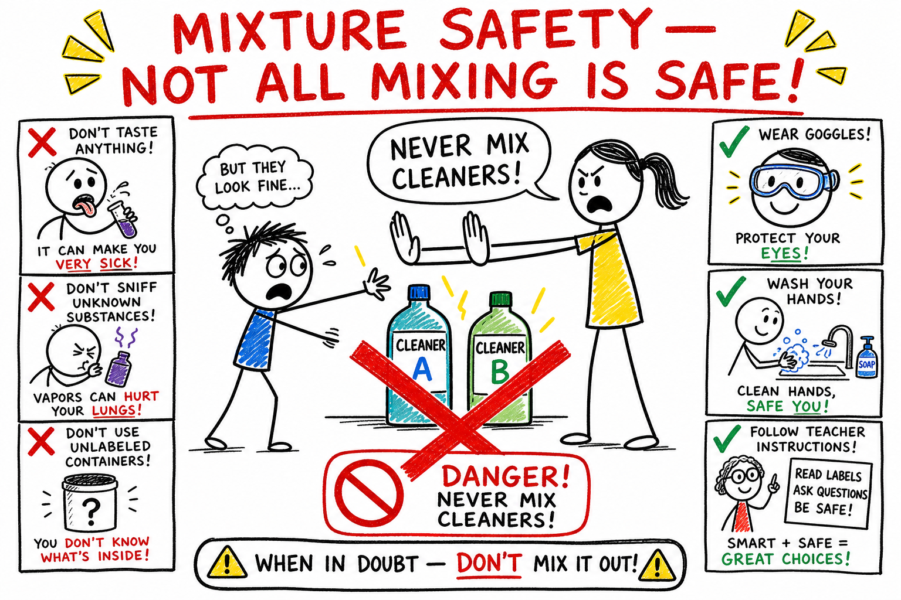

# Mixture

You pour cereal into a bowl and add milk. You shake a bottle of sports drink before a game. You watch mud settle in a puddle after rain. You sort screws, nails, and washers in a garage tray. You breathe air without thinking about it.

None of those moments look the same. But each one involves a **mixture** — matter made of two or more substances physically combined.

Open a bag of trail mix. One handful might be heavy on peanuts. The next might have more raisins. That is not a mistake. That is what mixtures do.

**A mixture is matter made of two or more substances physically combined.**

Mixtures are everywhere: air, soil, seawater, lemonade, cereal, granite, salad, paint, milk, smoke, fog, steel, and blood. Understanding mixtures helps explain cooking, cleaning, recycling, mining, medicine, weather, water treatment, and almost every hands-on science activity you will do.

As you learned in the chapters on **matter**, **elements**, **compounds**, and **molecules**, not all matter is the same kind of stuff. Mixtures sit in a special place: they combine substances without locking them into one new chemical formula.

## Mixtures and Pure Substances

A **pure substance** has a fixed composition.

- **Elements** are pure substances made of only one kind of atom.
- **Compounds** are pure substances made of two or more elements chemically joined in a fixed ratio.

Pure copper contains only copper atoms. Pure water contains water molecules in the ratio H2O.

A **mixture** does not have a fixed composition. One sample of soil may have more sand; another may have more clay. One glass of lemonade may be sweeter than another. One handful of trail mix may contain more raisins than the next.

| Type | Composition | Example | Can amounts vary? |
|------|-------------|---------|-------------------|
| Element | One kind of atom | Gold, oxygen gas | No (for a pure sample) |
| Compound | Fixed ratio of elements | Water (H2O), salt (NaCl) | No |
| Mixture | Substances physically combined | Air, trail mix, salt water | Yes |

Mixtures can vary. That flexibility is one of their defining features.

## Physically Combined

In a mixture, substances are **physically combined**.

That means the parts are together, but they are not chemically joined into one new substance.

The raisins and peanuts in trail mix do not become a new compound.

Salt dissolved in water is spread among the water particles, but the salt and water have not chemically joined into one new substance — you can often recover the salt by evaporation.

Air is a mixture of gases. Nitrogen, oxygen, argon, carbon dioxide, and water vapor are mixed together, not bonded into one "air molecule."

**Physically combined** is the opposite of **chemically joined**. Remember that phrase — it is the key to telling mixtures apart from compounds.

## Mixtures and Compounds

A mixture is different from a **compound**.

A compound is a pure substance made of two or more elements chemically joined in a fixed ratio. Water is always H2O. Table salt is always sodium and chlorine in a fixed pattern.

A mixture has substances physically combined, and the amounts can vary.

| | Mixture | Compound |
|---|---------|----------|
| How parts join | Physically combined | Chemically joined |
| Composition | Can vary | Fixed ratio |
| Formula | No single formula | Has a chemical formula |
| Separation | Often by physical methods | Usually needs chemical change |
| Properties of parts | Often keep many own properties | New properties, unlike elements |

Salt water can be very salty or only slightly salty. Air can hold more or less water vapor. Soil can contain different amounts of sand, clay, minerals, water, and organic matter.

Mixtures are flexible in composition. Compounds are fixed.

## Parts of a Mixture Keep Their Properties

The parts of a mixture usually keep many of their own properties.

In trail mix, raisins still taste like raisins and peanuts still taste like peanuts.

In sand mixed with iron filings, the iron is still magnetic.

In salt water, the water is still liquid water and the salt can still be recovered by evaporation.

This is different from many compounds. Sodium and chlorine form table salt, whose properties are very different from reactive sodium metal and poisonous chlorine gas — as you saw in the chapter on **compounds**.

Mixtures combine substances without making a completely new substance by chemical bonding.

## Homogeneous and Heterogeneous Mixtures

Mixtures are often grouped by whether they look the same throughout.

A **homogeneous mixture** has the same composition throughout. *Homogeneous* means "same throughout."

Examples include salt water, sugar water, air, vinegar, brass, and clear apple juice. If you take a small sample from one part of well-mixed salt water, it should be much like a sample from another part.

A **heterogeneous mixture** does not have the same composition throughout. *Heterogeneous* means "different throughout."

Examples include trail mix, soil, granite, salad, cereal in milk, muddy water, and concrete. In a heterogeneous mixture, you may be able to see different parts. One scoop of salad may not match the next.

| | Homogeneous | Heterogeneous |
|---|-------------|---------------|
| Composition | Same throughout | Different throughout |
| Appearance | Often uniform | Often uneven |
| Examples | Salt water, air, brass | Trail mix, soil, salad |

One common mistake: thinking a mixture must look uneven. Homogeneous mixtures can look perfectly uniform — even when several substances are present.

## Solutions, Suspensions, and Colloids

Not all mixtures behave the same way. Scientists often sort them by particle size and how evenly they spread.

A **solution** is a homogeneous mixture in which one substance is evenly dissolved in another. Salt water, sugar water, vinegar, and air are solutions. The dissolved substance does not vanish — its particles are spread out too small and too evenly for your eyes to see.

In a solution, the **solute** is the substance being dissolved. The **solvent** is the substance doing the dissolving. In salt water, salt is the solute and water is the solvent. Water is a very common solvent because it dissolves many substances — but not everything. Oil, sand, and many plastics do not dissolve well in water.

A **suspension** has particles spread through a fluid but not dissolved. Muddy water is a suspension. If it sits still, dirt may settle to the bottom. Some liquid medicines are suspensions and must be shaken before use. Suspensions are often cloudy because the particles scatter light.

A **colloid** has particles spread throughout another substance, but the particles are small enough that they do not settle quickly. Milk, fog, smoke, whipped cream, mayonnaise, and gelatin are colloids. They sit between solutions and suspensions in particle size.

| Type | Particle size (idea) | Settles? | Example |
|------|---------------------|----------|---------|
| Solution | Very small, dissolved | No | Salt water |
| Colloid | Medium, stable | Slowly or not | Milk, fog |
| Suspension | Larger, not dissolved | Often yes | Muddy water |

The next chapter on **solutions** goes deeper into dissolving, concentration, and why "dissolved" does not mean "gone."

## Alloys — Designed Mixtures

An **alloy** is a mixture of a metal with one or more other elements.

Steel is mostly iron with carbon and sometimes other elements. Brass is copper and zinc. Bronze is copper and tin.

Alloys are mixtures, not compounds, because their composition can vary. Different amounts of carbon change steel's strength, hardness, and resistance to rust. Engineers choose alloys the way builders choose lumber — for the job.

Alloys show that mixtures are not just random piles. They can be carefully designed.

## Mixtures You Meet Every Day

### Air

Air is a mixture of gases. Dry air near Earth's surface is mostly nitrogen and oxygen, with argon, carbon dioxide, and small amounts of other gases. It can also hold water vapor, dust, pollen, smoke, and tiny droplets.

Humid air has more water vapor than dry air. Polluted air has more unwanted particles or gases. The composition changes from place to place and time to time. Air is not empty space, and it is not a single compound.

### Soil

Soil is a complex mixture: sand, silt, clay, minerals, water, air, decayed plant and animal matter, and living organisms. Sandy soil drains quickly. Clay soil holds water. Rich garden soil contains organic matter that helps plants grow. Different soils support different kinds of life.

### Seawater

Seawater is water mixed with dissolved salts, minerals, gases, and tiny living things. The saltiness is called **salinity**. Most dissolved salt is sodium chloride, but many other substances are present too. Seawater can be separated into fresh water and salts by evaporation or distillation — proof that mixtures can often be taken apart physically.

## Separating Mixtures

Mixtures can often be separated by **physical methods** — without breaking chemical bonds. The best method depends on the properties of the parts.

| Method | What it uses | Example |
|--------|--------------|---------|
| Sorting | Visible differences | Separating trail mix by hand |
| Filtering | Hole size | Coffee filter, water filter |
| Sieving | Particle size | Screen for sand and gravel |
| Magnetism | Magnetic property | Iron filings from sand |
| Evaporation | Liquid vs dissolved solid | Salt from salt water |
| Distillation | Boiling points | Fresh water from salt water |
| Decanting | Settling | Pouring off clearer water above mud |
| Chromatography | Different movement speeds | Separating ink dyes on paper |

**Sorting** separates parts by size, shape, color, or type — like recycling centers sorting glass, metal, paper, and plastic.

**Filtering** passes a mixture through material with tiny holes. Coffee grounds stay behind; liquid passes through. Dissolved salt is too small for ordinary filter paper — it passes through with the water.

**Sieving** uses holes of a certain size so smaller particles pass through and larger ones stay behind.

**Magnetism** pulls magnetic materials (iron, steel, nickel, cobalt) away from nonmagnetic ones — useful in recycling and simple lab demos.

**Evaporation** removes a liquid so a dissolved solid is left behind, as in salt ponds along the coast.

**Distillation** boils a liquid, collects the vapor, and condenses it back to liquid — separating substances by boiling point. Distillation requires heat and proper equipment; use it only with adult supervision.

**Decanting** carefully pours off liquid after heavier solids have settled — often a step before filtering.

**Chromatography** separates mixture parts as they move through a material at different speeds. Paper chromatography with washable marker ink on filter paper can show that black or purple ink is itself a mixture of several dyes. Chromatography is used in chemistry, medicine, food testing, and forensic science.

A fourth common mistake: thinking every mixture separates the same way. Match the method to the property — size, magnetism, solubility, boiling point, settling, or movement through a material.

## Mixtures in Cooking, Medicine, and the Environment

**Cooking** uses mixtures constantly. Batter mixes flour, liquid, eggs, sugar, and fat. Salad dressing mixes oil, vinegar, and spices. Soup mixes water, vegetables, salt, proteins, and flavors. Some cooking mixtures are solutions; some are suspensions or colloids; some change chemically when heated. Cooking is kitchen chemistry.

**Medicines** may be solutions, suspensions, or creamy mixtures of oils, water, waxes, and active ingredients. Liquid suspensions often must be shaken so each dose is even. Medical mixtures must be prepared carefully — labels, measurements, and instructions matter. Never take or mix medicines without adult supervision.

The **environment** is full of mixtures: air, soil, river water, seawater, smoke, and fog. Pollution often means harmful substances mixed into air, water, or soil. Cleaning polluted mixtures is hard because unwanted material may be dissolved, suspended, or chemically changed. Environmental scientists use separation methods, testing, and careful chemistry to study and protect water, air, soil, and living things.

## Mixtures Can Change — Safely or Not

Mixtures can be changed without necessarily making new substances. You can stir, shake, dissolve, filter, sort, heat, cool, or evaporate a mixture. Many of those changes are physical.

But mixtures can also contain substances that **react chemically**. Mixing vinegar and baking soda produces new substances, including carbon dioxide gas.

Not every mixing is safe. Some mixtures react dangerously — especially household cleaners, acids, bases, fuels, or unknown chemicals. A fifth common mistake is thinking mixing is always harmless. It is not.

## Common Misconceptions

One mistake is thinking a mixture must look uneven. Homogeneous mixtures can look the same throughout.

Another mistake is thinking dissolved substances disappear. They are still present, spread out as particles.

A third mistake is thinking mixtures have fixed formulas like compounds. Mixtures can vary in composition.

A fourth mistake is thinking all mixtures separate the same way. Separation depends on the properties of the parts.

A fifth mistake is thinking mixing is always safe. Some combined substances can react dangerously.

## Mixture Safety

Mixtures are common, but they still require care.

Good safety habits include:

- Do not taste mixtures during science activities.
- Do not smell unknown mixtures directly.
- Do not mix household cleaners or chemicals without adult instruction.
- Wear goggles when an activity requires them.
- Keep powders away from eyes and lungs.
- Use heat only with adult supervision.
- Label containers clearly.
- Wash hands after handling experiment materials.
- Clean spills with adult guidance.
- Follow teacher instructions for disposal.

Mixtures can contain safe substances, harmful substances, or substances that become dangerous when combined. Treat unknown mixtures as unsafe until an adult says otherwise.

## The Big Idea

A mixture is matter made of two or more substances physically combined.

Mixtures can vary in composition, and their parts usually keep many of their own properties. They may be homogeneous or heterogeneous, and they include solutions, suspensions, colloids, alloys, air, soil, seawater, foods, medicines, and environmental materials. Mixtures can often be separated by physical methods such as sorting, filtering, sieving, magnetism, evaporation, distillation, decanting, and chromatography.

If you remember only one sentence, remember this:

**A mixture combines substances physically, not chemically, so its composition can vary and its parts can often be separated by physical methods.**

## Study Questions

1. What is a mixture?
2. What is a pure substance?
3. Why does a mixture not have a fixed composition?
4. What does physically combined mean?
5. How is a mixture different from a compound? Use the comparison table if it helps.
6. Why do parts of a mixture often keep their own properties?
7. What is a homogeneous mixture?
8. Give three examples of homogeneous mixtures.
9. What is a heterogeneous mixture?
10. Give three examples of heterogeneous mixtures.
11. What is a solution?
12. What is the solute? What is the solvent?
13. What is a suspension? Why may suspensions need shaking?
14. What is a colloid? Give three examples.
15. What is an alloy? Why is steel an example?
16. Why is air a mixture?
17. Why is soil a mixture?
18. What is salinity?
19. Name six methods for separating mixtures.
20. Why can ordinary filtering not remove dissolved salt from water?
21. What is evaporation useful for when separating mixtures?
22. What is distillation?
23. What is chromatography?
24. Name two common misconceptions about mixtures.
25. What are three safety rules for studying mixtures?
26. In your own words, explain why knowing about mixtures helps you understand things you see and do every day — from breakfast to recycling to the air you breathe.
